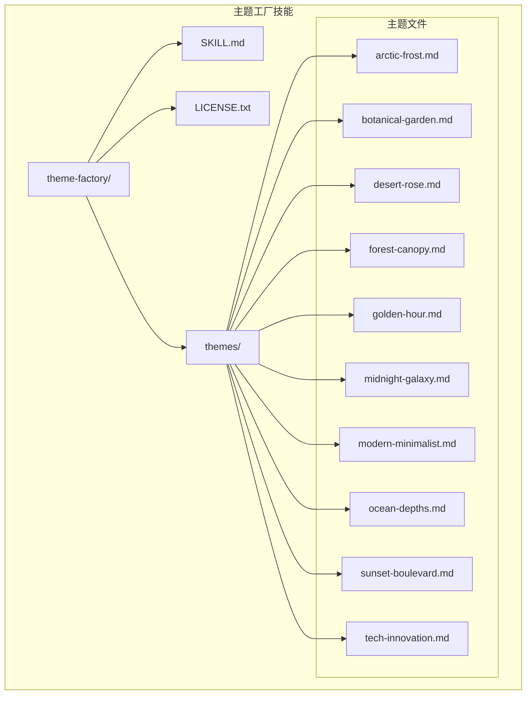
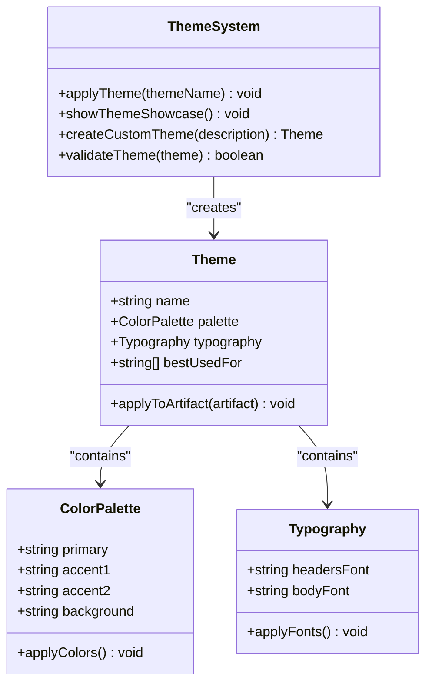
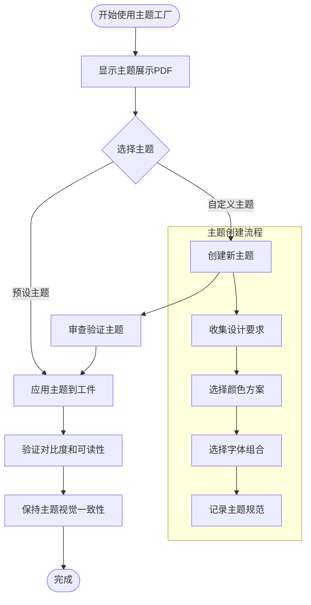
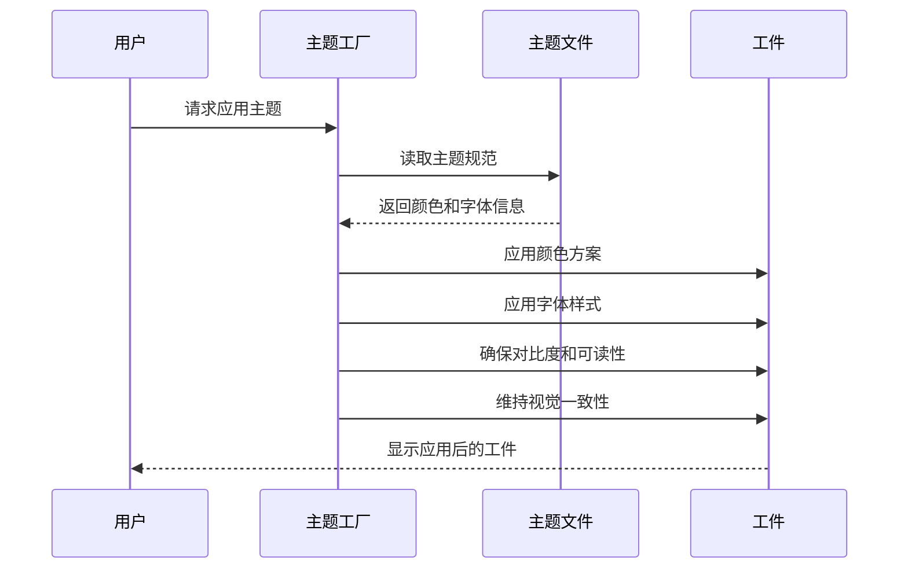
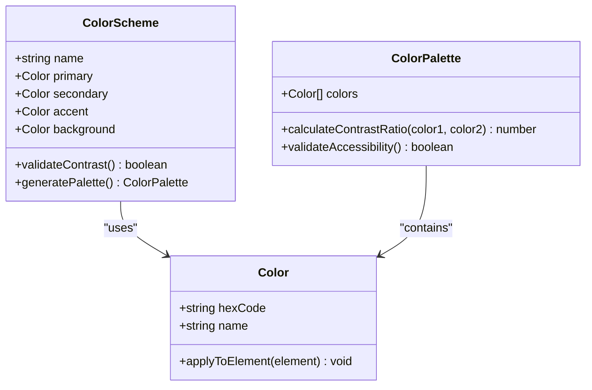
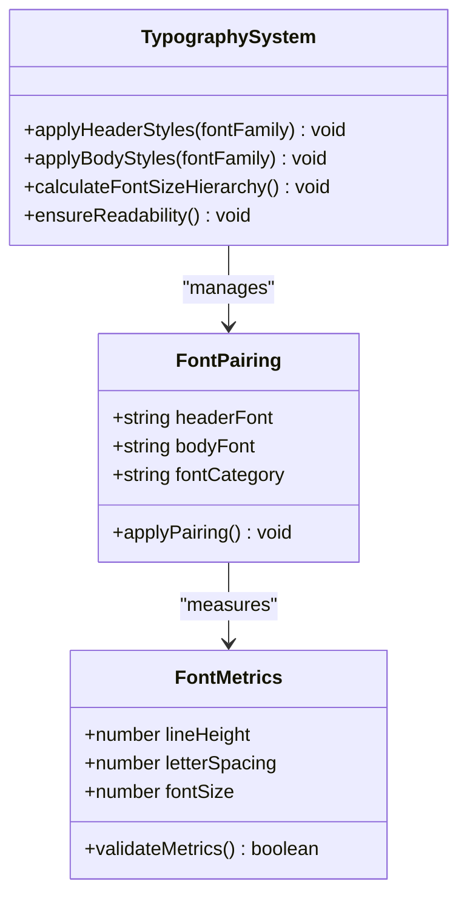
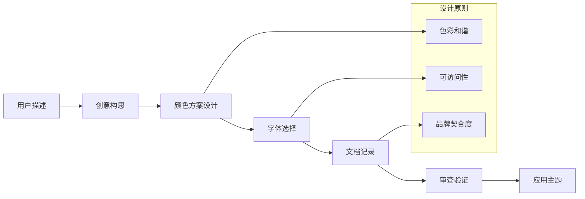
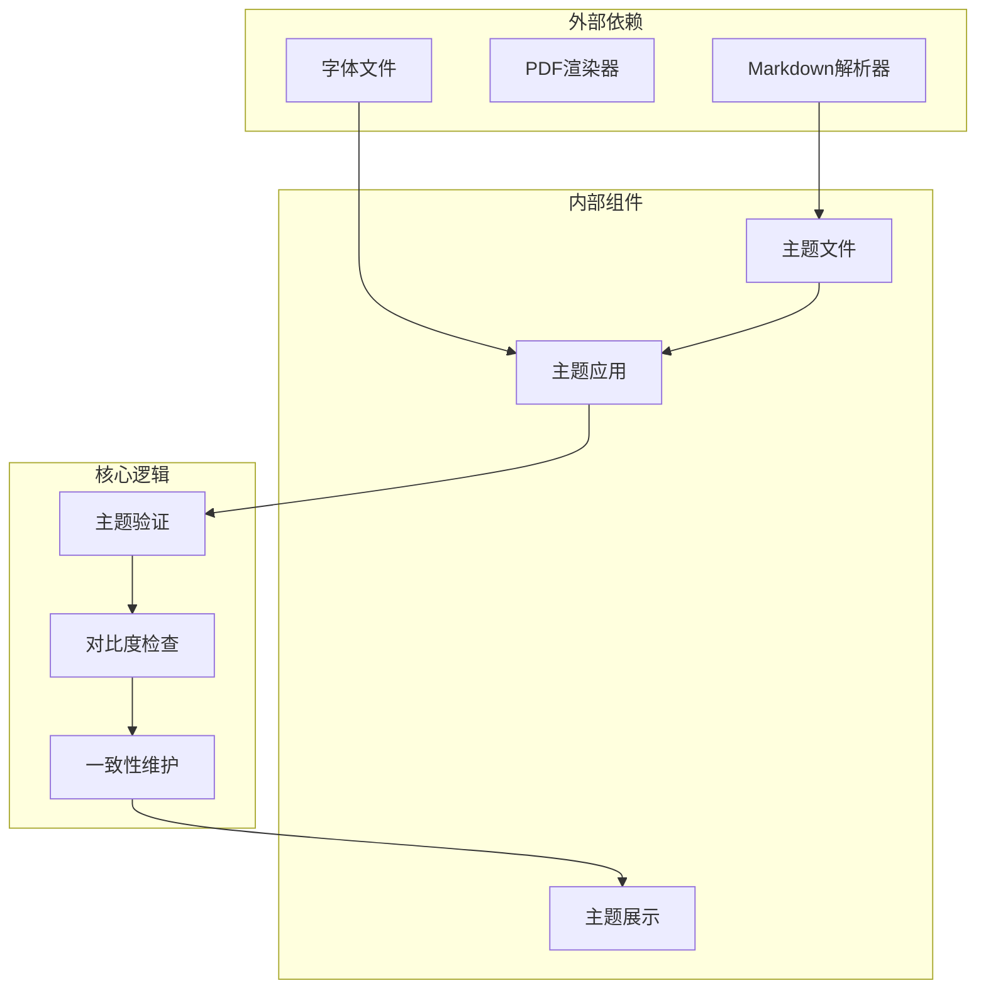

# 主题工厂技能

<cite>
**本文档引用的文件**
- [SKILL.md](file://skills/theme-factory/SKILL.md)
- [LICENSE.txt](file://skills/theme-factory/LICENSE.txt)
- [arctic-frost.md](file://skills/theme-factory/themes/arctic-frost.md)
- [botanical-garden.md](file://skills/theme-factory/themes/botanical-garden.md)
- [desert-rose.md](file://skills/theme-factory/themes/desert-rose.md)
- [forest-canopy.md](file://skills/theme-factory/themes/forest-canopy.md)
- [golden-hour.md](file://skills/theme-factory/themes/golden-hour.md)
- [midnight-galaxy.md](file://skills/theme-factory/themes/midnight-galaxy.md)
- [modern-minimalist.md](file://skills/theme-factory/themes/modern-minimalist.md)
- [ocean-depths.md](file://skills/theme-factory/themes/ocean-depths.md)
- [sunset-boulevard.md](file://skills/theme-factory/themes/sunset-boulevard.md)
- [tech-innovation.md](file://skills/theme-factory/themes/tech-innovation.md)
- [README.md](file://README.md)
</cite>

## 目录
1. [简介](#简介)
2. [项目结构](#项目结构)
3. [核心组件](#核心组件)
4. [架构概览](#架构概览)
5. [详细组件分析](#详细组件分析)
6. [依赖关系分析](#依赖关系分析)
7. [性能考虑](#性能考虑)
8. [故障排除指南](#故障排除指南)
9. [结论](#结论)

## 简介

主题工厂技能是一个专业的主题设计和管理系统，为各种文档和演示文稿提供一致且专业的视觉样式。该技能包含10个精心策划的主题，每个主题都具有协调的颜色调色板和字体组合，适用于不同的场景和受众。

该技能的核心目标是为演示文稿、文档、报告、HTML着陆页面等各类工件提供专业的一致性样式。通过使用这些预设主题，用户可以快速应用专业的视觉外观，而无需从头开始设计。

## 项目结构

主题工厂技能采用模块化设计，主要包含以下结构：

**图表来源**
- [SKILL.md](file://skills/theme-factory/SKILL.md#L1-L60)
- [arctic-frost.md](file://skills/theme-factory/themes/arctic-frost.md#L1-L20)

**章节来源**
- [SKILL.md](file://skills/theme-factory/SKILL.md#L1-L60)
- [README.md](file://README.md#L1-L95)

## 核心组件

### 主题系统架构

主题工厂技能的核心是基于Markdown文件的主题定义系统。每个主题都是一个独立的Markdown文件，包含完整的设计规范：

**图表来源**
- [SKILL.md](file://skills/theme-factory/SKILL.md#L43-L48)

### 预设主题集合

系统包含10个精心设计的预设主题，每个主题都有独特的设计理念和应用场景：

| 主题名称 | 设计理念 | 主要色彩 | 字体组合 | 适用场景 |
|---------|----------|----------|----------|----------|
| 北极寒霜 | 凉爽清新的冬日主题 | 冰蓝、钢蓝、银色 | DejaVu Sans Bold/DejaVu Sans | 医疗保健、科技解决方案、冬季运动 |
| 植物花园 | 新鲜有机的花园主题 | 薰衣草绿、万寿菊、焦糖 | DejaVu Serif Bold/DejaVu Sans | 花园中心、农场到餐桌内容 |
| 沙漠玫瑰 | 柔和优雅的尘色调主题 | 玫瑰粉、粘土、沙色 | FreeSans Bold/FreeSans | 时尚品牌、美容产品 |
| 森林树冠 | 自然稳重的大地色调 | 森林绿、鼠尾草、橄榄 | FreeSerif Bold/FreeSans | 环境保护、可持续发展 |
| 黄金时刻 | 温暖丰富的秋日色调 | 芥末黄、焦油红、暖米色 | FreeSans Bold/FreeSans | 餐厅、酒店、手工艺品 |
| 午夜银河 | 戏剧性的深紫色主题 | 深紫、宇宙蓝、薰衣草 | FreeSans Bold/FreeSans | 娱乐产业、游戏、奢侈品 |
| 现代极简主义 | 干净现代的灰度主题 | 炭黑、石板灰、浅灰 | DejaVu Sans Bold/DejaVu Sans | 科技演示、建筑设计 |
| 海洋深度 | 专业宁静的海洋主题 | 深蓝、海豹、海藻绿 | DejaVu Sans Bold/DejaVu Sans | 企业演示、金融报告 |
| 日落大道 | 活力四射的夕阳主题 | 烧烤橙、珊瑚、温暖沙色 | DejaVu Serif Bold/DejaVu Sans | 创意提案、营销演示 |
| 科技创新 | 大胆现代的高对比度主题 | 电蓝、霓虹青、深灰 | DejaVu Sans Bold/DejaVu Sans | 科技初创公司、AI演示 |

**章节来源**
- [SKILL.md](file://skills/theme-factory/SKILL.md#L28-L41)
- [arctic-frost.md](file://skills/theme-factory/themes/arctic-frost.md#L1-L20)
- [botanical-garden.md](file://skills/theme-factory/themes/botanical-garden.md#L1-L20)
- [desert-rose.md](file://skills/theme-factory/themes/desert-rose.md#L1-L20)
- [forest-canopy.md](file://skills/theme-factory/themes/forest-canopy.md#L1-L20)
- [golden-hour.md](file://skills/theme-factory/themes/golden-hour.md#L1-L20)
- [midnight-galaxy.md](file://skills/theme-factory/themes/midnight-galaxy.md#L1-L20)
- [modern-minimalist.md](file://skills/theme-factory/themes/modern-minimalist.md#L1-L20)
- [ocean-depths.md](file://skills/theme-factory/themes/ocean-depths.md#L1-L20)
- [sunset-boulevard.md](file://skills/theme-factory/themes/sunset-boulevard.md#L1-L20)
- [tech-innovation.md](file://skills/theme-factory/themes/tech-innovation.md#L1-L20)

## 架构概览

主题工厂技能采用简洁高效的设计模式，通过标准化的主题文件格式实现主题的创建、管理和应用。

**图表来源**
- [SKILL.md](file://skills/theme-factory/SKILL.md#L19-L27)
- [SKILL.md](file://skills/theme-factory/SKILL.md#L58-L60)

## 详细组件分析

### 主题设计系统

每个主题都遵循统一的设计规范，确保在不同工件类型中的一致性表现：

**图表来源**
- [SKILL.md](file://skills/theme-factory/SKILL.md#L50-L56)

### 颜色方案管理系统

每个主题的颜色方案都经过精心设计，包含主色、强调色、背景色和对比色：

**图表来源**
- [arctic-frost.md](file://skills/theme-factory/themes/arctic-frost.md#L5-L11)
- [botanical-garden.md](file://skills/theme-factory/themes/botanical-garden.md#L5-L11)

### 字体和排版系统

字体系统采用双字体组合策略，确保标题和正文的层次感：

**图表来源**
- [arctic-frost.md](file://skills/theme-factory/themes/arctic-frost.md#L12-L15)
- [botanical-garden.md](file://skills/theme-factory/themes/botanical-garden.md#L12-L15)

### 主题变体和定制选项

系统支持创建自定义主题，基于用户提供的描述生成符合要求的主题：

**图表来源**
- [SKILL.md](file://skills/theme-factory/SKILL.md#L58-L60)

**章节来源**
- [SKILL.md](file://skills/theme-factory/SKILL.md#L10-L17)
- [SKILL.md](file://skills/theme-factory/SKILL.md#L43-L48)

## 依赖关系分析

主题工厂技能的依赖关系相对简单，主要依赖于标准的Markdown格式和基础的样式应用能力：

**图表来源**
- [SKILL.md](file://skills/theme-factory/SKILL.md#L19-L27)
- [SKILL.md](file://skills/theme-factory/SKILL.md#L50-L56)

**章节来源**
- [SKILL.md](file://skills/theme-factory/SKILL.md#L1-L60)

## 性能考虑

主题工厂技能的设计注重效率和可扩展性：

### 文件大小优化
- 每个主题文件仅包含必要的设计信息
- 使用紧凑的Markdown格式存储主题规范
- 避免冗余的样式定义和重复信息

### 应用效率
- 主题应用过程简单直接，减少处理开销
- 支持批量应用到多个工件
- 缓存常用主题配置以提高响应速度

### 可扩展性
- 模块化的主题文件结构便于添加新主题
- 标准化的主题格式支持自动化处理
- 支持主题继承和变体创建

## 故障排除指南

### 常见问题及解决方案

**主题应用失败**
- 检查主题文件格式是否正确
- 验证字体文件是否可用
- 确认工件格式支持所选主题

**颜色对比度问题**
- 使用WCAG标准检查对比度
- 调整颜色方案以满足可访问性要求
- 考虑色盲友好的颜色组合

**字体显示异常**
- 确认目标系统安装了所需字体
- 提供字体回退方案
- 检查字体许可证兼容性

**章节来源**
- [SKILL.md](file://skills/theme-factory/SKILL.md#L50-L56)

## 结论

主题工厂技能提供了一个完整、灵活且易于使用的主题设计和管理系统。通过10个精心设计的预设主题和强大的自定义能力，该系统能够满足各种企业视觉需求。

### 主要优势
- **一致性**：确保所有工件保持统一的视觉风格
- **专业性**：每个主题都经过专业的设计考量
- **易用性**：简单的应用流程和直观的管理界面
- **可扩展性**：支持自定义主题创建和企业品牌集成

### 最佳实践建议
- 在应用主题前先查看主题展示
- 根据目标受众和场合选择合适的主题
- 定期审查和更新主题以保持时效性
- 建立企业级主题库以支持品牌一致性

该技能为构建企业级视觉主题系统提供了坚实的基础，通过标准化的设计流程和灵活的定制能力，能够有效提升各类文档和演示的专业性和一致性。