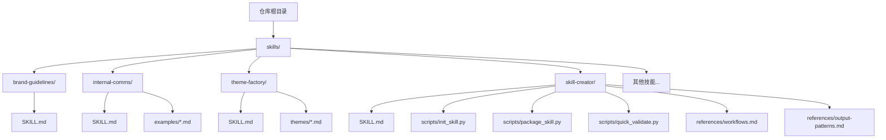
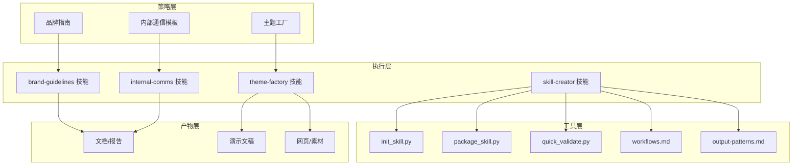
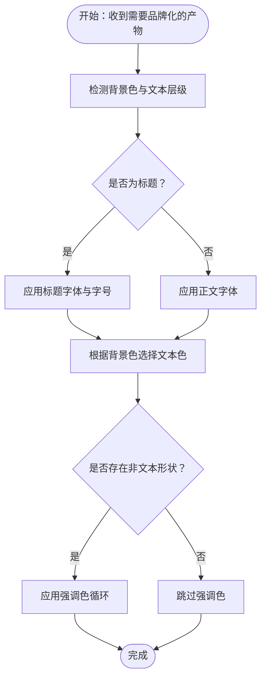
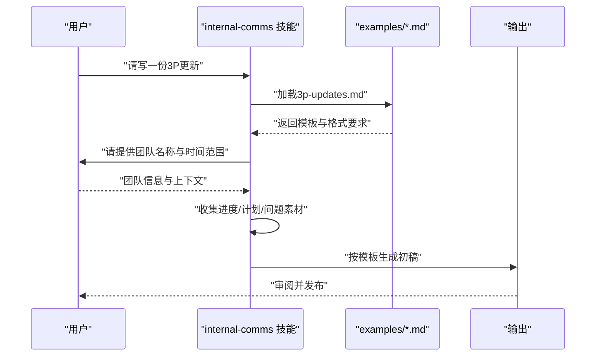
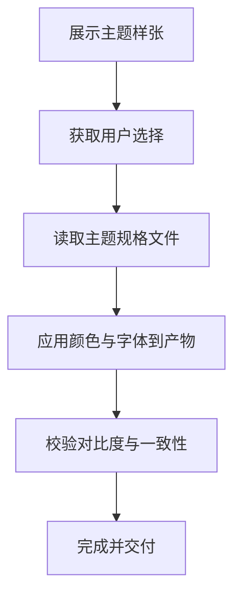
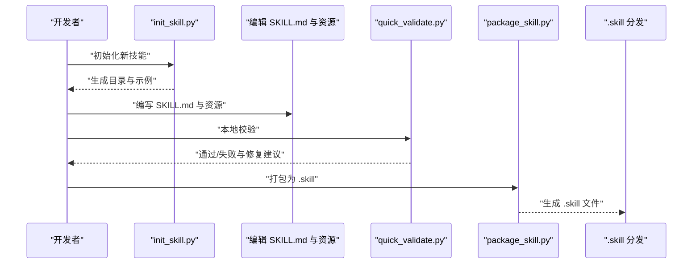
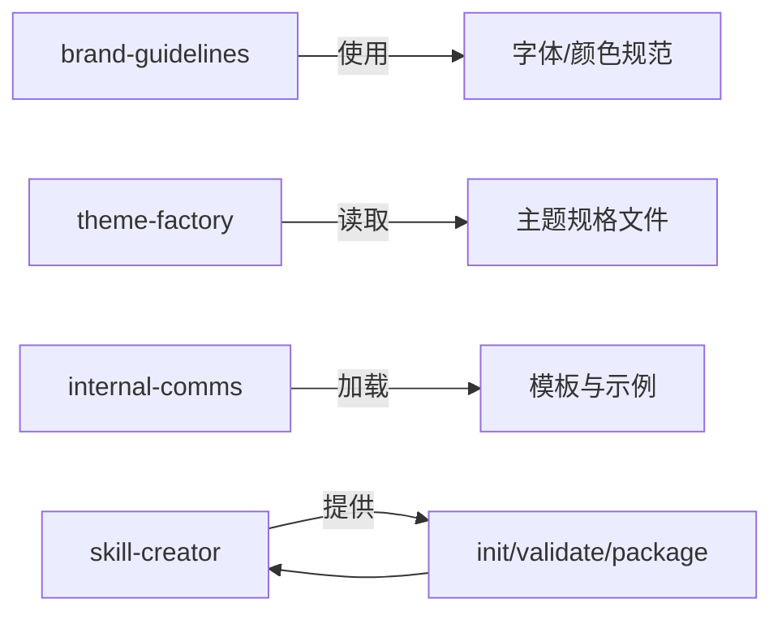

# 企业应用技能

<cite>
**本文引用的文件**
- [README.md](file://README.md)
- [SKILL.md](file://skills/brand-guidelines/SKILL.md)
- [SKILL.md](file://skills/internal-comms/SKILL.md)
- [SKILL.md](file://skills/theme-factory/SKILL.md)
- [SKILL.md](file://skills/skill-creator/SKILL.md)
- [arctic-frost.md](file://skills/theme-factory/themes/arctic-frost.md)
- [modern-minimalist.md](file://skills/theme-factory/themes/modern-minimalist.md)
- [3p-updates.md](file://skills/internal-comms/examples/3p-updates.md)
- [company-newsletter.md](file://skills/internal-comms/examples/company-newsletter.md)
- [init_skill.py](file://skills/skill-creator/scripts/init_skill.py)
- [package_skill.py](file://skills/skill-creator/scripts/package_skill.py)
- [quick_validate.py](file://skills/skill-creator/scripts/quick_validate.py)
- [workflows.md](file://skills/skill-creator/references/workflows.md)
- [output-patterns.md](file://skills/skill-creator/references/output-patterns.md)
- [SKILL.md](file://template/SKILL.md)
</cite>

## 目录
1. [简介](#简介)
2. [项目结构](#项目结构)
3. [核心组件](#核心组件)
4. [架构总览](#架构总览)
5. [详细组件分析](#详细组件分析)
6. [依赖关系分析](#依赖关系分析)
7. [性能考量](#性能考量)
8. [故障排除指南](#故障排除指南)
9. [结论](#结论)
10. [附录](#附录)

## 简介
本文件面向企业应用技能的设计与落地，围绕品牌一致性管理、内部通信模板体系、主题工厂与设计规范、企业工作流程与内容管理、以及版本与分发机制进行系统化梳理。通过品牌指南、内部通信、主题工厂三大技能，结合技能创建与打包工具链，形成从“策略—模板—执行—分发”的闭环，支撑企业级 AI 助手在多场景下的标准化与规模化应用。

## 项目结构
仓库采用按技能维度的分层组织方式，每个技能为独立目录，包含技能元数据与可选资源（脚本、参考、资产）。技能目录下统一以 SKILL.md 作为触发与导航入口，配合脚本与参考材料实现“渐进式披露”，降低上下文占用并提升可维护性。

图示来源
- [README.md](file://README.md#L24-L27)
- [SKILL.md](file://skills/brand-guidelines/SKILL.md#L1-L74)
- [SKILL.md](file://skills/internal-comms/SKILL.md#L1-L33)
- [SKILL.md](file://skills/theme-factory/SKILL.md#L1-L60)
- [SKILL.md](file://skills/skill-creator/SKILL.md#L1-L357)

章节来源
- [README.md](file://README.md#L24-L27)

## 核心组件
- 品牌指南（brand-guidelines）
  - 提供官方品牌色彩与字体规范，支持智能排版与颜色应用，确保输出物风格一致。
- 内部通信（internal-comms）
  - 提供多种内部沟通模板（3P 更新、公司通讯、FAQ 等），指导格式、语气与信息采集流程。
- 主题工厂（theme-factory）
  - 提供预设主题集合与动态主题生成能力，覆盖演示文稿、报告、网页等多类产物。
- 技能创建（skill-creator）
  - 提供技能初始化、校验与打包工具链，定义技能结构、最佳实践与工作流模式，保障可维护性与可复用性。

章节来源
- [SKILL.md](file://skills/brand-guidelines/SKILL.md#L1-L74)
- [SKILL.md](file://skills/internal-comms/SKILL.md#L1-L33)
- [SKILL.md](file://skills/theme-factory/SKILL.md#L1-L60)
- [SKILL.md](file://skills/skill-creator/SKILL.md#L1-L357)

## 架构总览
整体架构由“策略层（品牌/模板）—执行层（技能）—工具层（创建/打包/校验）—产物层（文档/演示/报告）”构成，强调可配置、可扩展与可复用。

图示来源
- [SKILL.md](file://skills/brand-guidelines/SKILL.md#L1-L74)
- [SKILL.md](file://skills/internal-comms/SKILL.md#L1-L33)
- [SKILL.md](file://skills/theme-factory/SKILL.md#L1-L60)
- [SKILL.md](file://skills/skill-creator/SKILL.md#L1-L357)
- [init_skill.py](file://skills/skill-creator/scripts/init_skill.py#L1-L304)
- [package_skill.py](file://skills/skill-creator/scripts/package_skill.py#L1-L111)
- [quick_validate.py](file://skills/skill-creator/scripts/quick_validate.py#L1-L95)
- [workflows.md](file://skills/skill-creator/references/workflows.md#L1-L28)
- [output-patterns.md](file://skills/skill-creator/references/output-patterns.md#L1-L83)

## 详细组件分析

### 品牌指南（brand-guidelines）
- 设计目标
  - 统一企业视觉语言，确保跨平台输出的一致性与专业性。
- 关键能力
  - 智能字体应用：标题与正文分别绑定指定字体族，并提供系统回退方案。
  - 文本样式：基于背景自动选择高对比度文本色，维持层级清晰。
  - 形状与强调色：非文本图形使用强调色循环，保持视觉活力。
- 技术要点
  - 字体管理：优先使用系统已安装字体，必要时回退至通用字体。
  - 颜色应用：使用精确 RGB 值，保证跨设备一致性。

图示来源
- [SKILL.md](file://skills/brand-guidelines/SKILL.md#L38-L74)

章节来源
- [SKILL.md](file://skills/brand-guidelines/SKILL.md#L1-L74)

### 内部通信（internal-comms）
- 设计目标
  - 规范内部沟通表达，提升信息传递效率与一致性。
- 模板体系
  - 3P 更新：进度、计划、问题三段式，强调数据驱动与简洁性。
  - 公司通讯：周报/月报摘要，按主题分区，突出高层公告与重大进展。
  - FAQ 回答：结构化答案，便于检索与传播。
- 工作流程
  - 明确沟通类型 → 加载对应模板 → 收集上下文 → 按模板格式输出 → 审阅与发布。

图示来源
- [SKILL.md](file://skills/internal-comms/SKILL.md#L17-L33)
- [3p-updates.md](file://skills/internal-comms/examples/3p-updates.md#L1-L47)
- [company-newsletter.md](file://skills/internal-comms/examples/company-newsletter.md#L1-L66)

章节来源
- [SKILL.md](file://skills/internal-comms/SKILL.md#L1-L33)
- [3p-updates.md](file://skills/internal-comms/examples/3p-updates.md#L1-L47)
- [company-newsletter.md](file://skills/internal-comms/examples/company-newsletter.md#L1-L66)

### 主题工厂（theme-factory）
- 设计目标
  - 为演示文稿、报告、网页等产物提供即插即用的专业主题，统一色彩与字体组合。
- 主题集合
  - 预设主题：海洋深潜、日落大道、森林树冠、现代极简、金色时刻、北极寒霜、沙漠玫瑰、科技创新、植物花园、午夜星河等。
- 主题详情
  - 每个主题包含：配色表（含十六进制值）、标题与正文字体、适用场景建议。
- 应用流程
  - 展示主题样张 → 获取选择 → 读取主题规格 → 应用到产物 → 校验对比度与一致性。

图示来源
- [SKILL.md](file://skills/theme-factory/SKILL.md#L19-L60)
- [arctic-frost.md](file://skills/theme-factory/themes/arctic-frost.md#L1-L20)
- [modern-minimalist.md](file://skills/theme-factory/themes/modern-minimalist.md#L1-L20)

章节来源
- [SKILL.md](file://skills/theme-factory/SKILL.md#L1-L60)
- [arctic-frost.md](file://skills/theme-factory/themes/arctic-frost.md#L1-L20)
- [modern-minimalist.md](file://skills/theme-factory/themes/modern-minimalist.md#L1-L20)

### 技能创建（skill-creator）
- 设计目标
  - 提供标准化的技能开发、校验与分发流程，确保技能质量与可维护性。
- 结构与资源
  - SKILL.md：元数据（name/description）+ 指令正文。
  - scripts/：可执行脚本，用于确定性操作与重复任务。
  - references/：按需加载的参考文档，支持渐进式披露。
  - assets/：输出使用的模板、图标、字体等资源。
- 工作流与最佳实践
  - 渐进式披露：元数据始终在上下文，正文按需加载，资源按需读取。
  - 自由度匹配：脆弱或高变异任务采用低自由度脚本；开放场景采用高自由度文本指令。
  - 内容组织：将详细信息放入 references，SKILL.md 保持精炼导航。
- 工具链
  - 初始化：生成标准目录与示例文件，便于快速起步。
  - 校验：检查元数据格式、命名规范、长度限制等。
  - 打包：将技能目录打包为 .skill 文件，便于分发与集成。

图示来源
- [SKILL.md](file://skills/skill-creator/SKILL.md#L47-L127)
- [init_skill.py](file://skills/skill-creator/scripts/init_skill.py#L1-L304)
- [quick_validate.py](file://skills/skill-creator/scripts/quick_validate.py#L1-L95)
- [package_skill.py](file://skills/skill-creator/scripts/package_skill.py#L1-L111)
- [workflows.md](file://skills/skill-creator/references/workflows.md#L1-L28)
- [output-patterns.md](file://skills/skill-creator/references/output-patterns.md#L1-L83)
- [SKILL.md](file://template/SKILL.md#L1-L59)

章节来源
- [SKILL.md](file://skills/skill-creator/SKILL.md#L1-L357)
- [init_skill.py](file://skills/skill-creator/scripts/init_skill.py#L1-L304)
- [quick_validate.py](file://skills/skill-creator/scripts/quick_validate.py#L1-L95)
- [package_skill.py](file://skills/skill-creator/scripts/package_skill.py#L1-L111)
- [workflows.md](file://skills/skill-creator/references/workflows.md#L1-L28)
- [output-patterns.md](file://skills/skill-creator/references/output-patterns.md#L1-L83)
- [SKILL.md](file://template/SKILL.md#L1-L59)

## 依赖关系分析
- 组件内聚与耦合
  - 各技能相对独立，通过 SKILL.md 的元数据触发；脚本与参考文档按需加载，降低耦合。
- 外部依赖
  - 字体与颜色：依赖系统字体与 RGB 颜色模型；主题工厂依赖主题规格文件。
  - 工具链：技能创建依赖 Python 生态与 ZIP 打包。
- 循环依赖
  - 未发现直接循环；工具链服务于技能开发，不反向依赖技能。

图示来源
- [SKILL.md](file://skills/brand-guidelines/SKILL.md#L60-L74)
- [SKILL.md](file://skills/theme-factory/SKILL.md#L43-L60)
- [SKILL.md](file://skills/internal-comms/SKILL.md#L17-L33)
- [SKILL.md](file://skills/skill-creator/SKILL.md#L202-L212)

章节来源
- [SKILL.md](file://skills/brand-guidelines/SKILL.md#L60-L74)
- [SKILL.md](file://skills/theme-factory/SKILL.md#L43-L60)
- [SKILL.md](file://skills/internal-comms/SKILL.md#L17-L33)
- [SKILL.md](file://skills/skill-creator/SKILL.md#L202-L212)

## 性能考量
- 上下文窗口优化
  - 采用渐进式披露：仅在需要时加载 SKILL.md 正文与参考文档，减少 token 占用。
- 脚本化确定性任务
  - 将重复性强、易出错的操作封装为脚本，提高稳定性与执行效率。
- 输出一致性
  - 使用模板与示例模式，降低歧义，减少反复修正成本。
- 版本与分发
  - 通过 .skill 文件统一打包与分发，便于版本控制与回滚。

## 故障排除指南
- 常见问题与解决
  - SKILL.md 缺失或格式错误：检查 YAML frontmatter 是否存在且格式正确。
  - 名称/描述不符合规范：确保名称为短横线连接的小写标识，描述不包含尖括号且长度在限制内。
  - 资源未按需加载：确认 references 与 assets 的组织结构与引用路径。
  - 打包失败：先运行校验脚本定位问题，修复后再打包。
- 推荐流程
  - 开发前：使用初始化脚本生成标准结构。
  - 开发中：逐步完善 SKILL.md 与资源，持续本地校验。
  - 发布前：打包为 .skill 并进行回归测试。

章节来源
- [quick_validate.py](file://skills/skill-creator/scripts/quick_validate.py#L12-L86)
- [package_skill.py](file://skills/skill-creator/scripts/package_skill.py#L19-L83)
- [init_skill.py](file://skills/skill-creator/scripts/init_skill.py#L194-L271)

## 结论
通过品牌指南、内部通信模板与主题工厂三大技能，结合技能创建的工具链，企业可在 AI 助手平台上实现“策略—模板—执行—分发”的闭环。该体系强调一致性、可复用性与可维护性，适合在大型组织中推广与迭代，支撑跨部门、跨场景的标准化内容生产与品牌呈现。

## 附录
- 快速参考
  - 品牌指南：统一色彩与字体，自动适配文本色与形状强调色。
  - 内部通信：按模板生成 3P 更新、公司通讯与 FAQ，强调简洁与数据驱动。
  - 主题工厂：预置主题与动态生成，覆盖演示文稿与网页等多类产物。
  - 技能创建：标准化开发、校验与打包流程，保障质量与可维护性。