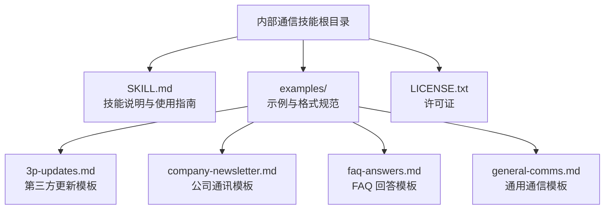
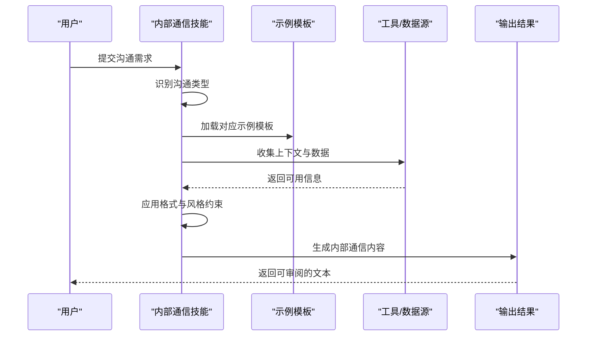
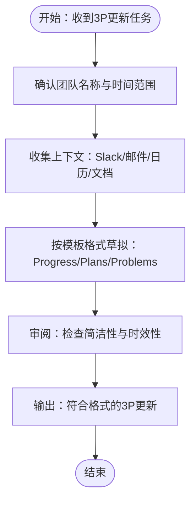
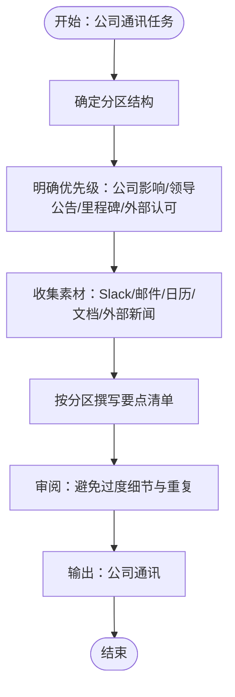
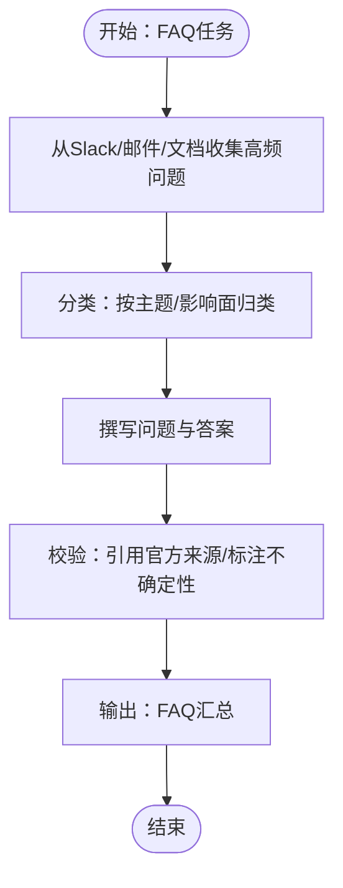
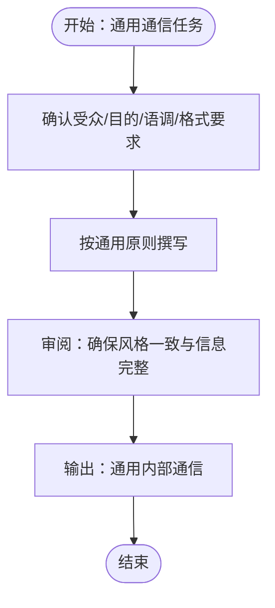
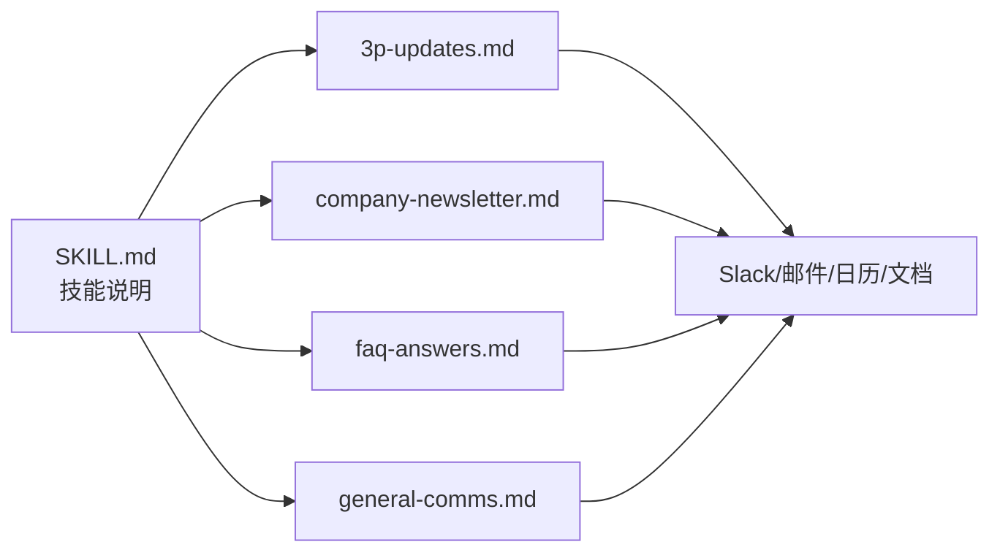

# 内部通信技能

<cite>
**本文引用的文件**
- [skills/internal-comms/SKILL.md](file://skills/internal-comms/SKILL.md)
- [skills/internal-comms/examples/3p-updates.md](file://skills/internal-comms/examples/3p-updates.md)
- [skills/internal-comms/examples/company-newsletter.md](file://skills/internal-comms/examples/company-newsletter.md)
- [skills/internal-comms/examples/faq-answers.md](file://skills/internal-comms/examples/faq-answers.md)
- [skills/internal-comms/examples/general-comms.md](file://skills/internal-comms/examples/general-comms.md)
- [skills/internal-comms/LICENSE.txt](file://skills/internal-comms/LICENSE.txt)
- [README.md](file://README.md)
</cite>

## 目录
1. [简介](#简介)
2. [项目结构](#项目结构)
3. [核心组件](#核心组件)
4. [架构总览](#架构总览)
5. [详细组件分析](#详细组件分析)
6. [依赖关系分析](#依赖关系分析)
7. [性能与可扩展性](#性能与可扩展性)
8. [故障排查指南](#故障排查指南)
9. [结论](#结论)
10. [附录：使用示例与最佳实践](#附录使用示例与最佳实践)

## 简介
本技能旨在为企业内部沟通提供一套标准化、可复用的模板与工作流，覆盖第三方更新（3P）、公司通讯、常见问题解答（FAQ）以及通用通信等场景。通过明确的格式规范、语气与风格指南、内容收集与审核流程，帮助组织在快速变化的业务节奏中保持一致、高效且可追溯的内部沟通体系。

## 项目结构
内部通信技能以“技能包”形式组织，每个技能由一个描述元数据与一组示例/指南组成：
- 根目录包含技能说明文件与示例集合
- 示例文件按沟通类型划分，分别定义格式、工具、优先级与排版建议
- 许可证文件采用开源许可，便于复用与二次开发

图表来源
- [skills/internal-comms/SKILL.md](file://skills/internal-comms/SKILL.md#L1-L33)
- [skills/internal-comms/examples/3p-updates.md](file://skills/internal-comms/examples/3p-updates.md#L1-L47)
- [skills/internal-comms/examples/company-newsletter.md](file://skills/internal-comms/examples/company-newsletter.md#L1-L66)
- [skills/internal-comms/examples/faq-answers.md](file://skills/internal-comms/examples/faq-answers.md#L1-L30)
- [skills/internal-comms/examples/general-comms.md](file://skills/internal-comms/examples/general-comms.md#L1-L16)

章节来源
- [skills/internal-comms/SKILL.md](file://skills/internal-comms/SKILL.md#L1-L33)
- [README.md](file://README.md#L1-L95)

## 核心组件
- 沟通类型识别与加载机制：根据请求类型选择对应示例文件作为模板与指导
- 工具与数据源：建议从 Slack、邮件、日历、文档等渠道收集上下文，确保信息权威与时效
- 格式与语气约束：严格遵循模板格式，强调简洁、数据驱动与一致性
- 审核与迭代：在生成后进行审阅，确保符合受众预期与公司风格

章节来源
- [skills/internal-comms/SKILL.md](file://skills/internal-comms/SKILL.md#L17-L30)
- [skills/internal-comms/examples/3p-updates.md](file://skills/internal-comms/examples/3p-updates.md#L14-L29)
- [skills/internal-comms/examples/company-newsletter.md](file://skills/internal-comms/examples/company-newsletter.md#L9-L18)
- [skills/internal-comms/examples/faq-answers.md](file://skills/internal-comms/examples/faq-answers.md#L10-L15)

## 架构总览
该技能采用“模板驱动 + 工具集成”的轻量架构：用户输入需求后，系统根据沟通类型加载相应示例模板，并结合可用工具收集上下文，最终输出符合格式与风格要求的内部通信内容。

图表来源
- [skills/internal-comms/SKILL.md](file://skills/internal-comms/SKILL.md#L19-L29)
- [skills/internal-comms/examples/3p-updates.md](file://skills/internal-comms/examples/3p-updates.md#L30-L37)
- [skills/internal-comms/examples/company-newsletter.md](file://skills/internal-comms/examples/company-newsletter.md#L20-L35)
- [skills/internal-comms/examples/faq-answers.md](file://skills/internal-comms/examples/faq-answers.md#L16-L21)

## 详细组件分析

### 第三方更新（3P）模板
- 目标与受众：面向管理层、团队成员与跨团队干系人，强调“进度、计划、问题”三要素
- 时间范围：通常覆盖过去一周的进展与未来一周的计划
- 格式与长度：严格格式，每部分控制在1-3句内，语言简洁、数据驱动
- 工具与数据源：Slack、Google Drive、邮件、日历等，优先选择高互动度与权威来源
- 工作流：确认范围 → 收集信息 → 草拟 → 审阅（时长控制在30-60秒）

图表来源
- [skills/internal-comms/examples/3p-updates.md](file://skills/internal-comms/examples/3p-updates.md#L30-L47)

章节来源
- [skills/internal-comms/examples/3p-updates.md](file://skills/internal-comms/examples/3p-updates.md#L1-L47)

### 公司通讯模板
- 目标与受众：面向全公司员工，强调可读性与覆盖面
- 结构与优先级：建议约20-25条要点，分段组织（如公司公告、优先事项进展、领导动态、社交更新），聚焦公司级影响、领导层公告、重大里程碑与外部认可
- 工具与数据源：Slack公告频道、邮件、日历、文档与外部新闻
- 排版建议：短句、使用“我们”口吻、包含链接以便追溯

图表来源
- [skills/internal-comms/examples/company-newsletter.md](file://skills/internal-comms/examples/company-newsletter.md#L20-L66)

章节来源
- [skills/internal-comms/examples/company-newsletter.md](file://skills/internal-comms/examples/company-newsletter.md#L1-L66)

### FAQ 回答模板
- 目标与受众：面向全体员工，消除普遍困惑，统一认知
- 数据来源：Slack提问、邮件FAQ、共享文档、日历附件中的FAQ
- 格式：问题与答案一一对应，语言专业但亲和，必要时标注不确定性与权威来源链接
- 要点：关注广泛影响的问题，避免仅针对个别团队或个人

图表来源
- [skills/internal-comms/examples/faq-answers.md](file://skills/internal-comms/examples/faq-answers.md#L16-L30)

章节来源
- [skills/internal-comms/examples/faq-answers.md](file://skills/internal-comms/examples/faq-answers.md#L1-L30)

### 通用通信模板
- 适用场景：未落入标准格式的其他内部沟通
- 前置确认：目标受众、目的、期望语调（正式/随意/紧急/信息性）、特定格式要求
- 通用原则：清晰简洁、主动语态、先说重点、包含相关链接与参考、匹配公司沟通风格

图表来源
- [skills/internal-comms/examples/general-comms.md](file://skills/internal-comms/examples/general-comms.md#L5-L16)

章节来源
- [skills/internal-comms/examples/general-comms.md](file://skills/internal-comms/examples/general-comms.md#L1-L16)

## 依赖关系分析
- 技能与示例文件：技能说明文件负责引导使用，示例文件承担具体格式与流程约束
- 工具依赖：模板建议使用 Slack、邮件、日历、文档等工具作为数据源，确保信息权威与可追溯
- 风格与品牌：虽然本技能不直接定义品牌风格，但可与品牌指南技能配合，确保视觉与文字风格一致

图表来源
- [skills/internal-comms/SKILL.md](file://skills/internal-comms/SKILL.md#L17-L29)
- [skills/internal-comms/examples/3p-updates.md](file://skills/internal-comms/examples/3p-updates.md#L14-L29)
- [skills/internal-comms/examples/company-newsletter.md](file://skills/internal-comms/examples/company-newsletter.md#L9-L18)
- [skills/internal-comms/examples/faq-answers.md](file://skills/internal-comms/examples/faq-answers.md#L10-L15)

章节来源
- [skills/internal-comms/SKILL.md](file://skills/internal-comms/SKILL.md#L17-L30)

## 性能与可扩展性
- 模板化与自动化：通过固定格式与工具集成，减少重复劳动，提升产出速度与一致性
- 可扩展性：新增沟通类型时，可在示例目录下添加新模板，并在主技能说明中补充加载逻辑
- 版本管理：建议对模板进行版本控制，记录变更历史与影响范围，便于回溯与审计

## 故障排查指南
- 沟通类型不匹配：若请求未明确属于标准类型，应提示用户提供更清晰的上下文或选择通用模板
- 数据源不可用：当无法访问 Slack/邮件/日历/文档等工具时，应引导用户提供关键信息或改用通用模板
- 格式不符：若输出不符合模板格式，应回到草稿阶段，依据示例文件逐项修正
- 语气与风格偏差：若内容过于口语化或过于正式，应回到通用原则或品牌指南进行调整

章节来源
- [skills/internal-comms/SKILL.md](file://skills/internal-comms/SKILL.md#L29-L30)
- [skills/internal-comms/examples/3p-updates.md](file://skills/internal-comms/examples/3p-updates.md#L30-L37)
- [skills/internal-comms/examples/company-newsletter.md](file://skills/internal-comms/examples/company-newsletter.md#L20-L35)
- [skills/internal-comms/examples/faq-answers.md](file://skills/internal-comms/examples/faq-answers.md#L22-L30)
- [skills/internal-comms/examples/general-comms.md](file://skills/internal-comms/examples/general-comms.md#L5-L16)

## 结论
内部通信技能通过标准化模板与工具集成，为企业提供了一套可复制、可审阅、可演进的内部沟通体系。它不仅提升了沟通效率，也确保了信息的一致性与可追溯性。建议在实际应用中结合品牌指南与工具权限，持续优化模板与流程，以适应组织规模与业务复杂度的增长。

## 附录：使用示例与最佳实践

- 使用示例
  - 第三方更新：在收到“本周3P更新”请求时，加载第三方更新模板，收集Slack与日历中的关键信息，按进度、计划、问题三段式输出
  - 公司通讯：在收到“公司周报”请求时，加载公司通讯模板，从Slack公告、邮件与文档中提取要点，按分区组织输出
  - FAQ 回答：在收到“本周FAQ”请求时，加载FAQ模板，从Slack与邮件中聚合高频问题，统一口径并标注来源
  - 通用通信：在收到非标准类型请求时，先确认受众、目的、语调与格式要求，再按通用原则撰写

- 最佳实践
  - 明确受众与目的：在开始前确认沟通对象与预期效果，有助于选择合适模板与语调
  - 严守格式与长度：遵循模板格式与句子数量限制，确保信息易读与可读
  - 引用权威来源：尽量提供链接与出处，增强可信度与可追溯性
  - 审阅与迭代：生成后进行审阅，确保简洁、准确、一致
  - 持续优化：根据反馈与使用情况，定期修订模板与流程，形成闭环

章节来源
- [skills/internal-comms/SKILL.md](file://skills/internal-comms/SKILL.md#L19-L29)
- [skills/internal-comms/examples/3p-updates.md](file://skills/internal-comms/examples/3p-updates.md#L30-L47)
- [skills/internal-comms/examples/company-newsletter.md](file://skills/internal-comms/examples/company-newsletter.md#L20-L66)
- [skills/internal-comms/examples/faq-answers.md](file://skills/internal-comms/examples/faq-answers.md#L16-L30)
- [skills/internal-comms/examples/general-comms.md](file://skills/internal-comms/examples/general-comms.md#L5-L16)