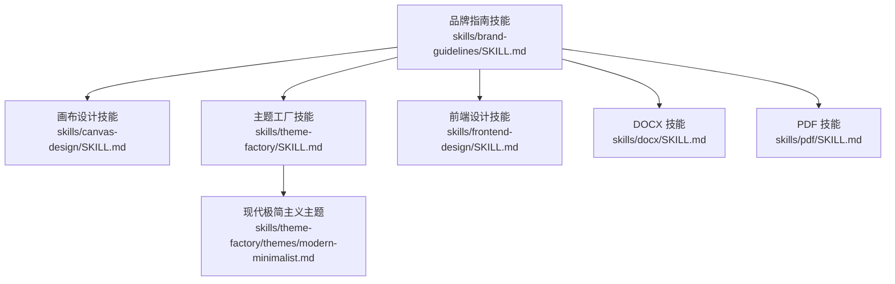
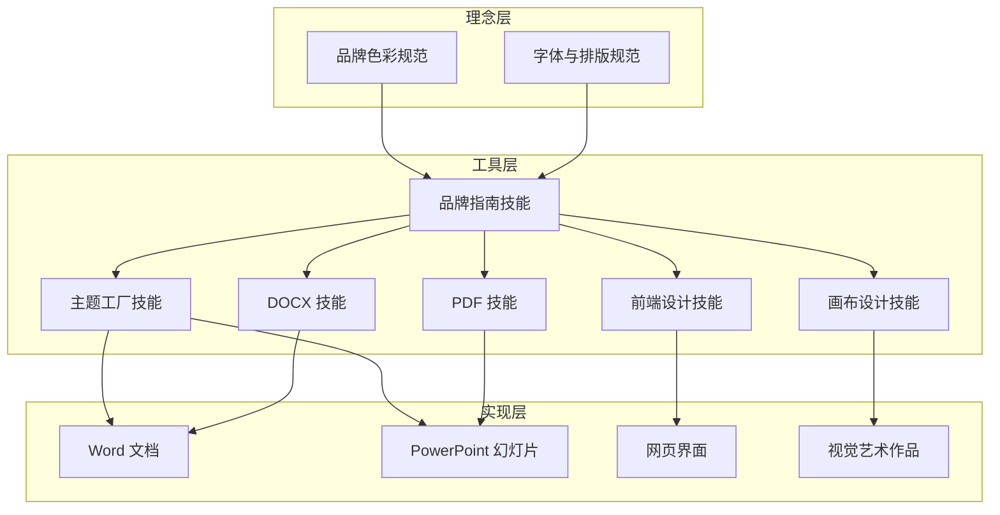
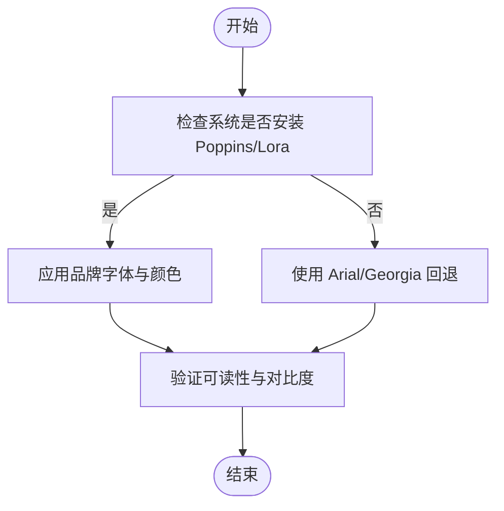
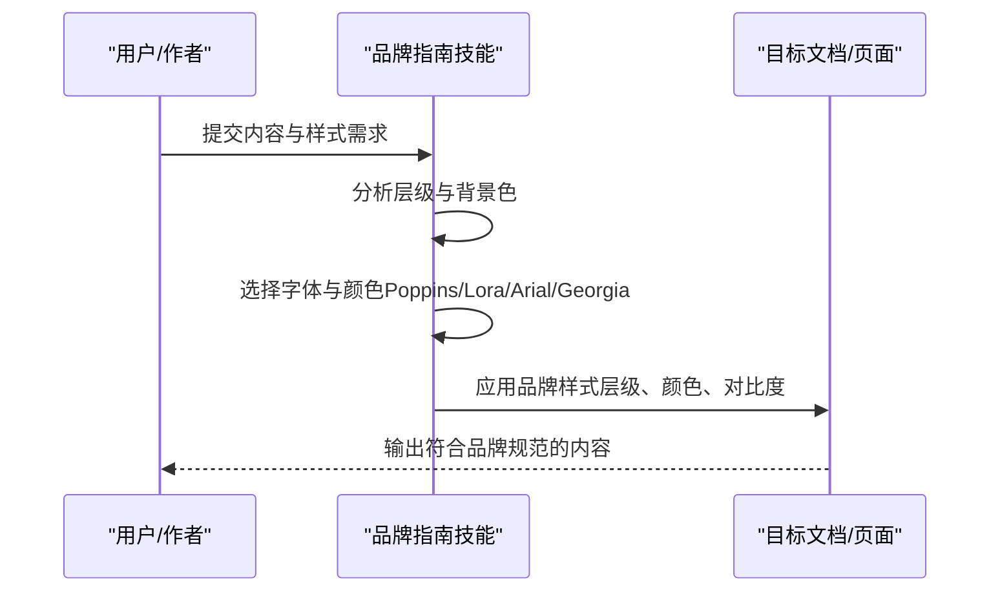
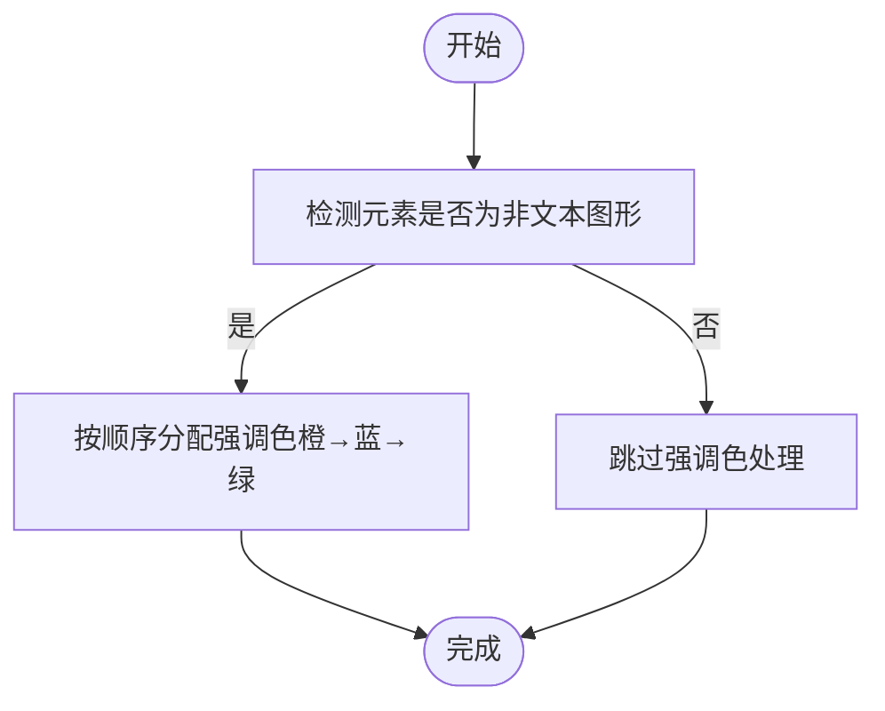
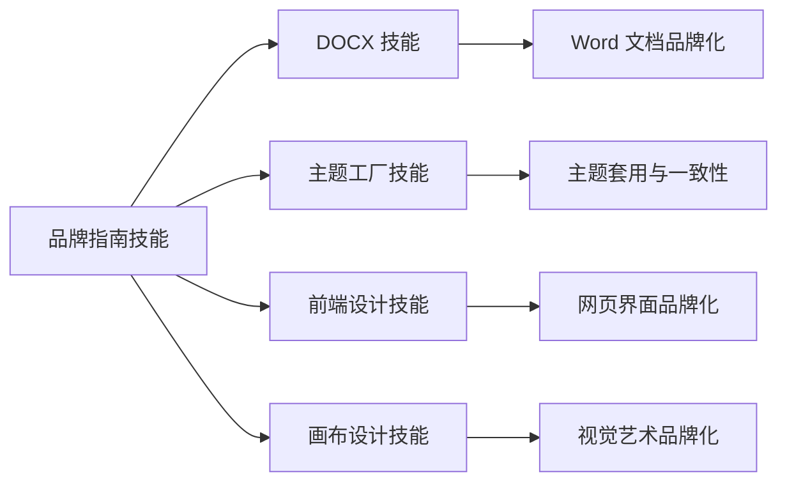
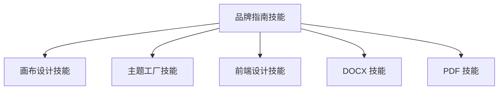

# 品牌指南技能

<cite>
**本文引用的文件**
- [品牌指南 SKILL.md](file://skills/brand-guidelines/SKILL.md)
- [品牌指南 LICENSE.txt](file://skills/brand-guidelines/LICENSE.txt)
- [画布设计 SKILL.md](file://skills/canvas-design/SKILL.md)
- [画布字体许可 Lora-OFL.txt](file://skills/canvas-design/canvas-fonts/Lora-OFL.txt)
- [前端设计 SKILL.md](file://skills/frontend-design/SKILL.md)
- [主题工厂 SKILL.md](file://skills/theme-factory/SKILL.md)
- [现代极简主义主题](file://skills/theme-factory/themes/modern-minimalist.md)
- [内部沟通 SKILL.md](file://skills/internal-comms/SKILL.md)
- [DOCX 技能 SKILL.md](file://skills/docx/SKILL.md)
- [PDF 技能 SKILL.md](file://skills/pdf/SKILL.md)
</cite>

## 目录
1. [简介](#简介)
2. [项目结构](#项目结构)
3. [核心组件](#核心组件)
4. [架构总览](#架构总览)
5. [详细组件分析](#详细组件分析)
6. [依赖关系分析](#依赖关系分析)
7. [性能考虑](#性能考虑)
8. [故障排查指南](#故障排查指南)
9. [结论](#结论)
10. [附录](#附录)

## 简介
本文件面向企业品牌管理与视觉规范落地，围绕 Anthropic 官方品牌指南技能进行系统化说明。内容涵盖品牌色彩与字体规范、智能字体应用策略、文本样式与层次处理、形状与强调色使用原则，并结合仓库中的画布设计、主题工厂、前端设计等技能，给出在文档、演示文稿、网页界面与视觉艺术中保持品牌一致性的实现路径与最佳实践。

## 项目结构
品牌指南技能位于 skills/brand-guidelines 目录，配套有画布设计、主题工厂、前端设计、DOCX、PDF 等技能，共同构成从“理念到实现”的完整品牌落地链路。

图表来源
- [品牌指南 SKILL.md](file://skills/brand-guidelines/SKILL.md#L1-L74)
- [画布设计 SKILL.md](file://skills/canvas-design/SKILL.md#L1-L130)
- [主题工厂 SKILL.md](file://skills/theme-factory/SKILL.md#L1-L60)
- [现代极简主义主题](file://skills/theme-factory/themes/modern-minimalist.md#L1-L20)
- [前端设计 SKILL.md](file://skills/frontend-design/SKILL.md#L1-L43)
- [DOCX 技能 SKILL.md](file://skills/docx/SKILL.md#L1-L197)
- [PDF 技能 SKILL.md](file://skills/pdf/SKILL.md#L1-L295)

章节来源
- [品牌指南 SKILL.md](file://skills/brand-guidelines/SKILL.md#L1-L74)
- [画布设计 SKILL.md](file://skills/canvas-design/SKILL.md#L1-L130)
- [主题工厂 SKILL.md](file://skills/theme-factory/SKILL.md#L1-L60)
- [现代极简主义主题](file://skills/theme-factory/themes/modern-minimalist.md#L1-L20)
- [前端设计 SKILL.md](file://skills/frontend-design/SKILL.md#L1-L43)
- [DOCX 技能 SKILL.md](file://skills/docx/SKILL.md#L1-L197)
- [PDF 技能 SKILL.md](file://skills/pdf/SKILL.md#L1-L295)

## 核心组件
- 品牌色彩体系：主色（深灰/浅灰/中灰）、强调色（橙/蓝/绿），用于文字、背景与非文本图形元素。
- 字体规范：标题使用 Poppins（Arial 回退），正文使用 Lora（Georgia 回退）；建议预装字体以确保一致性。
- 智能字体应用：按层级自动选择字体家族并保留可读性；文本样式遵循层级与对比度要求。
- 形状与强调色：非文本图形采用循环强调色（橙→蓝→绿），保持品牌活力与一致性。

章节来源
- [品牌指南 SKILL.md](file://skills/brand-guidelines/SKILL.md#L17-L58)

## 架构总览
品牌指南技能贯穿“理念—工具—实现”三层：
- 理念层：明确主色、强调色与字体规范，建立统一的视觉语言。
- 工具层：通过画布设计、主题工厂、前端设计、DOCX/PDF 技能将规范转化为可执行的样式策略。
- 实现层：在具体文档、演示文稿、网页界面与视觉艺术中落地，保证跨介质的一致性。

图表来源
- [品牌指南 SKILL.md](file://skills/brand-guidelines/SKILL.md#L17-L58)
- [画布设计 SKILL.md](file://skills/canvas-design/SKILL.md#L1-L130)
- [主题工厂 SKILL.md](file://skills/theme-factory/SKILL.md#L1-L60)
- [前端设计 SKILL.md](file://skills/frontend-design/SKILL.md#L1-L43)
- [DOCX 技能 SKILL.md](file://skills/docx/SKILL.md#L1-L197)
- [PDF 技能 SKILL.md](file://skills/pdf/SKILL.md#L1-L295)

## 详细组件分析

### 组件一：品牌色彩与字体规范
- 主色与强调色：深灰/浅灰/中灰用于文字与背景；橙/蓝/绿作为强调色用于图标、装饰与非文本图形。
- 字体选择与回退：标题使用 Poppins（Arial 回退），正文使用 Lora（Georgia 回退）。
- 字体管理：优先使用系统已安装字体；如不可用则自动回退至默认字体族，确保可读性与一致性。

图表来源
- [品牌指南 SKILL.md](file://skills/brand-guidelines/SKILL.md#L62-L67)
- [品牌指南 SKILL.md](file://skills/brand-guidelines/SKILL.md#L40-L45)

章节来源
- [品牌指南 SKILL.md](file://skills/brand-guidelines/SKILL.md#L17-L36)
- [品牌指南 SKILL.md](file://skills/brand-guidelines/SKILL.md#L62-L67)

### 组件二：智能字体应用与文本样式
- 标题层级：24pt 及以上使用 Poppins，确保视觉权重与品牌识别。
- 正文层级：使用 Lora，提升阅读体验与专业感。
- 颜色策略：根据背景自动选择文字颜色，保证对比度与可读性。
- 层级与格式：严格维护标题、段落、列表等层级关系，避免样式混乱。

图表来源
- [品牌指南 SKILL.md](file://skills/brand-guidelines/SKILL.md#L40-L52)

章节来源
- [品牌指南 SKILL.md](file://skills/brand-guidelines/SKILL.md#L40-L52)

### 组件三：形状与强调色使用策略
- 非文本图形：优先使用强调色（橙/蓝/绿）进行循环应用，增强视觉节奏与品牌识别。
- 使用场景：图标、分隔线、装饰元素、数据可视化标记等。
- 注意事项：避免过度使用，保持留白与层次清晰。

图表来源
- [品牌指南 SKILL.md](file://skills/brand-guidelines/SKILL.md#L54-L58)

章节来源
- [品牌指南 SKILL.md](file://skills/brand-guidelines/SKILL.md#L54-L58)

### 组件四：跨介质实现与最佳实践
- 文档（DOCX）：通过 DOCX 技能对现有文档进行品牌化重写，应用品牌字体与颜色，保持层级与可读性。
- 演示文稿（PPT/主题工厂）：利用主题工厂的配色与字体组合，快速套用到幻灯片，确保跨页一致性。
- 网页界面（前端设计）：在前端设计技能中，采用品牌色彩与字体搭配，避免通用字体与陈词滥调配色。
- 视觉艺术（画布设计）：在画布设计技能中，将品牌规范融入设计理念，使字体与色彩成为视觉表达的一部分。

图表来源
- [品牌指南 SKILL.md](file://skills/brand-guidelines/SKILL.md#L38-L58)
- [DOCX 技能 SKILL.md](file://skills/docx/SKILL.md#L1-L197)
- [主题工厂 SKILL.md](file://skills/theme-factory/SKILL.md#L1-L60)
- [前端设计 SKILL.md](file://skills/frontend-design/SKILL.md#L1-L43)
- [画布设计 SKILL.md](file://skills/canvas-design/SKILL.md#L1-L130)

章节来源
- [品牌指南 SKILL.md](file://skills/brand-guidelines/SKILL.md#L38-L58)
- [DOCX 技能 SKILL.md](file://skills/docx/SKILL.md#L1-L197)
- [主题工厂 SKILL.md](file://skills/theme-factory/SKILL.md#L1-L60)
- [前端设计 SKILL.md](file://skills/frontend-design/SKILL.md#L1-L43)
- [画布设计 SKILL.md](file://skills/canvas-design/SKILL.md#L1-L130)

### 组件五：字体管理与许可合规
- 字体许可：Lora 字体采用 SIL Open Font License 1.1，允许使用、修改、嵌入与再发布，但需保留版权与许可声明。
- 环境准备：建议在工作环境中预装 Poppins 与 Lora 字体，以减少回退带来的不一致风险。
- 合规要点：在输出文档或发布物中保留必要的版权与许可信息，避免法律风险。

章节来源
- [品牌指南 SKILL.md](file://skills/brand-guidelines/SKILL.md#L62-L67)
- [画布字体许可 Lora-OFL.txt](file://skills/canvas-design/canvas-fonts/Lora-OFL.txt#L1-L94)

## 依赖关系分析
品牌指南技能与其他技能之间存在明确的依赖与协作关系：
- 画布设计技能：将品牌规范转化为视觉理念与艺术表达，强调“少即是多”的设计哲学。
- 主题工厂技能：提供可复用的主题模板（含配色与字体），便于快速套用到演示文稿。
- 前端设计技能：指导网页界面的字体与色彩选择，避免使用通用字体与陈词滥调配色。
- DOCX/PDF 技能：提供文档与 PDF 的处理能力，支撑品牌化内容的生成与审阅流程。

图表来源
- [品牌指南 SKILL.md](file://skills/brand-guidelines/SKILL.md#L1-L74)
- [画布设计 SKILL.md](file://skills/canvas-design/SKILL.md#L1-L130)
- [主题工厂 SKILL.md](file://skills/theme-factory/SKILL.md#L1-L60)
- [前端设计 SKILL.md](file://skills/frontend-design/SKILL.md#L1-L43)
- [DOCX 技能 SKILL.md](file://skills/docx/SKILL.md#L1-L197)
- [PDF 技能 SKILL.md](file://skills/pdf/SKILL.md#L1-L295)

章节来源
- [品牌指南 SKILL.md](file://skills/brand-guidelines/SKILL.md#L1-L74)
- [画布设计 SKILL.md](file://skills/canvas-design/SKILL.md#L1-L130)
- [主题工厂 SKILL.md](file://skills/theme-factory/SKILL.md#L1-L60)
- [前端设计 SKILL.md](file://skills/frontend-design/SKILL.md#L1-L43)
- [DOCX 技能 SKILL.md](file://skills/docx/SKILL.md#L1-L197)
- [PDF 技能 SKILL.md](file://skills/pdf/SKILL.md#L1-L295)

## 性能考虑
- 字体加载与渲染：优先使用系统字体，减少网络请求与字体解析开销；在无法预装字体时，确保回退字体可用且具备良好的可读性。
- 文档体积控制：在 DOCX/PDF 处理中，尽量避免不必要的嵌入资源与重复样式，减少文件体积。
- 批量处理：在主题工厂与前端设计中，采用模板化与参数化方式，提高批量应用效率。
- 渲染一致性：在不同操作系统与浏览器中，通过回退字体与对比度校验，确保品牌视觉在各平台稳定呈现。

## 故障排查指南
- 字体未生效：确认系统是否已安装 Poppins 与 Lora；若不可用，检查回退字体配置是否正确。
- 颜色对比度不足：调整背景与文字颜色，确保满足可读性标准；必要时切换至品牌主色或强调色。
- 文档样式错乱：在 DOCX/PDF 处理中，逐段核对样式层级与段落格式，避免混用不同级别的样式。
- 主题不一致：在主题工厂中，统一选择同一主题并在各页面间保持一致的配色与字体组合。
- 前端字体显示异常：在前端设计中，避免使用通用字体，优先选用具有品牌特色的字体组合，并确保字体资源可正常加载。

章节来源
- [品牌指南 SKILL.md](file://skills/brand-guidelines/SKILL.md#L62-L73)
- [DOCX 技能 SKILL.md](file://skills/docx/SKILL.md#L183-L197)
- [PDF 技能 SKILL.md](file://skills/pdf/SKILL.md#L276-L295)
- [前端设计 SKILL.md](file://skills/frontend-design/SKILL.md#L27-L43)

## 结论
品牌指南技能为企业品牌管理提供了从理念到实现的完整路径。通过明确的品牌色彩与字体规范、智能的字体应用策略、严格的文本样式与层级管理，以及在文档、演示文稿、网页界面与视觉艺术中的系统化落地，能够有效提升品牌一致性与专业度。配合画布设计、主题工厂、前端设计、DOCX/PDF 等技能，可在不同介质与场景下稳定输出高质量的品牌内容。

## 附录
- 字体许可参考：Lora 字体采用 SIL Open Font License 1.1，允许自由使用与再发布，但需保留版权与许可声明。
- 主题工厂示例：现代极简主义主题展示了基于灰阶的配色与字体组合，适合技术类演示与专业报告。

章节来源
- [画布字体许可 Lora-OFL.txt](file://skills/canvas-design/canvas-fonts/Lora-OFL.txt#L1-L94)
- [现代极简主义主题](file://skills/theme-factory/themes/modern-minimalist.md#L1-L20)