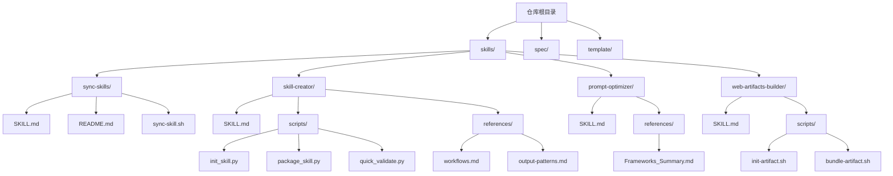
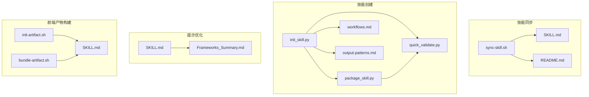
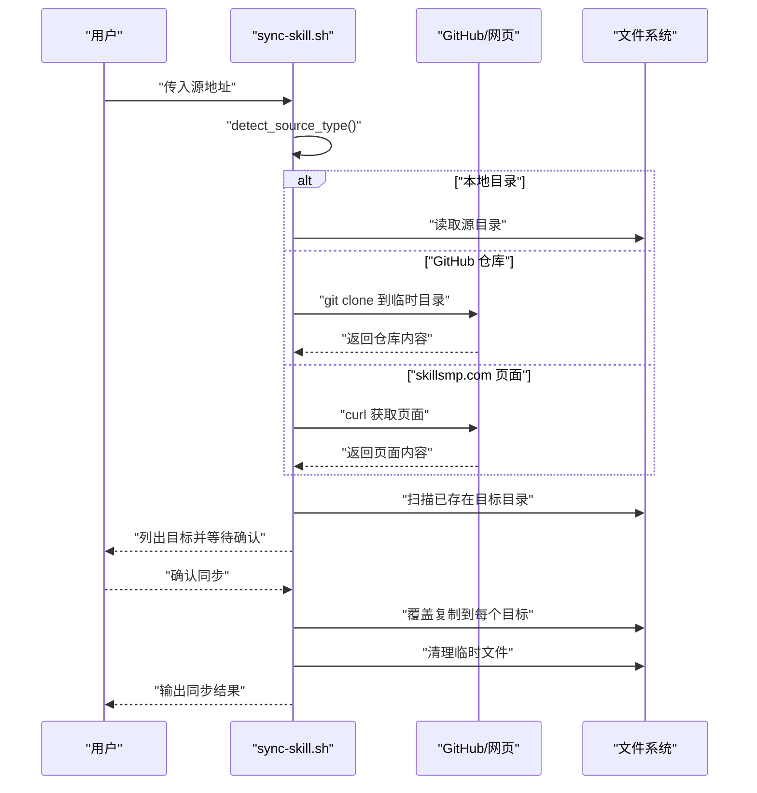
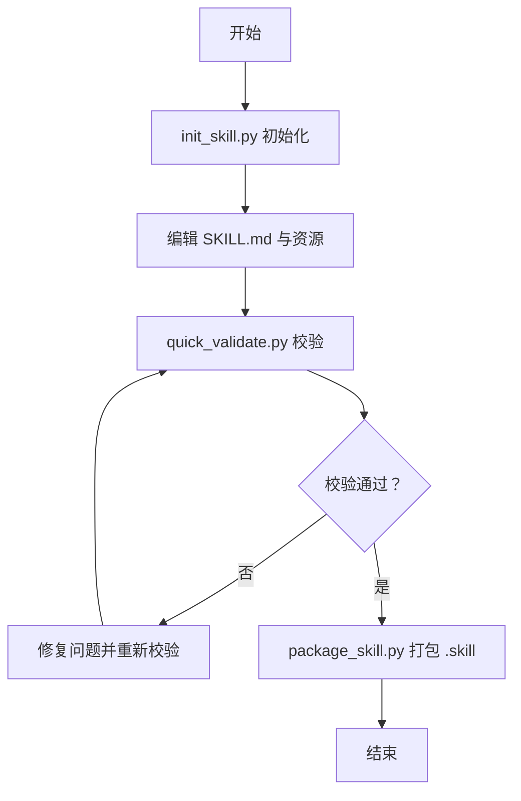
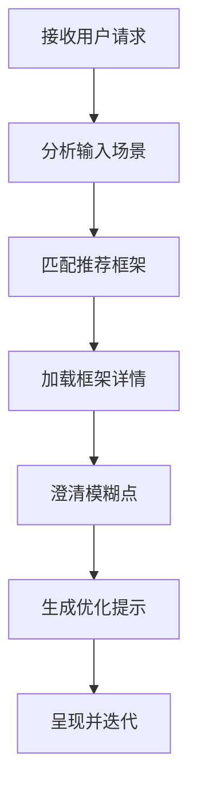
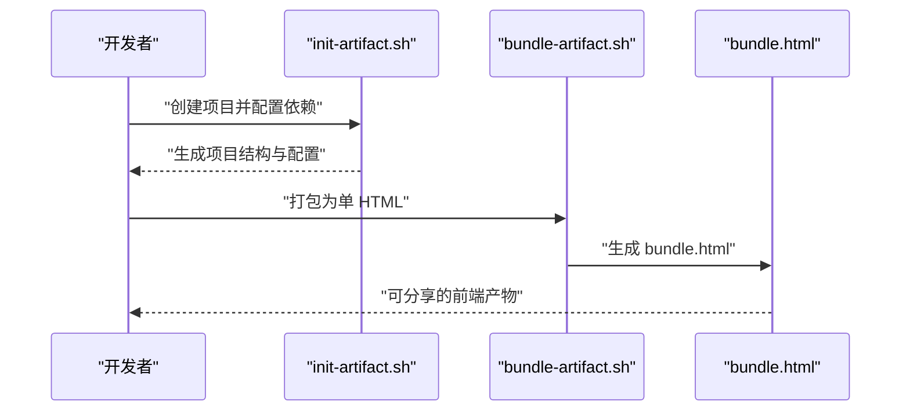
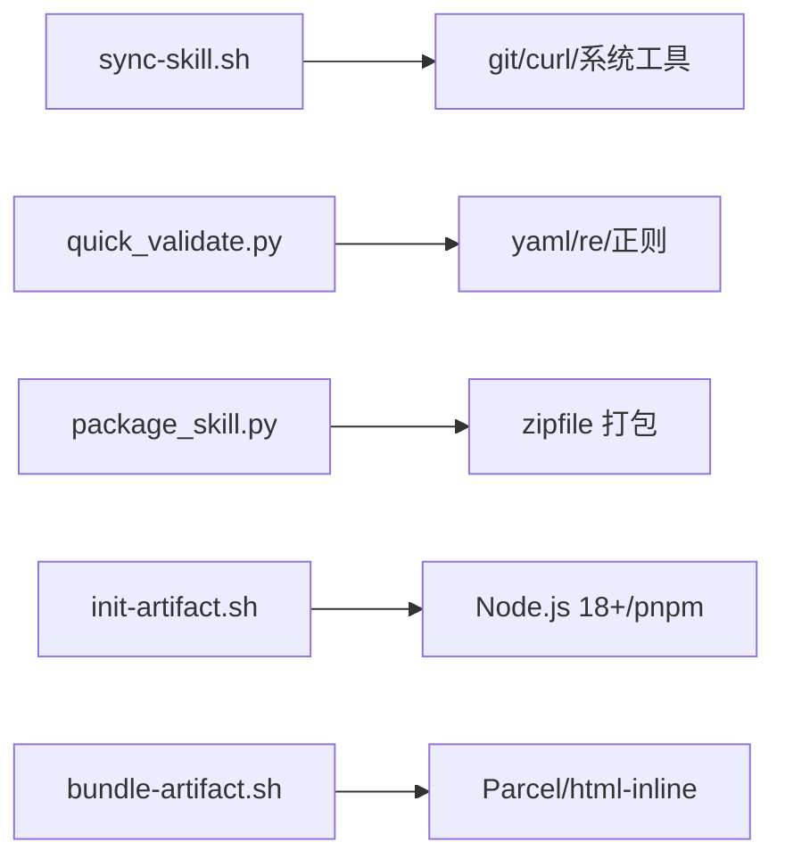

# 其他技能

<cite>
**本文引用的文件**
- [README.md](file://README.md)
- [template/SKILL.md](file://template/SKILL.md)
- [skills/sync-skills/SKILL.md](file://skills/sync-skills/SKILL.md)
- [skills/sync-skills/README.md](file://skills/sync-skills/README.md)
- [skills/sync-skills/sync-skill.sh](file://skills/sync-skills/sync-skill.sh)
- [skills/skill-creator/SKILL.md](file://skills/skill-creator/SKILL.md)
- [skills/skill-creator/scripts/init_skill.py](file://skills/skill-creator/scripts/init_skill.py)
- [skills/skill-creator/scripts/package_skill.py](file://skills/skill-creator/scripts/package_skill.py)
- [skills/skill-creator/scripts/quick_validate.py](file://skills/skill-creator/scripts/quick_validate.py)
- [skills/skill-creator/references/workflows.md](file://skills/skill-creator/references/workflows.md)
- [skills/skill-creator/references/output-patterns.md](file://skills/skill-creator/references/output-patterns.md)
- [skills/prompt-optimizer/SKILL.md](file://skills/prompt-optimizer/SKILL.md)
- [skills/prompt-optimizer/references/Frameworks_Summary.md](file://skills/prompt-optimizer/references/Frameworks_Summary.md)
- [skills/web-artifacts-builder/SKILL.md](file://skills/web-artifacts-builder/SKILL.md)
- [skills/web-artifacts-builder/scripts/init-artifact.sh](file://skills/web-artifacts-builder/scripts/init-artifact.sh)
- [skills/web-artifacts-builder/scripts/bundle-artifact.sh](file://skills/web-artifacts-builder/scripts/bundle-artifact.sh)
</cite>

## 目录
1. [简介](#简介)
2. [项目结构](#项目结构)
3. [核心组件](#核心组件)
4. [架构总览](#架构总览)
5. [详细组件分析](#详细组件分析)
6. [依赖关系分析](#依赖关系分析)
7. [性能考虑](#性能考虑)
8. [故障排查指南](#故障排查指南)
9. [结论](#结论)
10. [附录](#附录)

## 简介
本文件为“其他技能”的综合文档，聚焦于辅助类与增强型能力，包括：
- 技能同步：跨工具批量同步技能，支持本地目录、GitHub 仓库与 skillsmp.com 页面
- 技能创建：从模板初始化、校验、打包的全流程工作流
- 提示优化：基于 57 种提示工程框架的系统化优化流程
- 前端产物构建：基于现代前端技术栈的复杂 HTML 前端产物打包与交付
- 文档协作与版本管理：通过脚本化与模板化提升协作效率与一致性

本指南兼顾非技术读者与工程师读者，既提供高层概览，也包含可落地的操作步骤与可视化图示。

## 项目结构
仓库采用按“技能”维度分层的组织方式，每个技能为独立子目录，内含 SKILL.md 与可选的 scripts/references/assets 等资源。顶层 README 提供总体说明与使用入口。

图表来源
- [README.md](file://README.md#L1-L95)
- [skills/sync-skills/SKILL.md](file://skills/sync-skills/SKILL.md#L1-L305)
- [skills/skill-creator/SKILL.md](file://skills/skill-creator/SKILL.md#L1-L357)
- [skills/prompt-optimizer/SKILL.md](file://skills/prompt-optimizer/SKILL.md#L1-L139)
- [skills/web-artifacts-builder/SKILL.md](file://skills/web-artifacts-builder/SKILL.md#L1-L74)

章节来源
- [README.md](file://README.md#L1-L95)

## 核心组件
- 技能同步（sync-skills）
  - 自动识别本地目录、GitHub 仓库、skillsmp.com 页面三种来源
  - 智能探测目标工具目录并进行确认后同步
  - 覆盖策略：同名技能直接覆盖，无备份
  - 清理策略：临时文件自动清理
- 技能创建（skill-creator）
  - 初始化模板：自动生成 SKILL.md 与 scripts/references/assets 结构
  - 校验脚本：对 frontmatter 与命名进行严格校验
  - 打包脚本：将技能目录打包为 .skill 文件（zip）
- 提示优化（prompt-optimizer）
  - 57 种框架的摘要与选择指南
  - 流程化：分析输入 → 匹配场景 → 加载框架 → 明确歧义 → 生成优化提示 → 展示与迭代
- 前端产物构建（web-artifacts-builder）
  - 初始化：一键创建 React + TypeScript + Vite + Tailwind + shadcn/ui 项目
  - 打包：将多文件前端应用打包为单 HTML 产物，便于在 Claude 中作为“产物”展示

章节来源
- [skills/sync-skills/SKILL.md](file://skills/sync-skills/SKILL.md#L1-L305)
- [skills/skill-creator/SKILL.md](file://skills/skill-creator/SKILL.md#L1-L357)
- [skills/prompt-optimizer/SKILL.md](file://skills/prompt-optimizer/SKILL.md#L1-L139)
- [skills/web-artifacts-builder/SKILL.md](file://skills/web-artifacts-builder/SKILL.md#L1-L74)

## 架构总览
下图展示了“其他技能”中各组件之间的关系与交互：

图表来源
- [skills/sync-skills/sync-skill.sh](file://skills/sync-skills/sync-skill.sh#L1-L264)
- [skills/sync-skills/SKILL.md](file://skills/sync-skills/SKILL.md#L1-L305)
- [skills/sync-skills/README.md](file://skills/sync-skills/README.md#L1-L97)
- [skills/skill-creator/scripts/init_skill.py](file://skills/skill-creator/scripts/init_skill.py#L1-L304)
- [skills/skill-creator/scripts/package_skill.py](file://skills/skill-creator/scripts/package_skill.py#L1-L111)
- [skills/skill-creator/scripts/quick_validate.py](file://skills/skill-creator/scripts/quick_validate.py#L1-L95)
- [skills/skill-creator/references/workflows.md](file://skills/skill-creator/references/workflows.md#L1-L28)
- [skills/skill-creator/references/output-patterns.md](file://skills/skill-creator/references/output-patterns.md#L1-L83)
- [skills/prompt-optimizer/SKILL.md](file://skills/prompt-optimizer/SKILL.md#L1-L139)
- [skills/prompt-optimizer/references/Frameworks_Summary.md](file://skills/prompt-optimizer/references/Frameworks_Summary.md#L1-L90)
- [skills/web-artifacts-builder/SKILL.md](file://skills/web-artifacts-builder/SKILL.md#L1-L74)
- [skills/web-artifacts-builder/scripts/init-artifact.sh](file://skills/web-artifacts-builder/scripts/init-artifact.sh#L1-L323)
- [skills/web-artifacts-builder/scripts/bundle-artifact.sh](file://skills/web-artifacts-builder/scripts/bundle-artifact.sh#L1-L54)

## 详细组件分析

### 组件一：技能同步（sync-skills）
- 功能要点
  - 自动识别来源类型（本地路径、GitHub URL、skillsmp.com URL）
  - 智能探测目标工具目录（仅对已存在的目录进行同步）
  - 同步前列出目标并等待用户确认，确认后执行覆盖同步
  - 清理临时文件，保证环境整洁
- 使用流程
  - 传入源地址（本地/远程）
  - 脚本自动检测类型并执行相应处理
  - 列出现有目标目录并确认
  - 将技能复制到每个目标目录（同名覆盖）

图表来源
- [skills/sync-skills/sync-skill.sh](file://skills/sync-skills/sync-skill.sh#L27-L261)
- [skills/sync-skills/SKILL.md](file://skills/sync-skills/SKILL.md#L77-L127)

章节来源
- [skills/sync-skills/SKILL.md](file://skills/sync-skills/SKILL.md#L1-L305)
- [skills/sync-skills/README.md](file://skills/sync-skills/README.md#L1-L97)
- [skills/sync-skills/sync-skill.sh](file://skills/sync-skills/sync-skill.sh#L1-L264)

### 组件二：技能创建（skill-creator）
- 初始化模板
  - 自动生成 SKILL.md 与 scripts/references/assets 目录
  - 提供结构化建议与示例文件，便于快速上手
- 校验机制
  - 对 frontmatter 的字段、命名规范、长度限制进行严格校验
  - 确保 name 与 description 的完整性与合规性
- 打包流程
  - 校验通过后将技能目录打包为 .skill 文件（zip）
  - 便于分发与版本化管理

图表来源
- [skills/skill-creator/scripts/init_skill.py](file://skills/skill-creator/scripts/init_skill.py#L194-L271)
- [skills/skill-creator/scripts/quick_validate.py](file://skills/skill-creator/scripts/quick_validate.py#L12-L86)
- [skills/skill-creator/scripts/package_skill.py](file://skills/skill-creator/scripts/package_skill.py#L19-L83)

章节来源
- [skills/skill-creator/SKILL.md](file://skills/skill-creator/SKILL.md#L1-L357)
- [skills/skill-creator/scripts/init_skill.py](file://skills/skill-creator/scripts/init_skill.py#L1-L304)
- [skills/skill-creator/scripts/quick_validate.py](file://skills/skill-creator/scripts/quick_validate.py#L1-L95)
- [skills/skill-creator/scripts/package_skill.py](file://skills/skill-creator/scripts/package_skill.py#L1-L111)
- [skills/skill-creator/references/workflows.md](file://skills/skill-creator/references/workflows.md#L1-L28)
- [skills/skill-creator/references/output-patterns.md](file://skills/skill-creator/references/output-patterns.md#L1-L83)

### 组件三：提示优化（prompt-optimizer）
- 框架体系
  - 提供 57 种提示工程框架的摘要与应用场景
  - 按复杂度与应用领域给出推荐框架清单
- 优化流程
  - 分析用户输入 → 匹配场景与框架 → 加载框架详情 → 明确歧义 → 生成优化提示 → 展示与迭代

图表来源
- [skills/prompt-optimizer/SKILL.md](file://skills/prompt-optimizer/SKILL.md#L12-L114)
- [skills/prompt-optimizer/references/Frameworks_Summary.md](file://skills/prompt-optimizer/references/Frameworks_Summary.md#L1-L90)

章节来源
- [skills/prompt-optimizer/SKILL.md](file://skills/prompt-optimizer/SKILL.md#L1-L139)
- [skills/prompt-optimizer/references/Frameworks_Summary.md](file://skills/prompt-optimizer/references/Frameworks_Summary.md#L1-L90)

### 组件四：前端产物构建（web-artifacts-builder）
- 初始化
  - 自动创建 React + TypeScript + Vite + Tailwind + shadcn/ui 项目
  - 配置路径别名、主题与组件库，适配不同 Node 版本
- 打包
  - 使用 Parcel 构建并用 html-inline 将资源内联为单 HTML
  - 产物可直接作为 Claude 的“前端产物”分享与展示

图表来源
- [skills/web-artifacts-builder/scripts/init-artifact.sh](file://skills/web-artifacts-builder/scripts/init-artifact.sh#L56-L323)
- [skills/web-artifacts-builder/scripts/bundle-artifact.sh](file://skills/web-artifacts-builder/scripts/bundle-artifact.sh#L1-L54)
- [skills/web-artifacts-builder/SKILL.md](file://skills/web-artifacts-builder/SKILL.md#L1-L74)

章节来源
- [skills/web-artifacts-builder/SKILL.md](file://skills/web-artifacts-builder/SKILL.md#L1-L74)
- [skills/web-artifacts-builder/scripts/init-artifact.sh](file://skills/web-artifacts-builder/scripts/init-artifact.sh#L1-L323)
- [skills/web-artifacts-builder/scripts/bundle-artifact.sh](file://skills/web-artifacts-builder/scripts/bundle-artifact.sh#L1-L54)

## 依赖关系分析
- 技能同步
  - 依赖 Bash 环境与 git、curl 工具
  - 仅对已存在的目标目录进行同步，避免误写路径
- 技能创建
  - 依赖 Python 3 与第三方库（zipfile、yaml、re 等）
  - 校验脚本负责 frontmatter 与命名规范
- 提示优化
  - 依赖 references/frameworks 下的框架文档
  - 通过 SKILL.md 引导用户按流程执行
- 前端产物构建
  - 依赖 Node.js 18+、pnpm、Parcel、html-inline
  - 生成单 HTML 产物，便于在 Claude 中展示

图表来源
- [skills/sync-skills/sync-skill.sh](file://skills/sync-skills/sync-skill.sh#L1-L264)
- [skills/skill-creator/scripts/quick_validate.py](file://skills/skill-creator/scripts/quick_validate.py#L1-L95)
- [skills/skill-creator/scripts/package_skill.py](file://skills/skill-creator/scripts/package_skill.py#L1-L111)
- [skills/web-artifacts-builder/scripts/init-artifact.sh](file://skills/web-artifacts-builder/scripts/init-artifact.sh#L1-L323)
- [skills/web-artifacts-builder/scripts/bundle-artifact.sh](file://skills/web-artifacts-builder/scripts/bundle-artifact.sh#L1-L54)

章节来源
- [skills/sync-skills/sync-skill.sh](file://skills/sync-skills/sync-skill.sh#L1-L264)
- [skills/skill-creator/scripts/quick_validate.py](file://skills/skill-creator/scripts/quick_validate.py#L1-L95)
- [skills/skill-creator/scripts/package_skill.py](file://skills/skill-creator/scripts/package_skill.py#L1-L111)
- [skills/web-artifacts-builder/scripts/init-artifact.sh](file://skills/web-artifacts-builder/scripts/init-artifact.sh#L1-L323)
- [skills/web-artifacts-builder/scripts/bundle-artifact.sh](file://skills/web-artifacts-builder/scripts/bundle-artifact.sh#L1-L54)

## 性能考虑
- 技能同步
  - 仅对已存在目标目录进行同步，减少无效 IO
  - 覆盖策略避免重复拷贝，提高吞吐
  - 临时文件清理降低磁盘占用
- 技能创建
  - 校验前置，尽早暴露问题，减少后续重试成本
  - 打包采用压缩算法，减小 .skill 文件体积
- 提示优化
  - 通过框架摘要与选择指南减少不必要的上下文加载
  - 明确歧义环节可显著降低返工概率
- 前端产物构建
  - Parcel 构建与 html-inline 内联减少请求数，提升首屏渲染
  - 单 HTML 产物便于缓存与传输

## 故障排查指南
- 技能同步
  - 权限问题：确保脚本具备执行权限
  - 无目标目录：确认至少安装一个 AI 编码工具
  - GitHub 克隆失败：检查网络与仓库 URL
- 技能创建
  - frontmatter 格式错误：检查 YAML 语法与必需字段
  - 名称不符合规范：确保使用小写字母、数字与短横线，且不超过长度限制
  - 打包失败：先运行校验脚本定位问题
- 提示优化
  - 框架选择困难：参考复杂度与领域推荐清单
  - 框架详情缺失：确认 references/frameworks 下对应文件存在
- 前端产物构建
  - Node 版本过低：升级到 18+，或使用脚本自动适配
  - 依赖安装失败：确保 pnpm 可用，网络稳定
  - 打包后无法打开：检查 bundle.html 是否生成成功

章节来源
- [skills/sync-skills/README.md](file://skills/sync-skills/README.md#L73-L97)
- [skills/skill-creator/scripts/quick_validate.py](file://skills/skill-creator/scripts/quick_validate.py#L12-L86)
- [skills/prompt-optimizer/SKILL.md](file://skills/prompt-optimizer/SKILL.md#L124-L139)
- [skills/web-artifacts-builder/scripts/init-artifact.sh](file://skills/web-artifacts-builder/scripts/init-artifact.sh#L11-L15)
- [skills/web-artifacts-builder/scripts/bundle-artifact.sh](file://skills/web-artifacts-builder/scripts/bundle-artifact.sh#L7-L17)

## 结论
“其他技能”围绕“同步、创建、优化、构建”四大能力，提供了可复用、可扩展的工具链与工作流：
- 同步能力确保技能在多工具间一致可用
- 创建能力保障技能质量与可分发性
- 优化能力提升提示工程的系统性与可操作性
- 构建能力支撑复杂前端产物的交付与展示

建议在团队内推广模板化与脚本化流程，结合版本管理与 CI/CD，持续提升协作效率与产出质量。

## 附录
- 模板与最佳实践
  - 使用模板 SKILL.md 作为技能的统一入口
  - 采用渐进式披露（progressive disclosure）分离核心说明与详细参考
  - 将可执行脚本与静态资产按需加载，避免上下文膨胀
- 版本管理与协作
  - 使用 .skill 文件进行技能分发与归档
  - 通过 GitHub 管理技能仓库，配合 PR/Issue 流程进行协作
  - 在 SKILL.md 中明确“何时使用”与“限制”，减少误用

章节来源
- [template/SKILL.md](file://template/SKILL.md#L1-L59)
- [skills/skill-creator/SKILL.md](file://skills/skill-creator/SKILL.md#L47-L127)