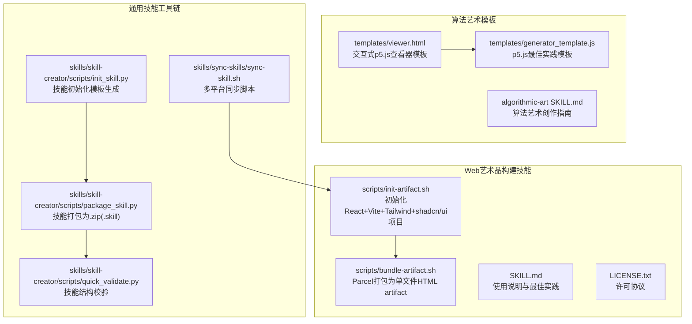
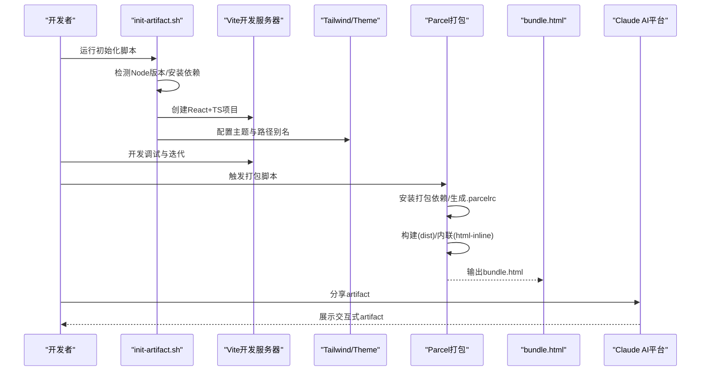
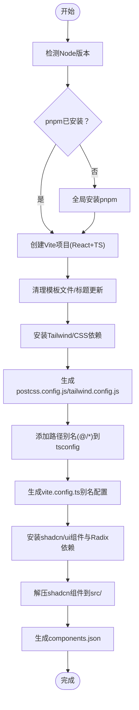
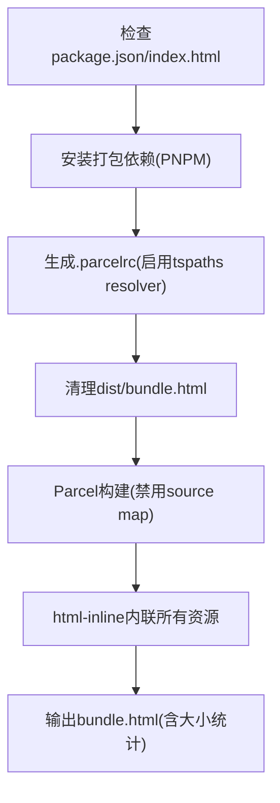
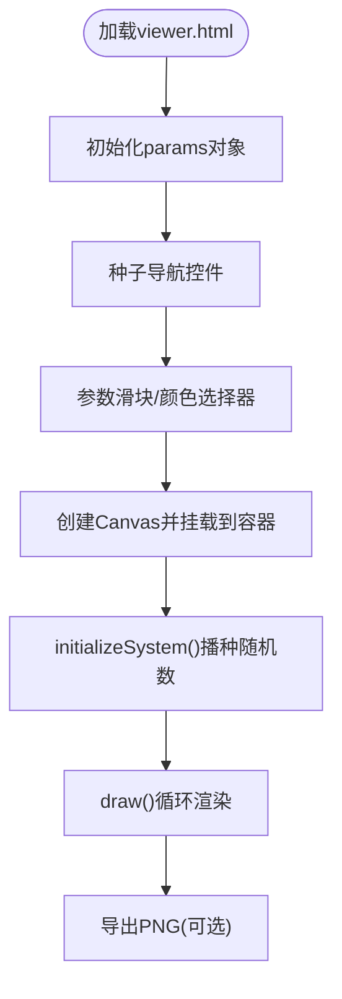
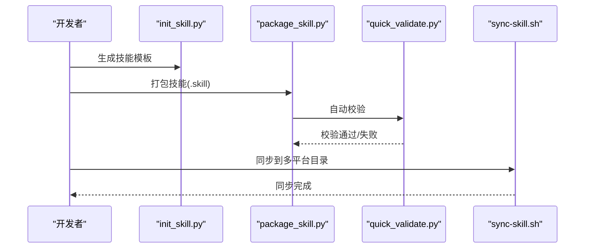
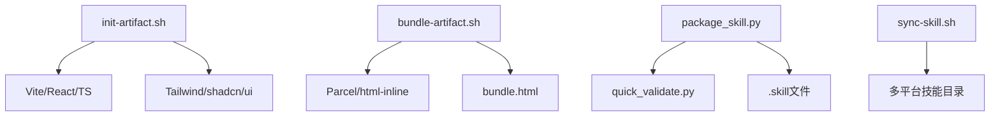

# Web艺术品构建

<cite>
**本文档引用的文件**
- [bundle-artifact.sh](file://skills/web-artifacts-builder/scripts/bundle-artifact.sh)
- [init-artifact.sh](file://skills/web-artifacts-builder/scripts/init-artifact.sh)
- [web-artifacts-builder SKILL.md](file://skills/web-artifacts-builder/SKILL.md)
- [web-artifacts-builder LICENSE.txt](file://skills/web-artifacts-builder/LICENSE.txt)
- [algorithmic-art SKILL.md](file://skills/algorithmic-art/SKILL.md)
- [viewer.html](file://skills/algorithmic-art/templates/viewer.html)
- [generator_template.js](file://skills/algorithmic-art/templates/generator_template.js)
- [README.md](file://README.md)
- [init_skill.py](file://skills/skill-creator/scripts/init_skill.py)
- [package_skill.py](file://skills/skill-creator/scripts/package_skill.py)
- [quick_validate.py](file://skills/skill-creator/scripts/quick_validate.py)
- [sync-skill.sh](file://skills/sync-skills/sync-skill.sh)
</cite>

## 目录
1. [简介](#简介)
2. [项目结构](#项目结构)
3. [核心组件](#核心组件)
4. [架构总览](#架构总览)
5. [详细组件分析](#详细组件分析)
6. [依赖关系分析](#依赖关系分析)
7. [性能考虑](#性能考虑)
8. [故障排除指南](#故障排除指南)
9. [结论](#结论)
10. [附录](#附录)

## 简介
本文件面向希望在Claude AI平台上构建Web艺术品的开发者，系统化阐述从项目初始化、前端技术栈集成、交互式元素开发到最终打包与部署的全流程。文档覆盖以下关键主题：
- Web艺术品的创建流程与最佳实践
- 前端技术栈集成（React + TypeScript + Vite + Tailwind CSS + shadcn/ui）
- 响应式设计与交互式参数控制
- 构建脚本使用方法与artifact打包流程
- 初始化模板配置与自动化脚本
- 性能优化、跨浏览器兼容性与用户体验设计
- 在Claude AI平台上的集成方式与部署策略

## 项目结构
该项目采用“技能（Skill）”组织方式，每个技能为一个独立的功能单元，包含说明文档、可执行脚本与参考资源。Web艺术品构建相关的技能位于skills/web-artifacts-builder，同时算法艺术模板位于skills/algorithmic-art，用于生成基于p5.js的交互式HTML artifact。

图表来源
- [init-artifact.sh](file://skills/web-artifacts-builder/scripts/init-artifact.sh#L1-L323)
- [bundle-artifact.sh](file://skills/web-artifacts-builder/scripts/bundle-artifact.sh#L1-L54)
- [web-artifacts-builder SKILL.md](file://skills/web-artifacts-builder/SKILL.md#L1-L74)
- [viewer.html](file://skills/algorithmic-art/templates/viewer.html#L1-L599)
- [generator_template.js](file://skills/algorithmic-art/templates/generator_template.js#L1-L223)
- [init_skill.py](file://skills/skill-creator/scripts/init_skill.py#L1-L304)
- [package_skill.py](file://skills/skill-creator/scripts/package_skill.py#L1-L111)
- [quick_validate.py](file://skills/skill-creator/scripts/quick_validate.py#L1-L95)
- [sync-skill.sh](file://skills/sync-skills/sync-skill.sh#L1-L264)

章节来源
- [README.md](file://README.md#L1-L95)
- [web-artifacts-builder SKILL.md](file://skills/web-artifacts-builder/SKILL.md#L1-L74)

## 核心组件
- 初始化脚本（init-artifact.sh）：自动创建React + TypeScript + Vite + Tailwind CSS + shadcn/ui项目骨架，支持Node版本检测与依赖固定，生成带路径别名与主题配置的工程。
- 打包脚本（bundle-artifact.sh）：通过Parcel进行构建与资源内联，输出单文件HTML artifact，适配Claude AI artifact展示。
- 算法艺术模板（viewer.html + generator_template.js）：提供p5.js交互式查看器模板与最佳实践，强调参数化、可重现性与性能优化。
- 技能工具链（init_skill.py、package_skill.py、quick_validate.py、sync-skill.sh）：标准化技能创建、打包、校验与分发流程，便于在多平台同步与复用。

章节来源
- [init-artifact.sh](file://skills/web-artifacts-builder/scripts/init-artifact.sh#L1-L323)
- [bundle-artifact.sh](file://skills/web-artifacts-builder/scripts/bundle-artifact.sh#L1-L54)
- [viewer.html](file://skills/algorithmic-art/templates/viewer.html#L1-L599)
- [generator_template.js](file://skills/algorithmic-art/templates/generator_template.js#L1-L223)
- [init_skill.py](file://skills/skill-creator/scripts/init_skill.py#L1-L304)
- [package_skill.py](file://skills/skill-creator/scripts/package_skill.py#L1-L111)
- [quick_validate.py](file://skills/skill-creator/scripts/quick_validate.py#L1-L95)
- [sync-skill.sh](file://skills/sync-skills/sync-skill.sh#L1-L264)

## 架构总览
下图展示了从项目初始化到artifact生成与部署的关键流程，以及与Claude AI平台的集成点。

图表来源
- [init-artifact.sh](file://skills/web-artifacts-builder/scripts/init-artifact.sh#L1-L323)
- [bundle-artifact.sh](file://skills/web-artifacts-builder/scripts/bundle-artifact.sh#L1-L54)

## 详细组件分析

### 组件A：Web艺术品初始化与前端技术栈集成
- 功能概述
  - 自动化创建React + TypeScript + Vite工程，内置Tailwind CSS 3.4.1与shadcn/ui主题系统。
  - 配置路径别名（@/*）、PostCSS与autoprefixer，Radix UI依赖齐全。
  - Node版本检测与Vite版本兼容性处理（Node 18使用特定版本，Node 20+使用最新版）。
- 关键特性
  - 一键生成40+ shadcn/ui组件，减少重复配置成本。
  - 支持macOS与Linux的sed语法差异处理。
  - 自动生成components.json用于组件引用与别名映射。
- 使用建议
  - 在Node 18+环境下运行，确保pnpm可用。
  - 初始化后按需删除不需要的组件与示例文件，保持最小可用集合。

图表来源
- [init-artifact.sh](file://skills/web-artifacts-builder/scripts/init-artifact.sh#L1-L323)

章节来源
- [init-artifact.sh](file://skills/web-artifacts-builder/scripts/init-artifact.sh#L1-L323)
- [web-artifacts-builder SKILL.md](file://skills/web-artifacts-builder/SKILL.md#L22-L40)

### 组件B：Web艺术品打包与artifact生成
- 功能概述
  - 通过Parcel将React应用构建并内联为单文件HTML artifact，适合Claude AI直接展示。
  - 自动创建.parcelrc以支持TypeScript路径别名解析。
  - 清理历史构建产物，避免缓存干扰。
- 关键流程
  - 检查package.json与index.html存在性。
  - 安装Parcel及相关resolver与html-inline工具。
  - 执行构建（禁用source map）与内联，输出bundle.html。
- 注意事项
  - 输出文件大小会直接影响加载速度与Claude渲染性能，建议在开发阶段关注体积优化。

图表来源
- [bundle-artifact.sh](file://skills/web-artifacts-builder/scripts/bundle-artifact.sh#L1-L54)

章节来源
- [bundle-artifact.sh](file://skills/web-artifacts-builder/scripts/bundle-artifact.sh#L1-L54)
- [web-artifacts-builder SKILL.md](file://skills/web-artifacts-builder/SKILL.md#L45-L61)

### 组件C：算法艺术模板与交互式参数控制
- 模板结构
  - viewer.html提供Anthropic品牌风格的侧边栏布局，包含种子导航、参数控制、颜色选择与操作按钮区域。
  - generator_template.js提供p5.js最佳实践：参数组织、有种子的随机性、生命周期管理、类结构、性能优化与实用函数。
- 参数化与可重现性
  - 所有可调参数集中于params对象，支持实时滑块与颜色选择器联动。
  - 种子控制提供Prev/Next/Random/Jump功能，保证相同种子输出一致结果。
- 性能与体验
  - 提供加载状态提示，Canvas尺寸与响应式布局适配移动端。
  - 强调“过程优于产物”，通过算法动态生成而非静态图像。

图表来源
- [viewer.html](file://skills/algorithmic-art/templates/viewer.html#L1-L599)
- [generator_template.js](file://skills/algorithmic-art/templates/generator_template.js#L1-L223)

章节来源
- [algorithmic-art SKILL.md](file://skills/algorithmic-art/SKILL.md#L101-L218)
- [viewer.html](file://skills/algorithmic-art/templates/viewer.html#L1-L599)
- [generator_template.js](file://skills/algorithmic-art/templates/generator_template.js#L1-L223)

### 组件D：技能工具链与质量保障
- 技能初始化（init_skill.py）
  - 自动生成标准技能目录结构与示例文件，便于快速落地。
  - 提供模板化的SKILL.md与scripts/references/assets示例。
- 技能打包（package_skill.py）
  - 将技能目录压缩为.zip格式的.skill文件，便于分发与安装。
  - 打包前自动运行校验脚本，确保frontmatter与命名规范符合要求。
- 结构校验（quick_validate.py）
  - 校验SKILL.md是否存在、frontmatter格式与字段是否正确、name与description长度与字符约束。
- 多平台同步（sync-skill.sh）
  - 支持本地目录、GitHub仓库与skillsmp.com页面的同步，自动检测目标目录并覆盖写入。

图表来源
- [init_skill.py](file://skills/skill-creator/scripts/init_skill.py#L1-L304)
- [package_skill.py](file://skills/skill-creator/scripts/package_skill.py#L1-L111)
- [quick_validate.py](file://skills/skill-creator/scripts/quick_validate.py#L1-L95)
- [sync-skill.sh](file://skills/sync-skills/sync-skill.sh#L1-L264)

章节来源
- [init_skill.py](file://skills/skill-creator/scripts/init_skill.py#L1-L304)
- [package_skill.py](file://skills/skill-creator/scripts/package_skill.py#L1-L111)
- [quick_validate.py](file://skills/skill-creator/scripts/quick_validate.py#L1-L95)
- [sync-skill.sh](file://skills/sync-skills/sync-skill.sh#L1-L264)

## 依赖关系分析
- 技术栈耦合
  - init-artifact.sh与Vite/Tailwind/shadcn/ui形成强耦合，确保UI一致性与组件生态稳定。
  - bundle-artifact.sh依赖Parcel与html-inline，将多模块产物内联为单文件，降低Claude展示时的外部依赖风险。
- 质量保障链路
  - package_skill.py在打包前调用quick_validate.py，避免不符合规范的技能进入分发环节。
- 平台集成点
  - README.md与各技能文档明确了在Claude Code、Claude.ai与API中的使用方式与限制。

图表来源
- [init-artifact.sh](file://skills/web-artifacts-builder/scripts/init-artifact.sh#L1-L323)
- [bundle-artifact.sh](file://skills/web-artifacts-builder/scripts/bundle-artifact.sh#L1-L54)
- [package_skill.py](file://skills/skill-creator/scripts/package_skill.py#L1-L111)
- [quick_validate.py](file://skills/skill-creator/scripts/quick_validate.py#L1-L95)
- [sync-skill.sh](file://skills/sync-skills/sync-skill.sh#L1-L264)

章节来源
- [README.md](file://README.md#L29-L59)
- [web-artifacts-builder SKILL.md](file://skills/web-artifacts-builder/SKILL.md#L1-L74)

## 性能考虑
- 构建与打包
  - 禁用source map以减小bundle体积，提升Claude加载速度。
  - 使用Parcel内联策略将CSS/JS合并为单文件，避免额外HTTP请求。
- 交互式渲染
  - p5.js渲染建议限制粒子/元素数量，使用空间索引与向量运算优化。
  - 控制帧率与必要重绘，避免不必要的DOM更新。
- 响应式与跨设备
  - viewer.html提供移动端布局切换，Canvas自适应容器宽度。
  - 避免使用过大的字体与背景图，减少首屏渲染压力。

## 故障排除指南
- 初始化失败
  - 确认Node版本满足要求（>=18），pnpm可用。
  - 若macOS/Linux sed语法报错，检查脚本中的sed-in-place变量赋值。
- 打包失败
  - 确保根目录存在package.json与index.html。
  - 检查.parcelrc生成与权限，清理dist/bundle.html后重试。
- 艺术品无法在Claude中显示
  - 确认bundle.html为自包含文件，无外部CDN失效。
  - 减少初始资源体积，优先使用内联样式与脚本。
- 技能打包校验失败
  - 检查SKILL.md frontmatter格式与字段完整性，确保name与description符合长度与字符要求。

章节来源
- [init-artifact.sh](file://skills/web-artifacts-builder/scripts/init-artifact.sh#L1-L323)
- [bundle-artifact.sh](file://skills/web-artifacts-builder/scripts/bundle-artifact.sh#L1-L54)
- [quick_validate.py](file://skills/skill-creator/scripts/quick_validate.py#L1-L95)

## 结论
通过本套工具链，开发者可以高效地从零开始构建高质量的Web艺术品，并将其无缝集成到Claude AI平台。关键在于：
- 使用init-artifact.sh快速搭建现代前端工程，统一UI与组件体系；
- 通过bundle-artifact.sh生成单文件artifact，确保在Claude中即时可用；
- 借助算法艺术模板与最佳实践，实现参数化、可重现且高性能的交互式体验；
- 利用技能工具链完成标准化创建、校验与分发，保障质量与可维护性。

## 附录
- 在Claude Code/AI/API中的使用
  - README.md提供了在不同平台安装与使用的指引，包括插件市场注册与技能安装流程。
- 许可与合规
  - web-artifacts-builder使用Apache 2.0许可证，遵循仓库整体许可条款。

章节来源
- [README.md](file://README.md#L29-L59)
- [web-artifacts-builder LICENSE.txt](file://skills/web-artifacts-builder/LICENSE.txt#L1-L202)