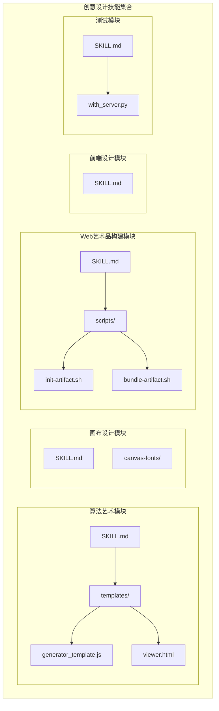
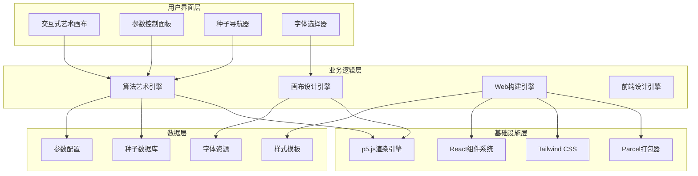
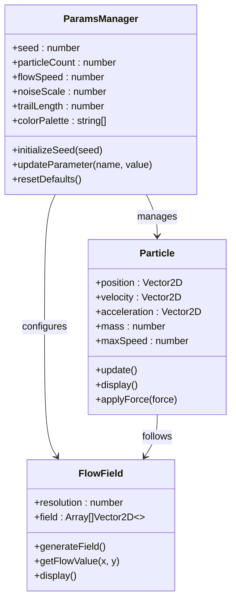
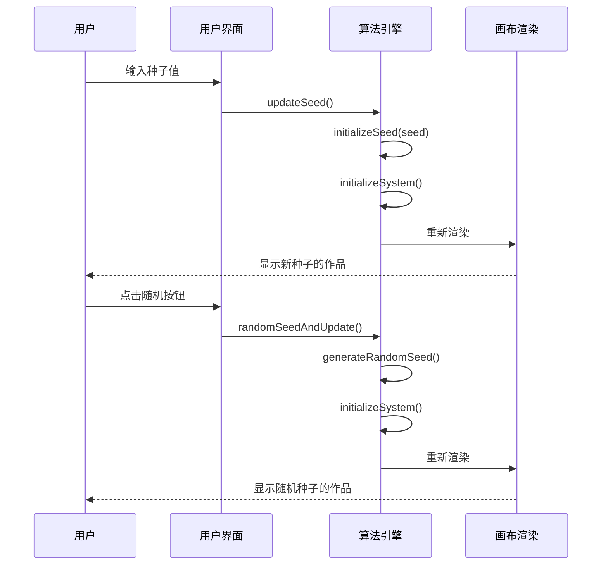
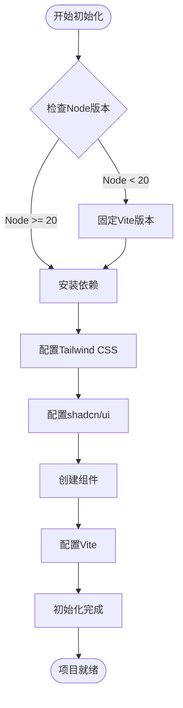
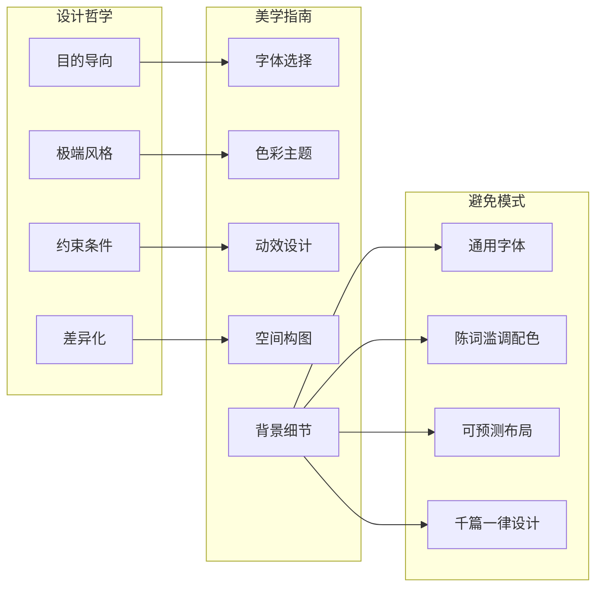
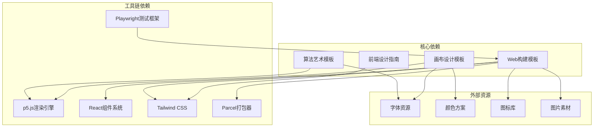

# 创意设计技能

<cite>
**本文档引用的文件**
- [algorithmic-art/SKILL.md](file://skills/algorithmic-art/SKILL.md)
- [algorithmic-art/templates/generator_template.js](file://skills/algorithmic-art/templates/generator_template.js)
- [algorithmic-art/templates/viewer.html](file://skills/algorithmic-art/templates/viewer.html)
- [canvas-design/SKILL.md](file://skills/canvas-design/SKILL.md)
- [web-artifacts-builder/SKILL.md](file://skills/web-artifacts-builder/SKILL.md)
- [web-artifacts-builder/scripts/init-artifact.sh](file://skills/web-artifacts-builder/scripts/init-artifact.sh)
- [frontend-design/SKILL.md](file://skills/frontend-design/SKILL.md)
- [webapp-testing/SKILL.md](file://skills/webapp-testing/SKILL.md)
- [README.md](file://README.md)
</cite>

## 目录
1. [简介](#简介)
2. [项目结构](#项目结构)
3. [核心组件](#核心组件)
4. [架构概览](#架构概览)
5. [详细组件分析](#详细组件分析)
6. [依赖关系分析](#依赖关系分析)
7. [性能考虑](#性能考虑)
8. [故障排除指南](#故障排除指南)
9. [结论](#结论)
10. [附录](#附录)

## 简介

本项目是一个综合性的创意设计技能集合，专注于算法艺术、画布设计和Web艺术品构建。该项目提供了完整的创作流程和技术实现方案，涵盖了从概念生成到最终作品发布的全过程。

项目的核心特色包括：
- **算法艺术创作**：基于p5.js的生成式艺术创作系统
- **画布设计哲学**：静态视觉艺术的设计方法论
- **Web艺术品构建**：现代前端技术集成的艺术品开发
- **交互式体验**：支持参数调节和种子导航的交互式艺术作品

通过标准化的工作流程和模板系统，用户可以创建高质量的创意作品，从简单的算法艺术到复杂的Web交互应用。

## 项目结构

该项目采用模块化设计，每个技能都是独立的功能模块，包含完整的说明文档、模板文件和实现指导。

**图表来源**
- [algorithmic-art/SKILL.md](file://skills/algorithmic-art/SKILL.md#L1-L405)
- [canvas-design/SKILL.md](file://skills/canvas-design/SKILL.md#L1-L130)
- [web-artifacts-builder/SKILL.md](file://skills/web-artifacts-builder/SKILL.md#L1-L74)

**章节来源**
- [README.md](file://README.md#L1-L95)

## 核心组件

### 算法艺术创作系统

算法艺术模块提供了完整的生成式艺术创作框架，包括哲学构建、参数设计和交互实现三个核心阶段。

#### 主要特性
- **哲学驱动创作**：强调算法美学和计算美感
- **可重现性**：基于种子的随机数系统
- **参数化设计**：灵活的参数控制系统
- **交互式体验**：实时参数调节和种子导航

#### 技术栈
- p5.js：图形渲染和动画系统
- HTML5 Canvas：底层绘图API
- JavaScript：算法实现和交互逻辑

**章节来源**
- [algorithmic-art/SKILL.md](file://skills/algorithmic-art/SKILL.md#L1-L405)

### 画布设计系统

画布设计模块专注于静态视觉艺术的创作，提供从设计理念到最终输出的完整流程。

#### 设计原则
- **视觉表达优先**：信息通过形式、空间、色彩传达
- **极简文字**：文本作为视觉元素而非内容载体
- **空间沟通**：构图和平衡的视觉语言
- **专家工艺**：追求大师级的制作水准

#### 输出格式
- PDF：专业打印质量
- PNG：数字媒体格式
- 多页作品：系列化创作

**章节来源**
- [canvas-design/SKILL.md](file://skills/canvas-design/SKILL.md#L1-L130)

### Web艺术品构建系统

Web艺术品构建模块使用现代前端技术创建复杂的交互式艺术作品。

#### 技术架构
- **React 18**：组件化UI开发
- **TypeScript**：类型安全的JavaScript
- **Tailwind CSS**：实用优先的CSS框架
- **shadcn/ui**：高质量UI组件库
- **Parcel**：现代化打包工具

#### 开发流程
1. 项目初始化和配置
2. 组件开发和状态管理
3. 打包和优化
4. 艺术品发布

**章节来源**
- [web-artifacts-builder/SKILL.md](file://skills/web-artifacts-builder/SKILL.md#L1-L74)

## 架构概览

整个创意设计技能系统采用分层架构，每个模块都有明确的职责边界和接口规范。

**图表来源**
- [algorithmic-art/SKILL.md](file://skills/algorithmic-art/SKILL.md#L101-L220)
- [web-artifacts-builder/SKILL.md](file://skills/web-artifacts-builder/SKILL.md#L16-L74)

## 详细组件分析

### 算法艺术引擎

算法艺术引擎是整个系统的核心，负责将抽象的算法美学转化为具体的可视化作品。

#### 参数管理系统

**图表来源**
- [algorithmic-art/templates/generator_template.js](file://skills/algorithmic-art/templates/generator_template.js#L24-L84)
- [algorithmic-art/templates/viewer.html](file://skills/algorithmic-art/templates/viewer.html#L445-L516)

#### 种子导航系统

种子导航系统确保了作品的可重现性和探索性，用户可以通过不同的种子值探索无限的变化。

**图表来源**
- [algorithmic-art/templates/viewer.html](file://skills/algorithmic-art/templates/viewer.html#L538-L566)

**章节来源**
- [algorithmic-art/SKILL.md](file://skills/algorithmic-art/SKILL.md#L133-L220)

### Web构建引擎

Web构建引擎使用现代前端技术栈创建复杂的交互式艺术作品，支持状态管理和路由功能。

#### 初始化流程

**图表来源**
- [web-artifacts-builder/scripts/init-artifact.sh](file://skills/web-artifacts-builder/scripts/init-artifact.sh#L52-L322)

#### 打包流程

Web构建引擎使用Parcel进行现代化打包，将所有资源内联到单个HTML文件中，确保作品的便携性和易分享性。

**章节来源**
- [web-artifacts-builder/SKILL.md](file://skills/web-artifacts-builder/SKILL.md#L45-L74)

### 前端设计引擎

前端设计引擎专注于创建具有独特美学特征的用户界面，避免常见的"AI风格"设计。

#### 设计原则

**图表来源**
- [frontend-design/SKILL.md](file://skills/frontend-design/SKILL.md#L11-L43)

**章节来源**
- [frontend-design/SKILL.md](file://skills/frontend-design/SKILL.md#L1-L43)

## 依赖关系分析

创意设计技能系统中的各个模块之间存在清晰的依赖关系和协作机制。

**图表来源**
- [algorithmic-art/templates/generator_template.js](file://skills/algorithmic-art/templates/generator_template.js#L1-L223)
- [web-artifacts-builder/SKILL.md](file://skills/web-artifacts-builder/SKILL.md#L16-L74)

**章节来源**
- [webapp-testing/SKILL.md](file://skills/webapp-testing/SKILL.md#L1-L96)

## 性能考虑

在创意设计领域，性能优化不仅关乎用户体验，更是艺术表达的重要组成部分。

### 算法艺术性能优化

1. **种子确定性**：使用固定的随机种子确保结果可重现
2. **参数化设计**：通过参数控制复杂度，避免硬编码
3. **渐进式渲染**：支持分阶段渲染大型作品
4. **内存管理**：及时清理不再使用的对象和数组

### Web艺术品性能优化

1. **打包优化**：使用Parcel进行代码分割和压缩
2. **资源内联**：将所有资源打包到单个HTML文件
3. **懒加载**：按需加载大型资源和组件
4. **缓存策略**：合理利用浏览器缓存机制

### 前端性能优化

1. **组件优化**：使用React.memo和useMemo避免不必要的重渲染
2. **CSS优化**：Tailwind CSS的原子化特性减少CSS体积
3. **动画性能**：使用transform和opacity属性优化动画性能
4. **字体优化**：预加载关键字体，使用字体回退机制

## 故障排除指南

### 常见问题及解决方案

#### 算法艺术问题

**问题**：作品无法重现
- 检查种子是否正确设置
- 确认randomSeed和noiseSeed函数调用
- 验证参数对象的完整性

**问题**：性能问题
- 减少粒子数量或简化算法
- 使用更高效的数学运算
- 实现适当的帧率限制

#### Web构建问题

**问题**：打包失败
- 检查Node.js版本兼容性
- 确认依赖项正确安装
- 验证入口文件路径

**问题**：运行时错误
- 检查浏览器兼容性
- 验证polyfill配置
- 确认资源路径正确

#### 前端设计问题

**问题**：样式冲突
- 检查Tailwind CSS配置
- 验证组件导入顺序
- 确认CSS优先级设置

**问题**：响应式问题
- 检查断点设置
- 验证媒体查询语法
- 测试不同设备尺寸

**章节来源**
- [webapp-testing/SKILL.md](file://skills/webapp-testing/SKILL.md#L78-L96)

## 结论

创意设计技能系统提供了一个完整的艺术创作生态系统，从概念生成到作品发布形成了标准化的流程。该系统的核心优势在于：

1. **标准化工作流程**：每个模块都有明确的职责和接口规范
2. **技术多样性**：涵盖从算法艺术到Web应用的多种技术栈
3. **用户体验优化**：注重交互性和可探索性
4. **质量保证**：强调专家级的制作水准和工艺精神

通过这些技能，创作者可以专注于艺术表达本身，而无需担心技术实现的细节。系统的模块化设计也为扩展和定制提供了充足的空间。

## 附录

### 最佳实践建议

1. **保持一致性**：在整个创作过程中遵循统一的设计原则
2. **注重细节**：关注每一个视觉元素的精确性和协调性
3. **持续迭代**：通过多次修改和完善达到最佳效果
4. **用户反馈**：重视用户的交互体验和反馈意见

### 学习资源

- p5.js官方文档和示例
- React和TypeScript学习资源
- Tailwind CSS设计系统
- shadcn/ui组件库文档
- 前端性能优化最佳实践

### 社区贡献

该技能集合鼓励社区贡献和改进，通过开源协作不断提升创作工具的质量和功能。