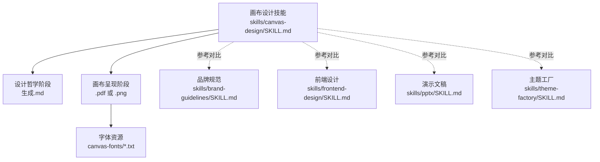
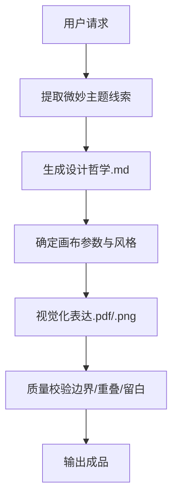
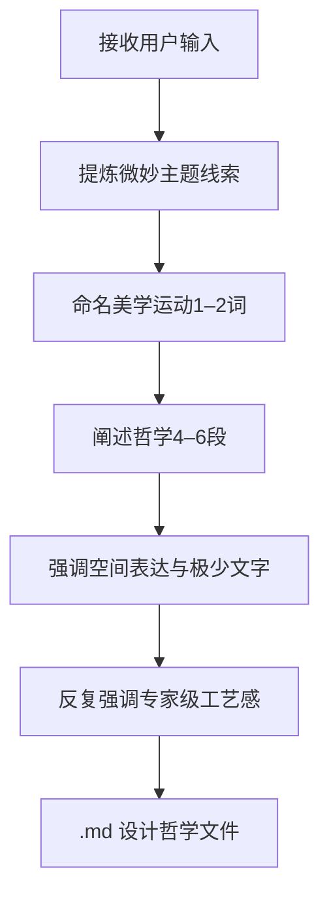
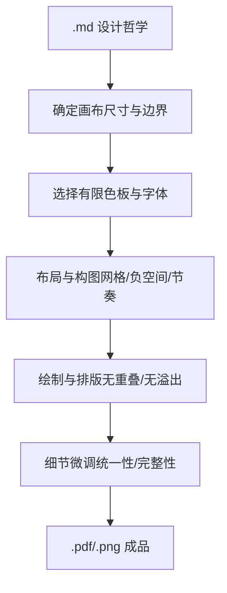
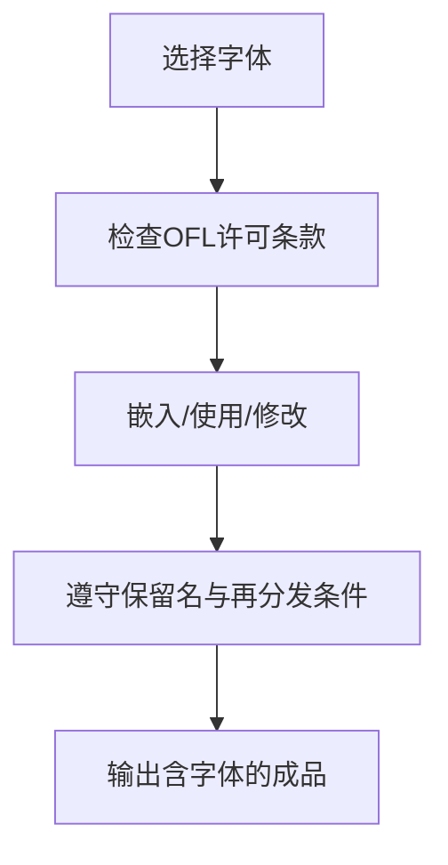
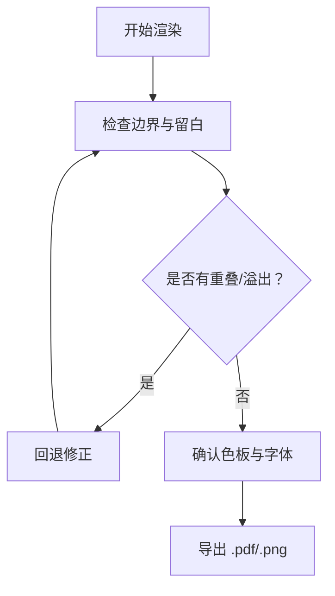
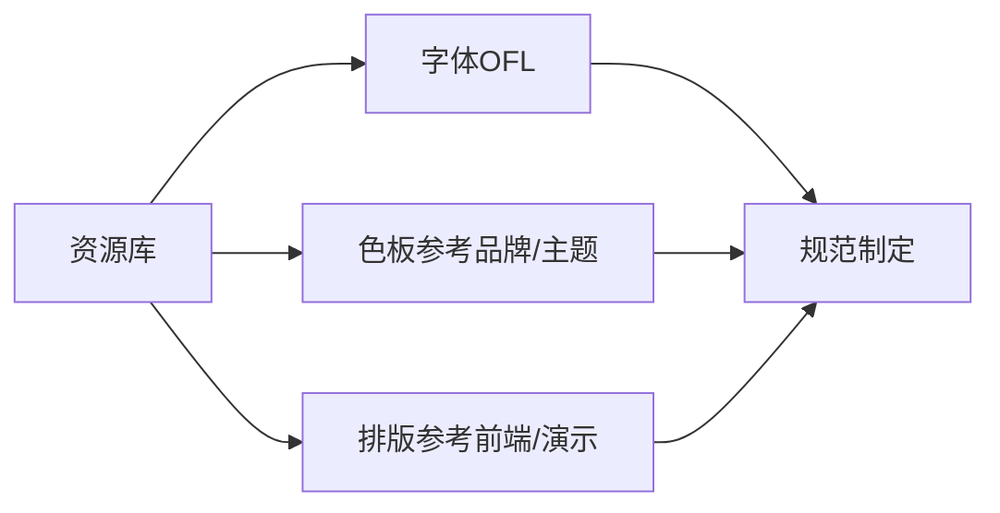
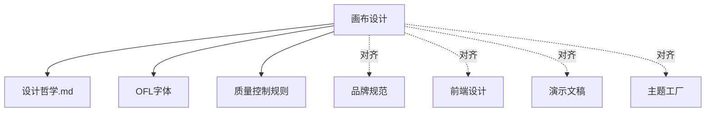

# 画布设计

<cite>
**本文引用的文件**
- [技能说明：canvas-design](file://skills/canvas-design/SKILL.md)
- [许可协议：canvas-design](file://skills/canvas-design/LICENSE.txt)
- [字体许可：ArsenalSC-OFL.txt](file://skills/canvas-design/canvas-fonts/ArsenalSC-OFL.txt)
- [字体许可：WorkSans-OFL.txt](file://skills/canvas-design/canvas-fonts/WorkSans-OFL.txt)
- [字体许可：JetBrainsMono-OFL.txt](file://skills/canvas-design/canvas-fonts/JetBrainsMono-OFL.txt)
- [技能说明：brand-guidelines](file://skills/brand-guidelines/SKILL.md)
- [技能说明：frontend-design](file://skills/frontend-design/SKILL.md)
- [技能说明：pptx](file://skills/pptx/SKILL.md)
- [技能说明：theme-factory](file://skills/theme-factory/SKILL.md)
</cite>

## 目录
1. [简介](#简介)
2. [项目结构](#项目结构)
3. [核心组件](#核心组件)
4. [架构总览](#架构总览)
5. [详细组件分析](#详细组件分析)
6. [依赖关系分析](#依赖关系分析)
7. [性能与质量控制](#性能与质量控制)
8. [故障排查指南](#故障排查指南)
9. [结论](#结论)
10. [附录](#附录)

## 简介
本技能面向“画布设计”，目标是通过“设计哲学”指导创作，产出高完成度的静态视觉作品（PDF 或 PNG）。其核心流程分为两步：先生成可被视觉化表达的设计哲学（以.md形式输出），再基于该哲学在画布上进行艺术化呈现（单页或多页 PDF/PNG）。技能强调“极简文字、空间表达、专家级工艺感”，并要求最终作品具备博物馆级质感与可展示性。

## 项目结构
- 技能入口与说明：skills/canvas-design/SKILL.md
- 许可协议：skills/canvas-design/LICENSE.txt
- 字体资源与版权：skills/canvas-design/canvas-fonts/*.txt（OFL开源字体）
- 设计参考与对比：品牌规范、前端设计、演示文稿、主题工厂等技能文档

图表来源
- [技能说明：canvas-design](file://skills/canvas-design/SKILL.md#L1-L130)
- [技能说明：brand-guidelines](file://skills/brand-guidelines/SKILL.md#L1-L74)
- [技能说明：frontend-design](file://skills/frontend-design/SKILL.md#L1-L43)
- [技能说明：pptx](file://skills/pptx/SKILL.md#L51-L148)
- [技能说明：theme-factory](file://skills/theme-factory/SKILL.md#L1-L60)

章节来源
- [技能说明：canvas-design](file://skills/canvas-design/SKILL.md#L1-L130)

## 核心组件
- 设计哲学生成器：定义美学运动、空间/形式/色彩/节奏/构图/视觉层级等维度，强调“极少文字、空间表达、专家级工艺感”。
- 画布呈现引擎：依据设计哲学在单页或多页画布上进行视觉化表达，使用重复图案、完美几何、有限色板与内敛排版。
- 字体与版权合规：内置OFL许可字体清单，确保可嵌入、可修改、可再分发但不得单独售卖。
- 输出与质量控制：严格边界、无重叠、无溢出；追求“仿佛手工精作”的专业度；支持单页或整册式多页输出。

章节来源
- [技能说明：canvas-design](file://skills/canvas-design/SKILL.md#L15-L130)
- [许可协议：canvas-design](file://skills/canvas-design/LICENSE.txt#L1-L202)

## 架构总览
画布设计的执行流程由“哲学生成—概念提炼—画布呈现—质量校验—输出交付”构成，贯穿两条主线：
- 内容主线：从用户输入中提炼“微妙主题线索”，将其融入设计哲学与视觉语言。
- 形式主线：以空间、色彩、比例、节奏、视觉层级为核心，用最少的文字承载最多的信息。

图表来源
- [技能说明：canvas-design](file://skills/canvas-design/SKILL.md#L89-L130)

## 详细组件分析

### 组件一：设计哲学生成器
- 目标：产出可被视觉化解读的美学世界观，避免冗余与重复，强调“专家级工艺感”。
- 关键维度：空间与形式、色彩与材质、尺度与韵律、构图与平衡、视觉层级。
- 输出形态：4–6段落的.md文件，作为后续画布呈现的唯一权威依据。

图表来源
- [技能说明：canvas-design](file://skills/canvas-design/SKILL.md#L33-L85)

章节来源
- [技能说明：canvas-design](file://skills/canvas-design/SKILL.md#L33-L85)

### 组件二：画布呈现引擎
- 基础原则：单页或多页，高度可视化，设计导向；重复图案与完美几何；内敛排版与有限色板。
- 文字策略：极少、内嵌、可视优先；根据情境决定细小低语或强烈姿态；不重叠、不溢出、有留白。
- 工艺标准：追求“仿佛手工精作”的专业度；二次打磨时避免新增图形，而应优化既有元素的统一性与完整性。

图表来源
- [技能说明：canvas-design](file://skills/canvas-design/SKILL.md#L100-L130)

章节来源
- [技能说明：canvas-design](file://skills/canvas-design/SKILL.md#L100-L130)

### 组件三：字体与版权合规
- 字体来源：OFL许可字体，允许使用、研究、复制、合并、嵌入、修改、再分发，但不得单独售卖；衍生版本不得使用保留名称；文档不受此许可约束。
- 使用建议：按需下载并嵌入到作品中；将文字本身纳入画面构成，而非简单排版；不同场景使用不同字体以强化情境表达。

图表来源
- [字体许可：ArsenalSC-OFL.txt](file://skills/canvas-design/canvas-fonts/ArsenalSC-OFL.txt#L1-L94)
- [字体许可：WorkSans-OFL.txt](file://skills/canvas-design/canvas-fonts/WorkSans-OFL.txt#L1-L94)
- [字体许可：JetBrainsMono-OFL.txt](file://skills/canvas-design/canvas-fonts/JetBrainsMono-OFL.txt#L1-L94)
- [技能说明：canvas-design](file://skills/canvas-design/SKILL.md#L108-L112)

章节来源
- [字体许可：ArsenalSC-OFL.txt](file://skills/canvas-design/canvas-fonts/ArsenalSC-OFL.txt#L1-L94)
- [字体许可：WorkSans-OFL.txt](file://skills/canvas-design/canvas-fonts/WorkSans-OFL.txt#L1-L94)
- [字体许可：JetBrainsMono-OFL.txt](file://skills/canvas-design/canvas-fonts/JetBrainsMono-OFL.txt#L1-L94)
- [技能说明：canvas-design](file://skills/canvas-design/SKILL.md#L108-L112)

### 组件四：输出格式与质量控制
- 输出格式：.pdf 或 .png；可单页或多页打包。
- 质量标准：无重叠、无溢出、边界清晰、留白充足；所有元素包含于画布内；追求“专家级工艺感”。
- 多页策略：将首页视为画册开篇，后续页面为同一哲学下的独特变奏，形成有节制的故事性。

图表来源
- [技能说明：canvas-design](file://skills/canvas-design/SKILL.md#L108-L130)

章节来源
- [技能说明：canvas-design](file://skills/canvas-design/SKILL.md#L108-L130)

### 组件五：设计资源与规范制定
- 资源管理：OFL字体清单便于嵌入与合规使用；建议在本地环境预置常用字体以保证一致性。
- 规范制定：以“极少文字、空间表达、专家级工艺感”为三大基石；在品牌规范、前端设计、演示文稿、主题工厂等技能中寻找可借鉴的配色、排版与一致性策略。

图表来源
- [技能说明：brand-guidelines](file://skills/brand-guidelines/SKILL.md#L17-L36)
- [技能说明：frontend-design](file://skills/frontend-design/SKILL.md#L27-L43)
- [技能说明：pptx](file://skills/pptx/SKILL.md#L51-L148)
- [技能说明：theme-factory](file://skills/theme-factory/SKILL.md#L28-L60)

章节来源
- [技能说明：brand-guidelines](file://skills/brand-guidelines/SKILL.md#L17-L36)
- [技能说明：frontend-design](file://skills/frontend-design/SKILL.md#L27-L43)
- [技能说明：pptx](file://skills/pptx/SKILL.md#L51-L148)
- [技能说明：theme-factory](file://skills/theme-factory/SKILL.md#L28-L60)

## 依赖关系分析
- 内部依赖：画布呈现严格依赖设计哲学.md；字体使用受OFL许可约束；输出质量受边界与留白规则约束。
- 外部参考：品牌规范提供颜色与字体使用范式；前端设计强调排版与空间构成；演示文稿强调配色与一致性；主题工厂提供成体系的配色与字体组合思路。

图表来源
- [技能说明：canvas-design](file://skills/canvas-design/SKILL.md#L1-L130)
- [技能说明：brand-guidelines](file://skills/brand-guidelines/SKILL.md#L1-L74)
- [技能说明：frontend-design](file://skills/frontend-design/SKILL.md#L1-L43)
- [技能说明：pptx](file://skills/pptx/SKILL.md#L51-L148)
- [技能说明：theme-factory](file://skills/theme-factory/SKILL.md#L1-L60)

章节来源
- [技能说明：canvas-design](file://skills/canvas-design/SKILL.md#L1-L130)
- [技能说明：brand-guidelines](file://skills/brand-guidelines/SKILL.md#L1-L74)
- [技能说明：frontend-design](file://skills/frontend-design/SKILL.md#L1-L43)
- [技能说明：pptx](file://skills/pptx/SKILL.md#L51-L148)
- [技能说明：theme-factory](file://skills/theme-factory/SKILL.md#L1-L60)

## 性能与质量控制
- 渲染性能：优先使用重复图案与几何图形，减少复杂路径与过度细分；合理设置分辨率与压缩级别以平衡体积与清晰度。
- 质量控制：建立“边界—重叠—留白”三道校验；对多页作品进行一致性检查（色板、字体、间距）；二次打磨聚焦已有元素的统一性而非新增内容。
- 版权与合规：严格遵循OFL条款，确保字体嵌入与再分发符合许可；文档不受字体许可约束，但需保留必要声明。

## 故障排查指南
- 常见问题
  - 文字溢出或重叠：检查画布边界与排版参数，确保所有元素均在画布内且有足够留白。
  - 字体未生效：确认字体已正确嵌入；若系统不可用，按技能说明使用替代方案。
  - 配色不一致：对照品牌规范或主题工厂提供的配色表进行校正。
- 排查步骤
  1) 回归设计哲学.md，核对是否偏离原定空间表达与极少文字原则。
  2) 检查边界与留白，消除重叠与溢出。
  3) 对比品牌/前端/演示文稿/主题工厂的规范条目，统一色板与排版。
  4) 进行二次打磨：减少新增图形，优化既有元素的统一性与完整性。

章节来源
- [技能说明：canvas-design](file://skills/canvas-design/SKILL.md#L108-L130)
- [技能说明：brand-guidelines](file://skills/brand-guidelines/SKILL.md#L60-L74)
- [技能说明：frontend-design](file://skills/frontend-design/SKILL.md#L27-L43)
- [技能说明：pptx](file://skills/pptx/SKILL.md#L51-L148)
- [技能说明：theme-factory](file://skills/theme-factory/SKILL.md#L43-L60)

## 结论
画布设计技能以“设计哲学”为纲，以“空间表达与极少文字”为法，辅以“专家级工艺感”的质量标准，结合OFL字体资源与品牌/前端/演示/主题等规范参考，形成一套可复用、可落地、可展示的视觉创作方法论。通过严谨的质量控制与版权合规流程，确保最终作品具备博物馆级质感与可传播价值。

## 附录
- 最佳实践要点
  - 先哲学后呈现：设计哲学.md是唯一权威来源。
  - 少即是多：文字作为视觉元素，密度与位置需经过深思熟虑。
  - 专家级工艺：追求“仿佛手工精作”的细节与完整度。
  - 一致性与可扩展：单页为开篇，多页为延续，保持风格统一。
- 参考与对齐
  - 品牌规范：颜色与字体使用范式
  - 前端设计：排版与空间构成的美学取向
  - 演示文稿：配色与一致性策略
  - 主题工厂：成体系的配色与字体组合思路