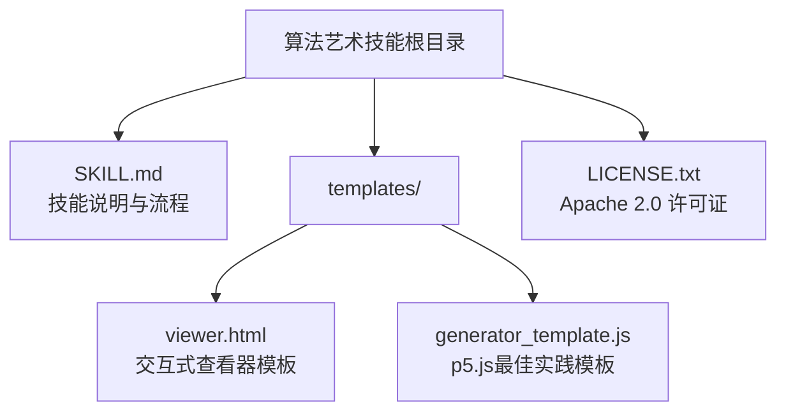
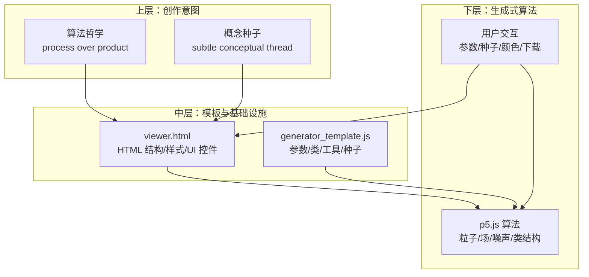
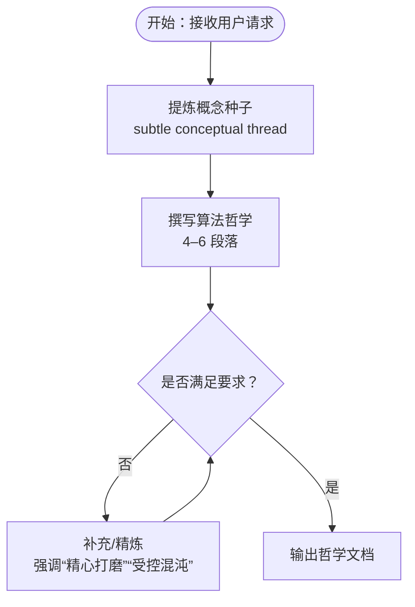
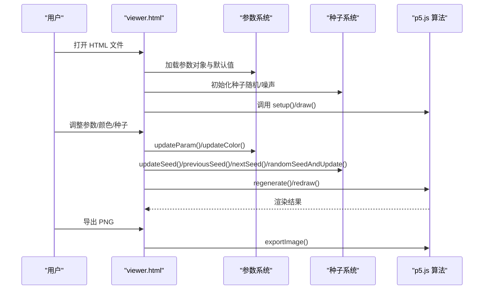
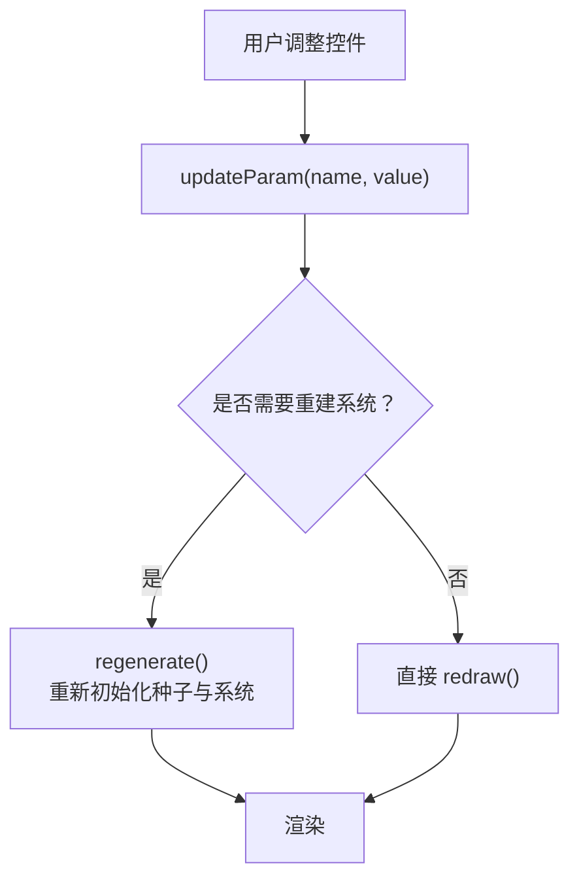
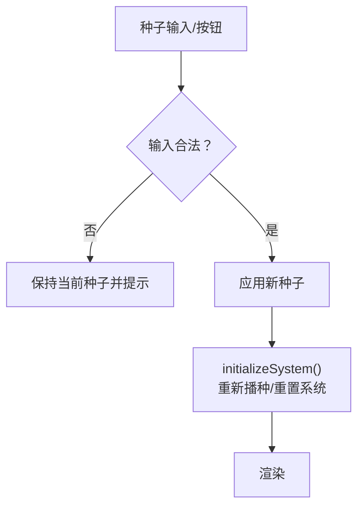
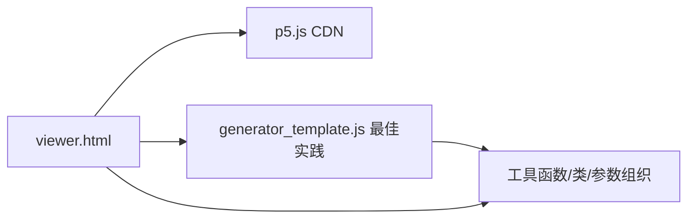

# 算法艺术

<cite>
**本文引用的文件**
- [算法艺术 SKILL.md](file://skills/algorithmic-art/SKILL.md)
- [算法艺术模板 viewer.html](file://skills/algorithmic-art/templates/viewer.html)
- [算法艺术模板 generator_template.js](file://skills/algorithmic-art/templates/generator_template.js)
- [算法艺术许可证 LICENSE.txt](file://skills/algorithmic-art/LICENSE.txt)
- [品牌指南 SKILL.md](file://skills/brand-guidelines/SKILL.md)
- [画布设计 SKILL.md](file://skills/canvas-design/SKILL.md)
- [仓库自述 README.md](file://README.md)
</cite>

## 目录
1. [简介](#简介)
2. [项目结构](#项目结构)
3. [核心组件](#核心组件)
4. [架构总览](#架构总览)
5. [详细组件分析](#详细组件分析)
6. [依赖关系分析](#依赖关系分析)
7. [性能考量](#性能考量)
8. [故障排查指南](#故障排查指南)
9. [结论](#结论)
10. [附录](#附录)

## 简介
本技能面向“算法艺术”的创作与实现，目标是帮助用户从“算法哲学”出发，通过 p5.js 构建可交互的生成式艺术作品。该技能强调：
- 创作理念：以“算法哲学”为内核，强调“过程即美”，而非静态图像
- 技术实现：基于模板的 p5.js 集成，包含种子随机性、噪声场、参数化控制与种子导航
- 交互体验：单页自包含 HTML 产物，内置参数面板、颜色选择器、种子切换与下载能力
- 品牌一致性：遵循 Anthropic 品牌风格（字体、配色、布局），确保一致的观感与可用性

## 项目结构
算法艺术技能位于 skills/algorithmic-art 目录下，包含以下关键文件：
- SKILL.md：技能说明与创作流程规范
- templates/viewer.html：交互式查看器模板（HTML 结构、样式、UI 控件）
- templates/generator_template.js：p5.js 最佳实践模板（参数组织、种子随机、类结构、工具函数）
- LICENSE.txt：Apache 2.0 许可证

图表来源
- [算法艺术 SKILL.md](file://skills/algorithmic-art/SKILL.md#L1-L405)
- [算法艺术模板 viewer.html](file://skills/algorithmic-art/templates/viewer.html#L1-L599)
- [算法艺术模板 generator_template.js](file://skills/algorithmic-art/templates/generator_template.js#L1-L223)
- [算法艺术许可证 LICENSE.txt](file://skills/algorithmic-art/LICENSE.txt#L1-L202)

章节来源
- [算法艺术 SKILL.md](file://skills/algorithmic-art/SKILL.md#L1-L405)

## 核心组件
- 算法哲学（Algorithmic Philosophy）：定义生成式艺术的计算世界观与美学原则，指导后续代码实现
- p5.js 查看器（Interactive Viewer）：基于模板构建的单页 HTML，内嵌参数控制、颜色选择、种子导航与下载
- 参数系统（Parameters）：集中管理可调参数，支持实时更新与重置
- 种子系统（Seed System）：保证可复现性，支持前一/下一/随机/跳转种子
- 噪声与随机（Noise & Randomness）：使用 seeded randomness 与 Perlin 噪声，营造有机与可控混沌
- 品牌风格（Anthropic Branding）：统一字体、配色与布局，确保观感一致

章节来源
- [算法艺术 SKILL.md](file://skills/algorithmic-art/SKILL.md#L13-L86)
- [算法艺术模板 viewer.html](file://skills/algorithmic-art/templates/viewer.html#L1-L599)
- [算法艺术模板 generator_template.js](file://skills/algorithmic-art/templates/generator_template.js#L1-L223)

## 架构总览
算法艺术的实现采用“哲学驱动 + 模板复用 + 参数化控制”的分层架构：
- 上层：算法哲学与创作意图
- 中层：模板（HTML + JS）作为基础设施
- 下层：p5.js 生成式算法与交互逻辑

图表来源
- [算法艺术 SKILL.md](file://skills/algorithmic-art/SKILL.md#L101-L186)
- [算法艺术模板 viewer.html](file://skills/algorithmic-art/templates/viewer.html#L440-L599)
- [算法艺术模板 generator_template.js](file://skills/algorithmic-art/templates/generator_template.js#L15-L223)

## 详细组件分析

### 组件 A：算法哲学（Algorithmic Philosophy）
- 目标：输出 4–6 段落的“算法美学宣言”，强调“过程即美”“涌现行为”“受控混沌”
- 关键点：
  - 名称：1–2 个词（如“有机湍流”“量子谐波”）
  - 表达：如何通过“计算过程、数学关系、噪声函数、粒子行为、时间演化、参数变化”体现
  - 要求：避免冗余；反复强调“精心打磨”“大师级实现”“深度优化”
- 示例主题：
  - 有机湍流：层叠噪声驱动的流场，粒子轨迹形成有机密度图
  - 量子谐波：网格初始化的相位振荡，近邻相位干涉产生明暗节点
  - 递归低语：分形递归生成树状结构，黄金比例约束与噪声扰动
  - 场动力学：由数学函数或噪声构造的矢量场，粒子沿场线流动留痕
  - 随机结晶：随机点集经松弛算法演化，颜色来自尺寸/邻域/中心距离

图表来源
- [算法艺术 SKILL.md](file://skills/algorithmic-art/SKILL.md#L90-L186)

章节来源
- [算法艺术 SKILL.md](file://skills/algorithmic-art/SKILL.md#L34-L86)

### 组件 B：p5.js 实现与模板使用
- 模板使用步骤：
  - 必读 viewer.html，严格保留固定结构（标题、副标题、种子区、动作区）
  - 可变部分：算法主体、参数对象、参数控件、颜色控件
- 参数组织：
  - 使用 params 对象集中管理可调参数（数量、尺度、概率、角度、阈值等）
  - 支持默认值与重置
- 种子与噪声：
  - 初始化时设置 seed，保证可复现
  - 使用 seeded randomness 与噪声函数（如 Perlin 噪声）营造有机变化
- 类结构与性能：
  - 大量实体建议使用类封装（如粒子）
  - 性能优化：预计算、简化昂贵操作、合理使用向量
- 工具函数：
  - 颜色工具、映射与缓动、边界处理、背景淡入、导出图片

图表来源
- [算法艺术模板 viewer.html](file://skills/algorithmic-art/templates/viewer.html#L440-L599)
- [算法艺术模板 generator_template.js](file://skills/algorithmic-art/templates/generator_template.js#L15-L223)

章节来源
- [算法艺术 SKILL.md](file://skills/algorithmic-art/SKILL.md#L101-L218)
- [算法艺术模板 viewer.html](file://skills/algorithmic-art/templates/viewer.html#L1-L599)
- [算法艺术模板 generator_template.js](file://skills/algorithmic-art/templates/generator_template.js#L1-L223)

### 组件 C：参数控制系统
- 控件类型：滑块（range）、颜色选择器（color）、按钮（重置、下载）
- 更新策略：
  - 实时更新：适合非重建型参数（如速度、透明度）
  - 重建更新：适合影响初始状态的参数（如数量、阈值）
- 默认值与重置：保存默认参数，点击重置恢复

图表来源
- [算法艺术模板 viewer.html](file://skills/algorithmic-art/templates/viewer.html#L520-L591)
- [算法艺术模板 generator_template.js](file://skills/algorithmic-art/templates/generator_template.js#L162-L177)

章节来源
- [算法艺术模板 viewer.html](file://skills/algorithmic-art/templates/viewer.html#L350-L429)
- [算法艺术模板 generator_template.js](file://skills/algorithmic-art/templates/generator_template.js#L162-L177)

### 组件 D：种子导航与可复现性
- 固定功能：显示当前种子、上一/下一、随机、跳转到指定种子
- 可选扩展：批量生成（如 1–100 的种子变体）
- 注意事项：每次种子变更后需重新初始化系统

图表来源
- [算法艺术模板 viewer.html](file://skills/algorithmic-art/templates/viewer.html#L538-L566)

章节来源
- [算法艺术模板 viewer.html](file://skills/algorithmic-art/templates/viewer.html#L530-L591)

### 组件 E：美学原则与计算美感
- 平衡：复杂与简洁、秩序与自由
- 色彩：和谐与目的性，避免随机 RGB
- 构图：在随机中维持视觉层次与流动
- 性能：流畅执行，动画场景保持稳定帧率
- 可复现：相同种子始终产出相同结果

章节来源
- [算法艺术 SKILL.md](file://skills/algorithmic-art/SKILL.md#L201-L210)

### 组件 F：创作示例与实现要点
- 有机湍流（Organic Turbulence）
  - 流场：多层噪声叠加，形成湍流与平静区域
  - 粒子：跟随矢量力，轨迹累积形成密度图
  - 颜色：速度与密度决定明暗
- 量子谐波（Quantum Harmonics）
  - 网格粒子：每个携带相位，随正弦波演化
  - 干涉：近邻相位叠加，产生明暗节点
  - 和谐：频率比精心校准，产生共振美感
- 递归低语（Recursive Whispers）
  - 分形：递归细分，每级轻微随机但受黄金比例约束
  - 扰动：噪声打破完美对称
  - 层次：线条粗细随层级衰减
- 场动力学（Field Dynamics）
  - 场：由函数或噪声构造的矢量场
  - 粒子：从边界诞生，沿场线流动，达到平衡或边界消亡
  - 视觉：仅显痕迹，呈现无形之力的可见效果
- 随机结晶（Stochastic Crystallization）
  - 初始：随机点集
  - 进化：松弛算法推动单元分离至平衡
  - 颜色：基于尺寸、邻域数或距中心距离

章节来源
- [算法艺术 SKILL.md](file://skills/algorithmic-art/SKILL.md#L54-L76)

## 依赖关系分析
- viewer.html 依赖 p5.js CDN（版本 1.7.0）
- viewer.html 内嵌 generator_template.js 的最佳实践模式（参数组织、种子、类结构、工具函数）
- viewer.html 与 generator_template.js 共同构成“模板 + 算法”的组合，前者负责 UI，后者负责代码结构与工具

图表来源
- [算法艺术模板 viewer.html](file://skills/algorithmic-art/templates/viewer.html#L23-L440)
- [算法艺术模板 generator_template.js](file://skills/algorithmic-art/templates/generator_template.js#L1-L223)

章节来源
- [算法艺术模板 viewer.html](file://skills/algorithmic-art/templates/viewer.html#L1-L599)
- [算法艺术模板 generator_template.js](file://skills/algorithmic-art/templates/generator_template.js#L1-L223)

## 性能考量
- 动画场景：
  - 目标帧率：60fps
  - 优化手段：预计算、减少昂贵运算（sqrt、三角函数）、空间哈希碰撞检测、高效使用 p5 向量
- 大规模元素：
  - 限制每帧更新数量
  - 使用批量渲染或离屏缓冲
- 交互响应：
  - 将“重建系统”与“实时更新”区分，避免不必要的全量重算

章节来源
- [算法艺术模板 generator_template.js](file://skills/algorithmic-art/templates/generator_template.js#L112-L126)

## 故障排查指南
- 页面空白或未渲染
  - 检查 p5.js 是否加载成功（CDN 可用性）
  - 确认 setup() 正确创建画布并调用 initializeSystem()
- 参数不生效
  - 确认 updateParam() 与 UI 绑定一致
  - 区分实时更新与重建更新
- 种子无效
  - 输入必须为正整数
  - 种子变更后需重新初始化系统
- 颜色控件无反应
  - 确认 updateColor() 与对应 DOM ID 一致
- 导出失败
  - 确认 exportImage() 调用与浏览器下载权限

章节来源
- [算法艺术模板 viewer.html](file://skills/algorithmic-art/templates/viewer.html#L520-L599)
- [算法艺术模板 generator_template.js](file://skills/algorithmic-art/templates/generator_template.js#L200-L206)

## 结论
算法艺术技能以“哲学驱动 + 模板复用 + 参数化控制”为核心，既保证了创作的自由度，又确保了实现的一致性与可复现性。通过将种子随机性与噪声场融入算法，结合可交互的参数与种子导航，能够持续探索“受控混沌”中的计算美感，并以 Anthropic 品牌风格呈现专业、易用且富有表现力的生成式艺术体验。

## 附录
- 品牌风格参考：Anthropic 品牌指南（颜色、字体、形状与配色）
- 画布设计技能：强调“视觉表达、空间传达、极简文字”，可作为静态艺术创作的参考
- 仓库说明：介绍技能体系与使用方式，便于在 Claude Code/AI/API 中集成

章节来源
- [品牌指南 SKILL.md](file://skills/brand-guidelines/SKILL.md#L1-L74)
- [画布设计 SKILL.md](file://skills/canvas-design/SKILL.md#L1-L130)
- [仓库自述 README.md](file://README.md#L1-L95)