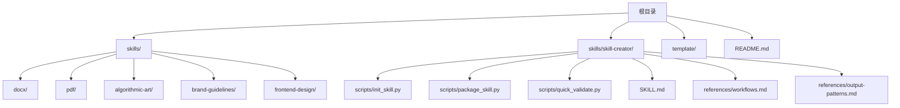
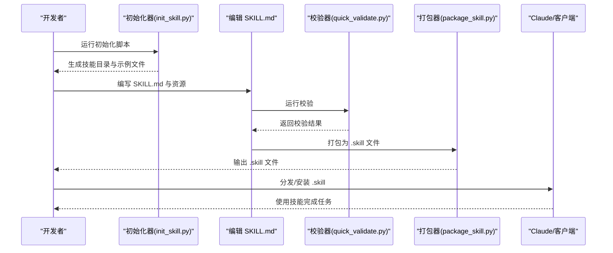
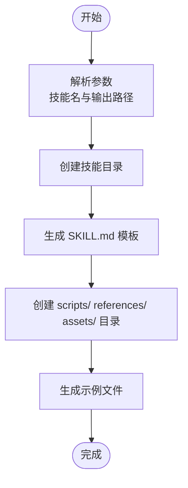
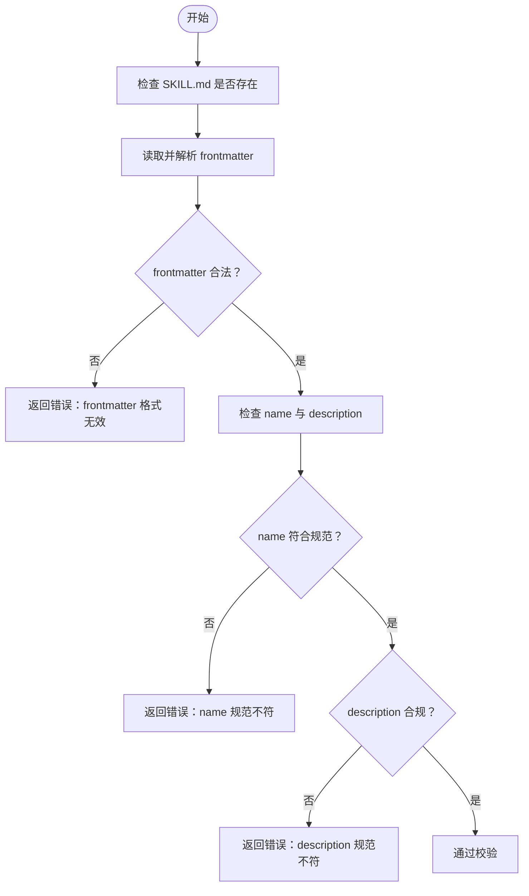
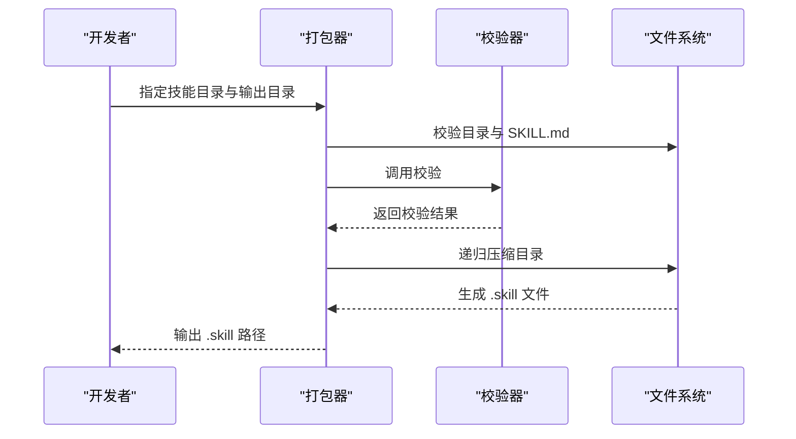
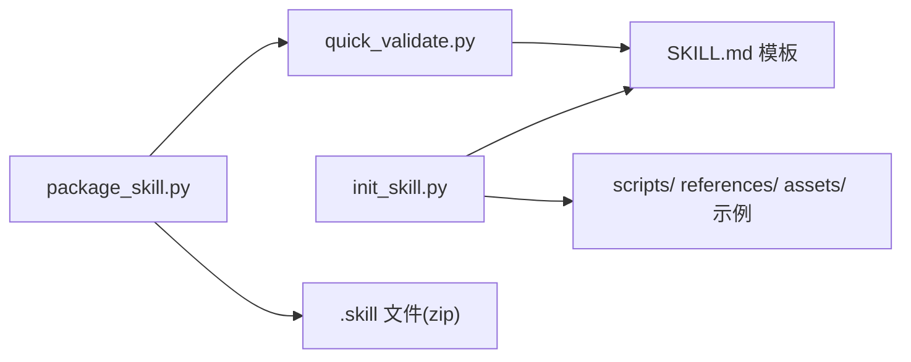

# 快速开始

<cite>
**本文引用的文件**
- [README.md](file://README.md)
- [template/SKILL.md](file://template/SKILL.md)
- [skills/skill-creator/SKILL.md](file://skills/skill-creator/SKILL.md)
- [skills/skill-creator/scripts/init_skill.py](file://skills/skill-creator/scripts/init_skill.py)
- [skills/skill-creator/scripts/package_skill.py](file://skills/skill-creator/scripts/package_skill.py)
- [skills/skill-creator/scripts/quick_validate.py](file://skills/skill-creator/scripts/quick_validate.py)
- [skills/docx/SKILL.md](file://skills/docx/SKILL.md)
- [skills/pdf/SKILL.md](file://skills/pdf/SKILL.md)
- [skills/algorithmic-art/SKILL.md](file://skills/algorithmic-art/SKILL.md)
- [skills/brand-guidelines/SKILL.md](file://skills/brand-guidelines/SKILL.md)
- [skills/frontend-design/SKILL.md](file://skills/frontend-design/SKILL.md)
</cite>

## 目录
1. [简介](#简介)
2. [项目结构](#项目结构)
3. [核心组件](#核心组件)
4. [架构总览](#架构总览)
5. [详细组件分析](#详细组件分析)
6. [依赖关系分析](#依赖关系分析)
7. [性能考虑](#性能考虑)
8. [故障排除指南](#故障排除指南)
9. [结论](#结论)
10. [附录](#附录)

## 简介
本指南面向初学者，带你从零开始创建并使用技能（Skill）。你将学会：
- 安装与环境准备
- 基本配置与模板使用
- 创建第一个技能的完整工作流程
- 编写、打包与测试技能
- 常见初始配置问题与解决方案

技能是独立的、可动态加载的模块，通过清晰的元数据与说明，帮助 AI 在特定任务上具备可复用的专业能力。

## 项目结构
仓库包含以下与技能开发相关的关键部分：
- skills：示例技能集合，展示不同领域的技能模式
- skills/skill-creator：技能创建工具链（初始化、校验、打包）
- template：技能模板文件
- README：总体说明与使用入口

图表来源
- [README.md](file://README.md#L24-L27)
- [skills/skill-creator/SKILL.md](file://skills/skill-creator/SKILL.md#L202-L213)

章节来源
- [README.md](file://README.md#L24-L27)

## 核心组件
- 技能模板：提供标准化的 frontmatter 与结构建议，便于快速上手
- 初始化器：一键生成技能骨架（目录、示例文件、模板 SKILL.md）
- 校验器：检查 SKILL.md 元数据格式、命名与描述规范
- 打包器：将技能目录打包为 .skill 文件，便于分发与部署

章节来源
- [template/SKILL.md](file://template/SKILL.md#L1-L59)
- [skills/skill-creator/scripts/init_skill.py](file://skills/skill-creator/scripts/init_skill.py#L1-L304)
- [skills/skill-creator/scripts/quick_validate.py](file://skills/skill-creator/scripts/quick_validate.py#L1-L95)
- [skills/skill-creator/scripts/package_skill.py](file://skills/skill-creator/scripts/package_skill.py#L1-L111)

## 架构总览
技能创建与使用的端到端流程如下：

图表来源
- [skills/skill-creator/SKILL.md](file://skills/skill-creator/SKILL.md#L202-L213)
- [skills/skill-creator/scripts/init_skill.py](file://skills/skill-creator/scripts/init_skill.py#L264-L278)
- [skills/skill-creator/scripts/quick_validate.py](file://skills/skill-creator/scripts/quick_validate.py#L12-L86)
- [skills/skill-creator/scripts/package_skill.py](file://skills/skill-creator/scripts/package_skill.py#L19-L83)

## 详细组件分析

### 组件一：技能模板（template/SKILL.md）
- 作用：提供标准化的 frontmatter 与结构建议，帮助你快速写出高质量的 SKILL.md
- 关键点：
  - frontmatter 至少包含 name 与 description
  - 提供“概览/何时使用/工作流/资源与目录指南/最佳实践/依赖项”等结构化段落
  - 强调“渐进式披露”，将复杂内容放入 references/ 与 assets/

章节来源
- [template/SKILL.md](file://template/SKILL.md#L1-L59)

### 组件二：初始化器（skills/skill-creator/scripts/init_skill.py）
- 功能：根据模板生成技能目录结构与示例文件
- 输出：
  - 新建技能目录
  - 生成带占位 TODO 的 SKILL.md
  - 自动创建 scripts/、references/、assets/ 示例文件
- 使用方式：传入技能名与输出路径，按提示完成后续编辑

图表来源
- [skills/skill-creator/scripts/init_skill.py](file://skills/skill-creator/scripts/init_skill.py#L194-L270)

章节来源
- [skills/skill-creator/scripts/init_skill.py](file://skills/skill-creator/scripts/init_skill.py#L1-L304)

### 组件三：校验器（skills/skill-creator/scripts/quick_validate.py）
- 功能：最小化校验 SKILL.md 的 frontmatter 与基本规范
- 校验要点：
  - 存在 frontmatter 且为合法 YAML
  - name 与 description 存在且符合长度与字符规范
  - 不允许意外字段（除 metadata 外）
- 用途：在打包前快速发现问题，避免失败

图表来源
- [skills/skill-creator/scripts/quick_validate.py](file://skills/skill-creator/scripts/quick_validate.py#L12-L86)

章节来源
- [skills/skill-creator/scripts/quick_validate.py](file://skills/skill-creator/scripts/quick_validate.py#L1-L95)

### 组件四：打包器（skills/skill-creator/scripts/package_skill.py）
- 功能：将技能目录打包为 .skill 文件（zip 格式）
- 流程：
  - 校验技能目录与 SKILL.md
  - 递归压缩技能目录中的所有文件
  - 输出 .skill 文件
- 注意：打包前会先运行校验器，失败则终止

图表来源
- [skills/skill-creator/scripts/package_skill.py](file://skills/skill-creator/scripts/package_skill.py#L19-L83)

章节来源
- [skills/skill-creator/scripts/package_skill.py](file://skills/skill-creator/scripts/package_skill.py#L1-L111)

### 组件五：技能参考样例（docx、pdf、algorithmic-art、brand-guidelines、frontend-design）
- docx：文档读取、编辑、红lining 工作流与依赖
- pdf：PDF 基础操作、表格提取、命令行工具与依赖
- algorithmic-art：算法艺术创作的哲学与交互式产物
- brand-guidelines：品牌色彩与字体应用
- frontend-design：前端界面设计美学与实现指导

这些样例展示了如何组织 SKILL.md 与资源目录，以及如何在实际任务中使用技能。

章节来源
- [skills/docx/SKILL.md](file://skills/docx/SKILL.md#L1-L197)
- [skills/pdf/SKILL.md](file://skills/pdf/SKILL.md#L1-L295)
- [skills/algorithmic-art/SKILL.md](file://skills/algorithmic-art/SKILL.md#L1-L405)
- [skills/brand-guidelines/SKILL.md](file://skills/brand-guidelines/SKILL.md#L1-L74)
- [skills/frontend-design/SKILL.md](file://skills/frontend-design/SKILL.md#L1-L43)

## 依赖关系分析
- 技能创建工具链内部依赖关系：
  - 打包器依赖校验器进行前置校验
  - 初始化器与打包器共同依赖 SKILL.md 的标准结构
- 技能使用依赖：
  - Claude 侧加载 SKILL.md 的 frontmatter 与正文
  - 可选资源（scripts、references、assets）在需要时按需加载

图表来源
- [skills/skill-creator/scripts/init_skill.py](file://skills/skill-creator/scripts/init_skill.py#L221-L270)
- [skills/skill-creator/scripts/quick_validate.py](file://skills/skill-creator/scripts/quick_validate.py#L12-L86)
- [skills/skill-creator/scripts/package_skill.py](file://skills/skill-creator/scripts/package_skill.py#L19-L83)

章节来源
- [skills/skill-creator/SKILL.md](file://skills/skill-creator/SKILL.md#L202-L213)

## 性能考虑
- 上下文窗口管理：遵循“渐进式披露”原则，将复杂内容放入 references/，减少 SKILL.md 正文长度
- 脚本优先：对于重复性强、确定性高的任务，优先使用 scripts/ 中的脚本，既节省上下文又保证稳定性
- 资源分离：assets/ 用于最终产物模板与素材，避免加载到上下文中造成 token 消耗

## 故障排除指南
- 初始化失败：确认传入的技能名与路径符合要求，目录不存在且有写权限
- 校验失败：
  - frontmatter 缺失或格式不正确
  - name 或 description 缺失、格式不合规（长度、字符、尖括号等）
  - 出现未允许的字段
- 打包失败：确认技能目录存在且包含 SKILL.md；若校验失败会直接终止打包
- 常见问题与解决：
  - “找不到 SKILL.md”：检查路径是否正确，确保 SKILL.md 存在于技能根目录
  - “frontmatter 格式无效”：确保 YAML 语法正确，使用三个短横线包裹
  - “name 不符合规范”：使用小写字母、数字与连字符，避免首尾连字符与连续连字符
  - “description 包含尖括号或过长”：移除尖括号，控制在最大长度以内

章节来源
- [skills/skill-creator/scripts/init_skill.py](file://skills/skill-creator/scripts/init_skill.py#L273-L285)
- [skills/skill-creator/scripts/quick_validate.py](file://skills/skill-creator/scripts/quick_validate.py#L12-L86)
- [skills/skill-creator/scripts/package_skill.py](file://skills/skill-creator/scripts/package_skill.py#L32-L54)

## 结论
通过本指南，你已掌握：
- 使用模板快速搭建技能骨架
- 利用初始化器、校验器与打包器完成技能的创建、验证与分发
- 参考示例技能学习如何组织复杂工作流与资源
- 解决常见配置问题，确保技能稳定可用

下一步建议：选择一个你熟悉的任务领域，按照“理解示例 → 规划资源 → 初始化 → 编辑 → 打包 → 测试”的流程创建你的第一个技能。

## 附录

### 附录A：从零开始的完整工作流程
- 环境准备
  - Python 3.7+（用于脚本）
  - Git（可选，用于版本管理）
- 第一步：使用模板
  - 复制 template/SKILL.md 作为起点，或使用初始化器生成骨架
- 第二步：初始化技能
  - 运行初始化器，生成目录与示例文件
  - 编辑 SKILL.md，补充 TODO 与工作流
- 第三步：编写与组织资源
  - 在 scripts/ 添加可执行脚本
  - 在 references/ 放置参考文档
  - 在 assets/ 放置模板与素材
- 第四步：本地校验
  - 运行校验器，修复错误后重试
- 第五步：打包与分发
  - 运行打包器，生成 .skill 文件
  - 将 .skill 文件分发给 Claude/客户端使用
- 第六步：测试与迭代
  - 在真实任务中使用技能，收集反馈并持续改进

章节来源
- [skills/skill-creator/SKILL.md](file://skills/skill-creator/SKILL.md#L202-L213)
- [skills/skill-creator/scripts/init_skill.py](file://skills/skill-creator/scripts/init_skill.py#L264-L278)
- [skills/skill-creator/scripts/quick_validate.py](file://skills/skill-creator/scripts/quick_validate.py#L12-L86)
- [skills/skill-creator/scripts/package_skill.py](file://skills/skill-creator/scripts/package_skill.py#L19-L83)