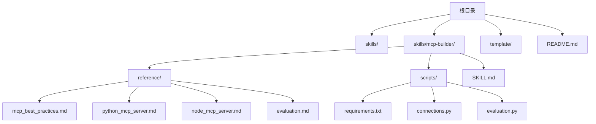
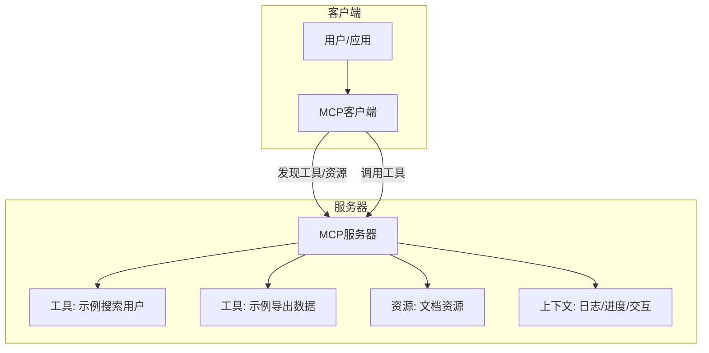
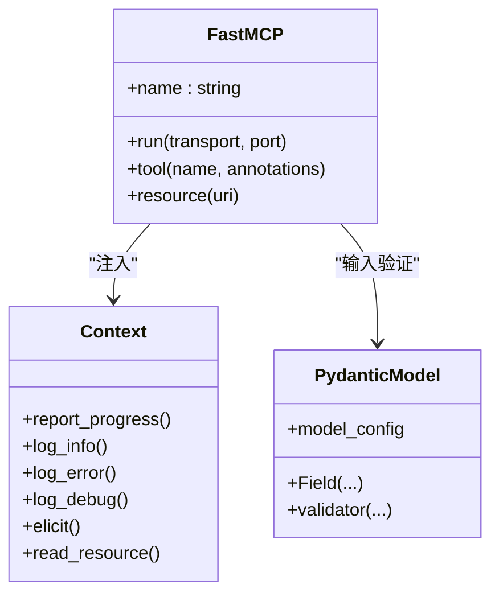
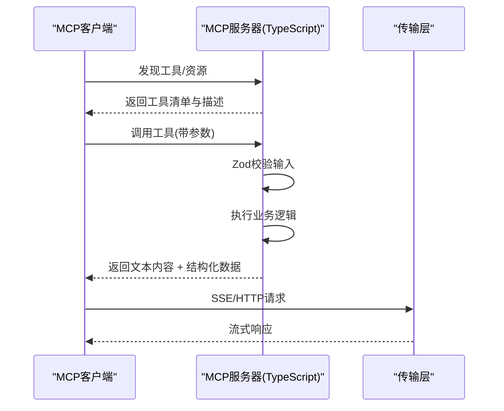
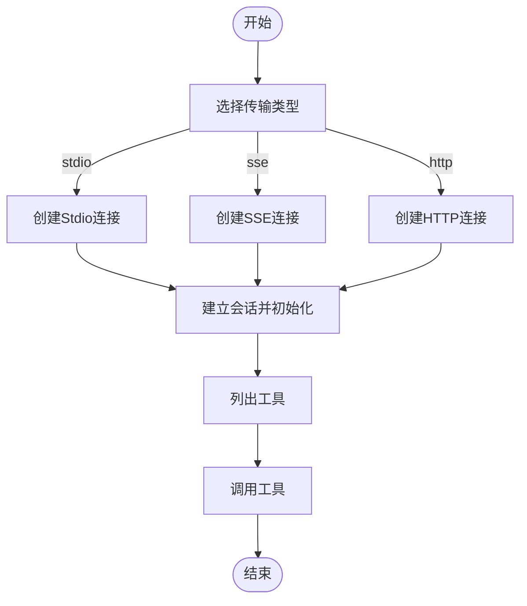
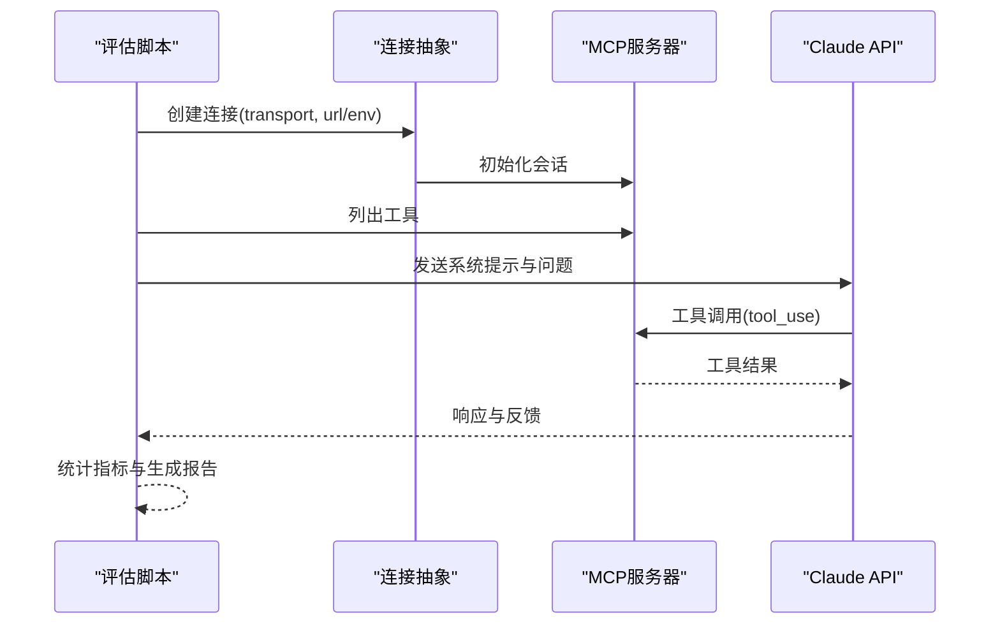
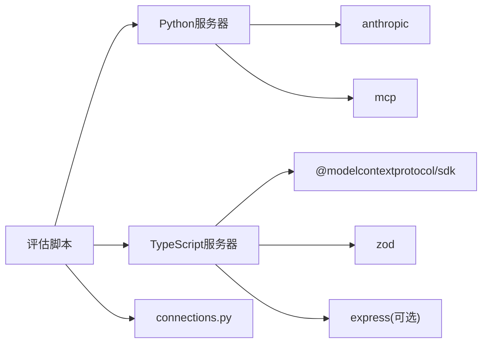

# MCP服务器构建

<cite>
**本文引用的文件**
- [README.md](file://README.md)
- [SKILL.md](file://template/SKILL.md)
- [SKILL.md](file://skills/mcp-builder/SKILL.md)
- [mcp_best_practices.md](file://skills/mcp-builder/reference/mcp_best_practices.md)
- [python_mcp_server.md](file://skills/mcp-builder/reference/python_mcp_server.md)
- [node_mcp_server.md](file://skills/mcp-builder/reference/node_mcp_server.md)
- [evaluation.md](file://skills/mcp-builder/reference/evaluation.md)
- [requirements.txt](file://skills/mcp-builder/scripts/requirements.txt)
- [connections.py](file://skills/mcp-builder/scripts/connections.py)
- [evaluation.py](file://skills/mcp-builder/scripts/evaluation.py)
- [generator_template.js](file://skills/algorithmic-art/templates/generator_template.js)
- [viewer.html](file://skills/algorithmic-art/templates/viewer.html)
- [html2pptx.js](file://skills/pptx/scripts/html2pptx.js)
</cite>

## 目录
1. [简介](#简介)
2. [项目结构](#项目结构)
3. [核心组件](#核心组件)
4. [架构总览](#架构总览)
5. [详细组件分析](#详细组件分析)
6. [依赖关系分析](#依赖关系分析)
7. [性能考量](#性能考量)
8. [故障排查指南](#故障排查指南)
9. [结论](#结论)
10. [附录](#附录)

## 简介
本技术文档面向希望基于MCP（Model Context Protocol）构建高质量服务器的开发者，系统阐述MCP协议工作原理、服务器架构设计与实现模式，并对比TypeScript与Python两种实现方式。文档覆盖项目结构、依赖管理、工具注册、错误处理、传输机制（HTTP与stdio）、工具设计原则、命名约定、上下文管理、评估与测试流程等主题，提供从需求分析到部署测试的完整开发指南。

## 项目结构
仓库包含多个技能示例与MCP构建参考材料，其中与MCP服务器构建直接相关的核心内容集中在skills/mcp-builder目录下，配套有TypeScript与Python实现指南、最佳实践、评估脚本与连接封装。

图表来源
- [SKILL.md](file://skills/mcp-builder/SKILL.md#L1-L237)
- [mcp_best_practices.md](file://skills/mcp-builder/reference/mcp_best_practices.md#L1-L250)
- [python_mcp_server.md](file://skills/mcp-builder/reference/python_mcp_server.md#L1-L719)
- [node_mcp_server.md](file://skills/mcp-builder/reference/node_mcp_server.md#L1-L970)
- [evaluation.md](file://skills/mcp-builder/reference/evaluation.md#L1-L602)
- [requirements.txt](file://skills/mcp-builder/scripts/requirements.txt#L1-L3)
- [connections.py](file://skills/mcp-builder/scripts/connections.py#L1-L152)
- [evaluation.py](file://skills/mcp-builder/scripts/evaluation.py#L1-L374)

章节来源
- [README.md](file://README.md#L1-L95)
- [SKILL.md](file://skills/mcp-builder/SKILL.md#L1-L237)

## 核心组件
- 服务器框架与SDK
  - Python：使用FastMCP（MCP Python SDK）进行服务初始化、工具注册与上下文注入。
  - TypeScript：使用MCP TypeScript SDK（McpServer、registerTool、registerResource等）进行服务初始化与工具注册。
- 工具与资源注册
  - 工具：通过装饰器或注册方法定义输入输出模式、注解与行为提示。
  - 资源：通过URI模板暴露数据端点，支持静态或半静态数据访问。
- 连接与传输
  - connections.py提供统一的连接抽象，支持stdio、SSE、HTTP三种传输类型。
  - evaluation.py提供评估脚本，支持本地stdio与远程SSE/HTTP连接。
- 评估体系
  - evaluation.md定义评估流程、问题设计原则与报告格式。
  - evaluation.py自动加载工具、执行多轮对话、统计指标并生成报告。

章节来源
- [python_mcp_server.md](file://skills/mcp-builder/reference/python_mcp_server.md#L35-L473)
- [node_mcp_server.md](file://skills/mcp-builder/reference/node_mcp_server.md#L50-L756)
- [mcp_best_practices.md](file://skills/mcp-builder/reference/mcp_best_practices.md#L1-L250)
- [connections.py](file://skills/mcp-builder/scripts/connections.py#L1-L152)
- [evaluation.py](file://skills/mcp-builder/scripts/evaluation.py#L1-L374)
- [evaluation.md](file://skills/mcp-builder/reference/evaluation.md#L1-L602)

## 架构总览
MCP服务器采用“工具即能力”的设计，客户端通过MCP协议发现并调用工具，服务器根据工具定义完成外部系统集成。TypeScript与Python实现分别对应不同的SDK与运行时，但共享相同的协议与最佳实践。

图表来源
- [node_mcp_server.md](file://skills/mcp-builder/reference/node_mcp_server.md#L116-L274)
- [python_mcp_server.md](file://skills/mcp-builder/reference/python_mcp_server.md#L334-L472)
- [mcp_best_practices.md](file://skills/mcp-builder/reference/mcp_best_practices.md#L190-L201)

## 详细组件分析

### Python MCP服务器实现
- 服务器命名与结构
  - 命名格式：{service}_mcp（例如slack_mcp），强调通用性与描述性。
  - 结构要点：使用FastMCP初始化，工具通过@mcp.tool装饰器注册，支持注解与上下文参数注入。
- 工具注册与输入验证
  - 使用Pydantic模型进行输入验证，字段约束与描述清晰，避免手动校验。
  - 支持多种返回类型（字符串、TypedDict、Pydantic模型），自动序列化。
- 上下文与资源
  - Context参数用于日志、进度上报与用户交互；资源通过URI模板暴露数据端点。
- 传输选择
  - stdio：本地工具、子进程执行；HTTP：远程服务、多客户端场景。
- 错误处理与响应格式
  - 统一错误格式化，区分HTTP状态码与超时等异常；支持Markdown与JSON双格式输出。

图表来源
- [python_mcp_server.md](file://skills/mcp-builder/reference/python_mcp_server.md#L35-L119)
- [python_mcp_server.md](file://skills/mcp-builder/reference/python_mcp_server.md#L478-L526)
- [python_mcp_server.md](file://skills/mcp-builder/reference/python_mcp_server.md#L527-L548)

章节来源
- [python_mcp_server.md](file://skills/mcp-builder/reference/python_mcp_server.md#L1-L719)

### TypeScript MCP服务器实现
- 服务器命名与结构
  - 命名格式：{service}-mcp-server（例如slack-mcp-server），强调通用性与描述性。
  - 推荐结构：src/index.ts主入口、src/tools/工具实现、src/services/共享服务、src/schemas/输入模式、src/constants.ts常量。
- 工具注册与输入验证
  - 使用registerTool注册工具，Zod模式提供运行时类型安全与约束校验。
  - 显式提供title、description、inputSchema、annotations，确保工具描述与行为清晰。
- 资源与提示
  - registerResource注册URI模板资源；registerPrompt注册提示模板。
- 传输与运行
  - stdio：StdioServerTransport；HTTP：StreamableHTTPServerTransport。
- 错误处理与响应格式
  - 统一错误消息，支持Markdown与JSON双格式；CHARACTER_LIMIT控制响应大小。

图表来源
- [node_mcp_server.md](file://skills/mcp-builder/reference/node_mcp_server.md#L116-L274)
- [node_mcp_server.md](file://skills/mcp-builder/reference/node_mcp_server.md#L584-L756)

章节来源
- [node_mcp_server.md](file://skills/mcp-builder/reference/node_mcp_server.md#L1-L970)

### 连接与传输抽象（Python）
- 抽象类MCPConnection统一管理连接生命周期，支持stdio、SSE、HTTP三类传输。
- 工厂函数create_connection按transport类型返回具体连接实例。
- 提供list_tools与call_tool等通用接口，便于测试与评估。

图表来源
- [connections.py](file://skills/mcp-builder/scripts/connections.py#L112-L152)

章节来源
- [connections.py](file://skills/mcp-builder/scripts/connections.py#L1-L152)

### 评估与测试（Python）
- evaluation.py自动加载工具、与Claude模型交互、记录指标并生成报告。
- 支持stdio（自动启动服务器）、SSE、HTTP三种连接方式。
- evaluation.md提供评估问题设计原则、XML格式规范与运行示例。

图表来源
- [evaluation.py](file://skills/mcp-builder/scripts/evaluation.py#L86-L151)
- [evaluation.py](file://skills/mcp-builder/scripts/evaluation.py#L220-L273)
- [evaluation.md](file://skills/mcp-builder/reference/evaluation.md#L378-L500)

章节来源
- [evaluation.py](file://skills/mcp-builder/scripts/evaluation.py#L1-L374)
- [evaluation.md](file://skills/mcp-builder/reference/evaluation.md#L1-L602)

### 工具设计原则与最佳实践
- 命名约定
  - Python：{service}_mcp；TypeScript：{service}-mcp-server。
  - 工具命名：snake_case，包含服务前缀，动词开头，具体资源。
- 输入输出
  - 使用Pydantic（Python）或Zod（TypeScript）进行输入验证与约束。
  - 输出支持Markdown与JSON，兼顾人类可读与机器可解析。
- 分页与字符限制
  - 实现分页元数据（has_more、next_offset、total_count）。
  - 控制响应长度，避免上下文溢出。
- 安全与错误处理
  - 统一错误消息，不泄露内部细节；记录安全相关错误。
  - 防DNS重绑定（本地HTTP服务器需校验Origin头）。

章节来源
- [mcp_best_practices.md](file://skills/mcp-builder/reference/mcp_best_practices.md#L1-L250)

### 开发流程指南（从需求到部署）
- 需求分析与规划
  - 研究MCP协议与SDK文档，理解API覆盖与工作流工具平衡。
  - 规划工具清单与命名策略，明确鉴权与限流要求。
- 设计与实现
  - 选择语言与SDK（TypeScript推荐，Python亦可）。
  - 定义输入/输出模式，实现工具与资源注册，配置传输（stdio或HTTP）。
- 测试与评估
  - 使用MCP Inspector与evaluation.py进行功能与性能测试。
  - 基于evaluation.md设计复杂、真实、稳定的评估问题集。
- 部署与运维
  - stdio：本地开发与调试；HTTP：云服务部署，注意安全与监控。
  - 持续迭代：依据评估报告优化工具描述、参数与错误消息。

章节来源
- [SKILL.md](file://skills/mcp-builder/SKILL.md#L15-L196)
- [evaluation.md](file://skills/mcp-builder/reference/evaluation.md#L174-L376)

## 依赖关系分析
- Python实现依赖
  - anthropic：调用Claude API进行评估。
  - mcp：MCP客户端会话与传输适配。
- TypeScript实现依赖
  - @modelcontextprotocol/sdk：MCP服务器SDK。
  - express：HTTP服务承载（可选）。
  - zod：运行时类型验证。
- 共享工具
  - connections.py：统一连接抽象，支持多传输。
  - evaluation.py：自动化评估脚本，支持stdio与远程连接。

图表来源
- [requirements.txt](file://skills/mcp-builder/scripts/requirements.txt#L1-L3)
- [node_mcp_server.md](file://skills/mcp-builder/reference/node_mcp_server.md#L11-L18)
- [connections.py](file://skills/mcp-builder/scripts/connections.py#L7-L10)
- [evaluation.py](file://skills/mcp-builder/scripts/evaluation.py#L17-L19)

章节来源
- [requirements.txt](file://skills/mcp-builder/scripts/requirements.txt#L1-L3)
- [connections.py](file://skills/mcp-builder/scripts/connections.py#L1-L152)
- [evaluation.py](file://skills/mcp-builder/scripts/evaluation.py#L1-L374)

## 性能考量
- I/O与并发
  - 异步网络请求与资源管理，避免阻塞；合理使用连接池与超时。
- 响应大小控制
  - 设置CHARACTER_LIMIT或分页策略，减少上下文压力。
- 工具组合与缓存
  - 合理拆分原子工具，避免一次性返回大量数据；对昂贵操作进行缓存。
- 传输选择
  - 多客户端场景优先HTTP；本地开发优先stdio，简化配置。

## 故障排查指南
- 连接问题
  - stdio：检查命令、参数与环境变量是否正确。
  - SSE/HTTP：确认URL可达、认证头正确、Origin校验（本地HTTP）。
- 低准确率
  - 检查工具描述与参数文档是否清晰；优化错误消息与分页策略。
- 超时与上下文溢出
  - 使用更强模型、减少单次响应大小、优化分页与过滤。
- 安全与合规
  - 确保API密钥存储在环境变量；记录安全相关错误；避免暴露内部细节。

章节来源
- [evaluation.md](file://skills/mcp-builder/reference/evaluation.md#L578-L602)
- [mcp_best_practices.md](file://skills/mcp-builder/reference/mcp_best_practices.md#L152-L187)

## 结论
通过标准化的工具注册、严格的输入输出模式与统一的评估体系，MCP服务器能够有效提升LLM在真实世界任务中的可用性与稳定性。TypeScript与Python实现各有优势：TypeScript在类型安全与生态方面表现突出，Python在快速原型与生态兼容方面具备优势。结合本仓库提供的最佳实践、模板与评估脚本，开发者可以高效地完成从需求分析到部署测试的全流程。

## 附录
- 相关文件与路径
  - Python实现指南：[python_mcp_server.md](file://skills/mcp-builder/reference/python_mcp_server.md)
  - TypeScript实现指南：[node_mcp_server.md](file://skills/mcp-builder/reference/node_mcp_server.md)
  - 最佳实践：[mcp_best_practices.md](file://skills/mcp-builder/reference/mcp_best_practices.md)
  - 评估指南：[evaluation.md](file://skills/mcp-builder/reference/evaluation.md)
  - 连接抽象：[connections.py](file://skills/mcp-builder/scripts/connections.py)
  - 评估脚本：[evaluation.py](file://skills/mcp-builder/scripts/evaluation.py)
  - 依赖声明：[requirements.txt](file://skills/mcp-builder/scripts/requirements.txt)
  - 模板技能：[SKILL.md](file://template/SKILL.md)
  - 算法艺术模板：[generator_template.js](file://skills/algorithmic-art/templates/generator_template.js)、[viewer.html](file://skills/algorithmic-art/templates/viewer.html)
  - HTML转PPTX工具：[html2pptx.js](file://skills/pptx/scripts/html2pptx.js)