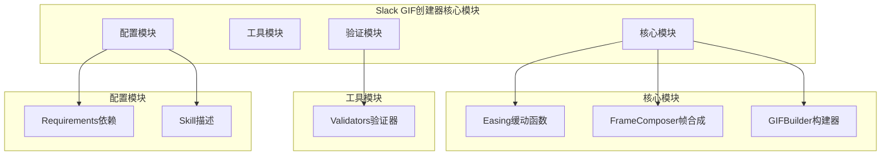
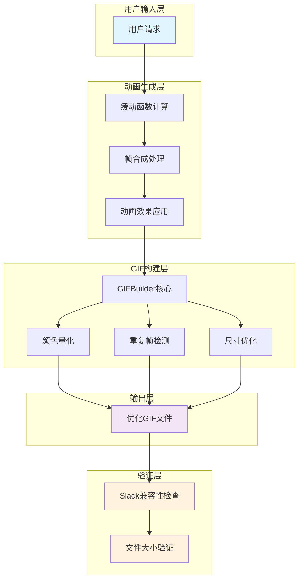
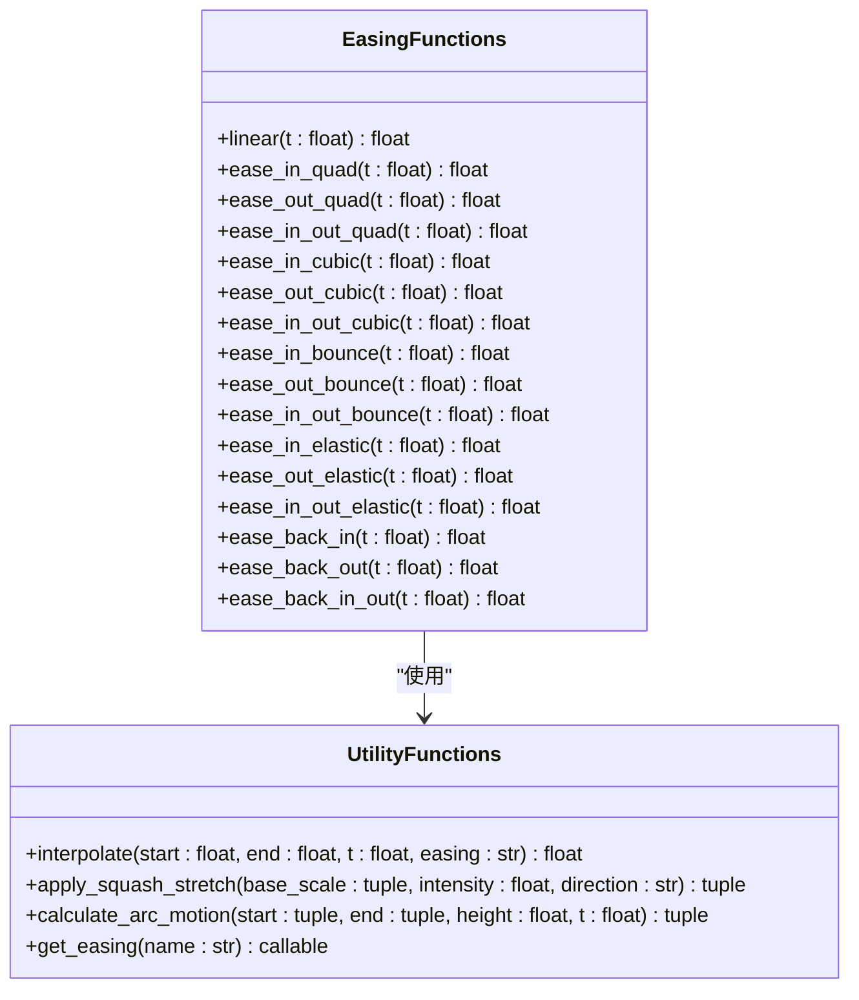
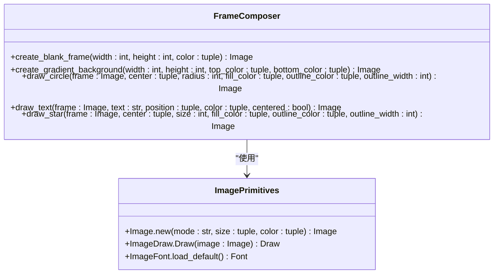
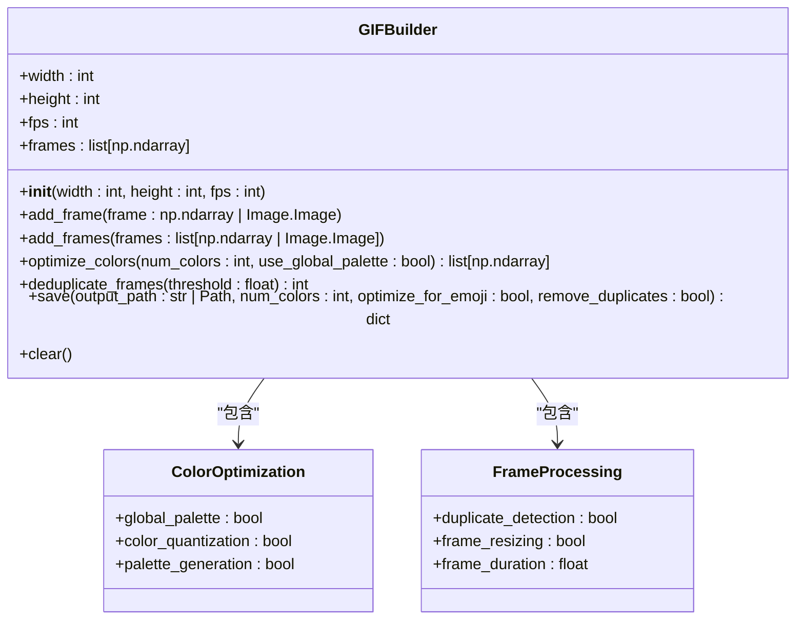
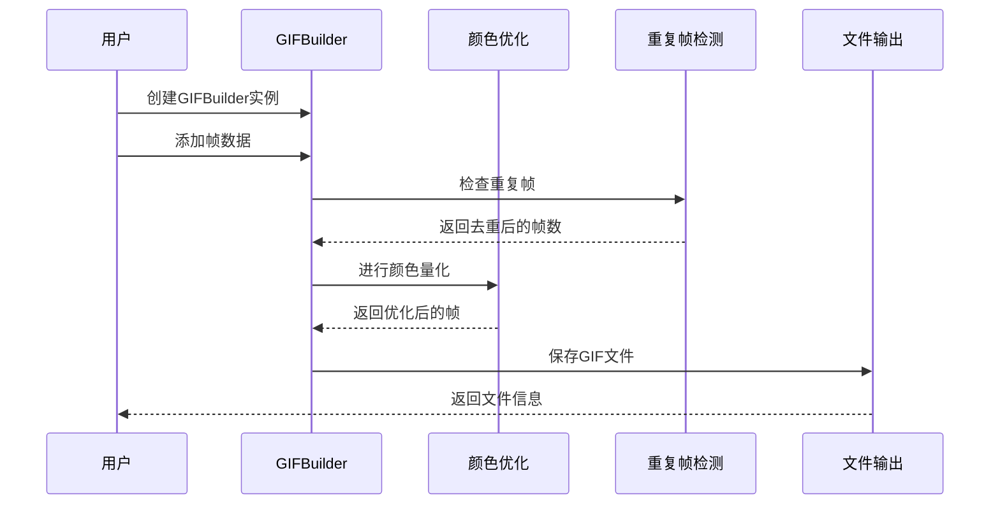
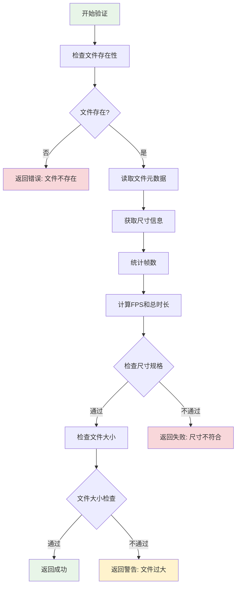
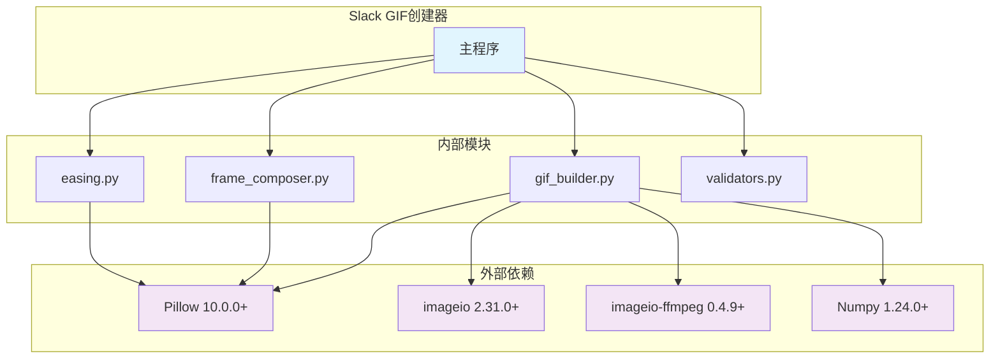

# Slack GIF创建器

<cite>
**本文档引用的文件**
- [easing.py](file://skills/slack-gif-creator/core/easing.py)
- [frame_composer.py](file://skills/slack-gif-creator/core/frame_composer.py)
- [gif_builder.py](file://skills/slack-gif-creator/core/gif_builder.py)
- [validators.py](file://skills/slack-gif-creator/core/validators.py)
- [requirements.txt](file://skills/slack-gif-creator/requirements.txt)
- [SKILL.md](file://skills/slack-gif-creator/SKILL.md)
</cite>

## 目录
1. [简介](#简介)
2. [项目结构](#项目结构)
3. [核心组件](#核心组件)
4. [架构概览](#架构概览)
5. [详细组件分析](#详细组件分析)
6. [依赖关系分析](#依赖关系分析)
7. [性能考虑](#性能考虑)
8. [故障排除指南](#故障排除指南)
9. [结论](#结论)
10. [附录](#附录)

## 简介

Slack GIF创建器是一个专为Slack平台优化的动画GIF生成工具包。该工具包提供了完整的GIF动画生成流水线，包括帧合成技术、缓动函数应用、动画效果实现和质量控制等功能。它特别针对Slack平台的尺寸限制（128x128像素）和文件大小要求进行了优化，同时保持了高度的灵活性和可扩展性。

该工具包的核心目标是帮助开发者和技术美术人员创建高质量的GIF动画，这些动画不仅在视觉上吸引人，还能满足Slack平台的技术要求和性能标准。

## 项目结构

Slack GIF创建器采用模块化设计，将功能分解为四个主要核心模块：



**图表来源**
- [easing.py](file://skills/slack-gif-creator/core/easing.py#L1-L235)
- [frame_composer.py](file://skills/slack-gif-creator/core/frame_composer.py#L1-L177)
- [gif_builder.py](file://skills/slack-gif-creator/core/gif_builder.py#L1-L270)
- [validators.py](file://skills/slack-gif-creator/core/validators.py#L1-L137)

**章节来源**
- [SKILL.md](file://skills/slack-gif-creator/SKILL.md#L1-L255)

## 核心组件

Slack GIF创建器由四个核心组件构成，每个组件都有特定的功能和职责：

### 缓动函数模块 (easing.py)
提供多种数学缓动函数，用于创建自然流畅的动画效果。支持线性、二次、三次、弹跳、弹性、回弹等多种缓动类型。

### 帧合成模块 (frame_composer.py)
包含创建空白帧、绘制圆形、文本、渐变背景和五角星等图形元素的实用工具函数。

### GIF构建器模块 (gif_builder.py)
核心构建器类，负责将帧集合转换为优化的GIF文件，包含颜色量化、重复帧去除和尺寸调整等功能。

### 验证器模块 (validators.py)
提供GIF文件的验证功能，确保生成的GIF符合Slack平台的要求和约束条件。

**章节来源**
- [easing.py](file://skills/slack-gif-creator/core/easing.py#L1-L235)
- [frame_composer.py](file://skills/slack-gif-creator/core/frame_composer.py#L1-L177)
- [gif_builder.py](file://skills/slack-gif-creator/core/gif_builder.py#L1-L270)
- [validators.py](file://skills/slack-gif-creator/core/validators.py#L1-L137)

## 架构概览

整个系统采用分层架构设计，从底层的数学计算到高层的GIF生成，形成了一个完整的动画流水线：



**图表来源**
- [gif_builder.py](file://skills/slack-gif-creator/core/gif_builder.py#L17-L270)
- [easing.py](file://skills/slack-gif-creator/core/easing.py#L117-L138)
- [validators.py](file://skills/slack-gif-creator/core/validators.py#L11-L137)

## 详细组件分析

### 缓动函数模块 (easing.py)

缓动函数模块提供了丰富的数学函数来创建自然的动画效果。这些函数接受时间参数t（0.0到1.0），返回经过缓动处理的值。

#### 核心缓动函数类型



**图表来源**
- [easing.py](file://skills/slack-gif-creator/core/easing.py#L12-L235)

#### 缓动函数特性

| 函数类型 | 描述 | 应用场景 |
|---------|------|----------|
| 线性缓动 | 线性插值，无加速效果 | 简单移动动画 |
| 二次缓动 | 加速或减速效果 | 自然运动开始和结束 |
| 弹跳缓动 | 具有弹跳效果的动画 | 落地、跳跃等效果 |
| 弹性缓动 | 具有弹簧拉伸效果 | 拉伸后恢复的动画 |
| 回弹缓动 | 开始时向后拉伸再向前的动画 | 预摆动作 |

**章节来源**
- [easing.py](file://skills/slack-gif-creator/core/easing.py#L117-L138)
- [easing.py](file://skills/slack-gif-creator/core/easing.py#L163-L223)

### 帧合成模块 (frame_composer.py)

帧合成模块提供了创建和绘制基础图形元素的工具函数，这些函数基于Pillow库实现。

#### 图形绘制功能



**图表来源**
- [frame_composer.py](file://skills/slack-gif-creator/core/frame_composer.py#L15-L177)

#### 图形元素特性

| 功能 | 参数说明 | 输出结果 |
|------|----------|----------|
| 创建空白帧 | 宽度、高度、背景色 | 指定尺寸的纯色背景图像 |
| 渐变背景 | 起始色、结束色、尺寸 | 垂直渐变背景图像 |
| 绘制圆形 | 中心点、半径、填充色 | 圆形图形（可选边框） |
| 绘制文本 | 文本内容、位置、颜色 | 文本渲染结果 |
| 绘制五角星 | 中心点、大小、填充色 | 5角星图形 |

**章节来源**
- [frame_composer.py](file://skills/slack-gif-creator/core/frame_composer.py#L15-L177)

### GIF构建器模块 (gif_builder.py)

GIF构建器是整个系统的核心，负责将生成的帧序列转换为最终的GIF文件，并进行各种优化处理。

#### GIF构建器类结构



**图表来源**
- [gif_builder.py](file://skills/slack-gif-creator/core/gif_builder.py#L17-L270)

#### GIF构建流程



**图表来源**
- [gif_builder.py](file://skills/slack-gif-creator/core/gif_builder.py#L160-L266)

**章节来源**
- [gif_builder.py](file://skills/slack-gif-creator/core/gif_builder.py#L17-L270)

### 验证器模块 (validators.py)

验证器模块提供了对生成GIF文件的全面检查功能，确保文件符合Slack平台的技术要求。

#### 验证流程



**图表来源**
- [validators.py](file://skills/slack-gif-creator/core/validators.py#L11-L137)

**章节来源**
- [validators.py](file://skills/slack-gif-creator/core/validators.py#L11-L137)

## 依赖关系分析

系统依赖于几个关键的第三方库来实现其功能：



**图表来源**
- [requirements.txt](file://skills/slack-gif-creator/requirements.txt#L1-L4)
- [gif_builder.py](file://skills/slack-gif-creator/core/gif_builder.py#L12-L14)

### 依赖库功能说明

| 依赖库 | 版本要求 | 主要功能 | 使用场景 |
|--------|----------|----------|----------|
| Pillow | >=10.0.0 | 图像处理和绘制 | 帧创建、图形绘制、颜色处理 |
| imageio | >=2.31.0 | GIF文件读写 | GIF构建和保存 |
| imageio-ffmpeg | >=0.4.9 | FFmpeg集成 | 视频格式支持 |
| numpy | >=1.24.0 | 数值计算 | 图像数组操作、颜色量化 |

**章节来源**
- [requirements.txt](file://skills/slack-gif-creator/requirements.txt#L1-L4)

## 性能考虑

为了确保生成的GIF文件既美观又高效，系统实现了多项性能优化策略：

### 颜色量化优化

系统采用全局调色板和逐帧调色板两种模式：
- **全局调色板**：在整个动画中使用统一的颜色表，显著减少文件大小
- **逐帧调色板**：每帧独立量化，保持更好的颜色保真度

### 重复帧检测

智能的重复帧检测算法可以识别几乎相同的连续帧并自动去除，从而减少文件大小而不影响动画质量。

### 尺寸优化

针对不同类型的GIF（表情符号vs消息GIF）提供不同的优化策略：
- 表情符号GIF自动调整到128x128像素
- 消息GIF保持480x480像素但进行压缩优化

### 内存管理

系统使用高效的NumPy数组操作和适当的内存清理策略，避免内存泄漏和过度占用。

## 故障排除指南

### 常见问题及解决方案

#### 1. GIF文件过大
**症状**：生成的GIF文件超过Slack限制
**解决方案**：
- 减少帧数或降低FPS
- 减少颜色数量（48-128）
- 启用重复帧去除
- 使用表情符号优化模式

#### 2. 尺寸不符合要求
**症状**：GIF尺寸不在128x128或480x480范围内
**解决方案**：
- 使用`optimize_for_emoji=True`自动调整到128x128
- 手动设置合适的宽度和高度参数

#### 3. 颜色失真
**症状**：颜色看起来不自然或有噪点
**解决方案**：
- 增加颜色数量到128
- 关闭全局调色板模式
- 检查输入图像的颜色质量

#### 4. 动画不流畅
**症状**：动画出现卡顿或跳帧
**解决方案**：
- 提高FPS到15-20
- 减少帧数以平衡流畅度和文件大小
- 检查缓动函数的选择

**章节来源**
- [validators.py](file://skills/slack-gif-creator/core/validators.py#L11-L137)
- [gif_builder.py](file://skills/slack-gif-creator/core/gif_builder.py#L160-L266)

## 结论

Slack GIF创建器是一个功能完整、设计精良的动画GIF生成工具包。它通过模块化的架构设计，将复杂的GIF生成过程分解为清晰的功能模块，既保证了易用性，又提供了足够的灵活性。

该工具包的主要优势包括：

1. **完整的动画流水线**：从缓动计算到帧合成再到GIF构建，形成完整的解决方案
2. **性能优化**：内置多种优化策略，确保生成的GIF文件符合Slack要求
3. **高质量输出**：通过颜色量化和重复帧检测保证视觉质量
4. **易于使用**：简洁的API设计和详细的文档说明

对于开发者和技术美术人员来说，这个工具包不仅提供了强大的功能，更重要的是提供了一套完整的动画设计理念和最佳实践，有助于创建出既美观又高效的GIF动画作品。

## 附录

### 使用示例

以下是一些基本的使用示例，展示了如何使用各个模块：

#### 基础GIF创建流程

```python
from core.gif_builder import GIFBuilder
from PIL import Image, ImageDraw

# 1. 创建构建器
builder = GIFBuilder(width=128, height=128, fps=10)

# 2. 生成帧
for i in range(12):
    frame = Image.new('RGB', (128, 128), (240, 248, 255))
    draw = ImageDraw.Draw(frame)
    
    # 在这里添加你的动画逻辑
    # 使用PIL绘制各种图形元素
    
    builder.add_frame(frame)

# 3. 保存并优化
builder.save('output.gif', num_colors=48, optimize_for_emoji=True)
```

#### 使用缓动函数

```python
from core.easing import interpolate

# 计算缓动进度
t = i / (num_frames - 1)

# 应用不同的缓动效果
y_position = interpolate(start=0, end=400, t=t, easing='ease_out')
rotation_angle = interpolate(start=0, end=360, t=t, easing='bounce_out')
scale_factor = interpolate(start=0.8, end=1.2, t=t, easing='elastic_out')
```

#### 验证GIF文件

```python
from core.validators import validate_gif, is_slack_ready

# 详细验证
passes, info = validate_gif('my.gif', is_emoji=True, verbose=True)

# 快速检查
if is_slack_ready('my.gif'):
    print("GIF已准备好上传到Slack!")
```

### 动画设计原则

1. **自然运动**：使用缓动函数替代线性运动
2. **视觉层次**：合理安排前景、背景和特效元素
3. **色彩搭配**：使用对比度高且和谐的颜色组合
4. **简洁明了**：避免过于复杂的设计，突出核心元素
5. **性能平衡**：在质量和文件大小之间找到最佳平衡点

### 最佳实践建议

1. **先设计后实现**：在编写代码前先规划动画效果
2. **渐进式开发**：从简单效果开始，逐步增加复杂度
3. **性能监控**：定期检查生成文件的大小和质量
4. **用户反馈**：根据实际使用效果调整参数设置
5. **版本控制**：保存不同版本的动画，便于比较和改进