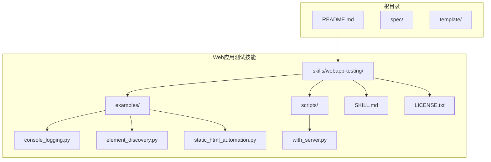
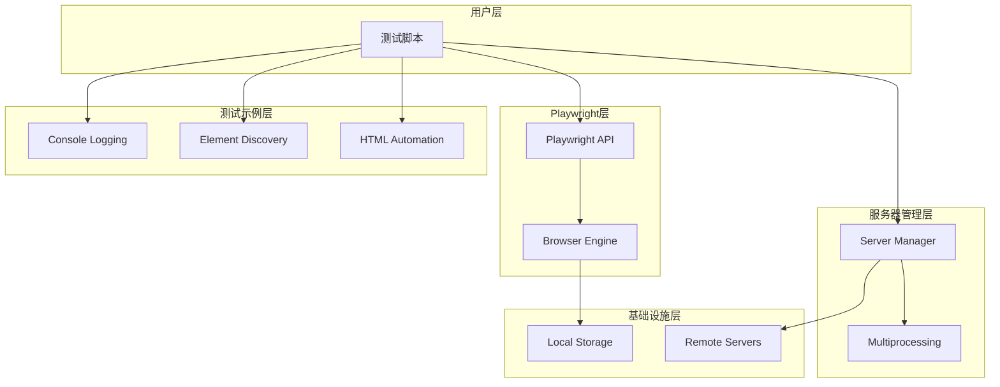
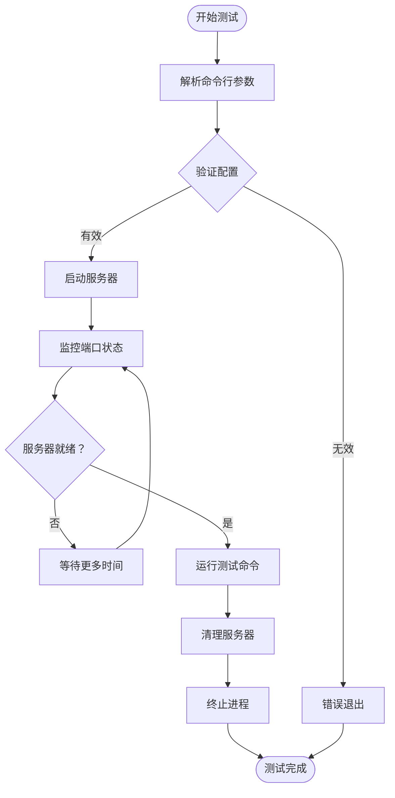
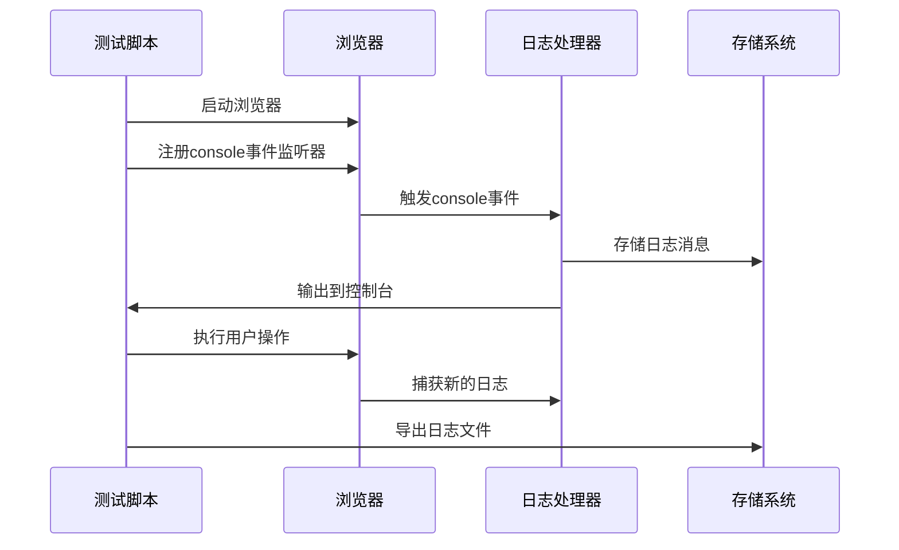
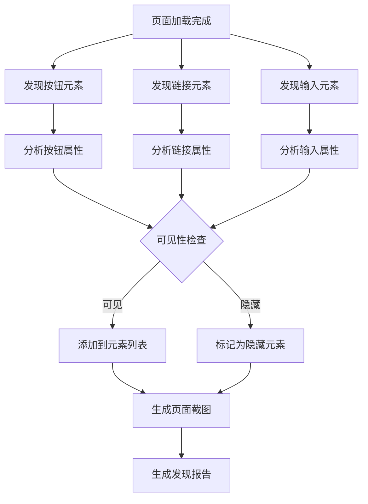
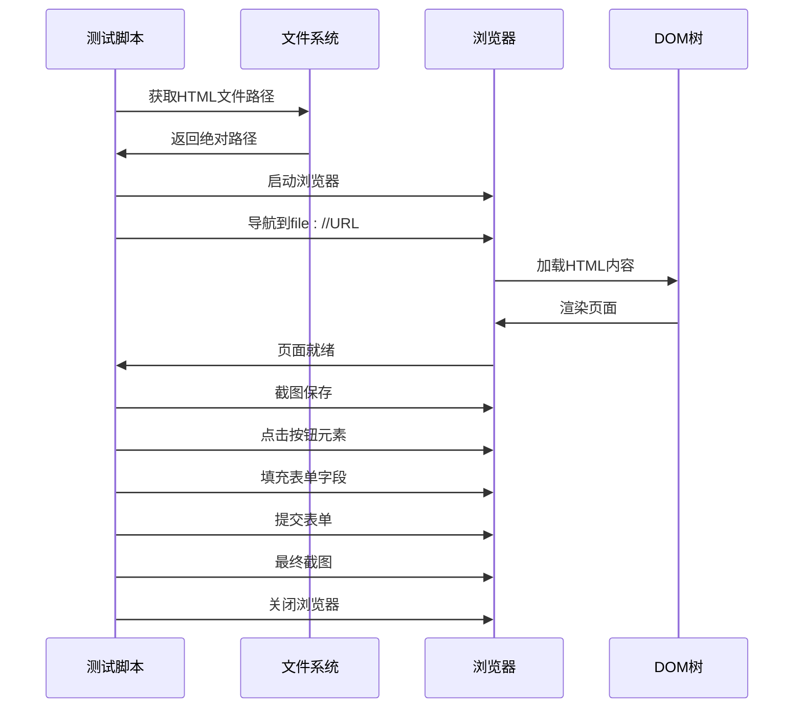
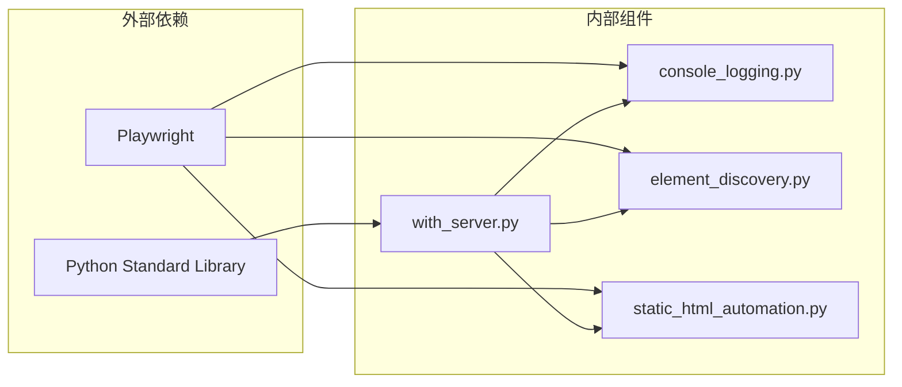
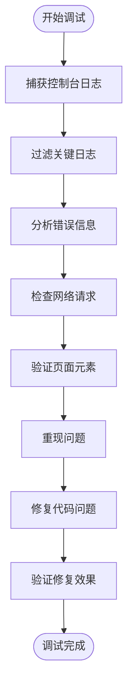

# Web应用测试

<cite>
**本文档引用的文件**
- [README.md](file://README.md)
- [SKILL.md](file://skills/webapp-testing/SKILL.md)
- [with_server.py](file://skills/webapp-testing/scripts/with_server.py)
- [console_logging.py](file://skills/webapp-testing/examples/console_logging.py)
- [element_discovery.py](file://skills/webapp-testing/examples/element_discovery.py)
- [static_html_automation.py](file://skills/webapp-testing/examples/static_html_automation.py)
- [LICENSE.txt](file://skills/webapp-testing/LICENSE.txt)
</cite>

## 目录
1. [简介](#简介)
2. [项目结构](#项目结构)
3. [核心组件](#核心组件)
4. [架构概览](#架构概览)
5. [详细组件分析](#详细组件分析)
6. [依赖关系分析](#依赖关系分析)
7. [性能考虑](#性能考虑)
8. [故障排除指南](#故障排除指南)
9. [结论](#结论)
10. [附录](#附录)

## 简介

Web应用测试技能是一个基于Playwright的自动化测试工具包，专为测试本地Web应用程序而设计。该工具包提供了完整的测试解决方案，包括服务器生命周期管理、页面元素发现、动态内容处理、静态HTML自动化等功能。

该项目的核心目标是帮助开发者构建可靠的Web应用测试体系，通过Playwright集成实现自动化测试，支持验证前端功能、调试UI行为、捕获浏览器截图和查看浏览器日志。

## 项目结构

Web应用测试技能采用模块化设计，主要包含以下结构：

**图表来源**
- [SKILL.md](file://skills/webapp-testing/SKILL.md#L1-L96)
- [README.md](file://README.md#L1-L95)

**章节来源**
- [SKILL.md](file://skills/webapp-testing/SKILL.md#L1-L96)
- [README.md](file://README.md#L1-L95)

## 核心组件

### Playwright集成层

Playwright是现代Web应用测试的核心引擎，提供了强大的浏览器自动化能力：

- **同步API支持**：使用`sync_playwright()`确保测试脚本的简洁性
- **多浏览器支持**：专注于Chromium浏览器的headless模式运行
- **智能等待机制**：通过`wait_for_load_state('networkidle')`确保JavaScript完全执行

### 服务器管理器

`with_server.py`提供了灵活的服务器生命周期管理：

- **多服务器支持**：可同时启动后端和前端服务
- **端口监控**：自动检测服务器就绪状态
- **优雅清理**：测试完成后自动终止所有服务器进程

### 测试示例集合

项目包含三个核心测试示例，覆盖不同的测试场景：

1. **控制台日志记录**：捕获和分析浏览器控制台输出
2. **元素发现**：自动识别页面上的按钮、链接和输入框
3. **静态HTML自动化**：处理本地HTML文件的交互

**章节来源**
- [SKILL.md](file://skills/webapp-testing/SKILL.md#L83-L96)
- [with_server.py](file://skills/webapp-testing/scripts/with_server.py#L1-L106)

## 架构概览

Web应用测试技能采用分层架构设计，确保测试流程的清晰性和可维护性：

**图表来源**
- [with_server.py](file://skills/webapp-testing/scripts/with_server.py#L63-L102)
- [console_logging.py](file://skills/webapp-testing/examples/console_logging.py#L9-L28)
- [element_discovery.py](file://skills/webapp-testing/examples/element_discovery.py#L5-L40)

## 详细组件分析

### 服务器生命周期管理器

`with_server.py`实现了复杂的服务器管理逻辑，支持多服务器协调启动和清理。

#### 核心功能特性

**图表来源**
- [with_server.py](file://skills/webapp-testing/scripts/with_server.py#L35-L102)

#### 多服务器协调机制

系统支持同时管理多个独立的服务实例：

- **独立进程管理**：每个服务器在单独的子进程中运行
- **端口健康检查**：通过socket连接验证服务器可用性
- **超时控制**：可配置的启动超时时间（默认30秒）

**章节来源**
- [with_server.py](file://skills/webapp-testing/scripts/with_server.py#L23-L32)
- [with_server.py](file://skills/webapp-testing/scripts/with_server.py#L63-L102)

### 控制台日志捕获系统

控制台日志记录功能提供了完整的浏览器控制台监控能力：

#### 日志捕获流程

**图表来源**
- [console_logging.py](file://skills/webapp-testing/examples/console_logging.py#L13-L18)
- [console_logging.py](file://skills/webapp-testing/examples/console_logging.py#L30-L35)

#### 日志分类和过滤

系统支持多种日志类型的捕获和处理：

- **错误日志**：JavaScript错误、网络请求失败
- **警告日志**：潜在问题、性能警告
- **信息日志**：正常操作、状态更新
- **调试日志**：开发调试信息

**章节来源**
- [console_logging.py](file://skills/webapp-testing/examples/console_logging.py#L1-L35)

### 页面元素发现引擎

元素发现功能提供了智能的页面元素识别和交互能力：

#### 元素发现算法

**图表来源**
- [element_discovery.py](file://skills/webapp-testing/examples/element_discovery.py#L13-L38)

#### 多维度元素分析

系统提供全面的元素属性分析：

- **按钮分析**：文本内容、样式状态、交互能力
- **链接分析**：目标URL、相对路径、锚点定位
- **表单元素**：字段名称、类型、验证规则

**章节来源**
- [element_discovery.py](file://skills/webapp-testing/examples/element_discovery.py#L1-L40)

### 静态HTML自动化框架

静态HTML自动化功能专门处理本地HTML文件的测试场景：

#### 自动化工作流程

**图表来源**
- [static_html_automation.py](file://skills/webapp-testing/examples/static_html_automation.py#L6-L31)

**章节来源**
- [static_html_automation.py](file://skills/webapp-testing/examples/static_html_automation.py#L1-L33)

## 依赖关系分析

Web应用测试技能的依赖关系相对简单，主要依赖于标准库和Playwright：

**图表来源**
- [with_server.py](file://skills/webapp-testing/scripts/with_server.py#L17-L21)
- [console_logging.py](file://skills/webapp-testing/examples/console_logging.py#L1)
- [element_discovery.py](file://skills/webapp-testing/examples/element_discovery.py#L1)
- [static_html_automation.py](file://skills/webapp-testing/examples/static_html_automation.py#L1)

### 核心依赖说明

- **Python标准库**：用于进程管理、网络通信和文件操作
- **Playwright**：提供浏览器自动化和页面交互能力
- **Socket模块**：用于服务器端口健康检查
- **Subprocess模块**：用于启动和管理外部进程

**章节来源**
- [with_server.py](file://skills/webapp-testing/scripts/with_server.py#L17-L21)

## 性能考虑

### 内存管理优化

Web应用测试技能在内存管理方面采用了多项优化措施：

- **浏览器资源回收**：测试完成后立即关闭浏览器实例
- **进程清理机制**：确保所有子进程被正确终止
- **文件句柄管理**：及时关闭日志文件和其他资源

### 并发处理策略

系统支持多服务器并发启动，提高了测试效率：

- **异步端口检查**：多个服务器可以同时进行端口健康检查
- **并行测试执行**：不同测试可以在同一时间运行
- **资源池管理**：合理分配系统资源避免过载

### 网络性能优化

针对网络相关的测试场景，系统提供了以下优化：

- **超时配置**：可调整服务器启动和响应超时时间
- **重试机制**：在网络不稳定时自动重试连接
- **连接复用**：在可能的情况下复用网络连接

## 故障排除指南

### 常见问题诊断

#### 服务器启动失败

**症状**：`Server failed to start on port X within Ys`

**解决方案**：
1. 检查端口是否被其他进程占用
2. 验证服务器命令的正确性
3. 增加启动超时时间
4. 查看服务器日志输出

#### 页面元素未找到

**症状**：`Element not found`或`Selector not matched`

**解决方案**：
1. 确保页面已完全加载（等待`networkidle`）
2. 使用更精确的选择器
3. 检查元素的可见性状态
4. 调整等待时间

#### 控制台日志缺失

**症状**：无法捕获预期的日志消息

**解决方案**：
1. 确认`console`事件监听器已正确注册
2. 检查浏览器控制台是否有权限限制
3. 验证日志消息的类型和内容
4. 确保测试操作触发了相应的日志输出

### 调试技巧

#### 日志分析方法

#### 性能监控

系统提供了多种性能监控手段：

- **页面加载时间**：测量从导航到`networkidle`的时间
- **元素查找时间**：统计元素定位的耗时
- **内存使用情况**：监控测试过程中的内存占用
- **CPU使用率**：跟踪浏览器进程的CPU消耗

**章节来源**
- [SKILL.md](file://skills/webapp-testing/SKILL.md#L78-L82)

## 结论

Web应用测试技能提供了一个完整、可靠的Web应用测试解决方案。通过Playwright集成和智能的服务器管理，该工具包能够处理各种复杂的测试场景。

### 主要优势

1. **易用性**：提供简化的API和清晰的使用模式
2. **可靠性**：经过充分测试的服务器管理和清理机制
3. **灵活性**：支持静态HTML和动态Web应用的不同需求
4. **可扩展性**：模块化设计便于功能扩展和定制

### 适用场景

- **本地Web应用测试**：快速验证前端功能和用户体验
- **CI/CD集成**：自动化测试流程的可靠执行
- **性能基准测试**：页面加载和交互性能的量化分析
- **回归测试**：确保新功能不影响现有功能

### 发展方向

未来可以考虑的功能增强：

- **并行测试执行**：提高测试效率和覆盖率
- **可视化报告**：生成详细的测试结果报告
- **跨浏览器支持**：扩展对Firefox和Safari的支持
- **测试数据管理**：提供测试数据的生成和管理功能

## 附录

### 快速开始指南

1. **安装依赖**：确保已安装Python和Playwright
2. **运行服务器**：使用`with_server.py`启动测试环境
3. **编写测试**：参考示例脚本编写自动化测试
4. **执行测试**：运行测试脚本并分析结果

### 许可证信息

Web应用测试技能采用Apache 2.0许可证，允许自由使用、修改和分发，但需保留版权声明和许可证声明。

**章节来源**
- [LICENSE.txt](file://skills/webapp-testing/LICENSE.txt#L1-L202)