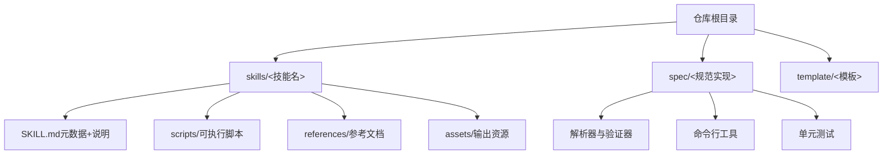
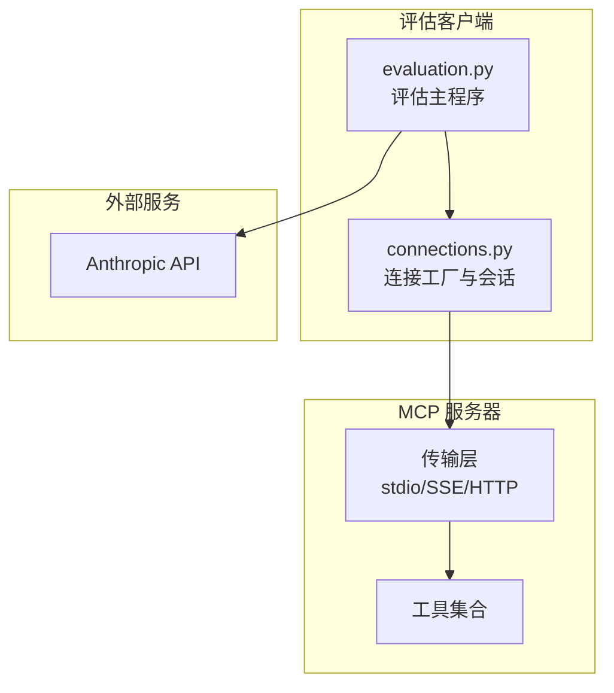
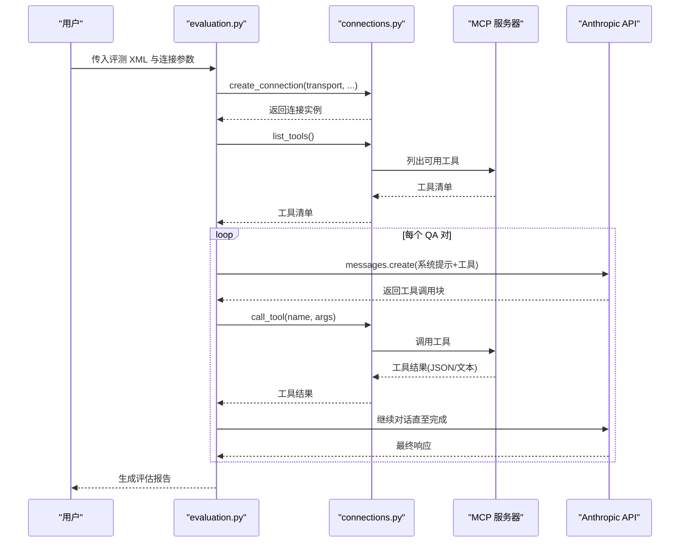
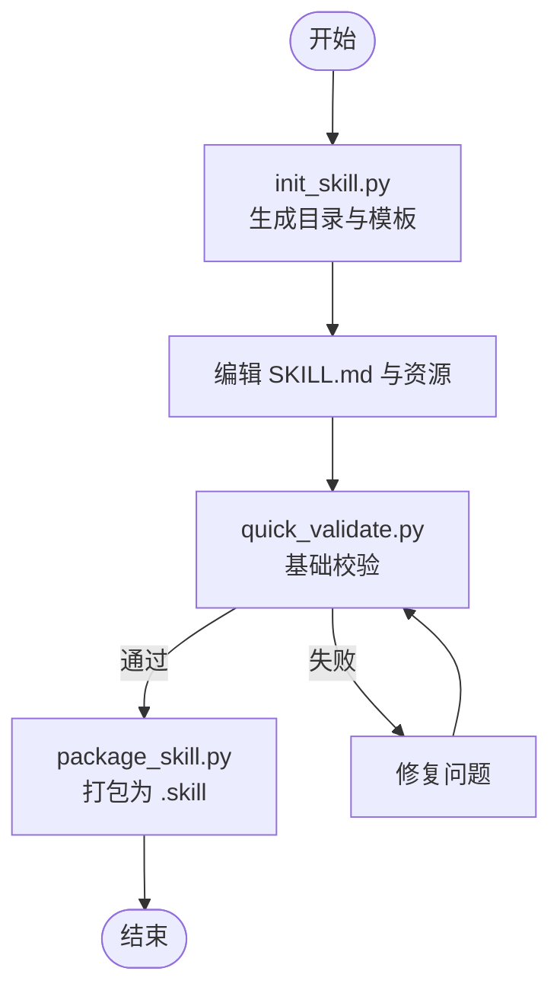
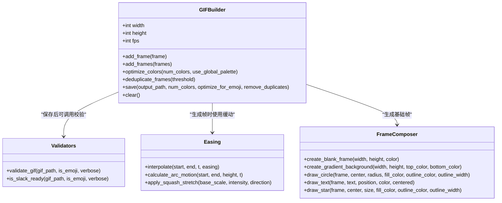
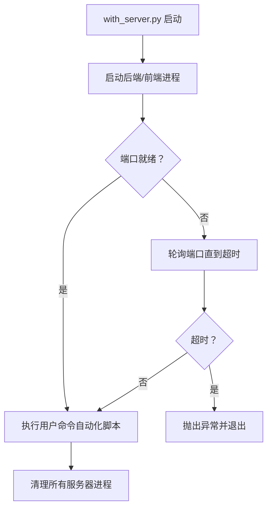
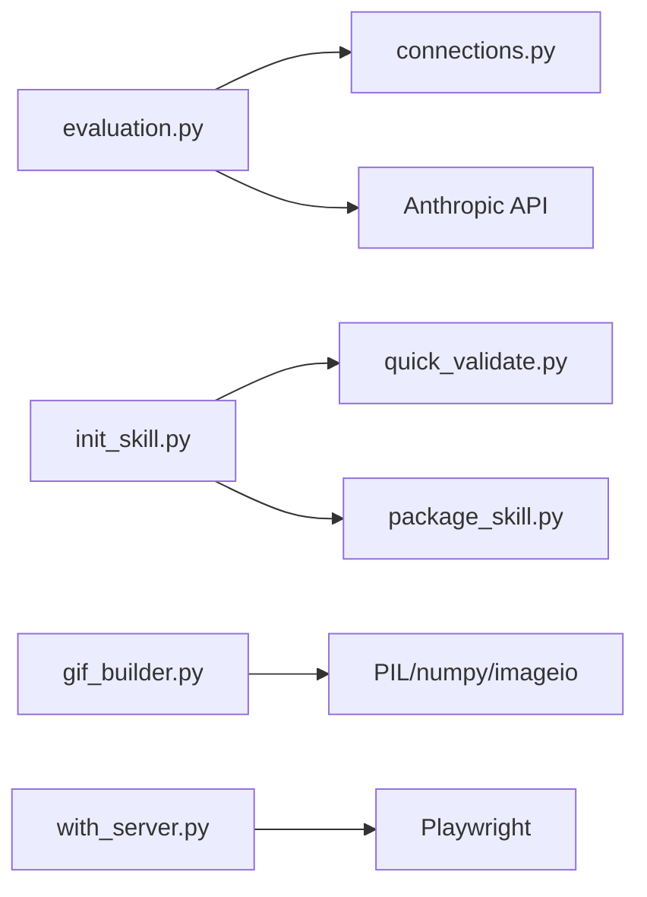

# 技术开发技能

<cite>
**本文引用的文件**
- [README.md](file://README.md)
- [skills/mcp-builder/SKILL.md](file://skills/mcp-builder/SKILL.md)
- [skills/mcp-builder/scripts/connections.py](file://skills/mcp-builder/scripts/connections.py)
- [skills/mcp-builder/scripts/evaluation.py](file://skills/mcp-builder/scripts/evaluation.py)
- [skills/skill-creator/SKILL.md](file://skills/skill-creator/SKILL.md)
- [skills/skill-creator/scripts/init_skill.py](file://skills/skill-creator/scripts/init_skill.py)
- [skills/skill-creator/scripts/package_skill.py](file://skills/skill-creator/scripts/package_skill.py)
- [skills/skill-creator/scripts/quick_validate.py](file://skills/skill-creator/scripts/quick_validate.py)
- [skills/slack-gif-creator/SKILL.md](file://skills/slack-gif-creator/SKILL.md)
- [skills/slack-gif-creator/core/gif_builder.py](file://skills/slack-gif-creator/core/gif_builder.py)
- [skills/slack-gif-creator/core/validators.py](file://skills/slack-gif-creator/core/validators.py)
- [skills/slack-gif-creator/core/easing.py](file://skills/slack-gif-creator/core/easing.py)
- [skills/slack-gif-creator/core/frame_composer.py](file://skills/slack-gif-creator/core/frame_composer.py)
- [skills/webapp-testing/SKILL.md](file://skills/webapp-testing/SKILL.md)
- [skills/webapp-testing/scripts/with_server.py](file://skills/webapp-testing/scripts/with_server.py)
</cite>

## 目录
1. [简介](#简介)
2. [项目结构](#项目结构)
3. [核心组件](#核心组件)
4. [架构总览](#架构总览)
5. [详细组件分析](#详细组件分析)
6. [依赖关系分析](#依赖关系分析)
7. [性能考量](#性能考量)
8. [故障排查指南](#故障排查指南)
9. [结论](#结论)
10. [附录](#附录)

## 简介
本技术文档面向技术开发人员，系统梳理并解释以下能力与工具在本仓库中的实现与用法：
- MCP 服务器构建：基于 Model Context Protocol 的工具服务设计、连接抽象、评估流程与最佳实践。
- 自动化测试框架：Playwright 驱动的 Web 应用测试与多服务生命周期管理。
- 动画生成技术：Slack GIF 创建器的帧合成、颜色量化、去重优化与缓动函数。
- 技能创建工具：技能模板初始化、打包与快速校验，确保可分发技能包的质量与一致性。

文档覆盖技术架构、API 接口、配置选项与集成模式，并提供可视化图示帮助理解各组件之间的交互关系。

## 项目结构
仓库采用“技能”（skills）与“规范”（spec）双层组织方式：
- skills：包含多个独立技能包，每个技能包内含 SKILL.md 元数据与可选资源目录（scripts、references、assets），用于扩展 Claude 的特定任务能力。
- spec：Agent Skills 规范与解析器实现，定义技能的元数据、提示词、模型校验与解析流程。
- template：技能模板，便于快速生成新技能骨架。

章节来源
- file://README.md#L1-L95

## 核心组件
本节聚焦四大核心能力及其关键实现文件：

- MCP 服务器构建
  - 连接抽象与工厂：统一处理 stdio、SSE、Streamable HTTP 三种传输方式，封装会话初始化与工具调用。
  - 评估框架：通过 Anthropic 客户端驱动工具链路，自动运行 XML 中的问答对，统计准确率、耗时与工具调用次数。
  - 参考指南：MCP 协议、SDK 文档与最佳实践，指导工具命名、输入输出模式与错误处理。

- 技能创建工具
  - 初始化：生成技能目录、模板 SKILL.md 与示例资源，约定目录结构与命名规范。
  - 打包：将技能目录压缩为 .skill 文件（zip），内置基础校验。
  - 快速校验：检查 frontmatter 结构、字段类型与长度限制，确保元数据合规。

- Slack GIF 创建器
  - 帧构建器：接收 PIL 图像或 NumPy 数组帧，统一尺寸、颜色量化、去重与保存。
  - 校验器：验证 GIF 维度、大小、帧数与时长是否满足 Slack 要求。
  - 缓动与合成：提供多种缓动函数与图形绘制辅助，便于生成自然流畅的动画。

- Web 应用测试
  - 多服务启动器：支持同时启动后端与前端服务，轮询端口直至就绪，再执行自动化脚本。
  - 测试流程：建议先静态 HTML 再动态应用；动态应用需等待 networkidle 后再进行元素发现与断言。

章节来源
- file://skills/mcp-builder/SKILL.md#L1-L237
- file://skills/mcp-builder/scripts/connections.py#L1-L152
- file://skills/mcp-builder/scripts/evaluation.py#L1-L374
- file://skills/skill-creator/SKILL.md#L1-L357
- file://skills/skill-creator/scripts/init_skill.py#L1-L304
- file://skills/skill-creator/scripts/package_skill.py#L1-L111
- file://skills/skill-creator/scripts/quick_validate.py#L1-L95
- file://skills/slack-gif-creator/SKILL.md#L1-L255
- file://skills/slack-gif-creator/core/gif_builder.py#L1-L270
- file://skills/slack-gif-creator/core/validators.py#L1-L137
- file://skills/slack-gif-creator/core/easing.py#L1-L235
- file://skills/slack-gif-creator/core/frame_composer.py#L1-L177
- file://skills/webapp-testing/SKILL.md#L1-L96
- file://skills/webapp-testing/scripts/with_server.py#L1-L106

## 架构总览
下图展示 MCP 服务器构建与评估的整体架构：客户端通过不同传输方式连接到 MCP 服务器，评估脚本以工具形式驱动工具调用，收集指标并生成报告。

图表来源
- [skills/mcp-builder/scripts/evaluation.py](file://skills/mcp-builder/scripts/evaluation.py#L1-L374)
- [skills/mcp-builder/scripts/connections.py](file://skills/mcp-builder/scripts/connections.py#L1-L152)

## 详细组件分析

### MCP 服务器构建与评估
- 连接抽象
  - 支持三种传输：stdio（本地）、SSE（远程事件流）、Streamable HTTP（远程状态无关 JSON）。
  - 工厂函数根据参数选择具体连接类型，统一初始化会话并暴露列出工具与调用工具的能力。
- 评估流程
  - 读取 XML 评测集，逐条向 Claude 提问，按工具使用顺序循环调用 MCP 工具，记录耗时与工具调用次数。
  - 输出包含准确率、平均耗时、工具调用统计与每条任务摘要与反馈。
- 最佳实践
  - 工具命名清晰、描述简洁；输入输出结构化；错误信息可操作；优先 API 全量覆盖而非仅工作流工具。

图表来源
- [skills/mcp-builder/scripts/evaluation.py](file://skills/mcp-builder/scripts/evaluation.py#L86-L184)
- [skills/mcp-builder/scripts/connections.py](file://skills/mcp-builder/scripts/connections.py#L112-L151)

章节来源
- file://skills/mcp-builder/SKILL.md#L1-L237
- file://skills/mcp-builder/scripts/connections.py#L1-L152
- file://skills/mcp-builder/scripts/evaluation.py#L1-L374

### 技能创建工具链
- 初始化
  - 生成技能目录与模板 SKILL.md，创建 scripts/、references/、assets/ 示例文件，便于直接替换。
  - 校验参数格式与命名规范，避免非法字符与过长名称。
- 打包
  - 将技能目录压缩为 .skill 文件（zip），保持相对路径结构，便于分发与安装。
- 快速校验
  - 校验 frontmatter 存在且为字典，name 与 description 字段存在且符合长度与字符要求；禁止使用尖括号。

图表来源
- [skills/skill-creator/scripts/init_skill.py](file://skills/skill-creator/scripts/init_skill.py#L194-L270)
- [skills/skill-creator/scripts/quick_validate.py](file://skills/skill-creator/scripts/quick_validate.py#L12-L86)
- [skills/skill-creator/scripts/package_skill.py](file://skills/skill-creator/scripts/package_skill.py#L19-L82)

章节来源
- file://skills/skill-creator/SKILL.md#L1-L357
- file://skills/skill-creator/scripts/init_skill.py#L1-L304
- file://skills/skill-creator/scripts/package_skill.py#L1-L111
- file://skills/skill-creator/scripts/quick_validate.py#L1-L95

### Slack GIF 创建器
- 帧构建器
  - 接收 PIL 图像或 NumPy 数组帧，自动调整尺寸，进行全局颜色量化，可选去重相邻相似帧，最终保存为 GIF。
  - 支持 Emoji 专用优化：更少颜色、更短帧数与更小尺寸。
- 校验器
  - 检查 GIF 维度、大小、帧数与时长，针对 Emoji 与消息 GIF 提供不同阈值。
- 缓动与合成
  - 提供线性、二次、弹性、回弹、Back 等缓动函数，以及梯度背景、圆形、星形绘制等合成工具。

图表来源
- [skills/slack-gif-creator/core/gif_builder.py](file://skills/slack-gif-creator/core/gif_builder.py#L17-L269)
- [skills/slack-gif-creator/core/validators.py](file://skills/slack-gif-creator/core/validators.py#L11-L136)
- [skills/slack-gif-creator/core/easing.py](file://skills/slack-gif-creator/core/easing.py#L117-L234)
- [skills/slack-gif-creator/core/frame_composer.py](file://skills/slack-gif-creator/core/frame_composer.py#L15-L176)

章节来源
- file://skills/slack-gif-creator/SKILL.md#L1-L255
- file://skills/slack-gif-creator/core/gif_builder.py#L1-L270
- file://skills/slack-gif-creator/core/validators.py#L1-L137
- file://skills/slack-gif-creator/core/easing.py#L1-L235
- file://skills/slack-gif-creator/core/frame_composer.py#L1-L177

### Web 应用测试
- 多服务启动器
  - 支持多个服务器命令与对应端口，逐一启动并轮询端口直至就绪，随后执行用户指定命令，最后统一清理。
- 测试流程
  - 静态 HTML：直接读取本地文件，定位选择器。
  - 动态应用：等待 networkidle，截图与 DOM 检查，再基于渲染状态识别选择器并执行动作。
- 最佳实践
  - 使用同步 Playwright；始终关闭浏览器；使用 headless Chromium；使用明确的选择器与等待策略。

图表来源
- [skills/webapp-testing/scripts/with_server.py](file://skills/webapp-testing/scripts/with_server.py#L23-L102)

章节来源
- file://skills/webapp-testing/SKILL.md#L1-L96
- file://skills/webapp-testing/scripts/with_server.py#L1-L106

## 依赖关系分析
- MCP 评估依赖 connections 提供的连接工厂与会话，依赖 Anthropic API 完成工具链路的推理与工具调用。
- 技能工具链依赖 Python 标准库与第三方库（如 zipfile、yaml、pathlib），保证跨平台可移植性。
- GIF 创建器依赖 PIL、imageio、numpy，实现高质量的颜色量化与帧序列保存。
- Web 应用测试依赖 Playwright 与 with_server.py 的多服务管理能力。

图表来源
- [skills/mcp-builder/scripts/evaluation.py](file://skills/mcp-builder/scripts/evaluation.py#L17-L19)
- [skills/mcp-builder/scripts/connections.py](file://skills/mcp-builder/scripts/connections.py#L7-L10)
- [skills/skill-creator/scripts/init_skill.py](file://skills/skill-creator/scripts/init_skill.py#L1-L12)
- [skills/skill-creator/scripts/quick_validate.py](file://skills/skill-creator/scripts/quick_validate.py#L6-L10)
- [skills/skill-creator/scripts/package_skill.py](file://skills/skill-creator/scripts/package_skill.py#L13-L16)
- [skills/slack-gif-creator/core/gif_builder.py](file://skills/slack-gif-creator/core/gif_builder.py#L12-L14)
- [skills/webapp-testing/scripts/with_server.py](file://skills/webapp-testing/scripts/with_server.py#L17-L21)

## 性能考量
- MCP 评估
  - 工具调用次数与总耗时是关键指标，应尽量减少不必要的工具调用与重复请求。
  - 使用合适的模型与合理的系统提示，有助于减少工具误用与重试。
- GIF 创建
  - 颜色数越少、帧数越少、尺寸越小，文件体积越小；Emoji 模式进一步收紧约束。
  - 去重相邻相似帧可显著减小体积，但需平衡动画细节。
- Web 测试
  - 动态页面务必等待 networkidle，避免 DOM 不稳定导致的断言失败。
  - 使用 headless 模式与同步 API，减少资源占用与并发不确定性。

## 故障排查指南
- MCP 评估
  - 若连接失败，检查传输类型与必要参数（命令、URL、头信息）是否正确。
  - 工具调用报错时，查看返回的错误堆栈并结合工具描述定位问题。
- 技能打包
  - 若校验失败，确认 frontmatter 是否存在、name 与 description 是否符合长度与字符要求。
  - 打包失败时检查目标目录权限与 zip 写入权限。
- GIF 创建
  - 若尺寸不符，确认输入帧尺寸与 GIFBuilder 初始化参数一致。
  - 若文件过大，尝试降低颜色数、帧数或尺寸，并启用去重。
- Web 测试
  - 服务器未就绪：增加超时时间或检查端口占用。
  - 选择器无效：确认已等待 networkidle 并基于渲染 DOM 重新定位。

章节来源
- file://skills/mcp-builder/scripts/evaluation.py#L346-L373
- file://skills/skill-creator/scripts/quick_validate.py#L12-L86
- file://skills/skill-creator/scripts/package_skill.py#L32-L53
- file://skills/slack-gif-creator/core/gif_builder.py#L179-L180
- file://skills/webapp-testing/scripts/with_server.py#L23-L32

## 结论
本仓库提供了从协议集成、自动化测试到动画生成与技能工程化的完整工具链。通过标准化的连接抽象、严谨的评估流程、灵活的动画合成与严格的技能校验，开发者可以高效地构建可复用、可评估、可分发的技能与工具服务。建议在实际项目中遵循各组件的最佳实践，持续优化性能与稳定性。

## 附录
- MCP 协议与 SDK 文档入口、评估指南与参考文件可在对应技能的 SKILL.md 中找到。
- 技能模板与示例资源位于 template 与各技能的 resources 目录中，便于快速上手。