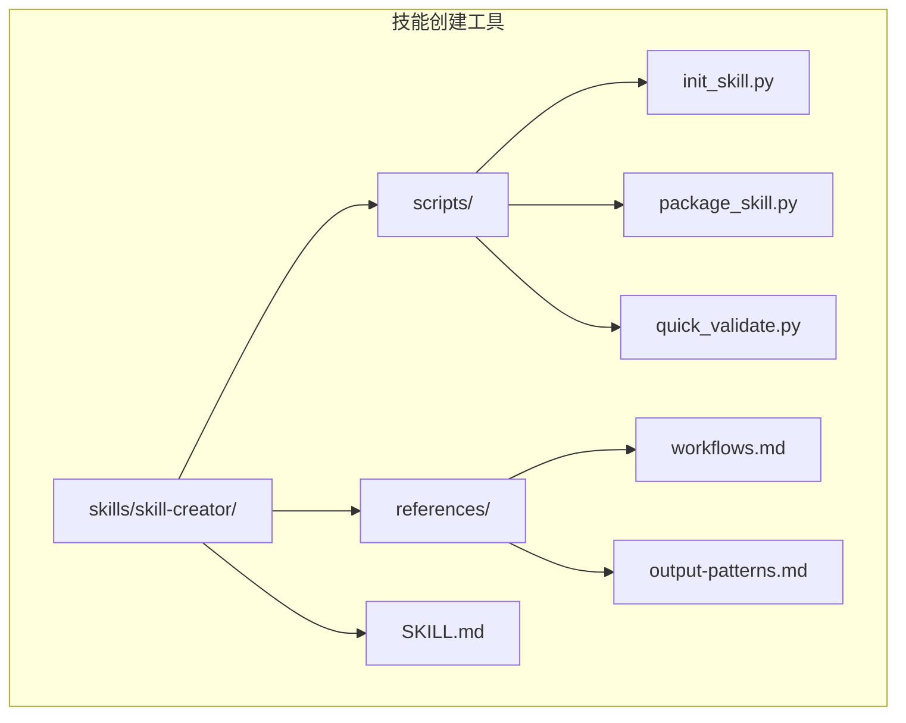
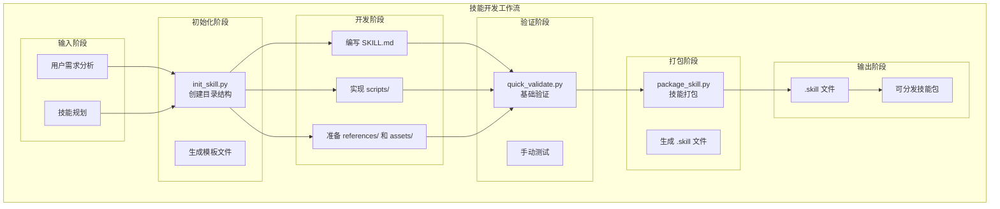
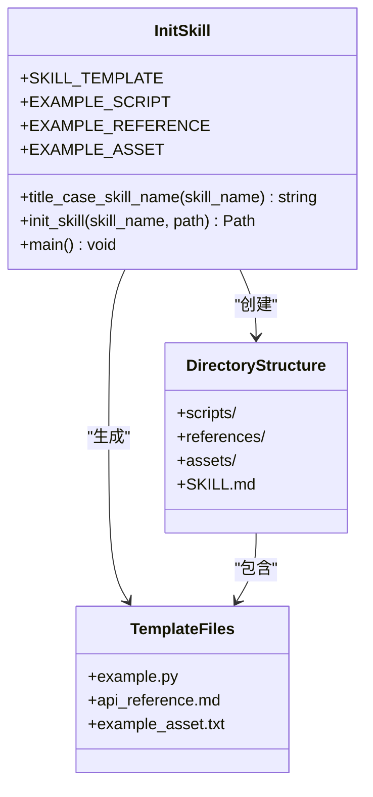
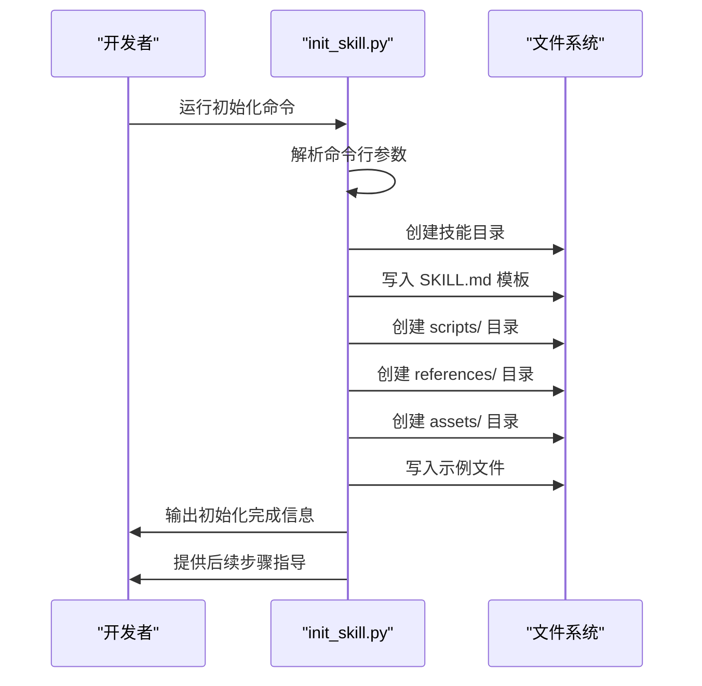
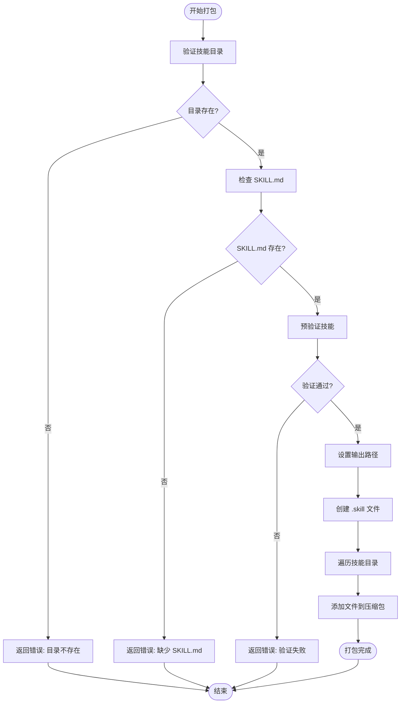
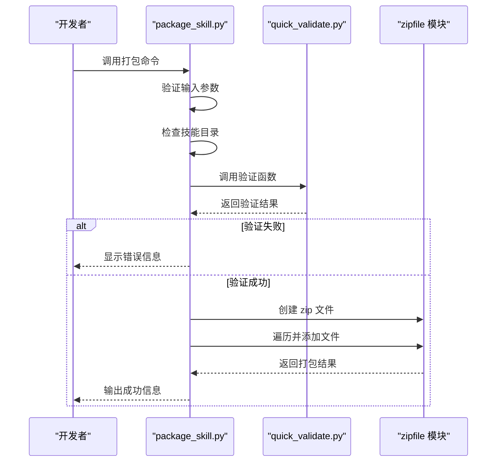
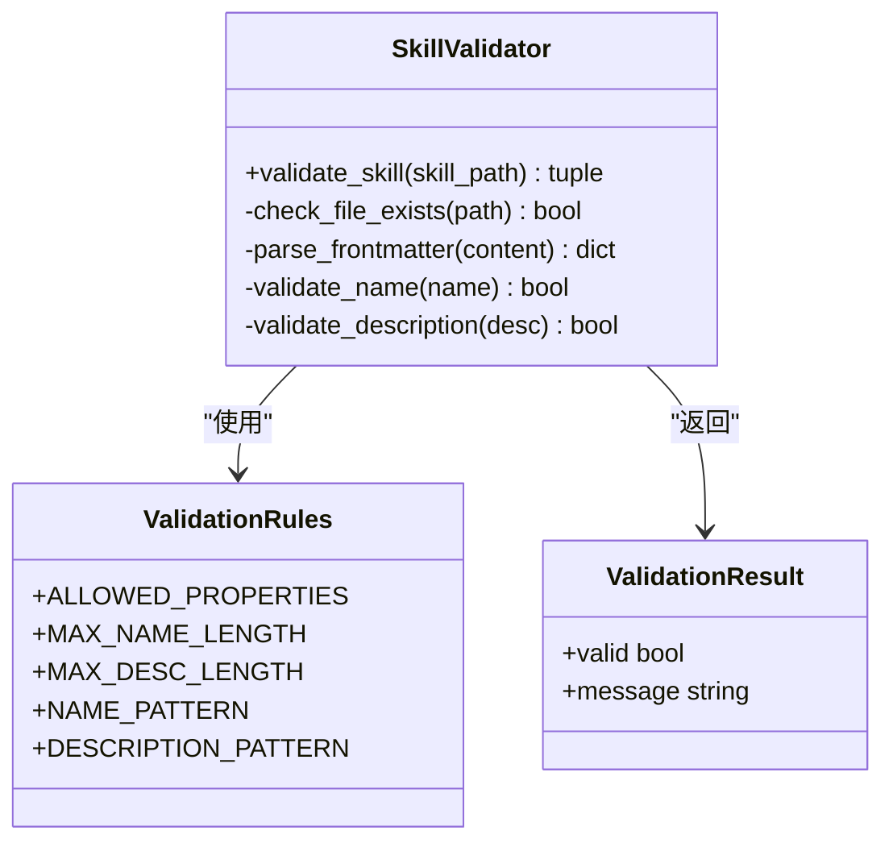
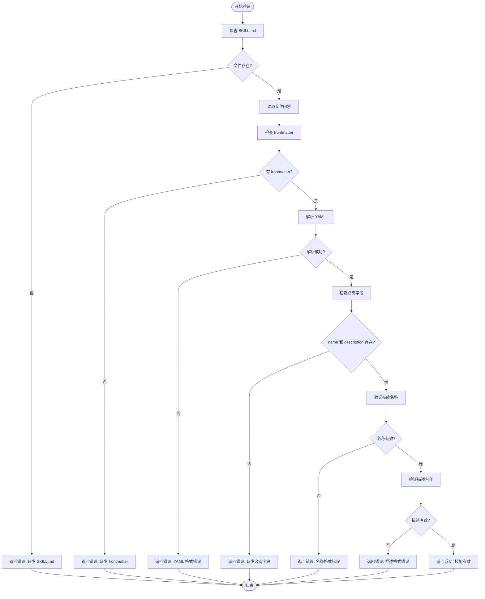

# 技能创建工具

<cite>
**本文引用的文件**
- [init_skill.py](file://skills/skill-creator/scripts/init_skill.py)
- [package_skill.py](file://skills/skill-creator/scripts/package_skill.py)
- [quick_validate.py](file://skills/skill-creator/scripts/quick_validate.py)
- [技能创建器 SKILL.md](file://skills/skill-creator/SKILL.md)
- [工作流模式](file://skills/skill-creator/references/workflows.md)
- [输出模式](file://skills/skill-creator/references/output-patterns.md)
- [模板 SKILL.md](file://template/SKILL.md)
- [DOCX 技能 SKILL.md](file://skills/docx/SKILL.md)
- [PDF 技能 SKILL.md](file://skills/pdf/SKILL.md)
- [PPTX 技能 SKILL.md](file://skills/pptx/SKILL.md)
- [README.md](file://README.md)
</cite>

## 目录
1. [简介](#简介)
2. [项目结构](#项目结构)
3. [核心组件](#核心组件)
4. [架构概览](#架构概览)
5. [详细组件分析](#详细组件分析)
6. [依赖关系分析](#依赖关系分析)
7. [性能考虑](#性能考虑)
8. [故障排除指南](#故障排除指南)
9. [结论](#结论)
10. [附录](#附录)

## 简介
本文件为技能创建工具的全面技术文档，面向希望快速创建和部署新技能的开发者。文档覆盖技能开发的完整工作流程，包括技能初始化、模板使用、打包发布、质量验证等核心环节，并深入解释以下三个关键脚本：
- init_skill.py：技能模板生成与目录结构初始化
- package_skill.py：技能打包与分发机制
- quick_validate.py：技能质量验证流程

同时，文档还涵盖输出模式规范、开发最佳实践、自动化工具使用等内容，提供从概念设计到最终发布的全流程说明。

## 项目结构
技能创建工具位于仓库的 skills/skill-creator 目录下，包含三个核心脚本和参考文档：
- scripts/：包含 init_skill.py、package_skill.py、quick_validate.py
- references/：包含工作流模式和输出模式参考文档
- SKILL.md：技能创建器自身的技能说明文档



**图表来源**
- [技能创建器 SKILL.md](file://skills/skill-creator/SKILL.md#L1-L357)
- [init_skill.py](file://skills/skill-creator/scripts/init_skill.py#L1-L304)
- [package_skill.py](file://skills/skill-creator/scripts/package_skill.py#L1-L111)
- [quick_validate.py](file://skills/skill-creator/scripts/quick_validate.py#L1-L95)

**章节来源**
- [技能创建器 SKILL.md](file://skills/skill-creator/SKILL.md#L1-L357)

## 核心组件
技能创建工具由三个核心脚本组成，每个脚本负责技能开发流程中的特定环节：

### init_skill.py（技能初始化）
- 功能：根据模板创建新的技能目录结构
- 输出：包含 SKILL.md、scripts/、references/、assets/ 的完整技能框架
- 特点：自动填充标题大小写、生成示例文件、提供下一步指导

### package_skill.py（技能打包）
- 功能：将技能目录打包为可分发的 .skill 文件
- 流程：先验证技能有效性，再进行压缩打包
- 输出：标准 zip 格式的 .skill 文件

### quick_validate.py（技能验证）
- 功能：对技能进行基础质量检查
- 检查内容：frontmatter 格式、必需字段、命名规范、描述长度等
- 输出：布尔结果和详细错误信息

**章节来源**
- [init_skill.py](file://skills/skill-creator/scripts/init_skill.py#L1-L304)
- [package_skill.py](file://skills/skill-creator/scripts/package_skill.py#L1-L111)
- [quick_validate.py](file://skills/skill-creator/scripts/quick_validate.py#L1-L95)

## 架构概览
技能创建工具采用模块化设计，三个脚本通过清晰的职责分工协作完成技能开发的端到端流程。



**图表来源**
- [技能创建器 SKILL.md](file://skills/skill-creator/SKILL.md#L202-L357)
- [init_skill.py](file://skills/skill-creator/scripts/init_skill.py#L194-L270)
- [package_skill.py](file://skills/skill-creator/scripts/package_skill.py#L19-L83)
- [quick_validate.py](file://skills/skill-creator/scripts/quick_validate.py#L12-L86)

## 详细组件分析

### init_skill.py 组件分析
init_skill.py 是技能初始化的核心工具，负责创建标准化的技能目录结构。

#### 主要功能模块
1. **模板定义模块**
   - SKILL_TEMPLATE：完整的技能模板内容
   - EXAMPLE_SCRIPT：示例脚本模板
   - EXAMPLE_REFERENCE：示例参考文档模板
   - EXAMPLE_ASSET：示例资产占位符

2. **目录创建模块**
   - 创建技能根目录
   - 生成 scripts/、references/、assets/ 三个资源目录
   - 写入示例文件并设置权限

3. **辅助功能模块**
   - title_case_skill_name：将连字符格式转换为标题格式
   - init_skill：主初始化函数
   - main：命令行入口



**图表来源**
- [init_skill.py](file://skills/skill-creator/scripts/init_skill.py#L18-L186)
- [init_skill.py](file://skills/skill-creator/scripts/init_skill.py#L194-L270)

#### 初始化流程序列图


**图表来源**
- [init_skill.py](file://skills/skill-creator/scripts/init_skill.py#L273-L304)
- [init_skill.py](file://skills/skill-creator/scripts/init_skill.py#L194-L270)

**章节来源**
- [init_skill.py](file://skills/skill-creator/scripts/init_skill.py#L1-L304)

### package_skill.py 组件分析
package_skill.py 实现了技能的打包和分发功能，是技能开发流程中的关键环节。

#### 核心处理流程
1. **输入验证**
   - 检查技能目录存在性
   - 验证 SKILL.md 文件完整性
   - 确认输出目录可写

2. **预验证**
   - 调用 quick_validate.py 进行技能质量检查
   - 失败时终止打包并返回错误信息

3. **打包过程**
   - 使用 zipfile 模块创建 .skill 文件
   - 递归遍历技能目录所有文件
   - 保持原始目录结构



**图表来源**
- [package_skill.py](file://skills/skill-creator/scripts/package_skill.py#L19-L83)

#### 打包流程时序图


**图表来源**
- [package_skill.py](file://skills/skill-creator/scripts/package_skill.py#L85-L111)
- [package_skill.py](file://skills/skill-creator/scripts/package_skill.py#L19-L83)

**章节来源**
- [package_skill.py](file://skills/skill-creator/scripts/package_skill.py#L1-L111)

### quick_validate.py 组件分析
quick_validate.py 提供了技能的基础质量检查功能，确保技能符合基本规范。

#### 验证规则体系
1. **文件完整性检查**
   - SKILL.md 文件存在性
   - YAML frontmatter 格式正确性

2. **元数据验证**
   - 必需字段检查：name、description
   - 字段类型验证：字符串类型
   - 命名规范：hyphen-case 格式
   - 长度限制：字符数上限

3. **内容质量检查**
   - 描述内容安全：禁止特殊字符
   - 描述长度限制：字符数上限



**图表来源**
- [quick_validate.py](file://skills/skill-creator/scripts/quick_validate.py#L12-L86)

#### 验证流程图


**图表来源**
- [quick_validate.py](file://skills/skill-creator/scripts/quick_validate.py#L12-L86)

**章节来源**
- [quick_validate.py](file://skills/skill-creator/scripts/quick_validate.py#L1-L95)

## 依赖关系分析
技能创建工具的依赖关系相对简单，主要体现在模块间的调用关系上。

```mermaid
graph TB
subgraph "外部依赖"
Yaml["PyYAML"]
Zip["zipfile"]
Path["pathlib.Path"]
Sys["sys"]
Re["re"]
Os["os"]
end
subgraph "内部模块"
Init["init_skill.py"]
Package["package_skill.py"]
Validate["quick_validate.py"]
end
subgraph "第三方工具"
Pandoc["pandoc"]
LibreOffice["LibreOffice"]
Poppler["Poppler"]
PyPDF["pypdf"]
Docx["docx"]
end
Package --> Validate : "调用"
Validate --> Yaml : "使用"
Init --> Path : "使用"
Package --> Zip : "使用"
Init --> Sys : "使用"
Validate --> Re : "使用"
Validate --> Os : "使用"
Init -.-> Pandoc : "示例使用"
Init -.-> LibreOffice : "示例使用"
Init -.-> Poppler : "示例使用"
Init -.-> PyPDF : "示例使用"
Init -.-> Docx : "示例使用"
```

**图表来源**
- [package_skill.py](file://skills/skill-creator/scripts/package_skill.py#L13-L16)
- [quick_validate.py](file://skills/skill-creator/scripts/quick_validate.py#L6-L10)
- [init_skill.py](file://skills/skill-creator/scripts/init_skill.py#L14-L15)

**章节来源**
- [package_skill.py](file://skills/skill-creator/scripts/package_skill.py#L1-L111)
- [quick_validate.py](file://skills/skill-creator/scripts/quick_validate.py#L1-L95)
- [init_skill.py](file://skills/skill-creator/scripts/init_skill.py#L1-L304)

## 性能考虑
技能创建工具在设计时充分考虑了性能和效率：

### 时间复杂度分析
- **init_skill.py**：O(n) 时间复杂度，其中 n 为生成的文件数量
- **package_skill.py**：O(m) 时间复杂度，其中 m 为技能目录中的文件总数
- **quick_validate.py**：O(k) 时间复杂度，其中 k 为 SKILL.md 文件的行数

### 空间复杂度分析
- **内存使用**：所有脚本都采用流式处理，避免加载整个文件到内存
- **磁盘空间**：打包后的 .skill 文件大小等于技能目录总大小

### 优化策略
1. **增量处理**：只处理必要的文件和目录
2. **错误早发现**：在验证阶段及时发现并报告问题
3. **资源管理**：正确关闭文件句柄和网络连接
4. **缓存机制**：避免重复计算和重复验证

## 故障排除指南
技能创建工具提供了完善的错误处理和调试支持：

### 常见问题及解决方案

#### 初始化阶段问题
1. **技能目录已存在**
   - 症状：显示 "技能目录已存在" 错误
   - 解决方案：选择不同的技能名称或删除现有目录

2. **权限不足**
   - 症状：创建目录或文件失败
   - 解决方案：检查目标路径的写入权限

#### 打包阶段问题
1. **技能验证失败**
   - 症状：显示具体的验证错误信息
   - 解决方案：根据错误提示修改 SKILL.md 或相关文件

2. **输出目录不可写**
   - 症状：无法创建 .skill 文件
   - 解决方案：检查输出目录的写入权限

#### 验证阶段问题
1. **YAML 格式错误**
   - 症状：frontmatter 解析失败
   - 解决方案：检查 YAML 语法，确保正确的缩进和格式

2. **文件编码问题**
   - 症状：读取文件时出现编码错误
   - 解决方案：确保所有文本文件使用 UTF-8 编码

**章节来源**
- [init_skill.py](file://skills/skill-creator/scripts/init_skill.py#L208-L219)
- [package_skill.py](file://skills/skill-creator/scripts/package_skill.py#L32-L45)
- [quick_validate.py](file://skills/skill-creator/scripts/quick_validate.py#L34-L40)

## 结论
技能创建工具提供了一套完整、高效的技能开发解决方案。通过 init_skill.py 的模板化初始化、quick_validate.py 的严格验证、package_skill.py 的智能打包，开发者可以快速创建高质量的技能包。

该工具的主要优势包括：
- **标准化流程**：从初始化到打包的完整工作流
- **质量保证**：内置的验证机制确保技能质量
- **易用性强**：简洁的命令行接口和详细的错误提示
- **扩展性好**：模块化设计便于功能扩展和维护

建议开发者在使用过程中：
1. 严格按照工作流程执行每个步骤
2. 充分利用参考文档和示例技能
3. 定期更新和维护技能内容
4. 建立完善的测试和验证机制

## 附录

### 开发最佳实践
基于示例技能的分析，总结出以下最佳实践：

#### 技能设计原则
1. **简洁性原则**：SKILL.md 应保持简洁，复杂内容放入 references/
2. **渐进式披露**：按需加载详细内容，避免占用上下文窗口
3. **明确触发条件**：在 description 中清楚说明使用场景
4. **模块化组织**：合理划分 scripts/、references/、assets/ 的内容

#### 内容组织建议
1. **工作流设计**：参考工作流模式文档，设计清晰的步骤
2. **输出规范**：使用输出模式文档中的模板和示例
3. **资源管理**：将重复使用的代码和文档放入相应目录
4. **版本控制**：为技能建立版本管理和变更记录

### 示例技能参考
通过分析现有的示例技能，可以学习到以下设计模式：

#### DOCX 技能模式
- 使用决策树清晰展示工作流程
- 将复杂的技术细节放入专门的参考文件
- 提供多种操作方式和工具选择

#### PDF 技能模式
- 分类展示不同的 PDF 处理功能
- 提供丰富的代码示例和工具链
- 注重实用性和可操作性

#### PPTX 技能模式
- 详细的设计原则和最佳实践
- 完整的视觉元素和布局指导
- 实用的自动化工具集成

**章节来源**
- [DOCX 技能 SKILL.md](file://skills/docx/SKILL.md#L1-L197)
- [PDF 技能 SKILL.md](file://skills/pdf/SKILL.md#L1-L200)
- [PPTX 技能 SKILL.md](file://skills/pptx/SKILL.md#L1-L200)
- [工作流模式](file://skills/skill-creator/references/workflows.md#L1-L28)
- [输出模式](file://skills/skill-creator/references/output-patterns.md#L1-L83)
- [模板 SKILL.md](file://template/SKILL.md#L1-L59)