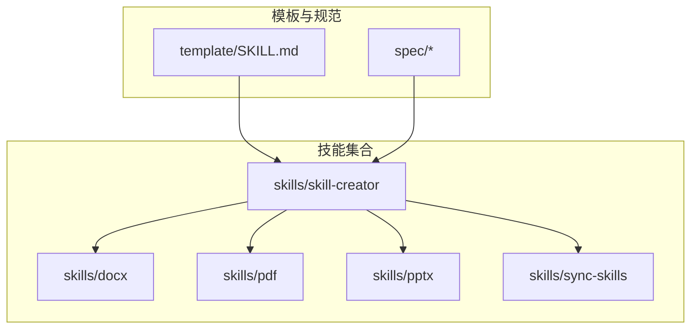
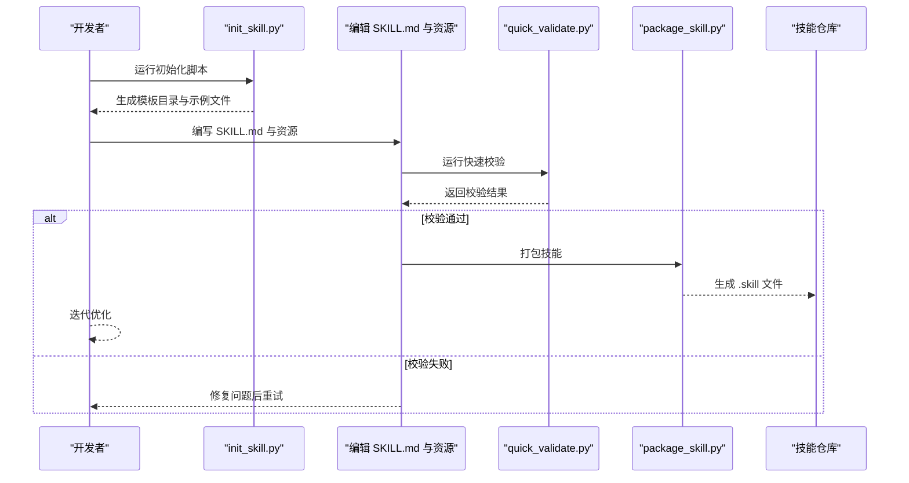
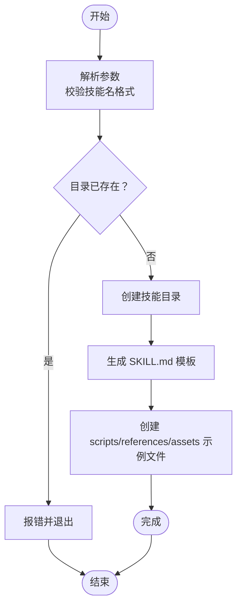
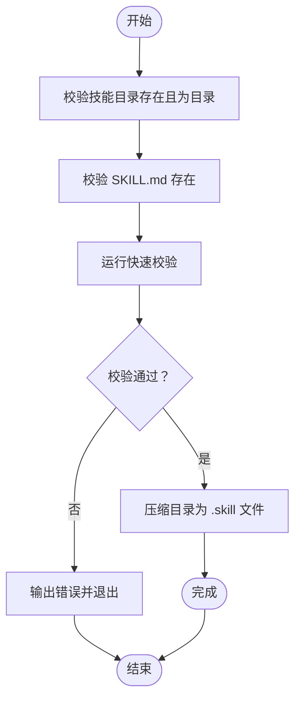
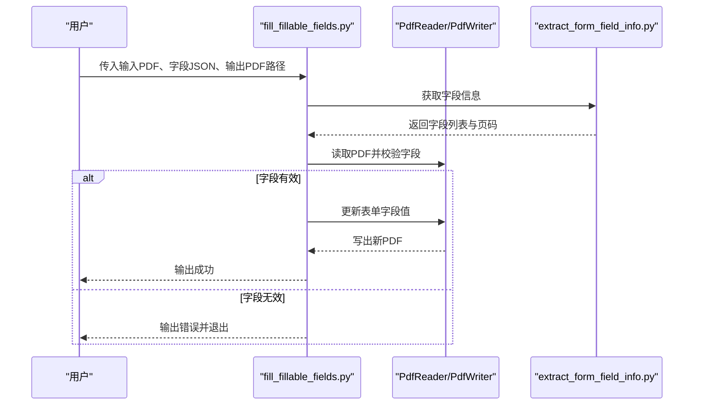
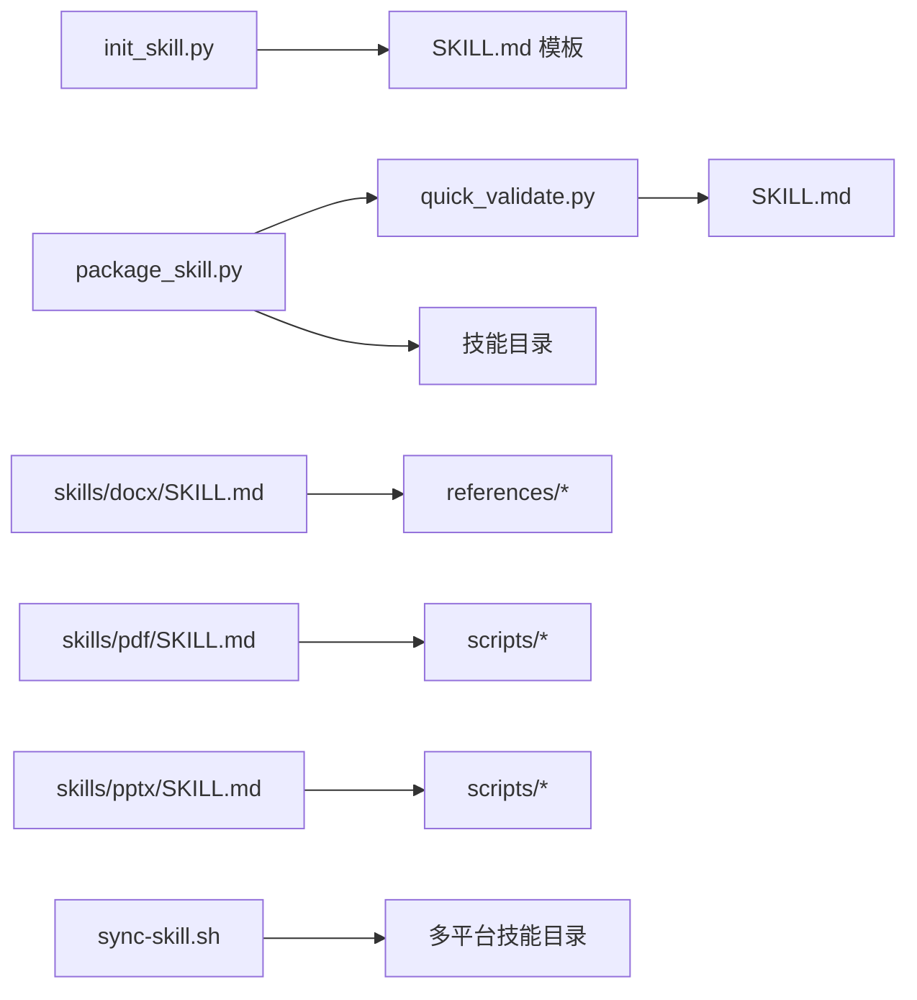

# 技能创建工作流

<cite>
**本文引用的文件**
- [README.md](file://README.md)
- [template/SKILL.md](file://template/SKILL.md)
- [skills/skill-creator/SKILL.md](file://skills/skill-creator/SKILL.md)
- [skills/skill-creator/scripts/init_skill.py](file://skills/skill-creator/scripts/init_skill.py)
- [skills/skill-creator/scripts/package_skill.py](file://skills/skill-creator/scripts/package_skill.py)
- [skills/skill-creator/scripts/quick_validate.py](file://skills/skill-creator/scripts/quick_validate.py)
- [skills/skill-creator/references/workflows.md](file://skills/skill-creator/references/workflows.md)
- [skills/skill-creator/references/output-patterns.md](file://skills/skill-creator/references/output-patterns.md)
- [skills/pdf/scripts/fill_fillable_fields.py](file://skills/pdf/scripts/fill_fillable_fields.py)
- [skills/docx/SKILL.md](file://skills/docx/SKILL.md)
- [skills/pdf/SKILL.md](file://skills/pdf/SKILL.md)
- [skills/pptx/SKILL.md](file://skills/pptx/SKILL.md)
- [skills/sync-skills/sync-skill.sh](file://skills/sync-skills/sync-skill.sh)
</cite>

## 目录
1. [简介](#简介)
2. [项目结构](#项目结构)
3. [核心组件](#核心组件)
4. [架构总览](#架构总览)
5. [详细组件分析](#详细组件分析)
6. [依赖关系分析](#依赖关系分析)
7. [性能考虑](#性能考虑)
8. [故障排除指南](#故障排除指南)
9. [结论](#结论)
10. [附录](#附录)

## 简介
本指南面向希望创建、开发、测试、打包并发布技能（Skill）的工程师与产品人员。技能是可动态加载的模块化知识包，用于向 Claude 提供特定领域的专业知识、工作流与工具集成。本仓库提供了完整的技能创建工具链与参考样例，覆盖从需求分析到技能发布的全流程。

本指南将：
- 解释技能创建的完整工作流与阶段划分
- 详解自动化工具 init_skill.py 与 package_skill.py 的功能与参数
- 提供开发示例与最佳实践，涵盖代码组织、文档编写、测试策略与质量保证
- 说明技能版本管理、依赖处理与兼容性检查要点

## 项目结构
该仓库采用按领域分层的技能组织方式，每个技能独立存放于自身目录中，包含 SKILL.md 元数据与可选的 scripts/references/assets 资源目录。技能创建工具位于 skill-creator 中，提供初始化模板与打包校验能力。

图表来源
- [README.md](file://README.md#L24-L27)
- [template/SKILL.md](file://template/SKILL.md#L1-L59)
- [skills/skill-creator/SKILL.md](file://skills/skill-creator/SKILL.md#L1-L357)

章节来源
- [README.md](file://README.md#L1-L95)
- [template/SKILL.md](file://template/SKILL.md#L1-L59)

## 核心组件
- 技能创建器（skill-creator）
  - 提供技能创建流程指导与工具脚本
  - 包含初始化脚本、打包脚本与快速校验脚本
- 技能模板（template/SKILL.md）
  - 统一的元数据与内容结构模板
- 参考工作流与输出模式
  - workflows.md：顺序与条件工作流设计模式
  - output-patterns.md：模板与示例输出模式
- 示例技能
  - docx、pdf、pptx 等技能展示实际组织方式与最佳实践
- 同步脚本（sync-skills）
  - 将技能同步到多平台本地目录，便于联调与测试

章节来源
- [skills/skill-creator/SKILL.md](file://skills/skill-creator/SKILL.md#L1-L357)
- [skills/skill-creator/scripts/init_skill.py](file://skills/skill-creator/scripts/init_skill.py#L1-L304)
- [skills/skill-creator/scripts/package_skill.py](file://skills/skill-creator/scripts/package_skill.py#L1-L111)
- [skills/skill-creator/scripts/quick_validate.py](file://skills/skill-creator/scripts/quick_validate.py#L1-L95)
- [skills/skill-creator/references/workflows.md](file://skills/skill-creator/references/workflows.md#L1-L28)
- [skills/skill-creator/references/output-patterns.md](file://skills/skill-creator/references/output-patterns.md#L1-L83)

## 架构总览
技能创建工作流由“需求理解—规划—初始化—编辑—打包—迭代”六个阶段组成，贯穿自动化工具与参考规范。

图表来源
- [skills/skill-creator/scripts/init_skill.py](file://skills/skill-creator/scripts/init_skill.py#L194-L271)
- [skills/skill-creator/scripts/quick_validate.py](file://skills/skill-creator/scripts/quick_validate.py#L12-L87)
- [skills/skill-creator/scripts/package_skill.py](file://skills/skill-creator/scripts/package_skill.py#L19-L83)

## 详细组件分析

### 初始化工具：init_skill.py
用途
- 基于模板创建新的技能目录，自动填充 SKILL.md 与示例资源（scripts/references/assets）

主要功能
- 参数解析与合法性校验
- 创建目录结构与示例文件
- 输出下一步操作指引

参数与行为
- 必需参数：技能名（小写字母、数字、连字符，最大长度限制）、--path 指定输出路径
- 行为：创建技能根目录、生成 SKILL.md、创建 scripts/references/assets 三个资源目录及示例文件

图表来源
- [skills/skill-creator/scripts/init_skill.py](file://skills/skill-creator/scripts/init_skill.py#L194-L271)

章节来源
- [skills/skill-creator/scripts/init_skill.py](file://skills/skill-creator/scripts/init_skill.py#L1-L304)

### 打包工具：package_skill.py
用途
- 将技能目录打包为 .skill 文件（zip 格式），并在打包前进行自动校验

主要功能
- 校验技能目录结构与必要文件
- 自动运行快速校验
- 递归压缩技能目录为 .skill 文件

参数与行为
- 必需参数：技能目录路径
- 可选参数：输出目录（默认当前目录）
- 行为：校验通过后压缩为 skill_name.skill，失败则返回错误信息

图表来源
- [skills/skill-creator/scripts/package_skill.py](file://skills/skill-creator/scripts/package_skill.py#L19-L83)
- [skills/skill-creator/scripts/quick_validate.py](file://skills/skill-creator/scripts/quick_validate.py#L12-L87)

章节来源
- [skills/skill-creator/scripts/package_skill.py](file://skills/skill-creator/scripts/package_skill.py#L1-L111)

### 快速校验：quick_validate.py
用途
- 对 SKILL.md 进行最小化但关键的结构与元数据校验，确保技能符合基本规范

校验规则
- 必须存在 SKILL.md
- 必须有 YAML frontmatter，且为字典类型
- 允许字段：name、description、license、allowed-tools、metadata
- name 与 description 的类型、格式与长度限制
- 不允许出现未定义的 frontmatter 键

章节来源
- [skills/skill-creator/scripts/quick_validate.py](file://skills/skill-creator/scripts/quick_validate.py#L1-L95)

### 参考工作流与输出模式
- 工作流模式
  - 顺序工作流：将复杂任务拆分为清晰的步骤序列
  - 条件工作流：根据输入或状态选择不同分支
- 输出模式
  - 模板模式：严格结构化输出模板
  - 示例模式：通过输入/输出示例提升一致性

章节来源
- [skills/skill-creator/references/workflows.md](file://skills/skill-creator/references/workflows.md#L1-L28)
- [skills/skill-creator/references/output-patterns.md](file://skills/skill-creator/references/output-patterns.md#L1-L83)

### 示例技能：PDF 表单填写脚本
该脚本展示了如何在技能中组织可复用的 Python 脚本，包含字段校验、表单填充与错误处理。

图表来源
- [skills/pdf/scripts/fill_fillable_fields.py](file://skills/pdf/scripts/fill_fillable_fields.py#L12-L57)

章节来源
- [skills/pdf/scripts/fill_fillable_fields.py](file://skills/pdf/scripts/fill_fillable_fields.py#L1-L115)

### 示例技能：DOCX/PDF/PPTX 技能
这些技能展示了如何组织 SKILL.md 与资源目录，以及如何在技能中引用脚本与参考文档，实现“概览—工作流—引用—资产”的结构化组织。

章节来源
- [skills/docx/SKILL.md](file://skills/docx/SKILL.md#L1-L197)
- [skills/pdf/SKILL.md](file://skills/pdf/SKILL.md#L1-L200)
- [skills/pptx/SKILL.md](file://skills/pptx/SKILL.md#L1-L200)

### 同步脚本：sync-skill.sh
用途
- 将技能从本地或远程源同步到多个 AI 编辑器的本地技能目录，便于联调与测试

支持的源类型
- 本地目录
- GitHub 仓库（自动克隆并定位技能目录）
- skillsmp.com 页面（占位实现，需按页面结构扩展）

章节来源
- [skills/sync-skills/sync-skill.sh](file://skills/sync-skills/sync-skill.sh#L1-L264)

## 依赖关系分析
技能创建工具链之间的依赖关系如下：

图表来源
- [skills/skill-creator/scripts/init_skill.py](file://skills/skill-creator/scripts/init_skill.py#L189-L271)
- [skills/skill-creator/scripts/package_skill.py](file://skills/skill-creator/scripts/package_skill.py#L16-L54)
- [skills/skill-creator/scripts/quick_validate.py](file://skills/skill-creator/scripts/quick_validate.py#L12-L87)
- [skills/sync-skills/sync-skill.sh](file://skills/sync-skills/sync-skill.sh#L14-L25)

章节来源
- [skills/skill-creator/scripts/init_skill.py](file://skills/skill-creator/scripts/init_skill.py#L1-L304)
- [skills/skill-creator/scripts/package_skill.py](file://skills/skill-creator/scripts/package_skill.py#L1-L111)
- [skills/skill-creator/scripts/quick_validate.py](file://skills/skill-creator/scripts/quick_validate.py#L1-L95)
- [skills/sync-skills/sync-skill.sh](file://skills/sync-skills/sync-skill.sh#L1-L264)

## 性能考虑
- 上下文窗口管理
  - SKILL.md 作为元数据与导航入口，应保持精炼，避免冗长描述占用上下文
  - 复杂细节放入 references/ 并按需加载
- 资源组织
  - scripts/ 中的脚本可直接执行，无需加载到上下文中，提高确定性与效率
  - assets/ 仅存放最终输出使用的资源，避免无谓的上下文占用
- 打包体积
  - .skill 文件为 zip 格式，建议清理不必要的日志与临时文件，控制分发体积

## 故障排除指南
常见问题与解决思路
- 初始化失败：检查技能名是否符合 hyphen-case 规范、输出路径是否存在权限问题
- 打包失败：确认 SKILL.md 存在且 frontmatter 完整；运行快速校验定位具体字段问题
- 脚本执行异常：查看脚本内部错误输出与返回码；确保依赖库正确安装
- 同步失败：确认目标目录存在且可写；对于 GitHub 源，确认仓库结构包含技能目录

章节来源
- [skills/skill-creator/scripts/init_skill.py](file://skills/skill-creator/scripts/init_skill.py#L273-L304)
- [skills/skill-creator/scripts/package_skill.py](file://skills/skill-creator/scripts/package_skill.py#L85-L111)
- [skills/skill-creator/scripts/quick_validate.py](file://skills/skill-creator/scripts/quick_validate.py#L88-L95)
- [skills/sync-skills/sync-skill.sh](file://skills/sync-skills/sync-skill.sh#L227-L264)

## 结论
通过本指南与工具链，您可以高效地完成从需求分析到技能发布的全流程。建议在每次迭代中坚持“先规划、再初始化、后校验、再打包”的节奏，结合参考工作流与输出模式，确保技能具备良好的可维护性与可扩展性。

## 附录

### 开发示例与最佳实践
- 代码组织
  - 将重复性逻辑封装为 scripts/ 中的可执行脚本，保持 SKILL.md 精炼
  - 将长篇文档与参考材料放入 references/，并提供清晰的导航链接
  - 将最终输出所需的模板、图标、字体等放入 assets/
- 文档编写
  - 使用模板 SKILL.md 统一结构，frontmatter 中明确 name 与 description
  - 在 SKILL.md 中给出“何时使用”和“工作流决策树”，减少上下文负担
- 测试策略
  - 使用 quick_validate.py 进行基础校验，确保 frontmatter 与命名规范
  - 对关键脚本编写单元测试或端到端验证，确保输出稳定
- 质量保证
  - 通过同步脚本将技能部署到多平台进行联调
  - 建立变更记录与回归测试清单，持续改进

章节来源
- [template/SKILL.md](file://template/SKILL.md#L1-L59)
- [skills/skill-creator/SKILL.md](file://skills/skill-creator/SKILL.md#L202-L357)
- [skills/skill-creator/references/workflows.md](file://skills/skill-creator/references/workflows.md#L1-L28)
- [skills/skill-creator/references/output-patterns.md](file://skills/skill-creator/references/output-patterns.md#L1-L83)