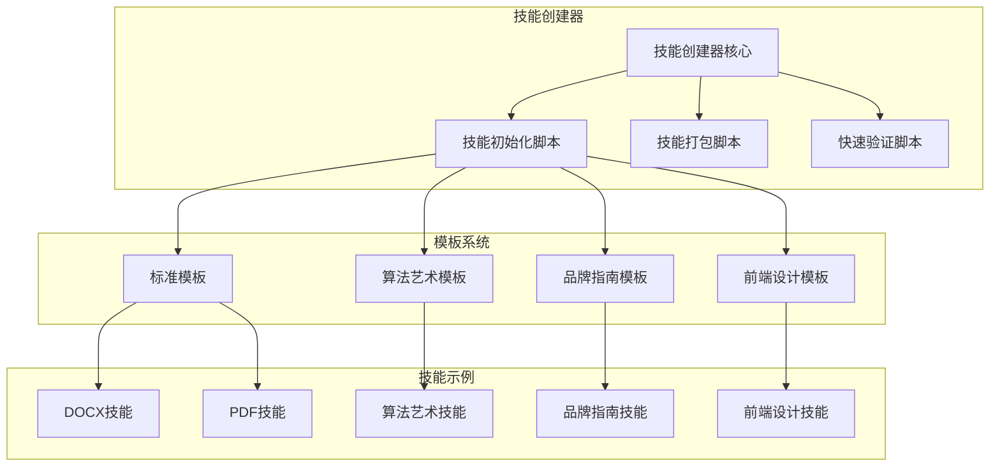
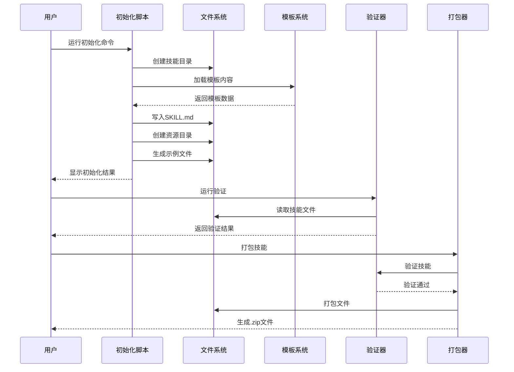
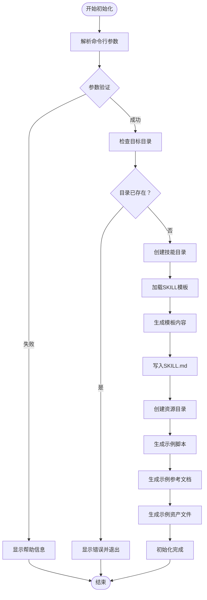
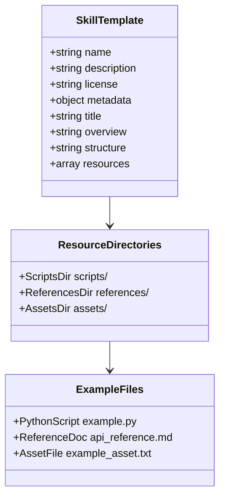
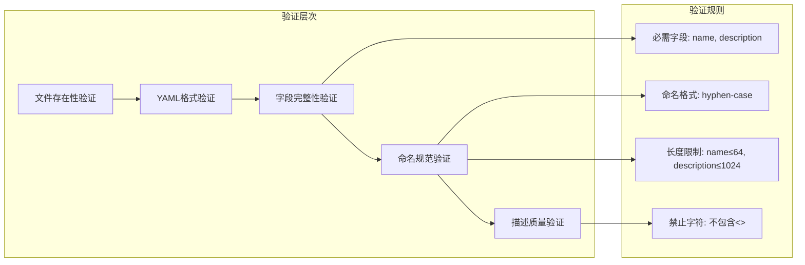
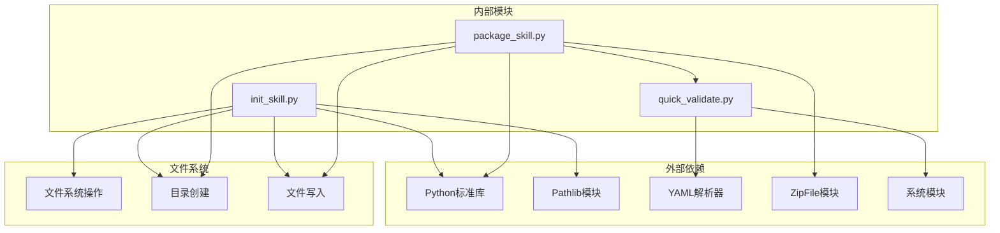

# 技能初始化

<cite>
**本文引用的文件**
- [init_skill.py](file://skills/skill-creator/scripts/init_skill.py)
- [package_skill.py](file://skills/skill-creator/scripts/package_skill.py)
- [quick_validate.py](file://skills/skill-creator/scripts/quick_validate.py)
- [SKILL.md（模板）](file://template/SKILL.md)
- [SKILL.md（技能创建器）](file://skills/skill-creator/SKILL.md)
- [SKILL.md（DOCX）](file://skills/docx/SKILL.md)
- [SKILL.md（PDF）](file://skills/pdf/SKILL.md)
- [SKILL.md（算法艺术）](file://skills/algorithmic-art/SKILL.md)
- [SKILL.md（品牌指南）](file://skills/brand-guidelines/SKILL.md)
- [SKILL.md（前端设计）](file://skills/frontend-design/SKILL.md)
- [generator_template.js](file://skills/algorithmic-art/templates/generator_template.js)
- [viewer.html](file://skills/algorithmic-art/templates/viewer.html)
</cite>

## 目录
1. [简介](#简介)
2. [项目结构](#项目结构)
3. [核心组件](#核心组件)
4. [架构概览](#架构概览)
5. [详细组件分析](#详细组件分析)
6. [依赖关系分析](#依赖关系分析)
7. [性能考虑](#性能考虑)
8. [故障排除指南](#故障排除指南)
9. [结论](#结论)
10. [附录](#附录)

## 简介

技能初始化系统是一个用于快速创建和标准化技能项目的自动化工具集。该系统通过模板驱动的方式，为开发者提供了一套完整的技能开发框架，包括目录结构、模板文件、初始配置和最佳实践指导。

该系统的核心价值在于：
- **标准化开发流程**：提供统一的技能项目模板和目录结构
- **自动化初始化**：一键创建完整的技能项目骨架
- **模板系统**：支持多种类型的技能模板，涵盖从简单工具到复杂系统的各种场景
- **质量保证**：内置验证机制确保技能符合标准规范

## 项目结构

技能初始化系统采用分层架构设计，主要包含以下核心组件：



**图表来源**
- [init_skill.py](file://skills/skill-creator/scripts/init_skill.py#L1-L304)
- [package_skill.py](file://skills/skill-creator/scripts/package_skill.py#L1-L111)
- [quick_validate.py](file://skills/skill-creator/scripts/quick_validate.py#L1-L95)

**章节来源**
- [SKILL.md（技能创建器）](file://skills/skill-creator/SKILL.md#L1-L357)

## 核心组件

### 技能初始化脚本（init_skill.py）

技能初始化脚本是整个系统的核心，负责创建新的技能项目并填充标准模板。该脚本提供了完整的自动化初始化流程：

#### 主要功能特性
- **目录结构创建**：自动创建标准的技能项目目录结构
- **模板填充**：根据模板生成初始内容
- **资源目录初始化**：创建scripts/、references/、assets/等资源目录
- **示例文件生成**：为每个资源类型生成示例文件
- **命名规范验证**：确保技能名称符合标准格式

#### 命令行接口
```bash
python scripts/init_skill.py <skill-name> --path <output-directory>
```

**章节来源**
- [init_skill.py](file://skills/skill-creator/scripts/init_skill.py#L1-L304)

### 技能打包脚本（package_skill.py）

技能打包脚本负责将完成的技能项目打包成可分发的.zip文件，便于分享和部署：

#### 核心功能
- **技能验证**：在打包前自动验证技能的完整性
- **文件打包**：将技能目录结构压缩为.zip文件
- **输出管理**：支持指定输出目录和文件名

#### 使用方式
```bash
python scripts/package_skill.py <path/to/skill-folder> [output-directory]
```

**章节来源**
- [package_skill.py](file://skills/skill-creator/scripts/package_skill.py#L1-L111)

### 快速验证脚本（quick_validate.py）

快速验证脚本提供基础的技能验证功能，确保技能符合基本规范：

#### 验证规则
- **必需文件检查**：确保SKILL.md存在
- **YAML前言验证**：验证frontmatter格式和必需字段
- **命名规范检查**：验证技能名称的格式和长度
- **描述完整性验证**：确保描述信息完整且符合要求

**章节来源**
- [quick_validate.py](file://skills/skill-creator/scripts/quick_validate.py#L1-L95)

## 架构概览

技能初始化系统采用模块化设计，各组件之间通过清晰的接口进行交互：



**图表来源**
- [init_skill.py](file://skills/skill-creator/scripts/init_skill.py#L194-L270)
- [package_skill.py](file://skills/skill-creator/scripts/package_skill.py#L19-L83)
- [quick_validate.py](file://skills/skill-creator/scripts/quick_validate.py#L12-L86)

## 详细组件分析

### 初始化流程详解

技能初始化过程包含多个关键步骤，每个步骤都有明确的目标和输出：



**图表来源**
- [init_skill.py](file://skills/skill-creator/scripts/init_skill.py#L194-L270)

#### 目录结构规范

初始化后的技能项目将具有以下标准目录结构：

```
skill-name/
├── SKILL.md                 # 技能主文档（必需）
├── scripts/                 # 可执行脚本目录
│   └── example.py          # 示例Python脚本
├── references/              # 参考文档目录
│   └── api_reference.md    # 示例API参考文档
└── assets/                 # 资产文件目录
    └── example_asset.txt   # 示例资产文件
```

**章节来源**
- [init_skill.py](file://skills/skill-creator/scripts/init_skill.py#L236-L262)

### 模板系统分析

模板系统提供了多种类型的技能模板，每种模板都针对特定的技能类型进行了优化：

#### 标准技能模板（SKILL.md）

标准模板适用于大多数技能类型，提供了完整的技能文档框架：



**图表来源**
- [init_skill.py](file://skills/skill-creator/scripts/init_skill.py#L18-L103)
- [init_skill.py](file://skills/skill-creator/scripts/init_skill.py#L105-L186)

#### 算法艺术模板

算法艺术模板专门用于生成创意艺术作品，包含了完整的p5.js集成方案：

**章节来源**
- [generator_template.js](file://skills/algorithmic-art/templates/generator_template.js#L1-L223)
- [viewer.html](file://skills/algorithmic-art/templates/viewer.html#L1-L599)

### 验证机制分析

验证系统提供了多层次的质量保证机制：



**图表来源**
- [quick_validate.py](file://skills/skill-creator/scripts/quick_validate.py#L42-L86)

**章节来源**
- [quick_validate.py](file://skills/skill-creator/scripts/quick_validate.py#L12-L86)

## 依赖关系分析

技能初始化系统内部的依赖关系相对简单，主要通过函数调用和文件操作进行交互：



**图表来源**
- [init_skill.py](file://skills/skill-creator/scripts/init_skill.py#L14-L16)
- [package_skill.py](file://skills/skill-creator/scripts/package_skill.py#L13-L16)
- [quick_validate.py](file://skills/skill-creator/scripts/quick_validate.py#L6-L11)

**章节来源**
- [init_skill.py](file://skills/skill-creator/scripts/init_skill.py#L14-L16)
- [package_skill.py](file://skills/skill-creator/scripts/package_skill.py#L13-L16)
- [quick_validate.py](file://skills/skill-creator/scripts/quick_validate.py#L6-L11)

## 性能考虑

技能初始化系统在设计时充分考虑了性能因素：

### 时间复杂度分析
- **初始化操作**：O(n) - n为模板文件数量，主要受文件写入操作影响
- **验证操作**：O(m) - m为技能文件大小，主要受文件读取和解析影响
- **打包操作**：O(k) - k为技能文件总数，主要受文件压缩和写入影响

### 内存使用优化
- **流式处理**：打包过程中采用流式写入，避免大文件内存溢出
- **按需加载**：验证时只读取必要的文件内容
- **临时文件管理**：及时清理临时文件和中间状态

### 并发处理
- **异步I/O**：文件操作采用异步模式提高效率
- **批量处理**：多个文件同时处理减少等待时间

## 故障排除指南

### 常见问题及解决方案

#### 初始化失败
**问题**：技能目录已存在
**解决方案**：删除现有目录或选择不同的技能名称

**问题**：权限不足无法创建目录
**解决方案**：检查目标路径的写入权限

#### 验证失败
**问题**：SKILL.md格式错误
**解决方案**：检查YAML语法和必需字段

**问题**：技能名称不符合规范
**解决方案**：使用小写字母、数字和连字符的组合

#### 打包失败
**问题**：技能验证未通过
**解决方案**：先运行验证脚本修复问题

**问题**：磁盘空间不足
**解决方案**：清理磁盘空间或选择更大的存储位置

**章节来源**
- [init_skill.py](file://skills/skill-creator/scripts/init_skill.py#L208-L219)
- [quick_validate.py](file://skills/skill-creator/scripts/quick_validate.py#L16-L29)
- [package_skill.py](file://skills/skill-creator/scripts/package_skill.py#L32-L45)

## 结论

技能初始化系统提供了一个完整、标准化的技能开发框架，通过模板驱动的方式大大简化了技能创建过程。该系统的主要优势包括：

1. **标准化流程**：确保所有技能项目遵循相同的结构和规范
2. **自动化程度高**：减少手动配置工作量，提高开发效率
3. **质量保证**：内置验证机制确保技能质量
4. **扩展性强**：支持多种类型的技能模板和自定义需求

对于开发者而言，该系统不仅提供了实用的工具，更重要的是建立了一套完整的技能开发最佳实践体系，有助于创建高质量、可维护的技能项目。

## 附录

### 命令行使用示例

#### 基本初始化
```bash
# 创建公共技能
python skills/skill-creator/scripts/init_skill.py my-new-skill --path skills/public

# 创建私有技能
python skills/skill-creator/scripts/init_skill.py my-api-helper --path skills/private

# 指定自定义路径
python skills/skill-creator/scripts/init_skill.py custom-skill --path /custom/location
```

#### 技能验证
```bash
# 验证技能完整性
python skills/skill-creator/scripts/quick_validate.py skills/public/my-skill
```

#### 技能打包
```bash
# 打包技能到当前目录
python skills/skill-creator/scripts/package_skill.py skills/public/my-skill

# 打包技能到指定目录
python skills/skill-creator/scripts/package_skill.py skills/public/my-skill ./dist
```

### 最佳实践建议

#### 命名约定
- 使用小写字母、数字和连字符的组合
- 避免使用特殊字符和空格
- 保持名称简洁明了，能够准确描述技能功能

#### 目录组织
- 优先使用scripts/存放可执行代码
- references/用于存放详细文档和参考资料
- assets/用于存放输出使用的静态文件

#### 初始文档编写
- 完整填写YAML前言部分
- 提供清晰的技能概述和使用场景
- 包含必要的依赖信息和许可证声明

#### 模板选择
- 根据技能类型选择合适的模板
- 及时删除不需要的示例文件
- 保持目录结构的整洁和一致性

**章节来源**
- [SKILL.md（技能创建器）](file://skills/skill-creator/SKILL.md#L256-L357)