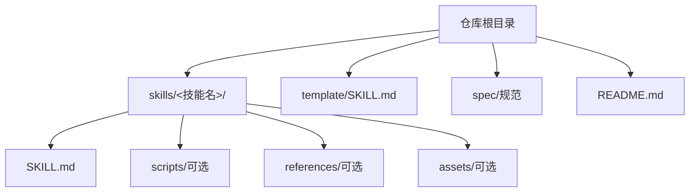
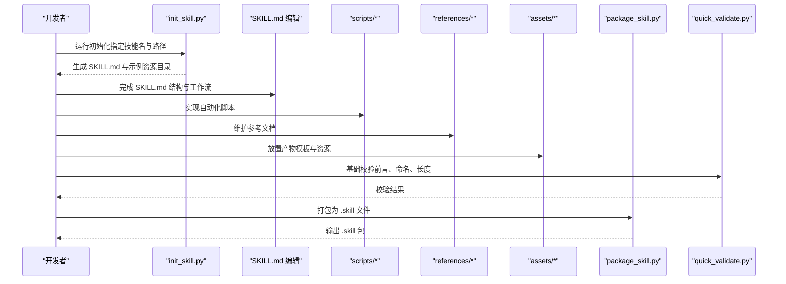
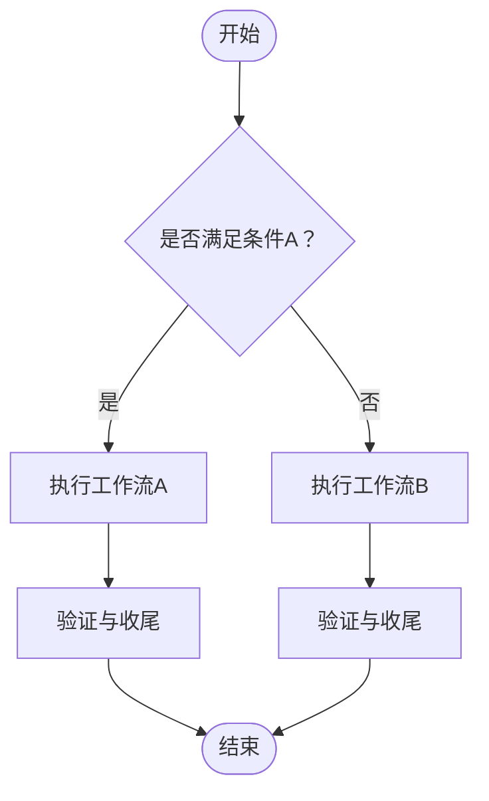
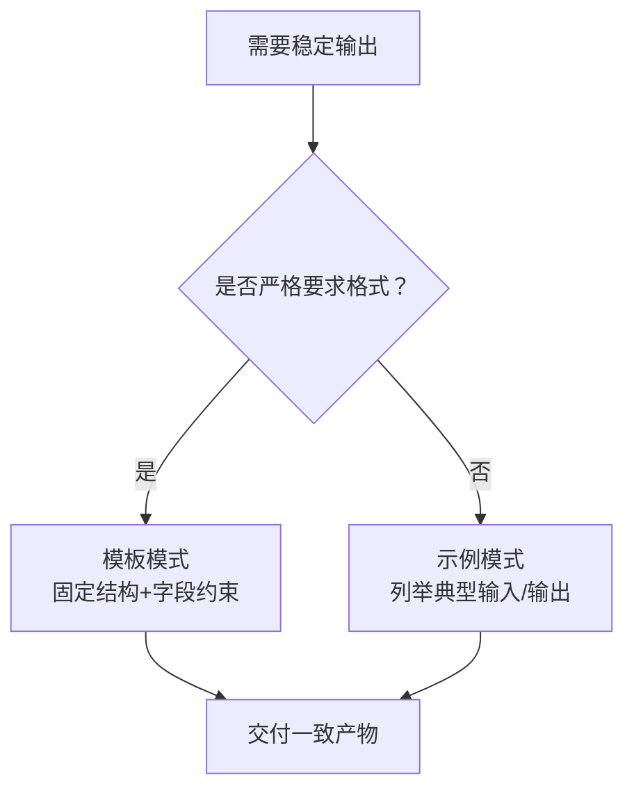
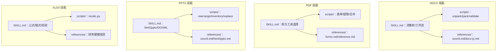
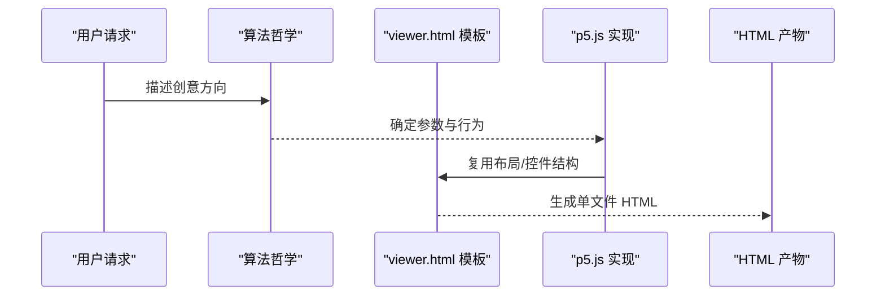
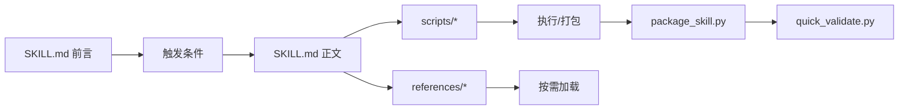

# 技能开发

<cite>
**本文引用的文件**
- [README.md](file://README.md)
- [template/SKILL.md](file://template/SKILL.md)
- [skills/skill-creator/SKILL.md](file://skills/skill-creator/SKILL.md)
- [skills/skill-creator/scripts/init_skill.py](file://skills/skill-creator/scripts/init_skill.py)
- [skills/skill-creator/scripts/package_skill.py](file://skills/skill-creator/scripts/package_skill.py)
- [skills/skill-creator/scripts/quick_validate.py](file://skills/skill-creator/scripts/quick_validate.py)
- [skills/skill-creator/references/workflows.md](file://skills/skill-creator/references/workflows.md)
- [skills/skill-creator/references/output-patterns.md](file://skills/skill-creator/references/output-patterns.md)
- [skills/docx/SKILL.md](file://skills/docx/SKILL.md)
- [skills/pdf/SKILL.md](file://skills/pdf/SKILL.md)
- [skills/pptx/SKILL.md](file://skills/pptx/SKILL.md)
- [skills/xlsx/SKILL.md](file://skills/xlsx/SKILL.md)
- [skills/algorithmic-art/SKILL.md](file://skills/algorithmic-art/SKILL.md)
- [skills/frontend-design/SKILL.md](file://skills/frontend-design/SKILL.md)
- [skills/internal-comms/SKILL.md](file://skills/internal-comms/SKILL.md)
- [skills/webapp-testing/examples/console_logging.py](file://skills/webapp-testing/examples/console_logging.py)
</cite>

## 目录
1. [引言](#引言)
2. [项目结构](#项目结构)
3. [核心组件](#核心组件)
4. [架构总览](#架构总览)
5. [详细组件分析](#详细组件分析)
6. [依赖关系分析](#依赖关系分析)
7. [性能考量](#性能考量)
8. [故障排查指南](#故障排查指南)
9. [结论](#结论)
10. [附录](#附录)

## 引言
本指南面向技能开发全流程，系统阐述从需求分析、设计规划、编码实现到文档编写的完整方法论，并结合仓库中的模板与范例技能，给出顺序工作流与条件工作流的设计原则、输出模式的最佳实践（错误处理、日志记录、结果格式化），以及如何组织代码结构、编写清晰步骤说明与处理复杂任务。

## 项目结构
仓库采用“技能即包”的组织方式：每个技能是一个独立目录，包含一个用于触发与说明的 SKILL.md 文件，以及可选的 scripts/、references/、assets/ 等资源目录。模板 SKILL.md 提供统一的结构与写作框架；技能创建器（skill-creator）提供初始化、打包与校验工具链，确保技能质量与一致性。

图表来源
- [README.md](file://README.md#L1-L95)
- [template/SKILL.md](file://template/SKILL.md#L1-L59)

章节来源
- [README.md](file://README.md#L1-L95)
- [template/SKILL.md](file://template/SKILL.md#L1-L59)

## 核心组件
- 触发与说明文件 SKILL.md：定义技能元信息（name、description）与正文内容，决定何时被触发及如何执行。
- 资源目录：
  - scripts/：可执行脚本（Python/Node.js 等），承载确定性与重复性逻辑。
  - references/：按需加载的参考文档，支持渐进式披露，降低上下文占用。
  - assets/：最终产物使用的静态资源（模板、字体、图标等），不直接加载入上下文。
- 工具链：
  - 初始化：根据模板生成新技能骨架。
  - 打包：将技能目录打包为 .skill 文件，便于分发。
  - 校验：对 SKILL.md 前言与命名进行基础校验，保证触发语义正确。

章节来源
- [skills/skill-creator/SKILL.md](file://skills/skill-creator/SKILL.md#L47-L121)
- [skills/skill-creator/scripts/init_skill.py](file://skills/skill-creator/scripts/init_skill.py#L1-L304)
- [skills/skill-creator/scripts/package_skill.py](file://skills/skill-creator/scripts/package_skill.py#L1-L111)
- [skills/skill-creator/scripts/quick_validate.py](file://skills/skill-creator/scripts/quick_validate.py#L1-L95)

## 架构总览
技能开发的端到端流程由“模板驱动 + 工具链保障 + 范例指引”构成：先用模板 SKILL.md 明确工作流与边界，再通过初始化脚本生成目录结构，随后在 scripts/references/assets 中沉淀可复用资产，最后经打包与校验形成可分发的 .skill 包。

图表来源
- [skills/skill-creator/scripts/init_skill.py](file://skills/skill-creator/scripts/init_skill.py#L194-L270)
- [skills/skill-creator/scripts/package_skill.py](file://skills/skill-creator/scripts/package_skill.py#L19-L83)
- [skills/skill-creator/scripts/quick_validate.py](file://skills/skill-creator/scripts/quick_validate.py#L12-L86)

## 详细组件分析

### 组件A：工作流模式（顺序与条件）
- 顺序工作流：将复杂任务拆解为明确的步骤序列，强调“先做什么、再做什么”，并在 SKILL.md 中以编号清单呈现，必要时配合脚本执行。
- 条件工作流：在关键节点设置分支判断，引导选择不同的子流程，确保在不同输入下走对路径。

图表来源
- [skills/skill-creator/references/workflows.md](file://skills/skill-creator/references/workflows.md#L17-L28)

章节来源
- [skills/skill-creator/references/workflows.md](file://skills/skill-creator/references/workflows.md#L1-L28)

### 组件B：输出模式最佳实践
- 模板模式：对严格格式（如报告、API 响应）提供固定结构，确保一致性与可解析性。
- 示例模式：通过输入/输出样例帮助对齐风格与细节，减少歧义。

图表来源
- [skills/skill-creator/references/output-patterns.md](file://skills/skill-creator/references/output-patterns.md#L1-L83)

章节来源
- [skills/skill-creator/references/output-patterns.md](file://skills/skill-creator/references/output-patterns.md#L1-L83)

### 组件C：范例技能分析（文档类、演示类、前端类）

#### 文档类技能（DOCX/PDF/PPTX/XLSX）
- 设计要点：以“渐进式披露”组织 SKILL.md，将核心流程写在 SKILL.md，细节与参考文档放入 references/；复杂操作通过 scripts/ 脚本落地，避免在上下文中反复加载。
- 错误处理与验证：在脚本中加入健壮性检查（如依赖存在性、路径有效性、输出完整性），并在 SKILL.md 中列出“最终验证”步骤。
- 日志与结果格式化：建议在脚本中输出结构化日志（JSON/文本），并在 SKILL.md 中约定最终产物命名与存放位置。

图表来源
- [skills/docx/SKILL.md](file://skills/docx/SKILL.md#L1-L197)
- [skills/pdf/SKILL.md](file://skills/pdf/SKILL.md#L1-L295)
- [skills/pptx/SKILL.md](file://skills/pptx/SKILL.md#L1-L484)
- [skills/xlsx/SKILL.md](file://skills/xlsx/SKILL.md#L1-L289)

章节来源
- [skills/docx/SKILL.md](file://skills/docx/SKILL.md#L1-L197)
- [skills/pdf/SKILL.md](file://skills/pdf/SKILL.md#L1-L295)
- [skills/pptx/SKILL.md](file://skills/pptx/SKILL.md#L1-L484)
- [skills/xlsx/SKILL.md](file://skills/xlsx/SKILL.md#L1-L289)

#### 演示类技能（算法艺术）
- 设计要点：先产出“算法哲学”（理念与参数空间），再基于模板 viewer.html 生成交互式 HTML 产物；参数控制与种子导航为固定 UI 结构，算法实现为变量。
- 输出模式：单文件自包含 HTML，内嵌 p5.js 与参数 UI，支持下载 PNG。

图表来源
- [skills/algorithmic-art/SKILL.md](file://skills/algorithmic-art/SKILL.md#L1-L405)

章节来源
- [skills/algorithmic-art/SKILL.md](file://skills/algorithmic-art/SKILL.md#L1-L405)

#### 前端类技能
- 设计要点：强调“有明确审美方向”的界面实现，避免通用 AI 风格；在 SKILL.md 中明确目的、语气、约束与差异化亮点，再产出高质量前端代码与设计细节。

章节来源
- [skills/frontend-design/SKILL.md](file://skills/frontend-design/SKILL.md#L1-L43)

#### 内部沟通类技能
- 设计要点：按通信类型（3P 更新、公司通讯、FAQ、状态报告等）加载对应示例文件，严格遵循其格式与语气规范。

章节来源
- [skills/internal-comms/SKILL.md](file://skills/internal-comms/SKILL.md#L1-L33)

### 组件D：工具链与质量保障

#### 初始化脚本（init_skill.py）
- 功能：生成技能目录、填充模板 SKILL.md、创建示例 scripts/references/assets。
- 建议：完成后删除不需要的示例，聚焦实际业务。

章节来源
- [skills/skill-creator/scripts/init_skill.py](file://skills/skill-creator/scripts/init_skill.py#L194-L270)

#### 打包脚本（package_skill.py）
- 功能：在打包前自动运行 quick_validate，校验通过后将技能目录压缩为 .skill 文件。
- 建议：发布前务必本地验证，确保 SKILL.md 结构与资源齐全。

章节来源
- [skills/skill-creator/scripts/package_skill.py](file://skills/skill-creator/scripts/package_skill.py#L19-L83)

#### 快速校验（quick_validate.py）
- 功能：校验 SKILL.md 是否存在、前言格式是否正确、name/description 是否符合规范（长度、字符集、特殊符号等）。
- 建议：在提交/打包前运行，修复报错后再继续。

章节来源
- [skills/skill-creator/scripts/quick_validate.py](file://skills/skill-creator/scripts/quick_validate.py#L12-L86)

## 依赖关系分析
- 触发与说明：SKILL.md 的 frontmatter 是触发入口，description 决定何时激活技能。
- 资源加载：SKILL.md 作为导航站，references/ 仅在需要时按需加载，scripts/ 可直接执行而无需加载入上下文。
- 工具链耦合：init_skill.py 与 package_skill.py 依赖 quick_validate.py 的前置校验能力。

图表来源
- [skills/skill-creator/scripts/package_skill.py](file://skills/skill-creator/scripts/package_skill.py#L47-L54)
- [skills/skill-creator/scripts/quick_validate.py](file://skills/skill-creator/scripts/quick_validate.py#L12-L86)

章节来源
- [skills/skill-creator/scripts/package_skill.py](file://skills/skill-creator/scripts/package_skill.py#L19-L83)
- [skills/skill-creator/scripts/quick_validate.py](file://skills/skill-creator/scripts/quick_validate.py#L12-L86)

## 性能考量
- 上下文窗口管理：SKILL.md 控制在 500 行以内，长文档拆分至 references/ 并在 SKILL.md 中明确引用。
- 脚本优先：复杂或重复性强的任务尽量下沉到 scripts/，减少上下文负担。
- 渐进式披露：仅在需要时加载 references/，避免一次性塞满上下文。
- 产物体积：assets/ 不参与上下文，但注意最终 .skill 包大小，避免携带过大资源。

## 故障排查指南
- 触发失败：检查 SKILL.md 前言 name/description 是否符合规范（长度、字符集、特殊符号），参考快速校验规则。
- 打包失败：确认 SKILL.md 存在且格式正确，resources 目录结构完整，再运行打包脚本。
- 自动化脚本异常：在脚本中增加错误捕获与日志输出，定位依赖缺失、路径错误、权限问题等。
- 文档类技能验证：按照 SKILL.md 中的“最终验证”步骤逐一核对，确保无未预期变更。

章节来源
- [skills/skill-creator/scripts/quick_validate.py](file://skills/skill-creator/scripts/quick_validate.py#L42-L86)
- [skills/docx/SKILL.md](file://skills/docx/SKILL.md#L143-L154)
- [skills/pptx/SKILL.md](file://skills/pptx/SKILL.md#L179-L180)
- [skills/xlsx/SKILL.md](file://skills/xlsx/SKILL.md#L246-L260)

## 结论
技能开发的关键在于“结构化思维 + 工具链保障 + 范例驱动”。通过模板 SKILL.md 明确工作流与边界，借助 init_skill/package_skill/quick_validate 形成稳定的开发-打包-校验闭环，并以范例技能为参照，持续优化输出模式与错误处理策略，最终交付高质量、可复用、易维护的技能包。

## 附录
- 开发步骤清单（来自技能创建器）：
  - 理解技能与具体示例
  - 规划可复用内容（scripts/references/assets）
  - 初始化技能（init_skill.py）
  - 编辑 SKILL.md 与资源
  - 打包技能（package_skill.py）
  - 基于真实使用迭代优化

章节来源
- [skills/skill-creator/SKILL.md](file://skills/skill-creator/SKILL.md#L202-L357)