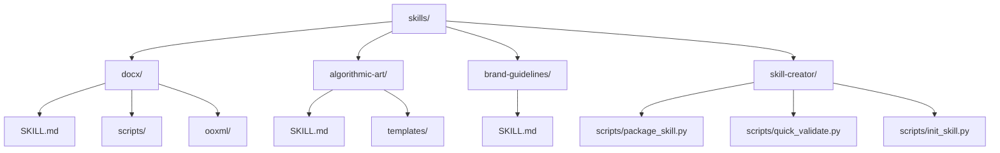
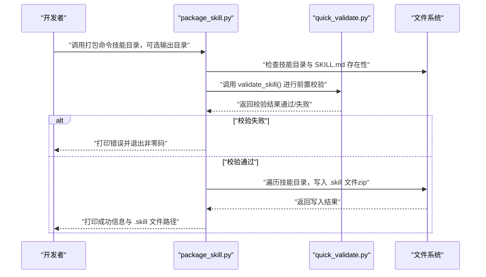
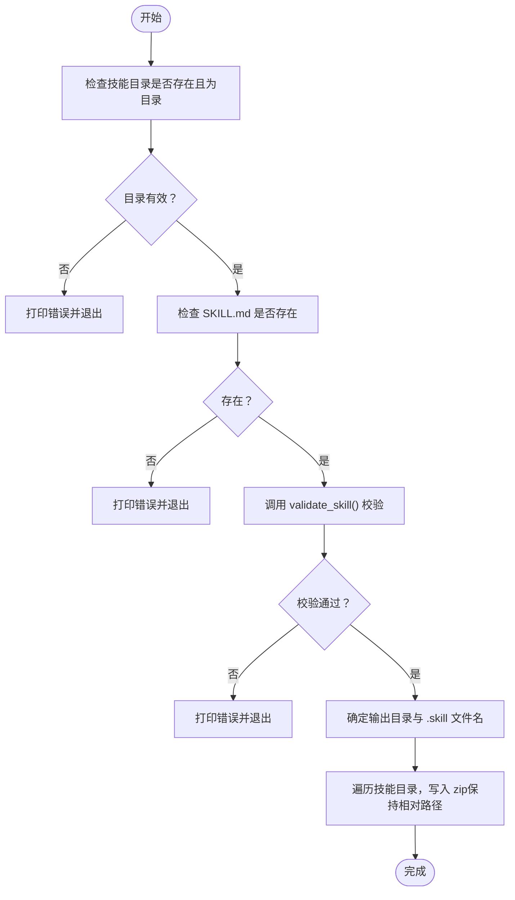
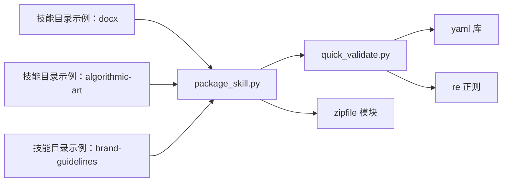

# 技能打包

<cite>
**本文引用的文件**
- [package_skill.py](file://skills/skill-creator/scripts/package_skill.py)
- [quick_validate.py](file://skills/skill-creator/scripts/quick_validate.py)
- [init_skill.py](file://skills/skill-creator/scripts/init_skill.py)
- [README.md](file://README.md)
- [SKILL.md（示例：docx）](file://skills/docx/SKILL.md)
- [SKILL.md（示例：algorithmic-art）](file://skills/algorithmic-art/SKILL.md)
- [SKILL.md（示例：brand-guidelines）](file://skills/brand-guidelines/SKILL.md)
- [SKILL.md（技能创建器）](file://skills/skill-creator/SKILL.md)
- [requirements.txt（示例：slack-gif-creator）](file://skills/slack-gif-creator/requirements.txt)
</cite>

## 目录
1. [简介](#简介)
2. [项目结构](#项目结构)
3. [核心组件](#核心组件)
4. [架构总览](#架构总览)
5. [详细组件分析](#详细组件分析)
6. [依赖关系分析](#依赖关系分析)
7. [性能考量](#性能考量)
8. [故障排查指南](#故障排查指南)
9. [结论](#结论)
10. [附录](#附录)

## 简介
本指南面向需要将“技能”（Skill）打包为可分发 .skill 文件的开发者与发布者。文档围绕 package_skill.py 脚本展开，系统讲解以下内容：
- 如何准备技能文件（含 SKILL.md 元数据、资源组织）
- 打包前的自动校验机制与依赖关系处理建议
- 打包流程的每个步骤：文件整理、元数据更新、版本号管理、压缩打包
- 不同场景下的打包策略与参数配置示例
- 发布前质量检查清单与常见问题解决方案

## 项目结构
技能仓库采用按功能域划分的多技能结构，每个技能自包含在独立目录中，核心入口为 SKILL.md，通常还包含 scripts/、references/、assets/ 等资源目录。打包工具位于技能创建器子模块中。

图表来源
- [package_skill.py](file://skills/skill-creator/scripts/package_skill.py#L1-L111)
- [quick_validate.py](file://skills/skill-creator/scripts/quick_validate.py#L1-L95)
- [init_skill.py](file://skills/skill-creator/scripts/init_skill.py#L1-L304)
- [SKILL.md（示例：docx）](file://skills/docx/SKILL.md#L1-L197)
- [SKILL.md（示例：algorithmic-art）](file://skills/algorithmic-art/SKILL.md#L1-L405)
- [SKILL.md（示例：brand-guidelines）](file://skills/brand-guidelines/SKILL.md#L1-L74)

章节来源
- [README.md](file://README.md#L1-L95)

## 核心组件
- 打包脚本 package_skill.py：负责读取技能目录、执行前置校验、将技能打包为 .skill 文件（zip 格式），并输出结果路径或错误信息。
- 快速校验脚本 quick_validate.py：对 SKILL.md 的 YAML 前言元数据进行基础校验，确保命名规范、描述长度与格式等符合要求。
- 初始化脚本 init_skill.py：用于生成新的技能骨架（含模板 SKILL.md 与示例资源目录），便于后续开发与打包。

章节来源
- [package_skill.py](file://skills/skill-creator/scripts/package_skill.py#L1-L111)
- [quick_validate.py](file://skills/skill-creator/scripts/quick_validate.py#L1-L95)
- [init_skill.py](file://skills/skill-creator/scripts/init_skill.py#L1-L304)

## 架构总览
下图展示了从“技能目录”到“可分发 .skill 包”的端到端流程，以及与校验脚本的协作关系。

图表来源
- [package_skill.py](file://skills/skill-creator/scripts/package_skill.py#L19-L83)
- [quick_validate.py](file://skills/skill-creator/scripts/quick_validate.py#L12-L86)

## 详细组件分析

### 组件一：package_skill.py（打包主流程）
- 输入参数
  - 必填：技能目录路径
  - 可选：输出目录（默认当前工作目录）
- 关键行为
  - 校验技能目录存在且为目录
  - 校验 SKILL.md 存在
  - 调用 validate_skill() 执行快速校验
  - 创建 .skill 文件（zip 格式），将技能目录内所有文件按相对路径写入
  - 输出成功信息或错误信息，并设置进程退出码
- 错误处理
  - 目录不存在、非目录、缺少 SKILL.md、校验失败、写入异常均会打印错误并返回非零退出码

图表来源
- [package_skill.py](file://skills/skill-creator/scripts/package_skill.py#L19-L83)

章节来源
- [package_skill.py](file://skills/skill-creator/scripts/package_skill.py#L19-L111)

### 组件二：quick_validate.py（快速校验）
- 校验要点
  - SKILL.md 存在
  - YAML 前言存在且可解析
  - 允许的字段集合（name、description、license、allowed-tools、metadata）
  - name 字段：字符串、hyphen-case（小写字母、数字、连字符）、不以连字符开头/结尾、无连续连字符、长度不超过 64
  - description 字段：字符串、不含尖括号、长度不超过 1024
- 返回值
  - 成功时返回“技能有效！”消息；失败时返回具体错误原因

章节来源
- [quick_validate.py](file://skills/skill-creator/scripts/quick_validate.py#L12-L86)

### 组件三：init_skill.py（技能初始化）
- 功能
  - 生成技能目录与模板 SKILL.md
  - 自动创建 scripts/、references/、assets/ 示例目录与文件
  - 输出下一步操作指引
- 使用场景
  - 新建技能时的起点
  - 需要标准化资源组织结构时

章节来源
- [init_skill.py](file://skills/skill-creator/scripts/init_skill.py#L194-L271)

### 组件四：SKILL.md（元数据与结构）
- 必备元素
  - YAML 前言：name、description（其余字段不在标准范围内）
  - 正文：指导与示例（仅触发后加载）
- 结构建议
  - 将长篇参考材料放入 references/，避免 SKILL.md 过长
  - scripts/ 中存放可直接运行的脚本
  - assets/ 中存放输出使用的资源（模板、字体、图标等）

章节来源
- [SKILL.md（示例：docx）](file://skills/docx/SKILL.md#L1-L197)
- [SKILL.md（示例：algorithmic-art）](file://skills/algorithmic-art/SKILL.md#L1-L405)
- [SKILL.md（示例：brand-guidelines）](file://skills/brand-guidelines/SKILL.md#L1-L74)
- [SKILL.md（技能创建器）](file://skills/skill-creator/SKILL.md#L320-L346)

## 依赖关系分析
- 打包脚本依赖快速校验脚本提供的 validate_skill() 接口
- 快速校验脚本依赖 YAML 解析库与正则表达式
- 技能目录结构遵循统一约定（SKILL.md、scripts/、references/、assets/）
- 示例技能展示了不同资源类型的组织方式与文档化策略

图表来源
- [package_skill.py](file://skills/skill-creator/scripts/package_skill.py#L13-L16)
- [quick_validate.py](file://skills/skill-creator/scripts/quick_validate.py#L6-L10)
- [SKILL.md（示例：docx）](file://skills/docx/SKILL.md#L1-L197)
- [SKILL.md（示例：algorithmic-art）](file://skills/algorithmic-art/SKILL.md#L1-L405)
- [SKILL.md（示例：brand-guidelines）](file://skills/brand-guidelines/SKILL.md#L1-L74)

章节来源
- [package_skill.py](file://skills/skill-creator/scripts/package_skill.py#L13-L16)
- [quick_validate.py](file://skills/skill-creator/scripts/quick_validate.py#L6-L10)

## 性能考量
- 打包过程为本地文件系统操作，时间主要取决于技能目录大小与文件数量
- 使用 ZIP_DEFLATED 压缩算法平衡压缩比与速度
- 建议在打包前清理不必要的临时文件与大体积缓存，减少打包体积
- 对于大型资源（如字体、模板），优先考虑将其作为 assets/ 内容而非频繁修改的脚本，以降低上下文窗口占用

## 故障排查指南
- 缺少 SKILL.md
  - 现象：提示未找到 SKILL.md 并退出
  - 处理：使用初始化脚本生成模板或手动创建
- YAML 前言格式错误
  - 现象：提示未找到 YAML 前言或解析失败
  - 处理：检查前言是否以分隔符包裹、键值是否合法
- name 或 description 规范不符
  - 现象：name 含非法字符/过长；description 含尖括号/过长
  - 处理：调整为 hyphen-case、去除尖括号、控制长度
- 目录路径无效
  - 现象：路径不存在或不是目录
  - 处理：确认输入路径正确且为目录
- 写入 .skill 文件失败
  - 现象：磁盘权限不足或目标目录不可写
  - 处理：检查输出目录权限与可用空间

章节来源
- [package_skill.py](file://skills/skill-creator/scripts/package_skill.py#L32-L82)
- [quick_validate.py](file://skills/skill-creator/scripts/quick_validate.py#L16-L86)

## 结论
通过 package_skill.py 与 quick_validate.py 的配合，可以自动化地完成技能的前置校验与打包，确保分发包的质量与一致性。结合 init_skill.py 的模板化初始化流程，能够帮助团队建立标准化的技能开发与发布实践。建议在 CI/CD 流水线中集成该流程，实现自动化校验与打包。

## 附录

### 打包流程步骤详解
- 准备阶段
  - 使用初始化脚本生成技能骨架
  - 在 SKILL.md 中完善 YAML 前言（name、description）
  - 在 scripts/、references/、assets/ 中组织资源
- 执行打包
  - 运行打包脚本，传入技能目录路径与可选输出目录
  - 若校验失败，根据提示修复后再试
- 产物与分发
  - 生成 .skill 文件（zip 格式），文件名为“技能名.skill”
  - 可将 .skill 文件上传至分发渠道或发布平台

章节来源
- [init_skill.py](file://skills/skill-creator/scripts/init_skill.py#L194-L271)
- [package_skill.py](file://skills/skill-creator/scripts/package_skill.py#L85-L111)
- [SKILL.md（技能创建器）](file://skills/skill-creator/SKILL.md#L320-L346)

### 参数与示例
- 基本用法
  - 单参数：技能目录路径
  - 双参数：技能目录路径 + 输出目录
- 示例
  - 在当前目录生成：指定技能目录路径
  - 指定输出目录：传入输出目录路径
- 注意事项
  - 输出目录不存在时会自动创建
  - 打包时会包含技能目录内的全部文件与子目录

章节来源
- [package_skill.py](file://skills/skill-creator/scripts/package_skill.py#L85-L111)

### 版本号管理与变更记录
- 当前仓库未提供内置版本号管理机制
- 建议在 SKILL.md 的 YAML 前言中增加版本字段（如 metadata.version），并在每次打包前更新
- 变更记录可维护在 references/ 或单独的 CHANGELOG.md 中，但需遵守“仅保留必要文件”的原则

章节来源
- [quick_validate.py](file://skills/skill-creator/scripts/quick_validate.py#L42-L50)
- [SKILL.md（示例：docx）](file://skills/docx/SKILL.md#L1-L197)

### 依赖关系与环境准备
- 打包脚本本身不安装外部依赖，但技能内部可能有运行时依赖
- 示例：某些技能包含 requirements.txt，应按需安装
- 建议在 CI/CD 中先安装依赖再执行打包

章节来源
- [requirements.txt（示例：slack-gif-creator）](file://skills/slack-gif-creator/requirements.txt#L1-L4)

### 质量检查清单（发布前）
- [ ] SKILL.md 存在且 YAML 前言完整
- [ ] name 符合 hyphen-case 且长度合理
- [ ] description 无尖括号且长度合理
- [ ] scripts/、references/、assets/ 组织清晰、命名规范
- [ ] 无无关文件（如 README.md、CHANGELOG.md 等）
- [ ] 打包前执行快速校验并通过
- [ ] 输出目录可写，磁盘空间充足
- [ ] .skill 文件可正常解压并被目标平台识别

章节来源
- [quick_validate.py](file://skills/skill-creator/scripts/quick_validate.py#L16-L86)
- [package_skill.py](file://skills/skill-creator/scripts/package_skill.py#L32-L82)