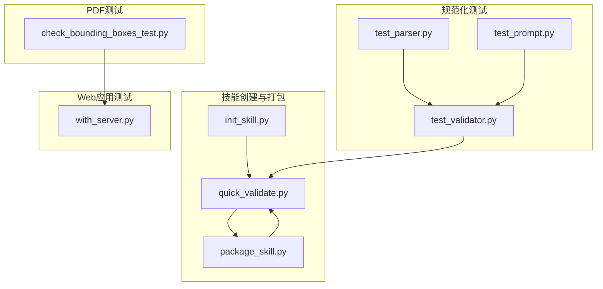
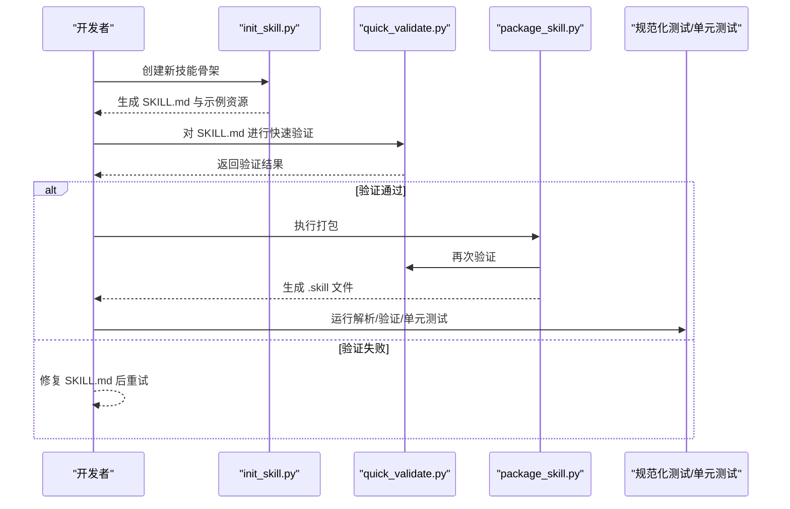
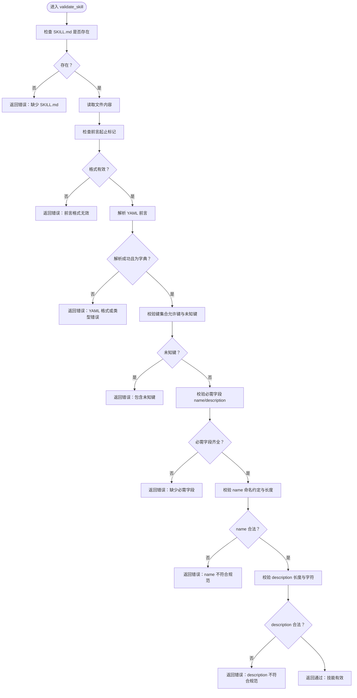
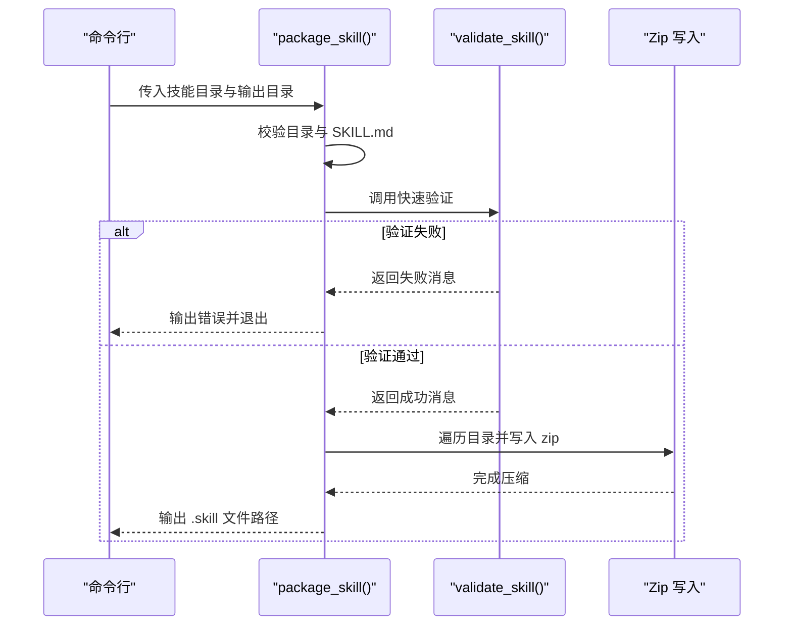
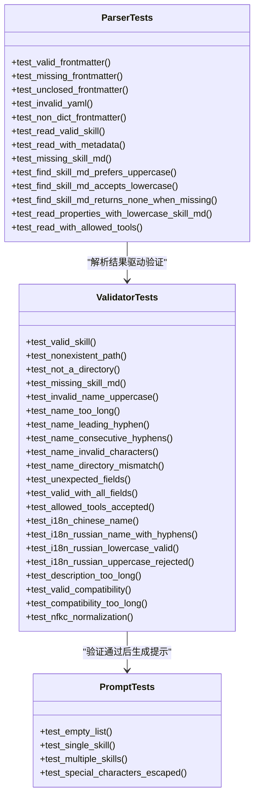
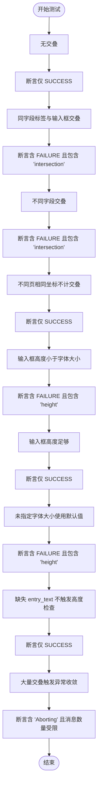
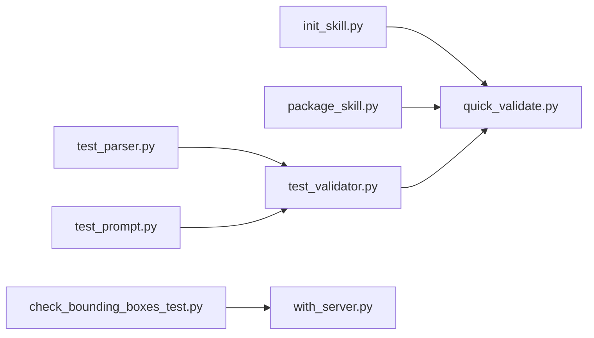

# 技能测试

<cite>
**本文引用的文件**
- [quick_validate.py](file://skills/skill-creator/scripts/quick_validate.py)
- [package_skill.py](file://skills/skill-creator/scripts/package_skill.py)
- [init_skill.py](file://skills/skill-creator/scripts/init_skill.py)
- [test_parser.py](file://spec/skills-ref/tests/test_parser.py)
- [test_validator.py](file://spec/skills-ref/tests/test_validator.py)
- [test_prompt.py](file://spec/skills-ref/tests/test_prompt.py)
- [check_bounding_boxes_test.py](file://skills/pdf/scripts/check_bounding_boxes_test.py)
- [with_server.py](file://skills/webapp-testing/scripts/with_server.py)
- [pyproject.toml](file://spec/skills-ref/pyproject.toml)
- [CLAUDE.md](file://spec/skills-ref/CLAUDE.md)
- [workflows.md](file://skills/skill-creator/references/workflows.md)
</cite>

## 目录
1. [简介](#简介)
2. [项目结构](#项目结构)
3. [核心组件](#核心组件)
4. [架构总览](#架构总览)
5. [详细组件分析](#详细组件分析)
6. [依赖关系分析](#依赖关系分析)
7. [性能考量](#性能考量)
8. [故障排查指南](#故障排查指南)
9. [结论](#结论)
10. [附录](#附录)

## 简介
本指南面向技能作者与测试工程师，系统讲解如何使用仓库中的工具链完成“技能”的快速验证、功能测试与兼容性验证，并覆盖单元测试、集成测试与端到端测试的设计方法与最佳实践。重点围绕以下工具与模块：
- 快速验证脚本：对技能元数据（SKILL.md）进行基础校验
- 打包器：在验证通过后生成可分发的 .skill 文件
- 初始化器：基于模板生成新技能骨架
- 规范化解析与验证：针对规范化的技能模型进行更全面的校验
- PDF 边界框测试：表单字段边界框与字体高度的单元测试
- Web 应用测试辅助：多服务器生命周期管理与端到端自动化

## 项目结构
本仓库采用按“技能”与“规范库”分层组织的方式：
- skills/skill-creator/scripts：技能创建与打包相关工具
- spec/skills-ref/tests：规范化解析与验证的测试套件
- skills/pdf/scripts：PDF 表单相关脚本及测试
- skills/webapp-testing/scripts：Web 应用测试辅助脚本
- 其他技能目录：如 docx、pptx、pdf、xlsx 等，包含各自 OOXML 验证与脚本

图表来源
- [quick_validate.py](file://skills/skill-creator/scripts/quick_validate.py#L1-L95)
- [package_skill.py](file://skills/skill-creator/scripts/package_skill.py#L1-L111)
- [init_skill.py](file://skills/skill-creator/scripts/init_skill.py#L1-L304)
- [test_parser.py](file://spec/skills-ref/tests/test_parser.py#L1-L189)
- [test_validator.py](file://spec/skills-ref/tests/test_validator.py#L1-L291)
- [test_prompt.py](file://spec/skills-ref/tests/test_prompt.py#L1-L71)
- [check_bounding_boxes_test.py](file://skills/pdf/scripts/check_bounding_boxes_test.py#L1-L227)
- [with_server.py](file://skills/webapp-testing/scripts/with_server.py#L1-L106)

章节来源
- [quick_validate.py](file://skills/skill-creator/scripts/quick_validate.py#L1-L95)
- [package_skill.py](file://skills/skill-creator/scripts/package_skill.py#L1-L111)
- [init_skill.py](file://skills/skill-creator/scripts/init_skill.py#L1-L304)
- [test_parser.py](file://spec/skills-ref/tests/test_parser.py#L1-L189)
- [test_validator.py](file://spec/skills-ref/tests/test_validator.py#L1-L291)
- [test_prompt.py](file://spec/skills-ref/tests/test_prompt.py#L1-L71)
- [check_bounding_boxes_test.py](file://skills/pdf/scripts/check_bounding_boxes_test.py#L1-L227)
- [with_server.py](file://skills/webapp-testing/scripts/with_server.py#L1-L106)

## 核心组件
- 快速验证器（quick_validate.py）
  - 负责对 SKILL.md 的 YAML 前言进行解析与校验，确保必需字段存在、命名规范、长度限制等
  - 返回布尔值与提示信息，作为后续打包与发布的前置条件
- 打包器（package_skill.py）
  - 在验证通过后，将技能目录压缩为 .skill 文件（zip），并打印添加的文件路径
  - 失败时输出错误原因并中止
- 初始化器（init_skill.py）
  - 基于模板生成新的技能目录与 SKILL.md，并创建 scripts/references/assets 示例资源
  - 输出下一步操作建议，便于作者快速完善内容
- 规范化解析与验证（spec/skills-ref/tests）
  - 解析器测试：覆盖前言解析、大小写偏好、非法 YAML、缺失文件等场景
  - 验证器测试：覆盖名称大小写、长度、连字符规则、未知字段、兼容性字段、国际化字符、归一化等
  - 提示生成测试：验证 XML 特殊字符转义与多技能输出格式
- PDF 边界框测试（check_bounding_boxes_test.py）
  - 单元测试覆盖标签与输入框交叠、不同页不计交叠、输入框高度与字体大小关系、默认字体大小、异常收敛等边界情况
- Web 应用测试辅助（with_server.py）
  - 支持启动多个服务进程、轮询端口就绪、执行命令、优雅清理，用于端到端测试

章节来源
- [quick_validate.py](file://skills/skill-creator/scripts/quick_validate.py#L12-L86)
- [package_skill.py](file://skills/skill-creator/scripts/package_skill.py#L19-L82)
- [init_skill.py](file://skills/skill-creator/scripts/init_skill.py#L194-L270)
- [test_parser.py](file://spec/skills-ref/tests/test_parser.py#L14-L189)
- [test_validator.py](file://spec/skills-ref/tests/test_validator.py#L6-L291)
- [test_prompt.py](file://spec/skills-ref/tests/test_prompt.py#L6-L71)
- [check_bounding_boxes_test.py](file://skills/pdf/scripts/check_bounding_boxes_test.py#L7-L227)
- [with_server.py](file://skills/webapp-testing/scripts/with_server.py#L23-L102)

## 架构总览
下图展示了从“初始化技能”到“打包发布”的端到端流程，以及测试与验证在其中的位置。

图表来源
- [init_skill.py](file://skills/skill-creator/scripts/init_skill.py#L194-L270)
- [quick_validate.py](file://skills/skill-creator/scripts/quick_validate.py#L12-L86)
- [package_skill.py](file://skills/skill-creator/scripts/package_skill.py#L19-L82)
- [test_parser.py](file://spec/skills-ref/tests/test_parser.py#L14-L189)
- [test_validator.py](file://spec/skills-ref/tests/test_validator.py#L6-L291)
- [check_bounding_boxes_test.py](file://skills/pdf/scripts/check_bounding_boxes_test.py#L7-L227)

## 详细组件分析

### 组件A：快速验证器（quick_validate.py）
- 功能要点
  - 检查 SKILL.md 是否存在
  - 提取并解析 YAML 前言，校验格式与类型
  - 校验允许的属性集合，拒绝未知字段
  - 校验必需字段 name 与 description
  - 校验 name 的命名约定（小写字母、数字、短横线，不含首尾短横线与连续短横线，长度上限）
  - 校验 description 的长度与特殊字符（禁止尖括号）
- 错误处理
  - 对缺失文件、格式错误、字段缺失、非法字符等情况返回明确错误信息
- 性能与复杂度
  - 时间复杂度近似 O(n)，n 为 SKILL.md 字符数；空间复杂度 O(n)
- 测试策略建议
  - 单元测试：构造多种合法/非法输入，覆盖所有校验分支
  - 集成测试：与打包器组合，验证“先验证再打包”的一致性
  - 兼容性测试：覆盖不同语言的名称（如中文、俄文）与归一化后的匹配

图表来源
- [quick_validate.py](file://skills/skill-creator/scripts/quick_validate.py#L12-L86)

章节来源
- [quick_validate.py](file://skills/skill-creator/scripts/quick_validate.py#L12-L86)

### 组件B：打包器（package_skill.py）
- 功能要点
  - 校验技能目录存在性与类型
  - 校验 SKILL.md 存在
  - 调用快速验证器进行二次验证
  - 将技能目录压缩为 .skill 文件（zip），输出添加的文件列表
- 错误处理
  - 目录不存在、非目录、验证失败、压缩异常均输出错误并中止
- 测试策略建议
  - 单元测试：模拟目录结构与压缩过程，断言输出文件路径与日志
  - 集成测试：结合快速验证器，验证“验证失败时不应打包”
  - 兼容性测试：跨平台文件系统行为差异（大小写敏感、路径分隔符）

图表来源
- [package_skill.py](file://skills/skill-creator/scripts/package_skill.py#L19-L82)
- [quick_validate.py](file://skills/skill-creator/scripts/quick_validate.py#L12-L86)

章节来源
- [package_skill.py](file://skills/skill-creator/scripts/package_skill.py#L19-L82)

### 组件C：初始化器（init_skill.py）
- 功能要点
  - 生成技能目录与 SKILL.md 模板
  - 创建 scripts/references/assets 示例资源
  - 输出下一步操作建议
- 测试策略建议
  - 单元测试：断言目录创建、文件写入、权限设置、模板填充
  - 集成测试：与快速验证器配合，验证初始化后的技能可被验证通过

章节来源
- [init_skill.py](file://skills/skill-creator/scripts/init_skill.py#L194-L270)

### 组件D：规范化解析与验证测试（spec/skills-ref/tests）
- 解析器测试（test_parser.py）
  - 覆盖前言解析、大小写偏好、非法 YAML、非映射前言、缺失文件、缺失必需字段、allowed-tools 解析等
- 验证器测试（test_validator.py）
  - 覆盖路径不存在、非目录、缺失 SKILL.md、name 大小写/长度/连字符/字符、目录与 name 不一致、未知字段、兼容性字段长度、国际化字符、NFKC 归一化等
- 提示生成测试（test_prompt.py）
  - 覆盖空列表、单/多技能输出、XML 特殊字符转义

图表来源
- [test_parser.py](file://spec/skills-ref/tests/test_parser.py#L14-L189)
- [test_validator.py](file://spec/skills-ref/tests/test_validator.py#L6-L291)
- [test_prompt.py](file://spec/skills-ref/tests/test_prompt.py#L6-L71)

章节来源
- [test_parser.py](file://spec/skills-ref/tests/test_parser.py#L14-L189)
- [test_validator.py](file://spec/skills-ref/tests/test_validator.py#L6-L291)
- [test_prompt.py](file://spec/skills-ref/tests/test_prompt.py#L6-L71)

### 组件E：PDF 边界框单元测试（check_bounding_boxes_test.py）
- 测试场景
  - 无交叠、标签与输入框同字段交叠、不同字段交叠、不同页不计交叠、输入框高度不足、默认字体大小、异常收敛（限制输出数量）
- 测试方法
  - 使用内存 JSON 流构造输入，调用被测函数，断言消息中包含 SUCCESS/FAILURE 与特定关键词
- 测试策略建议
  - 单元测试：覆盖所有分支，确保边界条件正确
  - 集成测试：与 PDF 表单解析流程对接，验证真实数据流

图表来源
- [check_bounding_boxes_test.py](file://skills/pdf/scripts/check_bounding_boxes_test.py#L7-L227)

章节来源
- [check_bounding_boxes_test.py](file://skills/pdf/scripts/check_bounding_boxes_test.py#L7-L227)

### 组件F：Web 应用测试辅助（with_server.py）
- 功能要点
  - 支持启动多个服务进程，轮询端口直至就绪，执行下游命令，最后统一清理
- 测试策略建议
  - 单元测试：断言端口探测、超时控制、命令执行返回码
  - 集成测试：与 Playwright 自动化脚本配合，验证端到端流程

章节来源
- [with_server.py](file://skills/webapp-testing/scripts/with_server.py#L23-L102)

## 依赖关系分析
- 工具链内部依赖
  - package_skill.py 依赖 quick_validate.py 进行二次验证
  - init_skill.py 生成的 SKILL.md 可直接由 quick_validate.py 验证
  - 规范化测试（test_parser.py/test_validator.py/test_prompt.py）覆盖解析与验证逻辑
- 开发与测试工具
  - 规范库使用 pytest 作为测试运行器，ruff 作为格式与检查工具
  - CLAUDE.md 提供开发与测试命令参考

图表来源
- [package_skill.py](file://skills/skill-creator/scripts/package_skill.py#L16-L49)
- [quick_validate.py](file://skills/skill-creator/scripts/quick_validate.py#L12-L86)
- [test_parser.py](file://spec/skills-ref/tests/test_parser.py#L14-L189)
- [test_validator.py](file://spec/skills-ref/tests/test_validator.py#L6-L291)
- [test_prompt.py](file://spec/skills-ref/tests/test_prompt.py#L6-L71)
- [check_bounding_boxes_test.py](file://skills/pdf/scripts/check_bounding_boxes_test.py#L7-L227)
- [with_server.py](file://skills/webapp-testing/scripts/with_server.py#L23-L102)

章节来源
- [pyproject.toml](file://spec/skills-ref/pyproject.toml#L26-L30)
- [CLAUDE.md](file://spec/skills-ref/CLAUDE.md#L12-L18)

## 性能考量
- 快速验证器
  - 以正则与字符串扫描为主，时间复杂度近似 O(n)，适合在本地与 CI 中高频调用
  - 建议在 CI 中缓存已验证的技能目录，避免重复解析
- 打包器
  - 压缩过程受文件数量与大小影响，建议在 CI 中限制大型资源或使用增量打包
- 规范化测试
  - 使用 pytest 并行执行（如需）以缩短总耗时，注意磁盘与内存占用
- PDF 边界框测试
  - 异常收敛机制限制输出数量，避免 CI 日志膨胀

## 故障排查指南
- 快速验证失败
  - 检查 SKILL.md 是否存在且前言格式正确
  - 核对 name 与 description 的命名与长度是否满足要求
  - 确认未引入未知字段
- 打包失败
  - 确认技能目录存在且为目录
  - 查看验证阶段的错误信息并修复
- 规范化测试失败
  - 参考测试用例中的断言点，逐项修正解析/验证逻辑
- PDF 边界框测试失败
  - 检查标签与输入框坐标、字体大小与输入框高度的关系
  - 确认不同页的坐标不被误判为交叠
- Web 应用测试失败
  - 使用 with_server.py 的 --timeout 参数调整等待时间
  - 确保服务命令与端口配置一致

章节来源
- [quick_validate.py](file://skills/skill-creator/scripts/quick_validate.py#L12-L86)
- [package_skill.py](file://skills/skill-creator/scripts/package_skill.py#L32-L82)
- [test_validator.py](file://spec/skills-ref/tests/test_validator.py#L6-L291)
- [check_bounding_boxes_test.py](file://skills/pdf/scripts/check_bounding_boxes_test.py#L7-L227)
- [with_server.py](file://skills/webapp-testing/scripts/with_server.py#L23-L102)

## 结论
通过“初始化—验证—打包—测试”的闭环流程，可以高效地保证技能的质量与一致性。建议在本地开发阶段优先使用快速验证器进行即时反馈，在 CI 中结合规范化测试与领域特定测试（如 PDF 边界框）形成多层次保障，并利用 Web 应用测试辅助脚本实现端到端验证。

## 附录
- 测试策略与用例设计
  - 单元测试：覆盖每个函数/方法的正常与异常分支，使用参数化与夹具提升覆盖率
  - 集成测试：串联多个组件（如 init -> validate -> package），验证端到端流程
  - 端到端测试：结合 with_server.py 与 Playwright 脚本，验证真实浏览器交互
- 测试自动化与持续集成
  - 使用 pytest 运行测试套件，遵循 CLAUDE.md 中的开发与测试命令
  - 在 CI 中分别执行“语法检查（ruff）+ 单元测试 + 集成测试”，确保质量门禁
  - 对大型资源与外部依赖使用缓存与超时控制，平衡速度与稳定性

章节来源
- [CLAUDE.md](file://spec/skills-ref/CLAUDE.md#L12-L18)
- [workflows.md](file://skills/skill-creator/references/workflows.md#L1-L28)