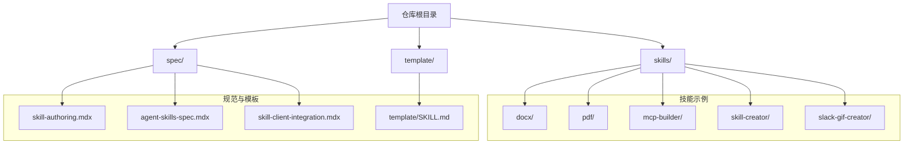
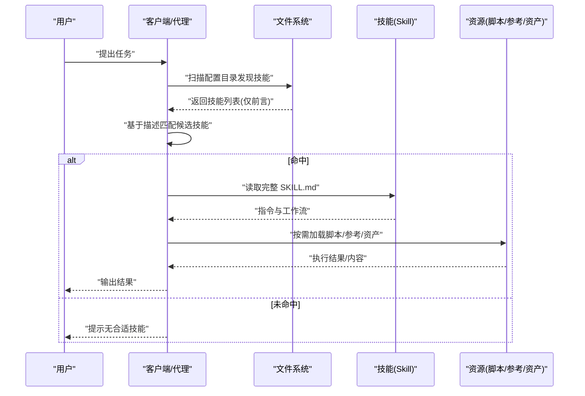
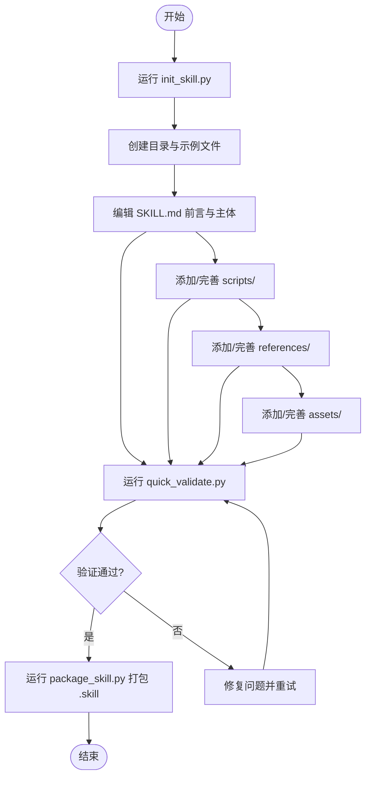
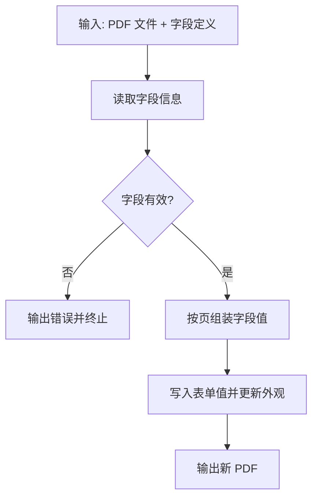

# 技能开发

<cite>
**本文引用的文件**
- [README.md](file://README.md)
- [template/SKILL.md](file://template/SKILL.md)
- [spec/skill-authoring.mdx](file://spec/skill-authoring.mdx)
- [spec/agent-skills-spec.mdx](file://spec/agent-skills-spec.mdx)
- [spec/skill-client-integration.mdx](file://spec/skill-client-integration.mdx)
- [skills/docx/SKILL.md](file://skills/docx/SKILL.md)
- [skills/pdf/SKILL.md](file://skills/pdf/SKILL.md)
- [skills/mcp-builder/SKILL.md](file://skills/mcp-builder/SKILL.md)
- [skills/skill-creator/SKILL.md](file://skills/skill-creator/SKILL.md)
- [skills/slack-gif-creator/SKILL.md](file://skills/slack-gif-creator/SKILL.md)
- [skills/skill-creator/scripts/init_skill.py](file://skills/skill-creator/scripts/init_skill.py)
- [skills/skill-creator/scripts/package_skill.py](file://skills/skill-creator/scripts/package_skill.py)
- [skills/skill-creator/scripts/quick_validate.py](file://skills/skill-creator/scripts/quick_validate.py)
- [skills/pdf/scripts/check_bounding_boxes.py](file://skills/pdf/scripts/check_bounding_boxes.py)
- [skills/pdf/scripts/fill_fillable_fields.py](file://skills/pdf/scripts/fill_fillable_fields.py)
</cite>

## 目录
1. [简介](#简介)
2. [项目结构](#项目结构)
3. [核心组件](#核心组件)
4. [架构总览](#架构总览)
5. [详细组件分析](#详细组件分析)
6. [依赖关系分析](#依赖关系分析)
7. [性能考量](#性能考量)
8. [故障排查指南](#故障排查指南)
9. [结论](#结论)
10. [附录](#附录)

## 简介
本指南面向技能开发者，系统阐述技能模板系统、SKILL.md 文件格式、编程最佳实践、调试与测试策略，并提供从零创建技能的完整工作流程、自动化工具使用、质量保证流程与分发部署建议。内容基于仓库中的规范文档与示例技能，帮助你在 Claude 或兼容代理中高效构建与维护高质量技能。

## 项目结构
仓库采用按技能分目录的组织方式，每个技能是一个独立文件夹，包含 SKILL.md（元数据与指令）、可选的 scripts/（可执行脚本）、references/（参考文档）与 assets/（静态资源）。顶层 spec/ 提供 Agent Skills 规范与集成指引，template/ 提供 SKILL.md 模板。

图表来源
- [README.md](file://README.md#L24-L27)
- [spec/skill-authoring.mdx](file://spec/skill-authoring.mdx#L8-L14)
- [template/SKILL.md](file://template/SKILL.md#L1-L59)

章节来源
- [README.md](file://README.md#L12-L27)
- [spec/skill-authoring.mdx](file://spec/skill-authoring.mdx#L8-L14)

## 核心组件
- 技能模板系统：通过初始化脚本生成标准化技能骨架，自动填充 SKILL.md 前言与示例资源目录，便于快速迭代与一致性管理。
- SKILL.md 文件格式：严格要求 YAML 前言（name、description 必填，其他可选），正文为 Markdown 指令，支持渐进披露以控制上下文占用。
- 自动化工具链：提供初始化、快速校验与打包为 .skill 文件的能力，确保技能结构与命名符合规范。
- 示例技能：涵盖文档处理（docx/pdf）、MCP 服务器开发、GIF 制作等，展示复杂工作流与脚本集成模式。

章节来源
- [skills/skill-creator/SKILL.md](file://skills/skill-creator/SKILL.md#L47-L101)
- [spec/agent-skills-spec.mdx](file://spec/agent-skills-spec.mdx#L21-L55)
- [skills/skill-creator/scripts/init_skill.py](file://skills/skill-creator/scripts/init_skill.py#L18-L103)
- [skills/skill-creator/scripts/quick_validate.py](file://skills/skill-creator/scripts/quick_validate.py#L12-L86)
- [skills/skill-creator/scripts/package_skill.py](file://skills/skill-creator/scripts/package_skill.py#L19-L82)

## 架构总览
技能系统围绕“发现-加载元数据-匹配-激活-执行”的流程运转。客户端在启动时仅解析 SKILL.md 前言，随后根据用户任务与描述进行匹配，激活后才加载完整指令与按需加载资源。

图表来源
- [spec/skill-client-integration.mdx](file://spec/skill-client-integration.mdx#L19-L25)
- [spec/skill-client-integration.mdx](file://spec/skill-client-integration.mdx#L35-L47)
- [spec/skill-client-integration.mdx](file://spec/skill-client-integration.mdx#L53-L68)

## 详细组件分析

### 组件A：技能模板系统与初始化
- 初始化脚本会创建技能目录、生成带占位符的 SKILL.md、示例 scripts/references/assets 目录与文件，便于后续编辑与扩展。
- 建议在初始化后立即完成前言字段完善与结构规划，再补充脚本与参考文档。

图表来源
- [skills/skill-creator/scripts/init_skill.py](file://skills/skill-creator/scripts/init_skill.py#L194-L270)
- [skills/skill-creator/scripts/quick_validate.py](file://skills/skill-creator/scripts/quick_validate.py#L12-L86)
- [skills/skill-creator/scripts/package_skill.py](file://skills/skill-creator/scripts/package_skill.py#L19-L82)

章节来源
- [skills/skill-creator/scripts/init_skill.py](file://skills/skill-creator/scripts/init_skill.py#L18-L103)
- [skills/skill-creator/scripts/quick_validate.py](file://skills/skill-creator/scripts/quick_validate.py#L12-L86)
- [skills/skill-creator/scripts/package_skill.py](file://skills/skill-creator/scripts/package_skill.py#L19-L82)

### 组件B：SKILL.md 文件格式与最佳实践
- 必填字段：name（长度与字符约束）、description（触发关键词与使用场景）。
- 可选字段：license、compatibility、metadata、allowed-tools。
- 渐进披露：前言始终加载，完整 SKILL.md 在激活时加载，资源按需加载，建议 SKILL.md 主体控制在 500 行以内。
- 结构建议：概述、何时使用、工作流决策树、步骤说明、验证方法、资源与目录指南、最佳实践、依赖项。

章节来源
- [spec/agent-skills-spec.mdx](file://spec/agent-skills-spec.mdx#L21-L55)
- [spec/agent-skills-spec.mdx](file://spec/agent-skills-spec.mdx#L197-L205)
- [template/SKILL.md](file://template/SKILL.md#L1-L59)

### 组件C：示例技能分析（PDF 处理）
- 典型特征：丰富的代码示例、命令行工具、库函数调用、表单填写与边界框检查脚本。
- 工作流：文本提取、表格提取、合并/拆分、旋转、加水印、OCR、加密、表单填充与验证。
- 质量保障：提供边界框检查脚本，确保表单字段区域不重叠且高度满足字体大小；对值类型进行严格校验（复选框、单选组、下拉选择）。

图表来源
- [skills/pdf/scripts/fill_fillable_fields.py](file://skills/pdf/scripts/fill_fillable_fields.py#L12-L56)
- [skills/pdf/scripts/check_bounding_boxes.py](file://skills/pdf/scripts/check_bounding_boxes.py#L18-L60)

章节来源
- [skills/pdf/SKILL.md](file://skills/pdf/SKILL.md#L1-L295)
- [skills/pdf/scripts/fill_fillable_fields.py](file://skills/pdf/scripts/fill_fillable_fields.py#L12-L75)
- [skills/pdf/scripts/check_bounding_boxes.py](file://skills/pdf/scripts/check_bounding_boxes.py#L18-L60)

### 组件D：示例技能分析（DOCX 处理）
- 工作流：文本提取（pandoc）、原始 XML 访问（解包/打包）、从零创建（docx-js）、现有文档编辑（Document 库）与审阅跟踪（红lining）。
- 审阅跟踪强调“最小精确修改”，建议批次化变更并保留原运行 ID（RSID）以提升可追溯性。
- 依赖项：pandoc、docx、LibreOffice、Poppler、defusedxml 等。

章节来源
- [skills/docx/SKILL.md](file://skills/docx/SKILL.md#L1-L197)

### 组件E：示例技能分析（MCP 服务器开发）
- 四阶段流程：深入研究与规划、实现、评审与测试、创建评估。
- 设计要点：API 覆盖与工作流工具平衡、工具命名与可发现性、上下文管理、可操作的错误消息。
- 实现建议：TypeScript/Python SDK、传输机制（HTTP/stdio）、注解标记（只读/破坏性/幂等等）、结构化响应与分页。
- 评估：创建 10 个真实、复杂、可验证的问题，输出 XML 格式。

章节来源
- [skills/mcp-builder/SKILL.md](file://skills/mcp-builder/SKILL.md#L1-L237)

### 组件F：示例技能分析（Slack GIF 制作）
- 要求与约束：尺寸、帧率、颜色数、时长；动画概念（抖动/脉动/弹跳/旋转/淡入淡出/滑动/缩放/粒子爆发）。
- 工具链：GIFBuilder、validators、easing 函数、frame 组合器；使用 PIL 进行绘制与优化。
- 哲学：提供知识与工具，不提供刚性模板；鼓励创意组合与细节打磨。

章节来源
- [skills/slack-gif-creator/SKILL.md](file://skills/slack-gif-creator/SKILL.md#L1-L255)

## 依赖关系分析
- 技能与客户端：客户端负责发现、加载元数据、匹配、激活与执行；技能提供结构化的指令与可选资源。
- 技能内部：SKILL.md 作为导航中心，references/ 与 scripts/ 作为按需加载的知识与能力单元。
- 脚本依赖：示例脚本依赖第三方库（如 pypdf、pdfplumber、reportlab、pillow 等），应在 SKILL.md 中明确列出并提供安装指引。

图表来源
- [spec/skill-client-integration.mdx](file://spec/skill-client-integration.mdx#L19-L25)

章节来源
- [spec/skill-client-integration.mdx](file://spec/skill-client-integration.mdx#L19-L25)

## 性能考量
- 上下文窗口管理：遵循渐进披露原则，SKILL.md 主体控制在 500 行内；将长篇参考材料放入 references/ 并在 SKILL.md 中清晰标注何时读取。
- 脚本执行效率：将重复性高、确定性强的任务封装为脚本，减少上下文占用；对大文件处理采用流式或分块策略。
- 资源加载策略：assets/ 不直接加载到上下文，仅在输出中使用；scripts/ 可在无需加载到上下文的前提下执行。
- 依赖与体积：在 SKILL.md 中明确列出依赖与安装方式，避免不必要的外部依赖；对 .skill 文件进行压缩打包以便分发。

## 故障排查指南
- 前言校验失败
  - 症状：name 与 description 格式不符、包含非法字符或长度超限。
  - 排查：使用快速校验脚本定位问题；检查是否包含尖括号、是否超过最大长度。
- 脚本执行异常
  - 症状：表单字段值类型不匹配、页面编号不一致、边界框重叠或高度不足。
  - 排查：运行边界框检查脚本与字段填充脚本，逐条核对字段 ID、页面与值域。
- 打包失败
  - 症状：缺少 SKILL.md、目录不存在、验证未通过。
  - 排查：确认技能目录结构正确、先通过快速校验，再执行打包。

章节来源
- [skills/skill-creator/scripts/quick_validate.py](file://skills/skill-creator/scripts/quick_validate.py#L52-L86)
- [skills/pdf/scripts/check_bounding_boxes.py](file://skills/pdf/scripts/check_bounding_boxes.py#L33-L56)
- [skills/pdf/scripts/fill_fillable_fields.py](file://skills/pdf/scripts/fill_fillable_fields.py#L30-L45)
- [skills/skill-creator/scripts/package_skill.py](file://skills/skill-creator/scripts/package_skill.py#L32-L54)

## 结论
通过规范化的模板系统、严谨的 SKILL.md 格式与完善的自动化工具链，你可以高效地设计、实现、验证与分发高质量技能。结合示例技能的工作流与最佳实践，能够在 Claude 或兼容代理中稳定扩展专业领域能力。

## 附录

### A. 技能创建完整工作流程
- 明确技能用途与典型用例
- 规划可复用的脚本、参考与资产
- 初始化技能骨架
- 编辑 SKILL.md 与资源文件
- 快速校验与迭代
- 打包为 .skill 文件并分发

章节来源
- [skills/skill-creator/SKILL.md](file://skills/skill-creator/SKILL.md#L202-L357)
- [skills/skill-creator/scripts/init_skill.py](file://skills/skill-creator/scripts/init_skill.py#L263-L270)
- [skills/skill-creator/scripts/quick_validate.py](file://skills/skill-creator/scripts/quick_validate.py#L12-L86)
- [skills/skill-creator/scripts/package_skill.py](file://skills/skill-creator/scripts/package_skill.py#L19-L82)

### B. SKILL.md 前言字段清单
- name：必填，小写字母、数字与短横线，首尾非短横，无连续短横，最多 64 字符
- description：必填，1-1024 字符，包含触发关键词与使用场景
- license：可选，许可证名称或捆绑许可证文件名
- compatibility：可选，环境要求说明
- metadata：可选，键值映射
- allowed-tools：可选，预批准工具列表

章节来源
- [spec/agent-skills-spec.mdx](file://spec/agent-skills-spec.mdx#L47-L54)
- [spec/agent-skills-spec.mdx](file://spec/agent-skills-spec.mdx#L56-L103)

### C. 示例技能参考
- 文档处理：docx 与 pdf 技能展示了复杂工作流与脚本集成
- MCP 服务器：提供四阶段开发流程与评估方法
- GIF 制作：强调约束、工具与创意组合

章节来源
- [skills/docx/SKILL.md](file://skills/docx/SKILL.md#L1-L197)
- [skills/pdf/SKILL.md](file://skills/pdf/SKILL.md#L1-L295)
- [skills/mcp-builder/SKILL.md](file://skills/mcp-builder/SKILL.md#L1-L237)
- [skills/slack-gif-creator/SKILL.md](file://skills/slack-gif-creator/SKILL.md#L1-L255)