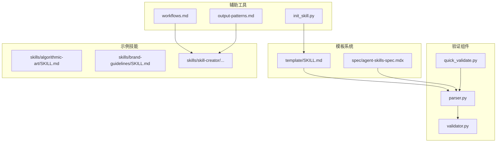
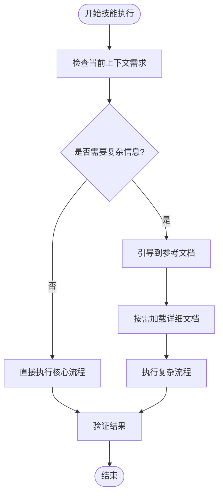
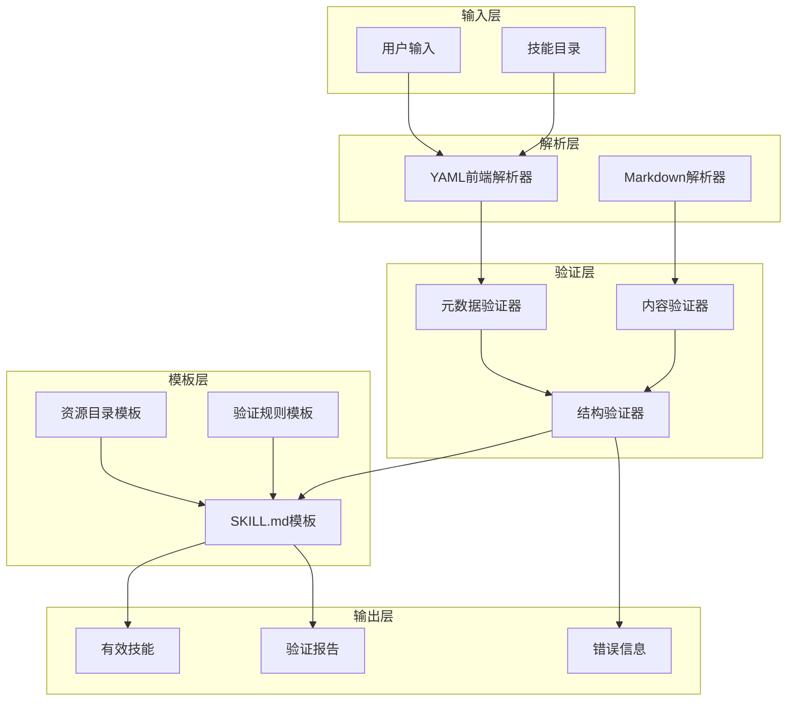
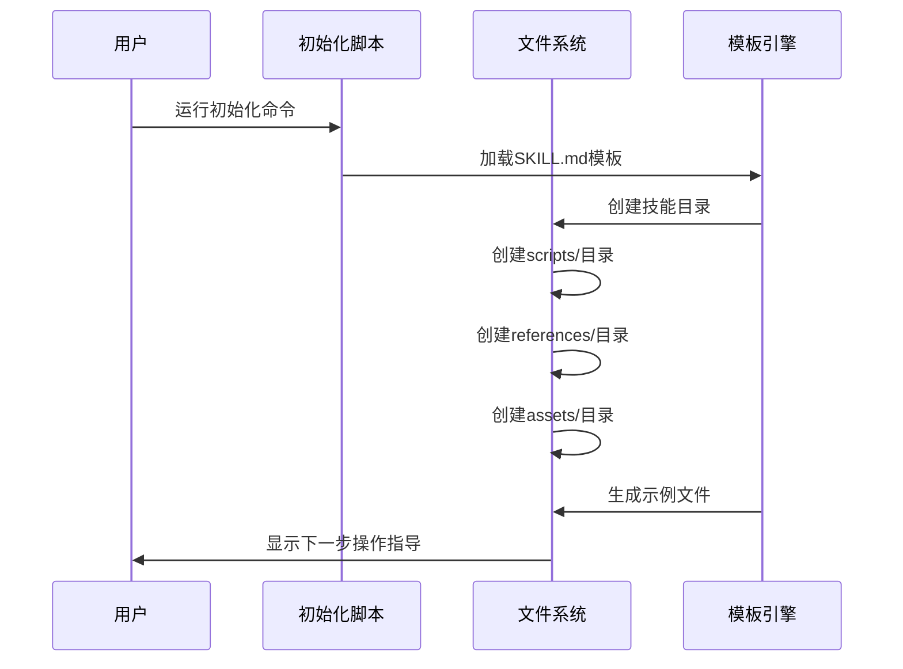
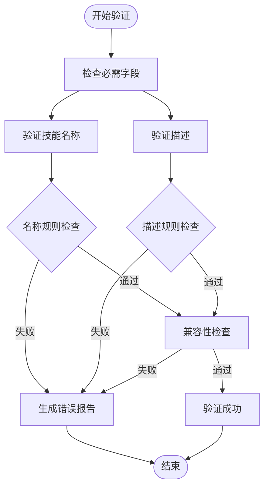
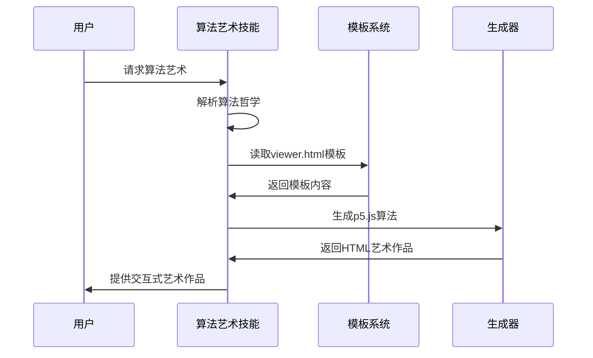
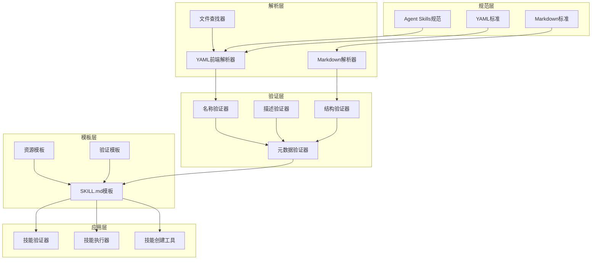

# 技能模板系统

<cite>
**本文档引用的文件**
- [template/SKILL.md](file://template/SKILL.md)
- [README.md](file://README.md)
- [spec/agent-skills-spec.mdx](file://spec/agent-skills-spec.mdx)
- [spec/skills-ref/src/skills_ref/parser.py](file://spec/skills-ref/src/skills_ref/parser.py)
- [spec/skills-ref/src/skills_ref/validator.py](file://spec/skills-ref/src/skills_ref/validator.py)
- [skills/algorithmic-art/SKILL.md](file://skills/algorithmic-art/SKILL.md)
- [skills/brand-guidelines/SKILL.md](file://skills/brand-guidelines/SKILL.md)
- [skills/skill-creator/scripts/init_skill.py](file://skills/skill-creator/scripts/init_skill.py)
- [skills/skill-creator/scripts/quick_validate.py](file://skills/skill-creator/scripts/quick_validate.py)
- [skills/skill-creator/references/workflows.md](file://skills/skill-creator/references/workflows.md)
- [skills/skill-creator/references/output-patterns.md](file://skills/skill-creator/references/output-patterns.md)
</cite>

## 目录
1. [简介](#简介)
2. [项目结构](#项目结构)
3. [核心组件](#核心组件)
4. [架构概览](#架构概览)
5. [详细组件分析](#详细组件分析)
6. [依赖关系分析](#依赖关系分析)
7. [性能考虑](#性能考虑)
8. [故障排除指南](#故障排除指南)
9. [结论](#结论)
10. [附录](#附录)

## 简介

技能模板系统是一个标准化的技能开发框架，用于创建可重复使用的AI技能。该系统基于Agent Skills标准，提供了一套完整的模板结构、验证规则和最佳实践指导。通过统一的模板格式，开发者可以快速创建高质量的技能，这些技能能够被Claude等AI工具有效识别和执行。

该系统的核心价值在于：
- **标准化**: 统一的模板格式确保技能的一致性和可预测性
- **渐进式披露**: 通过资源目录实现信息的分层组织
- **可验证性**: 完整的验证规则确保技能质量
- **可扩展性**: 支持多种技能类型和复杂的工作流程

## 项目结构

技能模板系统采用模块化设计，主要包含以下核心组件：

**图表来源**
- [template/SKILL.md](file://template/SKILL.md#L1-L59)
- [spec/agent-skills-spec.mdx](file://spec/agent-skills-spec.mdx#L1-L181)
- [skills/skill-creator/scripts/init_skill.py](file://skills/skill-creator/scripts/init_skill.py#L1-L304)

**章节来源**
- [README.md](file://README.md#L1-L95)
- [template/SKILL.md](file://template/SKILL.md#L1-L59)

## 核心组件

### 模板文件结构

技能模板采用YAML前端数据和Markdown内容的组合格式，确保结构化元数据和人类可读内容的完美结合。

#### 元数据字段定义

| 字段名 | 类型 | 必需 | 限制 | 描述 |
|--------|------|------|------|------|
| name | 字符串 | 是 | 1-64字符，小写，连字符 | 技能唯一标识符 |
| description | 字符串 | 是 | 最多1024字符 | 技能功能描述 |
| license | 字符串 | 否 | 自定义 | 许可证信息 |
| compatibility | 字符串 | 否 | 最多500字符 | 兼容性要求 |
| metadata | 对象 | 否 | 自定义键值对 | 扩展元数据 |
| allowed-tools | 字符串 | 否 | 空格分隔 | 允许的工具列表 |

#### 工作流设计元素

技能模板包含以下核心工作流组件：

1. **决策树**: 结构化的条件判断流程
2. **执行步骤**: 具体的操作序列
3. **验证阶段**: 输出质量检查机制
4. **资源引用**: 外部文档和脚本的链接

**章节来源**
- [template/SKILL.md](file://template/SKILL.md#L1-L59)
- [spec/agent-skills-spec.mdx](file://spec/agent-skills-spec.mdx#L25-L45)

### 渐进式披露机制

渐进式披露是技能模板的核心设计理念，通过将复杂信息分层组织，避免一次性加载过多内容。

**图表来源**
- [template/SKILL.md](file://template/SKILL.md#L41-L51)

### 资源目录规范

系统提供三种类型的资源目录，每种都有特定的用途和组织原则：

#### scripts/ 目录
- **用途**: 可执行代码脚本
- **语言支持**: Python、Bash、JavaScript
- **要求**: 自包含或明确依赖说明
- **特性**: 错误消息友好，边缘情况处理

#### references/ 目录
- **用途**: 详细文档和参考材料
- **内容**: API参考、数据库模式、综合指南
- **特点**: Claude在需要时才加载

#### assets/ 目录
- **用途**: 不直接加载到上下文的文件
- **类型**: 模板、样板代码、图像、字体
- **使用**: 在最终输出中使用

**章节来源**
- [template/SKILL.md](file://template/SKILL.md#L41-L51)
- [spec/agent-skills-spec.mdx](file://spec/agent-skills-spec.mdx#L170-L181)

## 架构概览

技能模板系统采用分层架构，从底层的验证机制到上层的模板应用，形成了完整的技能开发生态系统。

**图表来源**
- [spec/skills-ref/src/skills_ref/parser.py](file://spec/skills-ref/src/skills_ref/parser.py#L88-L112)
- [spec/skills-ref/src/skills_ref/validator.py](file://spec/skills-ref/src/skills_ref/validator.py#L118-L147)

## 详细组件分析

### 模板初始化系统

技能创建工具提供了完整的模板初始化功能，确保新技能从正确的起点开始。

#### 初始化流程

**图表来源**
- [skills/skill-creator/scripts/init_skill.py](file://skills/skill-creator/scripts/init_skill.py#L194-L271)

#### 模板生成策略

初始化脚本使用占位符模板，为新技能提供完整的结构框架：

1. **必需内容**: 基础描述和概述
2. **结构指导**: 不同技能类型的组织模式
3. **资源示例**: scripts/、references/、assets/的使用示例
4. **清理提示**: 删除不需要的占位符内容

**章节来源**
- [skills/skill-creator/scripts/init_skill.py](file://skills/skill-creator/scripts/init_skill.py#L18-L104)

### 验证系统

验证系统包含多个层次的检查，确保技能符合Agent Skills标准和最佳实践。

#### 核心验证规则

**图表来源**
- [spec/skills-ref/src/skills_ref/validator.py](file://spec/skills-ref/src/skills_ref/validator.py#L118-L147)

#### 验证规则详解

| 规则类别 | 具体要求 | 长度限制 | 示例 |
|----------|----------|----------|------|
| 技能名称 | 小写、连字符、无连续连字符 | 64字符 | `algorithmic-art` |
| 描述 | 非空字符串、无尖括号 | 1024字符 | "创建算法艺术..." |
| 兼容性 | 字符串格式 | 500字符 | "Requires Python 3.10+" |
| 元数据 | 允许的键值对 | 自定义 | `{author: team}` |

**章节来源**
- [spec/skills-ref/src/skills_ref/validator.py](file://spec/skills-ref/src/skills_ref/validator.py#L10-L22)
- [skills/skill-creator/scripts/quick_validate.py](file://skills/skill-creator/scripts/quick_validate.py#L42-L86)

### 实际使用示例

#### 算法艺术技能示例

算法艺术技能展示了复杂工作流程的最佳实践：

**图表来源**
- [skills/algorithmic-art/SKILL.md](file://skills/algorithmic-art/SKILL.md#L105-L128)

#### 品牌指南技能示例

品牌指南技能体现了简洁性原则的应用：

| 组件 | 内容 | 设计原则 |
|------|------|----------|
| 颜色规范 | 主色、强调色、辅助色 | 一致性、可访问性 |
| 字体规范 | 标题字体、正文字体 | 可读性、品牌识别 |
| 功能特性 | 智能字体应用、文本样式 | 自动化、适应性 |

**章节来源**
- [skills/brand-guidelines/SKILL.md](file://skills/brand-guidelines/SKILL.md#L1-L74)

### 最佳实践原则

技能模板系统定义了五项核心最佳实践：

#### 1. 简洁性原则
- SKILL.md作为导航站而非百科全书
- 复杂实现细节移至references/
- 保持核心内容精炼

#### 2. 自适应自由度
- 明确必须严格执行的步骤
- 允许AI在创意领域发挥
- 平衡标准化和灵活性

#### 3. 上下文敏感
- 考虑上下文窗口限制
- 只提供必要信息
- 按需加载详细内容

#### 4. 精确指令
- 使用明确动词：读取、运行、验证
- 避免模糊表述
- 提供具体操作指导

#### 5. 错误处理
- 预判常见错误
- 提供解决方案
- 建立回退机制

**章节来源**
- [template/SKILL.md](file://template/SKILL.md#L46-L51)

## 依赖关系分析

技能模板系统具有清晰的依赖层次结构，从基础规范到具体实现形成完整的依赖链。

**图表来源**
- [spec/agent-skills-spec.mdx](file://spec/agent-skills-spec.mdx#L1-L181)
- [spec/skills-ref/src/skills_ref/parser.py](file://spec/skills-ref/src/skills_ref/parser.py#L88-L112)

**章节来源**
- [spec/skills-ref/src/skills_ref/validator.py](file://spec/skills-ref/src/skills_ref/validator.py#L1-L178)

## 性能考虑

技能模板系统在设计时充分考虑了性能优化：

### 上下文加载优化
- SKILL.md保持简洁，避免不必要的内容
- 参考文档按需加载，减少初始传输量
- 资源文件不直接加载到上下文

### 验证性能
- 快速验证脚本提供即时反馈
- 严格验证器进行深度检查
- 缓存机制避免重复计算

### 执行效率
- 渐进式披露减少内存占用
- 模块化设计支持并行处理
- 标准化接口提高互操作性

## 故障排除指南

### 常见验证错误及解决方案

| 错误类型 | 错误信息 | 解决方案 |
|----------|----------|----------|
| 名称格式错误 | "技能名称必须小写" | 将名称转换为小写，使用连字符 |
| 描述格式错误 | "描述不能包含尖括号" | 移除描述中的<或>字符 |
| 文件缺失错误 | "缺少必需文件: SKILL.md" | 确保技能目录包含SKILL.md文件 |
| 前端格式错误 | "无效的前端格式" | 检查YAML前端的格式和语法 |
| 目录不匹配 | "目录名称必须匹配技能名称" | 确保技能目录名称与name字段一致 |

### 调试技巧

1. **逐步验证**: 使用快速验证脚本检查基本格式
2. **详细日志**: 启用严格验证器获取完整错误信息
3. **模板对比**: 与示例技能进行逐行对比
4. **增量开发**: 分步骤添加功能，及时验证

**章节来源**
- [skills/skill-creator/scripts/quick_validate.py](file://skills/skill-creator/scripts/quick_validate.py#L12-L86)
- [spec/skills-ref/src/skills_ref/validator.py](file://spec/skills-ref/src/skills_ref/validator.py#L150-L178)

## 结论

技能模板系统通过标准化的模板结构、严格的验证机制和完善的最佳实践指导，为AI技能开发提供了一个强大而灵活的框架。该系统的核心优势在于：

1. **一致性**: 统一的模板确保所有技能都遵循相同的标准
2. **可扩展性**: 渐进式披露机制支持复杂技能的模块化组织
3. **可靠性**: 完整的验证规则保证技能质量
4. **易用性**: 丰富的示例和工具降低使用门槛

通过遵循本文档的指导原则和最佳实践，开发者可以创建高质量的AI技能，这些技能不仅能够被现有AI工具有效识别和执行，还能够在未来的技术演进中保持兼容性和可维护性。

## 附录

### 模板字段完整参考

| 字段名 | 类型 | 必需 | 默认值 | 说明 |
|--------|------|------|--------|------|
| name | 字符串 | 是 | 无 | 技能唯一标识符 |
| description | 字符串 | 是 | 无 | 技能功能描述 |
| license | 字符串 | 否 | 无 | 许可证信息 |
| compatibility | 字符串 | 否 | 无 | 兼容性要求 |
| metadata | 对象 | 否 | 无 | 扩展元数据 |
| allowed-tools | 字符串 | 否 | 无 | 允许的工具列表 |

### 资源目录使用指南

- **scripts/**: 存放可执行脚本，支持Python、Bash、JavaScript
- **references/**: 存放详细文档，按需加载
- **assets/**: 存放静态资源文件

### 验证工具使用

1. **快速验证**: `python quick_validate.py <技能目录>`
2. **严格验证**: 使用验证器模块进行完整检查
3. **初始化**: `python init_skill.py <技能名称> --path <路径>`