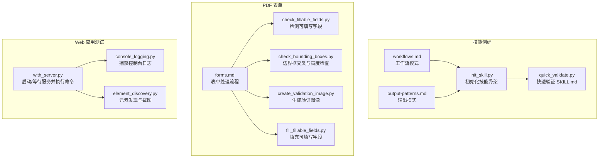
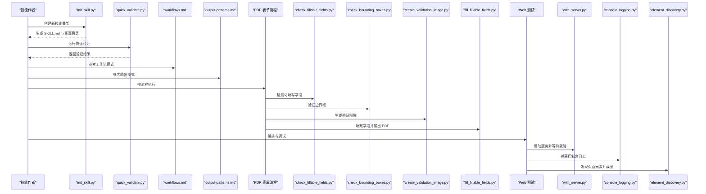
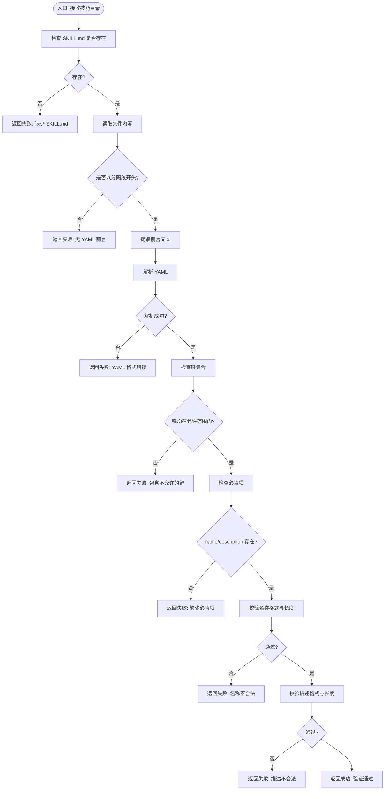
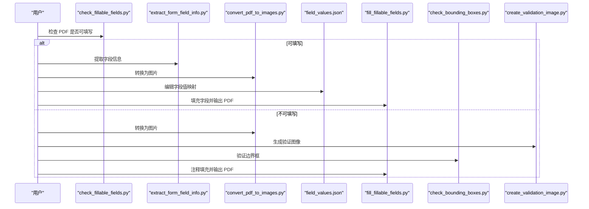
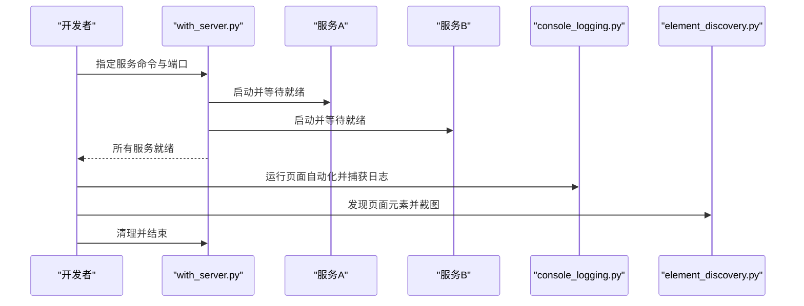
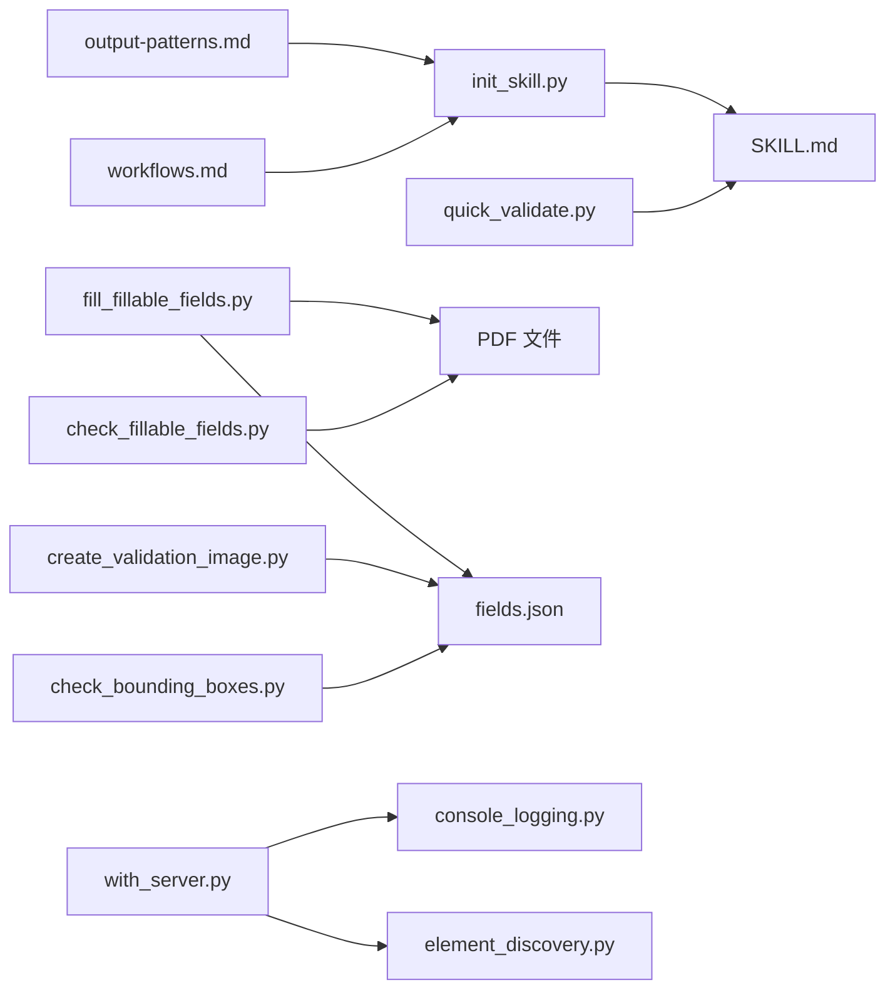

# 技能测试与调试

<cite>
**本文引用的文件**
- [quick_validate.py](file://skills/skill-creator/scripts/quick_validate.py)
- [workflows.md](file://skills/skill-creator/references/workflows.md)
- [output-patterns.md](file://skills/skill-creator/references/output-patterns.md)
- [init_skill.py](file://skills/skill-creator/scripts/init_skill.py)
- [check_bounding_boxes.py](file://skills/pdf/scripts/check_bounding_boxes.py)
- [check_fillable_fields.py](file://skills/pdf/scripts/check_fillable_fields.py)
- [fill_fillable_fields.py](file://skills/pdf/scripts/fill_fillable_fields.py)
- [create_validation_image.py](file://skills/pdf/scripts/create_validation_image.py)
- [forms.md](file://skills/pdf/forms.md)
- [check_bounding_boxes_test.py](file://skills/pdf/scripts/check_bounding_boxes_test.py)
- [console_logging.py](file://skills/webapp-testing/examples/console_logging.py)
- [element_discovery.py](file://skills/webapp-testing/examples/element_discovery.py)
- [with_server.py](file://skills/webapp-testing/scripts/with_server.py)
- [README.md](file://README.md)
</cite>

## 目录
1. 引言
2. 项目结构
3. 核心组件
4. 架构总览
5. 详细组件分析
6. 依赖关系分析
7. 性能考量
8. 故障排查指南
9. 结论
10. 附录

## 引言
本指南面向技能作者与测试工程师，系统化讲解技能质量保证流程与调试方法。内容覆盖：
- 快速验证工具的使用与自动化验证流程
- 输出模式检查与一致性保障
- 测试用例设计方法：正常流程、异常处理、边界情况
- PDF 表单技能的调试策略与工具链
- Web 应用自动化测试的调试工具与技巧
- 常见问题诊断与解决方案

## 项目结构
该仓库以“技能”为单位组织，每个技能自包含指令（SKILL.md）、脚本（scripts）与参考材料（references）。与测试和调试直接相关的核心模块包括：
- 技能初始化与模板：用于生成标准化技能骨架
- 快速验证：对 SKILL.md 的最小化校验
- PDF 表单处理：从字段提取到填充与可视化验证
- Web 应用测试：浏览器自动化、日志捕获、服务器编排

图表来源
- [init_skill.py](file://skills/skill-creator/scripts/init_skill.py#L1-L304)
- [quick_validate.py](file://skills/skill-creator/scripts/quick_validate.py#L1-L95)
- [workflows.md](file://skills/skill-creator/references/workflows.md#L1-L28)
- [output-patterns.md](file://skills/skill-creator/references/output-patterns.md#L1-L83)
- [forms.md](file://skills/pdf/forms.md#L1-L206)
- [check_fillable_fields.py](file://skills/pdf/scripts/check_fillable_fields.py#L1-L13)
- [check_bounding_boxes.py](file://skills/pdf/scripts/check_bounding_boxes.py#L1-L71)
- [create_validation_image.py](file://skills/pdf/scripts/create_validation_image.py#L1-L42)
- [fill_fillable_fields.py](file://skills/pdf/scripts/fill_fillable_fields.py#L1-L115)
- [with_server.py](file://skills/webapp-testing/scripts/with_server.py#L1-L106)
- [console_logging.py](file://skills/webapp-testing/examples/console_logging.py#L1-L35)
- [element_discovery.py](file://skills/webapp-testing/examples/element_discovery.py#L1-L40)

章节来源
- [README.md](file://README.md#L1-L95)

## 核心组件
- 技能初始化与模板：提供标准化的 SKILL.md 模板与资源目录结构建议，便于快速搭建高质量技能。
- 快速验证：对 SKILL.md 的最小化校验，确保必要元数据存在且格式正确。
- PDF 表单处理：围绕可填写字段与非可填写字段两类场景，提供字段信息提取、边界框验证、注释填充等工具链。
- Web 应用测试：提供服务器编排、日志捕获与页面元素发现的实用脚本。

章节来源
- [init_skill.py](file://skills/skill-creator/scripts/init_skill.py#L1-L304)
- [quick_validate.py](file://skills/skill-creator/scripts/quick_validate.py#L1-L95)
- [forms.md](file://skills/pdf/forms.md#L1-L206)
- [with_server.py](file://skills/webapp-testing/scripts/with_server.py#L1-L106)

## 架构总览
下图展示从“技能初始化”到“PDF 表单验证与填充”的端到端流程，以及“Web 应用测试”的编排与调试路径。

图表来源
- [init_skill.py](file://skills/skill-creator/scripts/init_skill.py#L1-L304)
- [quick_validate.py](file://skills/skill-creator/scripts/quick_validate.py#L1-L95)
- [workflows.md](file://skills/skill-creator/references/workflows.md#L1-L28)
- [output-patterns.md](file://skills/skill-creator/references/output-patterns.md#L1-L83)
- [forms.md](file://skills/pdf/forms.md#L1-L206)
- [check_fillable_fields.py](file://skills/pdf/scripts/check_fillable_fields.py#L1-L13)
- [check_bounding_boxes.py](file://skills/pdf/scripts/check_bounding_boxes.py#L1-L71)
- [create_validation_image.py](file://skills/pdf/scripts/create_validation_image.py#L1-L42)
- [fill_fillable_fields.py](file://skills/pdf/scripts/fill_fillable_fields.py#L1-L115)
- [with_server.py](file://skills/webapp-testing/scripts/with_server.py#L1-L106)
- [console_logging.py](file://skills/webapp-testing/examples/console_logging.py#L1-L35)
- [element_discovery.py](file://skills/webapp-testing/examples/element_discovery.py#L1-L40)

## 详细组件分析

### 快速验证工具：quick_validate.py
- 功能概述
  - 校验 SKILL.md 是否存在
  - 解析并校验 YAML 前言（frontmatter）
  - 校验允许的属性集合与必填项
  - 校验名称与描述的命名规范与长度限制
- 使用方式
  - 命令行参数为技能目录路径
  - 成功返回状态码 0，失败返回非 0
- 验证规则要点
  - 允许属性集合包含名称、描述、许可证、允许工具、元数据等
  - 名称需符合连字符命名法、长度不超过 64 字符
  - 描述需为字符串、不含尖括号、长度不超过 1024 字符
- 自动化集成
  - 在 CI 中调用以实现“准入检查”，避免低质量 SKILL.md 进入后续流程

图表来源
- [quick_validate.py](file://skills/skill-creator/scripts/quick_validate.py#L12-L86)

章节来源
- [quick_validate.py](file://skills/skill-creator/scripts/quick_validate.py#L1-L95)

### 技能初始化：init_skill.py
- 功能概述
  - 生成标准 SKILL.md 模板与资源目录（scripts、references、assets）
  - 提供结构化建议：工作流型、任务型、参考型、能力型
- 使用方式
  - 命令行：指定技能名与目标路径
  - 生成后按 TODO 完成内容，运行快速验证
- 资源目录职责
  - scripts：可直接执行的自动化脚本
  - references：加载到上下文中的参考文档
  - assets：不加载到上下文但用于最终输出的资源文件

章节来源
- [init_skill.py](file://skills/skill-creator/scripts/init_skill.py#L1-L304)

### 输出模式与工作流：workflows.md、output-patterns.md
- 工作流模式
  - 顺序工作流：复杂任务拆分为清晰步骤
  - 条件工作流：根据决策点分支执行不同流程
- 输出模式
  - 模板模式：严格结构（如报告模板）或灵活指导
  - 示例模式：提供输入/输出样例，帮助明确风格与细节

章节来源
- [workflows.md](file://skills/skill-creator/references/workflows.md#L1-L28)
- [output-patterns.md](file://skills/skill-creator/references/output-patterns.md#L1-L83)

### PDF 表单处理：forms.md 与配套脚本
- 流程概览
  - 检测 PDF 是否具有可填写字段
  - 若有：提取字段信息、转换为图片、创建值映射、填充并验证
  - 若无：基于视觉分析确定标签与输入区域，生成验证图像，再注释填充
- 关键脚本与职责
  - 检测可填写字段：判断是否需要直接填充
  - 边界框检查：交叉检测与输入框高度校验，防止重叠与文字截断
  - 验证图像生成：为每页绘制红（输入）蓝（标签）矩形，辅助人工复核
  - 填充可填写字段：校验字段 ID、页码与值类型，写入 PDF
- 错误处理与限制
  - 对于选择列表字段的已知第三方库缺陷，采用猴子补丁绕过
  - 边界框检查对错误数量做上限限制，避免输出膨胀

图表来源
- [forms.md](file://skills/pdf/forms.md#L1-L206)
- [check_fillable_fields.py](file://skills/pdf/scripts/check_fillable_fields.py#L1-L13)
- [fill_fillable_fields.py](file://skills/pdf/scripts/fill_fillable_fields.py#L1-L115)
- [check_bounding_boxes.py](file://skills/pdf/scripts/check_bounding_boxes.py#L1-L71)
- [create_validation_image.py](file://skills/pdf/scripts/create_validation_image.py#L1-L42)

章节来源
- [forms.md](file://skills/pdf/forms.md#L1-L206)
- [check_fillable_fields.py](file://skills/pdf/scripts/check_fillable_fields.py#L1-L13)
- [fill_fillable_fields.py](file://skills/pdf/scripts/fill_fillable_fields.py#L1-L115)
- [check_bounding_boxes.py](file://skills/pdf/scripts/check_bounding_boxes.py#L1-L71)
- [create_validation_image.py](file://skills/pdf/scripts/create_validation_image.py#L1-L42)

### Web 应用测试：with_server.py、console_logging.py、element_discovery.py
- 服务器编排 with_server.py
  - 支持单个或多个服务同时启动
  - 通过轮询端口判断服务就绪，超时则报错
  - 执行完成后统一清理进程
- 控制台日志捕获 console_logging.py
  - 使用 Playwright 捕获页面控制台日志，保存到文件
- 页面元素发现 element_discovery.py
  - 发现按钮、链接、输入框等元素，打印信息并截图留证

图表来源
- [with_server.py](file://skills/webapp-testing/scripts/with_server.py#L1-L106)
- [console_logging.py](file://skills/webapp-testing/examples/console_logging.py#L1-L35)
- [element_discovery.py](file://skills/webapp-testing/examples/element_discovery.py#L1-L40)

章节来源
- [with_server.py](file://skills/webapp-testing/scripts/with_server.py#L1-L106)
- [console_logging.py](file://skills/webapp-testing/examples/console_logging.py#L1-L35)
- [element_discovery.py](file://skills/webapp-testing/examples/element_discovery.py#L1-L40)

## 依赖关系分析
- 组件内聚与耦合
  - quick_validate.py 仅依赖标准库与 YAML，耦合度低，易于集成到 CI
  - PDF 工具链围绕 forms.md 的流程串联，职责清晰
  - Web 测试工具独立，可单独使用或组合使用
- 外部依赖
  - PDF 工具链依赖 pypdf、Pillow 等第三方库
  - Web 测试依赖 Playwright
- 循环依赖
  - 当前脚本间无循环导入，遵循单向数据流

图表来源
- [quick_validate.py](file://skills/skill-creator/scripts/quick_validate.py#L1-L95)
- [init_skill.py](file://skills/skill-creator/scripts/init_skill.py#L1-L304)
- [workflows.md](file://skills/skill-creator/references/workflows.md#L1-L28)
- [output-patterns.md](file://skills/skill-creator/references/output-patterns.md#L1-L83)
- [check_fillable_fields.py](file://skills/pdf/scripts/check_fillable_fields.py#L1-L13)
- [check_bounding_boxes.py](file://skills/pdf/scripts/check_bounding_boxes.py#L1-L71)
- [create_validation_image.py](file://skills/pdf/scripts/create_validation_image.py#L1-L42)
- [fill_fillable_fields.py](file://skills/pdf/scripts/fill_fillable_fields.py#L1-L115)
- [with_server.py](file://skills/webapp-testing/scripts/with_server.py#L1-L106)
- [console_logging.py](file://skills/webapp-testing/examples/console_logging.py#L1-L35)
- [element_discovery.py](file://skills/webapp-testing/examples/element_discovery.py#L1-L40)

## 性能考量
- 快速验证
  - 时间复杂度近似 O(n)，n 为 frontmatter 键数；空间复杂度 O(1)
  - 适合在本地与 CI 中高频运行，作为“准入检查”
- 边界框检查
  - 当前实现为 O(N^2)，在字段较多时可能成为瓶颈
  - 建议：在字段规模较大时引入空间索引（如四叉树）优化相交检测
- PDF 填充
  - 通过按页聚合字段值减少写入次数，提升性能
  - 对第三方库缺陷的猴子补丁会带来一次性的额外开销，但仅在初始化阶段执行

## 故障排查指南
- SKILL.md 快速验证失败
  - 检查是否存在 SKILL.md 与正确的 YAML 分隔线
  - 校验 frontmatter 键是否在允许集合内
  - 确认 name 与 description 类型与长度要求
- PDF 可填写字段填充失败
  - 校验字段 ID 是否存在于提取的字段信息中
  - 校验页码是否与提取信息一致
  - 校验值类型与有效选项（复选框、单选组、选择列表）
  - 若为选择列表，确认第三方库缺陷已被猴子补丁处理
- 边界框交叉与高度问题
  - 使用边界框检查脚本定位重叠区域
  - 生成验证图像进行人工复核
  - 调整输入框高度以适配字体大小
- Web 应用测试
  - 使用服务器编排脚本确保服务就绪后再执行自动化
  - 捕获控制台日志并结合元素发现脚本定位问题
  - 截图留证，便于回溯与复现

章节来源
- [quick_validate.py](file://skills/skill-creator/scripts/quick_validate.py#L12-L86)
- [fill_fillable_fields.py](file://skills/pdf/scripts/fill_fillable_fields.py#L59-L76)
- [check_bounding_boxes.py](file://skills/pdf/scripts/check_bounding_boxes.py#L18-L60)
- [with_server.py](file://skills/webapp-testing/scripts/with_server.py#L23-L32)
- [console_logging.py](file://skills/webapp-testing/examples/console_logging.py#L14-L18)
- [element_discovery.py](file://skills/webapp-testing/examples/element_discovery.py#L13-L37)

## 结论
通过“初始化—快速验证—工作流与输出模式—工具链验证—自动化测试—故障排查”的闭环，可以系统性地提升技能质量与稳定性。建议在团队内推广使用 quick_validate.py 作为准入检查，并在 PDF 与 Web 应用场景中结合相应工具链与测试脚本，形成可重复、可追溯的质量保障流程。

## 附录
- 测试用例设计方法
  - 正常流程：按流程文档逐步执行，记录中间产物与最终结果
  - 异常处理：构造无效字段 ID、错误页码、非法值类型等，验证错误提示
  - 边界情况：空描述、最大长度、重叠边界框、极小输入框高度、多页不同坐标系
- 自动化验证示例
  - 在 CI 中调用 quick_validate.py 并结合 PDF 工具链与 Web 测试脚本，形成端到端流水线
- 实际应用示例
  - PDF：先用“检测可填写字段”判断流程，再用“边界框检查”与“验证图像”确保准确性，最后“填充字段”输出 PDF
  - Web：用“服务器编排”启动前端/后端，再用“控制台日志捕获”与“元素发现”定位问题