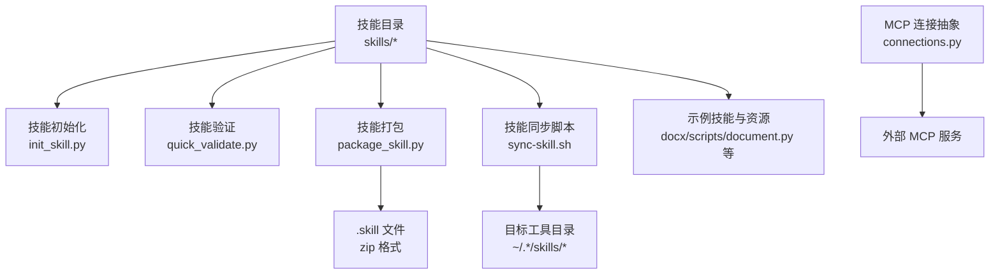
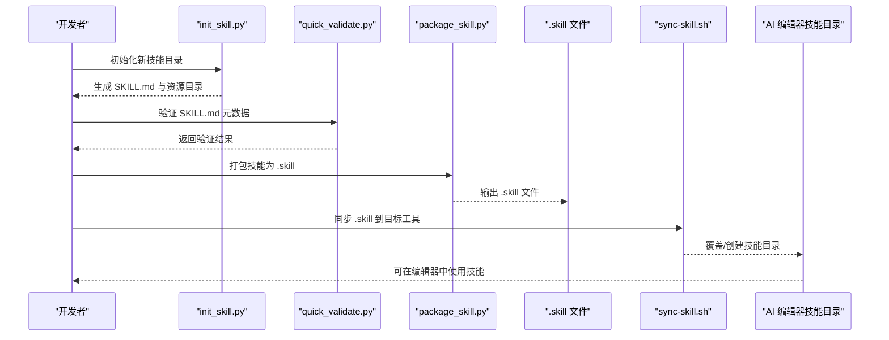
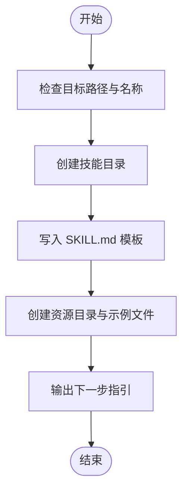
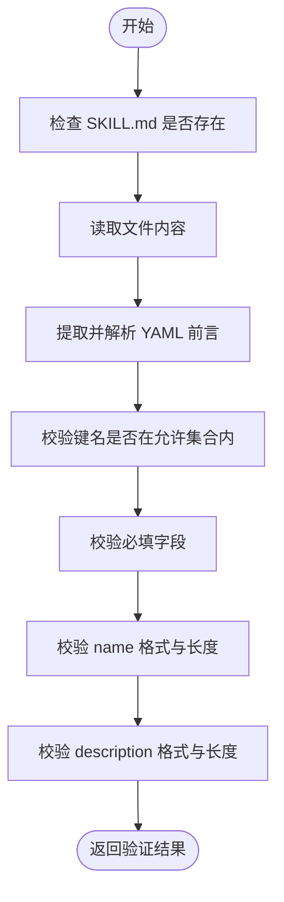
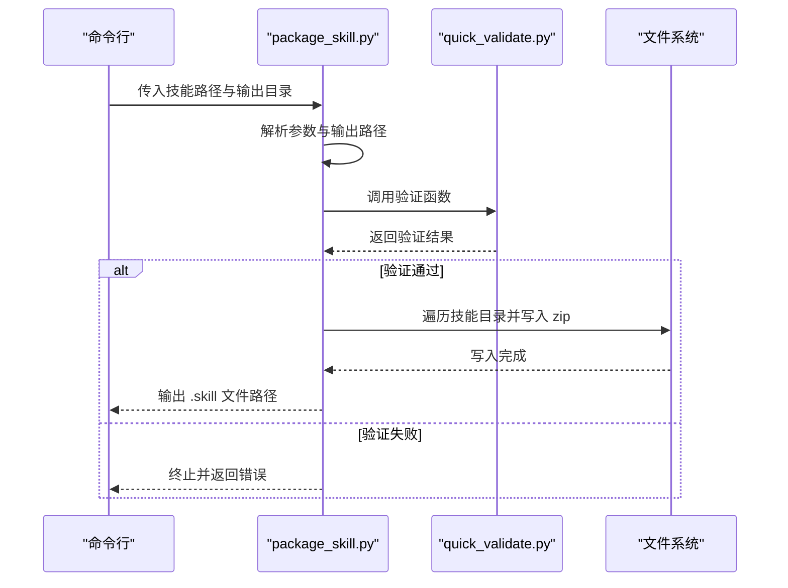
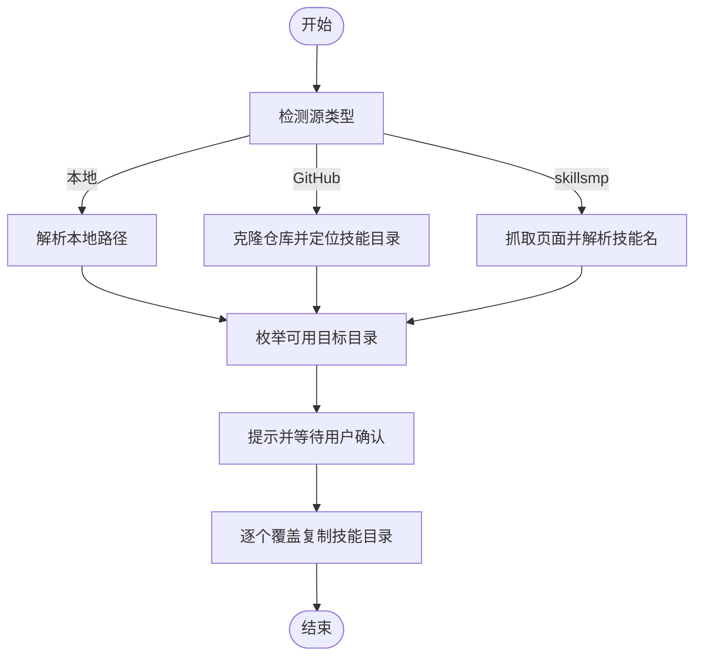
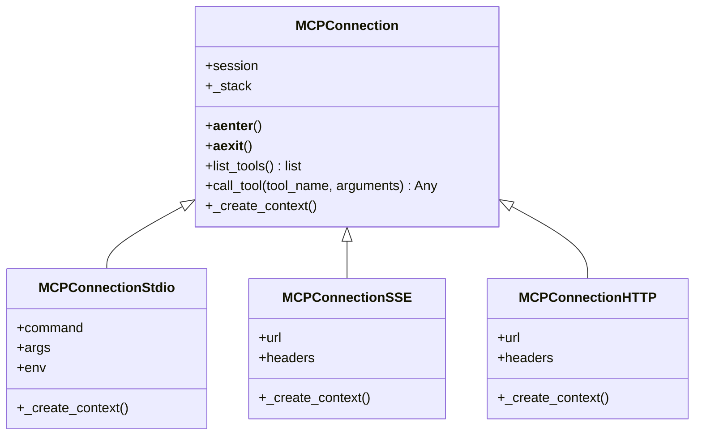
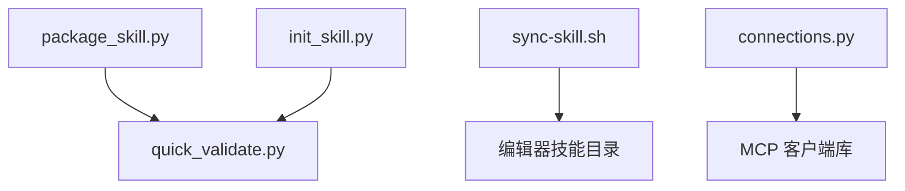

# 技能部署与分发

<cite>
**本文引用的文件**
- [README.md](file://README.md)
- [package_skill.py](file://skills/skill-creator/scripts/package_skill.py)
- [quick_validate.py](file://skills/skill-creator/scripts/quick_validate.py)
- [init_skill.py](file://skills/skill-creator/scripts/init_skill.py)
- [sync-skill.sh](file://skills/sync-skills/sync-skill.sh)
- [connections.py](file://skills/mcp-builder/scripts/connections.py)
- [document.py](file://skills/docx/scripts/document.py)
</cite>

## 目录
1. [简介](#简介)
2. [项目结构](#项目结构)
3. [核心组件](#核心组件)
4. [架构总览](#架构总览)
5. [详细组件分析](#详细组件分析)
6. [依赖关系分析](#依赖关系分析)
7. [性能考量](#性能考量)
8. [故障排查指南](#故障排查指南)
9. [结论](#结论)
10. [附录](#附录)

## 简介
本指南面向“技能部署与分发”的全流程实践，覆盖技能打包、版本管理、分发策略、同步机制、版本控制与冲突处理、多环境部署最佳实践、技能更新与维护及向后兼容性考虑。文档以仓库中的工具脚本与示例技能为基础，结合可复用的模式与流程，帮助你在本地开发、测试与生产环境中稳定地交付与维护技能。

## 项目结构
该仓库包含多个技能示例与支撑工具，其中与“技能部署与分发”直接相关的模块集中在以下位置：
- 技能模板与初始化：skills/skill-creator/scripts
- 技能打包与验证：skills/skill-creator/scripts
- 技能同步脚本：skills/sync-skills/sync-skill.sh
- MCP 连接抽象：skills/mcp-builder/scripts
- 示例技能（用于理解结构与资源组织）：skills/docx/scripts/document.py 等

图表来源
- [package_skill.py](file://skills/skill-creator/scripts/package_skill.py#L1-L111)
- [quick_validate.py](file://skills/skill-creator/scripts/quick_validate.py#L1-L95)
- [init_skill.py](file://skills/skill-creator/scripts/init_skill.py#L1-L304)
- [sync-skill.sh](file://skills/sync-skills/sync-skill.sh#L1-L264)
- [connections.py](file://skills/mcp-builder/scripts/connections.py#L1-L152)
- [document.py](file://skills/docx/scripts/document.py#L1-L800)

章节来源
- [README.md](file://README.md#L1-L95)

## 核心组件
- 技能初始化器：生成标准化的技能目录结构与模板文件，便于快速启动新技能。
- 技能验证器：对 SKILL.md 的元数据进行基础校验，确保命名、描述等字段符合规范。
- 技能打包器：将技能目录打包为 .skill 文件（zip），并执行预打包验证。
- 技能同步脚本：从本地或远程源同步技能到多款 AI 编辑器的本地技能目录。
- MCP 连接抽象：为 MCP 服务器提供统一的连接与调用接口，便于在技能中集成外部能力。

章节来源
- [init_skill.py](file://skills/skill-creator/scripts/init_skill.py#L1-L304)
- [quick_validate.py](file://skills/skill-creator/scripts/quick_validate.py#L1-L95)
- [package_skill.py](file://skills/skill-creator/scripts/package_skill.py#L1-L111)
- [sync-skill.sh](file://skills/sync-skills/sync-skill.sh#L1-L264)
- [connections.py](file://skills/mcp-builder/scripts/connections.py#L1-L152)

## 架构总览
下图展示了从“创建/维护技能”到“分发与同步”的端到端流程，以及与外部工具的交互点。

图表来源
- [init_skill.py](file://skills/skill-creator/scripts/init_skill.py#L194-L271)
- [quick_validate.py](file://skills/skill-creator/scripts/quick_validate.py#L12-L87)
- [package_skill.py](file://skills/skill-creator/scripts/package_skill.py#L19-L83)
- [sync-skill.sh](file://skills/sync-skills/sync-skill.sh#L184-L224)

## 详细组件分析

### 组件一：技能初始化（init_skill.py）
- 功能概述
  - 创建标准化技能目录，包含 SKILL.md 模板与示例资源目录（scripts、references、assets）。
  - 提供下一步指引，帮助作者完成内容填充与验证。
- 关键行为
  - 校验目标路径与名称合法性（仅小写字母、数字、短横线，长度限制等）。
  - 生成模板内容并写入文件，设置脚本可执行权限。
- 使用建议
  - 在创建新技能时优先使用该脚本，确保结构一致。
  - 完成初稿后立即运行验证器，尽早发现元数据问题。

图表来源
- [init_skill.py](file://skills/skill-creator/scripts/init_skill.py#L194-L271)

章节来源
- [init_skill.py](file://skills/skill-creator/scripts/init_skill.py#L1-L304)

### 组件二：技能验证（quick_validate.py）
- 功能概述
  - 对 SKILL.md 的 YAML 前言进行解析与校验，确保字段合法且符合规范。
- 校验要点
  - 必填字段：name、description。
  - 字段类型与格式：字符串、命名规则（hyphen-case）、长度限制。
  - 不允许的字符与结构：描述中禁止尖括号；前言键名需在允许集合内。
- 错误处理
  - 逐项报错，定位具体问题，便于修复后重试。

图表来源
- [quick_validate.py](file://skills/skill-creator/scripts/quick_validate.py#L12-L87)

章节来源
- [quick_validate.py](file://skills/skill-creator/scripts/quick_validate.py#L1-L95)

### 组件三：技能打包（package_skill.py）
- 功能概述
  - 将技能目录打包为 .skill 文件（zip 格式），并在打包前执行验证。
- 关键流程
  - 参数解析与输出目录准备。
  - 预验证：调用验证器，失败则终止。
  - 打包：遍历技能根目录下的所有文件，按相对路径写入 zip。
- 打包产物
  - 输出 .skill 文件，可用于分发或上传。

图表来源
- [package_skill.py](file://skills/skill-creator/scripts/package_skill.py#L19-L83)
- [quick_validate.py](file://skills/skill-creator/scripts/quick_validate.py#L12-L87)

章节来源
- [package_skill.py](file://skills/skill-creator/scripts/package_skill.py#L1-L111)

### 组件四：技能同步（sync-skill.sh）
- 功能概述
  - 支持从本地目录、GitHub 仓库、skillsmp.com 页面同步技能到多款 AI 编辑器的本地技能目录。
- 同步流程
  - 自动检测源类型（本地/远程）。
  - GitHub 源：克隆仓库并定位技能目录（支持根目录或 skills 子目录）。
  - 目标：扫描用户主目录下各编辑器的技能目录，确认后逐一覆盖复制。
- 冲突处理
  - 若目标已存在同名技能目录，先删除再复制，避免残留旧版本。
- 用户交互
  - 同步前列出将要覆盖的目标目录，需要用户确认。

图表来源
- [sync-skill.sh](file://skills/sync-skills/sync-skill.sh#L27-L224)

章节来源
- [sync-skill.sh](file://skills/sync-skills/sync-skill.sh#L1-L264)

### 组件五：MCP 连接抽象（connections.py）
- 功能概述
  - 提供统一的 MCP 客户端会话封装，支持标准输入输出、SSE、HTTP 三种传输方式。
- 设计要点
  - 抽象基类定义生命周期与通用接口（初始化、列举工具、调用工具）。
  - 工厂函数根据传输类型创建具体连接实例。
- 实践建议
  - 在技能中集成外部工具时，优先使用该抽象，便于切换传输方式与统一错误处理。

图表来源
- [connections.py](file://skills/mcp-builder/scripts/connections.py#L13-L152)

章节来源
- [connections.py](file://skills/mcp-builder/scripts/connections.py#L1-L152)

### 示例技能：DOCX 文档处理（document.py）
- 功能概述
  - 提供对 Word 文档（.docx）的解包、编辑、打包与验证流程，支持跟踪修订、评论与注释范围等。
- 关键能力
  - 文档编辑器：自动注入 RSID、作者信息与时间戳，支持插入/替换节点、建议插入/删除等。
  - 评论与回复：支持在指定范围内添加评论与回复，并维护相关 XML 文件。
  - 打包与验证：将解包后的目录重新打包为 .docx，并可选进行验证。
- 适用场景
  - 作为技能中嵌入复杂文档处理逻辑的参考实现，便于在技能中调用或扩展。

章节来源
- [document.py](file://skills/docx/scripts/document.py#L1-L800)

## 依赖关系分析
- 工具链内部依赖
  - package_skill.py 依赖 quick_validate.py 进行预验证。
  - init_skill.py 生成的 SKILL.md 需通过 quick_validate.py 校验。
- 外部集成点
  - sync-skill.sh 与多款 AI 编辑器的本地技能目录约定路径绑定。
  - connections.py 与 MCP 协议客户端库对接，支持多种传输方式。

图表来源
- [package_skill.py](file://skills/skill-creator/scripts/package_skill.py#L16-L16)
- [quick_validate.py](file://skills/skill-creator/scripts/quick_validate.py#L9-L10)
- [sync-skill.sh](file://skills/sync-skills/sync-skill.sh#L14-L25)
- [connections.py](file://skills/mcp-builder/scripts/connections.py#L7-L10)

章节来源
- [package_skill.py](file://skills/skill-creator/scripts/package_skill.py#L1-L111)
- [quick_validate.py](file://skills/skill-creator/scripts/quick_validate.py#L1-L95)
- [sync-skill.sh](file://skills/sync-skills/sync-skill.sh#L1-L264)
- [connections.py](file://skills/mcp-builder/scripts/connections.py#L1-L152)

## 性能考量
- 打包体积与速度
  - .skill 文件为 zip 压缩，建议在打包前清理不必要的临时文件与大体积资源，减少传输与加载时间。
- 验证开销
  - 预验证逻辑轻量，但应避免在 CI 中重复执行，可在变更较大时集中运行。
- 同步效率
  - 同步脚本采用覆盖复制，目标目录较多时可考虑并行化（当前脚本为顺序执行），或在 CI 中按需选择目标。

## 故障排查指南
- 打包失败
  - 症状：无法生成 .skill 文件或报错。
  - 排查：确认技能目录存在且包含 SKILL.md；先运行验证器定位问题；检查输出目录权限。
- 验证不通过
  - 症状：返回“缺少必填字段/非法键名/描述含尖括号”等错误。
  - 排查：修正 SKILL.md 前言字段与格式；确保 name 符合 hyphen-case 且长度在限制内；移除描述中的尖括号。
- 同步未生效
  - 症状：目标工具未显示最新技能。
  - 排查：确认目标目录存在且可写；检查同步脚本输出的覆盖路径；如为覆盖安装，确认未被其他进程占用；必要时手动删除目标目录后重试。
- MCP 连接异常
  - 症状：连接超时或工具列表为空。
  - 排查：确认传输类型与参数正确；检查服务器可达性与认证头；查看连接工厂函数的参数校验提示。

章节来源
- [package_skill.py](file://skills/skill-creator/scripts/package_skill.py#L30-L82)
- [quick_validate.py](file://skills/skill-creator/scripts/quick_validate.py#L12-L87)
- [sync-skill.sh](file://skills/sync-skills/sync-skill.sh#L154-L224)
- [connections.py](file://skills/mcp-builder/scripts/connections.py#L112-L152)

## 结论
通过“初始化—验证—打包—同步—使用”的闭环流程，可以高效、稳定地完成技能的创建、分发与维护。建议在团队内统一使用 init_skill.py 与 quick_validate.py 规范化技能结构与元数据；使用 package_skill.py 生成 .skill 文件并纳入版本控制；借助 sync-skill.sh 将技能同步至多平台；在需要时利用 connections.py 与外部 MCP 服务集成能力。同时，建立版本管理与冲突处理策略，确保在不同环境（本地、测试、生产）的一致性与可追溯性。

## 附录

### A. 技能打包流程与选项
- 命令行用法
  - 语法：python package_skill.py <技能目录> [输出目录]
  - 示例：python package_skill.py skills/public/my-skill；python package_skill.py skills/public/my-skill ./dist
- 打包选项
  - 输入：技能目录路径（必须包含 SKILL.md）。
  - 输出：默认当前目录，可指定输出目录；最终生成 <技能名>.skill（zip）。
- 打包前置条件
  - 验证通过：若验证失败，打包终止并提示修复。

章节来源
- [package_skill.py](file://skills/skill-creator/scripts/package_skill.py#L5-L11)
- [package_skill.py](file://skills/skill-creator/scripts/package_skill.py#L85-L107)

### B. 版本管理与分发策略
- 版本标识
  - 建议在 SKILL.md 的元数据中增加版本字段（如 metadata.version），并与 .skill 文件名或发布说明关联。
- 分发渠道
  - 内部：通过私有制品库或共享存储分发 .skill 文件。
  - 外部：在 GitHub Releases 或技能市场发布，配合变更日志。
- 发布流程
  - 本地打包 → CI 验证 → 生成签名校验 → 发布到目标渠道 → 同步到各编辑器目录。

### C. 技能同步机制与冲突解决
- 同步来源
  - 本地目录：直接复制到目标工具的技能目录。
  - GitHub 仓库：克隆后定位技能目录并复制。
  - skillsmp.com 页面：当前为占位实现，后续可扩展页面解析逻辑。
- 冲突处理
  - 覆盖安装：若目标已存在同名目录，先删除再复制，确保一致性。
  - 用户确认：同步前列出目标目录并要求确认，避免误操作。

章节来源
- [sync-skill.sh](file://skills/sync-skills/sync-skill.sh#L27-L224)

### D. 多环境部署最佳实践
- 本地开发
  - 使用 init_skill.py 快速生成模板；通过 quick_validate.py 保证元数据质量；使用 sync-skill.sh 将技能同步到本地编辑器进行联调。
- 测试环境
  - 在 CI 中加入验证步骤与打包流程；对 .skill 文件进行完整性校验；在测试机上批量同步验证。
- 生产环境
  - 固定版本号与发布标签；通过受控渠道分发；记录每次同步的目标目录与时间；建立回滚预案（删除或覆盖）。

### E. 技能更新与维护流程
- 更新策略
  - 小步快跑：频繁小幅更新，降低风险。
  - 向后兼容：保持 SKILL.md 元数据稳定；对破坏性变更使用新版本号并提供迁移指南。
- 维护清单
  - 定期运行验证器；检查第三方依赖与 MCP 服务连通性；更新示例与参考文档；归档旧版本 .skill 文件。

### F. 向后兼容性考虑
- 元数据兼容
  - 严格遵守允许的前言键名集合；避免删除现有字段；新增字段建议置于 metadata 下并标注版本。
- 资源组织
  - 保持 scripts/references/assets 目录结构稳定；如需调整，提供迁移脚本或双版本过渡期。