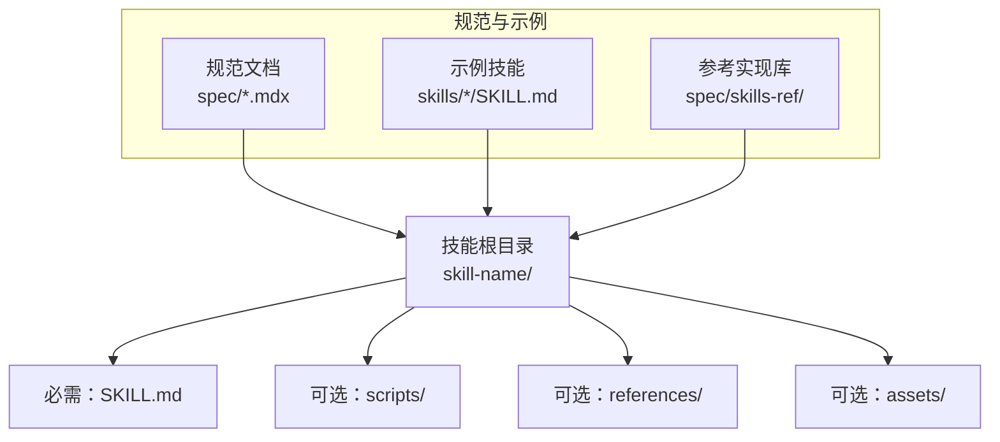
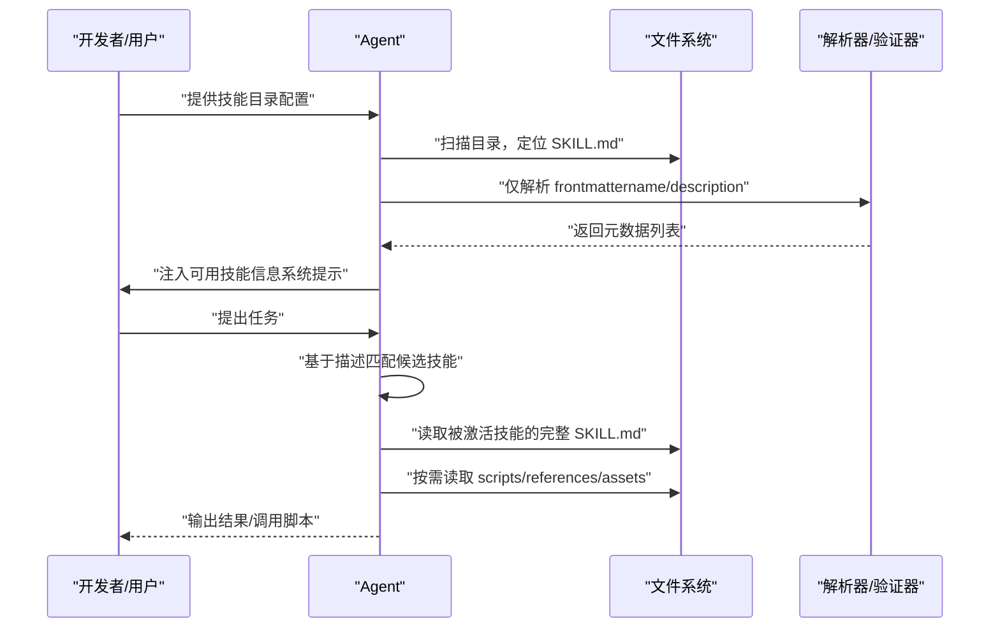
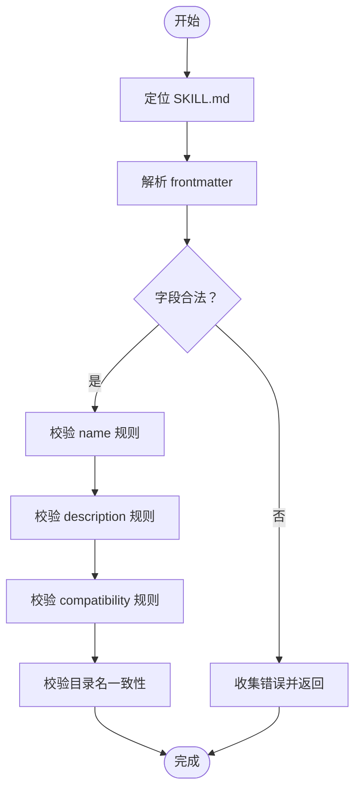
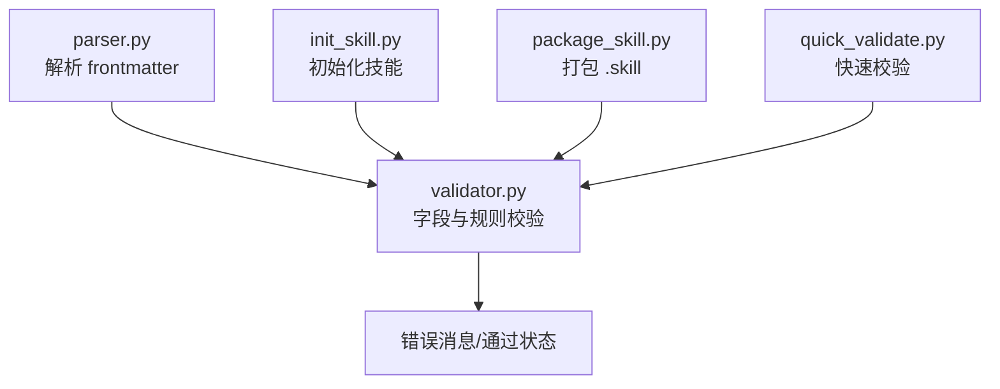

# Agent Skills 规范

<cite>
**本文引用的文件**
- [README.md](file://README.md)
- [agent-skills-spec.mdx](file://spec/agent-skills-spec.mdx)
- [skill-authoring.mdx](file://spec/skill-authoring.mdx)
- [skill-client-integration.mdx](file://spec/skill-client-integration.mdx)
- [SKILL.md（模板）](file://template/SKILL.md)
- [SKILL.md（DOCX 技能）](file://skills/docx/SKILL.md)
- [SKILL.md（PDF 技能）](file://skills/pdf/SKILL.md)
- [SKILL.md（PPTX 技能）](file://skills/pptx/SKILL.md)
- [SKILL.md（Prompt 优化器）](file://skills/prompt-optimizer/SKILL.md)
- [SKILL.md（同步技能）](file://skills/sync-skills/SKILL.md)
- [parser.py](file://spec/skills-ref/src/skills_ref/parser.py)
- [validator.py](file://spec/skills-ref/src/skills_ref/validator.py)
- [init_skill.py](file://skills/skill-creator/scripts/init_skill.py)
- [package_skill.py](file://skills/skill-creator/scripts/package_skill.py)
- [quick_validate.py](file://skills/skill-creator/scripts/quick_validate.py)
</cite>

## 目录
1. [简介](#简介)
2. [项目结构](#项目结构)
3. [核心组件](#核心组件)
4. [架构总览](#架构总览)
5. [详细组件分析](#详细组件分析)
6. [依赖关系分析](#依赖关系分析)
7. [性能考量](#性能考量)
8. [故障排查指南](#故障排查指南)
9. [结论](#结论)
10. [附录](#附录)

## 简介
本文件系统化梳理 Agent Skills 规范，面向技能作者与集成开发者，提供从目录结构、SKILL.md 前言元数据（frontmatter）格式、字段约束与验证规则，到可选目录（scripts/、references/、assets/）组织与渐进式披露机制的完整参考。同时给出实现指导、最佳实践与常见问题排查建议，帮助你构建高质量、可移植、可扩展的 Agent Skills。

## 项目结构
Agent Skills 的最小单元是一个包含 SKILL.md 的目录。仓库提供了规范文档、示例技能与参考实现库，便于理解与落地。

图表来源
- [agent-skills-spec.mdx](file://spec/agent-skills-spec.mdx#L8-L19)
- [skill-authoring.mdx](file://spec/skill-authoring.mdx#L8-L14)

章节来源
- [agent-skills-spec.mdx](file://spec/agent-skills-spec.mdx#L8-L19)
- [skill-authoring.mdx](file://spec/skill-authoring.mdx#L8-L14)

## 核心组件
- 目录结构与最小要求
  - 必需：技能根目录下存在 SKILL.md（大小写不敏感，优先匹配大写）
  - 可选：scripts/（可执行脚本）、references/（参考文档）、assets/（静态资源）
- SKILL.md 文件
  - 必须包含 YAML frontmatter（以三破折号包裹）与 Markdown 主体内容
  - frontmatter 至少包含 name 与 description
  - 其他可选字段：license、compatibility、metadata、allowed-tools
- 渐进式披露
  - 启动时仅加载 name 与 description
  - 激活时加载完整 SKILL.md
  - 按需加载 scripts/、references/、assets/ 中的资源

章节来源
- [agent-skills-spec.mdx](file://spec/agent-skills-spec.mdx#L10-L15)
- [agent-skills-spec.mdx](file://spec/agent-skills-spec.mdx#L21-L32)
- [agent-skills-spec.mdx](file://spec/agent-skills-spec.mdx#L170-L196)
- [agent-skills-spec.mdx](file://spec/agent-skills-spec.mdx#L197-L206)
- [skill-client-integration.mdx](file://spec/skill-client-integration.mdx#L18-L26)

## 架构总览
Agent 与技能交互遵循“发现—匹配—激活—执行”的流程，前端元数据用于快速筛选，完整指令按需加载，资源按需访问。

图表来源
- [skill-client-integration.mdx](file://spec/skill-client-integration.mdx#L19-L26)
- [parser.py](file://spec/skills-ref/src/skills_ref/parser.py#L12-L27)
- [validator.py](file://spec/skills-ref/src/skills_ref/validator.py#L150-L177)

## 详细组件分析

### SKILL.md 前言元数据（frontmatter）规范
- 必填字段
  - name：技能唯一标识符，长度 1–64，仅小写字母、数字与连字符，不可以连字符开头或结尾，不可包含连续连字符，且必须与父目录名一致
  - description：技能用途与触发场景说明，长度 1–1024，建议包含关键词以便识别
- 选填字段
  - license：许可证说明或指向本地 LICENSE.txt
  - compatibility：环境要求（产品、系统包、网络等），最大 500 字符
  - metadata：任意键值对，客户端可扩展存储
  - allowed-tools：预批准工具清单（空格分隔），实验特性
- 示例与模板
  - 参考模板 SKILL.md 的 frontmatter 结构与注释指引
  - 示例技能（PDF、DOCX、PPTX、Prompt 优化器）展示了不同领域的 frontmatter 用法

章节来源
- [agent-skills-spec.mdx](file://spec/agent-skills-spec.mdx#L47-L54)
- [agent-skills-spec.mdx](file://spec/agent-skills-spec.mdx#L56-L86)
- [agent-skills-spec.mdx](file://spec/agent-skills-spec.mdx#L87-L103)
- [agent-skills-spec.mdx](file://spec/agent-skills-spec.mdx#L104-L132)
- [agent-skills-spec.mdx](file://spec/agent-skills-spec.mdx#L134-L147)
- [agent-skills-spec.mdx](file://spec/agent-skills-spec.mdx#L148-L158)
- [SKILL.md（模板）](file://template/SKILL.md#L1-L10)
- [SKILL.md（PDF 技能）](file://skills/pdf/SKILL.md#L1-L5)
- [SKILL.md（DOCX 技能）](file://skills/docx/SKILL.md#L1-L5)
- [SKILL.md（PPTX 技能）](file://skills/pptx/SKILL.md#L1-L5)
- [SKILL.md（Prompt 优化器）](file://skills/prompt-optimizer/SKILL.md#L1-L6)

### 字段验证规则与实现要点
- 解析与读取
  - 支持 SKILL.md（大写）或 skill.md（小写）；未找到时报错
  - frontmatter 必须以三破折号包裹，且闭合完整
  - metadata 中的嵌套键值会被规范化为字符串
- 核心校验
  - name：非空字符串、长度限制、字符集与连字符规则、必须与目录名一致
  - description：非空字符串、长度限制
  - compatibility：若提供，长度不超过 500
  - 允许字段：name、description、license、allowed-tools、metadata、compatibility
- 参考实现
  - 解析器负责定位 SKILL.md 并提取 frontmatter
  - 验证器负责执行上述规则并返回错误列表

图表来源
- [parser.py](file://spec/skills-ref/src/skills_ref/parser.py#L12-L27)
- [parser.py](file://spec/skills-ref/src/skills_ref/parser.py#L30-L64)
- [validator.py](file://spec/skills-ref/src/skills_ref/validator.py#L25-L67)
- [validator.py](file://spec/skills-ref/src/skills_ref/validator.py#L70-L84)
- [validator.py](file://spec/skills-ref/src/skills_ref/validator.py#L87-L101)
- [validator.py](file://spec/skills-ref/src/skills_ref/validator.py#L118-L147)

章节来源
- [parser.py](file://spec/skills-ref/src/skills_ref/parser.py#L12-L27)
- [parser.py](file://spec/skills-ref/src/skills_ref/parser.py#L30-L64)
- [validator.py](file://spec/skills-ref/src/skills_ref/validator.py#L25-L67)
- [validator.py](file://spec/skills-ref/src/skills_ref/validator.py#L70-L84)
- [validator.py](file://spec/skills-ref/src/skills_ref/validator.py#L87-L101)
- [validator.py](file://spec/skills-ref/src/skills_ref/validator.py#L118-L147)

### 可选目录结构与资源组织
- scripts/
  - 可执行代码（Python、Bash、JavaScript 等），应自包含或清晰标注依赖
  - 提供错误信息与边界情况处理
- references/
  - 详细参考文档（如 API 文档、规范、表单模板、领域知识）
  - 建议单文件聚焦，按需加载，减少上下文占用
- assets/
  - 静态资源（模板、图片、数据文件、字体等）
  - 不直接加载入上下文，而是作为产物或中间文件使用

章节来源
- [agent-skills-spec.mdx](file://spec/agent-skills-spec.mdx#L172-L179)
- [agent-skills-spec.mdx](file://spec/agent-skills-spec.mdx#L181-L188)
- [agent-skills-spec.mdx](file://spec/agent-skills-spec.mdx#L190-L196)

### 渐进式披露机制
- 元数据（约 100 token）：启动时仅加载 name 与 description
- 指令（建议 <5000 token）：激活时加载完整 SKILL.md
- 资源（按需）：scripts/、references/、assets/ 在需要时才读取
- 建议主 SKILL.md 控制在 500 行以内，将详细内容拆分到 references/ 下的独立文件

章节来源
- [agent-skills-spec.mdx](file://spec/agent-skills-spec.mdx#L197-L206)

### 文件引用与路径约定
- 引用其他文件使用相对路径，从技能根目录出发
- 建议引用链保持一层深度，避免深层嵌套

章节来源
- [agent-skills-spec.mdx](file://spec/agent-skills-spec.mdx#L207-L218)

### 示例技能中的实践
- PDF 技能：展示 Python 库与命令行工具的组合使用，提供快速参考表格与下一步指引
- DOCX 技能：强调“必须全文阅读参考文件”的渐进式披露原则，提供多条工作流与脚本调用
- PPTX 技能：涵盖文本提取、原始 XML 访问、HTML→PPTX 流程、OOXML 编辑与模板复用
- Prompt 优化器：通过框架索引与选择矩阵，指导用户进行结构化提示工程
- 同步技能：演示跨工具目录的自动同步策略与冲突覆盖策略

章节来源
- [SKILL.md（PDF 技能）](file://skills/pdf/SKILL.md#L1-L295)
- [SKILL.md（DOCX 技能）](file://skills/docx/SKILL.md#L1-L197)
- [SKILL.md（PPTX 技能）](file://skills/pptx/SKILL.md#L1-L484)
- [SKILL.md（Prompt 优化器）](file://skills/prompt-optimizer/SKILL.md#L1-L139)
- [SKILL.md（同步技能）](file://skills/sync-skills/SKILL.md#L1-L305)

### 规范与实现工具链
- 规范文档
  - 完整格式规范与字段约束
  - 技能创作与客户端集成指南
- 参考实现库（skills-ref）
  - 解析：定位 SKILL.md、提取 frontmatter
  - 验证：执行字段合法性与命名规则检查
- 脚手架与打包工具
  - 初始化：根据模板创建新技能目录与示例资源
  - 打包：将技能目录压缩为 .skill 文件（zip）
  - 快速验证：基础正则与 YAML 校验

章节来源
- [agent-skills-spec.mdx](file://spec/agent-skills-spec.mdx#L220-L229)
- [parser.py](file://spec/skills-ref/src/skills_ref/parser.py#L67-L112)
- [validator.py](file://spec/skills-ref/src/skills_ref/validator.py#L150-L177)
- [init_skill.py](file://skills/skill-creator/scripts/init_skill.py#L194-L270)
- [package_skill.py](file://skills/skill-creator/scripts/package_skill.py#L19-L82)
- [quick_validate.py](file://skills/skill-creator/scripts/quick_validate.py#L12-L86)

## 依赖关系分析
- 组件耦合
  - 解析器与验证器紧密协作：解析器负责读取与初步结构校验，验证器负责业务规则与约束
  - 脚手架与打包工具依赖验证器进行前置校验
- 外部依赖
  - YAML 解析库（strictyaml、PyYAML）
  - 文件系统操作（路径解析、zip 打包）

图表来源
- [parser.py](file://spec/skills-ref/src/skills_ref/parser.py#L67-L112)
- [validator.py](file://spec/skills-ref/src/skills_ref/validator.py#L150-L177)
- [init_skill.py](file://skills/skill-creator/scripts/init_skill.py#L194-L270)
- [package_skill.py](file://skills/skill-creator/scripts/package_skill.py#L19-L82)
- [quick_validate.py](file://skills/skill-creator/scripts/quick_validate.py#L12-L86)

## 性能考量
- 上下文控制
  - 将长篇内容放入 references/，保持 SKILL.md 精炼
  - 严格遵守渐进式披露，避免一次性加载过多内容
- 资源访问
  - scripts/、references/、assets/ 按需读取，减少不必要的 IO
- 字段长度限制
  - name（64）、description（1024）、compatibility（500）等上限有助于控制上下文开销

章节来源
- [agent-skills-spec.mdx](file://spec/agent-skills-spec.mdx#L197-L206)
- [validator.py](file://spec/skills-ref/src/skills_ref/validator.py#L10-L12)

## 故障排查指南
- 常见问题与修复
  - 缺失 SKILL.md：确认大小写与路径
  - frontmatter 缺失或格式错误：确保以三破折号包裹并闭合
  - name 不符合命名规则：仅允许小写字母、数字与连字符，不可连续连字符，不可首尾为连字符
  - description 过长或包含非法字符：控制长度并在必要时移除特殊字符
  - compatibility 超长：精简描述，突出关键环境需求
  - 目录名不匹配：确保父目录名与 name 一致
- 工具辅助
  - 使用参考实现库的 validate 命令进行批量校验
  - 使用快速验证脚本进行本地快速检查
  - 使用打包工具在发布前统一校验

章节来源
- [agent-skills-spec.mdx](file://spec/agent-skills-spec.mdx#L220-L229)
- [validator.py](file://spec/skills-ref/src/skills_ref/validator.py#L150-L177)
- [quick_validate.py](file://skills/skill-creator/scripts/quick_validate.py#L12-L86)
- [package_skill.py](file://skills/skill-creator/scripts/package_skill.py#L47-L54)

## 结论
Agent Skills 规范以极简而强大的方式定义了技能的结构与元数据，辅以渐进式披露与可选资源目录，既保证了 Agent 的响应速度，又提供了足够的扩展空间。通过参考实现库与脚手架工具，作者可以高效地创建、验证与分发高质量技能，满足从创意设计到企业工作流的广泛场景。

## 附录

### 字段对照表
- name：必填，长度 1–64，小写字母、数字、连字符，不可连续连字符，不可首尾为连字符，必须与目录名一致
- description：必填，长度 1–1024，描述技能做什么以及何时使用
- license：选填，许可证说明或指向本地 LICENSE.txt
- compatibility：选填，环境要求说明，最大 500 字符
- metadata：选填，任意键值对
- allowed-tools：选填，预批准工具清单（空格分隔）

章节来源
- [agent-skills-spec.mdx](file://spec/agent-skills-spec.mdx#L47-L54)
- [agent-skills-spec.mdx](file://spec/agent-skills-spec.mdx#L56-L86)
- [agent-skills-spec.mdx](file://spec/agent-skills-spec.mdx#L87-L103)
- [agent-skills-spec.mdx](file://spec/agent-skills-spec.mdx#L104-L132)
- [agent-skills-spec.mdx](file://spec/agent-skills-spec.mdx#L134-L147)
- [agent-skills-spec.mdx](file://spec/agent-skills-spec.mdx#L148-L158)

### 目录与文件组织最佳实践
- 目录命名：使用 hyphen-case（小写、连字符），与 name 保持一致
- SKILL.md：保持简洁，复杂细节放入 references/；必要时在 references/ 中建立子目录
- scripts/：每个脚本职责单一，提供清晰错误提示
- assets/：仅存放最终产物或模板，避免将长文档放入此处
- 引用路径：一律使用相对路径，避免深层嵌套

章节来源
- [agent-skills-spec.mdx](file://spec/agent-skills-spec.mdx#L170-L196)
- [agent-skills-spec.mdx](file://spec/agent-skills-spec.mdx#L207-L218)