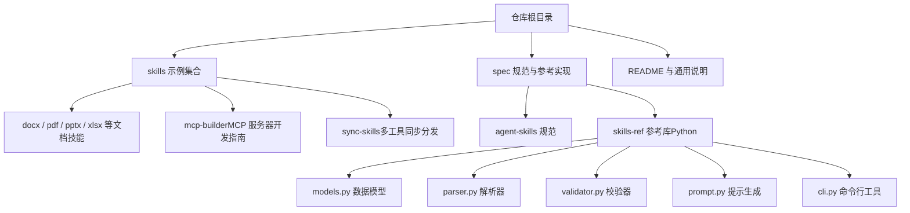
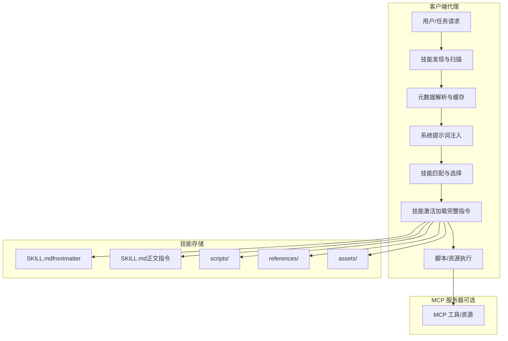
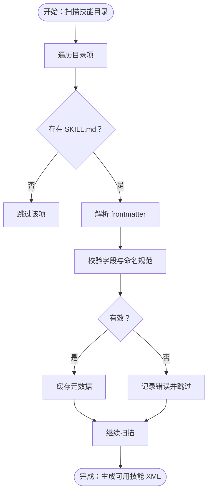
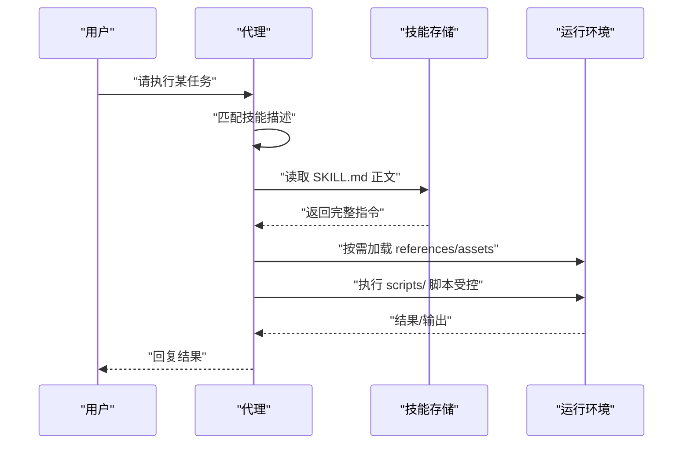
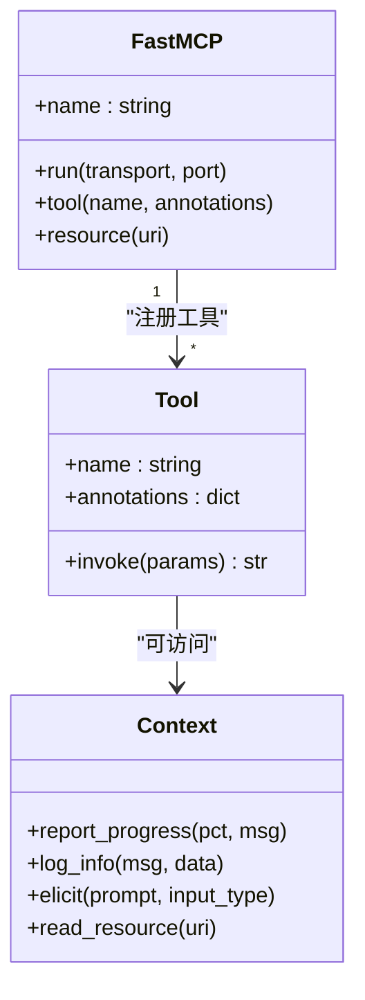
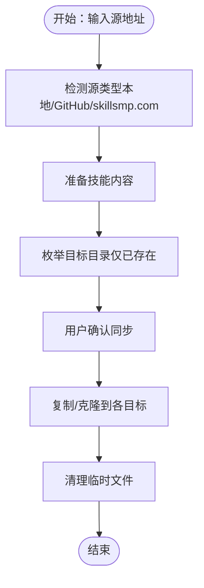
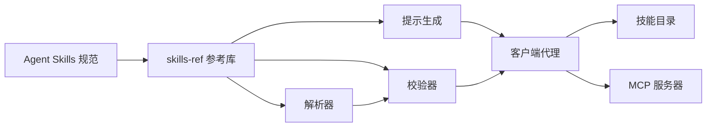

# 客户端集成

<cite>
**本文引用的文件**
- [README.md](file://README.md)
- [skill-client-integration.mdx](file://spec/skill-client-integration.mdx)
- [agent-skills-spec.mdx](file://spec/agent-skills-spec.mdx)
- [skill-authoring.mdx](file://spec/skill-authoring.mdx)
- [models.py](file://spec/skills-ref/src/skills_ref/models.py)
- [parser.py](file://spec/skills-ref/src/skills_ref/parser.py)
- [validator.py](file://spec/skills-ref/src/skills_ref/validator.py)
- [prompt.py](file://spec/skills-ref/src/skills_ref/prompt.py)
- [cli.py](file://spec/skills-ref/src/skills_ref/cli.py)
- [python_mcp_server.md](file://skills/mcp-builder/reference/python_mcp_server.md)
- [SKILL.md（PDF 技能）](file://skills/pdf/SKILL.md)
- [SKILL.md（DOCX 技能）](file://skills/docx/SKILL.md)
- [SKILL.md（MCP 构建器技能）](file://skills/mcp-builder/SKILL.md)
- [SKILL.md（同步技能）](file://skills/sync-skills/SKILL.md)
</cite>

## 目录
1. [简介](#简介)
2. [项目结构](#项目结构)
3. [核心组件](#核心组件)
4. [架构总览](#架构总览)
5. [详细组件分析](#详细组件分析)
6. [依赖关系分析](#依赖关系分析)
7. [性能考量](#性能考量)
8. [故障排除指南](#故障排除指南)
9. [结论](#结论)
10. [附录](#附录)

## 简介
本文件面向需要在不同客户端环境中集成“技能系统”的开发者与产品团队，目标是帮助你在工具/代理中无缝接入 Agent Skills 格式技能，并可选地支持 MCP 协议以扩展外部服务交互能力。内容覆盖技能发现、元数据加载、技能匹配与激活、脚本执行与资源访问、错误处理策略、以及 Claude API 的使用方式与最佳实践。

## 项目结构
该仓库包含三类关键内容：
- skills 示例：展示如何编写符合规范的技能，涵盖文档处理、PDF 处理、MCP 构建、同步分发等场景。
- spec 规范与参考实现：定义 Agent Skills 的格式规范、元数据模型、解析与校验逻辑、以及生成可用技能 XML 的 CLI 工具。
- README：提供整体背景、使用入口与示例技能概览。

**图表来源**
- [README.md](file://README.md#L1-L95)
- [agent-skills-spec.mdx](file://spec/agent-skills-spec.mdx#L1-L229)
- [skill-client-integration.mdx](file://spec/skill-client-integration.mdx#L1-L100)

**章节来源**
- [README.md](file://README.md#L1-L95)
- [agent-skills-spec.mdx](file://spec/agent-skills-spec.mdx#L1-L229)
- [skill-client-integration.mdx](file://spec/skill-client-integration.mdx#L1-L100)

## 核心组件
- 技能规范与元数据模型
  - 规范定义了技能目录结构、SKILL.md 的 YAML frontmatter 字段、可选目录（scripts/references/assets）、渐进披露策略与文件引用规则。
  - 参考库提供了 Python 模型、解析器、校验器与提示生成工具，便于在客户端中快速实现兼容能力。
- 技能发现与元数据注入
  - 客户端应在启动时扫描配置目录，仅解析 SKILL.md 的 frontmatter 获取 name/description 等元数据，避免一次性加载全部指令文本。
  - 将可用技能列表以 XML 形式注入到系统提示词中，推荐使用 <available_skills> 结构，包含 name、description、location 等字段。
- MCP 协议支持
  - MCP 为模型上下文协议，允许通过工具与资源暴露外部服务。参考 Python 实现指南，包含服务器初始化、工具注册、输入验证、响应格式、错误处理、资源与生命周期管理等最佳实践。
- 脚本执行与安全
  - 在文件系统代理中，可通过 shell 命令访问脚本与资源；在工具代理中，需自行实现工具接口。务必进行沙箱、白名单、确认与审计日志等安全措施。

**章节来源**
- [agent-skills-spec.mdx](file://spec/agent-skills-spec.mdx#L1-L229)
- [skill-client-integration.mdx](file://spec/skill-client-integration.mdx#L17-L100)
- [models.py](file://spec/skills-ref/src/skills_ref/models.py#L1-L40)
- [parser.py](file://spec/skills-ref/src/skills_ref/parser.py#L1-L113)
- [validator.py](file://spec/skills-ref/src/skills_ref/validator.py#L1-L178)
- [prompt.py](file://spec/skills-ref/src/skills_ref/prompt.py#L1-L59)
- [python_mcp_server.md](file://skills/mcp-builder/reference/python_mcp_server.md#L1-L719)

## 架构总览
下图展示了从“技能发现”到“激活与执行”的端到端流程，以及 MCP 服务器在其中的角色。

**图表来源**
- [skill-client-integration.mdx](file://spec/skill-client-integration.mdx#L17-L100)
- [agent-skills-spec.mdx](file://spec/agent-skills-spec.mdx#L170-L229)
- [python_mcp_server.md](file://skills/mcp-builder/reference/python_mcp_server.md#L1-L719)

## 详细组件分析

### 组件一：技能发现与元数据加载
- 发现机制
  - 扫描配置目录，识别每个子目录是否包含 SKILL.md 或 skill.md（大小写不敏感），并确保父目录名与 name 字段一致。
- 元数据解析
  - 仅读取 frontmatter，提取 name、description、license、compatibility、allowed-tools、metadata 等字段。
- 注入提示词
  - 使用 <available_skills> XML 结构将技能清单注入系统提示词，包含 name、description、location（文件系统代理建议绝对路径）。

**图表来源**
- [parser.py](file://spec/skills-ref/src/skills_ref/parser.py#L12-L113)
- [validator.py](file://spec/skills-ref/src/skills_ref/validator.py#L150-L178)
- [prompt.py](file://spec/skills-ref/src/skills_ref/prompt.py#L9-L59)

**章节来源**
- [skill-client-integration.mdx](file://spec/skill-client-integration.mdx#L27-L73)
- [agent-skills-spec.mdx](file://spec/agent-skills-spec.mdx#L21-L168)
- [parser.py](file://spec/skills-ref/src/skills_ref/parser.py#L12-L113)
- [validator.py](file://spec/skills-ref/src/skills_ref/validator.py#L150-L178)
- [prompt.py](file://spec/skills-ref/src/skills_ref/prompt.py#L9-L59)

### 组件二：技能激活与执行
- 激活流程
  - 当任务与某个技能描述匹配时，加载该技能的完整 SKILL.md 正文到上下文。
  - 按需加载 references/ 与 assets/ 中的静态资源；scripts/ 中的脚本在受控环境下执行。
- 渐进披露
  - 元数据（~100 token）+ 指令（建议 <5000 token）+ 按需资源，控制上下文开销。

**图表来源**
- [agent-skills-spec.mdx](file://spec/agent-skills-spec.mdx#L197-L206)
- [SKILL.md（PDF 技能）](file://skills/pdf/SKILL.md#L1-L295)
- [SKILL.md（DOCX 技能）](file://skills/docx/SKILL.md#L1-L197)

**章节来源**
- [agent-skills-spec.mdx](file://spec/agent-skills-spec.mdx#L197-L206)
- [SKILL.md（PDF 技能）](file://skills/pdf/SKILL.md#L1-L295)
- [SKILL.md（DOCX 技能）](file://skills/docx/SKILL.md#L1-L197)

### 组件三：MCP 协议支持（可选）
- 适用场景
  - 需要通过工具/资源与外部服务交互，如 API 查询、数据导出、模板渲染等。
- 关键点
  - 服务器命名、工具注册、输入验证（Pydantic/Zod）、响应格式（Markdown/JSON）、错误处理、资源与生命周期管理、传输方式（stdio/streamable_http）。
  - 可使用上下文参数进行进度上报、日志与用户交互。

**图表来源**
- [python_mcp_server.md](file://skills/mcp-builder/reference/python_mcp_server.md#L1-L719)

**章节来源**
- [python_mcp_server.md](file://skills/mcp-builder/reference/python_mcp_server.md#L1-L719)
- [SKILL.md（MCP 构建器技能）](file://skills/mcp-builder/SKILL.md#L1-L237)

### 组件四：同步与分发（多客户端）
- 场景
  - 将技能从本地或远程源同步到多个 AI 编辑器的技能目录，支持本地路径、GitHub 仓库、skillsmp.com 页面。
- 流程
  - 自动检测源类型、准备内容、列出已存在的目标目录、用户确认后复制/克隆、清理临时文件。

**图表来源**
- [SKILL.md（同步技能）](file://skills/sync-skills/SKILL.md#L1-L305)

**章节来源**
- [SKILL.md（同步技能）](file://skills/sync-skills/SKILL.md#L1-L305)

## 依赖关系分析
- 规范与参考库
  - skills-ref 提供解析、校验、提示生成与 CLI，是实现 Agent Skills 兼容性的核心依赖。
- 技能与脚本
  - 技能内部可依赖 scripts/ 中的脚本语言（如 Python/Bash/JS），但客户端应限制执行范围并加强安全。
- MCP 与外部服务
  - MCP 服务器通过工具/资源对接外部 API，需关注网络、认证与速率限制。

**图表来源**
- [agent-skills-spec.mdx](file://spec/agent-skills-spec.mdx#L1-L229)
- [models.py](file://spec/skills-ref/src/skills_ref/models.py#L1-L40)
- [parser.py](file://spec/skills-ref/src/skills_ref/parser.py#L1-L113)
- [validator.py](file://spec/skills-ref/src/skills_ref/validator.py#L1-L178)
- [prompt.py](file://spec/skills-ref/src/skills_ref/prompt.py#L1-L59)

**章节来源**
- [agent-skills-spec.mdx](file://spec/agent-skills-spec.mdx#L1-L229)
- [models.py](file://spec/skills-ref/src/skills_ref/models.py#L1-L40)
- [parser.py](file://spec/skills-ref/src/skills_ref/parser.py#L1-L113)
- [validator.py](file://spec/skills-ref/src/skills_ref/validator.py#L1-L178)
- [prompt.py](file://spec/skills-ref/src/skills_ref/prompt.py#L1-L59)

## 性能考量
- 上下文控制
  - 采用渐进披露：仅在激活时加载 SKILL.md 正文；references/assets 按需加载；避免一次性加载大量内容。
- 元数据体积
  - 每个技能元数据约 50–100 token，建议保持 description 精炼且包含关键词以便匹配。
- I/O 优化
  - 将频繁使用的资源放入 assets/ 并在首次访问时缓存；对大型脚本采用增量执行与结果复用。
- MCP 传输
  - 远程场景优先考虑 streamable_http；本地场景可使用 stdio，减少连接开销。

[本节为通用指导，无需具体文件引用]

## 故障排除指南
- 常见问题
  - SKILL.md 缺失或 frontmatter 不规范：检查 YAML 开头与闭合、字段类型与长度限制。
  - 名称非法：name 必须为小写、不含连续连字符、与父目录一致。
  - 描述过长或为空：确保在 1–1024 字符范围内。
  - 兼容性字段超限：compatibility 最大 500 字符。
- 安全风险
  - 脚本执行：建议沙箱化、白名单、用户确认、审计日志。
  - 资源访问：限制路径与权限，避免越权读取。
- MCP 错误处理
  - 对网络异常、鉴权失败、速率限制等进行明确提示；统一错误格式，便于代理层处理。
- 同步问题
  - 目标目录不存在：先安装对应工具再同步；确认覆盖策略与临时文件清理。

**章节来源**
- [validator.py](file://spec/skills-ref/src/skills_ref/validator.py#L25-L147)
- [skill-client-integration.mdx](file://spec/skill-client-integration.mdx#L74-L82)
- [python_mcp_server.md](file://skills/mcp-builder/reference/python_mcp_server.md#L207-L226)
- [SKILL.md（同步技能）](file://skills/sync-skills/SKILL.md#L283-L305)

## 结论
通过遵循 Agent Skills 规范与 skills-ref 参考库，客户端可以高效实现技能发现、元数据注入、技能匹配与激活，并在需要时扩展 MCP 协议以对接外部服务。结合渐进披露与安全策略，可在保证性能的同时提升代理的可扩展性与可控性。

[本节为总结性内容，无需具体文件引用]

## 附录

### A. 集成步骤速查
- 文件系统代理
  - 扫描目录 → 仅解析 frontmatter → 注入 <available_skills> → 匹配后加载 SKILL.md → 执行 scripts/ 与访问 assets/references。
- 工具代理
  - 实现工具接口 → 读取 frontmatter → 注入提示词 → 按需加载资源 → 执行脚本（受控）。
- MCP 集成
  - 初始化服务器 → 工具注册与输入验证 → 错误处理与资源管理 → 传输方式选择。

**章节来源**
- [skill-client-integration.mdx](file://spec/skill-client-integration.mdx#L9-L26)
- [agent-skills-spec.mdx](file://spec/agent-skills-spec.mdx#L170-L206)
- [python_mcp_server.md](file://skills/mcp-builder/reference/python_mcp_server.md#L1-L719)

### B. 示例技能参考
- PDF 技能：涵盖文本/表格提取、合并拆分、表单填充、命令行工具等。
- DOCX 技能：文档创建、编辑、审阅跟踪、图像转换等。
- MCP 构建器技能：MCP 服务器设计与实现流程、质量检查清单与评估方法。
- 同步技能：多工具目录同步、源类型检测与覆盖策略。

**章节来源**
- [SKILL.md（PDF 技能）](file://skills/pdf/SKILL.md#L1-L295)
- [SKILL.md（DOCX 技能）](file://skills/docx/SKILL.md#L1-L197)
- [SKILL.md（MCP 构建器技能）](file://skills/mcp-builder/SKILL.md#L1-L237)
- [SKILL.md（同步技能）](file://skills/sync-skills/SKILL.md#L1-L305)