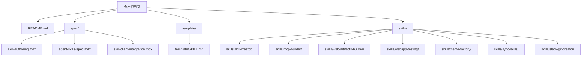
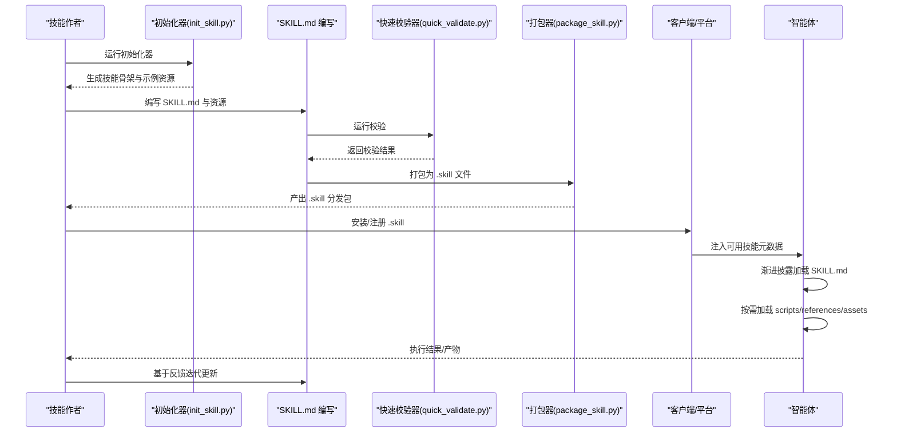
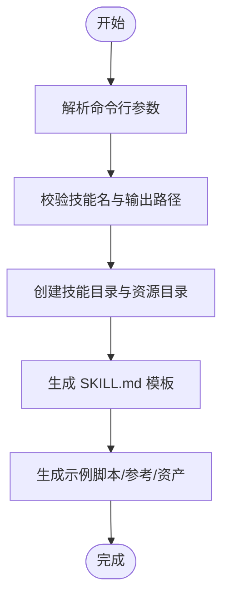
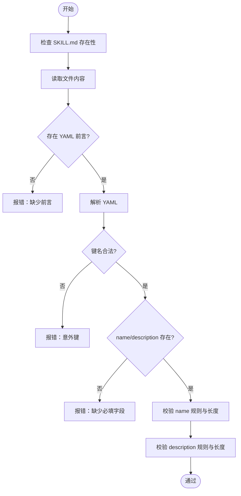
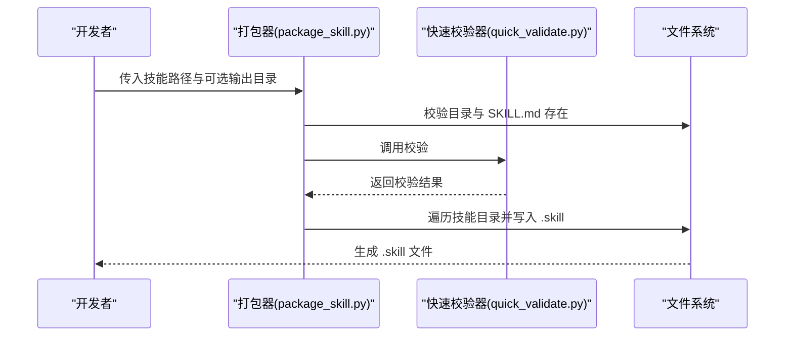
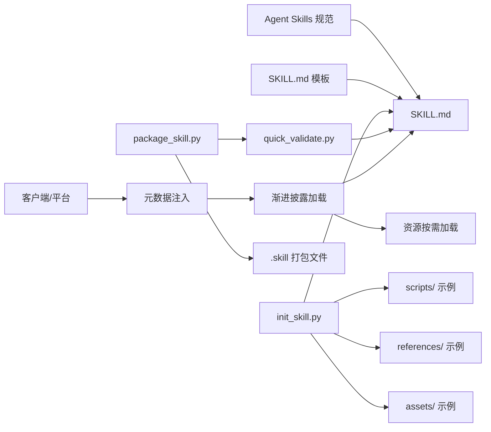

# 技能作者指南

<cite>
**本文引用的文件**
- [README.md](file://README.md)
- [template/SKILL.md](file://template/SKILL.md)
- [spec/skill-authoring.mdx](file://spec/skill-authoring.mdx)
- [spec/agent-skills-spec.mdx](file://spec/agent-skills-spec.mdx)
- [spec/skill-client-integration.mdx](file://spec/skill-client-integration.mdx)
- [skills/skill-creator/SKILL.md](file://skills/skill-creator/SKILL.md)
- [skills/skill-creator/scripts/init_skill.py](file://skills/skill-creator/scripts/init_skill.py)
- [skills/skill-creator/scripts/package_skill.py](file://skills/skill-creator/scripts/package_skill.py)
- [skills/skill-creator/scripts/quick_validate.py](file://skills/skill-creator/scripts/quick_validate.py)
- [skills/mcp-builder/SKILL.md](file://skills/mcp-builder/SKILL.md)
- [skills/web-artifacts-builder/SKILL.md](file://skills/web-artifacts-builder/SKILL.md)
- [skills/webapp-testing/SKILL.md](file://skills/webapp-testing/SKILL.md)
- [skills/theme-factory/SKILL.md](file://skills/theme-factory/SKILL.md)
- [skills/sync-skills/SKILL.md](file://skills/sync-skills/SKILL.md)
- [skills/slack-gif-creator/SKILL.md](file://skills/slack-gif-creator/SKILL.md)
</cite>

## 目录
1. [简介](#简介)
2. [项目结构](#项目结构)
3. [核心组件](#核心组件)
4. [架构总览](#架构总览)
5. [详细组件分析](#详细组件分析)
6. [依赖关系分析](#依赖关系分析)
7. [性能考量](#性能考量)
8. [故障排查指南](#故障排查指南)
9. [结论](#结论)
10. [附录](#附录)

## 简介
本指南面向技能作者，系统讲解如何基于仓库中的现有技能与规范，从零开始创建高质量的 Agent Skills，并覆盖工作流程、最佳实践、调试策略、测试方法与部署打包等全流程。读者将学会如何编写规范的 SKILL.md、组织技能结构、进行质量保证与迭代优化，并掌握样例技能中的工程化实践。

## 项目结构
仓库采用按技能分目录的组织方式，每个技能是一个独立文件夹，包含一个必需的 SKILL.md 以及可选的 scripts/、references/、assets/ 等资源目录。顶层 README 提供了使用说明与示例技能概览，spec 目录提供了技能规范与客户端集成指南，template 目录提供 SKILL.md 模板。

图表来源
- [README.md](file://README.md#L1-L95)
- [spec/skill-authoring.mdx](file://spec/skill-authoring.mdx#L1-L72)
- [spec/agent-skills-spec.mdx](file://spec/agent-skills-spec.mdx#L1-L229)
- [spec/skill-client-integration.mdx](file://spec/skill-client-integration.mdx#L1-L100)
- [template/SKILL.md](file://template/SKILL.md#L1-L59)

章节来源
- [README.md](file://README.md#L1-L95)
- [spec/skill-authoring.mdx](file://spec/skill-authoring.mdx#L1-L72)

## 核心组件
- 规范与模板
  - SKILL.md 规范定义了元数据字段、正文内容、可选目录与渐进披露原则。
  - SKILL.md 模板提供中文版结构与写作指引，便于作者快速上手。
- 工具链
  - 初始化器：一键生成符合规范的技能骨架与示例资源。
  - 快速校验器：对 SKILL.md 元数据进行基础校验。
  - 打包器：将技能目录打包为 .skill 文件，便于分发。
- 示例技能
  - 技能创作者：系统化讲解技能设计原则、工作流与迭代方法。
  - MCP 构建器：面向模型上下文协议（MCP）服务器的开发指南。
  - Web 资产构建器：前端资产打包与展示流程。
  - Web 应用测试：Playwright 自动化测试与调试策略。
  - 主题工厂：为演示文稿等产物应用主题风格。
  - 同步技能：多工具间同步技能目录的自动化流程。
  - Slack 动图创建：面向 Slack 的 GIF 制作知识与工具集。

章节来源
- [spec/agent-skills-spec.mdx](file://spec/agent-skills-spec.mdx#L21-L229)
- [template/SKILL.md](file://template/SKILL.md#L1-L59)
- [skills/skill-creator/scripts/init_skill.py](file://skills/skill-creator/scripts/init_skill.py#L1-L304)
- [skills/skill-creator/scripts/quick_validate.py](file://skills/skill-creator/scripts/quick_validate.py#L1-L95)
- [skills/skill-creator/scripts/package_skill.py](file://skills/skill-creator/scripts/package_skill.py#L1-L111)
- [skills/skill-creator/SKILL.md](file://skills/skill-creator/SKILL.md#L1-L357)

## 架构总览
技能作者的工作流由“发现—激活—执行—反馈”构成，结合渐进披露机制，先加载元数据，再按需加载 SKILL.md 与资源文件，最后执行脚本或访问资产。

图表来源
- [skills/skill-creator/scripts/init_skill.py](file://skills/skill-creator/scripts/init_skill.py#L1-L304)
- [skills/skill-creator/scripts/quick_validate.py](file://skills/skill-creator/scripts/quick_validate.py#L1-L95)
- [skills/skill-creator/scripts/package_skill.py](file://skills/skill-creator/scripts/package_skill.py#L1-L111)
- [spec/skill-client-integration.mdx](file://spec/skill-client-integration.mdx#L17-L72)

章节来源
- [spec/skill-client-integration.mdx](file://spec/skill-client-integration.mdx#L17-L72)

## 详细组件分析

### 组件一：SKILL.md 规范与模板
- 规范要点
  - 元数据：name、description 为必填；可选 license、metadata、compatibility、allowed-tools。
  - 结构建议：步骤、示例、边界条件；正文无严格格式限制，但推荐清晰分段。
  - 渐进披露：元数据常驻，SKILL.md 激活后加载，资源按需加载。
- 模板使用
  - 中文模板提供“概览、何时使用、工作流、资源与目录指南、最佳实践、依赖项”等结构化框架，帮助作者聚焦核心信息与触发条件。

章节来源
- [spec/agent-skills-spec.mdx](file://spec/agent-skills-spec.mdx#L21-L229)
- [template/SKILL.md](file://template/SKILL.md#L1-L59)

### 组件二：技能初始化器（init_skill.py）
- 功能
  - 创建技能目录与标准文件结构（SKILL.md、scripts/、references/、assets/）。
  - 生成示例脚本、参考文档与占位资产，便于快速填充。
- 使用建议
  - 初始化后立即完善 SKILL.md 的元数据与正文，删除不需要的示例文件。
  - 将复杂逻辑下沉到 scripts/，正文保持简洁导航。

图表来源
- [skills/skill-creator/scripts/init_skill.py](file://skills/skill-creator/scripts/init_skill.py#L194-L270)

章节来源
- [skills/skill-creator/scripts/init_skill.py](file://skills/skill-creator/scripts/init_skill.py#L1-L304)

### 组件三：快速校验器（quick_validate.py）
- 校验内容
  - 检查 SKILL.md 是否存在、是否包含 YAML 前言、前言键值是否合法。
  - 校验 name 与 description 的命名规则与长度限制。
- 输出
  - 成功返回“技能有效”，失败返回具体错误原因，便于修复。

图表来源
- [skills/skill-creator/scripts/quick_validate.py](file://skills/skill-creator/scripts/quick_validate.py#L12-L86)

章节来源
- [skills/skill-creator/scripts/quick_validate.py](file://skills/skill-creator/scripts/quick_validate.py#L1-L95)

### 组件四：打包器（package_skill.py）
- 功能
  - 在打包前自动运行快速校验，确保目录结构与元数据合规。
  - 将技能目录压缩为 .skill 文件（zip），保留相对路径结构。
- 使用建议
  - 打包前务必通过校验；如需分发到特定目录，指定输出路径。

图表来源
- [skills/skill-creator/scripts/package_skill.py](file://skills/skill-creator/scripts/package_skill.py#L19-L82)

章节来源
- [skills/skill-creator/scripts/package_skill.py](file://skills/skill-creator/scripts/package_skill.py#L1-L111)

### 组件五：示例技能实践

#### 技能创作者（系统化工作流）
- 设计原则：简洁、自由度适配、渐进披露、资源分离。
- 工作流：理解需求→规划资源→初始化→编辑→打包→迭代。
- 资源组织：scripts/（可执行）、references/（参考文档）、assets/（输出资源）。

章节来源
- [skills/skill-creator/SKILL.md](file://skills/skill-creator/SKILL.md#L1-L357)

#### MCP 构建器（协议与质量）
- 四阶段：深度研究与规划→实现→复审与测试→创建评估。
- 质量要点：API 覆盖与工作流工具平衡、命名可发现性、上下文管理、可操作错误消息。
- 参考文件：协议文档、SDK 文档、语言实现指南、评估指南。

章节来源
- [skills/mcp-builder/SKILL.md](file://skills/mcp-builder/SKILL.md#L1-L237)

#### Web 资产构建器（前端产物）
- 流程：初始化项目→开发→打包为单文件 HTML→分享→可选测试。
- 技术栈：React + TypeScript + Vite + Parcel + Tailwind CSS + shadcn/ui。
- 注意事项：避免“AI 槽”风格，强调设计与风格指南。

章节来源
- [skills/web-artifacts-builder/SKILL.md](file://skills/web-artifacts-builder/SKILL.md#L1-L74)

#### Web 应用测试（Playwright 自动化）
- 决策树：静态 HTML？动态应用？服务已启动？
- 推荐模式：侦察-再行动（截图/检查 DOM→定位选择器→执行动作）。
- 最佳实践：使用黑盒脚本、同步 API、等待网络空闲、关闭浏览器。

章节来源
- [skills/webapp-testing/SKILL.md](file://skills/webapp-testing/SKILL.md#L1-L96)

#### 主题工厂（样式应用）
- 目标：为演示文稿等产物应用一致的专业主题。
- 流程：展示主题集合→用户选择→应用颜色与字体→生成自定义主题。

章节来源
- [skills/theme-factory/SKILL.md](file://skills/theme-factory/SKILL.md#L1-L60)

#### 同步技能（多工具分发）
- 场景：本地目录、GitHub URL、skillsmp.com 页面。
- 流程：检测来源→准备内容→列举目标目录→用户确认→复制/克隆→清理。
- 策略：覆盖式更新、记录覆盖行为、清理临时文件。

章节来源
- [skills/sync-skills/SKILL.md](file://skills/sync-skills/SKILL.md#L1-L305)

#### Slack 动图创建（动画与优化）
- 要求：尺寸、帧率、色彩数、时长。
- 工具：GIFBuilder、validators、easing、frame_composer。
- 优化：降低帧率/色彩/尺寸、去重、Emoji 模式。

章节来源
- [skills/slack-gif-creator/SKILL.md](file://skills/slack-gif-creator/SKILL.md#L1-L255)

## 依赖关系分析
- 规范依赖
  - SKILL.md 必须满足规范中的字段约束与长度限制。
  - 可选字段（license、metadata、compatibility、allowed-tools）用于增强可移植性与兼容性。
- 工具链依赖
  - 打包器依赖快速校验器；初始化器生成的示例文件为后续编辑提供参考。
- 客户端依赖
  - 客户端需支持渐进披露：仅加载元数据与 SKILL.md，按需加载资源。
  - 安全考虑：脚本执行需沙箱化、白名单、确认与审计日志。

图表来源
- [spec/agent-skills-spec.mdx](file://spec/agent-skills-spec.mdx#L21-L229)
- [template/SKILL.md](file://template/SKILL.md#L1-L59)
- [skills/skill-creator/scripts/init_skill.py](file://skills/skill-creator/scripts/init_skill.py#L1-L304)
- [skills/skill-creator/scripts/quick_validate.py](file://skills/skill-creator/scripts/quick_validate.py#L1-L95)
- [skills/skill-creator/scripts/package_skill.py](file://skills/skill-creator/scripts/package_skill.py#L1-L111)
- [spec/skill-client-integration.mdx](file://spec/skill-client-integration.mdx#L17-L72)

章节来源
- [spec/agent-skills-spec.mdx](file://spec/agent-skills-spec.mdx#L21-L229)
- [spec/skill-client-integration.mdx](file://spec/skill-client-integration.mdx#L17-L72)

## 性能考量
- 上下文窗口管理
  - 元数据（name/description）常驻，SKILL.md 激活后加载，资源按需加载。
  - 控制 SKILL.md 行数与长度，避免过度膨胀。
- 资源组织
  - 复杂逻辑放入 scripts/，正文保持简洁；参考材料放入 references/。
  - assets/ 仅存放最终产物使用的资源，避免污染上下文。
- 执行效率
  - 脚本可直接执行而无需全部读入上下文，但需提供可读的补丁与环境调整能力。
- 打包与分发
  - .skill 文件为 zip，便于传输与安装；分发前确保通过校验。

章节来源
- [spec/agent-skills-spec.mdx](file://spec/agent-skills-spec.mdx#L197-L229)
- [skills/skill-creator/SKILL.md](file://skills/skill-creator/SKILL.md#L114-L201)

## 故障排查指南
- 常见问题与修复
  - 缺少 SKILL.md 或前言格式错误：确保文件存在且 YAML 前言闭合。
  - 元数据键名非法：仅允许 name、description、license、metadata、allowed-tools 等。
  - name 不符合命名规则：小写字母、数字与连字符，不可开头/结尾为连字符，不可连续出现连字符，长度不超过 64。
  - description 过长或包含尖括号：长度不超过 1024，不得包含 < 或 >。
  - 打包失败：先运行快速校验，修正错误后再打包。
- 安全与合规
  - 脚本执行需沙箱化、白名单与确认流程；记录执行日志以便审计。
- 多工具同步
  - 同步前确认目标目录存在；覆盖式更新需明确日志；清理临时文件。

章节来源
- [skills/skill-creator/scripts/quick_validate.py](file://skills/skill-creator/scripts/quick_validate.py#L12-L86)
- [skills/skill-creator/scripts/package_skill.py](file://skills/skill-creator/scripts/package_skill.py#L19-L82)
- [spec/skill-client-integration.mdx](file://spec/skill-client-integration.mdx#L74-L82)
- [skills/sync-skills/SKILL.md](file://skills/sync-skills/SKILL.md#L283-L305)

## 结论
通过规范化的 SKILL.md、结构化的资源组织与工程化的工具链，技能作者可以高效地从零构建高质量的 Agent Skills。遵循渐进披露原则与最佳实践，配合样例技能中的工程化经验，能够显著提升技能的可维护性、可移植性与可测试性。

## 附录
- 快速开始清单
  - 使用初始化器生成骨架与示例资源。
  - 编写 SKILL.md 元数据与正文，完善触发条件与工作流。
  - 使用快速校验器进行基础校验。
  - 打包为 .skill 并进行分发。
  - 基于真实使用反馈持续迭代。

章节来源
- [skills/skill-creator/SKILL.md](file://skills/skill-creator/SKILL.md#L202-L357)
- [skills/skill-creator/scripts/init_skill.py](file://skills/skill-creator/scripts/init_skill.py#L263-L270)
- [skills/skill-creator/scripts/quick_validate.py](file://skills/skill-creator/scripts/quick_validate.py#L88-L95)
- [skills/skill-creator/scripts/package_skill.py](file://skills/skill-creator/scripts/package_skill.py#L85-L111)