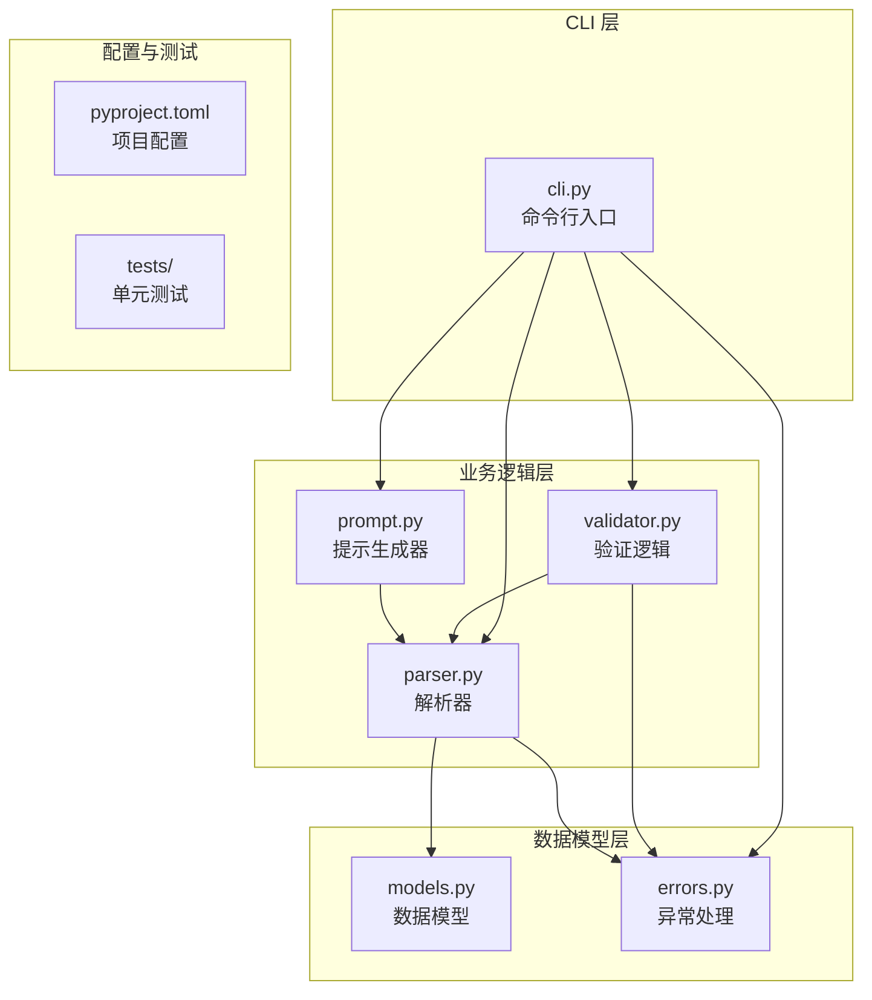
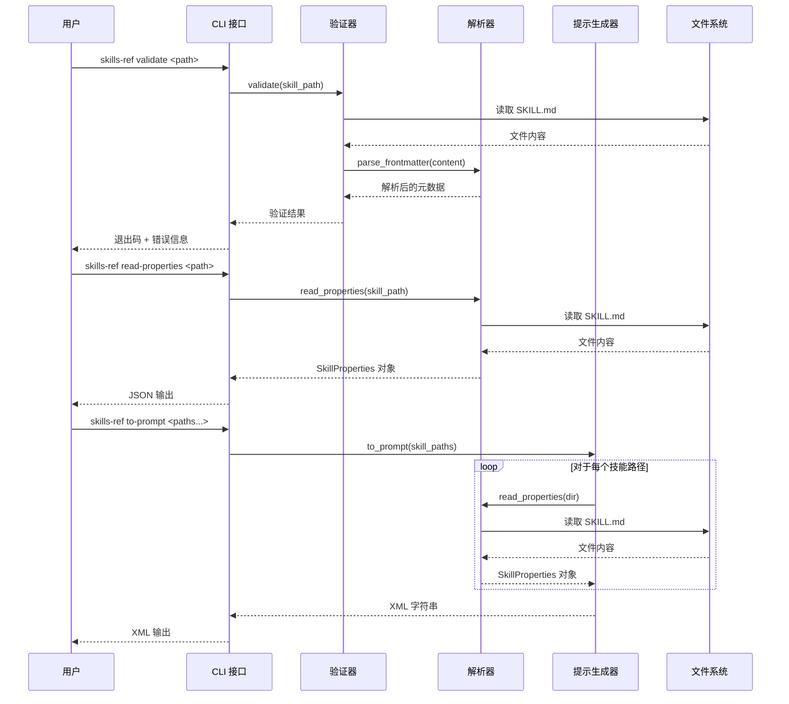
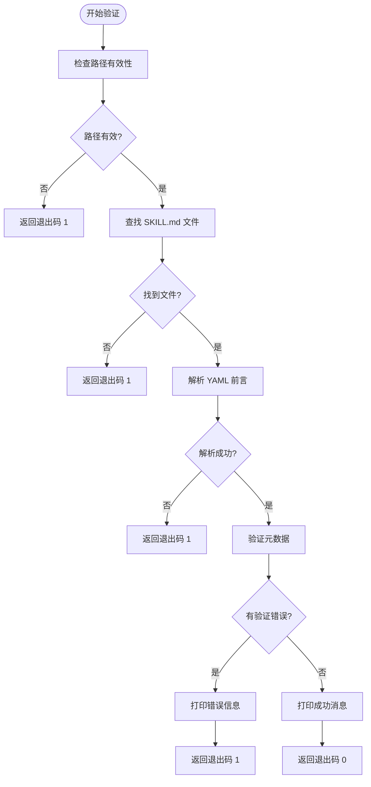
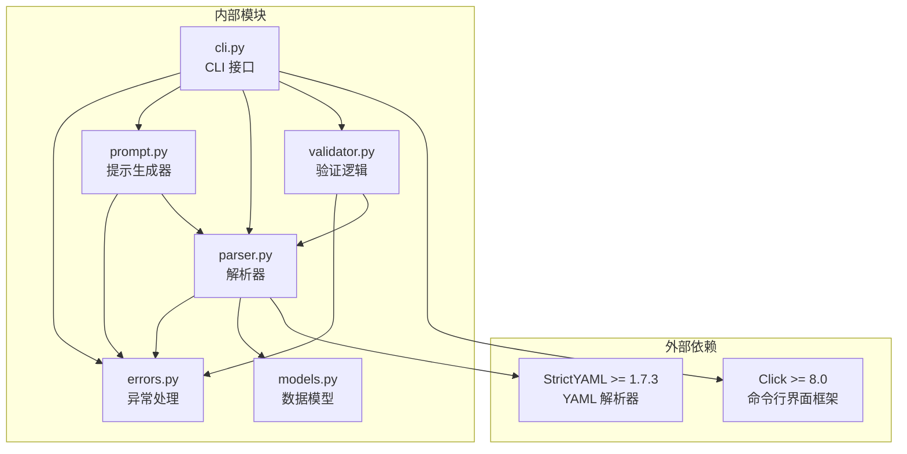
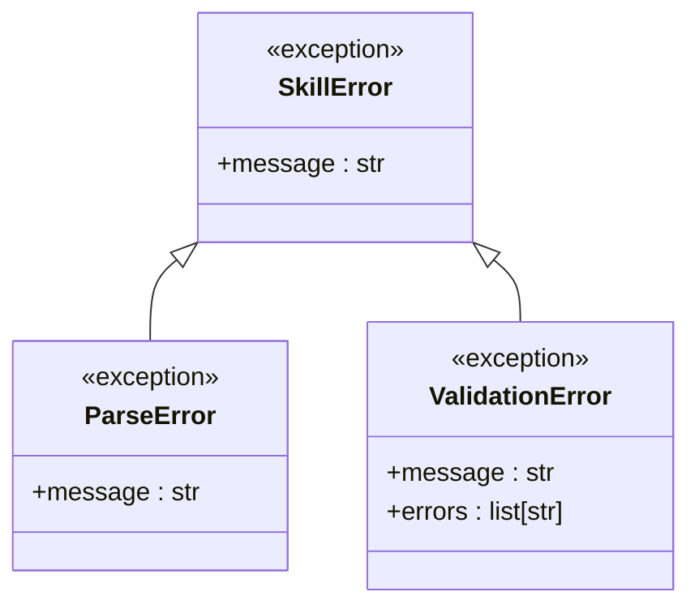
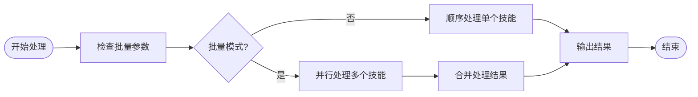

# CLI 工具

<cite>
**本文档引用的文件**
- [cli.py](file://spec/skills-ref/src/skills_ref/cli.py)
- [validator.py](file://spec/skills-ref/src/skills_ref/validator.py)
- [parser.py](file://spec/skills-ref/src/skills_ref/parser.py)
- [prompt.py](file://spec/skills-ref/src/skills_ref/prompt.py)
- [models.py](file://spec/skills-ref/src/skills_ref/models.py)
- [errors.py](file://spec/skills-ref/src/skills_ref/errors.py)
- [README.md](file://spec/skills-ref/README.md)
- [pyproject.toml](file://spec/skills-ref/pyproject.toml)
- [test_validator.py](file://spec/skills-ref/tests/test_validator.py)
- [test_parser.py](file://spec/skills-ref/tests/test_parser.py)
- [test_prompt.py](file://spec/skills-ref/tests/test_prompt.py)
</cite>

## 目录
1. [简介](#简介)
2. [项目结构](#项目结构)
3. [核心组件](#核心组件)
4. [架构概览](#架构概览)
5. [详细组件分析](#详细组件分析)
6. [依赖关系分析](#依赖关系分析)
7. [性能考虑](#性能考虑)
8. [故障排除指南](#故障排除指南)
9. [结论](#结论)

## 简介

技能参考库（Skills Reference Library）是一个专为智能体技能设计的命令行工具，提供了验证、属性读取和提示生成三大核心功能。该工具旨在帮助开发者标准化技能开发流程，确保技能文件符合规范，并为智能体提供一致的技能接口。

该 CLI 工具支持以下主要功能：
- **validate 命令**：验证技能目录的完整性和规范性
- **read-properties 命令**：从 SKILL.md 文件中提取并输出技能属性
- **to-prompt 命令**：生成适用于智能体系统的 `<available_skills>` XML 格式

## 项目结构

技能参考库采用模块化设计，核心代码位于 `spec/skills-ref/src/skills_ref/` 目录下，包含以下关键组件：



**图表来源**
- [cli.py](file://spec/skills-ref/src/skills_ref/cli.py#L1-L106)
- [validator.py](file://spec/skills-ref/src/skills_ref/validator.py#L1-L178)
- [parser.py](file://spec/skills-ref/src/skills_ref/parser.py#L1-L113)
- [prompt.py](file://spec/skills-ref/src/skills_ref/prompt.py#L1-L59)

**章节来源**
- [pyproject.toml](file://spec/skills-ref/pyproject.toml#L1-L31)
- [README.md](file://spec/skills-ref/README.md#L1-L113)

## 核心组件

### CLI 入口点

CLI 工具通过 Click 框架构建，提供三个主要命令和版本选项。每个命令都经过精心设计，具有明确的职责分工和错误处理机制。

### 数据模型

系统使用 `SkillProperties` 数据类来标准化技能属性表示，支持可选字段和字典元数据存储。

**章节来源**
- [cli.py](file://spec/skills-ref/src/skills_ref/cli.py#L1-L106)
- [models.py](file://spec/skills-ref/src/skills_ref/models.py#L1-L40)

## 架构概览

技能参考库采用分层架构设计，确保关注点分离和代码复用：



**图表来源**
- [cli.py](file://spec/skills-ref/src/skills_ref/cli.py#L27-L101)
- [validator.py](file://spec/skills-ref/src/skills-ref/validator.py#L150-L178)
- [parser.py](file://spec/skills-ref/src/skills-ref/parser.py#L67-L113)
- [prompt.py](file://spec/skills-ref/src/skills-ref/prompt.py#L9-L59)

## 详细组件分析

### validate 命令

validate 命令用于验证技能目录的完整性和规范性，是技能开发流程中的质量保证环节。

#### 功能特性

- **路径验证**：检查输入路径是否存在且为有效目录
- **文件完整性**：确保 SKILL.md 文件存在
- **元数据验证**：验证 YAML 前言的格式和内容
- **命名规范**：检查技能名称是否符合规范
- **字符限制**：验证描述和兼容性字段的长度限制

#### 参数说明

| 参数 | 类型 | 必需 | 描述 |
|------|------|------|------|
| skill_path | Path | 是 | 技能目录路径或 SKILL.md 文件路径 |

#### 退出码含义

| 退出码 | 含义 | 触发条件 |
|--------|------|----------|
| 0 | 成功 | 技能验证通过，无任何错误 |
| 1 | 验证失败 | 发现一个或多个验证错误 |

#### 使用示例

```bash
# 验证单个技能目录
skills-ref validate ./skills/pdf

# 验证技能文件本身
skills-ref validate ./skills/pdf/SKILL.md

# 批量验证多个技能
skills-ref validate ./skills/pdf ./skills/docx ./skills/pptx
```

#### 错误处理机制

validate 命令采用分层错误处理策略：



**图表来源**
- [validator.py](file://spec/skills-ref/src/skills-ref/validator.py#L150-L178)
- [cli.py](file://spec/skills-ref/src/skills-ref/cli.py#L27-L51)

**章节来源**
- [validator.py](file://spec/skills-ref/src/skills-ref/validator.py#L1-L178)
- [cli.py](file://spec/skills-ref/src/skills-ref/cli.py#L27-L51)

### read-properties 命令

read-properties 命令用于从 SKILL.md 文件中提取技能属性并以 JSON 格式输出，便于程序化处理和集成。

#### 功能特性

- **属性提取**：从 YAML 前言中提取所有技能属性
- **JSON 输出**：将结果格式化为标准 JSON 格式
- **字段验证**：确保必需字段（name、description）存在
- **类型转换**：自动处理字符串和字典类型的转换

#### 参数说明

| 参数 | 类型 | 必需 | 描述 |
|------|------|------|------|
| skill_path | Path | 是 | 技能目录路径或 SKILL.md 文件路径 |

#### 退出码含义

| 退出码 | 含义 | 触发条件 |
|--------|------|----------|
| 0 | 成功 | 成功解析并输出 JSON |
| 1 | 解析失败 | 文件不存在或 YAML 格式无效 |

#### 使用示例

```bash
# 读取单个技能属性
skills-ref read-properties ./skills/pdf

# 读取技能属性到变量
PROPERTIES=$(skills-ref read-properties ./skills/pdf)

# 在脚本中使用
skills-ref read-properties ./skills/pdf | jq '.name'
```

#### 输出格式

命令输出的标准 JSON 结构：

```json
{
  "name": "pdf-reader",
  "description": "从 PDF 文件中读取和提取文本",
  "license": "MIT",
  "compatibility": "Requires Python 3.8+",
  "allowed-tools": "Bash(pdfinfo:*) Bash(pdftotext:*)",
  "metadata": {
    "author": "Test Author",
    "version": "1.0"
  }
}
```

**章节来源**
- [parser.py](file://spec/skills-ref/src/skills-ref/parser.py#L67-L113)
- [models.py](file://spec/skills-ref/src/skills-ref/models.py#L28-L40)
- [cli.py](file://spec/skills-ref/src/skills-ref/cli.py#L53-L74)

### to-prompt 命令

to-prompt 命令用于生成适用于智能体系统的 `<available_skills>` XML 格式，这是 Anthropic 推荐的技能接口格式。

#### 功能特性

- **批量处理**：支持同时处理多个技能目录
- **XML 生成**：生成标准的 `<available_skills>` XML 结构
- **HTML 转义**：自动转义 XML 特殊字符
- **位置信息**：包含 SKILL.md 文件的完整路径

#### 参数说明

| 参数 | 类型 | 必需 | 描述 |
|------|------|------|------|
| skill_paths | Path[] | 是 | 一个或多个技能目录路径 |

#### 退出码含义

| 退出码 | 含义 | 触发条件 |
|--------|------|----------|
| 0 | 成功 | 成功生成 XML 内容 |
| 1 | 错误 | 处理过程中发生异常 |

#### 使用示例

```bash
# 生成单个技能的 XML
skills-ref to-prompt ./skills/pdf

# 生成多个技能的 XML
skills-ref to-prompt ./skills/pdf ./skills/docx ./skills/pptx

# 将输出重定向到文件
skills-ref to-prompt ./skills/* > available_skills.xml

# 在智能体系统中使用
skills-ref to-prompt ./skills/* | sed 's/<available_skills>.*<\/available_skills>//g'
```

#### 输出格式

生成的 XML 结构：

```xml
<available_skills>
  <skill>
    <name>pdf-reader</name>
    <description>从 PDF 文件中读取和提取文本</description>
    <location>/path/to/skills/pdf/SKILL.md</location>
  </skill>
  <skill>
    <name>docx-reader</name>
    <description>处理 DOCX 文档的工具</description>
    <location>/path/to/skills/docx/SKILL.md</location>
  </skill>
</available_skills>
```

**章节来源**
- [prompt.py](file://spec/skills-ref/src/skills-ref/prompt.py#L9-L59)
- [cli.py](file://spec/skills-ref/src/skills-ref/cli.py#L76-L101)

## 依赖关系分析

技能参考库的依赖关系清晰明确，遵循单一职责原则：



**图表来源**
- [pyproject.toml](file://spec/skills-ref/pyproject.toml#L11-L14)
- [cli.py](file://spec/skills-ref/src/skills_ref/cli.py#L7-L12)

### 错误处理架构

系统采用统一的异常层次结构来处理各种错误情况：



**图表来源**
- [errors.py](file://spec/skills-ref/src/skills-ref/errors.py#L4-L26)

**章节来源**
- [errors.py](file://spec/skills-ref/src/skills-ref/errors.py#L1-L26)

## 性能考虑

### 文件系统访问优化

- **缓存策略**：解析器会缓存已读取的文件内容，避免重复 I/O 操作
- **路径解析**：使用 `pathlib.Path` 进行高效的路径操作
- **批量处理**：to-prompt 命令支持一次性处理多个技能，减少进程启动开销

### 内存使用优化

- **流式处理**：对于大型技能文件，采用流式读取方式
- **对象复用**：SkillProperties 对象在内存中复用，减少垃圾回收压力
- **延迟加载**：仅在需要时才解析 SKILL.md 文件内容

### 并发处理能力

虽然当前实现为同步阻塞模式，但架构设计允许未来添加异步支持：



## 故障排除指南

### 常见问题及解决方案

#### 验证失败问题

**问题**：`skills-ref validate` 返回验证错误
**解决方案**：
1. 检查 SKILL.md 文件格式是否正确
2. 确认 YAML 前言使用正确的分隔符 `---`
3. 验证必需字段（name、description）是否存在

#### 解析错误问题

**问题**：`skills-ref read-properties` 抛出解析异常
**解决方案**：
1. 确认 SKILL.md 文件存在且可读
2. 检查 YAML 语法是否正确
3. 验证文件编码格式

#### XML 生成问题

**问题**：`skills-ref to-prompt` 生成的 XML 包含特殊字符
**解决方案**：
1. 系统会自动转义 XML 特殊字符
2. 检查描述字段中是否包含未转义的字符

### 调试技巧

#### 启用详细日志

```bash
# 使用调试模式运行 CLI
export DEBUG=1
skills-ref validate ./skills/pdf
```

#### 验证文件完整性

```bash
# 检查 SKILL.md 文件结构
cat ./skills/pdf/SKILL.md | head -10

# 验证 YAML 格式
python -c "
import yaml
with open('./skills/pdf/SKILL.md', 'r') as f:
    content = f.read()
    frontmatter = content.split('---')[1]
    print(yaml.safe_load(frontmatter))
"
```

**章节来源**
- [test_validator.py](file://spec/skills-ref/tests/test_validator.py#L1-L291)
- [test_parser.py](file://spec/skills-ref/tests/test_parser.py#L1-L189)
- [test_prompt.py](file://spec/skills-ref/tests/test_prompt.py#L1-L71)

## 结论

技能参考库的 CLI 工具为智能体技能开发提供了完整的命令行解决方案。通过 validate、read-properties 和 to-prompt 三个核心命令，开发者可以：

1. **确保质量**：通过 validate 命令建立质量保证流程
2. **自动化处理**：使用 read-properties 命令进行程序化技能管理
3. **集成智能体**：通过 to-prompt 命令生成标准的技能接口

该工具的设计充分考虑了易用性、可靠性和扩展性，为技能参考库生态系统提供了坚实的基础。建议开发者在技能开发流程中集成这些命令，以提高开发效率和代码质量。