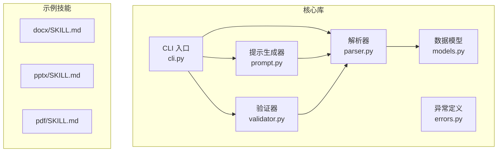
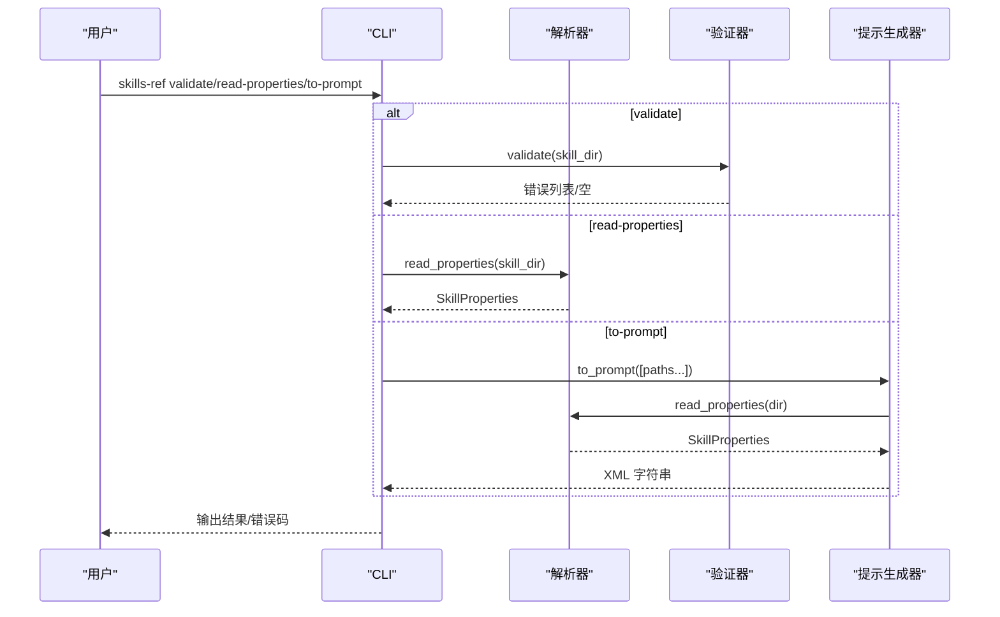
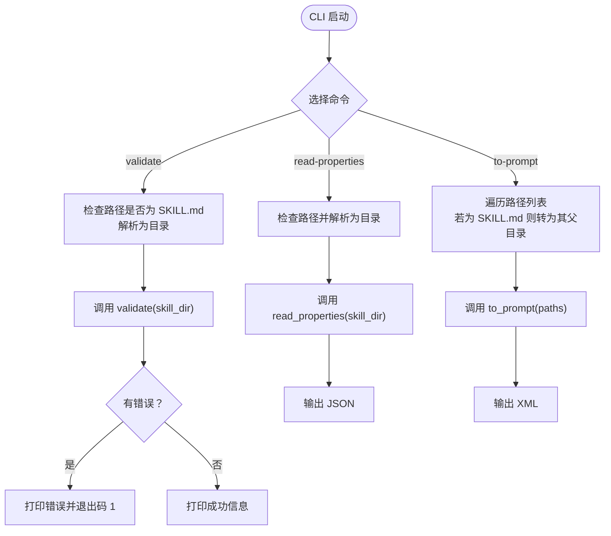
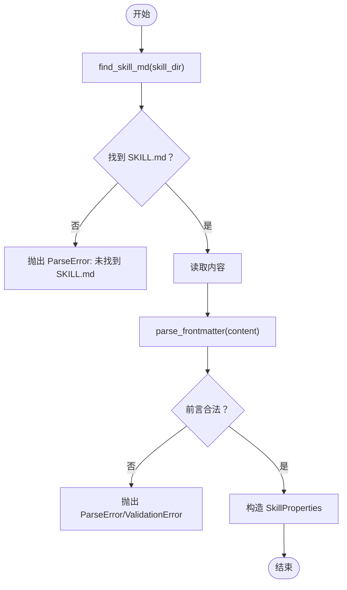
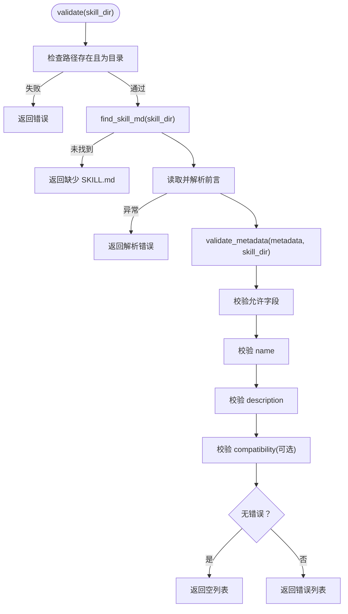
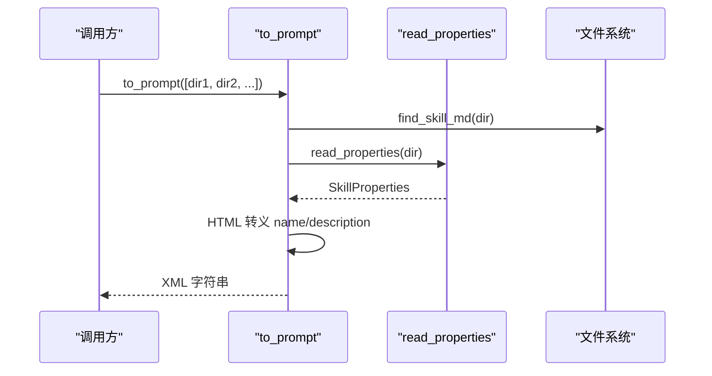
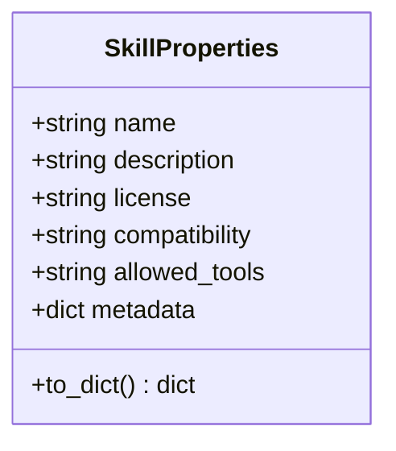
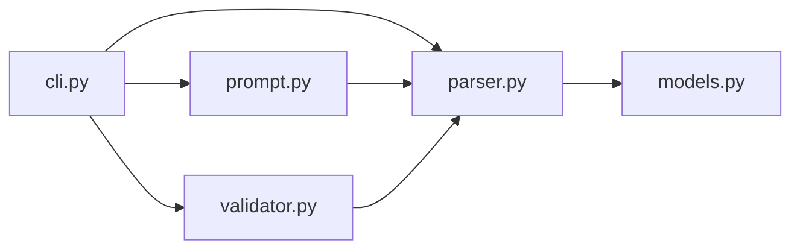

# 技能参考库

<cite>
**本文引用的文件**
- [cli.py](file://spec/skills-ref/src/skills_ref/cli.py)
- [validator.py](file://spec/skills-ref/src/skills_ref/validator.py)
- [parser.py](file://spec/skills-ref/src/skills_ref/parser.py)
- [prompt.py](file://spec/skills-ref/src/skills_ref/prompt.py)
- [models.py](file://spec/skills-ref/src/skills_ref/models.py)
- [errors.py](file://spec/skills-ref/src/skills_ref/errors.py)
- [README.md](file://spec/skills-ref/README.md)
- [pyproject.toml](file://spec/skills-ref/pyproject.toml)
- [test_validator.py](file://spec/skills-ref/tests/test_validator.py)
- [test_parser.py](file://spec/skills-ref/tests/test_parser.py)
- [SKILL.md](file://skills/docx/SKILL.md)
- [SKILL.md](file://skills/pptx/SKILL.md)
- [SKILL.md](file://skills/pdf/SKILL.md)
</cite>

## 目录
1. [简介](#简介)
2. [项目结构](#项目结构)
3. [核心组件](#核心组件)
4. [架构总览](#架构总览)
5. [详细组件分析](#详细组件分析)
6. [依赖关系分析](#依赖关系分析)
7. [性能考虑](#性能考虑)
8. [故障排查指南](#故障排查指南)
9. [结论](#结论)
10. [附录](#附录)

## 简介
技能参考库是一个用于“代理技能”（Agent Skills）的参考实现，提供以下能力：
- 命令行工具：验证技能目录、读取技能属性、生成可用技能提示块
- 解析器：从 SKILL.md 的 YAML 前言中提取元数据
- 验证器：对技能元数据进行格式与规范校验
- 提示生成器：生成适用于代理系统提示的 XML 结构
- 数据模型：统一的技能属性结构化表示

该库遵循“代理技能规范”，支持多语言名称、严格的字段约束与可扩展的元数据字段，并通过 CLI 和 Python API 提供一致的使用体验。

## 项目结构
仓库采用按功能域划分的组织方式：
- spec/skills-ref：核心库与测试
- skills/*：示例技能与子模块脚本
- template：模板文件

图表来源
- [cli.py](file://spec/skills-ref/src/skills_ref/cli.py#L1-L106)
- [parser.py](file://spec/skills-ref/src/skills_ref/parser.py#L1-L113)
- [validator.py](file://spec/skills-ref/src/skills_ref/validator.py#L1-L178)
- [prompt.py](file://spec/skills-ref/src/skills_ref/prompt.py#L1-L59)
- [models.py](file://spec/skills-ref/src/skills_ref/models.py#L1-L40)
- [errors.py](file://spec/skills-ref/src/skills_ref/errors.py#L1-L26)
- [SKILL.md](file://skills/docx/SKILL.md#L1-L197)
- [SKILL.md](file://skills/pptx/SKILL.md#L1-L484)
- [SKILL.md](file://skills/pdf/SKILL.md#L1-L295)

章节来源
- [README.md](file://spec/skills-ref/README.md#L1-L113)
- [pyproject.toml](file://spec/skills-ref/pyproject.toml#L1-L31)

## 核心组件
- CLI 工具：提供 validate、read-properties、to-prompt 三个命令，支持版本输出与错误码控制
- 解析器：定位 SKILL.md，解析 YAML 前言，返回元数据与正文
- 验证器：校验必需字段、命名规则、长度限制、允许字段集合
- 提示生成器：将多个技能目录转换为标准 XML 片段，便于注入到代理系统提示
- 数据模型：SkillProperties 统一属性结构，支持 to_dict 序列化

章节来源
- [cli.py](file://spec/skills-ref/src/skills_ref/cli.py#L20-L106)
- [parser.py](file://spec/skills-ref/src/skills_ref/parser.py#L12-L113)
- [validator.py](file://spec/skills-ref/src/skills_ref/validator.py#L150-L178)
- [prompt.py](file://spec/skills-ref/src/skills_ref/prompt.py#L9-L59)
- [models.py](file://spec/skills-ref/src/skills_ref/models.py#L7-L40)

## 架构总览
整体流程：CLI 接收用户输入，调用解析器读取元数据，调用验证器进行校验，或调用提示生成器构建 XML 输出。

图表来源
- [cli.py](file://spec/skills-ref/src/skills_ref/cli.py#L27-L101)
- [parser.py](file://spec/skills-ref/src/skills_ref/parser.py#L67-L113)
- [validator.py](file://spec/skills-ref/src/skills_ref/validator.py#L150-L178)
- [prompt.py](file://spec/skills-ref/src/skills_ref/prompt.py#L9-L59)

## 详细组件分析

### CLI 工具
- 命令组：version-option、validate、read-properties、to-prompt
- 输入路径处理：自动识别 SKILL.md 或其父目录
- 输出与错误码：validate 失败时返回非零退出码；to-prompt 输出 XML；read-properties 输出 JSON
- 交互性：使用 click 提供友好 CLI 体验

图表来源
- [cli.py](file://spec/skills-ref/src/skills_ref/cli.py#L27-L101)

章节来源
- [cli.py](file://spec/skills-ref/src/skills_ref/cli.py#L20-L106)

### 解析器（YAML 前言解析）
- 功能：定位 SKILL.md（优先大写），解析 YAML 前言，分离元数据与正文
- 异常：缺失前言、未正确闭合、YAML 格式错误、前言类型非法
- 属性：name/description 必填；license/compatibility/allowed-tools/metadata 可选
- 返回：SkillProperties 对象

图表来源
- [parser.py](file://spec/skills-ref/src/skills_ref/parser.py#L12-L113)
- [models.py](file://spec/skills-ref/src/skills_ref/models.py#L7-L40)

章节来源
- [parser.py](file://spec/skills-ref/src/skills_ref/parser.py#L12-L113)
- [test_parser.py](file://spec/skills-ref/tests/test_parser.py#L1-L189)

### 验证器（元数据校验）
- 规则：
  - 必需字段：name、description
  - name：小写、仅字母数字与连字符、不可以连字符开头/结尾、不可连续连字符、长度限制、目录名匹配
  - description：非空、长度限制
  - compatibility：字符串、长度限制
  - metadata：仅允许白名单字段
  - 允许字段：name、description、license、allowed-tools、metadata、compatibility
- 返回：错误消息列表（空列表表示通过）

图表来源
- [validator.py](file://spec/skills-ref/src/skills_ref/validator.py#L150-L178)

章节来源
- [validator.py](file://spec/skills-ref/src/skills_ref/validator.py#L150-L178)
- [test_validator.py](file://spec/skills-ref/tests/test_validator.py#L1-L291)

### 提示生成器（XML 生成）
- 输入：技能目录列表
- 输出：<available_skills> XML 块，包含每个技能的 name、description、location
- 安全：对文本进行 HTML 转义，避免注入风险
- 格式：符合推荐的代理系统提示格式

图表来源
- [prompt.py](file://spec/skills-ref/src/skills_ref/prompt.py#L9-L59)
- [parser.py](file://spec/skills-ref/src/skills_ref/parser.py#L67-L113)

章节来源
- [prompt.py](file://spec/skills-ref/src/skills_ref/prompt.py#L9-L59)

### 数据模型（SkillProperties）
- 字段：name、description（必填）、license（可选）、compatibility（可选）、allowed-tools（可选）、metadata（可选）
- 方法：to_dict 将对象序列化为字典，排除 None 值；metadata 为空时不包含在输出中

图表来源
- [models.py](file://spec/skills-ref/src/skills_ref/models.py#L7-L40)

章节来源
- [models.py](file://spec/skills-ref/src/skills_ref/models.py#L7-L40)

### 异常体系
- SkillError：所有技能相关异常的基类
- ParseError：SKILL.md 解析失败
- ValidationError：技能属性无效（如缺少必需字段）

章节来源
- [errors.py](file://spec/skills-ref/src/skills_ref/errors.py#L4-L26)

## 依赖关系分析
- CLI 依赖解析器、验证器、提示生成器
- 解析器依赖严格 YAML 解析库与数据模型
- 验证器依赖解析器（复用已解析的元数据）
- 提示生成器依赖解析器与文件系统查找
- 项目依赖 click、strictyaml

图表来源
- [cli.py](file://spec/skills-ref/src/skills_ref/cli.py#L9-L12)
- [parser.py](file://spec/skills-ref/src/skills_ref/parser.py#L6-L9)
- [validator.py](file://spec/skills-ref/src/skills_ref/validator.py#L7-L8)
- [prompt.py](file://spec/skills-ref/src/skills_ref/prompt.py#L6)

章节来源
- [pyproject.toml](file://spec/skills-ref/pyproject.toml#L11-L14)

## 性能考虑
- 文件 I/O：解析器与验证器均会读取 SKILL.md，建议批量处理时复用已解析的元数据
- 正则与字符串处理：验证器对名称进行规范化与多次检查，注意在大规模批量场景下的开销
- XML 生成：提示生成器对文本进行 HTML 转义，建议在高并发场景下缓存中间结果
- 依赖库：strictyaml 与 click 在解析与 CLI 处理上表现稳定，建议保持版本兼容

## 故障排查指南
- CLI 使用
  - validate：当返回非零退出码时，检查输出的错误列表，逐项修正
  - read-properties：当出现解析错误时，确认 SKILL.md 是否存在且前言格式正确
  - to-prompt：当输出为空或不完整时，确认传入的路径列表有效且每个目录包含 SKILL.md
- 解析器问题
  - 缺少前言或未正确闭合：确保 SKILL.md 以 "---" 开始与结束
  - YAML 格式错误：检查前言中的缩进与键值对
  - 非字典前言：确保前言为映射结构
- 验证器问题
  - 名称不符合规范：确保小写、仅字母数字与连字符、不以连字符开头/结尾、不包含连续连字符
  - 长度超限：缩短 name 或 description，或压缩 compatibility
  - 未知字段：移除不在白名单内的字段
- 示例技能参考
  - 可参考 docx、pptx、pdf 等示例技能的 SKILL.md 模板，学习正确的前言与正文结构

章节来源
- [test_parser.py](file://spec/skills-ref/tests/test_parser.py#L29-L64)
- [test_validator.py](file://spec/skills-ref/tests/test_validator.py#L41-L118)
- [SKILL.md](file://skills/docx/SKILL.md#L1-L197)
- [SKILL.md](file://skills/pptx/SKILL.md#L1-L484)
- [SKILL.md](file://skills/pdf/SKILL.md#L1-L295)

## 结论
技能参考库提供了完整的“代理技能”生命周期管理能力：从元数据解析、规范校验到提示注入，形成了一条清晰、可扩展的流水线。通过 CLI 与 Python API，用户可以快速验证技能质量、读取属性并生成标准化提示块。建议在生产环境中结合 CI/CD 自动化执行 validate 与 to-prompt，确保技能的一致性与可维护性。

## 附录

### API 文档概览
- CLI
  - validate：校验技能目录，返回错误列表
  - read-properties：读取并输出 JSON 格式的技能属性
  - to-prompt：生成 XML 片段，用于代理系统提示
- Python API
  - validate(skill_dir)：返回错误列表
  - read_properties(skill_dir)：返回 SkillProperties
  - to_prompt(skill_dirs)：返回 XML 字符串

章节来源
- [README.md](file://spec/skills-ref/README.md#L53-L86)
- [cli.py](file://spec/skills-ref/src/skills_ref/cli.py#L27-L101)
- [parser.py](file://spec/skills-ref/src/skills_ref/parser.py#L67-L113)
- [prompt.py](file://spec/skills-ref/src/skills_ref/prompt.py#L9-L59)

### 使用示例与集成方法
- 安装与环境准备：使用 pip 或 uv 安装，激活虚拟环境后获得 skills-ref 可执行文件
- CLI 集成：在脚本中调用 validate/read-properties/to-prompt，并根据退出码与输出进行后续处理
- Python 集成：直接导入 validate、read_properties、to_prompt，在应用中组合使用

章节来源
- [README.md](file://spec/skills-ref/README.md#L7-L51)
- [README.md](file://spec/skills-ref/README.md#L53-L86)

### 配置选项与扩展指南
- 允许字段：name、description、license、allowed-tools、metadata、compatibility
- 扩展点：
  - 自定义元数据：通过 metadata 字段添加客户端特定键值
  - 实验特性：allowed-tools 当前为实验字段，未来可能演变为正式规范
  - 提示格式：提示生成器默认输出 XML，可根据客户端偏好调整格式

章节来源
- [validator.py](file://spec/skills-ref/src/skills_ref/validator.py#L14-L22)
- [parser.py](file://spec/skills-ref/src/skills_ref/parser.py#L105-L112)
- [prompt.py](file://spec/skills-ref/src/skills_ref/prompt.py#L9-L31)