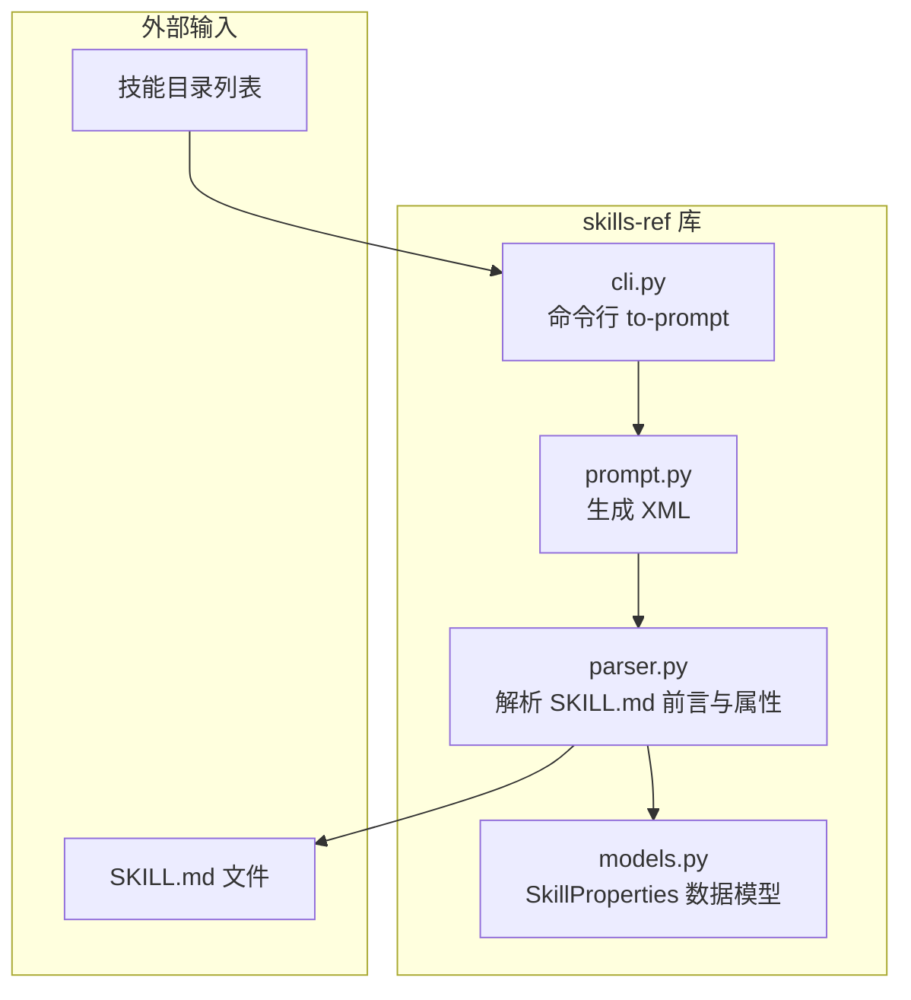
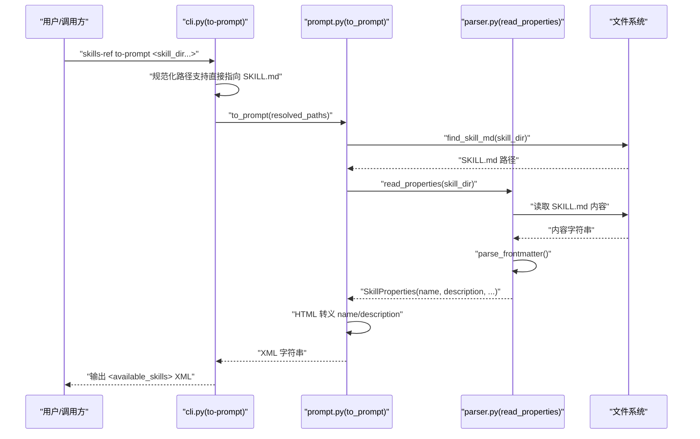
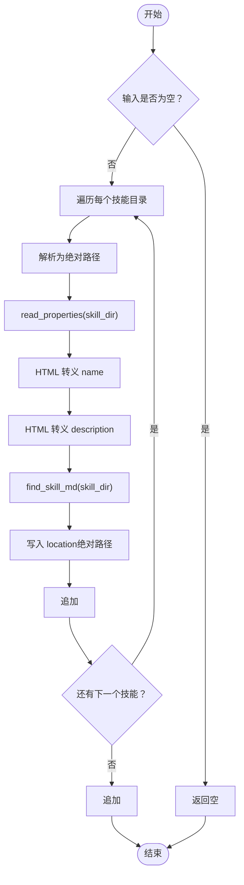
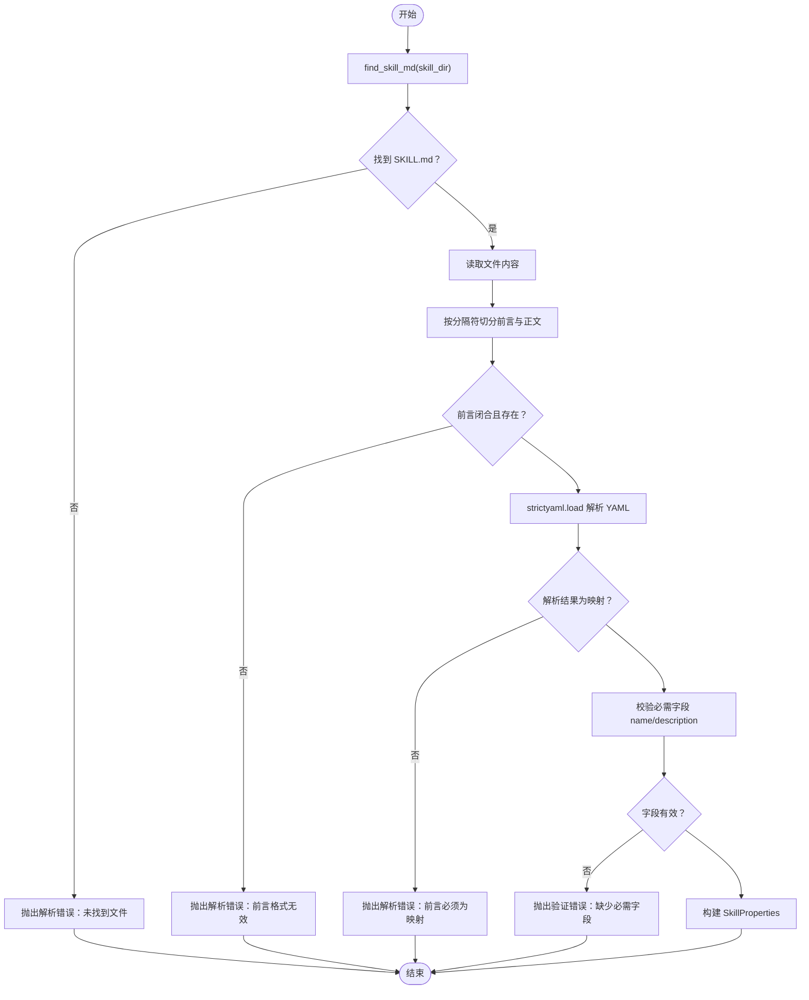
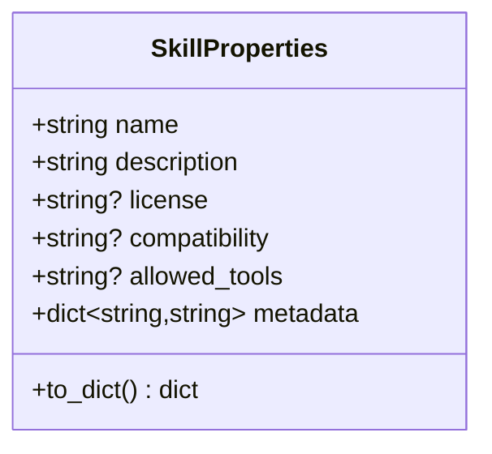
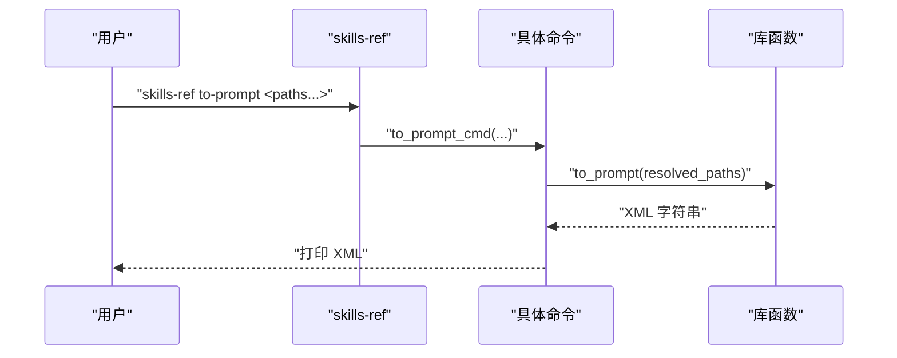
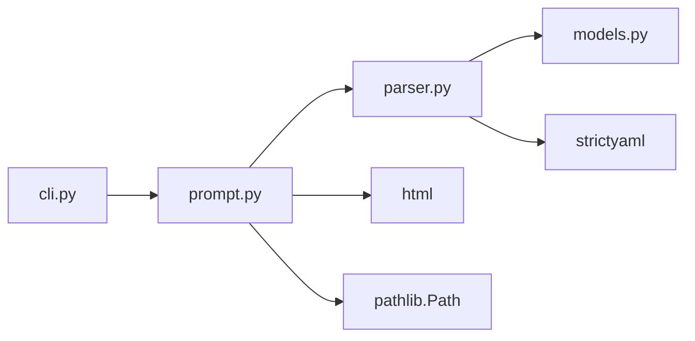

# 提示生成器

<cite>
**本文引用的文件**
- [README.md](file://README.md)
- [CLAUDE.md](file://spec/skills-ref/CLAUDE.md)
- [README.md](file://spec/skills-ref/README.md)
- [prompt.py](file://spec/skills-ref/src/skills_ref/prompt.py)
- [models.py](file://spec/skills-ref/src/skills_ref/models.py)
- [parser.py](file://spec/skills-ref/src/skills_ref/parser.py)
- [cli.py](file://spec/skills-ref/src/skills_ref/cli.py)
</cite>

## 目录
1. [简介](#简介)
2. [项目结构](#项目结构)
3. [核心组件](#核心组件)
4. [架构总览](#架构总览)
5. [详细组件分析](#详细组件分析)
6. [依赖关系分析](#依赖关系分析)
7. [性能考量](#性能考量)
8. [故障排查指南](#故障排查指南)
9. [结论](#结论)
10. [附录](#附录)

## 简介
本技术文档围绕“提示生成器”展开，聚焦于将技能元数据转换为 Claude AI 助手可用的 <available_skills> XML 格式。该流程包含以下关键环节：从技能目录中定位并解析 SKILL.md 的 YAML 前言元数据、提取技能名称与描述、拼接输出为标准 XML 结构，并对文本进行安全转义，确保在系统提示中可被正确解析与使用。

该实现遵循 Anthropic 推荐的格式，便于在 Claude 模型的系统提示中注入可用技能清单，帮助模型在执行任务时选择合适的技能。

## 项目结构
与提示生成器直接相关的模块位于 spec/skills-ref 子目录中，主要由以下文件构成：
- prompt.py：负责生成 <available_skills> XML 字符串
- parser.py：负责解析 SKILL.md 的 YAML 前言元数据并校验必要字段
- models.py：定义 SkillProperties 数据模型及字典序列化方法
- cli.py：提供命令行工具 to-prompt，用于批量生成 XML 提示块
- README.md（skills-ref）：使用说明与示例
- CLAUDE.md：开发与测试指引

图表来源
- [prompt.py](file://spec/skills-ref/src/skills_ref/prompt.py#L1-L59)
- [parser.py](file://spec/skills-ref/src/skills_ref/parser.py#L1-L113)
- [models.py](file://spec/skills-ref/src/skills_ref/models.py#L1-L40)
- [cli.py](file://spec/skills-ref/src/skills_ref/cli.py#L1-L106)

章节来源
- [README.md](file://README.md#L1-L95)
- [README.md](file://spec/skills-ref/README.md#L1-L113)

## 核心组件
- 提示生成器（prompt.py）
  - 职责：接收技能目录列表，逐个读取 SKILL.md 元数据，构造标准 XML 输出
  - 关键点：空目录返回空容器标签；对 name 与 description 进行 HTML 安全转义；location 写入 SKILL.md 绝对路径
- 解析器（parser.py）
  - 职责：定位 SKILL.md（优先大写），解析 YAML 前言，校验必需字段，构建 SkillProperties
  - 关键点：支持大小写不敏感的文件名；严格校验 name/description 类型与非空性
- 数据模型（models.py）
  - 职责：以数据类承载技能元数据，提供 to_dict() 序列化（含可选字段与 metadata）
- 命令行接口（cli.py）
  - 职责：提供 validate、read-properties、to-prompt 三个子命令，支持直接输出 XML 或 JSON

章节来源
- [prompt.py](file://spec/skills-ref/src/skills_ref/prompt.py#L1-L59)
- [parser.py](file://spec/skills-ref/src/skills_ref/parser.py#L1-L113)
- [models.py](file://spec/skills-ref/src/skills_ref/models.py#L1-L40)
- [cli.py](file://spec/skills-ref/src/skills_ref/cli.py#L1-L106)

## 架构总览
下图展示了从技能目录到最终 XML 输出的端到端流程，包括 CLI 调用、内部模块协作与错误处理路径。

图表来源
- [cli.py](file://spec/skills-ref/src/skills_ref/cli.py#L76-L101)
- [prompt.py](file://spec/skills-ref/src/skills_ref/prompt.py#L9-L58)
- [parser.py](file://spec/skills-ref/src/skills_ref/parser.py#L67-L112)

## 详细组件分析

### 组件一：提示生成器（prompt.py）
- 输入
  - 技能目录路径列表（支持传入 SKILL.md 文件路径，内部会回退到父目录）
- 处理逻辑
  - 若输入为空，返回空的 <available_skills> 容器
  - 遍历每个技能目录，解析元数据并追加 XML 片段
  - 对 name 与 description 使用 HTML 转义，防止注入与解析异常
  - location 写入 SKILL.md 的绝对路径，便于后续加载完整指令
- 输出
  - 单个 XML 字符串，包含 <available_skills> 根节点与若干 <skill> 子节点

图表来源
- [prompt.py](file://spec/skills-ref/src/skills_ref/prompt.py#L9-L58)
- [parser.py](file://spec/skills-ref/src/skills_ref/parser.py#L67-L112)

章节来源
- [prompt.py](file://spec/skills-ref/src/skills_ref/prompt.py#L1-L59)

### 组件二：解析器（parser.py）
- 功能
  - 定位 SKILL.md（优先大写，兼容小写）
  - 解析 YAML 前言，校验必需字段 name 与 description
  - 将 metadata 键值统一为字符串类型
- 错误处理
  - 缺失前言或未正确闭合：抛出解析错误
  - 前言不是映射类型：抛出解析错误
  - 缺少必需字段：抛出验证错误
  - 非法类型或空字符串：抛出验证错误

图表来源
- [parser.py](file://spec/skills-ref/src/skills_ref/parser.py#L12-L112)

章节来源
- [parser.py](file://spec/skills-ref/src/skills_ref/parser.py#L1-L113)

### 组件三：数据模型（models.py）
- 结构
  - 必需字段：name、description
  - 可选字段：license、compatibility、allowed-tools、metadata（字典）
- 方法
  - to_dict()：排除 None 值，将 allowed-tools 映射为连字符形式键，保留 metadata 字典

图表来源
- [models.py](file://spec/skills-ref/src/skills_ref/models.py#L7-L39)

章节来源
- [models.py](file://spec/skills-ref/src/skills_ref/models.py#L1-L40)

### 组件四：命令行接口（cli.py）
- 子命令
  - validate：校验技能目录的完整性与规范性
  - read-properties：输出技能元数据为 JSON
  - to-prompt：生成 <available_skills> XML，支持多目录输入
- 行为细节
  - 支持直接传入 SKILL.md 文件路径，内部自动回退到父目录
  - 统一捕获 SkillError 并输出错误信息与非零退出码

图表来源
- [cli.py](file://spec/skills-ref/src/skills_ref/cli.py#L76-L101)
- [prompt.py](file://spec/skills-ref/src/skills_ref/prompt.py#L9-L58)

章节来源
- [cli.py](file://spec/skills-ref/src/skills_ref/cli.py#L1-L106)

## 依赖关系分析
- prompt.py 依赖 parser.py（读取属性）、html（转义）、pathlib（路径处理）
- parser.py 依赖 strictyaml（解析 YAML）、自定义错误类型
- cli.py 依赖 prompt.py、parser.py、validator.py（导入但未在 to-prompt 中使用）
- models.py 作为数据载体，被 parser.py 构建并被 CLI 的 read-properties 命令消费

图表来源
- [cli.py](file://spec/skills-ref/src/skills_ref/cli.py#L1-L13)
- [prompt.py](file://spec/skills-ref/src/skills_ref/prompt.py#L1-L7)
- [parser.py](file://spec/skills-ref/src/skills_ref/parser.py#L1-L9)

章节来源
- [cli.py](file://spec/skills-ref/src/skills_ref/cli.py#L1-L13)
- [prompt.py](file://spec/skills-ref/src/skills_ref/prompt.py#L1-L7)
- [parser.py](file://spec/skills-ref/src/skills_ref/parser.py#L1-L9)

## 性能考量
- I/O 开销
  - 每个技能目录均需读取一次 SKILL.md 文件，建议批量输入时避免重复路径
- 字符串处理
  - HTML 转义与字符串拼接为 O(n) 级别，整体开销较小
- 路径解析
  - 使用绝对路径可避免相对路径解析问题，但会增加输出长度；如需缩短路径，可在调用前自行规范化

## 故障排查指南
- 常见错误与定位
  - “未找到 SKILL.md”：确认技能目录包含 SKILL.md 或 skill.md（大小写不敏感），并检查路径是否存在
  - “前言未正确闭合”：检查 SKILL.md 是否以成对的分隔符包裹前言
  - “前言必须为映射”：确保 YAML 前言采用键值对形式
  - “缺少必需字段 name/description”：为每个技能补充完整的 YAML 前言
  - “字段类型非法或为空”：确保 name 与 description 为非空字符串
- 建议排查步骤
  - 使用 CLI 的 read-properties 命令先输出 JSON 校验元数据
  - 使用 validate 命令检查目录规范性
  - 在 to-prompt 前先单个技能验证，逐步缩小范围

章节来源
- [parser.py](file://spec/skills-ref/src/skills_ref/parser.py#L82-L112)
- [cli.py](file://spec/skills-ref/src/skills_ref/cli.py#L27-L50)

## 结论
提示生成器通过标准化的 XML 输出，将技能元数据安全地注入到 Claude 的系统提示中。其设计强调：
- 明确的输入规范（SKILL.md 前言）
- 严格的解析与校验流程
- 安全的文本转义策略
- 可扩展的数据模型（支持额外元数据）

开发者可据此快速集成自定义技能，同时保持与 Anthropic 推荐格式的一致性。

## 附录

### XML 格式规范与字段映射
- 根节点：<available_skills>
- 子节点：<skill>
  - <name>：技能名称（来自 YAML frontmatter 的 name，经 HTML 转义）
  - <description>：技能描述（来自 YAML frontmatter 的 description，经 HTML 转义）
  - <location>：SKILL.md 的绝对路径
- 输出示例（参考 README 中的 XML 片段）

章节来源
- [prompt.py](file://spec/skills-ref/src/skills_ref/prompt.py#L9-L58)
- [README.md](file://spec/skills-ref/README.md#L88-L109)

### 扩展方法与最佳实践
- 扩展字段
  - 如需在 XML 中加入更多元信息，可在 prompt.py 的 XML 构造处添加对应节点，并在 parser.py 中解析相应 YAML 字段
- 输出定制
  - 若目标模型或客户端偏好不同格式，可在 CLI 层或上层应用中二次转换（例如 JSON 列表、Markdown 表格等）
- 安全性
  - 始终对 name 与 description 进行 HTML 转义，避免注入风险
- 可维护性
  - 将 XML 输出模板化，便于未来调整结构而不影响业务逻辑

章节来源
- [prompt.py](file://spec/skills-ref/src/skills_ref/prompt.py#L42-L52)
- [parser.py](file://spec/skills-ref/src/skills_ref/parser.py#L105-L112)

### 集成指南（Python API）
- 步骤
  - 导入：from pathlib import Path；from skills_ref import validate, read_properties, to_prompt
  - 校验：validate(Path("my-skill"))；若返回非空列表则存在错误
  - 读取：props = read_properties(Path("my-skill"))；输出 JSON（可通过 CLI read-properties 验证）
  - 生成：prompt = to_prompt([Path("skill-a"), Path("skill-b")])；将结果嵌入系统提示
- 注意事项
  - 确保 SKILL.md 前言符合规范
  - 多目录输入时，注意去重与路径规范化

章节来源
- [README.md](file://spec/skills-ref/README.md#L68-L86)
- [cli.py](file://spec/skills-ref/src/skills_ref/cli.py#L53-L101)