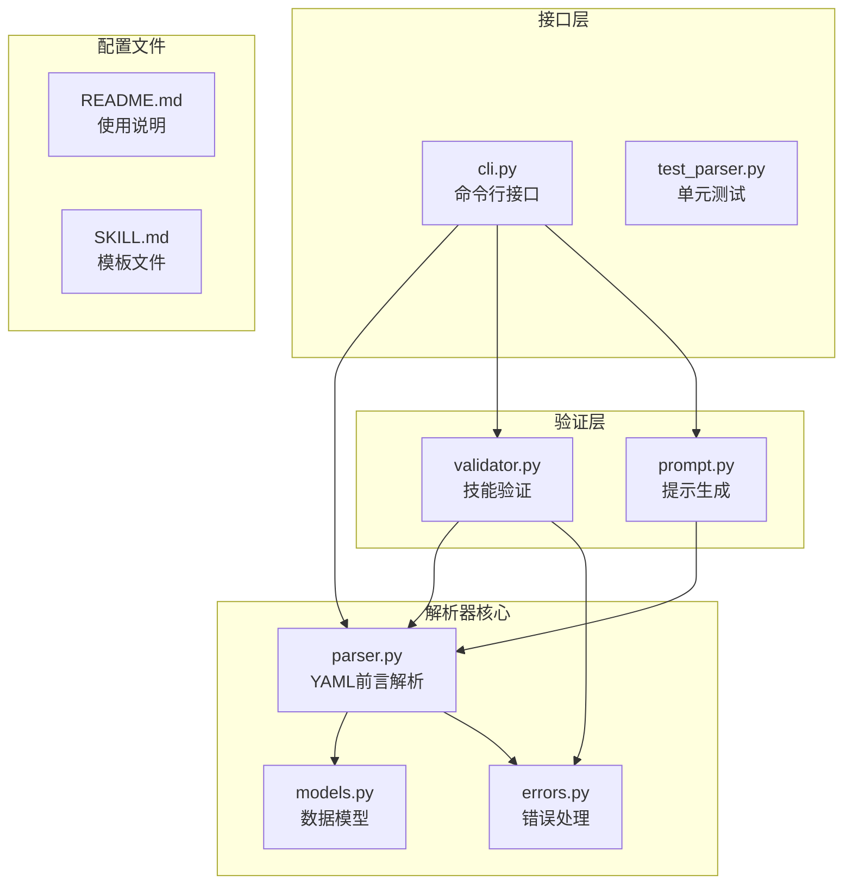
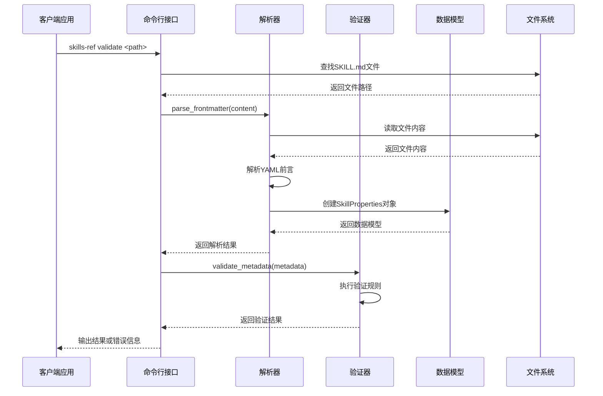
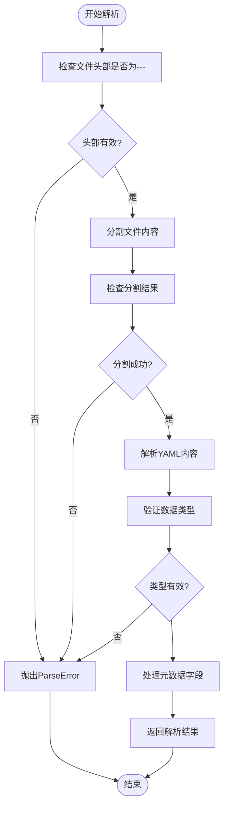
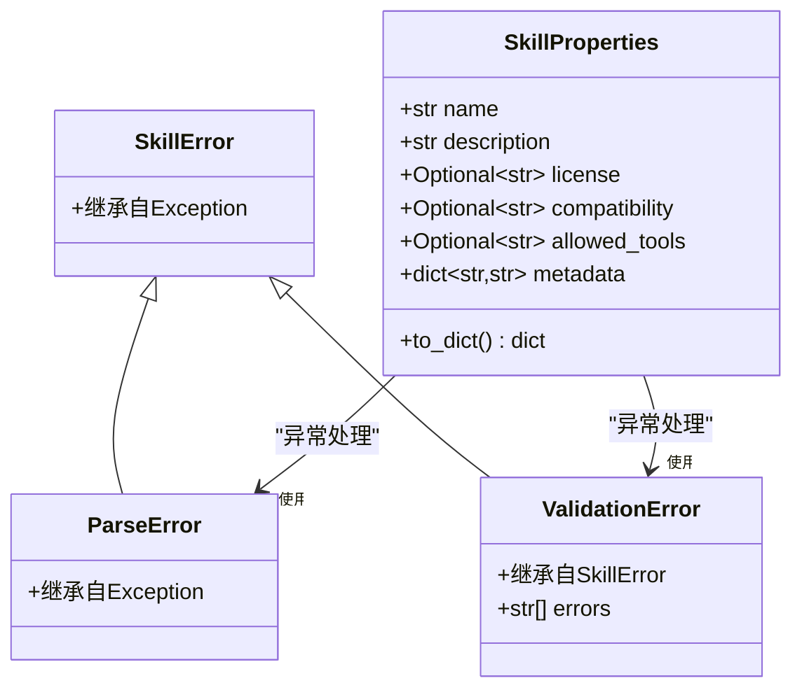
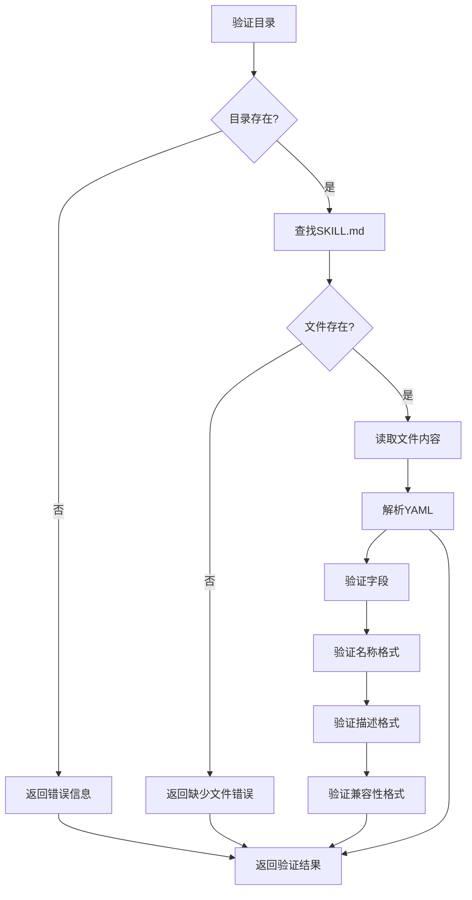
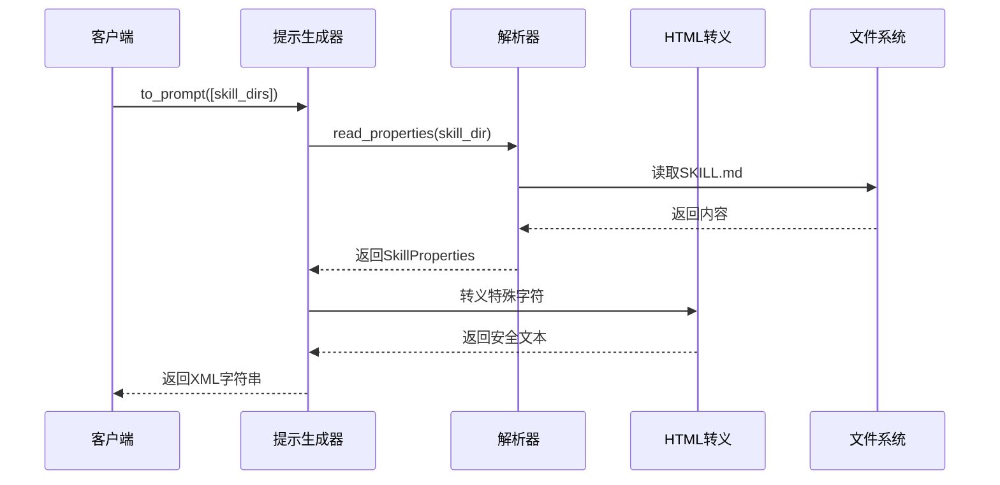
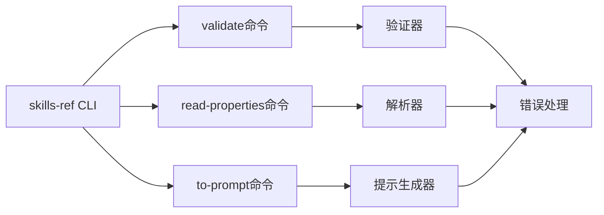
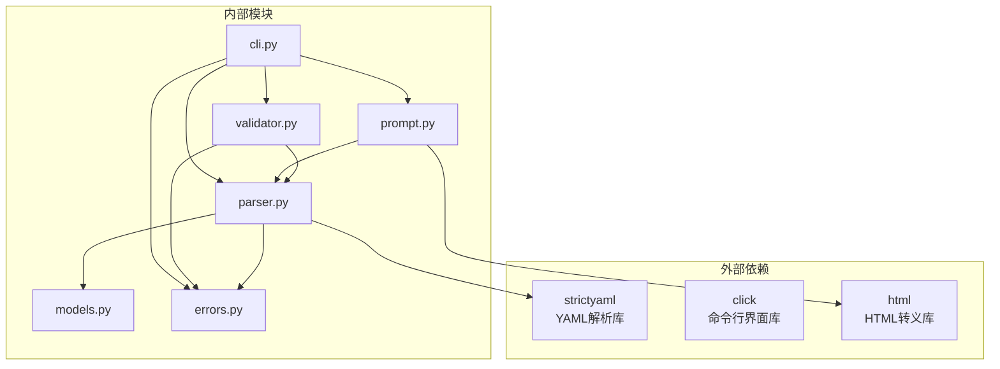

# 解析器组件

<cite>
**本文档引用的文件**
- [parser.py](file://spec/skills-ref/src/skills_ref/parser.py)
- [models.py](file://spec/skills-ref/src/skills_ref/models.py)
- [errors.py](file://spec/skills-ref/src/skills-ref/errors.py)
- [validator.py](file://spec/skills-ref/src/skills_ref/validator.py)
- [cli.py](file://spec/skills-ref/src/skills_ref/cli.py)
- [prompt.py](file://spec/skills-ref/src/skills_ref/prompt.py)
- [test_parser.py](file://spec/skills-ref/tests/test_parser.py)
- [README.md](file://spec/skills-ref/README.md)
- [SKILL.md](file://template/SKILL.md)
- [SKILL.md](file://skills/algorithmic-art/SKILL.md)
- [SKILL.md](file://skills/pptx/SKILL.md)
</cite>

## 目录
1. [简介](#简介)
2. [项目结构](#项目结构)
3. [核心组件](#核心组件)
4. [架构概览](#架构概览)
5. [详细组件分析](#详细组件分析)
6. [依赖关系分析](#依赖关系分析)
7. [性能考虑](#性能考虑)
8. [故障排除指南](#故障排除指南)
9. [结论](#结论)
10. [附录](#附录)

## 简介

解析器组件是技能系统的核心基础设施，负责解析和验证 SKILL.md 文件中的 YAML 前言内容，将其转换为结构化的数据模型。该组件支持多种技能格式，包括算法艺术、演示文稿处理、PDF 处理等，并提供了完整的错误处理和扩展机制。

该解析器采用严格的 YAML 前言解析策略，确保技能元数据的一致性和可靠性。通过标准化的数据模型转换，为上层应用提供了统一的技能信息访问接口。

## 项目结构

解析器组件位于 `spec/skills-ref` 目录下，采用模块化设计，每个功能模块都有明确的职责分工：



**图表来源**
- [parser.py](file://spec/skills-ref/src/skills_ref/parser.py#L1-L113)
- [models.py](file://spec/skills-ref/src/skills_ref/models.py#L1-L40)
- [validator.py](file://spec/skills-ref/src/skills_ref/validator.py#L1-L178)

**章节来源**
- [parser.py](file://spec/skills-ref/src/skills_ref/parser.py#L1-L113)
- [models.py](file://spec/skills-ref/src/skills_ref/models.py#L1-L40)
- [validator.py](file://spec/skills-ref/src/skills_ref/validator.py#L1-L178)

## 核心组件

### YAML 前言解析器

解析器的核心功能是解析 SKILL.md 文件中的 YAML 前言部分，支持标准的 YAML 格式和扩展字段。

**主要特性：**
- 支持 SKILL.md 和 skill.md 两种文件名格式
- 严格的 YAML 语法验证
- 自动类型转换和数据规范化
- 元数据字段的智能处理

### 数据模型系统

采用 `dataclass` 实现的强类型数据模型，提供类型安全的技能属性访问。

**核心属性：**
- `name`: 技能名称（必需）
- `description`: 技能描述（必需）
- `license`: 许可证信息（可选）
- `compatibility`: 兼容性信息（可选）
- `allowed_tools`: 允许的工具（可选）
- `metadata`: 客户端特定属性（默认空字典）

### 错误处理机制

统一的异常层次结构，提供清晰的错误信息和诊断能力。

**异常类型：**
- `ParseError`: YAML 解析失败
- `ValidationError`: 数据验证失败
- `SkillError`: 技能相关基础异常

**章节来源**
- [parser.py](file://spec/skills-ref/src/skills_ref/parser.py#L30-L113)
- [models.py](file://spec/skills-ref/src/skills_ref/models.py#L7-L40)
- [errors.py](file://spec/skills-ref/src/skills-ref/errors.py#L4-L26)

## 架构概览

解析器组件采用分层架构设计，从底层的文件系统操作到高层的应用接口，形成了清晰的抽象层次。



**图表来源**
- [cli.py](file://spec/skills-ref/src/skills_ref/cli.py#L27-L51)
- [parser.py](file://spec/skills-ref/src/skills_ref/parser.py#L30-L64)
- [validator.py](file://spec/skills-ref/src/skills_ref/validator.py#L118-L147)

## 详细组件分析

### YAML 前言解析器

#### 解析流程



**图表来源**
- [parser.py](file://spec/skills-ref/src/skills_ref/parser.py#L30-L64)

#### 关键实现细节

解析器采用严格的状态机模式处理 YAML 前言解析：

1. **文件发现机制**：优先查找大写的 `SKILL.md`，回退到小写的 `skill.md`
2. **内容分割策略**：使用 `split("---", 2)` 确保正确处理多段 YAML
3. **类型安全验证**：确保解析后的数据为字典类型
4. **元数据规范化**：将 `metadata` 字段中的所有键值对转换为字符串

**章节来源**
- [parser.py](file://spec/skills-ref/src/skills_ref/parser.py#L12-L27)
- [parser.py](file://spec/skills-ref/src/skills_ref/parser.py#L42-L64)

### 数据模型转换

#### SkillProperties 类设计



**图表来源**
- [models.py](file://spec/skills-ref/src/skills_ref/models.py#L7-L40)
- [errors.py](file://spec/skills-ref/src/skills-ref/errors.py#L4-L26)

#### 数据转换规则

数据模型提供了灵活的转换机制：

1. **字段映射**：将 `allowed_tools` 转换为 `allowed-tools` 输出
2. **空值过滤**：在 `to_dict()` 中自动过滤 `None` 值
3. **类型约束**：确保所有元数据值都是字符串类型
4. **默认值处理**：为可选字段提供合理的默认行为

**章节来源**
- [models.py](file://spec/skills-ref/src/skills_ref/models.py#L28-L40)

### 验证系统

#### 验证规则体系

验证系统实现了多层次的验证策略：



**图表来源**
- [validator.py](file://spec/skills-ref/src/skills_ref/validator.py#L150-L178)

#### 字段验证规则

验证系统包含以下核心规则：

1. **必需字段验证**：确保 `name` 和 `description` 存在且非空
2. **格式验证**：检查字段格式是否符合规范
3. **长度限制**：应用字符数限制（名称64字符，描述1024字符，兼容性500字符）
4. **字符集验证**：确保名称只包含字母、数字和连字符
5. **目录匹配验证**：确保目录名与技能名称一致

**章节来源**
- [validator.py](file://spec/skills-ref/src/skills_ref/validator.py#L25-L67)
- [validator.py](file://spec/skills-ref/src/skills_ref/validator.py#L70-L84)
- [validator.py](file://spec/skills-ref/src/skills_ref/validator.py#L87-L101)

### 提示生成器

#### XML 输出格式

提示生成器负责将技能信息转换为 XML 格式，供代理系统使用：



**图表来源**
- [prompt.py](file://spec/skills-ref/src/skills_ref/prompt.py#L9-L58)

#### 输出格式规范

生成的 XML 格式遵循 Anthropic 推荐的标准：

```xml
<available_skills>
<skill>
<name>技能名称</name>
<description>技能描述</description>
<location>/path/to/skill/SKILL.md</location>
</skill>
</available_skills>
```

**章节来源**
- [prompt.py](file://spec/skills-ref/src/skills_ref/prompt.py#L9-L58)

### 命令行接口

#### CLI 功能

命令行接口提供了三个核心命令：

1. **validate**: 验证技能目录的有效性
2. **read-properties**: 读取并输出技能属性（JSON 格式）
3. **to-prompt**: 生成代理提示所需的 XML 格式



**图表来源**
- [cli.py](file://spec/skills-ref/src/skills_ref/cli.py#L20-L102)

**章节来源**
- [cli.py](file://spec/skills-ref/src/skills_ref/cli.py#L27-L102)

## 依赖关系分析

解析器组件的依赖关系清晰且模块化：



**图表来源**
- [parser.py](file://spec/skills-ref/src/skills_ref/parser.py#L6-L9)
- [cli.py](file://spec/skills-ref/src/skills_ref/cli.py#L7-L12)

### 第三方库依赖

- **strictyaml**: 提供严格的 YAML 解析功能
- **click**: 构建用户友好的命令行界面
- **dataclasses**: Python 3.7+ 的数据类支持

### 内部模块耦合

模块间的耦合度较低，主要通过清晰的接口进行交互：

- `parser.py` 依赖 `models.py` 和 `errors.py`
- `validator.py` 依赖 `parser.py` 和 `errors.py`
- `prompt.py` 依赖 `parser.py`
- `cli.py` 依赖所有其他模块

**章节来源**
- [parser.py](file://spec/skills-ref/src/skills_ref/parser.py#L3-L9)
- [cli.py](file://spec/skills-ref/src/skills_ref/cli.py#L3-L12)

## 性能考虑

### 解析性能优化

解析器在设计时考虑了性能因素：

1. **延迟加载**: 只在需要时读取文件内容
2. **内存效率**: 使用生成器和迭代器减少内存占用
3. **缓存策略**: 对于重复操作，可以考虑添加缓存机制
4. **并发处理**: 支持批量处理多个技能目录

### 内存使用优化

- YAML 解析使用流式处理，避免一次性加载整个文件
- 数据模型使用 `dataclass`，内存开销较小
- 错误处理使用异常机制，避免不必要的返回值检查

### 扩展性考虑

组件设计支持未来的功能扩展：

- 插件架构：可以轻松添加新的验证规则
- 配置驱动：通过配置文件控制验证行为
- 多格式支持：可以扩展支持其他文档格式

## 故障排除指南

### 常见错误类型

#### YAML 解析错误

**症状**：解析过程中抛出 `ParseError`

**可能原因**：
- YAML 语法错误
- 缺少前言分隔符 `---`
- 前言未正确闭合

**解决方法**：
1. 检查 YAML 语法格式
2. 确认前言部分使用正确的分隔符
3. 验证 YAML 缩进和格式

#### 验证错误

**症状**：验证过程中返回错误列表

**可能原因**：
- 缺少必需字段
- 字段格式不符合要求
- 目录名与技能名称不匹配

**解决方法**：
1. 检查必需字段是否完整
2. 验证字段格式和长度限制
3. 确保目录结构正确

#### 文件系统错误

**症状**：文件不存在或无法读取

**可能原因**：
- SKILL.md 文件缺失
- 权限不足
- 路径错误

**解决方法**：
1. 确认 SKILL.md 文件存在
2. 检查文件权限设置
3. 验证路径是否正确

**章节来源**
- [errors.py](file://spec/skills-ref/src/skills-ref/errors.py#L10-L25)
- [validator.py](file://spec/skills-ref/src/skills_ref/validator.py#L150-L178)

### 调试技巧

1. **启用详细日志**: 使用 `skills-ref validate` 命令查看更多错误信息
2. **逐步验证**: 先验证基本结构，再检查具体字段
3. **使用测试**: 运行单元测试验证解析器功能
4. **检查模板**: 确保 SKILL.md 文件遵循模板格式

## 结论

解析器组件为技能系统提供了强大而灵活的基础架构。通过严格的 YAML 前言解析、类型安全的数据模型和完善的错误处理机制，确保了技能信息的一致性和可靠性。

该组件的主要优势包括：

1. **模块化设计**: 清晰的职责分离和低耦合度
2. **类型安全**: 使用 dataclass 和类型注解确保数据完整性
3. **扩展性**: 支持自定义验证规则和输出格式
4. **易用性**: 提供简洁的命令行接口和 Python API

未来可以考虑的功能增强包括：
- 更丰富的验证规则
- 多格式文档支持
- 缓存和性能优化
- 更详细的错误诊断信息

## 附录

### SKILL.md 文件格式规范

#### 基本结构

```yaml
---
name: 技能名称
description: 技能描述
license: 许可证信息
compatibility: 兼容性信息
allowed-tools: 允许的工具
metadata:
  key: value
---
# 技能标题

## 概述
技能说明...

## 工作流
详细的工作流程...
```

#### 字段说明

| 字段 | 必需 | 类型 | 限制 | 描述 |
|------|------|------|------|------|
| name | 是 | string | ≤64字符 | 技能名称，必须为小写且不含连字符开头或结尾 |
| description | 是 | string | ≤1024字符 | 技能描述，说明用途和触发条件 |
| license | 否 | string | 无限制 | 许可证信息 |
| compatibility | 否 | string | ≤500字符 | 兼容性要求 |
| allowed-tools | 否 | string | 无限制 | 允许使用的工具模式 |
| metadata | 否 | dict | 无限制 | 客户端特定的键值对 |

### 使用示例

#### 命令行使用

```bash
# 验证技能
skills-ref validate ./skills/algorithmic-art

# 读取技能属性
skills-ref read-properties ./skills/pptx

# 生成提示XML
skills-ref to-prompt ./skills/algorithmic-art ./skills/pptx
```

#### Python API 使用

```python
from pathlib import Path
from skills_ref import validate, read_properties, to_prompt

# 验证技能
problems = validate(Path("my-skill"))
if problems:
    print("验证错误:", problems)

# 读取技能属性
props = read_properties(Path("my-skill"))
print(f"技能: {props.name} - {props.description}")

# 生成提示
prompt = to_prompt([Path("skill-a"), Path("skill-b")])
print(prompt)
```

**章节来源**
- [README.md](file://spec/skills-ref/README.md#L53-L86)
- [SKILL.md](file://template/SKILL.md#L1-L59)