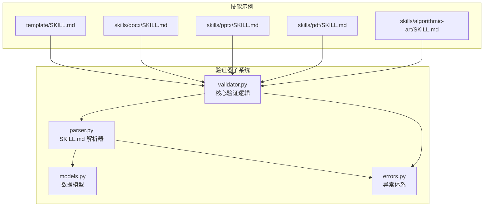
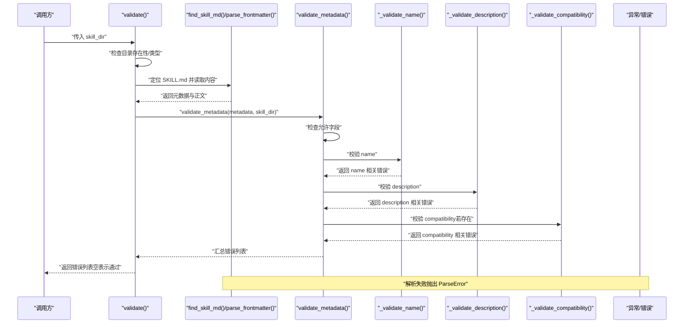
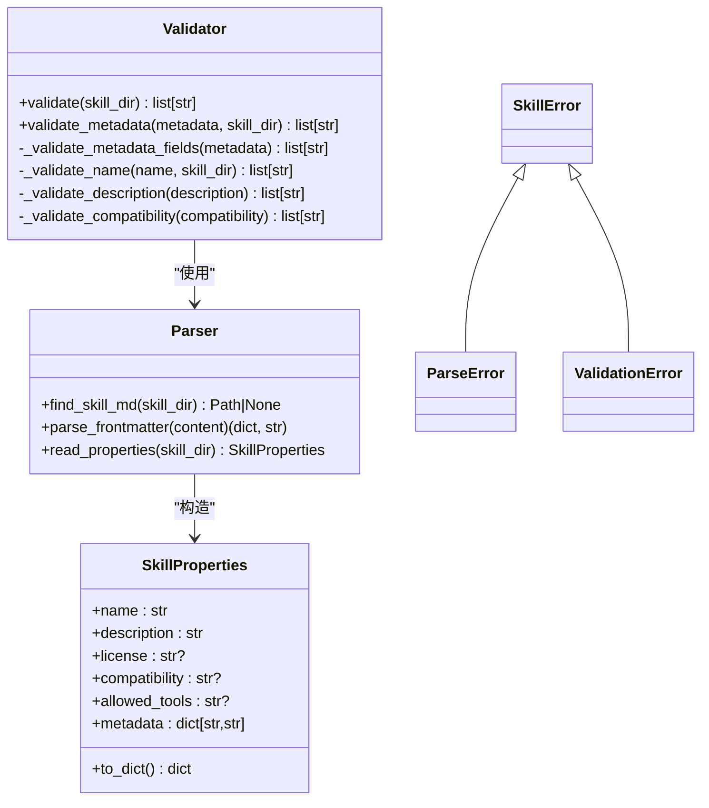
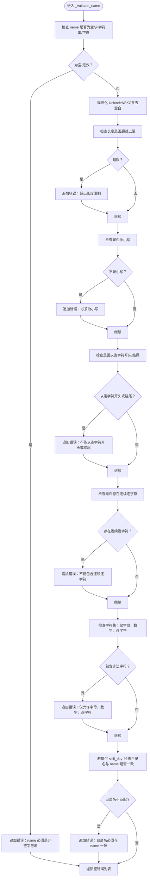
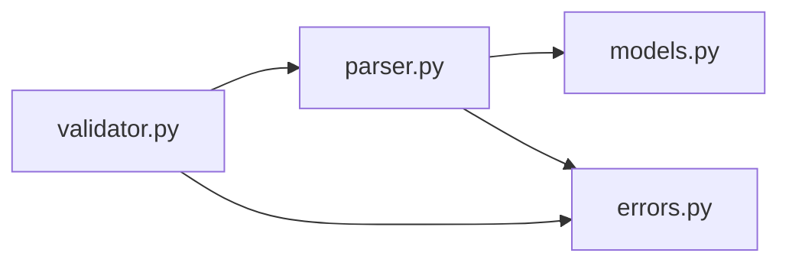

# 验证器组件

<cite>
**本文引用的文件**
- [validator.py](file://spec/skills-ref/src/skills_ref/validator.py)
- [parser.py](file://spec/skills-ref/src/skills_ref/parser.py)
- [models.py](file://spec/skills-ref/src/skills_ref/models.py)
- [errors.py](file://spec/skills-ref/src/skills_ref/errors.py)
- [SKILL.md](file://template/SKILL.md)
- [SKILL.md](file://skills/docx/SKILL.md)
- [SKILL.md](file://skills/pptx/SKILL.md)
- [SKILL.md](file://skills/pdf/SKILL.md)
- [SKILL.md](file://skills/algorithmic-art/SKILL.md)
</cite>

## 目录
1. [简介](#简介)
2. [项目结构](#项目结构)
3. [核心组件](#核心组件)
4. [架构总览](#架构总览)
5. [详细组件分析](#详细组件分析)
6. [依赖关系分析](#依赖关系分析)
7. [性能考量](#性能考量)
8. [故障排查指南](#故障排查指南)
9. [结论](#结论)
10. [附录](#附录)

## 简介
本文件系统化阐述“技能验证器组件”的设计与实现，覆盖验证规则、错误处理机制与扩展方法，并结合 SKILL.md 文件格式与内容约束，给出可操作的验证示例、错误诊断与解决方案。目标是帮助开发者快速理解验证逻辑并在现有基础上进行自定义扩展。

## 项目结构
验证器组件位于 spec/skills-ref 子模块中，围绕 SKILL.md 的 YAML 前言元数据进行解析与校验，主要文件如下：
- validator.py：核心验证逻辑，包含字段合法性、命名规范、长度限制与目录一致性检查
- parser.py：SKILL.md 解析器，负责定位文件、提取前言元数据与正文
- models.py：数据模型，封装从元数据解析出的技能属性
- errors.py：异常体系，区分解析错误与验证错误

图表来源
- [validator.py](file://spec/skills-ref/src/skills_ref/validator.py#L1-L178)
- [parser.py](file://spec/skills-ref/src/skills_ref/parser.py#L1-L113)
- [models.py](file://spec/skills-ref/src/skills_ref/models.py#L1-L40)
- [errors.py](file://spec/skills-ref/src/skills_ref/errors.py#L1-L26)
- [SKILL.md](file://template/SKILL.md#L1-L59)
- [SKILL.md](file://skills/docx/SKILL.md#L1-L197)
- [SKILL.md](file://skills/pptx/SKILL.md#L1-L484)
- [SKILL.md](file://skills/pdf/SKILL.md#L1-L295)
- [SKILL.md](file://skills/algorithmic-art/SKILL.md#L1-L405)

章节来源
- [validator.py](file://spec/skills-ref/src/skills_ref/validator.py#L1-L178)
- [parser.py](file://spec/skills-ref/src/skills_ref/parser.py#L1-L113)
- [models.py](file://spec/skills-ref/src/skills_ref/models.py#L1-L40)
- [errors.py](file://spec/skills-ref/src/skills_ref/errors.py#L1-L26)

## 核心组件
- 验证器入口函数
  - validate(skill_dir)：对外暴露的统一验证入口，完成目录存在性检查、SKILL.md 定位、前言解析与元数据验证
  - validate_metadata(metadata, skill_dir)：对已解析的元数据字典进行字段与值的验证
- 字段级验证器
  - _validate_metadata_fields：检查是否包含未允许的字段
  - _validate_name：校验 name 的字符集、大小写、连字符规则与目录一致性
  - _validate_description：校验 description 的非空与长度上限
  - _validate_compatibility：校验 compatibility 的类型与长度上限
- 解析器
  - find_skill_md：优先匹配大写 SKILL.md，其次 skill.md
  - parse_frontmatter：校验前言边界、类型与转换 metadata 的 metadata 键值为字符串
  - read_properties：读取并返回 SkillProperties 对象（不执行完整验证）
- 数据模型
  - SkillProperties：封装 name、description、license、compatibility、allowed-tools、metadata 等字段
- 异常体系
  - SkillError：基类
  - ParseError：解析失败
  - ValidationError：验证失败（携带错误列表）

章节来源
- [validator.py](file://spec/skills-ref/src/skills_ref/validator.py#L118-L178)
- [validator.py](file://spec/skills-ref/src/skills_ref/validator.py#L25-L147)
- [parser.py](file://spec/skills-ref/src/skills_ref/parser.py#L12-L113)
- [models.py](file://spec/skills-ref/src/skills_ref/models.py#L7-L40)
- [errors.py](file://spec/skills-ref/src/skills_ref/errors.py#L4-L26)

## 架构总览
验证流程从目录开始，逐步完成文件定位、前言解析与元数据验证，最终输出错误列表。下图展示了端到端的调用序列：

图表来源
- [validator.py](file://spec/skills-ref/src/skills_ref/validator.py#L150-L178)
- [validator.py](file://spec/skills-ref/src/skills_ref/validator.py#L118-L147)
- [validator.py](file://spec/skills-ref/src/skills_ref/validator.py#L25-L67)
- [validator.py](file://spec/skills-ref/src/skills_ref/validator.py#L70-L84)
- [validator.py](file://spec/skills-ref/src/skills_ref/validator.py#L87-L101)
- [parser.py](file://spec/skills-ref/src/skills_ref/parser.py#L12-L64)
- [errors.py](file://spec/skills-ref/src/skills_ref/errors.py#L10-L25)

## 详细组件分析

### 验证器类图

图表来源
- [validator.py](file://spec/skills-ref/src/skills_ref/validator.py#L118-L178)
- [parser.py](file://spec/skills-ref/src/skills_ref/parser.py#L67-L113)
- [models.py](file://spec/skills-ref/src/skills_ref/models.py#L7-L40)
- [errors.py](file://spec/skills-ref/src/skills_ref/errors.py#L4-L26)

章节来源
- [validator.py](file://spec/skills-ref/src/skills_ref/validator.py#L118-L178)
- [parser.py](file://spec/skills-ref/src/skills_ref/parser.py#L12-L113)
- [models.py](file://spec/skills-ref/src/skills_ref/models.py#L7-L40)
- [errors.py](file://spec/skills-ref/src/skills_ref/errors.py#L4-L26)

### 字段与命名规则验证流程
以下流程图展示 name 字段的验证过程，其他字段（description、compatibility）采用类似的判定逻辑：

图表来源
- [validator.py](file://spec/skills-ref/src/skills_ref/validator.py#L25-L67)

章节来源
- [validator.py](file://spec/skills-ref/src/skills_ref/validator.py#L25-L67)

### 元数据字段白名单与长度限制
- 允许字段集合：name、description、license、allowed-tools、metadata、compatibility
- 长度限制：
  - name：最大长度 64
  - description：最大长度 1024
  - compatibility：最大长度 500
- 未允许字段将被拒绝

章节来源
- [validator.py](file://spec/skills-ref/src/skills_ref/validator.py#L14-L22)
- [validator.py](file://spec/skills-ref/src/skills_ref/validator.py#L10-L13)

### SKILL.md 文件格式与内容约束
- 前言边界：必须以 "---" 开始与结束，且中间为合法 YAML 映射
- 元数据键值：metadata 下的键与值会被转换为字符串
- 必需字段：name、description（解析阶段即要求）
- 目录一致性：当提供 skill_dir 时，目录名必须与 name 完全一致（大小写、Unicode 规范化后比较）

章节来源
- [parser.py](file://spec/skills-ref/src/skills_ref/parser.py#L30-L64)
- [parser.py](file://spec/skills-ref/src/skills_ref/parser.py#L67-L113)
- [validator.py](file://spec/skills-ref/src/skills_ref/validator.py#L118-L147)

### 实际示例与验证要点
- 模板 SKILL.md：展示了标准的 YAML 前言与中文说明，符合解析与验证要求
- DOCX 技能：包含丰富的正文内容，但前言元数据满足基本要求
- PPTX 技能：前言元数据简洁，符合验证规则
- PDF 技能：前言元数据简洁，符合验证规则
- 算法艺术技能：前言元数据简洁，符合验证规则

章节来源
- [SKILL.md](file://template/SKILL.md#L1-L59)
- [SKILL.md](file://skills/docx/SKILL.md#L1-L197)
- [SKILL.md](file://skills/pptx/SKILL.md#L1-L484)
- [SKILL.md](file://skills/pdf/SKILL.md#L1-L295)
- [SKILL.md](file://skills/algorithmic-art/SKILL.md#L1-L405)

## 依赖关系分析
- 组件内聚与耦合
  - validator.py 依赖 parser.py 提供的文件定位与前言解析能力
  - validator.py 依赖 errors.py 的异常类型
  - parser.py 依赖 models.py 的数据模型
- 外部依赖
  - strictyaml：用于严格解析 YAML 前言
- 潜在循环依赖
  - 当前模块间无循环导入，结构清晰

图表来源
- [validator.py](file://spec/skills-ref/src/skills_ref/validator.py#L7-L8)
- [parser.py](file://spec/skills-ref/src/skills_ref/parser.py#L6-L9)
- [models.py](file://spec/skills-ref/src/skills_ref/models.py#L3-L4)
- [errors.py](file://spec/skills-ref/src/skills_ref/errors.py#L4-L7)

章节来源
- [validator.py](file://spec/skills-ref/src/skills_ref/validator.py#L7-L8)
- [parser.py](file://spec/skills-ref/src/skills_ref/parser.py#L6-L9)
- [models.py](file://spec/skills-ref/src/skills_ref/models.py#L3-L4)
- [errors.py](file://spec/skills-ref/src/skills_ref/errors.py#L4-L7)

## 性能考量
- I/O 次数：validate() 仅在必要时读取 SKILL.md 文件一次，避免重复 I/O
- 解析成本：strictyaml 的解析开销与前言大小成正比，建议控制前言体积
- 字符串处理：Unicode 规范化与长度检查为 O(n) 操作，通常可忽略
- 建议
  - 将复杂逻辑置于 scripts/ 与 references/，保持 SKILL.md 前言精简
  - 合理拆分 metadata，避免过大的键值对

## 故障排查指南
- 常见错误类型
  - 缺失必需字段：name、description
  - 前言格式错误：缺少起止标记、未闭合、非映射类型
  - 非法字段：出现未允许的键
  - 名称不合规：大小写、连字符、字符集、目录不一致
  - 长度过长：name、description、compatibility 超限
- 排查步骤
  - 确认 SKILL.md 存在且大小写正确（优先大写）
  - 检查前言是否以 "---" 正确包裹，且为合法 YAML 映射
  - 核对 name 与目录名一致（含 Unicode 规范化）
  - 控制各字段长度与字符集
- 修复建议
  - 使用模板 SKILL.md 作为起点，确保前言结构与字段齐全
  - 如需扩展元数据，请置于 metadata 下，避免新增顶层字段
  - 若需更严格的 allowed-tools 校验，可在 _validate_metadata_fields 基础上扩展白名单

章节来源
- [validator.py](file://spec/skills-ref/src/skills_ref/validator.py#L118-L147)
- [validator.py](file://spec/skills-ref/src/skills_ref/validator.py#L104-L115)
- [validator.py](file://spec/skills-ref/src/skills_ref/validator.py#L25-L67)
- [validator.py](file://spec/skills-ref/src/skills_ref/validator.py#L70-L84)
- [validator.py](file://spec/skills-ref/src/skills_ref/validator.py#L87-L101)
- [parser.py](file://spec/skills-ref/src/skills_ref/parser.py#L30-L64)
- [SKILL.md](file://template/SKILL.md#L1-L59)

## 结论
验证器组件通过“解析 + 校验”的两阶段设计，实现了对 SKILL.md 前言元数据的强约束与可扩展性。其规则覆盖字段白名单、命名规范、长度限制与目录一致性，既保证了技能包的一致性，又为后续扩展留有空间。建议在实际使用中遵循模板 SKILL.md 的结构，合理组织 metadata，并将复杂逻辑下沉至脚本与参考文档，从而获得最佳的可维护性与可验证性。

## 附录
- 扩展点建议
  - 新增字段校验：在 ALLOWED_FIELDS 中加入新键，并在 validate_metadata 中添加对应 _validate_* 函数
  - 自定义长度限制：在常量区调整 MAX_* 值
  - 更细粒度的 allowed-tools 校验：在 _validate_metadata_fields 基础上增加模式匹配
  - 国际化支持：在 Unicode 规范化策略上进一步细化（当前使用 NFKC）