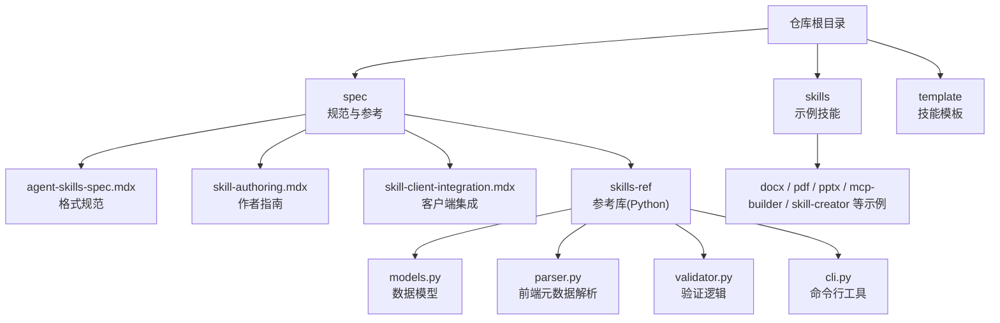
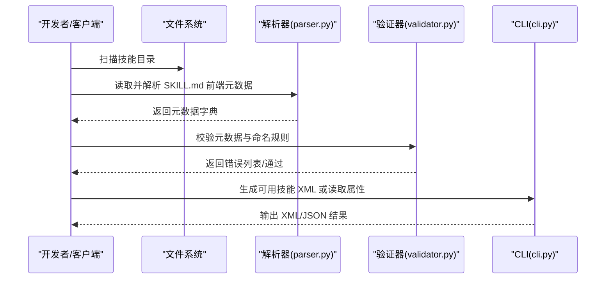
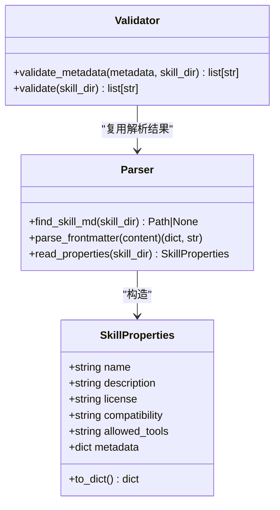
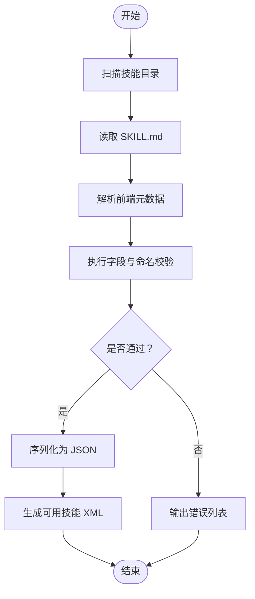
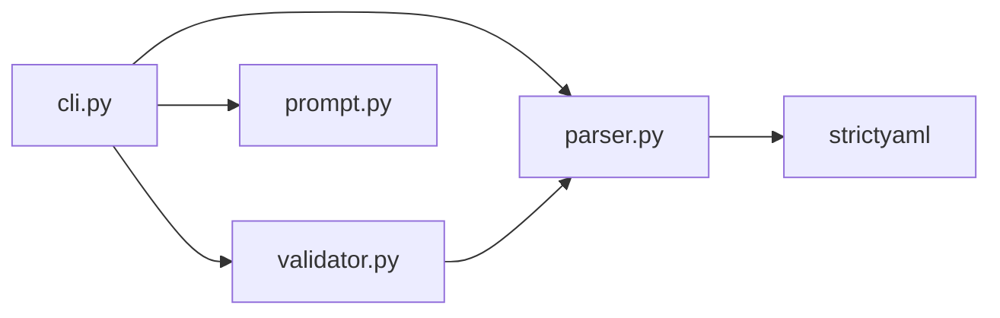

# 技能规范

<cite>
**本文引用的文件**
- [README.md](file://README.md)
- [agent-skills-spec.mdx](file://spec/agent-skills-spec.mdx)
- [skill-authoring.mdx](file://spec/skill-authoring.mdx)
- [skill-client-integration.mdx](file://spec/skill-client-integration.mdx)
- [SKILL.md（模板）](file://template/SKILL.md)
- [SKILL.md（docx 示例）](file://skills/docx/SKILL.md)
- [SKILL.md（pdf 示例）](file://skills/pdf/SKILL.md)
- [SKILL.md（pptx 示例）](file://skills/pptx/SKILL.md)
- [SKILL.md（mcp-builder 示例）](file://skills/mcp-builder/SKILL.md)
- [SKILL.md（skill-creator 示例）](file://skills/skill-creator/SKILL.md)
- [models.py](file://spec/skills-ref/src/skills_ref/models.py)
- [parser.py](file://spec/skills-ref/src/skills_ref/parser.py)
- [validator.py](file://spec/skills-ref/src/skills_ref/validator.py)
- [cli.py](file://spec/skills-ref/src/skills_ref/cli.py)
</cite>

## 目录
1. [简介](#简介)
2. [项目结构](#项目结构)
3. [核心组件](#核心组件)
4. [架构总览](#架构总览)
5. [详细组件分析](#详细组件分析)
6. [依赖关系分析](#依赖关系分析)
7. [性能考量](#性能考量)
8. [故障排查指南](#故障排查指南)
9. [结论](#结论)
10. [附录](#附录)

## 简介
本文件为“技能规范”的权威参考文档，面向技能作者、客户端开发者与集成工程师，系统阐述 Agent Skills 规范、技能格式与字段约束、验证规则、最佳实践、兼容性要求，并提供完整的 API 与集成示例。内容来源于仓库中的规范文档、参考库实现与多类示例技能，确保从概念到落地的一体化指导。

## 项目结构
仓库由三大部分组成：
- 规范与参考：spec 目录包含 Agent Skills 规范、作者指南与客户端集成指南，以及 skills-ref 参考库的 Python 实现。
- 示例技能：skills 目录包含多个领域示例（如 docx、pdf、pptx、mcp-builder 等），展示如何编写高质量 SKILL.md 与组织资源。
- 模板与入口：template 提供标准化 SKILL.md 模板；根目录 README 提供总体说明与使用指引。

图表来源
- [README.md](file://README.md#L1-L95)
- [agent-skills-spec.mdx](file://spec/agent-skills-spec.mdx#L1-L229)
- [skill-client-integration.mdx](file://spec/skill-client-integration.mdx#L1-L100)

章节来源
- [README.md](file://README.md#L1-L95)

## 核心组件
- 规范文档：定义技能目录结构、SKILL.md 前端元数据格式、字段约束、可选目录与资源组织方式、渐进式披露策略与校验建议。
- 参考库（skills-ref）：提供 Python 解析器、验证器与 CLI 工具，支持读取元数据、生成可用技能 XML、校验命名与格式。
- 示例技能：覆盖文档处理、演示文稿、MCP 服务构建、技能创建流程等，体现规范的实际应用与最佳实践。

章节来源
- [agent-skills-spec.mdx](file://spec/agent-skills-spec.mdx#L8-L229)
- [models.py](file://spec/skills-ref/src/skills_ref/models.py#L1-L40)
- [parser.py](file://spec/skills-ref/src/skills_ref/parser.py#L1-L113)
- [validator.py](file://spec/skills-ref/src/skills_ref/validator.py#L1-L178)
- [cli.py](file://spec/skills-ref/src/skills_ref/cli.py#L1-L106)

## 架构总览
Agent Skills 的客户端集成采用“发现-加载元数据-匹配-激活-执行”的渐进式流程，参考库提供解析与验证能力，帮助客户端高效管理技能集合。

图表来源
- [skill-client-integration.mdx](file://spec/skill-client-integration.mdx#L17-L100)
- [parser.py](file://spec/skills-ref/src/skills_ref/parser.py#L30-L113)
- [validator.py](file://spec/skills-ref/src/skills_ref/validator.py#L118-L178)
- [cli.py](file://spec/skills-ref/src/skills_ref/cli.py#L27-L102)

## 详细组件分析

### 1) 规范与格式（Agent Skills 规范）
- 目录结构：最小要求为包含 SKILL.md；可选包含 scripts/、references/、assets/ 等目录。
- SKILL.md 前端元数据（必填）：name、description；可选：license、compatibility、metadata、allowed-tools。
- 字段约束与示例：
  - name：长度 1-64，仅小写字母、数字与连字符，不可以连字符开头或结尾，不可含连续连字符，需与父目录名一致。
  - description：长度 1-1024，需描述技能做什么及何时使用。
  - license：可选，建议简短。
  - compatibility：可选，最多 500 字符，用于声明环境要求。
  - metadata：键值对，客户端可扩展使用。
  - allowed-tools：实验性，空格分隔的工具预批准列表。
- 渐进式披露：元数据（~100 令牌）启动即加载；激活后加载 SKILL.md 主体（建议<5000 令牌）；按需加载 scripts/references/assets。
- 文件引用：相对路径，建议仅一层引用链，避免深层嵌套。

章节来源
- [agent-skills-spec.mdx](file://spec/agent-skills-spec.mdx#L8-L229)

### 2) 参考库（skills-ref）：数据模型与解析
- 数据模型（SkillProperties）：封装 name、description、license、compatibility、allowed-tools、metadata 等字段，并提供 to_dict 序列化。
- 解析器（parse_frontmatter）：从 SKILL.md 中提取前端元数据与正文，支持大小写不敏感的 SKILL.md 文件名查找。
- 验证器（validate_metadata/validate）：执行字段存在性、长度、字符集、目录名一致性等校验，返回错误列表。

图表来源
- [models.py](file://spec/skills-ref/src/skills_ref/models.py#L7-L40)
- [parser.py](file://spec/skills-ref/src/skills_ref/parser.py#L12-L113)
- [validator.py](file://spec/skills-ref/src/skills_ref/validator.py#L25-L178)

章节来源
- [models.py](file://spec/skills-ref/src/skills_ref/models.py#L1-L40)
- [parser.py](file://spec/skills-ref/src/skills_ref/parser.py#L1-L113)
- [validator.py](file://spec/skills-ref/src/skills_ref/validator.py#L1-L178)

### 3) 客户端集成指南
- 集成方式：文件系统型代理（具备 bash 环境）与工具型代理（无专用环境，通过工具触发技能与访问资源）。
- 核心流程：发现技能 → 加载元数据（仅前端元数据）→ 匹配任务 → 激活技能（加载 SKILL.md）→ 执行脚本与访问资源。
- 元数据注入：将技能元数据注入系统提示（推荐 XML 格式），包含 name、description、location（文件系统型代理）。
- 安全考虑：沙箱执行、白名单、用户确认、日志审计。
- 参考实现：skills-ref 提供 CLI 与库函数，便于验证与生成可用技能 XML。

章节来源
- [skill-client-integration.mdx](file://spec/skill-client-integration.mdx#L9-L100)

### 4) 技能作者指南与最佳实践
- 技能本质：由 SKILL.md（元数据+指令）与可选资源组成，强调自解释、可扩展与可移植。
- 渐进式披露：主 SKILL.md 控制在 500 行以内，将详细参考材料放入 references/，脚本放入 scripts/，资源放入 assets/。
- 指令写作：使用祈使句，明确“何时使用”“如何执行”“验证方法”，避免冗长百科。
- 安全与鲁棒：脚本需健壮、错误信息清晰、边界情况处理完善。

章节来源
- [skill-authoring.mdx](file://spec/skill-authoring.mdx#L1-L72)

### 5) 示例技能与参考库联动
- 示例技能（docx/pptx/pdf）展示了：
  - 复杂任务的决策树与工作流拆分；
  - 引用 references/ 与 scripts/ 的方式；
  - 依赖声明与工具链使用。
- 参考库（skills-ref）：
  - CLI 命令：validate、read-properties、to-prompt；
  - 解析与验证：自动检查前端元数据、命名与目录一致性；
  - 输出：JSON 属性与 XML 可用技能清单，便于注入系统提示。

章节来源
- [SKILL.md（docx 示例）](file://skills/docx/SKILL.md#L1-L197)
- [SKILL.md（pptx 示例）](file://skills/pptx/SKILL.md#L1-L484)
- [SKILL.md（pdf 示例）](file://skills/pdf/SKILL.md#L1-L295)
- [SKILL.md（mcp-builder 示例）](file://skills/mcp-builder/SKILL.md#L1-L237)
- [SKILL.md（skill-creator 示例）](file://skills/skill-creator/SKILL.md#L1-L357)
- [cli.py](file://spec/skills-ref/src/skills_ref/cli.py#L27-L102)

### 6) API 与集成示例（基于参考库）
- 命令行接口（skills-ref）：
  - 校验技能：skills-ref validate <路径>
  - 读取属性：skills-ref read-properties <路径>
  - 生成可用技能 XML：skills-ref to-prompt <路径1> <路径2> ...
- 解析与验证流程（代码级）：
  - 读取 SKILL.md 并解析前端元数据；
  - 校验字段存在性、长度、字符集与目录一致性；
  - 输出 JSON 或 XML 供客户端使用。

图表来源
- [cli.py](file://spec/skills-ref/src/skills_ref/cli.py#L27-L102)
- [parser.py](file://spec/skills-ref/src/skills_ref/parser.py#L67-L113)
- [validator.py](file://spec/skills-ref/src/skills_ref/validator.py#L150-L178)

## 依赖关系分析
- 组件耦合：
  - parser.py 依赖 strictyaml 进行前端元数据解析；
  - validator.py 依赖 parser.py 的解析结果进行二次校验；
  - cli.py 聚合 parser、validator 与 prompt 工具，提供命令行入口。
- 外部依赖：
  - strictyaml：YAML 解析；
  - click：命令行参数与子命令；
  - 标准库：pathlib、json、unicodedata 等。

图表来源
- [cli.py](file://spec/skills-ref/src/skills_ref/cli.py#L1-L106)
- [parser.py](file://spec/skills-ref/src/skills_ref/parser.py#L1-L113)
- [validator.py](file://spec/skills-ref/src/skills_ref/validator.py#L1-L178)

章节来源
- [cli.py](file://spec/skills-ref/src/skills_ref/cli.py#L1-L106)
- [parser.py](file://spec/skills-ref/src/skills_ref/parser.py#L1-L113)
- [validator.py](file://spec/skills-ref/src/skills_ref/validator.py#L1-L178)

## 性能考量
- 上下文窗口管理：严格遵守渐进式披露，元数据常驻，SKILL.md 激活时加载，资源按需加载。
- 文件组织：将长文档与复杂实现放入 references/ 与 scripts/，减少 SKILL.md 体积。
- 客户端提示注入：控制每个技能元数据的令牌开销（约 50-100 令牌），避免过度膨胀。

章节来源
- [agent-skills-spec.mdx](file://spec/agent-skills-spec.mdx#L197-L206)
- [skill-client-integration.mdx](file://spec/skill-client-integration.mdx#L49-L73)

## 故障排查指南
- 常见错误类型：
  - 缺失 SKILL.md 或前端元数据格式错误；
  - name 非法（大小写、字符、连字符规则、与目录名不一致）；
  - description 超长或为空；
  - compatibility 超长；
  - 前端元数据出现未允许字段。
- 排查步骤：
  - 使用 skills-ref validate 校验技能目录；
  - 使用 skills-ref read-properties 获取规范化 JSON；
  - 使用 skills-ref to-prompt 生成 XML，核对注入系统提示的结构。
- 安全与执行：
  - 对脚本执行进行沙箱与白名单控制；
  - 记录脚本执行日志，便于审计与回溯。

章节来源
- [validator.py](file://spec/skills-ref/src/skills_ref/validator.py#L118-L178)
- [cli.py](file://spec/skills-ref/src/skills_ref/cli.py#L27-L102)
- [skill-client-integration.mdx](file://spec/skill-client-integration.mdx#L74-L82)

## 结论
本规范文档以 Agent Skills 标准为核心，结合参考库实现与示例技能，提供了从设计、开发、验证到集成的完整闭环。遵循渐进式披露、严格的字段约束与最佳实践，可显著提升技能的可维护性、可移植性与安全性，同时降低客户端的上下文与执行成本。

## 附录

### A. 字段约束与示例对照表
- name：长度 1-64，小写字母、数字与连字符，不可首尾连字符，不可连续连字符，需与目录名一致。
- description：长度 1-1024，需描述“做什么”和“何时使用”。
- license：可选，建议简短。
- compatibility：可选，最多 500 字符，用于声明环境要求。
- metadata：键值对，客户端扩展使用。
- allowed-tools：实验性，空格分隔的工具预批准列表。

章节来源
- [agent-skills-spec.mdx](file://spec/agent-skills-spec.mdx#L47-L158)

### B. 示例技能要点摘录
- docx：强调“强制读取完整文件”的引用策略、OOXML 编辑与红lining 流程、转换与图像化分析。
- pdf：提供多种库与命令行工具的快速参考、OCR、加水印、加密等常见任务。
- pptx：HTML→PPTX 工作流、模板分析与替换、缩略图生成与可视化校验。
- mcp-builder：MCP 服务器设计原则、工具命名与描述、输入/输出模式、评估与测试。
- skill-creator：技能创建流程、渐进式披露模式、资源组织与打包。

章节来源
- [SKILL.md（docx 示例）](file://skills/docx/SKILL.md#L1-L197)
- [SKILL.md（pdf 示例）](file://skills/pdf/SKILL.md#L1-L295)
- [SKILL.md（pptx 示例）](file://skills/pptx/SKILL.md#L1-L484)
- [SKILL.md（mcp-builder 示例）](file://skills/mcp-builder/SKILL.md#L1-L237)
- [SKILL.md（skill-creator 示例）](file://skills/skill-creator/SKILL.md#L1-L357)

### C. 参考库命令速查
- skills-ref validate <路径>：校验技能目录与前端元数据。
- skills-ref read-properties <路径>：输出规范化 JSON。
- skills-ref to-prompt <路径1> ...：<生成可用技能 XML，便于注入系统提示。

章节来源
- [cli.py](file://spec/skills-ref/src/skills_ref/cli.py#L27-L102)