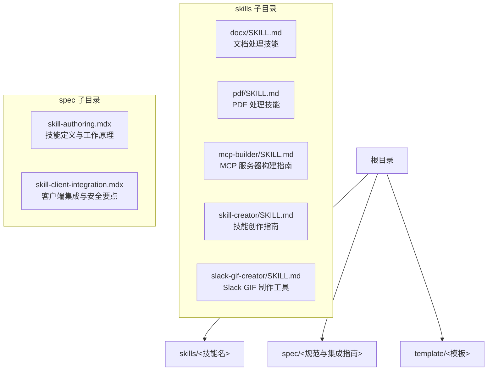
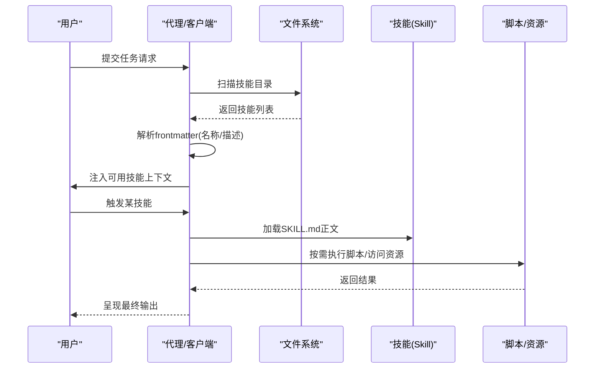
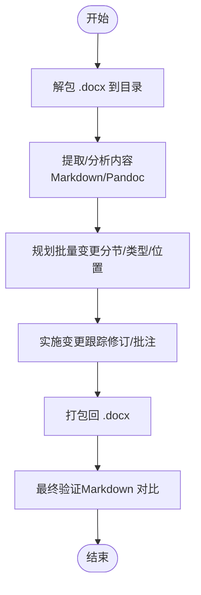
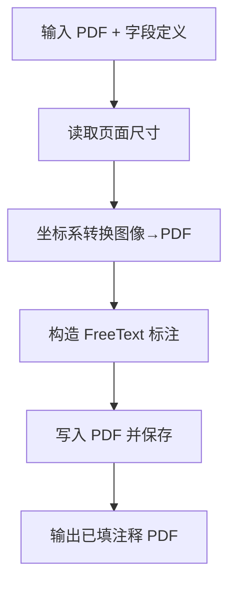
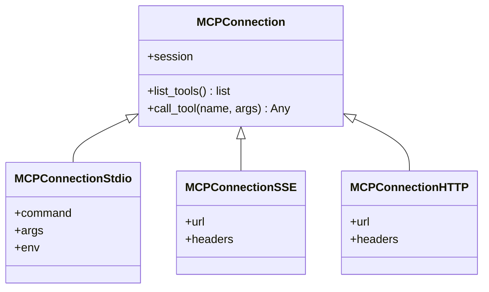
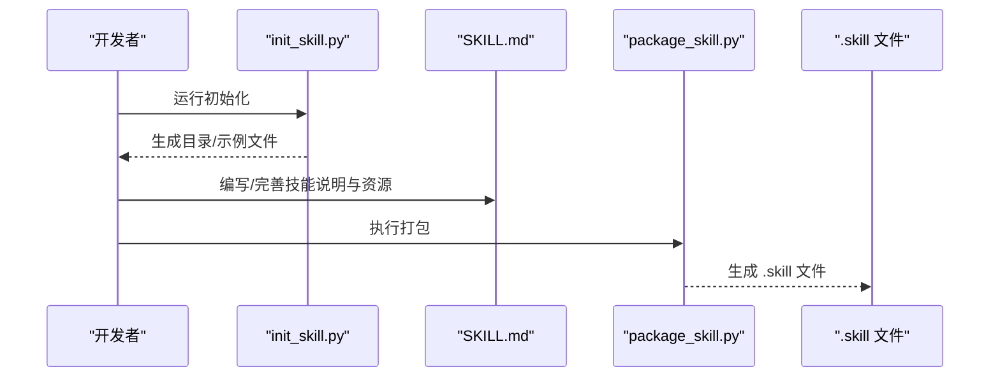
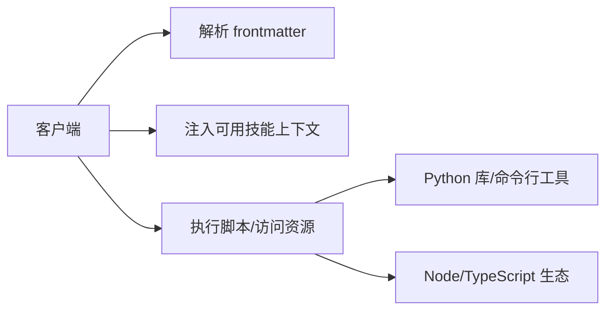

# 故障排除

<cite>
**本文引用的文件**
- [README.md](file://README.md)
- [spec/skill-authoring.mdx](file://spec/skill-authoring.mdx)
- [spec/skill-client-integration.mdx](file://spec/skill-client-integration.mdx)
- [skills/pdf/SKILL.md](file://skills/pdf/SKILL.md)
- [skills/docx/SKILL.md](file://skills/docx/SKILL.md)
- [skills/mcp-builder/SKILL.md](file://skills/mcp-builder/SKILL.md)
- [skills/skill-creator/SKILL.md](file://skills/skill-creator/SKILL.md)
- [skills/slack-gif-creator/SKILL.md](file://skills/slack-gif-creator/SKILL.md)
- [skills/skill-creator/scripts/init_skill.py](file://skills/skill-creator/scripts/init_skill.py)
- [skills/skill-creator/scripts/package_skill.py](file://skills/skill-creator/scripts/package_skill.py)
- [skills/pdf/scripts/fill_pdf_form_with_annotations.py](file://skills/pdf/scripts/fill_pdf_form_with_annotations.py)
- [skills/docx/scripts/document.py](file://skills/docx/scripts/document.py)
- [skills/mcp-builder/scripts/connections.py](file://skills/mcp-builder/scripts/connections.py)
</cite>

## 目录
1. [简介](#简介)
2. [项目结构](#项目结构)
3. [核心组件](#核心组件)
4. [架构总览](#架构总览)
5. [详细组件分析](#详细组件分析)
6. [依赖关系分析](#依赖关系分析)
7. [性能考虑](#性能考虑)
8. [故障排除指南](#故障排除指南)
9. [结论](#结论)
10. [附录](#附录)

## 简介
本指南面向使用与维护“技能系统”的工程师与技术作者，聚焦于在实际集成与运行中可能遇到的问题，提供系统化的故障排除流程、常见问题解答、错误诊断与修复方案、性能优化建议、调试技巧、日志分析方法、问题预防与最佳实践，并按技能类型（文档处理、PDF 表单、MCP 服务器、GIF 制作等）给出差异化策略。

## 项目结构
该仓库包含多类技能示例与规范说明，核心由以下部分组成：
- skills：各类技能示例，涵盖文档处理、PDF、MCP 构建、GIF 制作、品牌规范等
- spec：技能规范与客户端集成指南
- template：技能模板

图表来源
- [README.md](file://README.md#L1-L95)
- [spec/skill-authoring.mdx](file://spec/skill-authoring.mdx#L1-L72)
- [spec/skill-client-integration.mdx](file://spec/skill-client-integration.mdx#L1-L100)

章节来源
- [README.md](file://README.md#L1-L95)
- [spec/skill-authoring.mdx](file://spec/skill-authoring.mdx#L1-L72)
- [spec/skill-client-integration.mdx](file://spec/skill-client-integration.mdx#L1-L100)

## 核心组件
- 技能元数据与指令：每个技能以 SKILL.md 作为入口，包含 YAML frontmatter（name、description）与正文指令
- 渐进披露机制：仅在触发时加载 SKILL.md 正文，避免上下文膨胀
- 资源组织：可选 scripts/（可执行脚本）、references/（参考文档）、assets/（输出资源）
- 客户端集成：支持文件系统型与工具型两类集成路径；强调元数据解析、可用技能注入上下文、脚本执行安全

章节来源
- [spec/skill-authoring.mdx](file://spec/skill-authoring.mdx#L16-L64)
- [spec/skill-client-integration.mdx](file://spec/skill-client-integration.mdx#L19-L73)

## 架构总览
技能系统在客户端侧的典型生命周期：
- 发现：扫描配置目录，识别有效技能
- 加载元数据：解析 SKILL.md frontmatter，生成可用技能清单
- 匹配：根据任务描述匹配合适技能
- 激活：将 SKILL.md 正文加载到上下文
- 执行：按需访问 bundled 资源或执行脚本

图表来源
- [spec/skill-client-integration.mdx](file://spec/skill-client-integration.mdx#L19-L73)

章节来源
- [spec/skill-client-integration.mdx](file://spec/skill-client-integration.mdx#L19-L73)

## 详细组件分析

### 文档处理（DOCX）技能
- 关键点：OOXML 解包/打包、跟踪修订、批注、文本提取、图像转换
- 典型流程：解包 → 分析 → 批量变更（分批）→ 打包 → 验证
- 参考文件：docx/SKILL.md、docx/scripts/document.py

图表来源
- [skills/docx/SKILL.md](file://skills/docx/SKILL.md#L75-L154)
- [skills/docx/scripts/document.py](file://skills/docx/scripts/document.py#L612-L800)

章节来源
- [skills/docx/SKILL.md](file://skills/docx/SKILL.md#L75-L154)
- [skills/docx/scripts/document.py](file://skills/docx/scripts/document.py#L612-L800)

### PDF 处理（含表单）技能
- 关键点：合并/拆分/旋转/元数据、文本与表格提取、命令行工具、表单标注填充
- 参考文件：pdf/SKILL.md、pdf/scripts/fill_pdf_form_with_annotations.py

图表来源
- [skills/pdf/scripts/fill_pdf_form_with_annotations.py](file://skills/pdf/scripts/fill_pdf_form_with_annotations.py#L11-L98)

章节来源
- [skills/pdf/SKILL.md](file://skills/pdf/SKILL.md#L1-L295)
- [skills/pdf/scripts/fill_pdf_form_with_annotations.py](file://skills/pdf/scripts/fill_pdf_form_with_annotations.py#L1-L108)

### MCP 服务器构建技能
- 关键点：设计阶段（API 覆盖 vs 工作流工具、命名与发现、上下文管理、错误消息）、实现阶段（基础设施、工具实现、注解）、测试与评估
- 参考文件：mcp-builder/SKILL.md、mcp-builder/scripts/connections.py

图表来源
- [skills/mcp-builder/scripts/connections.py](file://skills/mcp-builder/scripts/connections.py#L13-L152)

章节来源
- [skills/mcp-builder/SKILL.md](file://skills/mcp-builder/SKILL.md#L1-L237)
- [skills/mcp-builder/scripts/connections.py](file://skills/mcp-builder/scripts/connections.py#L1-L152)

### 技能创作（模板与打包）
- 关键点：初始化模板、资源组织、打包校验、发布
- 参考文件：skill-creator/SKILL.md、skill-creator/scripts/init_skill.py、skill-creator/scripts/package_skill.py

图表来源
- [skills/skill-creator/scripts/init_skill.py](file://skills/skill-creator/scripts/init_skill.py#L194-L271)
- [skills/skill-creator/scripts/package_skill.py](file://skills/skill-creator/scripts/package_skill.py#L19-L83)

章节来源
- [skills/skill-creator/SKILL.md](file://skills/skill-creator/SKILL.md#L202-L357)
- [skills/skill-creator/scripts/init_skill.py](file://skills/skill-creator/scripts/init_skill.py#L1-L304)
- [skills/skill-creator/scripts/package_skill.py](file://skills/skill-creator/scripts/package_skill.py#L1-L111)

### Slack GIF 制作技能
- 关键点：尺寸/帧率/颜色数/时长约束、动画概念（抖动/脉冲/弹跳/旋转/淡入淡出/滑动/缩放/爆炸）、优化策略、依赖安装
- 参考文件：slack-gif-creator/SKILL.md

章节来源
- [skills/slack-gif-creator/SKILL.md](file://skills/slack-gif-creator/SKILL.md#L1-L255)

## 依赖关系分析
- 客户端集成依赖：解析 frontmatter、注入可用技能 XML、脚本执行安全、沙箱/白名单/确认/审计日志
- 技能内部依赖：Python 库（如 pypdf、pdfplumber、reportlab、defusedxml）、命令行工具（poppler、LibreOffice）、Node/TypeScript 生态（MCP SDK）

图表来源
- [spec/skill-client-integration.mdx](file://spec/skill-client-integration.mdx#L35-L100)

章节来源
- [spec/skill-client-integration.mdx](file://spec/skill-client-integration.mdx#L35-L100)

## 性能考虑
- 上下文窗口管理：遵循渐进披露原则，SKILL.md 正文控制在合理长度，将复杂参考材料置于 references/ 并按需加载
- 脚本执行：优先使用本地可执行脚本，减少重复编写带来的上下文开销
- 资源复用：assets/ 中的输出资源不加载到上下文，避免 token 消耗
- 客户端层面：仅在必要时加载 SKILL.md 正文，避免一次性加载过多技能

章节来源
- [spec/skill-authoring.mdx](file://spec/skill-authoring.mdx#L16-L64)
- [skills/skill-creator/SKILL.md](file://skills/skill-creator/SKILL.md#L114-L201)

## 故障排除指南

### 通用问题排查清单
- 技能未被发现
  - 检查技能目录是否被正确扫描
  - 确认 SKILL.md 是否存在且 frontmatter 是否完整
  - 校验目录权限与路径拼接
- 技能未被激活
  - 检查任务描述是否与 description 匹配
  - 确认客户端是否正确注入可用技能上下文
- 执行失败
  - 查看脚本返回码与标准输出/错误输出
  - 检查依赖安装与版本兼容性
  - 确认资源路径与相对/绝对路径一致性
- 安全与权限
  - 脚本执行是否在受控环境中进行
  - 是否启用白名单与审计日志
  - 是否对危险操作进行用户确认

章节来源
- [spec/skill-client-integration.mdx](file://spec/skill-client-integration.mdx#L74-L100)

### 文档处理（DOCX）常见问题
- 问题：跟踪修订未生效或格式错乱
  - 排查：确保使用正确的 OOXML 结构与 RSID 注入；分批应用变更并逐步验证
  - 参考：文档库提供的建议插入/删除封装方法
- 问题：批注范围不正确
  - 排查：检查 commentRangeStart/commentRangeEnd 的插入顺序与闭合；确认 comments.xml 同步更新
- 问题：打包后文件损坏
  - 排查：先用 pack 脚本生成临时 .docx 进行基线对比，再进行最终打包

章节来源
- [skills/docx/SKILL.md](file://skills/docx/SKILL.md#L75-L154)
- [skills/docx/scripts/document.py](file://skills/docx/scripts/document.py#L612-L800)

### PDF 处理（含表单）常见问题
- 问题：表单字段坐标不匹配
  - 排查：确认输入图片尺寸与 PDF 页面尺寸一致；检查坐标变换逻辑
- 问题：字体/字号/颜色显示异常
  - 排查：跨查看器兼容性差异；可尝试简化样式或改用更稳定的渲染方式
- 问题：填充后 PDF 无法打开
  - 排查：确保所有页面复制到 writer 并正确写入；检查注释添加是否越界

章节来源
- [skills/pdf/scripts/fill_pdf_form_with_annotations.py](file://skills/pdf/scripts/fill_pdf_form_with_annotations.py#L11-L98)
- [skills/pdf/SKILL.md](file://skills/pdf/SKILL.md#L1-L295)

### MCP 服务器构建常见问题
- 问题：连接失败（stdio/sse/http）
  - 排查：确认 transport 类型与参数（命令、URL、头信息）；检查服务端可达性与认证
- 问题：工具列表为空或调用报错
  - 排查：确认服务端初始化完成；检查工具注册与输入/输出模式；核对客户端会话状态
- 问题：性能瓶颈
  - 排查：选择合适的传输（流式 HTTP 更易扩展）；对工具进行分页与缓存；限制并发

章节来源
- [skills/mcp-builder/scripts/connections.py](file://skills/mcp-builder/scripts/connections.py#L13-L152)
- [skills/mcp-builder/SKILL.md](file://skills/mcp-builder/SKILL.md#L1-L237)

### 技能创作与打包常见问题
- 问题：初始化失败
  - 排查：确认目录不存在冲突；检查权限；遵循命名规则（小写、连字符）
- 问题：打包失败
  - 排查：先通过内置校验脚本定位问题；修正 frontmatter 与目录结构后再打包
- 问题：分发后不可用
  - 排查：确认 .skill 文件包含完整目录结构；在目标环境重新解压验证

章节来源
- [skills/skill-creator/scripts/init_skill.py](file://skills/skill-creator/scripts/init_skill.py#L194-L271)
- [skills/skill-creator/scripts/package_skill.py](file://skills/skill-creator/scripts/package_skill.py#L19-L83)
- [skills/skill-creator/SKILL.md](file://skills/skill-creator/SKILL.md#L202-L357)

### Slack GIF 制作常见问题
- 问题：尺寸/帧率/颜色数不符合要求
  - 排查：严格遵守尺寸与参数约束；必要时降低 FPS/颜色数/时长
- 问题：文件过大
  - 排查：启用去重、Emoji 模式自动优化；减少帧数/颜色/尺寸
- 问题：动画效果不自然
  - 排查：使用缓动函数；组合多种概念（如弹跳+旋转）提升表现力

章节来源
- [skills/slack-gif-creator/SKILL.md](file://skills/slack-gif-creator/SKILL.md#L11-L255)

### 调试技巧与日志分析
- 前端/后端日志
  - 记录技能发现、元数据解析、激活、执行各阶段的时间戳与关键参数
  - 对脚本执行记录输入/输出与返回码
- 客户端上下文
  - 校验注入的可用技能 XML 是否包含 name/description/location
  - 控制每次注入的 token 数量，避免超限
- 资源访问
  - 明确 scripts/ 与 references/assets/ 的职责边界，避免重复加载
- 安全审计
  - 记录脚本执行事件（命令、参数、用户确认），便于回溯

章节来源
- [spec/skill-client-integration.mdx](file://spec/skill-client-integration.mdx#L53-L100)

### 性能优化建议
- 减少上下文占用
  - 将长篇参考文档放入 references/ 并按需加载
  - 使用 scripts/ 执行确定性任务，避免重复编写
- 资源与依赖
  - 在 assets/ 放置输出资源，不在上下文中加载
  - 统一管理依赖版本，避免重复安装
- 执行效率
  - 对大文件操作采用分块/分页策略
  - 使用流式传输（如 HTTP SSE）提升响应速度

章节来源
- [skills/skill-creator/SKILL.md](file://skills/skill-creator/SKILL.md#L114-L201)
- [spec/skill-client-integration.mdx](file://spec/skill-client-integration.mdx#L74-L100)

### 社区支持与最佳实践
- 参考官方文档与示例仓库，遵循渐进披露与最小化上下文的原则
- 在开发与测试阶段使用评估与验证工具，确保技能质量
- 对外分发前进行打包校验，保证 .skill 文件完整性

章节来源
- [README.md](file://README.md#L1-L95)
- [skills/skill-creator/SKILL.md](file://skills/skill-creator/SKILL.md#L202-L357)

## 结论
通过遵循渐进披露、明确资源边界、强化安全与审计、结合分场景的故障排除策略，可以显著提升技能系统的稳定性与可维护性。建议在团队内建立标准化的创作、打包与评估流程，并持续积累问题案例与修复经验，形成知识沉淀。

## 附录
- 快速检查清单
  - 目录结构与命名是否符合规范
  - SKILL.md frontmatter 是否完整
  - references/assets/scripts 是否按需组织
  - 客户端是否正确注入可用技能上下文
  - 脚本执行是否在受控环境中进行
  - 是否启用审计日志与用户确认