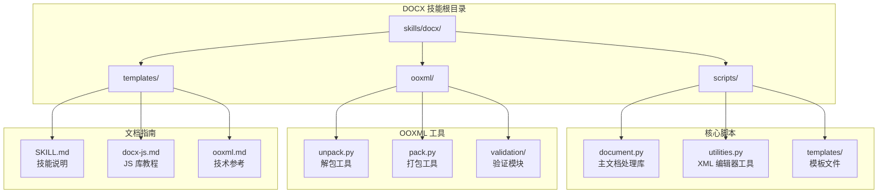
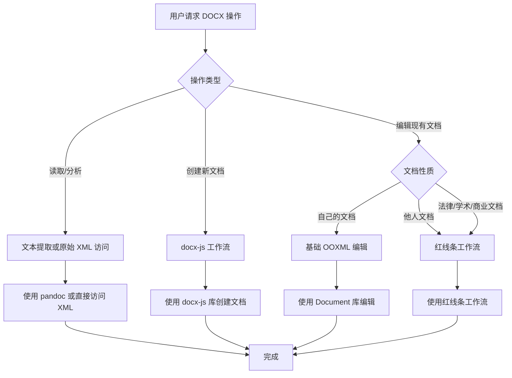
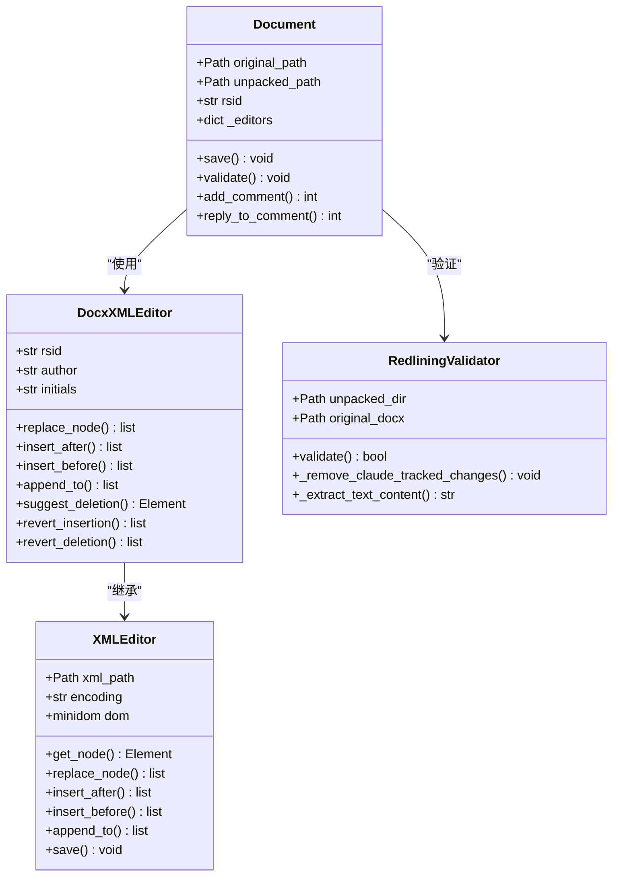
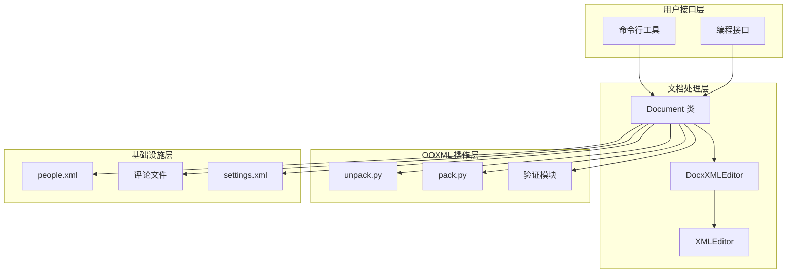
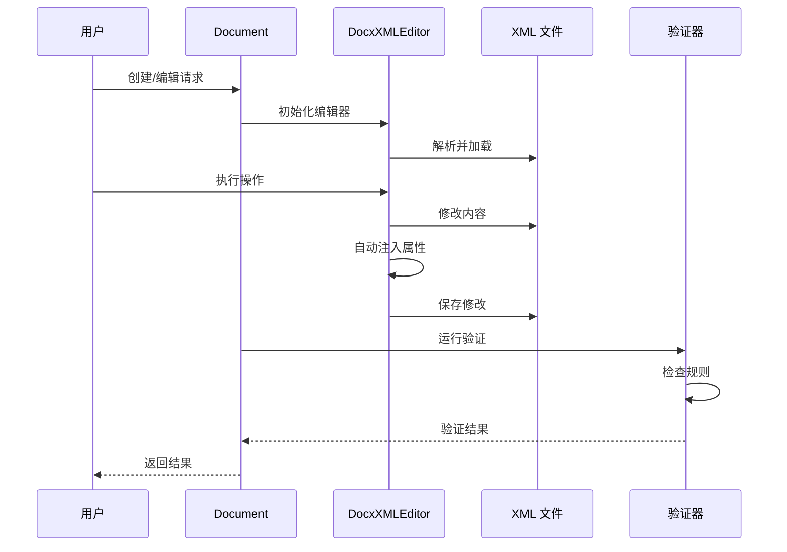
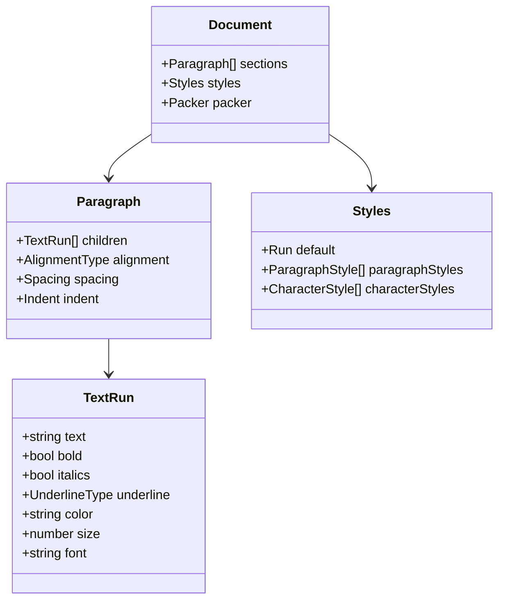
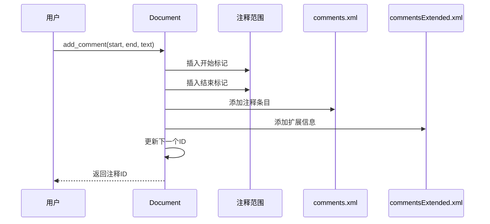
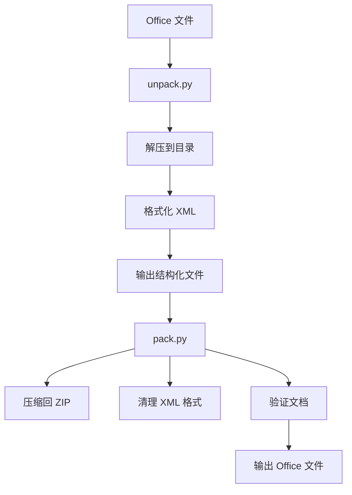
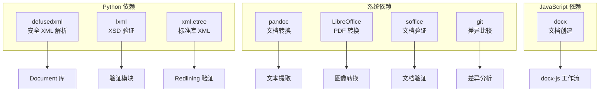
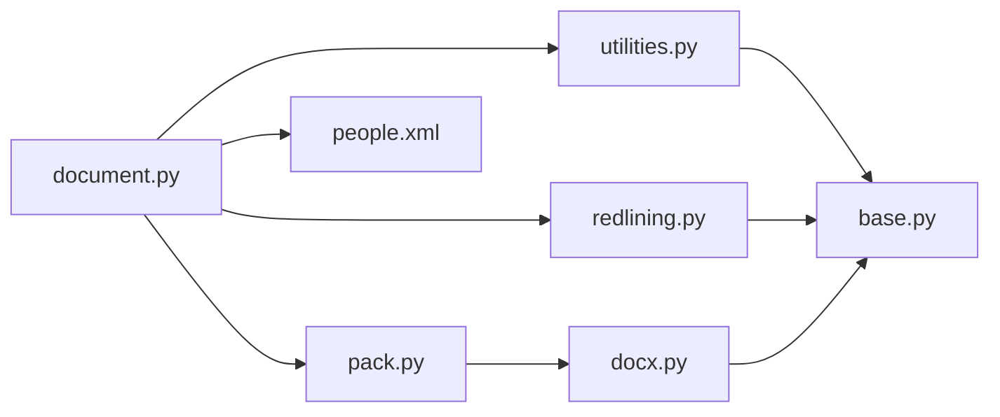

# DOCX 文档处理

<cite>
**本文档引用的文件**
- [SKILL.md](file://skills/docx/SKILL.md)
- [docx-js.md](file://skills/docx/docx-js.md)
- [ooxml.md](file://skills/docx/ooxml.md)
- [document.py](file://skills/docx/scripts/document.py)
- [utilities.py](file://skills/docx/scripts/utilities.py)
- [unpack.py](file://skills/docx/ooxml/scripts/unpack.py)
- [pack.py](file://skills/docx/ooxml/scripts/pack.py)
- [redlining.py](file://skills/docx/ooxml/scripts/validation/redlining.py)
- [base.py](file://skills/docx/ooxml/scripts/validation/base.py)
- [docx.py](file://skills/docx/ooxml/scripts/validation/docx.py)
- [people.xml](file://skills/docx/scripts/templates/people.xml)
</cite>

## 目录
1. [简介](#简介)
2. [项目结构](#项目结构)
3. [核心组件](#核心组件)
4. [架构概览](#架构概览)
5. [详细组件分析](#详细组件分析)
6. [依赖关系分析](#依赖关系分析)
7. [性能考虑](#性能考虑)
8. [故障排除指南](#故障排除指南)
9. [结论](#结论)

## 简介

DOCX 文档处理技能提供了完整的 .docx 文件创建、编辑、分析和处理能力。该技能支持跟踪变更（红线条）、注释处理、文本提取、格式保持等核心功能，涵盖了从简单文档创建到复杂法律文档审查的全场景应用。

该技能基于两种主要技术栈：
- **JavaScript/TypeScript**: 使用 docx-js 库进行新文档创建
- **Python**: 使用自定义 Document 库进行现有文档编辑和 OOXML 操作

## 项目结构

**图表来源**
- [SKILL.md](file://skills/docx/SKILL.md#L1-L197)
- [document.py](file://skills/docx/scripts/document.py#L1-L50)
- [utilities.py](file://skills/docx/scripts/utilities.py#L1-L40)

**章节来源**
- [SKILL.md](file://skills/docx/SKILL.md#L1-L197)

## 核心组件

### 主要工作流决策树

**图表来源**
- [SKILL.md](file://skills/docx/SKILL.md#L13-L30)

### 文档处理库架构

**图表来源**
- [document.py](file://skills/docx/scripts/document.py#L612-L1277)
- [utilities.py](file://skills/docx/scripts/utilities.py#L41-L375)
- [redlining.py](file://skills/docx/ooxml/scripts/validation/redlining.py#L11-L280)

**章节来源**
- [document.py](file://skills/docx/scripts/document.py#L1-L800)
- [utilities.py](file://skills/docx/scripts/utilities.py#L1-L200)

## 架构概览

### 整体系统架构

**图表来源**
- [document.py](file://skills/docx/scripts/document.py#L612-L800)
- [unpack.py](file://skills/docx/ooxml/scripts/unpack.py#L1-L30)
- [pack.py](file://skills/docx/ooxml/scripts/pack.py#L45-L87)

### 数据流处理

**图表来源**
- [document.py](file://skills/docx/scripts/document.py#L680-L712)
- [utilities.py](file://skills/docx/scripts/utilities.py#L206-L289)

**章节来源**
- [SKILL.md](file://skills/docx/SKILL.md#L54-L154)

## 详细组件分析

### docx-js 库使用指南

#### 基础设置和依赖

docx-js 是一个强大的 JavaScript 库，用于创建和操作 .docx 文档。它提供了丰富的 API 来处理文本、格式、样式、表格、图像等元素。

**关键特性：**
- 支持完整的 OOXML 结构
- 内置样式和主题支持
- 图像和媒体处理
- 表格和列表管理
- 页眉页脚和页面设置

#### 文本和格式化处理

**图表来源**
- [docx-js.md](file://skills/docx/docx-js.md#L11-L49)

#### 专业样式和排版

docx-js 提供了完整的样式系统，支持覆盖内置样式、创建自定义样式，以及专业的排版控制。

**关键样式原则：**
- 使用精确的样式 ID 覆盖内置样式
- 设置适当的段落间距和对齐
- 维护视觉层次结构
- 使用一致的字体和颜色方案

**章节来源**
- [docx-js.md](file://skills/docx/docx-js.md#L51-L107)

### Document 库核心功能

#### 文档初始化和配置

Document 类是整个系统的核心，提供了完整的文档生命周期管理。

**图表来源**
- [document.py](file://skills/docx/scripts/document.py#L615-L680)

#### 注释管理系统

**图表来源**
- [document.py](file://skills/docx/scripts/document.py#L713-L764)

**章节来源**
- [document.py](file://skills/docx/scripts/document.py#L713-L831)

### XML 编辑器工具

#### XMLEditor 基础类

XMLEditor 提供了强大的 XML 操作能力，支持按行号定位节点、文本内容搜索、DOM 操作等功能。

**核心功能：**
- 行号追踪解析器
- 多条件节点查找
- 安全的 XML 片段插入
- 自动编码处理

#### DocxXMLEditor 扩展功能

DocxXMLEditor 在 XMLEditor 基础上增加了 OOXML 特定的功能：

**自动属性注入：**
- RSID（修订状态标识符）自动分配
- 作者和日期信息自动添加
- 跟踪变更元素的完整属性集
- XML 空白字符处理

**高级操作：**
- 拒绝插入（revert_insertion）
- 恢复删除（revert_deletion）
- 建议删除（suggest_deletion）
- 段落建议包装

**章节来源**
- [utilities.py](file://skills/docx/scripts/utilities.py#L41-L375)
- [document.py](file://skills/docx/scripts/document.py#L47-L263)

### OOXML 工具链

#### 解包和打包工具

**图表来源**
- [unpack.py](file://skills/docx/ooxml/scripts/unpack.py#L14-L29)
- [pack.py](file://skills/docx/ooxml/scripts/pack.py#L45-L87)

#### 验证系统

系统包含多层验证确保文档完整性：

**Schema 验证：**
- XSD 模式验证
- 唯一性约束检查
- 关系引用验证

**内容验证：**
- 红线条验证
- 文本一致性检查
- 格式正确性验证

**章节来源**
- [pack.py](file://skills/docx/ooxml/scripts/pack.py#L90-L131)
- [redlining.py](file://skills/docx/ooxml/scripts/validation/redlining.py#L22-L113)

## 依赖关系分析

### 外部依赖

**图表来源**
- [SKILL.md](file://skills/docx/SKILL.md#L189-L197)
- [document.py](file://skills/docx/scripts/document.py#L36-L41)

### 内部模块依赖

**图表来源**
- [document.py](file://skills/docx/scripts/document.py#L36-L41)
- [base.py](file://skills/docx/ooxml/scripts/validation/base.py#L106-L122)

**章节来源**
- [SKILL.md](file://skills/docx/SKILL.md#L189-L197)

## 性能考虑

### 内存优化策略

1. **延迟加载编辑器**：仅在需要时创建 XML 编辑器实例
2. **临时目录管理**：使用临时目录避免磁盘 I/O 冲突
3. **增量验证**：只验证新增的错误而不是整个文档

### 处理效率优化

1. **批量操作**：将相关更改分批处理以减少重复解析
2. **缓存机制**：缓存已解析的 XML 文件以避免重复解析
3. **智能搜索**：结合多种过滤条件快速定位目标元素

### 最佳实践建议

1. **合理选择工作流**：根据文档性质选择最适合的工作流
2. **分阶段验证**：在每个重要步骤后进行验证
3. **错误处理**：实现完善的异常处理和回滚机制

## 故障排除指南

### 常见问题和解决方案

#### XML 解析错误

**症状：** XML 文件无法解析或格式不正确
**原因：** 编码问题、格式损坏、命名空间错误
**解决：** 使用 defusedxml 进行安全解析，检查编码声明

#### 跟踪变更冲突

**症状：** 红线条验证失败或文档显示不正确的修订状态
**原因：** 不正确的嵌套结构、缺失的属性、时间戳问题
**解决：** 遵循严格的嵌套规则，使用自动属性注入

#### 注释引用错误

**症状：** 注释无法正确显示或链接丢失
**原因：** 关系文件未正确更新、ID 冲突
**解决：** 确保所有关系文件都正确更新，检查 ID 唯一性

#### 验证失败

**症状：** 文档无法打开或显示损坏警告
**原因：** XSD 验证错误、内容类型声明缺失、关系引用无效
**解决：** 使用验证工具识别具体错误，逐项修复

**章节来源**
- [redlining.py](file://skills/docx/ooxml/scripts/validation/redlining.py#L114-L137)
- [docx.py](file://skills/docx/ooxml/scripts/validation/docx.py#L72-L122)

## 结论

DOCX 文档处理技能提供了完整的 .docx 文件处理解决方案，涵盖了从简单文档创建到复杂法律文档审查的全场景需求。通过结合 docx-js 库和自定义 Python Document 库，该技能能够：

1. **灵活的工作流选择**：根据文档性质和用途选择最适合的处理方式
2. **完整的 OOXML 支持**：深入处理文档结构、样式、格式等各个方面
3. **专业的质量保证**：通过多层验证确保文档质量和兼容性
4. **高效的开发体验**：提供简洁的 API 和强大的自动化功能

该技能特别适合需要处理大量文档、要求严格格式控制和版本管理的专业应用场景。通过遵循最佳实践和使用推荐的工作流程，可以确保高质量的文档处理结果。