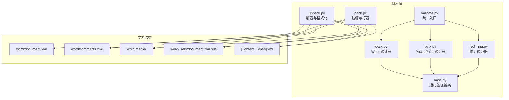
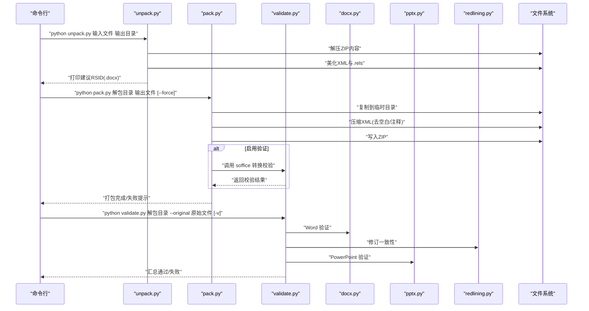
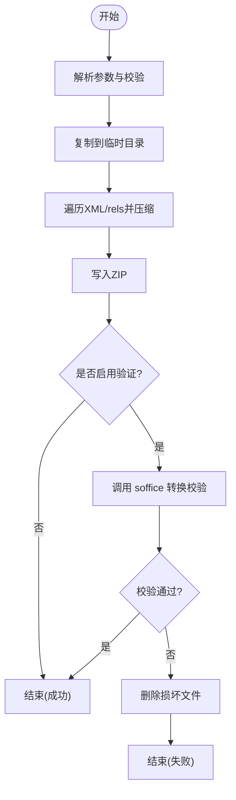
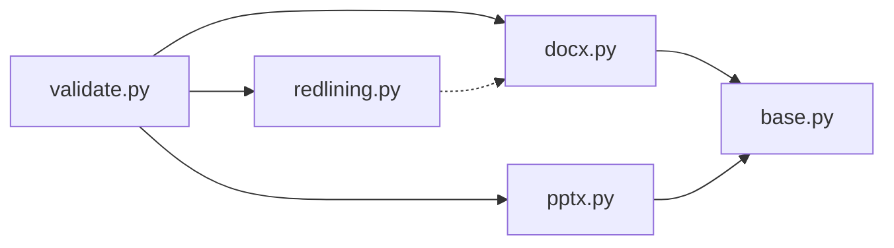

# 原始 XML 访问

<cite>
**本文引用的文件**
- [unpack.py](file://skills/docx/ooxml/scripts/unpack.py)
- [pack.py](file://skills/docx/ooxml/scripts/pack.py)
- [validate.py](file://skills/docx/ooxml/scripts/validate.py)
- [base.py](file://skills/docx/ooxml/scripts/validation/base.py)
- [docx.py](file://skills/docx/ooxml/scripts/validation/docx.py)
- [pptx.py](file://skills/docx/ooxml/scripts/validation/pptx.py)
- [redlining.py](file://skills/docx/ooxml/scripts/validation/redlining.py)
- [ooxml.md](file://skills/docx/ooxml.md)
- [wml.xsd](file://skills/docx/ooxml/schemas/ISO-IEC29500-4_2016/wml.xsd)
- [opc-contentTypes.xsd](file://skills/docx/ooxml/schemas/ecma/fouth-edition/opc-contentTypes.xsd)
- [people.xml](file://skills/docx/scripts/templates/people.xml)
</cite>

## 目录
1. [简介](#简介)
2. [项目结构](#项目结构)
3. [核心组件](#核心组件)
4. [架构总览](#架构总览)
5. [详细组件分析](#详细组件分析)
6. [依赖关系分析](#依赖关系分析)
7. [性能考量](#性能考量)
8. [故障排查指南](#故障排查指南)
9. [结论](#结论)
10. [附录](#附录)

## 简介
本文件面向需要直接访问与编辑 DOCX 原始 XML 的用户，系统性介绍如何使用仓库中的脚本完成 Office 文档的解包、格式化查看、重新打包与验证。重点覆盖以下方面：
- 使用 unpack.py 与 pack.py 对 .docx/.pptx/.xlsx 进行解包与打包，并在打包前进行 XML 压缩与可选的 soffice 校验
- 解析关键文件结构：word/document.xml、word/comments.xml、word/media/ 等的作用与维护要点
- 通过直接编辑 OOXML 实现复杂文档操作：嵌入媒体、注释处理、复杂格式保持等
- 提供 XML 操作示例路径与常见错误的处理方法

## 项目结构
该能力由三类脚本组成：
- 打包/解包工具：unpack.py、pack.py
- 验证工具：validate.py 及其子验证器（docx、pptx、redlining）
- 架构与模式参考：ooxml.md、XSD 架构文件、模板文件

图表来源
- [unpack.py](file://skills/docx/ooxml/scripts/unpack.py#L1-L30)
- [pack.py](file://skills/docx/ooxml/scripts/pack.py#L1-L160)
- [validate.py](file://skills/docx/ooxml/scripts/validate.py#L1-L70)
- [base.py](file://skills/docx/ooxml/scripts/validation/base.py#L1-L952)
- [docx.py](file://skills/docx/ooxml/scripts/validation/docx.py#L1-L275)
- [pptx.py](file://skills/docx/ooxml/scripts/validation/pptx.py#L1-L316)
- [redlining.py](file://skills/docx/ooxml/scripts/validation/redlining.py#L1-L280)

章节来源
- [unpack.py](file://skills/docx/ooxml/scripts/unpack.py#L1-L30)
- [pack.py](file://skills/docx/ooxml/scripts/pack.py#L1-L160)
- [validate.py](file://skills/docx/ooxml/scripts/validate.py#L1-L70)

## 核心组件
- 解包工具（unpack.py）：从 Office 文件中提取所有内容，自动对 XML 与 .rels 文件进行美化输出，便于人工审阅；对 .docx 还会提示一个建议的 RSID（用于修订会话标识）
- 打包工具（pack.py）：将已解包目录重新打包为 .docx/.pptx/.xlsx，执行 XML 压缩（去除多余空白与注释）、写入 ZIP、可选调用 soffice 进行转换校验
- 统一验证入口（validate.py）：根据原始文件类型选择对应验证器，支持 Word 的架构校验、修订一致性检查等
- 验证器家族（base/docx/pptx/redlining）：提供通用验证逻辑（XML 合法性、命名空间、唯一 ID、关系引用、内容类型声明、XSD 架构校验等），以及 Word 特有的空格保留、删除/插入规则，PowerPoint 的 UUID ID、布局引用等，以及修订一致性比对

章节来源
- [unpack.py](file://skills/docx/ooxml/scripts/unpack.py#L1-L30)
- [pack.py](file://skills/docx/ooxml/scripts/pack.py#L1-L160)
- [validate.py](file://skills/docx/ooxml/scripts/validate.py#L1-L70)
- [base.py](file://skills/docx/ooxml/scripts/validation/base.py#L1-L952)
- [docx.py](file://skills/docx/ooxml/scripts/validation/docx.py#L1-L275)
- [pptx.py](file://skills/docx/ooxml/scripts/validation/pptx.py#L1-L316)
- [redlining.py](file://skills/docx/ooxml/scripts/validation/redlining.py#L1-L280)

## 架构总览
下图展示从命令行到内部处理再到文件系统的整体流程。

图表来源
- [unpack.py](file://skills/docx/ooxml/scripts/unpack.py#L1-L30)
- [pack.py](file://skills/docx/ooxml/scripts/pack.py#L1-L160)
- [validate.py](file://skills/docx/ooxml/scripts/validate.py#L1-L70)
- [docx.py](file://skills/docx/ooxml/scripts/validation/docx.py#L1-L275)
- [pptx.py](file://skills/docx/ooxml/scripts/validation/pptx.py#L1-L316)
- [redlining.py](file://skills/docx/ooxml/scripts/validation/redlining.py#L1-L280)

## 详细组件分析

### 解包与格式化（unpack.py）
- 功能要点
  - 接收输入 Office 文件与输出目录，确保输出目录存在
  - 解压 ZIP 内容至目标目录
  - 遍历目录中的 *.xml 与 *.rels，使用 defusedxml.minidom 进行解析并以 ASCII 编码美化输出
  - 对 .docx 文件生成一个 8 位十六进制 RSID 建议，便于修订会话标识
- 复杂度与性能
  - 时间复杂度近似 O(N)（N 为 XML/rels 文件数量），主要开销在 IO 与 DOM 解析
  - 空间复杂度与文件大小线性相关
- 错误处理
  - 参数断言失败时直接报错
  - XML 解析异常会抛出异常（由 defusedxml 抛出）

章节来源
- [unpack.py](file://skills/docx/ooxml/scripts/unpack.py#L1-L30)

### 重新打包与验证（pack.py）
- 功能要点
  - 参数解析：输入目录、输出文件、是否跳过验证
  - 安全复制：将输入目录复制到临时目录，避免修改源文件
  - XML 压缩：遍历 *.xml 与 *.rels，去除多余空白与注释，保留 w:t 内容
  - ZIP 打包：按相对路径写入 ZIP
  - 可选验证：调用 soffice 将输出文件转换为 HTML 并检查生成文件是否存在
- 复杂度与性能
  - 时间复杂度近似 O(M)（M 为文件总数），DOM 解析与写回是主要成本
  - ZIP 压缩与 soffice 转换可能引入额外延迟
- 错误处理
  - 跳过验证时输出警告
  - soffice 未安装或超时会给出相应提示
  - 校验失败时删除损坏文件并退出码非零

图表来源
- [pack.py](file://skills/docx/ooxml/scripts/pack.py#L1-L160)

章节来源
- [pack.py](file://skills/docx/ooxml/scripts/pack.py#L1-L160)

### 统一验证入口（validate.py）
- 功能要点
  - 校验路径合法性与扩展名
  - 根据原始文件类型选择验证器集合（如 .docx 同时运行 DOCXSchemaValidator 与 RedliningValidator）
  - 支持详细输出（-v）
- 错误处理
  - 路径断言失败直接报错
  - 不支持的文件类型提示并退出

章节来源
- [validate.py](file://skills/docx/ooxml/scripts/validate.py#L1-L70)

### 验证器基类（base.py）
- 功能要点
  - 通用验证：XML 合法性、命名空间声明、唯一 ID（文件内/全局）、关系引用完整性、内容类型声明、XSD 架构对比（仅新增错误）
  - 清理与预处理：移除 mc:AlternateContent、清理非允许命名空间属性与元素
  - 关系 ID 校验：检查 r:id 是否存在于对应 .rels 中，且类型匹配
- 设计模式
  - 子类继承扩展特定验证（如 Word 的空格保留、删除/插入规则；PPT 的 UUID ID、布局引用等）

章节来源
- [base.py](file://skills/docx/ooxml/scripts/validation/base.py#L1-L952)

### Word 验证器（docx.py）
- 功能要点
  - 在通用基础上增加：空格保留规则（w:t 有首尾空白需 xml:space='preserve'）、删除/插入规则（w:del 与 w:ins 的嵌套约束）、段落数量对比
- 典型规则
  - w:t 文本首尾空白必须保留，否则报错
  - w:del 下不允许出现 w:t，w:delText 只能在 w:ins 内部出现（且不在 w:del 内）

章节来源
- [docx.py](file://skills/docx/ooxml/scripts/validation/docx.py#L1-L275)

### PowerPoint 验证器（pptx.py）
- 功能要点
  - UUID ID 校验（类似 GUID 的 ID 必须只含十六进制字符）
  - 幻灯片布局引用校验（slide master 的 sldLayoutId 必须指向有效布局）
  - 幻灯片布局重复引用校验（每张幻灯片只能有一个 slideLayout 引用）
  - 备注页引用唯一性校验

章节来源
- [pptx.py](file://skills/docx/ooxml/scripts/validation/pptx.py#L1-L316)

### 修订一致性验证器（redlining.py）
- 功能要点
  - 若检测到作者为 Claude 的修订，则从新旧文档中移除其修订后提取纯文本进行逐段比对
  - 使用 git 差异工具生成详细差异信息，帮助定位问题
- 典型场景
  - 修改他人插入内容时必须嵌套在对方的 <w:ins>/<w:del> 内
  - 删除他人插入内容时必须在对方 <w:ins> 内再套一层 <w:del>

章节来源
- [redlining.py](file://skills/docx/ooxml/scripts/validation/redlining.py#L1-L280)

### 关键文件结构与作用
- word/document.xml
  - 文档正文的主要容器，包含段落、表格、图片等元素
  - 修订（<w:ins>/<w:del>）与样式（<w:pPr>/<w:rPr>）均在此处定义
- word/comments.xml
  - 注释数据，包含评论起止标记与关联段落 ID
- word/media/
  - 媒体资源存放目录，如图片、音频、视频等
- word/_rels/document.xml.rels
  - 关系文件，声明与媒体、外部链接、编号等的映射
- [Content_Types].xml
  - 声明各部件的 MIME 类型，缺失会导致应用无法识别或显示媒体

章节来源
- [ooxml.md](file://skills/docx/ooxml.md#L160-L264)
- [people.xml](file://skills/docx/scripts/templates/people.xml#L1-L3)

## 依赖关系分析
- 组件耦合
  - validate.py 作为入口，动态选择 docx/pptx/redlining 验证器
  - docx/pptx 继承自 base.py，共享通用验证逻辑
  - pack.py 依赖 defusedxml.minidom 与 zipfile，可选依赖 soffice
- 外部依赖
  - lxml（用于 XSD 与 DOM 解析）
  - defusedxml（安全 XML 解析）
  - soffice（LibreOffice Headless，用于转换校验）
  - git（用于修订差异比对）

图表来源
- [validate.py](file://skills/docx/ooxml/scripts/validate.py#L1-L70)
- [docx.py](file://skills/docx/ooxml/scripts/validation/docx.py#L1-L275)
- [pptx.py](file://skills/docx/ooxml/scripts/validation/pptx.py#L1-L316)
- [redlining.py](file://skills/docx/ooxml/scripts/validation/redlining.py#L1-L280)
- [base.py](file://skills/docx/ooxml/scripts/validation/base.py#L1-L952)

## 性能考量
- 解包阶段
  - 大文档的 XML 美化会占用较多内存与 CPU，建议在 SSD 上进行
- 打包阶段
  - XML 压缩与 ZIP 写入为主要耗时点，可通过减少不必要的中间修改降低时间
  - soffice 校验为可选步骤，生产环境可考虑关闭以提升吞吐
- 验证阶段
  - XSD 校验与关系引用扫描为 CPU 密集型，建议在多核环境下并行处理多个文件

## 故障排查指南
- 解包失败
  - 确认输入文件为有效的 .docx/.pptx/.xlsx
  - 检查输出目录权限与磁盘空间
- 打包失败
  - 检查 XML 是否仍为美化格式（应先执行压缩步骤）
  - soffice 未安装或无执行权限会导致校验失败，可使用 --force 跳过校验但不推荐
  - 校验失败会删除输出文件，请确认错误日志后再尝试
- 验证失败
  - XML 合法性：检查是否有非法字符或标签闭合问题
  - 命名空间：确保 Ignorable 属性引用的命名空间均已声明
  - 唯一 ID：检查 comment、bookmark、slide 等元素的 ID 是否满足唯一性要求
  - 关系引用：确保 .rels 中的 r:id 存在于对应关系文件中，且类型匹配
  - 内容类型：媒体文件需在 [Content_Types].xml 中声明
  - Word 特有：w:t 首尾空白需保留；w:del 下不得出现 w:t；w:delText 只能在 w:ins 内部出现
  - PowerPoint 特有：UUID ID 必须为合法十六进制；布局引用唯一且有效

章节来源
- [pack.py](file://skills/docx/ooxml/scripts/pack.py#L80-L130)
- [base.py](file://skills/docx/ooxml/scripts/validation/base.py#L120-L952)
- [docx.py](file://skills/docx/ooxml/scripts/validation/docx.py#L70-L275)
- [pptx.py](file://skills/docx/ooxml/scripts/validation/pptx.py#L75-L316)

## 结论
通过本仓库提供的解包、打包与验证工具链，用户可以安全地对 Office 文档的原始 XML 进行细粒度编辑与校验。遵循本文档的关键文件结构与验证规则，能够高效实现媒体嵌入、注释管理、复杂格式保持等高级功能，并在出现问题时快速定位与修复。

## 附录

### 使用示例（路径指引）
- 解包
  - 示例：python skills/docx/ooxml/scripts/unpack.py 原始.docx 输出目录
- 重新打包
  - 示例：python skills/docx/ooxml/scripts/pack.py 解包目录 输出.docx
  - 可选：添加 --force 跳过验证
- 统一验证
  - 示例：python skills/docx/ooxml/scripts/validate.py 解包目录 --original 原始.docx -v

章节来源
- [unpack.py](file://skills/docx/ooxml/scripts/unpack.py#L10-L29)
- [pack.py](file://skills/docx/ooxml/scripts/pack.py#L19-L43)
- [validate.py](file://skills/docx/ooxml/scripts/validate.py#L16-L65)

### 关键文件与架构参考
- Word 架构（WML）：用于 XSD 校验与结构约束
- OPC Content Types：用于声明部件与扩展类型的 MIME 映射
- 模板文件：people.xml 用于注释基础设施

章节来源
- [wml.xsd](file://skills/docx/ooxml/schemas/ISO-IEC29500-4_2016/wml.xsd#L1-L200)
- [opc-contentTypes.xsd](file://skills/docx/ooxml/schemas/ecma/fouth-edition/opc-contentTypes.xsd#L1-L43)
- [people.xml](file://skills/docx/scripts/templates/people.xml#L1-L3)