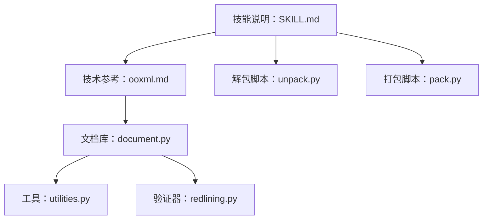
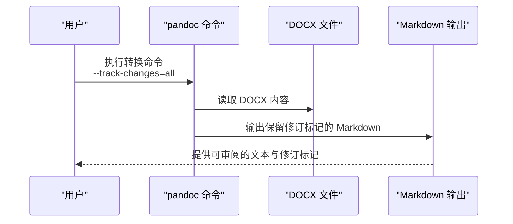
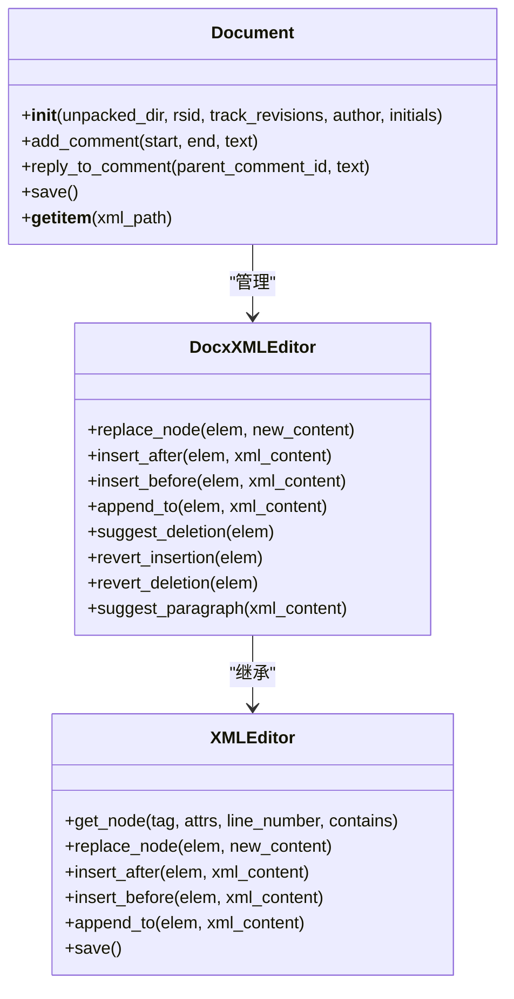
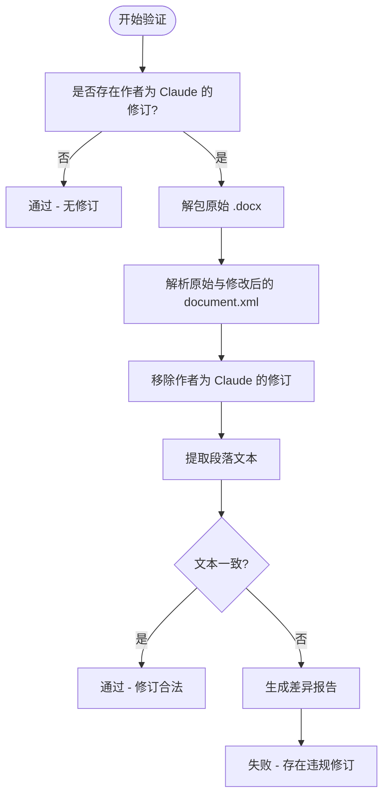
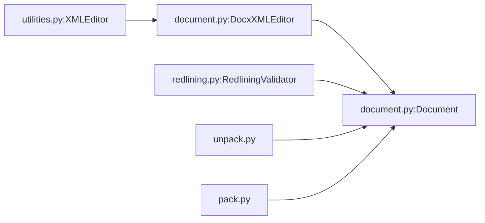

# 文本提取与分析

<cite>
**本文引用的文件**
- [技能说明：docx](file://skills/docx/SKILL.md)
- [技术参考：OOXML](file://skills/docx/ooxml.md)
- [文档库：Document 类](file://skills/docx/scripts/document.py)
- [工具：XMLEditor](file://skills/docx/scripts/utilities.py)
- [验证器：RedliningValidator](file://skills/docx/ooxml/scripts/validation/redlining.py)
- [解包脚本：unpack.py](file://skills/docx/ooxml/scripts/unpack.py)
- [打包脚本：pack.py](file://skills/docx/ooxml/scripts/pack.py)
</cite>

## 目录
1. [简介](#简介)
2. [项目结构](#项目结构)
3. [核心组件](#核心组件)
4. [架构总览](#架构总览)
5. [详细组件分析](#详细组件分析)
6. [依赖关系分析](#依赖关系分析)
7. [性能考量](#性能考量)
8. [故障排查指南](#故障排查指南)
9. [结论](#结论)
10. [附录](#附录)

## 简介
本文件面向 DOCX 文档的文本提取与分析，重点围绕使用 pandoc 将文档转换为 Markdown 并保留“修订跟踪”（跟踪变更）的能力展开。文档详细说明了如何通过 pandoc 的 --track-changes=all 参数保留插入与删除标记，并解释如何在后续流程中区分“接受”、“拒绝”和“全部跟踪变更”。同时，结合仓库中的 Python 工具链（OOXML 解包/打包、文档库、验证器），给出从文本提取到修订实现再到最终校验的完整工作流与最佳实践。

## 项目结构
本主题涉及的代码主要位于 skills/docx 目录下，包含：
- 技能说明与工作流：SKILL.md
- 技术参考与模式：ooxml.md
- Python 工具与库：scripts/document.py、scripts/utilities.py
- 验证器：ooxml/scripts/validation/redlining.py
- 解包/打包脚本：ooxml/scripts/unpack.py、ooxml/scripts/pack.py

图表来源
- [技能说明：docx](file://skills/docx/SKILL.md#L1-L197)
- [技术参考：OOXML](file://skills/docx/ooxml.md#L1-L610)
- [文档库：Document 类](file://skills/docx/scripts/document.py#L1-L800)
- [工具：XMLEditor](file://skills/docx/scripts/utilities.py#L1-L375)
- [验证器：RedliningValidator](file://skills/docx/ooxml/scripts/validation/redlining.py#L1-L280)
- [解包脚本：unpack.py](file://skills/docx/ooxml/scripts/unpack.py#L1-L30)
- [打包脚本：pack.py](file://skills/docx/ooxml/scripts/pack.py#L1-L160)

章节来源
- [技能说明：docx](file://skills/docx/SKILL.md#L1-L197)
- [技术参考：OOXML](file://skills/docx/ooxml.md#L1-L610)

## 核心组件
- 文本提取与跟踪保留：通过 pandoc --track-changes=all 将 DOCX 转换为 Markdown，保留插入与删除标记，便于审阅与对比。
- OOXML 解包与打包：使用 Python 脚本将 .docx 解包为可编辑的 XML 结构，再将修改后的目录重新打包为 .docx。
- 文档库（Document 类）：提供高阶 API 实现修订跟踪（插入/删除）、评论、段落/运行级操作等，自动注入 RSID、作者、时间戳等属性。
- 验证器（RedliningValidator）：对修订进行一致性校验，移除指定作者的修订后比较文本，确保未误改他人内容。

章节来源
- [技能说明：docx](file://skills/docx/SKILL.md#L33-L153)
- [技术参考：OOXML](file://skills/docx/ooxml.md#L266-L440)
- [文档库：Document 类](file://skills/docx/scripts/document.py#L612-L800)
- [验证器：RedliningValidator](file://skills/docx/ooxml/scripts/validation/redlining.py#L22-L112)

## 架构总览
下图展示从 DOCX 到 Markdown 的文本提取路径，以及在修订工作流中的关键节点。

图表来源
- [技能说明：docx](file://skills/docx/SKILL.md#L33-L40)
- [技能说明：docx](file://skills/docx/SKILL.md#L95-L98)

## 详细组件分析

### 组件一：pandoc 文本提取与修订保留
- 功能要点
  - 使用 --track-changes=all 保留插入与删除标记，便于审阅与对比。
  - 可选参数 --track-changes=accept/reject/all，分别对应“接受”、“拒绝”、“全部”三种策略。
- 典型用法
  - 将当前文档转换为 Markdown，保留修订标记，用于审阅与定位变更。
  - 在最终确认后再次转换，验证所有变更是否正确应用。
- 注意事项
  - 仅使用 --track-changes=all 时，插入与删除标记均保留；若使用 accept 或 reject，则会将相应修订标记转换为纯文本或移除。
  - 修订标记在 Markdown 中以特定语法呈现，便于 grep 等工具进行二次处理。

章节来源
- [技能说明：docx](file://skills/docx/SKILL.md#L33-L40)
- [技能说明：docx](file://skills/docx/SKILL.md#L95-L98)
- [技能说明：docx](file://skills/docx/SKILL.md#L144-L147)

### 组件二：OOXML 解包与打包
- 解包（unpack.py）
  - 将 .docx 解压为目录，格式化所有 XML 文件，便于直接编辑。
  - 对于 .docx，会输出一个建议的 RSID，供后续修订使用。
- 打包（pack.py）
  - 将修改后的目录重新打包为 .docx，支持可选验证（soffice 转 HTML）。
  - 在验证失败时删除损坏文件，避免生成不可用的 .docx。
- 最佳实践
  - 修改前先解包，修改后先验证再打包。
  - 避免手动修改非 XML 文件（如媒体资源），应通过文档库提供的方法进行。

章节来源
- [解包脚本：unpack.py](file://skills/docx/ooxml/scripts/unpack.py#L1-L30)
- [打包脚本：pack.py](file://skills/docx/ooxml/scripts/pack.py#L45-L87)
- [打包脚本：pack.py](file://skills/docx/ooxml/scripts/pack.py#L90-L131)

### 组件三：文档库（Document 类）与修订实现
- 主要能力
  - 自动注入 RSID、作者、时间戳等属性，确保修订可追踪。
  - 提供撤销插入（revert_insertion）、恢复删除（revert_deletion）、建议删除（suggest_deletion）等方法。
  - 支持段落/运行级替换、插入、注释添加等。
- 关键规则
  - 严禁修改他人修订内的文本内容，必须嵌套删除或插入以保持结构合法。
  - 插入/删除必须包裹在段落级别，不能嵌套在运行级别。
- 示例场景
  - 将“30 days”改为“60 days”，仅标记变化部分，保留不变文本的原始运行元素。
  - 拒绝他人插入的“monthly”为“weekly”，需在原插入内嵌套删除“monthly”，并追加新的插入“weekly”。

图表来源
- [文档库：Document 类](file://skills/docx/scripts/document.py#L612-L800)
- [文档库：Document 类](file://skills/docx/scripts/document.py#L47-L263)
- [工具：XMLEditor](file://skills/docx/scripts/utilities.py#L41-L375)

章节来源
- [文档库：Document 类](file://skills/docx/scripts/document.py#L264-L440)
- [文档库：Document 类](file://skills/docx/scripts/document.py#L482-L594)
- [技术参考：OOXML](file://skills/docx/ooxml.md#L554-L610)

### 组件四：修订验证（RedliningValidator）
- 核心逻辑
  - 若文档中无指定作者的修订，直接通过。
  - 否则，解包原始 .docx，移除该作者的修订后，提取段落文本进行对比。
  - 使用 git diff 生成差异报告，帮助定位违规修改（如误改他人修订内容）。
- 适用场景
  - 在完成批量修订后，进行一致性检查，确保未破坏原文本。
  - 作为 CI/CD 流程中的质量门禁。

图表来源
- [验证器：RedliningValidator](file://skills/docx/ooxml/scripts/validation/redlining.py#L22-L112)
- [验证器：RedliningValidator](file://skills/docx/ooxml/scripts/validation/redlining.py#L114-L215)

章节来源
- [验证器：RedliningValidator](file://skills/docx/ooxml/scripts/validation/redlining.py#L22-L112)
- [验证器：RedliningValidator](file://skills/docx/ooxml/scripts/validation/redlining.py#L217-L275)

## 依赖关系分析
- 文档库依赖
  - Document 类依赖 XMLEditor 进行底层 DOM 操作。
  - DocxXMLEditor 继承自 XMLEditor，并扩展了修订专用方法。
- 验证器依赖
  - RedliningValidator 依赖原始 .docx 的解包结果与 XML 解析，用于移除修订并对比文本。
- 工具链耦合
  - 解包/打包脚本与文档库配合，形成“解包-修改-打包-验证”的闭环。

图表来源
- [工具：XMLEditor](file://skills/docx/scripts/utilities.py#L41-L375)
- [文档库：Document 类](file://skills/docx/scripts/document.py#L47-L263)
- [文档库：Document 类](file://skills/docx/scripts/document.py#L612-L800)
- [验证器：RedliningValidator](file://skills/docx/ooxml/scripts/validation/redlining.py#L14-L21)
- [解包脚本：unpack.py](file://skills/docx/ooxml/scripts/unpack.py#L1-L30)
- [打包脚本：pack.py](file://skills/docx/ooxml/scripts/pack.py#L45-L87)

章节来源
- [工具：XMLEditor](file://skills/docx/scripts/utilities.py#L41-L375)
- [文档库：Document 类](file://skills/docx/scripts/document.py#L47-L263)
- [验证器：RedliningValidator](file://skills/docx/ooxml/scripts/validation/redlining.py#L14-L21)

## 性能考量
- 文本提取
  - pandoc 转换速度受文档大小影响，建议在本地或 CI 环境中缓存中间产物（如 verification.md）以减少重复转换。
- 解包/打包
  - 解包与打包涉及大量 XML 文件读写，建议在 SSD 上执行，并避免同时运行多个打包任务。
- 修订实现
  - 批量修改时优先使用“按节/按类型/按邻近性”分批策略，降低单次修改复杂度，提升调试效率。
- 验证
  - 验证阶段可能调用 soffice，耗时较长；可在开发阶段跳过验证，生产环境强制开启。

## 故障排查指南
- pandoc 无法识别 --track-changes 参数
  - 确认已安装最新版本的 pandoc，并在命令中正确传参。
- 修订标记未保留
  - 检查是否使用 --track-changes=all；若使用 accept/reject，修订标记会被转换或移除。
- 解包后 XML 编码问题
  - 确保解包脚本正确格式化 XML；必要时手动清理多余空白与注释。
- 打包后文件损坏
  - 使用 pack.py 的验证功能；若失败，检查 XML 结构与命名空间声明。
- 修订验证失败
  - 查看差异报告，确认是否误改他人修订内容；遵循嵌套删除/插入规则。
- 行号不匹配
  - 修改后行号会变化，应在每次脚本运行前重新 grep 获取最新行号。

章节来源
- [技能说明：docx](file://skills/docx/SKILL.md#L95-L136)
- [技能说明：docx](file://skills/docx/SKILL.md#L144-L152)
- [验证器：RedliningValidator](file://skills/docx/ooxml/scripts/validation/redlining.py#L114-L137)
- [验证器：RedliningValidator](file://skills/docx/ooxml/scripts/validation/redlining.py#L139-L215)

## 结论
通过 pandoc 的 --track-changes=all 参数，可以高效地将 DOCX 转换为保留修订标记的 Markdown，为审阅与对比提供基础。结合 OOXML 解包/打包与文档库的高阶 API，能够系统化地实现“规划-实施-验证”的修订工作流。RedliningValidator 则提供了严谨的一致性校验，确保修订不会误改他人内容。遵循本文的最佳实践与注意事项，可显著提升文档修订的准确性与可维护性。

## 附录
- 常用命令速查
  - 文本提取：pandoc --track-changes=all path-to-file.docx -o output.md
  - 解包：python ooxml/scripts/unpack.py <file.docx> <dir>
  - 打包：python ooxml/scripts/pack.py <input_dir> <output.docx>
  - 最终验证：pandoc --track-changes=all reviewed-document.docx -o verification.md；grep 验证关键词
- 输出格式说明
  - --track-changes=all：保留插入与删除标记，便于审阅。
  - --track-changes=accept：将插入标记转换为纯文本，删除标记被移除。
  - --track-changes=reject：将删除标记转换为纯文本，插入标记被移除。

章节来源
- [技能说明：docx](file://skills/docx/SKILL.md#L33-L40)
- [技能说明：docx](file://skills/docx/SKILL.md#L95-L98)
- [技能说明：docx](file://skills/docx/SKILL.md#L144-L147)