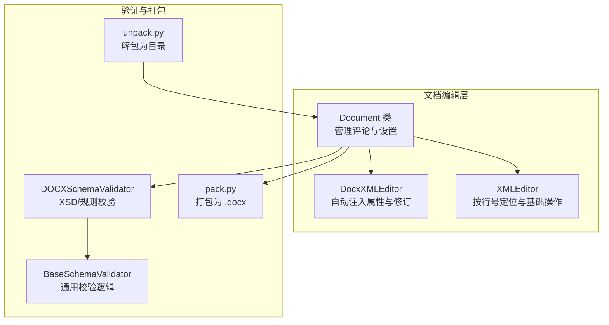
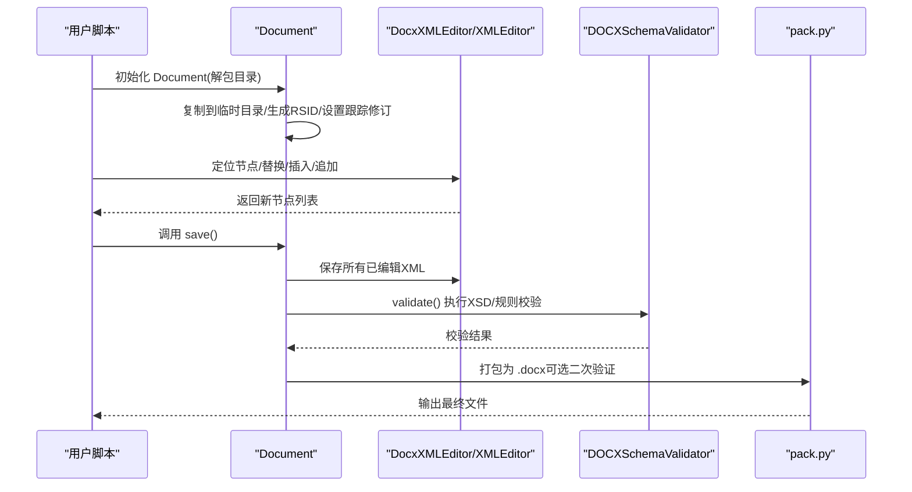
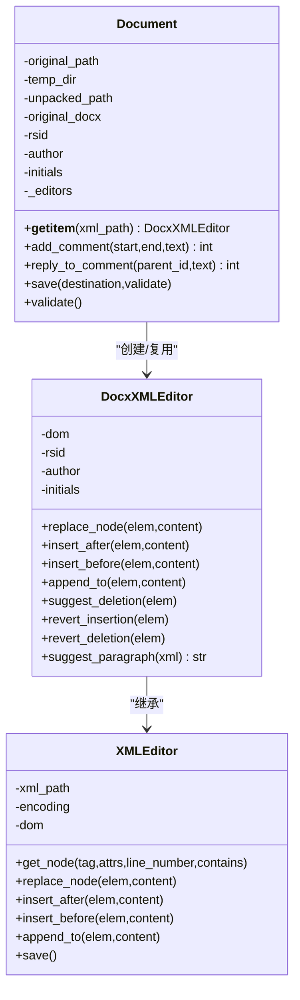
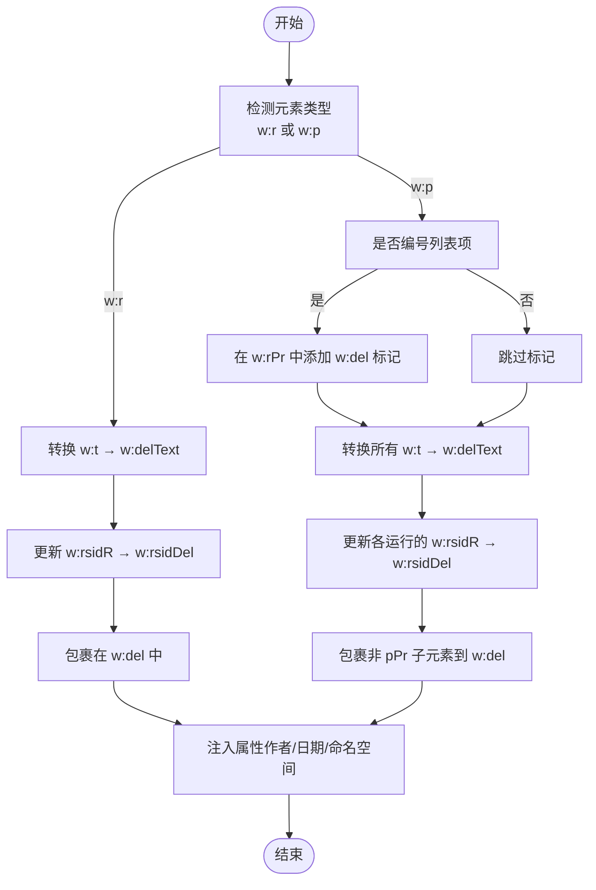
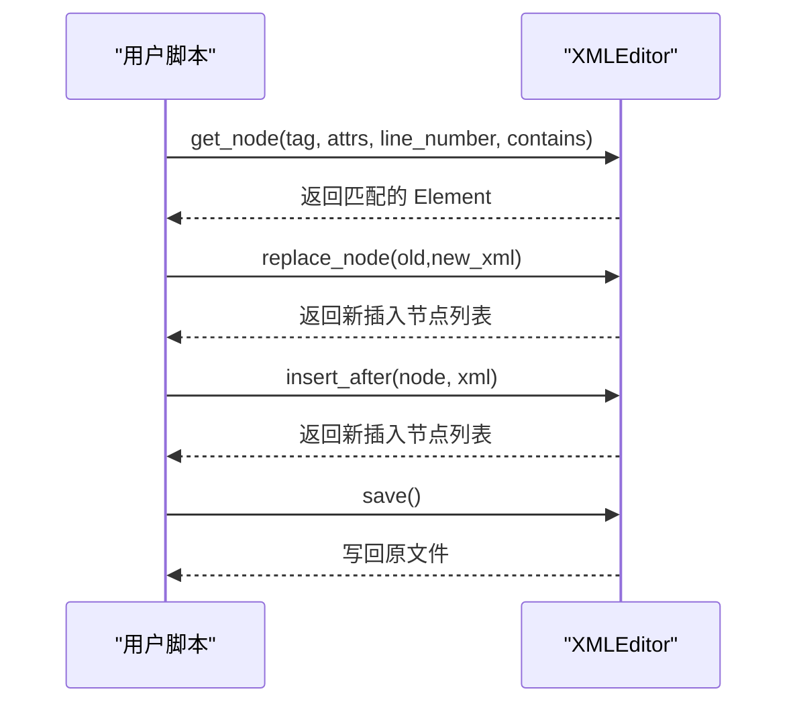
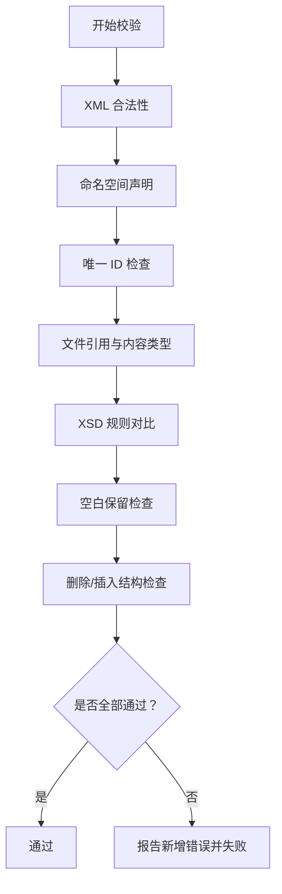
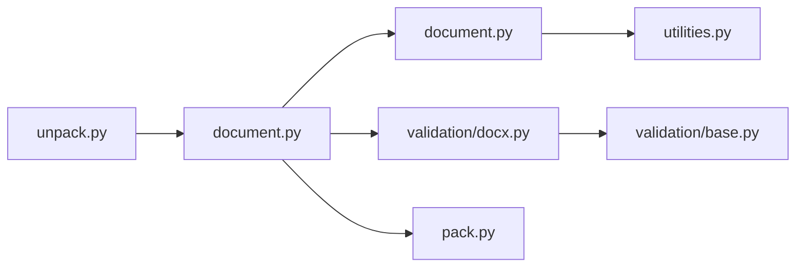

# 文档编辑

<cite>
**本文引用的文件**
- [document.py](file://skills/docx/scripts/document.py)
- [utilities.py](file://skills/docx/scripts/utilities.py)
- [ooxml.md](file://skills/docx/ooxml.md)
- [SKILL.md](file://skills/docx/SKILL.md)
- [docx.py](file://skills/docx/ooxml/scripts/validation/docx.py)
- [pack.py](file://skills/docx/ooxml/scripts/pack.py)
- [unpack.py](file://skills/docx/ooxml/scripts/unpack.py)
- [base.py](file://skills/docx/ooxml/scripts/validation/base.py)
- [people.xml](file://skills/docx/scripts/templates/people.xml)
</cite>

## 目录
1. [简介](#简介)
2. [项目结构](#项目结构)
3. [核心组件](#核心组件)
4. [架构总览](#架构总览)
5. [详细组件分析](#详细组件分析)
6. [依赖关系分析](#依赖关系分析)
7. [性能考虑](#性能考虑)
8. [故障排查指南](#故障排查指南)
9. [结论](#结论)
10. [附录](#附录)

## 简介
本文件面向使用 Document 库对现有 DOCX 文档进行编辑的工程师与技术作者，系统阐述两种编辑范式：高阶方法（通过 Document 类提供的高层 API）与直接 DOM 访问（通过底层 XMLEditor 对 OOXML 文件进行细粒度操作）。文档重点覆盖以下方面：
- OOXML 编辑原则与最佳实践
- 文本替换、格式修改、结构重组的实现思路与流程
- 备份策略与错误恢复机制
- 基于验证器的校验与打包流程

## 项目结构
该技能包围绕“解包 → 编辑 → 校验 → 打包”的工作流组织，核心位于 skills/docx 目录下：
- scripts/document.py：Document 类与 DocxXMLEditor 的实现，提供评论、修订跟踪、DOM 操作等能力
- scripts/utilities.py：通用 XML 编辑器 XMLEditor，支持按行号定位节点与基本插入/替换操作
- ooxml.md：OOXML 技术参考与文档库使用指南
- SKILL.md：技能使用说明与工作流决策树
- ooxml/scripts/validation/*：基于 lxml 的 XSD 校验与专用规则校验
- ooxml/scripts/pack.py、unpack.py：文档解包与打包工具

图表来源
- [document.py](file://skills/docx/scripts/document.py#L612-L885)
- [utilities.py](file://skills/docx/scripts/utilities.py#L41-L375)
- [docx.py](file://skills/docx/ooxml/scripts/validation/docx.py#L14-L71)
- [base.py](file://skills/docx/ooxml/scripts/validation/base.py#L11-L125)
- [pack.py](file://skills/docx/ooxml/scripts/pack.py#L45-L87)
- [unpack.py](file://skills/docx/ooxml/scripts/unpack.py#L19-L30)

章节来源
- [SKILL.md](file://skills/docx/SKILL.md#L63-L74)
- [ooxml.md](file://skills/docx/ooxml.md#L266-L269)

## 核心组件
- Document 类：负责复制原始解包目录、初始化临时工作区、生成 RSID、设置跟踪修订、维护评论基础设施，并提供保存与验证能力。
- DocxXMLEditor：在 XMLEditor 基础上增强自动属性注入（如 RSID、作者、时间戳），并提供撤销/恢复修订、建议插入/删除等高级操作。
- XMLEditor：提供按标签、属性、行号范围、包含文本等条件查找节点的能力；支持替换、前后插入、追加子节点等 DOM 操作。
- 验证器：DOCXSchemaValidator 继承自 BaseSchemaValidator，执行 XML 合法性、命名空间、唯一 ID、关系引用、内容类型声明、XSD 规则、空白保留、删除/插入有效性等检查。
- 打包/解包：unpack.py 将 .docx 解包为可编辑目录；pack.py 将目录压缩回 .docx 并可选调用 soffice 进行二次验证。

章节来源
- [document.py](file://skills/docx/scripts/document.py#L612-L885)
- [utilities.py](file://skills/docx/scripts/utilities.py#L41-L375)
- [docx.py](file://skills/docx/ooxml/scripts/validation/docx.py#L14-L71)
- [base.py](file://skills/docx/ooxml/scripts/validation/base.py#L11-L125)
- [pack.py](file://skills/docx/ooxml/scripts/pack.py#L45-L87)
- [unpack.py](file://skills/docx/ooxml/scripts/unpack.py#L19-L30)

## 架构总览
Document 库采用“安全编辑 + 自动校验”的设计，确保每次修改后都能通过严格的 OOXML 校验，避免生成不可打开或损坏的文档。

图表来源
- [document.py](file://skills/docx/scripts/document.py#L859-L885)
- [docx.py](file://skills/docx/ooxml/scripts/validation/docx.py#L24-L71)
- [pack.py](file://skills/docx/ooxml/scripts/pack.py#L45-L87)

## 详细组件分析

### Document 类与编辑生命周期
- 初始化：复制原始解包目录至临时目录，生成 RSID，设置 people.xml、settings.xml、关系与内容类型声明，准备评论基础设施。
- 编辑：通过 doc["相对路径.xml"] 获取 DocxXMLEditor 实例，进行节点查找与替换/插入/追加等操作。
- 保存：先确保评论相关关系与内容类型，再逐个保存已缓存的编辑器，最后将临时目录内容复制回原目录。
- 校验：默认开启校验，若失败抛出异常，阻止输出损坏文档。

图表来源
- [document.py](file://skills/docx/scripts/document.py#L612-L885)
- [document.py](file://skills/docx/scripts/document.py#L47-L263)
- [utilities.py](file://skills/docx/scripts/utilities.py#L41-L375)

章节来源
- [document.py](file://skills/docx/scripts/document.py#L612-L885)

### DocxXMLEditor 高级方法
- 自动属性注入：在插入/替换节点时，自动为段落、运行、注释、修订等元素注入 RSID、作者、日期、命名空间等必要属性。
- 修订操作：
  - suggest_deletion：对单个运行或段落进行删除标记（转换 <w:t> 为 <w:delText>，更新 RSID 属性）。
  - revert_insertion：将他人插入的内容包装为删除，用于“拒绝插入”。
  - revert_deletion：将他人删除的内容重新插入，用于“恢复删除”。
  - suggest_paragraph：将一段 XML 包装为带修订标记的段落，便于新增内容。

图表来源
- [document.py](file://skills/docx/scripts/document.py#L482-L594)

章节来源
- [document.py](file://skills/docx/scripts/document.py#L264-L594)

### XMLEditor 基础能力
- 节点查找：支持按标签、属性、行号范围、包含文本等条件组合过滤，返回唯一匹配节点。
- DOM 操作：提供 replace_node、insert_after、insert_before、append_to 等方法，返回插入的新节点列表，便于保持顺序。
- 保存：以原文件编码写回，避免破坏字符集。

图表来源
- [utilities.py](file://skills/docx/scripts/utilities.py#L76-L181)
- [utilities.py](file://skills/docx/scripts/utilities.py#L206-L288)
- [utilities.py](file://skills/docx/scripts/utilities.py#L302-L311)

章节来源
- [utilities.py](file://skills/docx/scripts/utilities.py#L41-L375)

### 验证器与校验流程
- DOCXSchemaValidator：执行 XML 合法性、命名空间声明、唯一 ID、文件引用、内容类型、XSD 规则、空白保留、删除/插入有效性等检查。
- BaseSchemaValidator：提供通用校验框架，包括 XML 合法性、命名空间、唯一 ID、关系引用、内容类型声明、XSD 对比（仅报告新增错误）等。
- 工作流：Document.save() 默认调用 validate()，若失败抛错；pack.py 可选调用 soffice 进行二次验证。

图表来源
- [docx.py](file://skills/docx/ooxml/scripts/validation/docx.py#L24-L71)
- [base.py](file://skills/docx/ooxml/scripts/validation/base.py#L127-L154)
- [base.py](file://skills/docx/ooxml/scripts/validation/base.py#L186-L275)
- [base.py](file://skills/docx/ooxml/scripts/validation/base.py#L277-L386)
- [base.py](file://skills/docx/ooxml/scripts/validation/base.py#L522-L639)
- [base.py](file://skills/docx/ooxml/scripts/validation/base.py#L688-L740)

章节来源
- [docx.py](file://skills/docx/ooxml/scripts/validation/docx.py#L14-L275)
- [base.py](file://skills/docx/ooxml/scripts/validation/base.py#L11-L952)

### 打包与解包
- 解包：将 .docx 解压为目录，美化所有 XML/rels 文件，Word 场景还会输出建议的 RSID。
- 打包：将目录压缩为 .docx，去除多余空白与注释，可选调用 soffice 进行二次验证，失败则删除产物文件。

章节来源
- [unpack.py](file://skills/docx/ooxml/scripts/unpack.py#L19-L30)
- [pack.py](file://skills/docx/ooxml/scripts/pack.py#L45-L160)

## 依赖关系分析
- Document 依赖 DocxXMLEditor 与 XMLEditor 提供的 DOM 操作能力。
- DocxXMLEditor 依赖 defusedxml.minidom 进行安全解析与序列化。
- 验证阶段依赖 lxml.etree 进行 XSD 与 XPath 检查。
- 打包阶段依赖 zipfile 与 soffice（可选）进行二次验证。

图表来源
- [document.py](file://skills/docx/scripts/document.py#L612-L885)
- [utilities.py](file://skills/docx/scripts/utilities.py#L41-L375)
- [docx.py](file://skills/docx/ooxml/scripts/validation/docx.py#L14-L71)
- [base.py](file://skills/docx/ooxml/scripts/validation/base.py#L11-L125)
- [pack.py](file://skills/docx/ooxml/scripts/pack.py#L45-L87)
- [unpack.py](file://skills/docx/ooxml/scripts/unpack.py#L19-L30)

章节来源
- [document.py](file://skills/docx/scripts/document.py#L612-L885)
- [utilities.py](file://skills/docx/scripts/utilities.py#L41-L375)
- [docx.py](file://skills/docx/ooxml/scripts/validation/docx.py#L14-L71)
- [base.py](file://skills/docx/ooxml/scripts/validation/base.py#L11-L125)
- [pack.py](file://skills/docx/ooxml/scripts/pack.py#L45-L87)
- [unpack.py](file://skills/docx/ooxml/scripts/unpack.py#L19-L30)

## 性能考虑
- 懒加载编辑器：Document 使用字典缓存已打开的编辑器实例，避免重复解析同一 XML 文件。
- 临时目录操作：所有编辑在临时目录完成，减少对原始文件的直接写入风险。
- 一次性保存：Document.save() 会批量保存所有已修改的 XML，降低磁盘 IO 次数。
- 验证成本：XSD 与 lxml 校验可能较耗时，建议在调试阶段启用，生产环境可按需关闭（不推荐）。

## 故障排查指南
- 文档无法打开或提示损坏
  - 检查是否在保存前调用了 validate()，并确认未跳过校验。
  - 若使用 pack.py 且未安装 soffice，将跳过二次验证，建议安装 LibreOffice 并重试。
- 修订显示异常或作者信息缺失
  - 确认 settings.xml 中已注入 rsids 与 trackRevisions（如启用）。
  - 确认 comments*.xml 的关系与内容类型声明已存在。
- 文本替换后空白丢失
  - 确保对包含首尾空白的 <w:t> 设置了 xml:space="preserve"（DocxXMLEditor 在插入时会自动处理）。
- 行号定位失败
  - 由于每次脚本运行后行号会变化，建议在编写脚本前先 grep document.xml 获取当前行号，或使用 contains 过滤器辅助定位。

章节来源
- [document.py](file://skills/docx/scripts/document.py#L838-L885)
- [docx.py](file://skills/docx/ooxml/scripts/validation/docx.py#L72-L123)
- [pack.py](file://skills/docx/ooxml/scripts/pack.py#L90-L131)
- [SKILL.md](file://skills/docx/SKILL.md#L136-L154)

## 结论
通过 Document 库与 XMLEditor，可以安全、规范地对 DOCX 文档进行编辑。遵循“解包 → 编辑 → 校验 → 打包”的流程，结合自动属性注入与严格校验，能够有效避免 OOXML 结构与格式问题，确保输出文档稳定可用。建议在团队内统一使用该库与工作流，配合备份与版本控制，提升协作效率与质量。

## 附录

### 实际编辑脚本示例（步骤说明）
以下为常见场景的实现步骤（不展示具体代码，仅给出路径与要点）：
- 文本替换
  - 使用 XMLEditor.get_node() 定位目标段落或运行，调用 replace_node() 替换为新的 XML 片段。
  - 参考路径：[utilities.py](file://skills/docx/scripts/utilities.py#L76-L181)，[ooxml.md](file://skills/docx/ooxml.md#L492-L512)
- 格式修改
  - 通过获取运行的 <w:rPr> 并在其内部添加/调整字体、加粗、斜体等属性，再写回。
  - 参考路径：[ooxml.md](file://skills/docx/ooxml.md#L47-L57)
- 结构重组
  - 使用 insert_after()/insert_before()/append_to() 插入新段落或运行，注意保持段落与运行的层级关系。
  - 参考路径：[utilities.py](file://skills/docx/scripts/utilities.py#L227-L288)，[ooxml.md](file://skills/docx/ooxml.md#L527-L552)
- 添加评论
  - 使用 Document.add_comment() 指定起止节点与评论文本，库会自动维护 comments*.xml 与引用标记。
  - 参考路径：[document.py](file://skills/docx/scripts/document.py#L713-L764)，[ooxml.md](file://skills/docx/ooxml.md#L390-L416)
- 撤销/恢复修订
  - 使用 revert_insertion()/revert_deletion() 对他人修订进行拒绝或恢复。
  - 参考路径：[document.py](file://skills/docx/scripts/document.py#L264-L440)，[ooxml.md](file://skills/docx/ooxml.md#L418-L440)

### 备份策略与错误恢复
- 自动备份：Document 初始化时会将原始解包目录复制到临时目录，所有编辑均在临时目录进行。
- 保存与回滚：Document.save() 会将临时目录内容复制回原目录；若校验失败，不会覆盖原目录，可继续修复后重试。
- 关键文件模板：people.xml 等模板由库自动创建或复制，确保评论与人员信息基础设施完整。
- 参考路径：[document.py](file://skills/docx/scripts/document.py#L639-L680)，[people.xml](file://skills/docx/scripts/templates/people.xml#L1-L3)