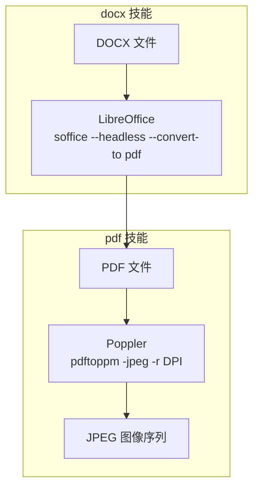
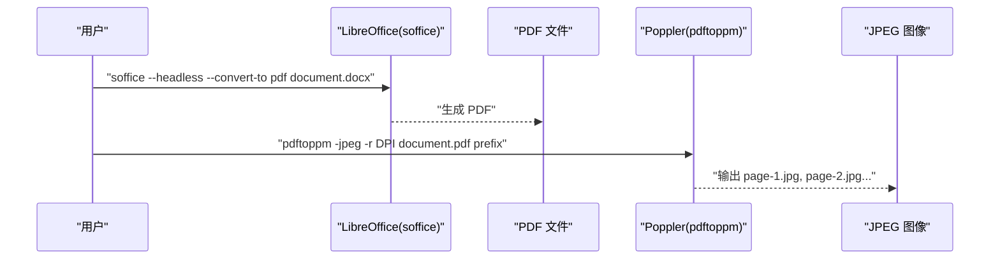
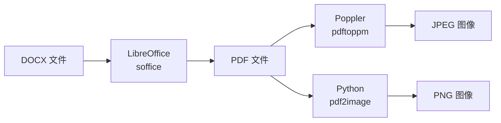

# 文档转换

<cite>
**本文引用的文件**
- [docx/SKILL.md](file://skills/docx/SKILL.md)
- [pdf/scripts/convert_pdf_to_images.py](file://skills/pdf/scripts/convert_pdf_to_images.py)
- [pdf/reference.md](file://skills/pdf/reference.md)
- [pdf/SKILL.md](file://skills/pdf/SKILL.md)
- [docx/ooxml/scripts/pack.py](file://skills/docx/ooxml/scripts/pack.py)
- [docx/ooxml/scripts/unpack.py](file://skills/docx/ooxml/scripts/unpack.py)
</cite>

## 目录
1. [简介](#简介)
2. [项目结构](#项目结构)
3. [核心组件](#核心组件)
4. [架构总览](#架构总览)
5. [详细组件分析](#详细组件分析)
6. [依赖关系分析](#依赖关系分析)
7. [性能考量](#性能考量)
8. [故障排查指南](#故障排查指南)
9. [结论](#结论)

## 简介
本文件面向需要将 DOCX 文档转换为图像的用户，系统性介绍两步转换流程：先由 LibreOffice 将 DOCX 转换为 PDF，再用 Poppler 的 pdftoppm 将 PDF 页面导出为 JPEG 图像。文档覆盖工具使用方法（分辨率、页面范围、输出格式）、命令行示例、批量处理技巧，并对质量与性能进行权衡说明，帮助在不同场景下做出合适的选择。

## 项目结构
围绕“文档转换”的相关能力分布在两个技能模块：
- docx 技能：提供 DOCX 到 PDF 的转换说明与依赖要求
- pdf 技能：提供 PDF 转图像的 Python 实现与命令行工具参考

图表来源
- [docx/SKILL.md](file://skills/docx/SKILL.md#L156-L181)
- [pdf/reference.md](file://skills/pdf/reference.md#L277-L287)

章节来源
- [docx/SKILL.md](file://skills/docx/SKILL.md#L156-L197)
- [pdf/reference.md](file://skills/pdf/reference.md#L265-L313)

## 核心组件
- LibreOffice（soffice）：将 DOCX 转换为 PDF，支持无头模式，适合自动化与批处理
- Poppler（pdftoppm）：将 PDF 页面导出为图像，支持 JPEG/PNG、指定分辨率与页码范围
- Python 辅助脚本：提供 PDF 转图像的 Python 实现，便于集成到 Python 工作流

章节来源
- [docx/SKILL.md](file://skills/docx/SKILL.md#L156-L197)
- [pdf/scripts/convert_pdf_to_images.py](file://skills/pdf/scripts/convert_pdf_to_images.py#L1-L36)
- [pdf/reference.md](file://skills/pdf/reference.md#L277-L287)

## 架构总览
两步转换的端到端流程如下：

图表来源
- [docx/SKILL.md](file://skills/docx/SKILL.md#L160-L168)
- [pdf/reference.md](file://skills/pdf/reference.md#L277-L287)

## 详细组件分析

### 组件一：LibreOffice DOCX → PDF
- 功能：将 DOCX 文档转换为 PDF，支持无头模式，适合服务器或 CI 环境
- 常用参数
  - --headless：无界面运行
  - --convert-to pdf：输出 PDF
- 典型命令
  - soffice --headless --convert-to pdf document.docx
- 适用场景：需要高质量矢量排版、保留复杂格式时优先使用

章节来源
- [docx/SKILL.md](file://skills/docx/SKILL.md#L160-L163)

### 组件二：Poppler pdftoppm PDF → JPEG/PNG
- 功能：将 PDF 页面导出为图像，支持 JPEG/PNG、指定分辨率与页码范围
- 关键参数
  - -jpeg/-png：输出格式
  - -r DPI：分辨率（DPI）
  - -f N/-l M：起止页码
  - 输出前缀：生成 page-1.jpg、page-2.jpg 等
- 典型命令
  - pdftoppm -jpeg -r 150 document.pdf page
  - pdftoppm -jpeg -r 300 -f 1 -l 3 document.pdf high_res_pages
  - pdftoppm -jpeg -jpegopt quality=85 -r 200 document.pdf jpeg_output
- 适用场景：需要将 PDF 页面作为图像输入到下游视觉任务（OCR、检测、分割）

章节来源
- [docx/SKILL.md](file://skills/docx/SKILL.md#L165-L181)
- [pdf/reference.md](file://skills/pdf/reference.md#L277-L287)

### 组件三：Python PDF → PNG（可选替代）
- 功能：使用 pdf2image 将 PDF 每一页转为 PNG，支持最大边缩放
- 特点：无需外部命令行工具，适合 Python 生态集成
- 参数与行为
  - dpi：默认 200
  - max_dim：默认 1000，超过则按比例缩放
  - 输出文件命名：page_1.png、page_2.png...

章节来源
- [pdf/scripts/convert_pdf_to_images.py](file://skills/pdf/scripts/convert_pdf_to_images.py#L10-L26)

### 组件四：OOXML 打包与验证（与转换流程的关系）
- pack.py：将解包后的 Office 文档目录打包回 .docx/.pptx/.xlsx，并可调用 soffice 进行验证
- unpack.py：将 Office 文件解包为目录，便于查看与编辑 XML
- 与转换流程的关系：虽然不直接参与 DOCX→PDF→图像的链路，但体现了 Office 文档的底层结构与验证机制，有助于理解转换质量与兼容性

章节来源
- [docx/ooxml/scripts/pack.py](file://skills/docx/ooxml/scripts/pack.py#L45-L131)
- [docx/ooxml/scripts/unpack.py](file://skills/docx/ooxml/scripts/unpack.py#L1-L29)

## 依赖关系分析
- 工具依赖
  - LibreOffice：soffice（DOCX→PDF）
  - Poppler：pdftoppm（PDF→图像）
  - 可选：pdf2image（Python 环境下的 PDF→PNG）
- 脚本依赖
  - Python 脚本依赖 pdf2image；若需安全解析 XML，可配合 defusedxml（见 docx 技能依赖说明）

图表来源
- [docx/SKILL.md](file://skills/docx/SKILL.md#L191-L197)
- [pdf/reference.md](file://skills/pdf/reference.md#L277-L287)
- [pdf/scripts/convert_pdf_to_images.py](file://skills/pdf/scripts/convert_pdf_to_images.py#L4-L11)

章节来源
- [docx/SKILL.md](file://skills/docx/SKILL.md#L191-L197)
- [pdf/reference.md](file://skills/pdf/reference.md#L277-L287)
- [pdf/scripts/convert_pdf_to_images.py](file://skills/pdf/scripts/convert_pdf_to_images.py#L1-L36)

## 性能考量
- 分辨率与体积权衡
  - DPI 提升会显著增大图像体积与处理时间；150 DPI 适合预览与一般分析，300 DPI 更适合高精度 OCR 或打印
  - 建议根据下游任务需求选择 DPI：OCR 通常 300 DPI，网页展示 150 DPI 即可
- 页面范围控制
  - 使用 -f/-l 指定页码范围，避免不必要的全量转换，提升吞吐
- 并行与批处理
  - 对于多文件转换，建议采用批处理脚本或队列系统，分发到多个进程/节点
  - 注意资源限制：CPU、内存、磁盘 IO 与临时空间
- 输出格式选择
  - JPEG：体积小、适合照片类内容；PNG：无损、适合需要清晰边缘的图形
- Python vs 命令行
  - 命令行工具（soffice、pdftoppm）通常更快且更稳定；Python 路径便于集成但可能受依赖版本影响

章节来源
- [docx/SKILL.md](file://skills/docx/SKILL.md#L171-L181)
- [pdf/reference.md](file://skills/pdf/reference.md#L528-L565)

## 故障排查指南
- LibreOffice 未安装或不可执行
  - 症状：命令找不到 soffice
  - 处理：安装 LibreOffice，并确保 PATH 正确
- Poppler 未安装或 pdftoppm 不可用
  - 症状：pdftoppm 命令不存在
  - 处理：安装 poppler-utils，并确认 pdftoppm 在 PATH 中
- 转换后图像缺失或为空
  - 检查 PDF 是否有效（可尝试用 PDF 阅读器打开）
  - 检查 -f/-l 页码范围是否正确
  - 检查输出目录权限与磁盘空间
- Python 环境问题
  - 若使用 pdf2image：确认安装了 pdf2image 与底层依赖（如 poppler）
  - 若出现编码或 XML 解析异常：可结合 defusedxml（docx 技能依赖说明）进行安全解析
- 质量不佳
  - 降低 DPI 导致模糊；提高 DPI 会增加体积与耗时
  - 对扫描版 PDF：考虑先 OCR 再转图像，或使用更高 DPI

章节来源
- [docx/SKILL.md](file://skills/docx/SKILL.md#L191-L197)
- [pdf/reference.md](file://skills/pdf/reference.md#L567-L601)

## 结论
两步转换流程（DOCX→PDF→JPEG）是将 Word 文档可视化的重要手段。通过合理选择分辨率、限定页面范围、选择合适的输出格式，可以在质量与性能之间取得平衡。对于大规模批处理，建议结合命令行工具与并行策略，并在 Python 环境中使用 pdf2image 以增强可移植性。遇到问题时，优先检查工具安装、PDF 合法性与输出路径权限。