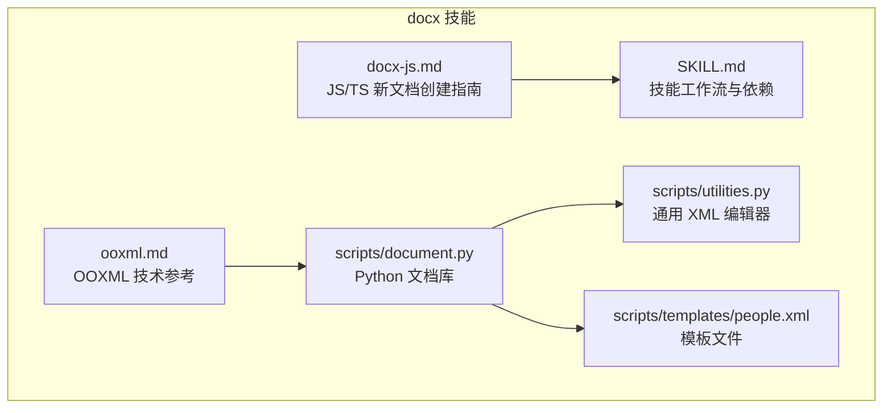
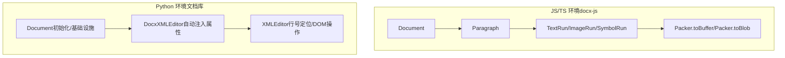
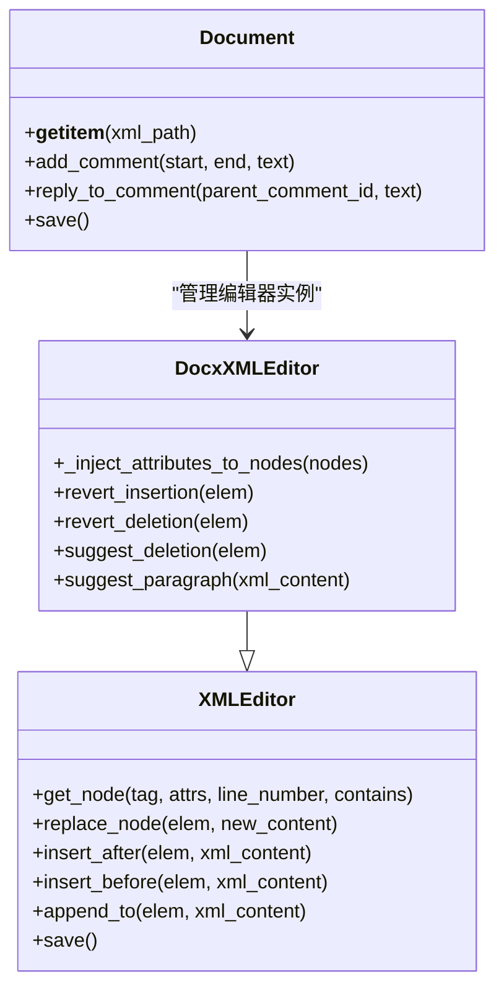
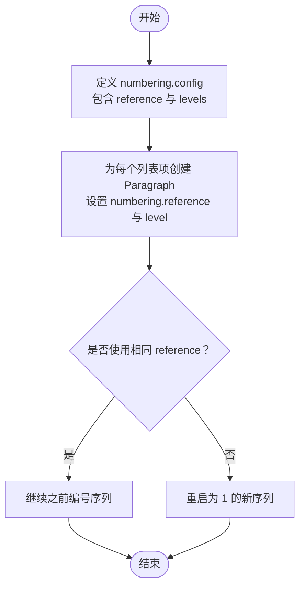
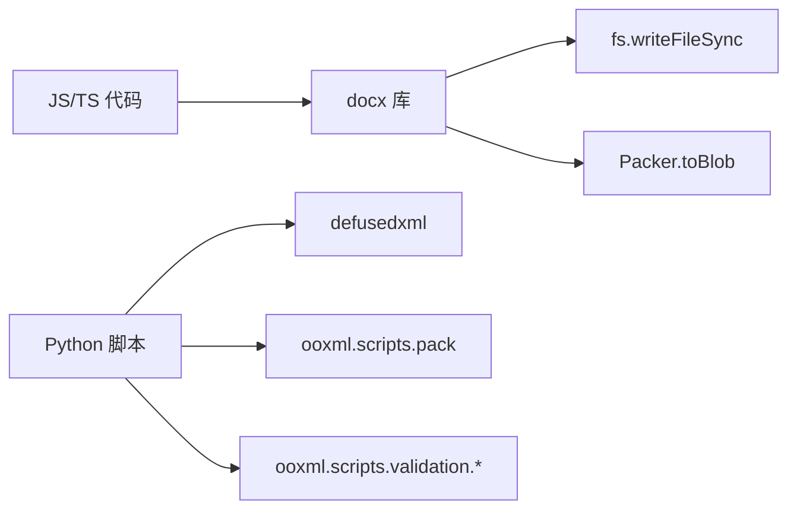

# 新文档创建

<cite>
**本文引用的文件**
- [docx-js.md](file://skills/docx/docx-js.md)
- [ooxml.md](file://skills/docx/ooxml.md)
- [SKILL.md](file://skills/docx/SKILL.md)
- [document.py](file://skills/docx/scripts/document.py)
- [utilities.py](file://skills/docx/scripts/utilities.py)
- [people.xml](file://skills/docx/scripts/templates/people.xml)
</cite>

## 目录
1. [简介](#简介)
2. [项目结构](#项目结构)
3. [核心组件](#核心组件)
4. [架构总览](#架构总览)
5. [详细组件分析](#详细组件分析)
6. [依赖关系分析](#依赖关系分析)
7. [性能考虑](#性能考虑)
8. [故障排除指南](#故障排除指南)
9. [结论](#结论)
10. [附录](#附录)

## 简介
本文件面向使用 docx-js 库在 JavaScript/TypeScript 环境下创建 Word 文档（.docx）的场景，系统性阐述从基础文本到复杂格式的完整流程，并重点说明如何通过 Packer.toBuffer() 导出 .docx 文件。同时，结合仓库中的技术文档与 Python 工具链，解释 docx-js 的 API 设计理念、最佳实践与常见陷阱，帮助开发者避免生成无效或渲染异常的文档。

## 项目结构
docx 技能模块包含三类能力：
- 使用 docx-js 创建新文档：以 JavaScript/TypeScript 编写，通过 Document、Paragraph、TextRun 等组件构建内容，最终导出为 .docx。
- 使用 Python 文档库编辑现有文档：对已有的 .docx 进行解包、DOM 操作、打包，支持跟踪修订、批注等高级功能。
- 技术参考与模式：OOXML 规范、XML 结构、常量与快速参考，确保生成的 .docx 符合标准。



图表来源
- [docx-js.md](file://skills/docx/docx-js.md#L1-L350)
- [ooxml.md](file://skills/docx/ooxml.md#L1-L610)
- [SKILL.md](file://skills/docx/SKILL.md#L1-L197)
- [document.py](file://skills/docx/scripts/document.py#L1-L800)
- [utilities.py](file://skills/docx/scripts/utilities.py#L1-L375)
- [people.xml](file://skills/docx/scripts/templates/people.xml#L1-L3)

章节来源
- [SKILL.md](file://skills/docx/SKILL.md#L1-L197)

## 核心组件
- JS/TS 新文档创建（docx-js）
  - 关键 API：Document、Paragraph、TextRun、Table、TableRow、TableCell、ImageRun、Packer、AlignmentType、BorderStyle、WidthType、LevelFormat、HeadingLevel、UnderlineType、ShadingType、TabStopType、PageBreak、PageNumber、ExternalHyperlink、InternalHyperlink、TableOfContents 等。
  - 导出方式：Packer.toBuffer(doc) 返回 Buffer，再写入文件；浏览器环境可用 Packer.toBlob(doc)。
  - 最佳实践：禁止使用 \n 实现换行；必须使用独立 Paragraph；表格列宽需同时设置 Table 层 columnWidths 与 Cell 层 width；图片必须指定 type 参数；页码与分节符等需正确嵌套在 Paragraph 中。

- Python 文档库（用于编辑现有文档）
  - Document 类：自动处理基础设施（people.xml、RSID、settings.xml、评论文件、关系、内容类型），支持跟踪修订与批注。
  - DocxXMLEditor：自动注入 RSID、作者、时间戳等属性，提供替换、插入、删除、反向修订等方法。
  - XMLEditor：基于行号定位节点、DOM 操作、保存回文件。

章节来源
- [docx-js.md](file://skills/docx/docx-js.md#L11-L22)
- [docx-js.md](file://skills/docx/docx-js.md#L25-L49)
- [docx-js.md](file://skills/docx/docx-js.md#L158-L218)
- [docx-js.md](file://skills/docx/docx-js.md#L257-L270)
- [docx-js.md](file://skills/docx/docx-js.md#L272-L286)
- [docx-js.md](file://skills/docx/docx-js.md#L288-L314)
- [docx-js.md](file://skills/docx/docx-js.md#L316-L326)
- [document.py](file://skills/docx/scripts/document.py#L612-L712)
- [utilities.py](file://skills/docx/scripts/utilities.py#L41-L375)

## 架构总览
docx-js 专注于“从零创建”，通过对象模型直接生成符合 OOXML 的结构；Python 文档库专注于“修改现有”，通过解包、DOM 操作、再打包实现精确控制。两者互补，满足不同场景需求。



图表来源
- [docx-js.md](file://skills/docx/docx-js.md#L11-L22)
- [document.py](file://skills/docx/scripts/document.py#L612-L712)
- [utilities.py](file://skills/docx/scripts/utilities.py#L41-L375)

## 详细组件分析

### JS/TS 新文档创建（docx-js）
- Document
  - 作为根容器，包含 sections 数组，每个 section 可包含 children（Paragraph、Table、ImageRun 等）。
  - 支持 styles 定义默认字体、段落样式、字符样式，以及 numbering 配置用于列表。
- Paragraph
  - 文本换行必须使用多个 Paragraph，而非在 TextRun 中使用 \n。
  - 支持对齐、间距、缩进、编号、分页前断行等属性。
- TextRun
  - 字体、字号、颜色、高亮、下划线、删除线、上标/下标、小型大写字母、符号等丰富格式。
  - 建议使用自定义样式替代内联格式，保持一致性。
- Table/TableRow/TableCell
  - 表格列宽需同时设置 Table.columnWidths 与 Cell.width；边框应设置在单元格层面。
  - 单元格阴影建议使用 ShadingType.CLEAR，避免黑色背景。
- 图片与媒体
  - ImageRun 必须指定 type（png/jpg/jpeg/gif/bmp/svg），并提供数据与可选变换参数。
  - 建议设置 altText 的 title/description/name 三项。
- 分页与页眉页脚
  - PageBreak 必须包裹在 Paragraph 中；页眉页脚通过 Section.properties.headers/footers 设置。
- 超链接与目录
  - 外部链接使用 ExternalHyperlink，内部链接使用 InternalHyperlink + bookmark。
  - 目录需使用 HeadingLevel 并配置标题范围。

```mermaid
sequenceDiagram
participant Dev as "开发者"
participant Doc as "Document"
participant Par as "Paragraph"
participant Run as "TextRun/ImageRun"
participant Packer as "Packer"
Dev->>Doc : "创建 Document 实例"
Doc->>Par : "添加段落含换行"
Par->>Run : "添加文本/图片/符号等"
Dev->>Packer : "调用 toBuffer(doc)"
Packer-->>Dev : "返回 Buffer"
Dev->>Dev : "fs.writeFileSync 写入 .docx"
```

图表来源
- [docx-js.md](file://skills/docx/docx-js.md#L11-L22)
- [docx-js.md](file://skills/docx/docx-js.md#L25-L49)
- [docx-js.md](file://skills/docx/docx-js.md#L158-L218)
- [docx-js.md](file://skills/docx/docx-js.md#L257-L270)
- [docx-js.md](file://skills/docx/docx-js.md#L272-L286)
- [docx-js.md](file://skills/docx/docx-js.md#L288-L314)

章节来源
- [docx-js.md](file://skills/docx/docx-js.md#L11-L22)
- [docx-js.md](file://skills/docx/docx-js.md#L25-L49)
- [docx-js.md](file://skills/docx/docx-js.md#L109-L156)
- [docx-js.md](file://skills/docx/docx-js.md#L158-L218)
- [docx-js.md](file://skills/docx/docx-js.md#L229-L255)
- [docx-js.md](file://skills/docx/docx-js.md#L257-L270)
- [docx-js.md](file://skills/docx/docx-js.md#L272-L286)
- [docx-js.md](file://skills/docx/docx-js.md#L288-L314)
- [docx-js.md](file://skills/docx/docx-js.md#L316-L326)

### Python 文档库（编辑现有文档）
- Document 初始化
  - 自动复制原始 .docx 到临时目录，生成 RSID，设置作者与初始值，准备 comments.xml 等基础设施。
  - 可选择启用 track_revisions，自动更新 settings.xml。
- DocxXMLEditor
  - 自动为新元素注入 w:rsidR/w:rsidRDefault/w:rsidP、作者、日期、变更 ID 等。
  - 提供 revert_insertion/revert_deletion/suggest_deletion 等方法，严格遵循 OOXML 的 <w:ins>/<w:del> 结构。
- XMLEditor
  - 基于行号定位节点，支持按属性、文本内容、行号范围过滤。
  - 提供 replace_node/insert_after/insert_before/append_to 等 DOM 操作。



图表来源
- [utilities.py](file://skills/docx/scripts/utilities.py#L41-L375)
- [document.py](file://skills/docx/scripts/document.py#L47-L263)
- [document.py](file://skills/docx/scripts/document.py#L612-L712)

章节来源
- [document.py](file://skills/docx/scripts/document.py#L612-L712)
- [document.py](file://skills/docx/scripts/document.py#L47-L263)
- [utilities.py](file://skills/docx/scripts/utilities.py#L41-L375)

### 列表与编号规则（关键注意事项）
- 使用 numbering.config + LevelFormat.BULLET/DECIMAL，而非 Unicode 符号。
- 不同 reference 表示独立编号序列；相同 reference 表示连续编号。
- 列表项必须包裹在 Paragraph 中，且 Paragraph 的 numbering.reference 与 level 正确。



图表来源
- [docx-js.md](file://skills/docx/docx-js.md#L109-L156)

章节来源
- [docx-js.md](file://skills/docx/docx-js.md#L109-L156)

### 表格宽度与边框（关键注意事项）
- 同时设置 Table.columnWidths 与每个 Cell.width（DXA）。
- 边框应设置在 TableCell 层，而非 Table 层。
- 使用 ShadingType.CLEAR 避免黑色背景。

章节来源
- [docx-js.md](file://skills/docx/docx-js.md#L158-L218)

### 页面布局与分页（关键注意事项）
- PageBreak 必须包裹在 Paragraph 中，否则会生成无效 XML。
- 页眉页脚通过 Section.properties.headers/footers 设置，页码起始与格式可配置。

章节来源
- [docx-js.md](file://skills/docx/docx-js.md#L272-L286)
- [docx-js.md](file://skills/docx/docx-js.md#L288-L314)

## 依赖关系分析
- JS/TS 环境依赖
  - docx 库：提供 Document、Paragraph、TextRun、Packer 等核心 API。
  - Node.js：使用 fs.writeFileSync 将 Buffer 写入 .docx。
  - 浏览器：使用 Packer.toBlob 生成 Blob，再进行下载或上传。
- Python 环境依赖
  - defusedxml：安全解析 XML，避免 XXE 等风险。
  - ooxml.scripts.pack：将解包后的目录重新打包为 .docx。
  - ooxml.scripts.validation.*：验证文档结构与跟踪修订规则。



图表来源
- [SKILL.md](file://skills/docx/SKILL.md#L189-L197)
- [document.py](file://skills/docx/scripts/document.py#L36-L41)

章节来源
- [SKILL.md](file://skills/docx/SKILL.md#L189-L197)
- [document.py](file://skills/docx/scripts/document.py#L36-L41)

## 性能考虑
- JS/TS 新文档创建
  - 尽量复用样式与段落属性，减少重复对象创建。
  - 图片建议预处理尺寸，避免过大导致内存与导出时间增加。
- Python 文档库
  - 批量修改时采用“分批”策略（3-10 个相关更改一组），便于调试与验证。
  - 使用行号定位节点时，先 grep 确认当前结构，避免因多次修改导致行号漂移。

## 故障排除指南
- 生成的 .docx 无法打开或提示损坏
  - 检查是否将 PageBreak 独立放置；必须包裹在 Paragraph 中。
  - 确保表格列宽同时设置 Table 与 Cell 层。
  - 图片是否设置了 type 参数与 altText。
- 列表显示异常
  - 是否使用了 LevelFormat.BULLET；不同 reference 是否导致编号重置。
- 目录不生效
  - 是否使用了 HeadingLevel；不要给标题段落附加自定义样式。
- 跟踪修订与批注问题
  - Python 文档库会自动注入 RSID、作者、时间戳；确认 comments.xml、people.xml、settings.xml 是否存在并正确更新。
  - 使用 revert_insertion/revert_deletion 时，确保传入的是正确的容器元素。

章节来源
- [docx-js.md](file://skills/docx/docx-js.md#L335-L350)
- [ooxml.md](file://skills/docx/ooxml.md#L266-L289)
- [document.py](file://skills/docx/scripts/document.py#L612-L712)

## 结论
- 使用 docx-js 可以高效地从零创建专业级 Word 文档，遵循仓库提供的格式规范与最佳实践，可避免常见的渲染与兼容性问题。
- 对于需要精确控制、跟踪修订与批注的场景，建议使用 Python 文档库进行现有文档的编辑与维护。
- 两种方案互补：前者适合“新建”，后者适合“编辑”。

## 附录
- 常用常量与快速参考
  - 下划线：SINGLE、DOUBLE、WAVY、DASH
  - 边框：SINGLE、DOUBLE、DASHED、DOTTED
  - 编号：DECIMAL、UPPER_ROMAN、LOWER_LETTER
  - 制表符：LEFT、CENTER、RIGHT、DECIMAL
  - 符号：•、©、®、™、°、✓、✗ 等（对应十六进制编码）

章节来源
- [docx-js.md](file://skills/docx/docx-js.md#L328-L333)