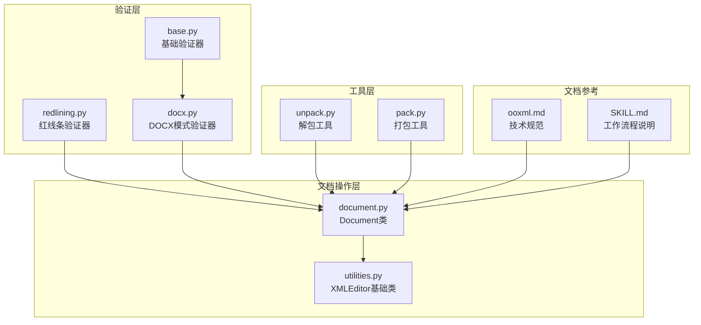
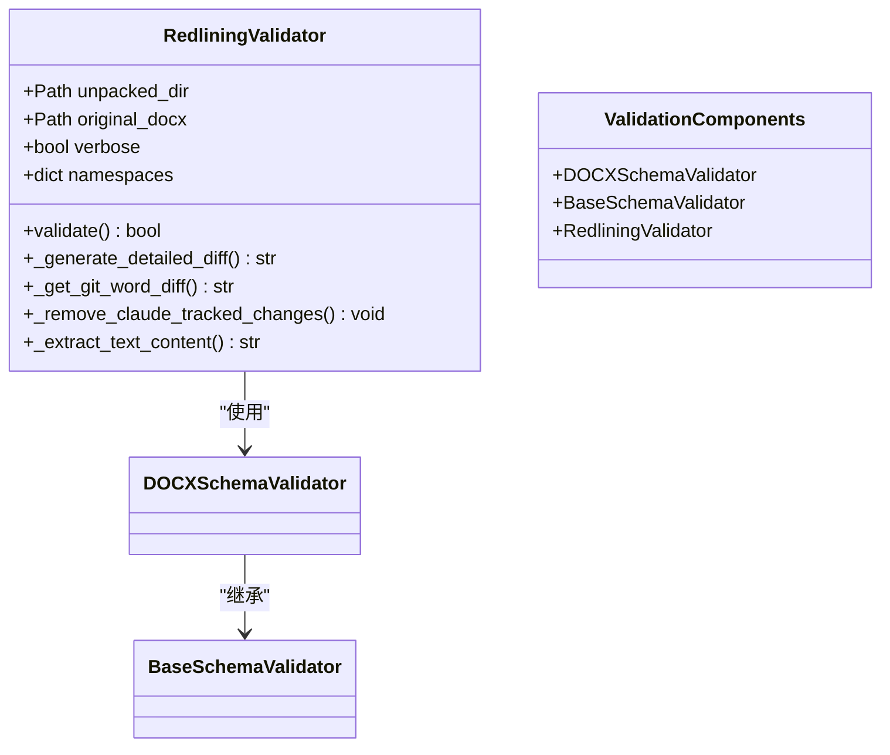
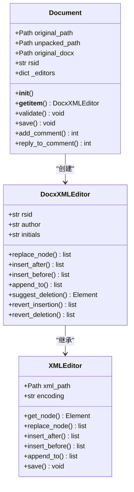
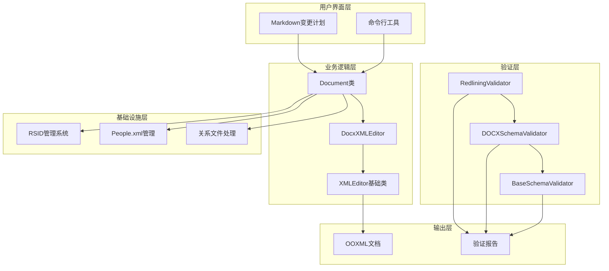
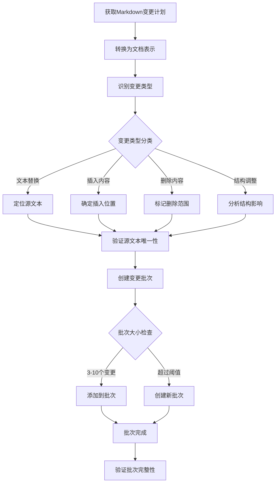
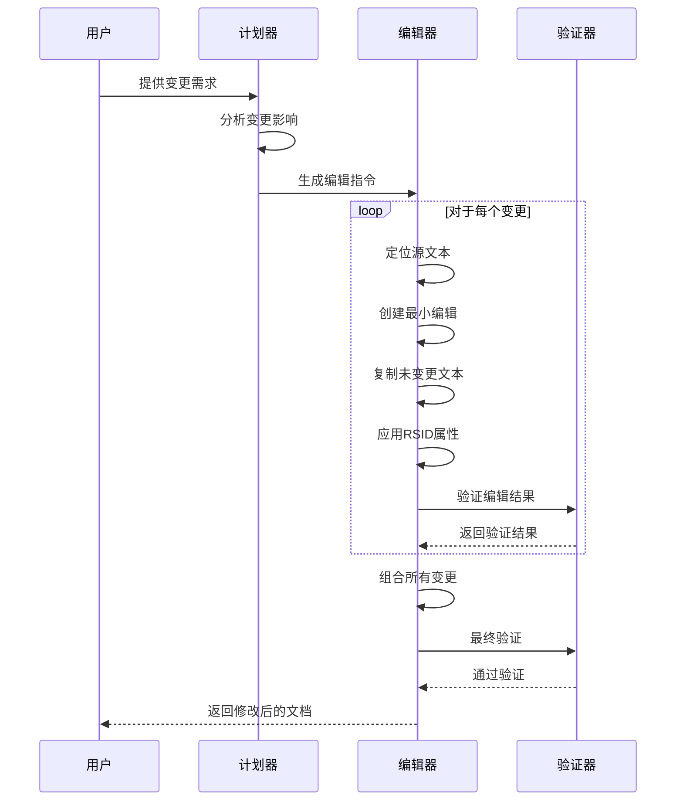
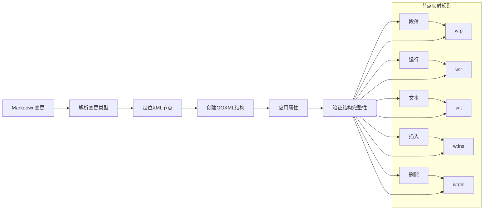
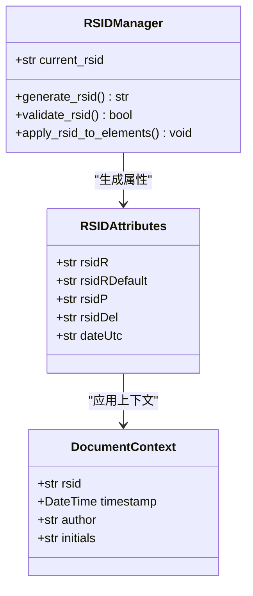
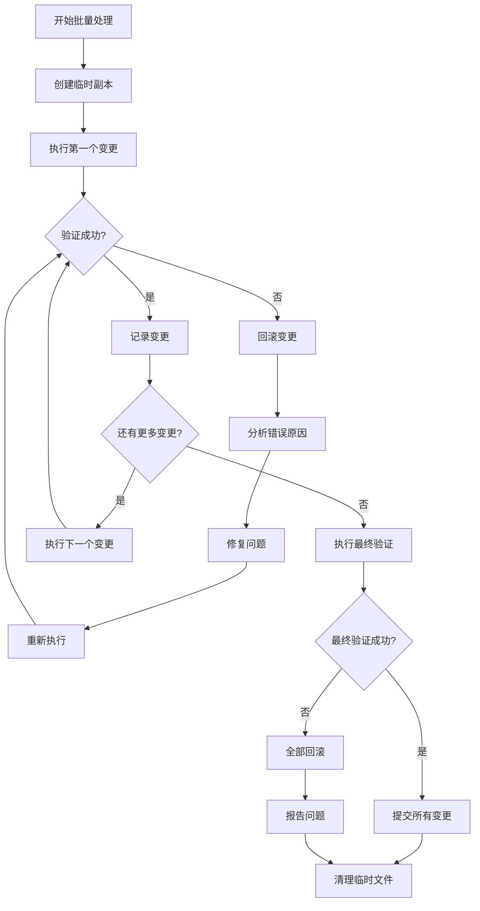
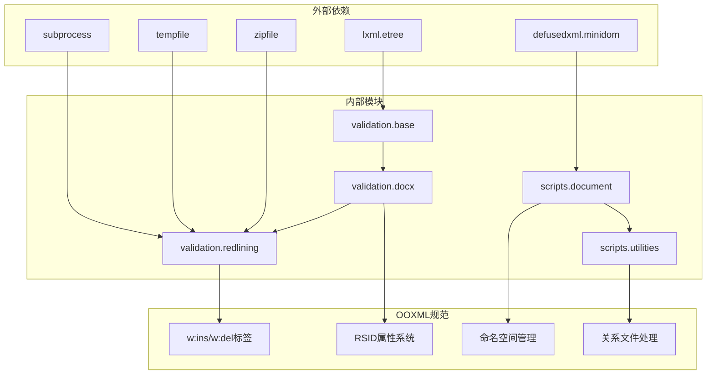

# 红线条工作流程

<cite>
**本文档引用的文件**
- [redlining.py](file://skills/docx/ooxml/scripts/validation/redlining.py)
- [docx.py](file://skills/docx/ooxml/scripts/validation/docx.py)
- [base.py](file://skills/docx/ooxml/scripts/validation/base.py)
- [document.py](file://skills/docx/scripts/document.py)
- [utilities.py](file://skills/docx/scripts/utilities.py)
- [ooxml.md](file://skills/docx/ooxml.md)
- [SKILL.md](file://skills/docx/SKILL.md)
- [unpack.py](file://skills/docx/ooxml/scripts/unpack.py)
- [pack.py](file://skills/docx/ooxml/scripts/pack.py)
</cite>

## 目录
1. [简介](#简介)
2. [项目结构](#项目结构)
3. [核心组件](#核心组件)
4. [架构概览](#架构概览)
5. [详细组件分析](#详细组件分析)
6. [依赖关系分析](#依赖关系分析)
7. [性能考虑](#性能考虑)
8. [故障排除指南](#故障排除指南)
9. [结论](#结论)

## 简介

DOCX红线条工作流程是该代码库中最复杂的功能模块，专门用于实现Word文档中的跟踪变更（修订）系统。这个工作流程确保所有文本修改都通过标准的OOXML `<w:ins>`（插入）和 `<w:del>`（删除）标签进行标记，实现了专业文档审查所需的完整变更追踪机制。

该工作流程的核心目标是：
- 系统性地识别和处理所有文档变更
- 实现最小精确编辑原则，仅标记实际发生变化的文本
- 提供批量处理能力，支持3-10个相关变更的分组操作
- 确保RSID（修订序列标识符）管理的正确性和一致性
- 实现从Markdown变更计划到OOXML实现的完整转换

## 项目结构

DOCX红线条工作流程涉及以下关键文件和目录：

**图表来源**
- [redlining.py](file://skills/docx/ooxml/scripts/validation/redlining.py#L11-L280)
- [docx.py](file://skills/docx/ooxml/scripts/validation/docx.py#L14-L275)
- [base.py](file://skills/docx/ooxml/scripts/validation/base.py#L11-L952)
- [document.py](file://skills/docx/scripts/document.py#L47-L1277)

**章节来源**
- [redlining.py](file://skills/docx/ooxml/scripts/validation/redlining.py#L1-L280)
- [docx.py](file://skills/docx/ooxml/scripts/validation/docx.py#L1-L275)
- [base.py](file://skills/docx/ooxml/scripts/validation/base.py#L1-L952)
- [document.py](file://skills/docx/scripts/document.py#L1-L1277)

## 核心组件

### 红线条验证器（RedliningValidator）

红线条验证器是整个工作流程的核心组件，负责验证文档中的跟踪变更是否符合标准要求：

**图表来源**
- [redlining.py](file://skills/docx/ooxml/scripts/validation/redlining.py#L11-L280)
- [docx.py](file://skills/docx/ooxml/scripts/validation/docx.py#L14-L275)
- [base.py](file://skills/docx/ooxml/scripts/validation/base.py#L11-L952)

### 文档库（Document类）

Document类提供了高级API来处理文档操作，自动处理基础设施设置和属性注入：

**图表来源**
- [document.py](file://skills/docx/scripts/document.py#L612-L1277)
- [utilities.py](file://skills/docx/scripts/utilities.py#L41-L375)

**章节来源**
- [redlining.py](file://skills/docx/ooxml/scripts/validation/redlining.py#L11-L280)
- [document.py](file://skills/docx/scripts/document.py#L612-L1277)
- [utilities.py](file://skills/docx/scripts/utilities.py#L41-L375)

## 架构概览

红线条工作流程采用分层架构设计，确保每个组件都有明确的职责分工：

**图表来源**
- [SKILL.md](file://skills/docx/SKILL.md#L75-L154)
- [document.py](file://skills/docx/scripts/document.py#L612-L1277)
- [redlining.py](file://skills/docx/ooxml/scripts/validation/redlining.py#L22-L112)

## 详细组件分析

### 变更识别与分批处理

变更识别是红线条工作流程的第一步，需要系统性地分析文档并确定所有需要修改的内容：

#### 变更识别策略

**图表来源**
- [SKILL.md](file://skills/docx/SKILL.md#L100-L137)

#### 分批处理原则

分批处理是确保工作流程可管理性的关键机制：

1. **批次大小控制**：每批包含3-10个相关变更
2. **逻辑分组**：按章节、变更类型或地理位置分组
3. **顺序执行**：确保批次间的依赖关系得到满足
4. **独立验证**：每个批次完成后进行验证

**章节来源**
- [SKILL.md](file://skills/docx/SKILL.md#L79-L137)

### 最小精确编辑实现

最小精确编辑原则是红线条工作流程的核心技术要求：

#### 编辑策略

**图表来源**
- [ooxml.md](file://skills/docx/ooxml.md#L309-L388)

#### 属性管理系统

最小精确编辑要求精确管理各种属性：

| 属性类型 | 作用域 | 必需属性 | 自动注入 |
|---------|--------|----------|----------|
| RSID属性 | 段落/运行 | w:rsidR, w:rsidRDefault, w:rsidP | ✅ |
| 修订属性 | 修订元素 | w:id, w:author, w:date | ✅ |
| 注释属性 | 注释元素 | w:author, w:date, w:initials | ✅ |
| 命名空间 | 所有元素 | w16du:dateUtc, w14:paraId | ✅ |

**章节来源**
- [document.py](file://skills/docx/scripts/document.py#L116-L239)
- [ooxml.md](file://skills/docx/ooxml.md#L309-L388)

### OOXML实现转换

从Markdown变更计划到OOXML实现的转换过程：

#### XML节点映射

**图表来源**
- [ooxml.md](file://skills/docx/ooxml.md#L554-L610)

#### RSID管理机制

RSID（修订序列标识符）是OOXML中重要的版本控制机制：

**图表来源**
- [document.py](file://skills/docx/scripts/document.py#L607-L610)
- [document.py](file://skills/docx/scripts/document.py#L116-L181)

**章节来源**
- [ooxml.md](file://skills/docx/ooxml.md#L16-L19)
- [document.py](file://skills/docx/scripts/document.py#L607-L610)

### 批量调试与验证

批量调试是确保大规模变更正确性的关键机制：

#### 调试流程

**图表来源**
- [SKILL.md](file://skills/docx/SKILL.md#L120-L154)

**章节来源**
- [SKILL.md](file://skills/docx/SKILL.md#L120-L154)

## 依赖关系分析

红线条工作流程涉及多个层次的依赖关系：

**图表来源**
- [base.py](file://skills/docx/ooxml/scripts/validation/base.py#L1-L952)
- [docx.py](file://skills/docx/ooxml/scripts/validation/docx.py#L1-L275)
- [redlining.py](file://skills/docx/ooxml/scripts/validation/redlining.py#L1-L280)
- [document.py](file://skills/docx/scripts/document.py#L1-L1277)
- [utilities.py](file://skills/docx/scripts/utilities.py#L1-L375)

**章节来源**
- [base.py](file://skills/docx/ooxml/scripts/validation/base.py#L1-L952)
- [docx.py](file://skills/docx/ooxml/scripts/validation/docx.py#L1-L275)
- [redlining.py](file://skills/docx/ooxml/scripts/validation/redlining.py#L1-L280)

## 性能考虑

红线条工作流程在设计时充分考虑了性能优化：

### 内存管理

- **临时文件处理**：使用临时目录存储中间状态，避免内存泄漏
- **增量验证**：只对新增的验证错误进行报告，减少重复计算
- **懒加载编辑器**：按需创建XML编辑器实例，节省内存资源

### 处理效率

- **批量操作**：支持多个变更的批量应用，减少文件I/O操作
- **缓存机制**：缓存已解析的XML文件，避免重复解析
- **并行处理**：验证器支持并行处理多个文件

### 验证优化

- **选择性验证**：只验证必要的文件和元素
- **增量比较**：与原始文档进行增量比较，快速发现差异
- **错误聚合**：将相关错误聚合在一起，便于调试

## 故障排除指南

### 常见问题及解决方案

#### 验证失败

**问题**：红线条验证器返回失败
**原因**：文档中存在不符合标准的跟踪变更
**解决方案**：
1. 检查 `<w:ins>` 和 `<w:del>` 元素的嵌套结构
2. 验证RSID属性的正确性
3. 确认作者属性的一致性

#### XML解析错误

**问题**：XML解析失败
**原因**：XML文件格式不正确或编码问题
**解决方案**：
1. 使用XML格式化工具检查文件结构
2. 验证字符编码设置
3. 检查命名空间声明的完整性

#### 关系文件错误

**问题**：关系文件引用无效
**原因**：`.rels` 文件中的目标路径不正确
**解决方案**：
1. 检查关系文件中的Target属性
2. 验证相对路径的正确性
3. 确认目标文件的存在性

**章节来源**
- [redlining.py](file://skills/docx/ooxml/scripts/validation/redlining.py#L114-L137)
- [docx.py](file://skills/docx/ooxml/scripts/validation/docx.py#L124-L171)

## 结论

DOCX红线条工作流程是一个高度复杂且精密的系统，它将文档审查的最佳实践与现代软件工程方法完美结合。通过系统性的变更识别、精确的分批处理、严格的最小编辑原则以及完善的RSID管理，该工作流程确保了所有文档变更的可追溯性和可验证性。

### 关键优势

1. **系统性**：确保所有变更都被识别和处理，没有遗漏
2. **精确性**：最小化编辑范围，只标记实际变化的文本
3. **可验证性**：通过多层验证确保文档质量
4. **可维护性**：清晰的架构设计便于长期维护

### 最佳实践建议

1. **严格遵循批次原则**：每次只处理3-10个相关变更
2. **保持最小编辑原则**：只标记实际变化的文本
3. **定期验证**：每个批次完成后立即进行验证
4. **详细记录**：保留变更日志以便审计

该工作流程为专业文档处理提供了标准化的解决方案，适用于法律、商业、政府等各种对文档完整性要求极高的场景。