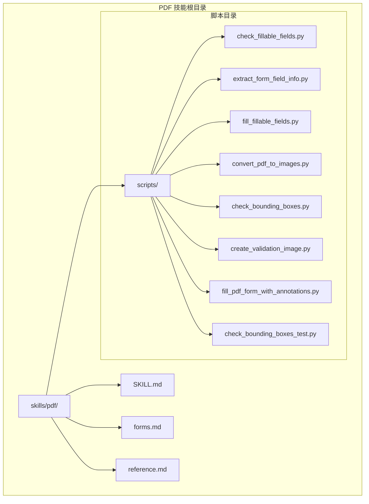
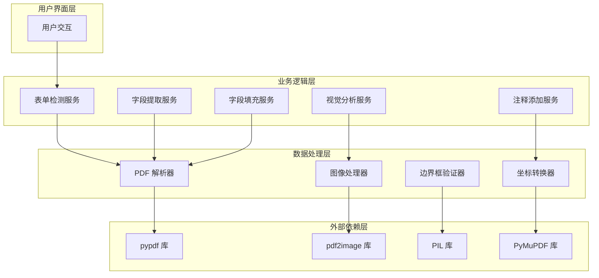
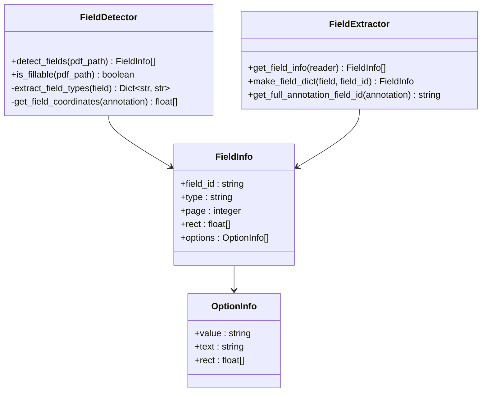
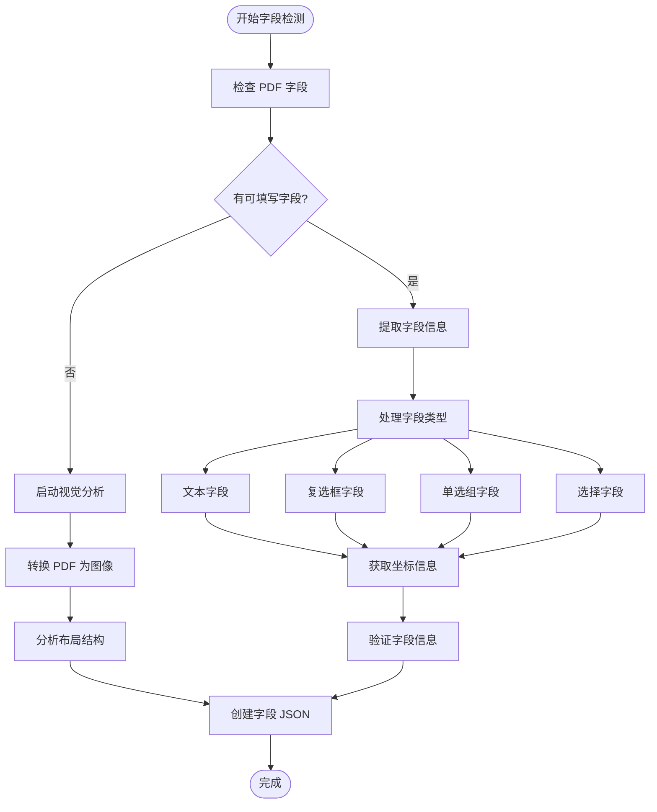
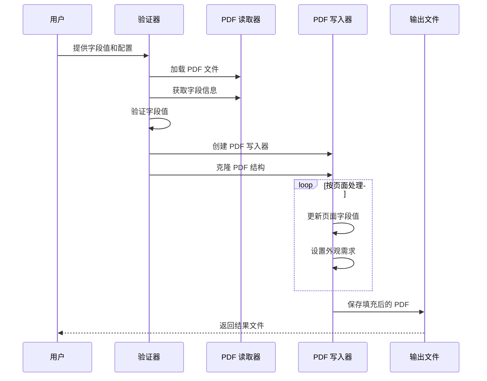
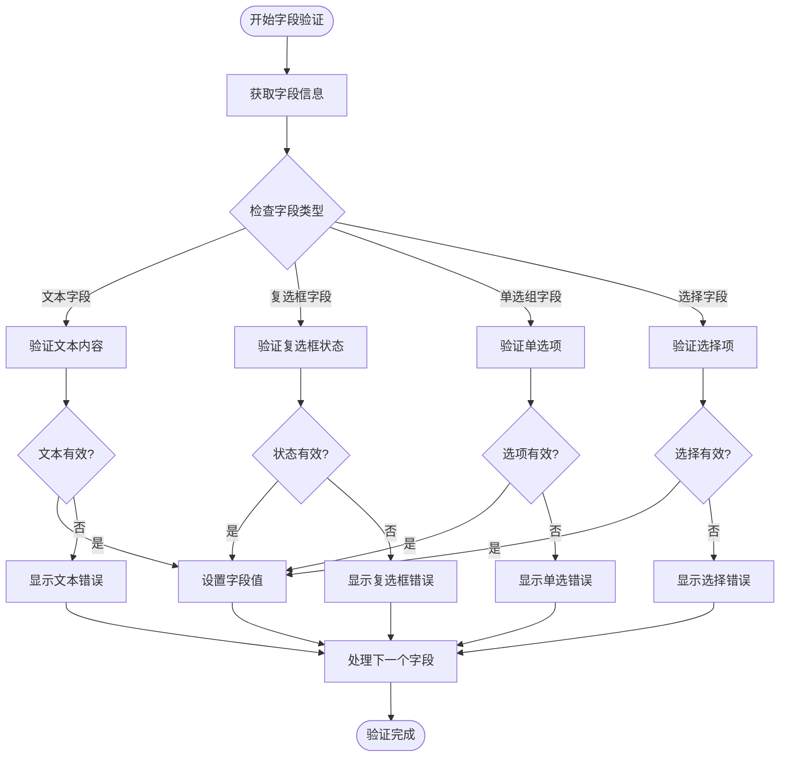
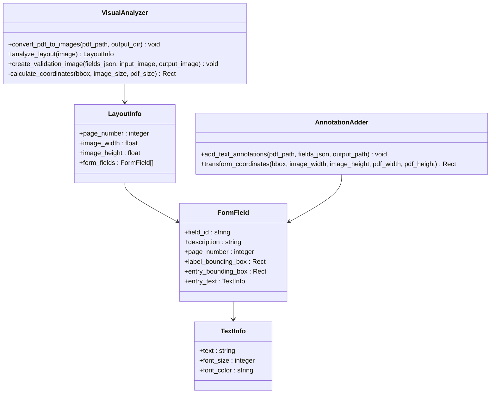
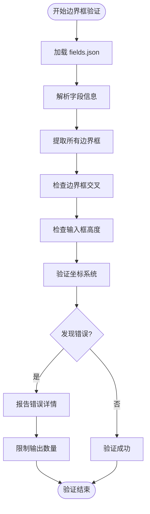
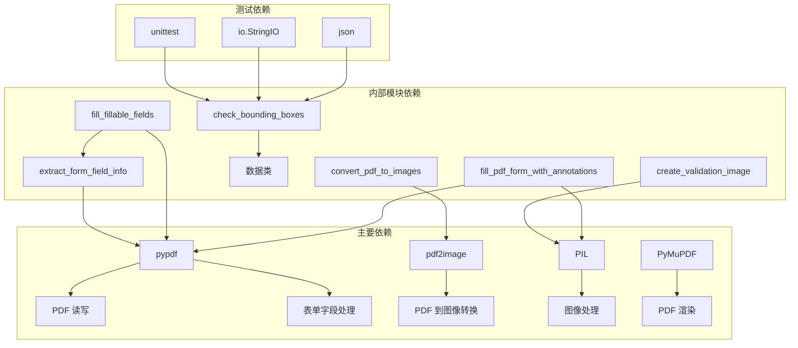

# PDF 文档处理

<cite>
**本文档中引用的文件**
- [SKILL.md](file://skills/pdf/SKILL.md)
- [forms.md](file://skills/pdf/forms.md)
- [reference.md](file://skills/pdf/reference.md)
- [check_fillable_fields.py](file://skills/pdf/scripts/check_fillable_fields.py)
- [extract_form_field_info.py](file://skills/pdf/scripts/extract_form_field_info.py)
- [fill_fillable_fields.py](file://skills/pdf/scripts/fill_fillable_fields.py)
- [convert_pdf_to_images.py](file://skills/pdf/scripts/convert_pdf_to_images.py)
- [check_bounding_boxes.py](file://skills/pdf/scripts/check_bounding_boxes.py)
- [create_validation_image.py](file://skills/pdf/scripts/create_validation_image.py)
- [fill_pdf_form_with_annotations.py](file://skills/pdf/scripts/fill_pdf_form_with_annotations.py)
- [check_bounding_boxes_test.py](file://skills/pdf/scripts/check_bounding_boxes_test.py)
</cite>

## 目录
1. [简介](#简介)
2. [项目结构](#项目结构)
3. [核心组件](#核心组件)
4. [架构概览](#架构概览)
5. [详细组件分析](#详细组件分析)
6. [依赖关系分析](#依赖关系分析)
7. [性能考虑](#性能考虑)
8. [故障排除指南](#故障排除指南)
9. [最佳实践](#最佳实践)
10. [结论](#结论)

## 简介

PDF 文档处理技能提供了全面的 PDF 操作能力，包括创建、编辑、分析和处理各种 PDF 功能。该技能涵盖了从基础的 PDF 合并与拆分到高级的表单处理、文本提取、边界框检查、可填写字段填充以及 PDF 转换等完整的工作流程。

该技能特别专注于两种主要的 PDF 处理场景：
1. **可填写表单处理**：自动检测和填充 PDF 可填写字段
2. **非可填写表单处理**：通过视觉分析和注释添加来处理静态 PDF

通过结合 Python 库（如 pypdf、pdfplumber、reportlab）和命令行工具（如 poppler-utils、qpdf），该技能提供了灵活且强大的 PDF 处理解决方案。

## 项目结构

PDF 技能采用模块化设计，将不同的 PDF 处理功能组织在清晰的目录结构中：



**图表来源**
- [SKILL.md](file://skills/pdf/SKILL.md#L1-L295)
- [forms.md](file://skills/pdf/forms.md#L1-L206)

**章节来源**
- [SKILL.md](file://skills/pdf/SKILL.md#L1-L295)
- [forms.md](file://skills/pdf/forms.md#L1-L206)

## 核心组件

PDF 技能的核心由以下主要组件构成：

### 1. 表单处理引擎
- **可填写字段检测**：自动识别 PDF 中的可填写表单字段
- **字段信息提取**：提取字段类型、位置和属性信息
- **字段值填充**：安全地填充各种类型的表单字段

### 2. 视觉分析系统
- **PDF 图像转换**：将 PDF 页面转换为高分辨率图像
- **边界框验证**：检查标签和输入区域的准确性
- **验证图像生成**：创建可视化验证图像

### 3. 注释添加器
- **坐标转换**：在图像坐标和 PDF 坐标之间进行精确转换
- **文本注释**：向 PDF 添加文本注释以完成表单
- **字体和样式**：支持字体大小、颜色等样式设置

### 4. 工具库
- **边界框检查器**：验证边界框的正确性和有效性
- **批量处理**：支持大规模 PDF 文件处理
- **错误处理**：提供健壮的错误处理机制

**章节来源**
- [extract_form_field_info.py](file://skills/pdf/scripts/extract_form_field_info.py#L1-L153)
- [fill_fillable_fields.py](file://skills/pdf/scripts/fill_fillable_fields.py#L1-L115)
- [fill_pdf_form_with_annotations.py](file://skills/pdf/scripts/fill_pdf_form_with_annotations.py#L1-L108)

## 架构概览

PDF 技能采用分层架构设计，将不同的处理功能分离到独立的模块中：



**图表来源**
- [check_fillable_fields.py](file://skills/pdf/scripts/check_fillable_fields.py#L1-L13)
- [extract_form_field_info.py](file://skills/pdf/scripts/extract_form_field_info.py#L1-L153)
- [fill_fillable_fields.py](file://skills/pdf/scripts/fill_fillable_fields.py#L1-L115)

## 详细组件分析

### 组件 A：可填写字段检测系统

该系统负责自动检测 PDF 中的可填写表单字段，并提供详细的字段信息。



**图表来源**
- [check_fillable_fields.py](file://skills/pdf/scripts/check_fillable_fields.py#L1-L13)
- [extract_form_field_info.py](file://skills/pdf/scripts/extract_form_field_info.py#L1-L153)

#### 字段类型处理流程



**图表来源**
- [extract_form_field_info.py](file://skills/pdf/scripts/extract_form_field_info.py#L62-L137)

**章节来源**
- [check_fillable_fields.py](file://skills/pdf/scripts/check_fillable_fields.py#L1-L13)
- [extract_form_field_info.py](file://skills/pdf/scripts/extract_form_field_info.py#L1-L153)

### 组件 B：字段填充系统

该系统负责安全地填充各种类型的 PDF 表单字段，并提供验证机制。



**图表来源**
- [fill_fillable_fields.py](file://skills/pdf/scripts/fill_fillable_fields.py#L12-L56)

#### 字段验证机制



**图表来源**
- [fill_fillable_fields.py](file://skills/pdf/scripts/fill_fillable_fields.py#L59-L75)

**章节来源**
- [fill_fillable_fields.py](file://skills/pdf/scripts/fill_fillable_fields.py#L1-L115)

### 组件 C：视觉分析和注释系统

该系统处理没有可填写字段的 PDF，通过视觉分析确定表单元素的位置。



**图表来源**
- [convert_pdf_to_images.py](file://skills/pdf/scripts/convert_pdf_to_images.py#L1-L36)
- [create_validation_image.py](file://skills/pdf/scripts/create_validation_image.py#L1-L42)
- [fill_pdf_form_with_annotations.py](file://skills/pdf/scripts/fill_pdf_form_with_annotations.py#L11-L25)

#### 边界框验证流程



**图表来源**
- [check_bounding_boxes.py](file://skills/pdf/scripts/check_bounding_boxes.py#L18-L60)

**章节来源**
- [convert_pdf_to_images.py](file://skills/pdf/scripts/convert_pdf_to_images.py#L1-L36)
- [create_validation_image.py](file://skills/pdf/scripts/create_validation_image.py#L1-L42)
- [fill_pdf_form_with_annotations.py](file://skills/pdf/scripts/fill_pdf_form_with_annotations.py#L1-L108)
- [check_bounding_boxes.py](file://skills/pdf/scripts/check_bounding_boxes.py#L1-L71)

## 依赖关系分析

PDF 技能的依赖关系展示了各个组件之间的相互作用：



**图表来源**
- [extract_form_field_info.py](file://skills/pdf/scripts/extract_form_field_info.py#L1-L5)
- [fill_fillable_fields.py](file://skills/pdf/scripts/fill_fillable_fields.py#L1-L6)
- [convert_pdf_to_images.py](file://skills/pdf/scripts/convert_pdf_to_images.py#L1-L4)

**章节来源**
- [reference.md](file://skills/pdf/reference.md#L1-L612)

## 性能考虑

PDF 处理涉及大量计算密集型操作，需要考虑以下性能优化策略：

### 1. 内存管理优化
- **流式处理**：对于大型 PDF 文件，使用流式读取而不是一次性加载整个文件
- **分块处理**：将大文件分割成小块进行处理，减少内存占用
- **及时释放**：及时释放不再使用的对象和资源

### 2. 图像处理优化
- **分辨率控制**：根据用途调整图像分辨率，平衡质量和性能
- **尺寸限制**：对超大图像进行缩放处理
- **格式选择**：选择合适的图像格式以优化存储空间

### 3. 算法复杂度优化
- **边界框检查**：当前实现为 O(N²)，对于大量字段可以考虑空间索引优化
- **坐标转换**：尽量批量处理坐标转换操作
- **缓存机制**：缓存重复计算的结果

### 4. 并行处理
- **多进程处理**：利用多核 CPU 并行处理多个 PDF 文件
- **异步操作**：对于 I/O 密集型操作使用异步处理

## 故障排除指南

### 常见问题及解决方案

#### 1. PDF 加密问题
当遇到加密的 PDF 文件时，需要先解密才能进行处理：

```python
from pypdf import PdfReader

try:
    reader = PdfReader("encrypted.pdf")
    if reader.is_encrypted:
        reader.decrypt("password")
except Exception as e:
    print(f"解密失败: {e}")
```

#### 2. 字段验证错误
当字段值不符合要求时，会触发验证错误：

```python
# 复选框字段验证
if field_value != checked_val and field_value != unchecked_val:
    return f'无效的复选框值 "{field_value}"'

# 单选组字段验证  
if field_value not in option_values:
    return f'无效的单选值 "{field_value}"'
```

#### 3. 坐标系统不匹配
PDF 和图像有不同的坐标系统，需要正确的坐标转换：

```python
def transform_coordinates(bbox, image_width, image_height, pdf_width, pdf_height):
    # 图像坐标：原点在左上角，y 向下增长
    # PDF 坐标：原点在左下角，y 向上增长
    x_scale = pdf_width / image_width
    y_scale = pdf_height / image_height
    
    left = bbox[0] * x_scale
    right = bbox[2] * x_scale
    top = pdf_height - (bbox[1] * y_scale)
    bottom = pdf_height - (bbox[3] * y_scale)
    
    return left, bottom, right, top
```

#### 4. 性能问题
对于大型 PDF 文件，建议使用流式处理和分块处理：

```python
def process_large_pdf(pdf_path, chunk_size=10):
    reader = PdfReader(pdf_path)
    total_pages = len(reader.pages)
    
    for start_idx in range(0, total_pages, chunk_size):
        end_idx = min(start_idx + chunk_size, total_pages)
        writer = PdfWriter()
        
        for i in range(start_idx, end_idx):
            writer.add_page(reader.pages[i])
        
        # 处理当前块
        with open(f"chunk_{start_idx//chunk_size}.pdf", "wb") as output:
            writer.write(output)
```

**章节来源**
- [reference.md](file://skills/pdf/reference.md#L567-L601)

## 最佳实践

### 1. 错误处理最佳实践
- **输入验证**：始终验证用户提供的参数和配置
- **异常捕获**：使用适当的异常处理机制
- **日志记录**：详细记录处理过程和错误信息
- **回滚机制**：在出现错误时能够回滚到安全状态

### 2. 性能优化最佳实践
- **资源管理**：确保正确关闭文件句柄和数据库连接
- **内存监控**：监控内存使用情况，避免内存泄漏
- **缓存策略**：合理使用缓存来提高重复操作的性能
- **并发控制**：控制并发数量，避免系统过载

### 3. 代码质量最佳实践
- **模块化设计**：将功能分解为独立的模块
- **接口设计**：定义清晰的接口和数据结构
- **文档编写**：为每个函数和模块编写详细的文档
- **单元测试**：为关键功能编写单元测试

### 4. 安全性最佳实践
- **输入清理**：清理和验证用户输入
- **权限控制**：确保只访问必要的文件和资源
- **输出验证**：验证生成的 PDF 文件的有效性
- **依赖更新**：定期更新依赖库以获得安全修复

### 5. 用户体验最佳实践
- **进度反馈**：为长时间操作提供进度指示
- **错误友好**：提供清晰易懂的错误信息
- **配置灵活性**：允许用户自定义处理参数
- **批量处理**：支持批量处理多个文件

## 结论

PDF 文档处理技能提供了一个全面而强大的 PDF 处理解决方案。通过模块化的架构设计和完善的错误处理机制，该技能能够可靠地处理各种 PDF 操作任务。

该技能的主要优势包括：

1. **功能完整性**：涵盖了从基础的 PDF 操作到高级的表单处理的完整功能集
2. **灵活性**：支持多种处理模式，包括自动化和手动分析
3. **可靠性**：提供了健壮的错误处理和验证机制
4. **性能优化**：针对大型文件和批量处理进行了专门优化
5. **易用性**：提供了清晰的 API 接口和详细的使用文档

通过遵循最佳实践和故障排除指南，用户可以充分利用该技能的强大功能来处理各种 PDF 处理需求。无论是简单的 PDF 合并、复杂的表单填充，还是高级的文本提取和图像处理，该技能都能提供可靠的解决方案。

随着技术的不断发展，该技能将继续演进，集成新的 PDF 处理技术和优化现有功能，为用户提供更好的 PDF 处理体验。