# PDF 表单处理

<cite>
**本文档引用的文件**
- [SKILL.md](file://skills/pdf/SKILL.md)
- [forms.md](file://skills/pdf/forms.md)
- [reference.md](file://skills/pdf/reference.md)
- [check_fillable_fields.py](file://skills/pdf/scripts/check_fillable_fields.py)
- [extract_form_field_info.py](file://skills/pdf/scripts/extract_form_field_info.py)
- [fill_fillable_fields.py](file://skills/pdf/scripts/fill_fillable_fields.py)
- [fill_pdf_form_with_annotations.py](file://skills/pdf/scripts/fill_pdf_form_with_annotations.py)
- [convert_pdf_to_images.py](file://skills/pdf/scripts/convert_pdf_to_images.py)
- [create_validation_image.py](file://skills/pdf/scripts/create_validation_image.py)
- [check_bounding_boxes.py](file://skills/pdf/scripts/check_bounding_boxes.py)
- [check_bounding_boxes_test.py](file://skills/pdf/scripts/check_bounding_boxes_test.py)
</cite>

## 目录
1. [简介](#简介)
2. [项目结构](#项目结构)
3. [核心组件](#核心组件)
4. [架构概览](#架构概览)
5. [详细组件分析](#详细组件分析)
6. [依赖关系分析](#依赖关系分析)
7. [性能考虑](#性能考虑)
8. [故障排除指南](#故障排除指南)
9. [结论](#结论)
10. [附录](#附录)

## 简介

本项目提供了完整的 PDF 表单处理解决方案，涵盖了可填写 PDF 表单的识别、信息提取、字段填充和注释处理。该系统基于 Python 的 PyPDF2 库，提供了从基础 PDF 操作到高级表单处理的完整工具链。

PDF 表单处理功能包括：
- 可填写表单字段的自动识别和信息提取
- 表单字段类型的智能识别（文本框、复选框、单选按钮组、下拉选择）
- 批量字段填充和表单验证
- 基于注释的表单填写（适用于非可填写表单）
- 坐标系统转换和边界框验证
- 错误处理和性能优化

## 项目结构

PDF 处理模块采用功能导向的组织方式，主要包含以下组件：

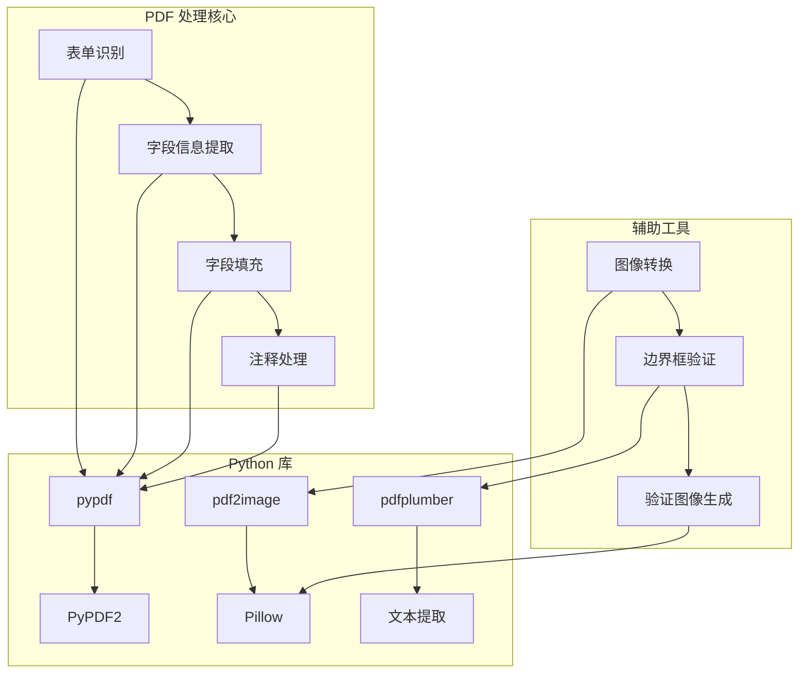

**图表来源**
- [SKILL.md](file://skills/pdf/SKILL.md#L1-L295)
- [forms.md](file://skills/pdf/forms.md#L1-L206)

**章节来源**
- [SKILL.md](file://skills/pdf/SKILL.md#L1-L295)
- [forms.md](file://skills/pdf/forms.md#L1-L206)

## 核心组件

### 表单识别与检测

系统首先通过 `check_fillable_fields.py` 脚本检测 PDF 是否包含可填写表单字段：

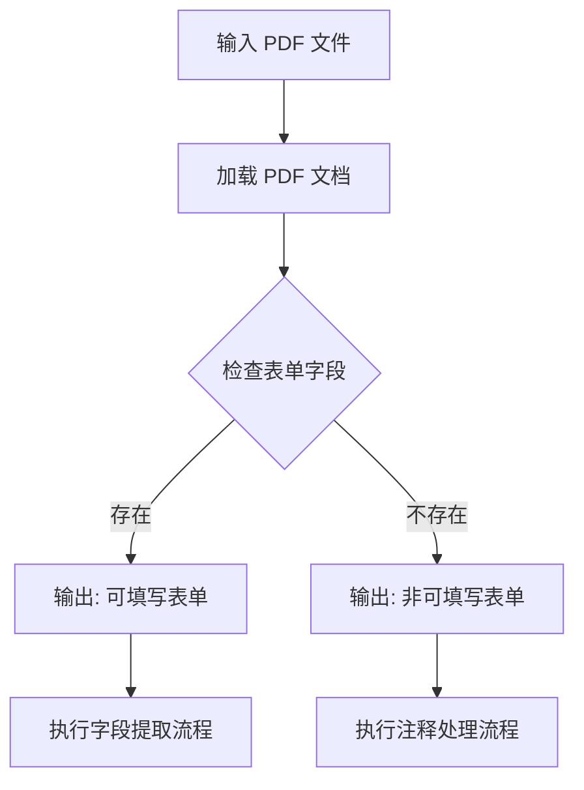

**图表来源**
- [check_fillable_fields.py](file://skills/pdf/scripts/check_fillable_fields.py#L1-L13)

### 字段信息提取

`extract_form_field_info.py` 提供了完整的表单字段信息提取功能：

- **字段类型识别**：支持文本框、复选框、单选按钮组、下拉选择
- **坐标系统处理**：自动处理 PDF 坐标系转换
- **嵌套字段处理**：支持复选框组和单选按钮组的层级结构
- **边界框提取**：获取每个字段的精确位置信息

**章节来源**
- [extract_form_field_info.py](file://skills/pdf/scripts/extract_form_field_info.py#L1-L153)

### 字段填充引擎

`fill_fillable_fields.py` 实现了智能的字段填充功能：

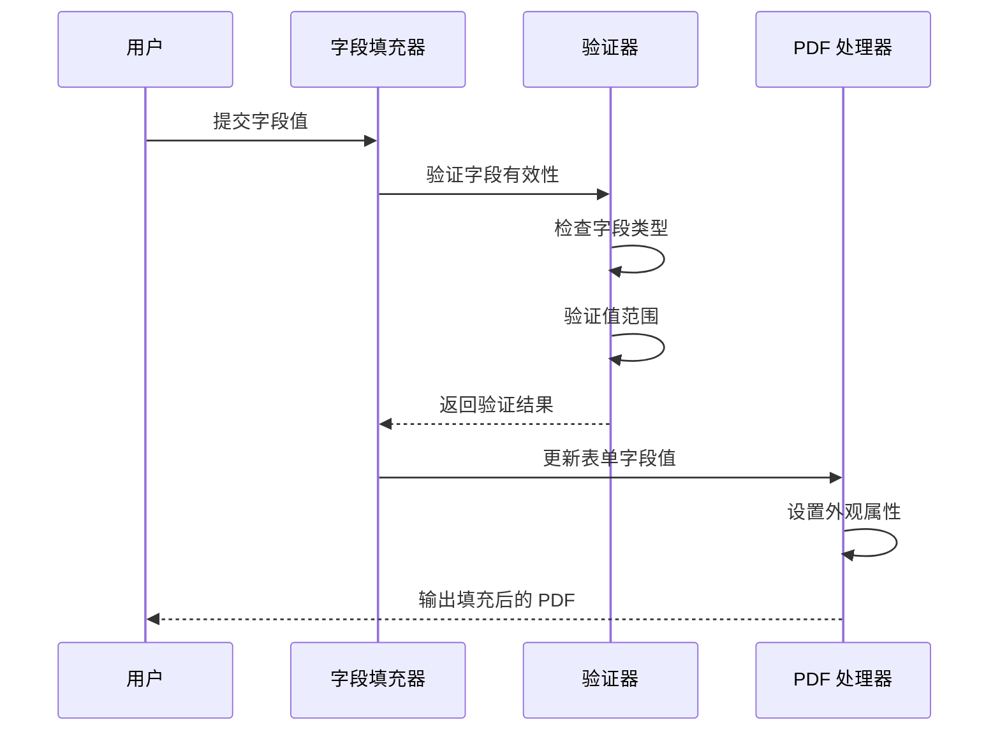

**图表来源**
- [fill_fillable_fields.py](file://skills/pdf/scripts/fill_fillable_fields.py#L12-L57)

**章节来源**
- [fill_fillable_fields.py](file://skills/pdf/scripts/fill_fillable_fields.py#L1-L115)

### 注释处理系统

对于非可填写表单，系统提供基于注释的处理方案：

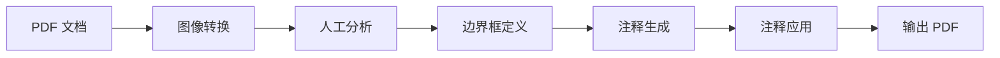

**图表来源**
- [fill_pdf_form_with_annotations.py](file://skills/pdf/scripts/fill_pdf_form_with_annotations.py#L28-L97)

**章节来源**
- [fill_pdf_form_with_annotations.py](file://skills/pdf/scripts/fill_pdf_form_with_annotations.py#L1-L108)

## 架构概览

系统采用分层架构设计，确保功能模块的独立性和可扩展性：

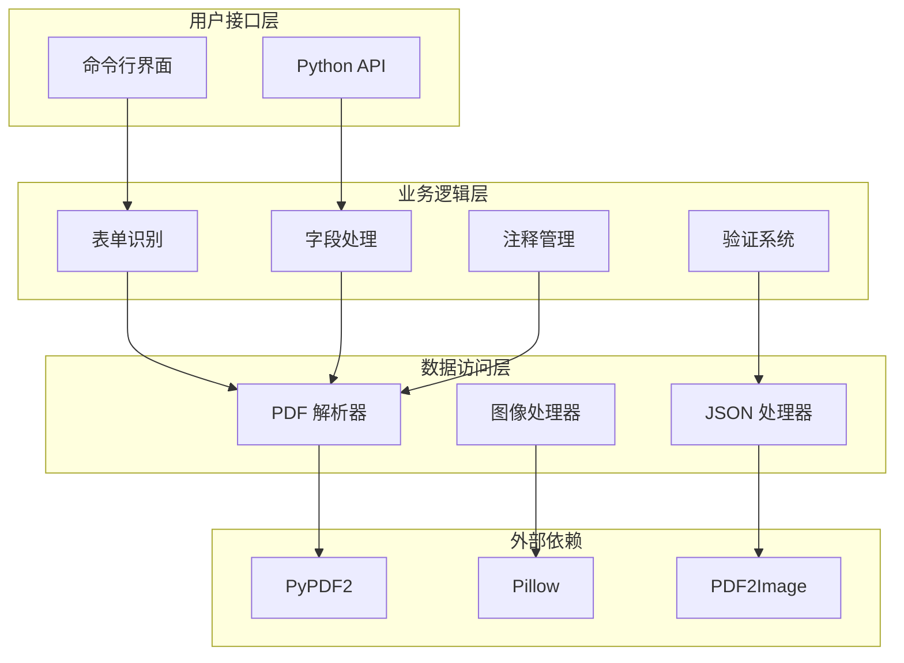

**图表来源**
- [SKILL.md](file://skills/pdf/SKILL.md#L276-L295)
- [forms.md](file://skills/pdf/forms.md#L1-L206)

## 详细组件分析

### 表单字段类型识别

系统能够智能识别以下表单字段类型：

#### 文本字段 (Text Fields)
- **特征**：用于输入自由文本内容
- **处理**：直接设置文本值
- **验证**：长度限制、格式验证

#### 复选框 (Checkboxes)
- **特征**：二元状态选择（选中/未选中）
- **处理**：使用特定状态值表示选中状态
- **验证**：检查状态值的有效性

#### 单选按钮组 (Radio Groups)
- **特征**：互斥的选择组
- **处理**：在组内选择一个选项
- **验证**：确保只选择一个有效选项

#### 下拉选择 (Choice Fields)
- **特征**：预定义选项列表
- **处理**：选择列表中的一个值
- **验证**：检查所选值在允许范围内

**章节来源**
- [extract_form_field_info.py](file://skills/pdf/scripts/extract_form_field_info.py#L22-L50)

### 字段信息提取算法

字段信息提取过程包含多个步骤：

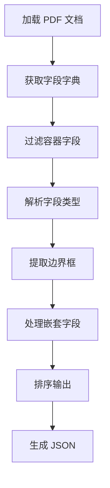

**图表来源**
- [extract_form_field_info.py](file://skills/pdf/scripts/extract_form_field_info.py#L62-L137)

### 坐标系统转换

PDF 使用独特的坐标系统，系统提供精确的转换函数：

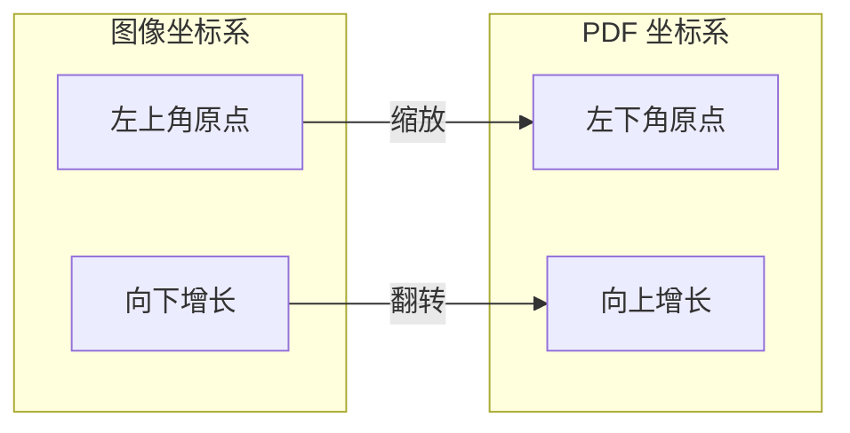

**图表来源**
- [fill_pdf_form_with_annotations.py](file://skills/pdf/scripts/fill_pdf_form_with_annotations.py#L11-L25)

**章节来源**
- [fill_pdf_form_with_annotations.py](file://skills/pdf/scripts/fill_pdf_form_with_annotations.py#L1-L108)

### 边界框验证系统

系统提供全面的边界框验证功能：

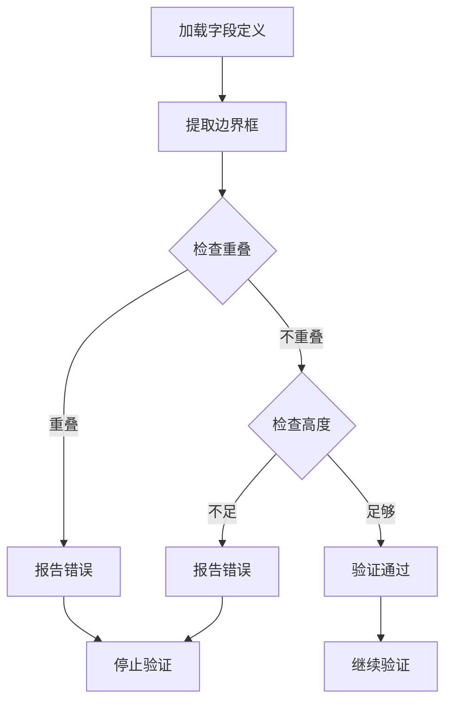

**图表来源**
- [check_bounding_boxes.py](file://skills/pdf/scripts/check_bounding_boxes.py#L18-L60)

**章节来源**
- [check_bounding_boxes.py](file://skills/pdf/scripts/check_bounding_boxes.py#L1-L71)

### 图像处理管道

系统集成了完整的图像处理能力：

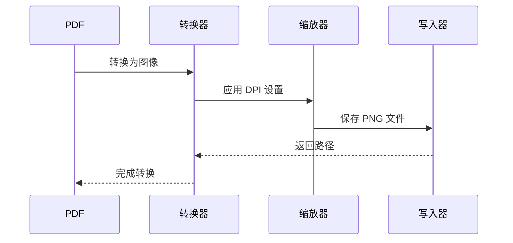

**图表来源**
- [convert_pdf_to_images.py](file://skills/pdf/scripts/convert_pdf_to_images.py#L10-L26)

**章节来源**
- [convert_pdf_to_images.py](file://skills/pdf/scripts/convert_pdf_to_images.py#L1-L36)

## 依赖关系分析

系统依赖关系清晰明确，遵循单一职责原则：

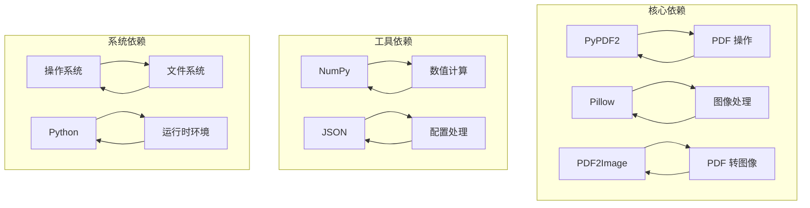

**图表来源**
- [reference.md](file://skills/pdf/reference.md#L603-L612)

**章节来源**
- [reference.md](file://skills/pdf/reference.md#L1-L612)

## 性能考虑

### 内存优化策略

系统采用多种内存优化技术：

1. **流式处理**：避免一次性加载整个 PDF 到内存
2. **分页处理**：按页面处理 PDF，减少内存占用
3. **延迟加载**：仅在需要时加载图像数据

### 处理速度优化

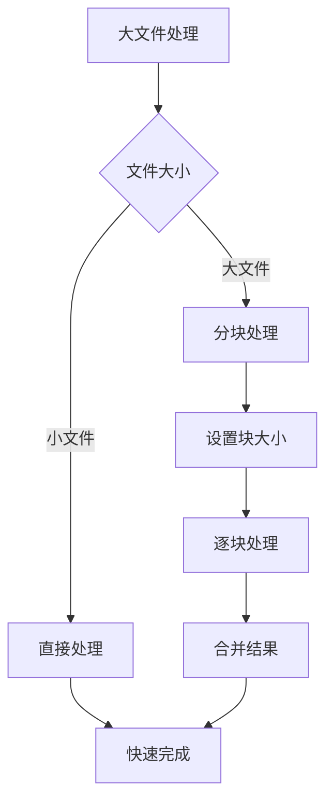

**章节来源**
- [reference.md](file://skills/pdf/reference.md#L528-L565)

### 错误恢复机制

系统实现了多层次的错误处理：

1. **字段验证**：在填充前验证字段有效性
2. **坐标转换**：验证坐标转换的准确性
3. **边界框检查**：确保注释不会相互重叠
4. **异常捕获**：优雅处理各种异常情况

## 故障排除指南

### 常见问题及解决方案

#### 表单字段识别失败

**症状**：`check_fillable_fields.py` 报告 PDF 不包含可填写字段

**解决方案**：
1. 确认 PDF 是可填写表单格式
2. 检查 PDF 是否被加密或损坏
3. 尝试使用不同的 PDF 查看器打开文件

#### 字段值验证错误

**症状**：填充过程中出现字段值无效错误

**解决方案**：
1. 检查 `field_values.json` 中的字段 ID 是否正确
2. 验证字段值是否在允许范围内
3. 对于复选框，确认使用正确的状态值

#### 坐标转换问题

**症状**：注释位置不正确或超出页面边界

**解决方案**：
1. 验证 `fields.json` 中的图像尺寸信息
2. 检查 PDF 页面尺寸与图像尺寸的比例
3. 确保边界框坐标使用正确的坐标系统

#### 性能问题

**症状**：处理大型 PDF 文件时速度缓慢

**解决方案**：
1. 使用分块处理策略
2. 调整 DPI 设置以平衡质量与性能
3. 考虑使用更高效的 PDF 处理库

**章节来源**
- [reference.md](file://skills/pdf/reference.md#L567-L601)

## 结论

本 PDF 表单处理系统提供了完整的解决方案，涵盖了从基础识别到高级处理的所有需求。系统的主要优势包括：

1. **完整性**：支持多种表单字段类型和处理场景
2. **准确性**：精确的坐标转换和边界框验证
3. **可靠性**：完善的错误处理和验证机制
4. **可扩展性**：模块化设计便于功能扩展

该系统特别适合需要批量处理 PDF 表单的企业应用场景，提供了高效、可靠的自动化解决方案。

## 附录

### 最佳实践指南

#### 表单处理最佳实践

1. **预处理阶段**
   - 先运行 `check_fillable_fields.py` 确定处理策略
   - 使用 `extract_form_field_info.py` 获取字段详细信息
   - 验证字段信息的准确性

2. **数据准备**
   - 确保 `field_values.json` 格式正确
   - 验证所有必需字段都已填充值
   - 检查字段值的数据类型和范围

3. **质量控制**
   - 使用 `check_bounding_boxes.py` 验证注释边界框
   - 生成验证图像进行视觉检查
   - 在生产环境前进行小规模测试

#### 性能优化建议

1. **内存管理**
   - 处理大型 PDF 时使用流式 API
   - 合理设置图像分辨率
   - 及时释放不再使用的资源

2. **并发处理**
   - 对独立的 PDF 文件使用并行处理
   - 合理设置并发数量避免系统过载
   - 监控系统资源使用情况

3. **缓存策略**
   - 缓存已处理的中间结果
   - 复用 PDF 文档对象
   - 避免重复的文件操作

#### 错误处理策略

1. **预防性措施**
   - 在关键步骤添加输入验证
   - 使用 try-catch 包装可能出错的操作
   - 提供详细的错误日志

2. **恢复机制**
   - 实现自动重试机制
   - 提供回滚功能
   - 确保部分成功时的数据一致性

3. **监控和告警**
   - 监控处理进度和成功率
   - 设置异常告警机制
   - 定期审查错误模式