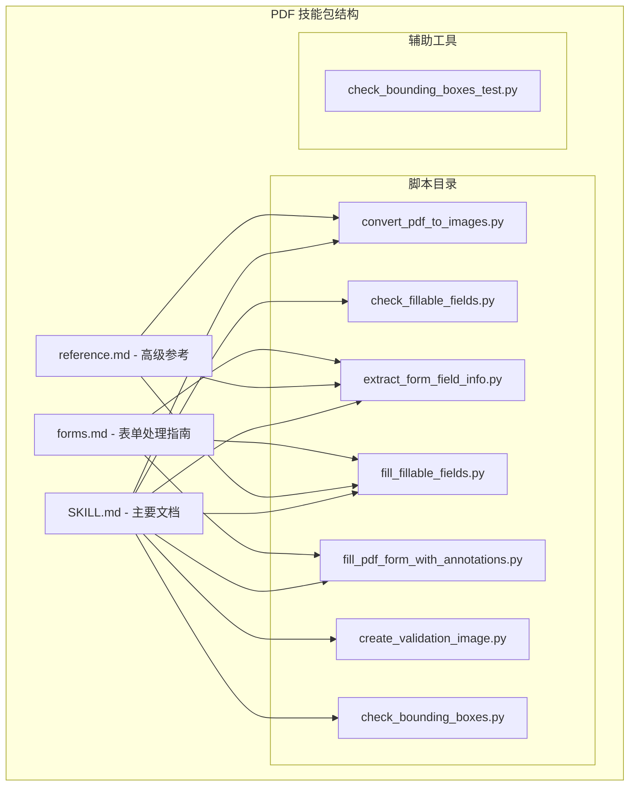
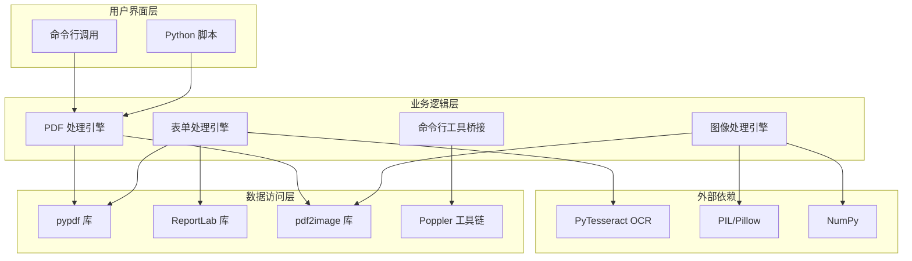
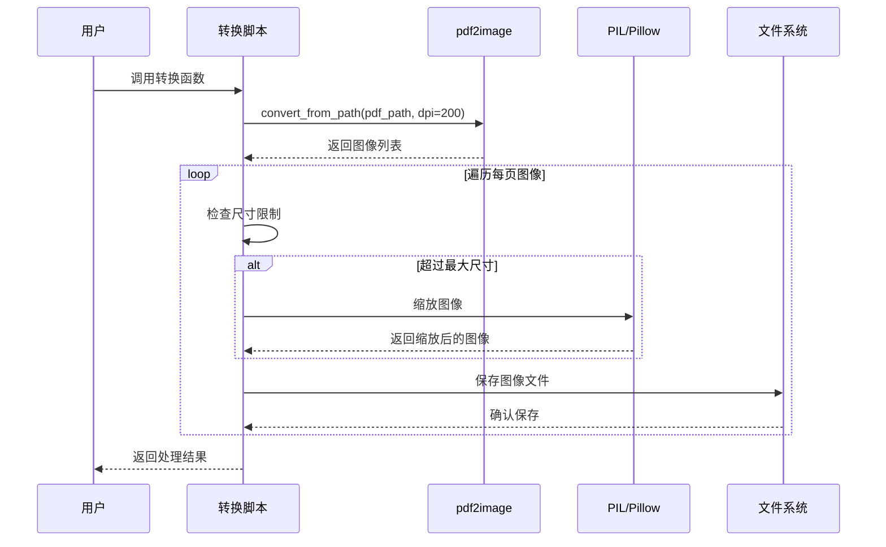
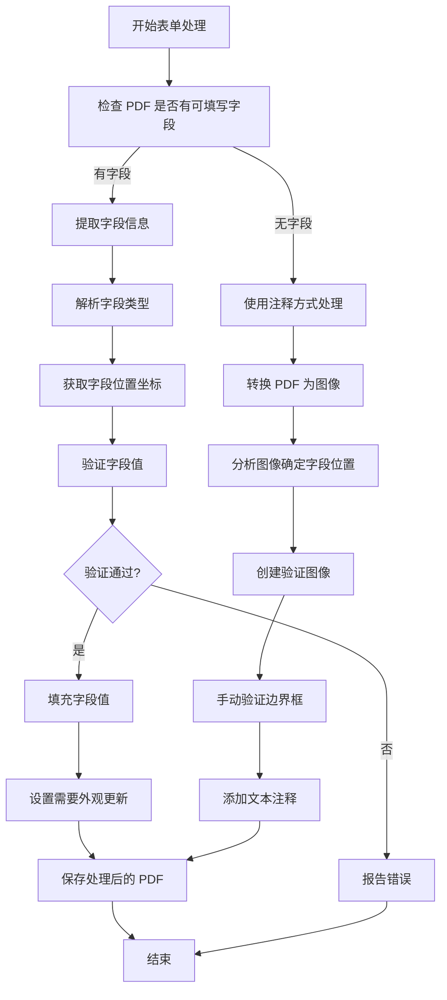
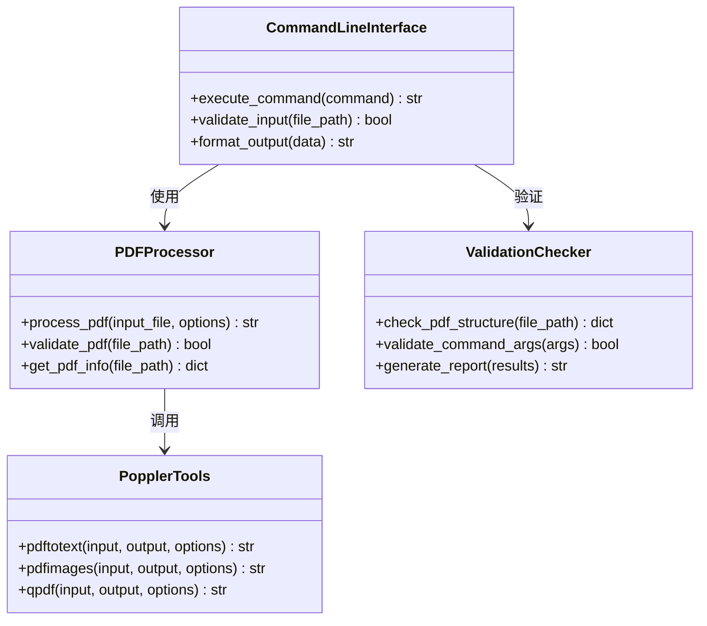
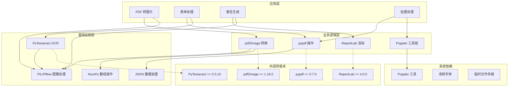
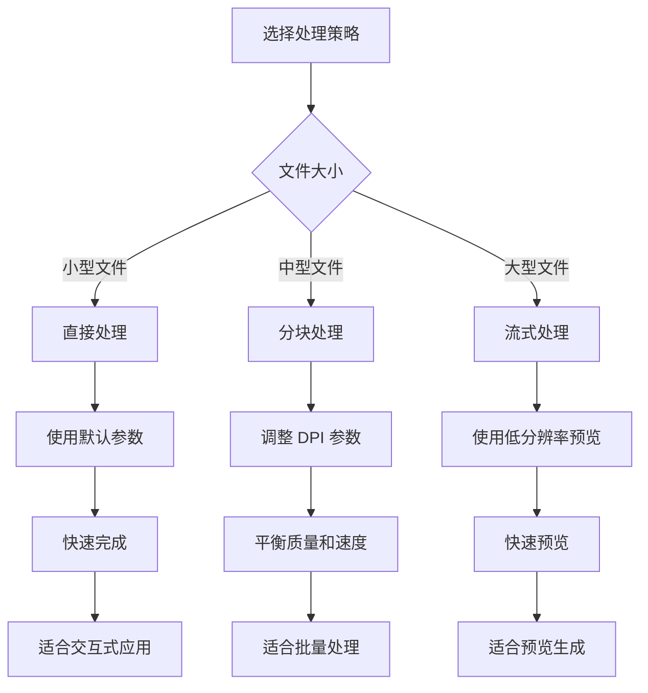
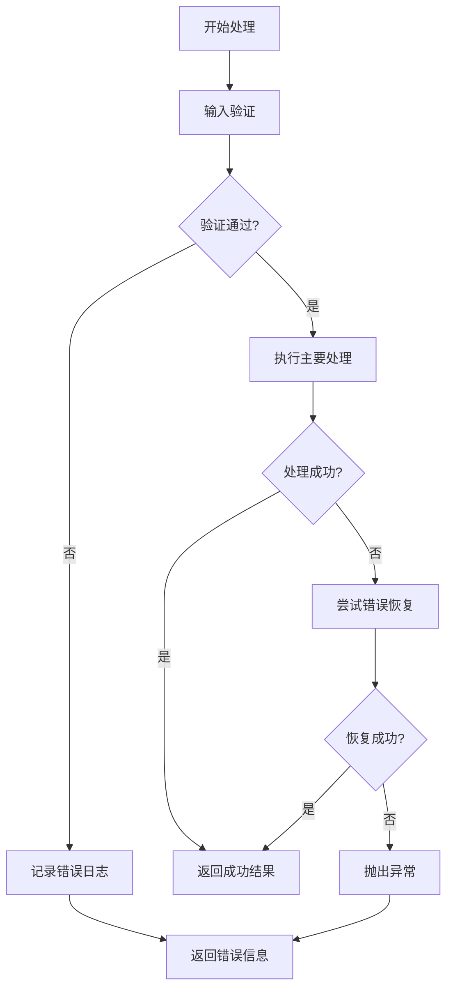

# PDF 转换和生成

<cite>
**本文档引用的文件**
- [skills/pdf/SKILL.md](file://skills/pdf/SKILL.md)
- [skills/pdf/reference.md](file://skills/pdf/reference.md)
- [skills/pdf/forms.md](file://skills/pdf/forms.md)
- [skills/pdf/scripts/convert_pdf_to_images.py](file://skills/pdf/scripts/convert_pdf_to_images.py)
- [skills/pdf/scripts/check_fillable_fields.py](file://skills/pdf/scripts/check_fillable_fields.py)
- [skills/pdf/scripts/extract_form_field_info.py](file://skills/pdf/scripts/extract_form_field_info.py)
- [skills/pdf/scripts/fill_fillable_fields.py](file://skills/pdf/scripts/fill_fillable_fields.py)
- [skills/pdf/scripts/fill_pdf_form_with_annotations.py](file://skills/pdf/scripts/fill_pdf_form_with_annotations.py)
- [skills/pdf/scripts/create_validation_image.py](file://skills/pdf/scripts/create_validation_image.py)
- [skills/pdf/scripts/check_bounding_boxes.py](file://skills/pdf/scripts/check_bounding_boxes.py)
- [skills/pdf/scripts/check_bounding_boxes_test.py](file://skills/pdf/scripts/check_bounding_boxes_test.py)
</cite>

## 目录
1. [简介](#简介)
2. [项目结构](#项目结构)
3. [核心组件](#核心组件)
4. [架构概览](#架构概览)
5. [详细组件分析](#详细组件分析)
6. [依赖关系分析](#依赖关系分析)
7. [性能考虑](#性能考虑)
8. [故障排除指南](#故障排除指南)
9. [结论](#结论)

## 简介

本项目提供了完整的 PDF 转换和生成功能，涵盖了从基础的 PDF 操作到高级的表单处理和批量处理。该技能包包含以下核心功能：

- **PDF 到图片转换**：使用 pdf2image 库进行高质量的 PDF 页面渲染
- **PDF 创建和编辑**：通过 pypdf 和 ReportLab 实现 PDF 的创建、修改和格式化
- **命令行工具集成**：支持 pdftotext、pdfimages、qpdf 等 Poppler 工具链
- **表单处理**：自动检测可填写表单字段并进行数据填充
- **OCR 支持**：对扫描版 PDF 进行光学字符识别
- **批量处理**：提供高效的批量 PDF 处理策略

该项目采用模块化设计，每个功能都封装在独立的脚本中，便于维护和扩展。

## 项目结构

PDF 技能包采用清晰的分层结构，主要包含以下组件：

**图表来源**
- [skills/pdf/SKILL.md](file://skills/pdf/SKILL.md#L1-L295)
- [skills/pdf/reference.md](file://skills/pdf/reference.md#L1-L612)
- [skills/pdf/forms.md](file://skills/pdf/forms.md#L1-L206)

**章节来源**
- [skills/pdf/SKILL.md](file://skills/pdf/SKILL.md#L1-L295)
- [skills/pdf/reference.md](file://skills/pdf/reference.md#L1-L612)
- [skills/pdf/forms.md](file://skills/pdf/forms.md#L1-L206)

## 核心组件

### PDF 转图片组件

PDF 转图片是本技能包的核心功能之一，主要用于处理扫描版 PDF 和生成预览图像。

**主要特性：**
- 支持多种输出格式（PNG、JPEG）
- 可配置分辨率和尺寸限制
- 批量处理多页 PDF
- 自动缩放以保持最大尺寸限制

**章节来源**
- [skills/pdf/SKILL.md](file://skills/pdf/SKILL.md#L213-L230)
- [skills/pdf/scripts/convert_pdf_to_images.py](file://skills/pdf/scripts/convert_pdf_to_images.py#L1-L36)

### 表单处理组件

表单处理是 PDF 技能包的高级功能，支持自动检测和填充 PDF 表单字段。

**主要功能：**
- 自动检测可填写表单字段
- 提取字段信息和位置坐标
- 填充文本字段、复选框、单选按钮和下拉菜单
- 支持基于注释的表单填充

**章节来源**
- [skills/pdf/forms.md](file://skills/pdf/forms.md#L1-L206)
- [skills/pdf/scripts/check_fillable_fields.py](file://skills/pdf/scripts/check_fillable_fields.py#L1-L13)
- [skills/pdf/scripts/extract_form_field_info.py](file://skills/pdf/scripts/extract_form_field_info.py#L1-L153)
- [skills/pdf/scripts/fill_fillable_fields.py](file://skills/pdf/scripts/fill_fillable_fields.py#L1-L115)

### 命令行工具集成

本技能包集成了多个强大的命令行工具，用于执行特定的 PDF 处理任务。

**支持的工具：**
- **pdftotext**: 文本提取和布局保持
- **pdfimages**: 图像提取和元数据获取
- **qpdf**: PDF 合并、分割和优化
- **pdftk**: PDF 操作和管理

**章节来源**
- [skills/pdf/SKILL.md](file://skills/pdf/SKILL.md#L169-L210)
- [skills/pdf/reference.md](file://skills/pdf/reference.md#L265-L342)

### 报告生成组件

使用 ReportLab 创建专业的 PDF 报告和文档。

**功能特性：**
- 支持多种页面大小和方向
- 内置样式和主题系统
- 表格和复杂布局支持
- 水印和页眉页脚添加

**章节来源**
- [skills/pdf/SKILL.md](file://skills/pdf/SKILL.md#L121-L167)
- [skills/pdf/reference.md](file://skills/pdf/reference.md#L385-L424)

## 架构概览

PDF 技能包采用模块化架构设计，各个组件之间通过清晰的接口进行交互：

**图表来源**
- [skills/pdf/SKILL.md](file://skills/pdf/SKILL.md#L28-L295)
- [skills/pdf/reference.md](file://skills/pdf/reference.md#L1-L612)

## 详细组件分析

### PDF 转图片处理流程

PDF 转图片功能通过 pdf2image 库实现高质量的页面渲染：

**图表来源**
- [skills/pdf/scripts/convert_pdf_to_images.py](file://skills/pdf/scripts/convert_pdf_to_images.py#L10-L26)

**章节来源**
- [skills/pdf/scripts/convert_pdf_to_images.py](file://skills/pdf/scripts/convert_pdf_to_images.py#L1-L36)

### 表单字段检测和填充流程

表单处理功能包含复杂的字段检测和验证机制：

**图表来源**
- [skills/pdf/scripts/check_fillable_fields.py](file://skills/pdf/scripts/check_fillable_fields.py#L8-L12)
- [skills/pdf/scripts/extract_form_field_info.py](file://skills/pdf/scripts/extract_form_field_info.py#L62-L137)
- [skills/pdf/scripts/fill_fillable_fields.py](file://skills/pdf/scripts/fill_fillable_fields.py#L12-L56)

**章节来源**
- [skills/pdf/scripts/check_fillable_fields.py](file://skills/pdf/scripts/check_fillable_fields.py#L1-L13)
- [skills/pdf/scripts/extract_form_field_info.py](file://skills/pdf/scripts/extract_form_field_info.py#L1-L153)
- [skills/pdf/scripts/fill_fillable_fields.py](file://skills/pdf/scripts/fill_fillable_fields.py#L1-L115)

### 命令行工具集成架构

命令行工具通过 Python 脚本进行封装，提供统一的接口：

**图表来源**
- [skills/pdf/SKILL.md](file://skills/pdf/SKILL.md#L169-L210)
- [skills/pdf/reference.md](file://skills/pdf/reference.md#L265-L342)

**章节来源**
- [skills/pdf/SKILL.md](file://skills/pdf/SKILL.md#L169-L210)
- [skills/pdf/reference.md](file://skills/pdf/reference.md#L265-L342)

## 依赖关系分析

PDF 技能包的依赖关系呈现清晰的层次结构：

**图表来源**
- [skills/pdf/SKILL.md](file://skills/pdf/SKILL.md#L28-L295)
- [skills/pdf/reference.md](file://skills/pdf/reference.md#L605-L612)

**章节来源**
- [skills/pdf/SKILL.md](file://skills/pdf/SKILL.md#L28-L295)
- [skills/pdf/reference.md](file://skills/pdf/reference.md#L605-L612)

## 性能考虑

### 内存优化策略

对于大型 PDF 文件，内存使用是一个关键考虑因素：

1. **流式处理**：使用 pypdf 的流式读取器避免一次性加载整个文件
2. **分块处理**：将大文件分成小块进行处理，减少内存峰值
3. **及时释放**：处理完每页后及时释放内存资源

### 处理速度优化

### 质量控制机制

系统实现了多层次的质量控制：

1. **边界框验证**：确保表单字段的边界框不重叠且高度足够
2. **坐标转换验证**：验证图像坐标到 PDF 坐标的转换准确性
3. **字段值验证**：检查表单字段值的有效性
4. **输出质量检查**：验证生成文件的完整性和正确性

**章节来源**
- [skills/pdf/reference.md](file://skills/pdf/reference.md#L528-L566)
- [skills/pdf/scripts/check_bounding_boxes.py](file://skills/pdf/scripts/check_bounding_boxes.py#L18-L60)

## 故障排除指南

### 常见问题及解决方案

#### PDF 解密失败
当处理加密的 PDF 文件时，可能遇到解密问题：

**解决步骤：**
1. 验证密码是否正确
2. 检查 PDF 的权限设置
3. 尝试使用不同的解密方法

#### OCR 识别不准确
扫描版 PDF 的 OCR 识别可能不够准确：

**改进方法：**
1. 提高输入图像的分辨率
2. 使用更合适的 OCR 引擎参数
3. 对图像进行预处理（去噪、二值化）

#### 表单字段填充错误
表单字段填充可能出现位置或内容错误：

**调试步骤：**
1. 检查字段坐标转换是否正确
2. 验证字段类型和值的有效性
3. 确认 PDF 的表单结构完整性

### 错误处理机制

系统实现了完善的错误处理和恢复机制：

**章节来源**
- [skills/pdf/reference.md](file://skills/pdf/reference.md#L567-L601)
- [skills/pdf/scripts/fill_fillable_fields.py](file://skills/pdf/scripts/fill_fillable_fields.py#L27-L46)

## 结论

PDF 转换和生成技能包提供了完整的 PDF 处理解决方案，具有以下优势：

1. **功能完整性**：涵盖了从基础转换到高级表单处理的所有核心功能
2. **模块化设计**：清晰的组件分离便于维护和扩展
3. **性能优化**：针对大文件和批量处理进行了专门优化
4. **质量保证**：实现了多层次的质量控制和错误处理机制
5. **易用性**：提供了简洁的命令行接口和详细的使用文档

该技能包适用于各种 PDF 处理场景，包括文档自动化、数据提取、表单处理和报告生成等应用。通过合理使用这些工具和技术，可以高效地处理各种 PDF 相关任务。