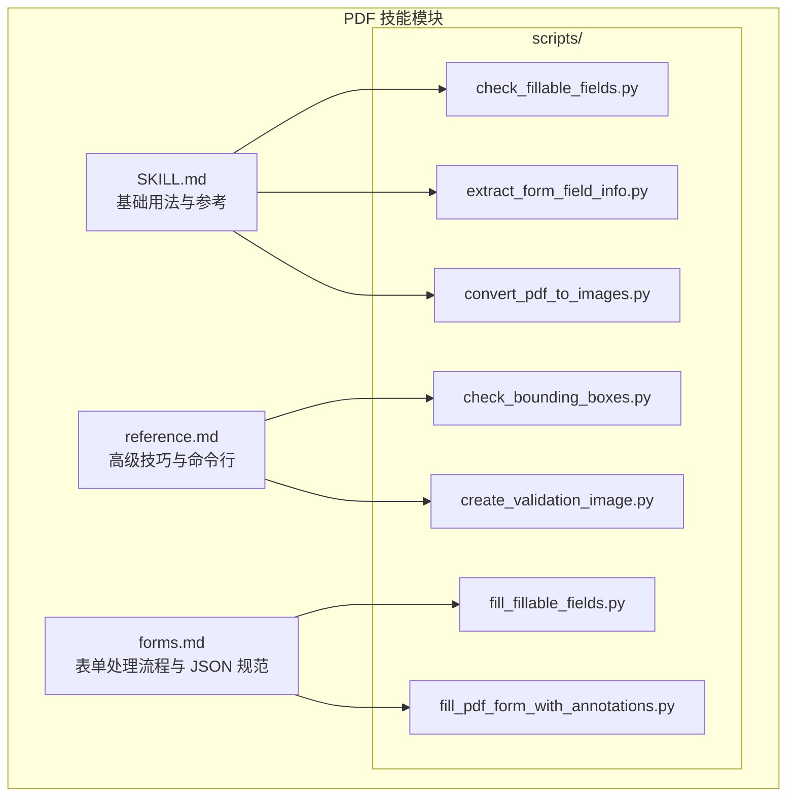
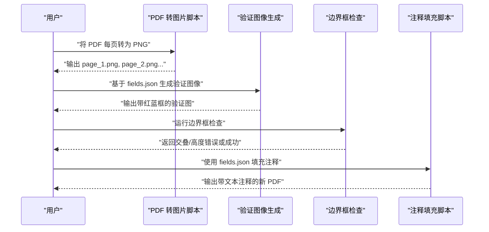
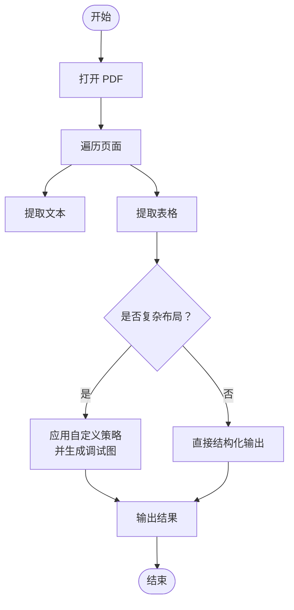
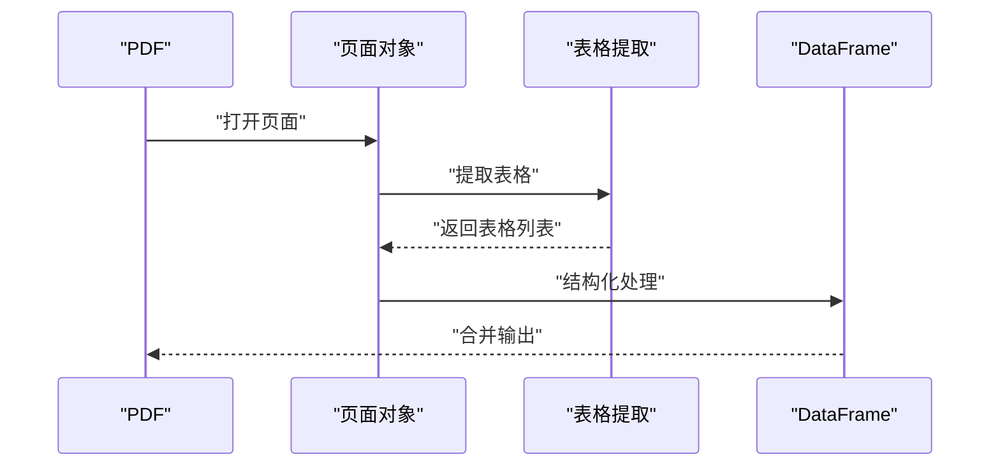
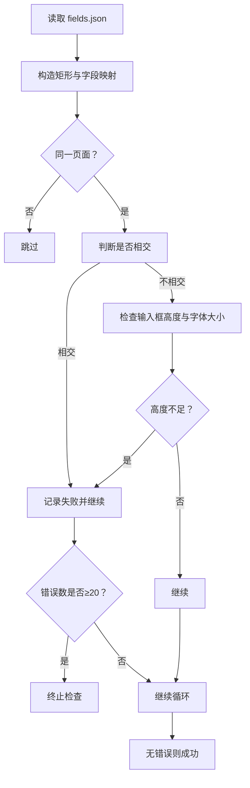
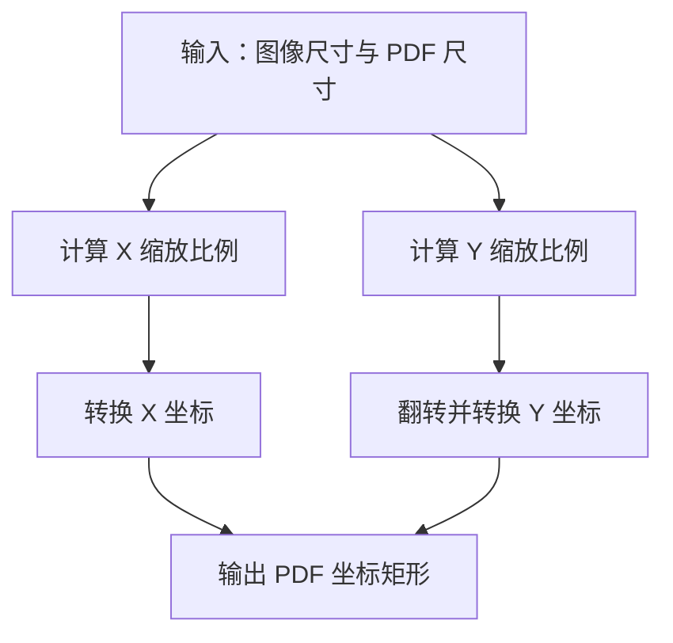
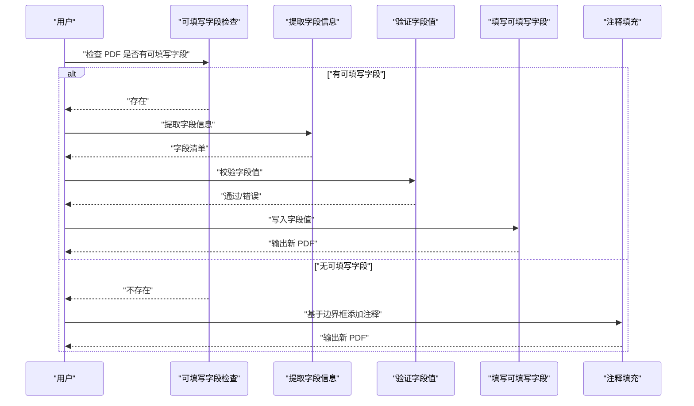
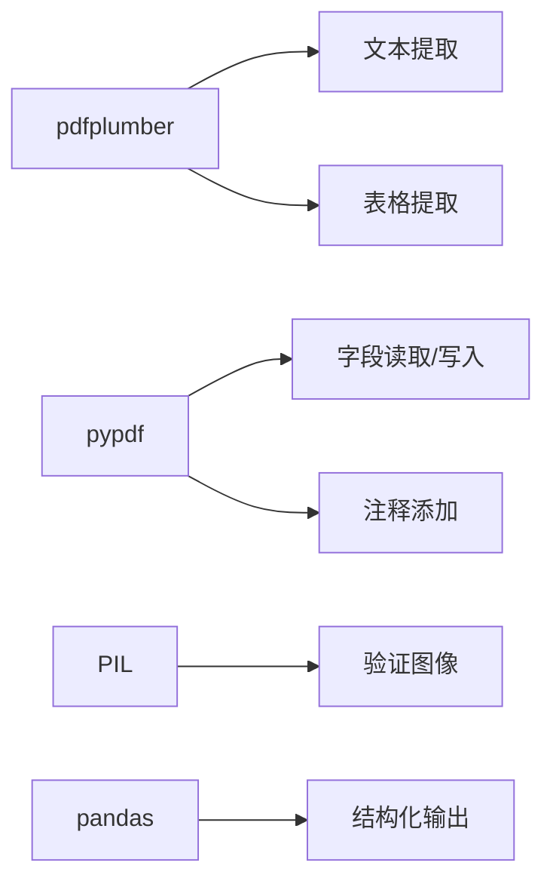

# 文本和表格提取

<cite>
**本文引用的文件**
- [技能说明：pdf](file://skills/pdf/SKILL.md)
- [参考：pdf 高级用法](file://skills/pdf/reference.md)
- [表单指南：forms.md](file://skills/pdf/forms.md)
- [脚本：边界框检查](file://skills/pdf/scripts/check_bounding_boxes.py)
- [脚本：边界框检查测试](file://skills/pdf/scripts/check_bounding_boxes_test.py)
- [脚本：创建验证图像](file://skills/pdf/scripts/create_validation_image.py)
- [脚本：PDF 转图片](file://skills/pdf/scripts/convert_pdf_to_images.py)
- [脚本：提取表单字段信息](file://skills/pdf/scripts/extract_form_field_info.py)
- [脚本：检查可填写字段](file://skills/pdf/scripts/check_fillable_fields.py)
- [脚本：填写可填写字段](file://skills/pdf/scripts/fill_fillable_fields.py)
- [脚本：用注释填充 PDF 表单](file://skills/pdf/scripts/fill_pdf_form_with_annotations.py)
</cite>

## 目录
1. [简介](#简介)
2. [项目结构](#项目结构)
3. [核心组件](#核心组件)
4. [架构总览](#架构总览)
5. [详细组件分析](#详细组件分析)
6. [依赖关系分析](#依赖关系分析)
7. [性能考虑](#性能考虑)
8. [故障排查指南](#故障排查指南)
9. [结论](#结论)
10. [附录](#附录)

## 简介
本文件围绕 PDF 文本与表格提取能力，系统梳理了基于 pdfplumber 的文本布局提取、表格识别与边界框验证流程，并补充了坐标系统转换、验证图像生成、以及针对“非可填写表单”的可视化标注填充工作流。内容覆盖：
- 使用 pdfplumber 进行文本布局提取与表格识别
- 边界框交叠检测与高度校验
- 图像到 PDF 坐标系的转换
- 验证图像生成与人工复核
- 复杂 PDF 布局下的优化策略与常见问题解决

## 项目结构
该仓库中的 PDF 能力主要集中在 skills/pdf 目录下，包含：
- 技能说明与快速参考（SKILL.md）
- 高级用法与命令行技巧（reference.md）
- 表单处理流程与 JSON 规范（forms.md）
- 一组配套脚本，覆盖表单字段提取、可填写性检查、PDF 转图片、边界框验证、验证图像生成、注释填充等

图表来源
- [技能说明：pdf](file://skills/pdf/SKILL.md#L1-L295)
- [参考：pdf 高级用法](file://skills/pdf/reference.md#L1-L612)
- [表单指南：forms.md](file://skills/pdf/forms.md#L1-L206)
- [脚本：检查可填写字段](file://skills/pdf/scripts/check_fillable_fields.py#L1-L13)
- [脚本：提取表单字段信息](file://skills/pdf/scripts/extract_form_field_info.py#L1-L153)
- [脚本：PDF 转图片](file://skills/pdf/scripts/convert_pdf_to_images.py#L1-L36)
- [脚本：边界框检查](file://skills/pdf/scripts/check_bounding_boxes.py#L1-L71)
- [脚本：创建验证图像](file://skills/pdf/scripts/create_validation_image.py#L1-L42)
- [脚本：填写可填写字段](file://skills/pdf/scripts/fill_fillable_fields.py#L1-L115)
- [脚本：用注释填充 PDF 表单](file://skills/pdf/scripts/fill_pdf_form_with_annotations.py#L1-L108)

章节来源
- [技能说明：pdf](file://skills/pdf/SKILL.md#L1-L295)
- [参考：pdf 高级用法](file://skills/pdf/reference.md#L1-L612)
- [表单指南：forms.md](file://skills/pdf/forms.md#L1-L206)

## 核心组件
- 文本布局提取（pdfplumber）
  - 支持逐页提取文本与表格；可结合 pandas 将表格转为 DataFrame 并导出。
- 表格识别与结构化输出
  - 提供基础与高级表格提取接口，支持自定义策略（如按线、容差等）。
- 边界框验证（fields.json）
  - 自动检查标签与输入框是否交叉、输入框高度是否小于字体大小；限制错误消息数量防止过长输出。
- 坐标系统转换与验证图像
  - 将图像坐标转换为 PDF 坐标（注意原点与 Y 轴方向差异），生成验证图像辅助人工复核。
- 可填写表单与注释填充
  - 可填写表单：通过字段信息直接写入值；非可填写表单：基于边界框添加自由文本注释。

章节来源
- [技能说明：pdf](file://skills/pdf/SKILL.md#L79-L119)
- [参考：pdf 高级用法](file://skills/pdf/reference.md#L345-L383)
- [脚本：边界框检查](file://skills/pdf/scripts/check_bounding_boxes.py#L18-L60)
- [脚本：创建验证图像](file://skills/pdf/scripts/create_validation_image.py#L11-L30)
- [脚本：用注释填充 PDF 表单](file://skills/pdf/scripts/fill_pdf_form_with_annotations.py#L11-L25)

## 架构总览
以下序列图展示了“非可填写表单”的文本与表格提取与标注填充的整体流程：

图表来源
- [脚本：PDF 转图片](file://skills/pdf/scripts/convert_pdf_to_images.py#L10-L26)
- [脚本：创建验证图像](file://skills/pdf/scripts/create_validation_image.py#L11-L30)
- [脚本：边界框检查](file://skills/pdf/scripts/check_bounding_boxes.py#L18-L60)
- [脚本：用注释填充 PDF 表单](file://skills/pdf/scripts/fill_pdf_form_with_annotations.py#L28-L97)

## 详细组件分析

### 组件一：文本布局提取（pdfplumber）
- 功能要点
  - 逐页提取文本，保留布局信息
  - 提取表格并支持结构化输出（列表或 DataFrame）
  - 高级场景可自定义表格提取策略（垂直/水平策略、容差等）
- 典型调用路径
  - 打开 PDF → 遍历页面 → 页面对象提取文本/表格
- 优化建议
  - 对超大文档采用分页处理，避免一次性加载
  - 复杂表格优先使用自定义策略并配合可视化调试图

图表来源
- [技能说明：pdf](file://skills/pdf/SKILL.md#L81-L119)
- [参考：pdf 高级用法](file://skills/pdf/reference.md#L347-L383)

章节来源
- [技能说明：pdf](file://skills/pdf/SKILL.md#L79-L119)
- [参考：pdf 高级用法](file://skills/pdf/reference.md#L345-L383)

### 组件二：表格识别与结构化
- 功能要点
  - 基础表格提取：逐页提取表格并遍历输出
  - 高级表格提取：自定义策略（垂直/水平策略、容差）；可生成调试图像
  - 结合 pandas 将表格转为 DataFrame 并合并导出
- 典型调用路径
  - 打开 PDF → 遍历页面 → 提取表格 → 结构化处理 → 合并输出

图表来源
- [技能说明：pdf](file://skills/pdf/SKILL.md#L91-L119)
- [参考：pdf 高级用法](file://skills/pdf/reference.md#L363-L383)

章节来源
- [技能说明：pdf](file://skills/pdf/SKILL.md#L91-L119)
- [参考：pdf 高级用法](file://skills/pdf/reference.md#L363-L383)

### 组件三：边界框验证（fields.json）
- 功能要点
  - 检查同一字段的标签与输入框是否交叉
  - 检查不同字段的边界框是否在同一页面交叉
  - 检查输入框高度是否小于字体大小（默认 14）
  - 限制错误消息数量，避免输出过长
- 算法流程
  - 读取 fields.json → 构造矩形与字段映射 → 双重循环比较 → 记录错误并限制输出

图表来源
- [脚本：边界框检查](file://skills/pdf/scripts/check_bounding_boxes.py#L18-L60)

章节来源
- [脚本：边界框检查](file://skills/pdf/scripts/check_bounding_boxes.py#L18-L60)
- [脚本：边界框检查测试](file://skills/pdf/scripts/check_bounding_boxes_test.py#L14-L222)

### 组件四：坐标系统转换与验证图像
- 功能要点
  - 将图像坐标（左上原点，Y 向下）转换为 PDF 坐标（左下原点，Y 向上）
  - 生成验证图像：在对应页面绘制红色输入框与蓝色标签框
- 关键公式
  - X 缩放：x_scale = pdf_width / image_width
  - Y 缩放：y_scale = pdf_height / image_height
  - Y 翻转：top = pdf_height - (bbox[1] * y_scale)，bottom = pdf_height - (bbox[3] * y_scale)

图表来源
- [脚本：用注释填充 PDF 表单](file://skills/pdf/scripts/fill_pdf_form_with_annotations.py#L11-L25)
- [脚本：创建验证图像](file://skills/pdf/scripts/create_validation_image.py#L11-L30)

章节来源
- [脚本：用注释填充 PDF 表单](file://skills/pdf/scripts/fill_pdf_form_with_annotations.py#L11-L25)
- [脚本：创建验证图像](file://skills/pdf/scripts/create_validation_image.py#L11-L30)

### 组件五：可填写表单与注释填充
- 可填写表单流程
  - 检查是否存在可填写字段 → 提取字段信息 → 校验字段值 → 写入 PDF → 输出新 PDF
- 非可填写表单流程
  - 将 PDF 转图片 → 人工确定字段与边界框 → 生成验证图像 → 边界框检查 → 注释填充

图表来源
- [脚本：检查可填写字段](file://skills/pdf/scripts/check_fillable_fields.py#L8-L12)
- [脚本：提取表单字段信息](file://skills/pdf/scripts/extract_form_field_info.py#L62-L137)
- [脚本：填写可填写字段](file://skills/pdf/scripts/fill_fillable_fields.py#L12-L56)
- [脚本：用注释填充 PDF 表单](file://skills/pdf/scripts/fill_pdf_form_with_annotations.py#L28-L97)

章节来源
- [脚本：检查可填写字段](file://skills/pdf/scripts/check_fillable_fields.py#L8-L12)
- [脚本：提取表单字段信息](file://skills/pdf/scripts/extract_form_field_info.py#L62-L137)
- [脚本：填写可填写字段](file://skills/pdf/scripts/fill_fillable_fields.py#L12-L56)
- [脚本：用注释填充 PDF 表单](file://skills/pdf/scripts/fill_pdf_form_with_annotations.py#L28-L97)

## 依赖关系分析
- pdfplumber：用于文本与表格提取
- pypdf：用于可填写表单字段读取、写入与注释添加
- PIL：用于生成验证图像
- pandas（可选）：用于表格结构化输出
- poppler-utils/qpdf：用于命令行辅助（文本提取、图像提取、合并/拆分等）

图表来源
- [技能说明：pdf](file://skills/pdf/SKILL.md#L79-L119)
- [参考：pdf 高级用法](file://skills/pdf/reference.md#L345-L383)
- [脚本：创建验证图像](file://skills/pdf/scripts/create_validation_image.py#L4-L29)

章节来源
- [技能说明：pdf](file://skills/pdf/SKILL.md#L79-L119)
- [参考：pdf 高级用法](file://skills/pdf/reference.md#L345-L383)

## 性能考虑
- 大文档分页处理：避免一次性加载整份 PDF，按页处理以降低内存占用
- 高分辨率预览与最终输出分离：预览用较低分辨率，最终导出用更高分辨率
- 表格提取策略：复杂布局时启用自定义策略并生成调试图，减少反复迭代
- 错误消息限制：边界框检查限制输出条目数量，避免日志膨胀

章节来源
- [参考：pdf 高级用法](file://skills/pdf/reference.md#L528-L565)
- [脚本：边界框检查](file://skills/pdf/scripts/check_bounding_boxes.py#L44-L46)

## 故障排查指南
- 可填写字段问题
  - 使用字段检查脚本确认是否存在可填写字段
  - 若存在，使用字段信息提取脚本生成字段清单；若不存在，走“非可填写表单”流程
- 注释填充失败
  - 确认 fields.json 中的 page_number 与实际页面一致
  - 确认 entry_text 字段完整（text、font_size、font_color 等）
- 边界框错误
  - 使用边界框检查脚本定位交叠或高度不足问题
  - 重新标注后生成验证图像进行人工复核
- 坐标不匹配
  - 确保使用正确的图像尺寸与 PDF 尺寸进行坐标转换
  - 注意 PDF 坐标系原点在左下角，Y 向上

章节来源
- [脚本：检查可填写字段](file://skills/pdf/scripts/check_fillable_fields.py#L8-L12)
- [脚本：提取表单字段信息](file://skills/pdf/scripts/extract_form_field_info.py#L118-L137)
- [脚本：边界框检查](file://skills/pdf/scripts/check_bounding_boxes.py#L18-L60)
- [脚本：用注释填充 PDF 表单](file://skills/pdf/scripts/fill_pdf_form_with_annotations.py#L28-L97)

## 结论
本方案以 pdfplumber 为核心实现文本与表格提取，结合边界框验证与坐标转换，形成从“布局理解—结构化输出—人工复核—注释填充”的完整链路。对于可填写表单，可直接写入字段值；对于非可填写表单，则通过可视化标注与验证图像确保高精度与一致性。通过合理的策略配置与性能优化，可在复杂 PDF 布局下稳定获得高质量的文本与表格结果。

## 附录
- 快速参考（任务与工具）
  - 合并/拆分/旋转/加密等基础操作：参见技能说明
  - 文本与表格提取：参见技能说明与高级用法
  - 命令行工具：参见高级用法中的 poppler-utils 与 qpdf 示例

章节来源
- [技能说明：pdf](file://skills/pdf/SKILL.md#L169-L287)
- [参考：pdf 高级用法](file://skills/pdf/reference.md#L265-L341)