# 高级 PDF 操作

<cite>
**本文档引用的文件**
- [SKILL.md](file://skills/pdf/SKILL.md)
- [reference.md](file://skills/pdf/reference.md)
- [forms.md](file://skills/pdf/forms.md)
- [check_fillable_fields.py](file://skills/pdf/scripts/check_fillable_fields.py)
- [extract_form_field_info.py](file://skills/pdf/scripts/extract_form_field_info.py)
- [fill_fillable_fields.py](file://skills/pdf/scripts/fill_fillable_fields.py)
- [fill_pdf_form_with_annotations.py](file://skills/pdf/scripts/fill_pdf_form_with_annotations.py)
- [check_bounding_boxes.py](file://skills/pdf/scripts/check_bounding_boxes.py)
- [convert_pdf_to_images.py](file://skills/pdf/scripts/convert_pdf_to_images.py)
- [create_validation_image.py](file://skills/pdf/scripts/create_validation_image.py)
- [check_bounding_boxes_test.py](file://skills/pdf/scripts/check_bounding_boxes_test.py)
</cite>

## 目录
1. [简介](#简介)
2. [项目结构](#项目结构)
3. [核心组件](#核心组件)
4. [架构概览](#架构概览)
5. [详细组件分析](#详细组件分析)
6. [依赖关系分析](#依赖关系分析)
7. [性能考虑](#性能考虑)
8. [故障排除指南](#故障排除指南)
9. [结论](#结论)

## 简介

本项目提供了一个全面的 PDF 高级操作工具包，专注于使用 Python 和命令行工具进行复杂的 PDF 处理任务。该工具包涵盖了从基础的 PDF 合并、分割到高级的表单填写、水印添加、元数据提取等全方位的 PDF 操作功能。

主要特点包括：
- 使用 PyPDF2 进行复杂的 PDF 操作
- 支持多种 PDF 处理库（pdfplumber、reportlab、pypdfium2）
- 提供完整的表单处理工作流程
- 包含批处理脚本示例
- 实现了 PDF 安全机制和权限控制
- 提供性能优化和内存管理策略

## 项目结构

该项目采用模块化设计，将不同的 PDF 处理功能组织在独立的脚本中：

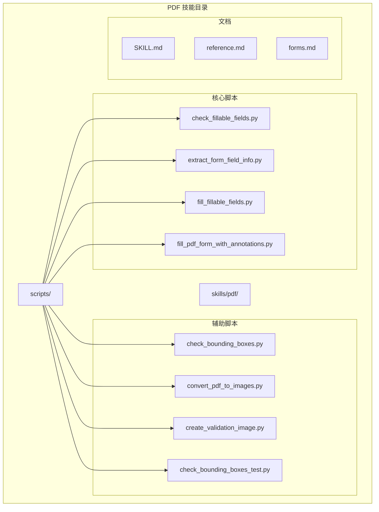

**图表来源**
- [SKILL.md](file://skills/pdf/SKILL.md#L1-L295)
- [reference.md](file://skills/pdf/reference.md#L1-L612)

**章节来源**
- [SKILL.md](file://skills/pdf/SKILL.md#L1-L295)
- [reference.md](file://skills/pdf/reference.md#L1-L612)

## 核心组件

### PyPDF2 基础操作

PyPDF2 是本项目的核心库，提供了以下基础功能：

- **PDF 读取和写入**：使用 `PdfReader` 和 `PdfWriter` 类进行 PDF 文档的读取和写入操作
- **页面操作**：支持页面的合并、分割、旋转、裁剪等操作
- **元数据管理**：提供对 PDF 元数据的读取和修改功能
- **安全控制**：实现 PDF 密码保护和权限控制

### 表单处理系统

项目实现了完整的 PDF 表单处理工作流程：

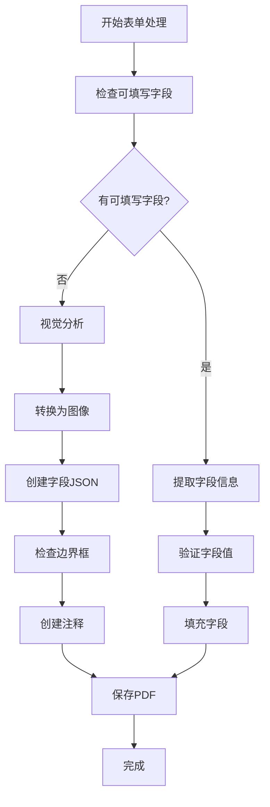

**图表来源**
- [check_fillable_fields.py](file://skills/pdf/scripts/check_fillable_fields.py#L1-L13)
- [extract_form_field_info.py](file://skills/pdf/scripts/extract_form_field_info.py#L1-L153)
- [fill_fillable_fields.py](file://skills/pdf/scripts/fill_fillable_fields.py#L1-L115)
- [fill_pdf_form_with_annotations.py](file://skills/pdf/scripts/fill_pdf_form_with_annotations.py#L1-L108)

**章节来源**
- [SKILL.md](file://skills/pdf/SKILL.md#L30-L167)
- [forms.md](file://skills/pdf/forms.md#L1-L206)

## 架构概览

### 组件交互图

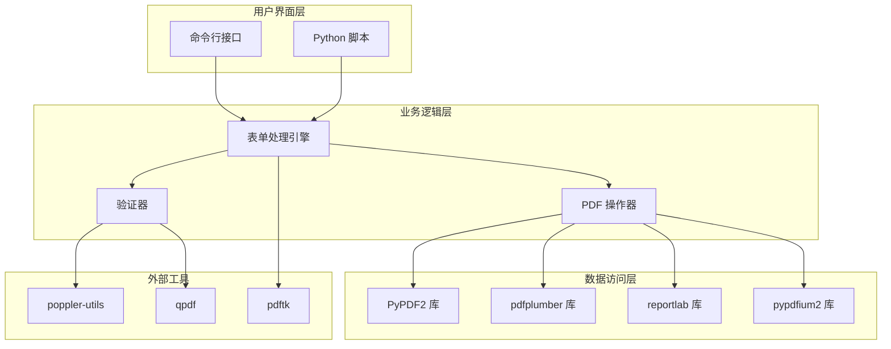

**图表来源**
- [SKILL.md](file://skills/pdf/SKILL.md#L1-L295)
- [reference.md](file://skills/pdf/reference.md#L1-L612)

### 数据流图

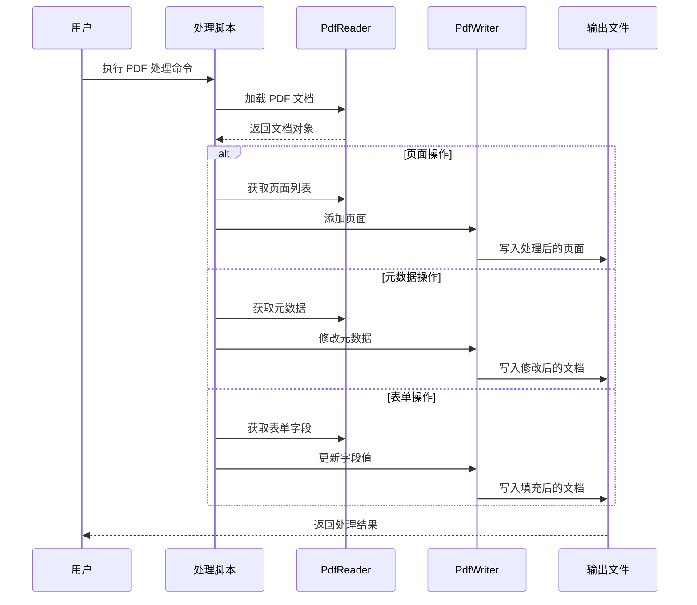

**图表来源**
- [SKILL.md](file://skills/pdf/SKILL.md#L15-L274)
- [reference.md](file://skills/pdf/reference.md#L464-L507)

## 详细组件分析

### 表单字段提取器

表单字段提取器是项目中最复杂的组件之一，负责解析 PDF 中的可填写字段并生成结构化的数据格式。

#### 核心功能

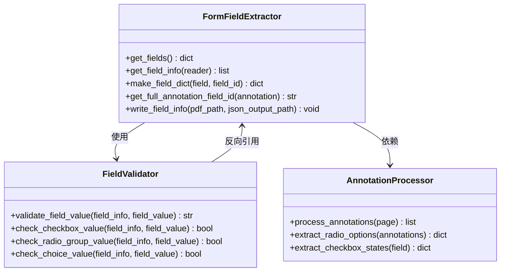

**图表来源**
- [extract_form_field_info.py](file://skills/pdf/scripts/extract_form_field_info.py#L12-L137)
- [fill_fillable_fields.py](file://skills/pdf/scripts/fill_fillable_fields.py#L59-L75)

#### 字段类型处理

系统支持多种 PDF 表单字段类型：

| 字段类型 | 描述 | 特殊属性 |
|---------|------|----------|
| 文本字段 (Tx) | 单行或多行文本输入 | `field_id`, `page`, `rect` |
| 复选框 (Btn) | 勾选框，支持两种状态 | `checked_value`, `unchecked_value` |
| 单选按钮组 (Btn) | 一组互斥的选择项 | `radio_options` |
| 选择列表 (Ch) | 下拉菜单或列表选择 | `choice_options` |

**章节来源**
- [extract_form_field_info.py](file://skills/pdf/scripts/extract_form_field_info.py#L22-L50)
- [forms.md](file://skills/pdf/forms.md#L8-L52)

### PDF 页面操作器

PDF 页面操作器提供了丰富的页面处理功能，包括合并、分割、旋转、裁剪等操作。

#### 页面合并算法

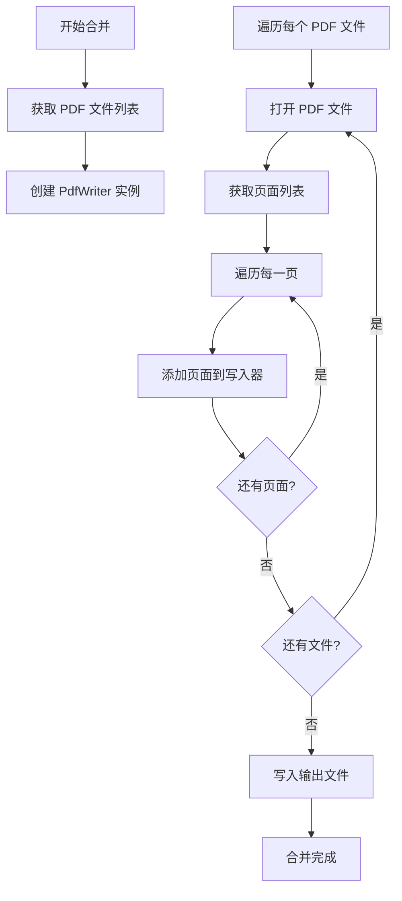

**图表来源**
- [SKILL.md](file://skills/pdf/SKILL.md#L32-L44)

#### 页面旋转矩阵计算

页面旋转功能使用 PyPDF2 的内置旋转方法，支持任意角度的页面旋转：

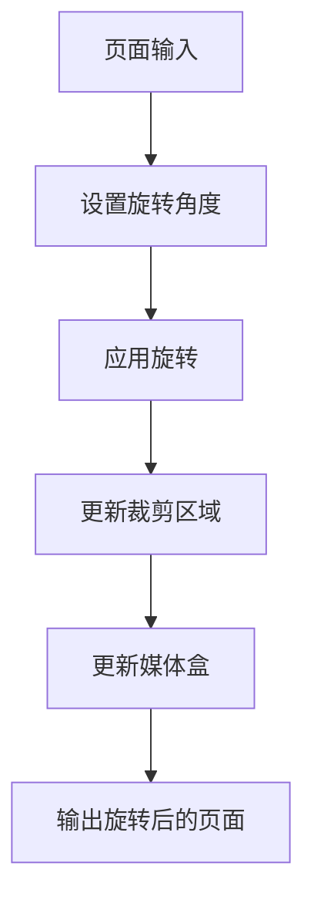

**图表来源**
- [SKILL.md](file://skills/pdf/SKILL.md#L66-L77)

**章节来源**
- [SKILL.md](file://skills/pdf/SKILL.md#L32-L77)

### 水印添加器

水印添加器实现了高效的水印叠加技术，支持透明度控制和位置调整。

#### 水印叠加技术

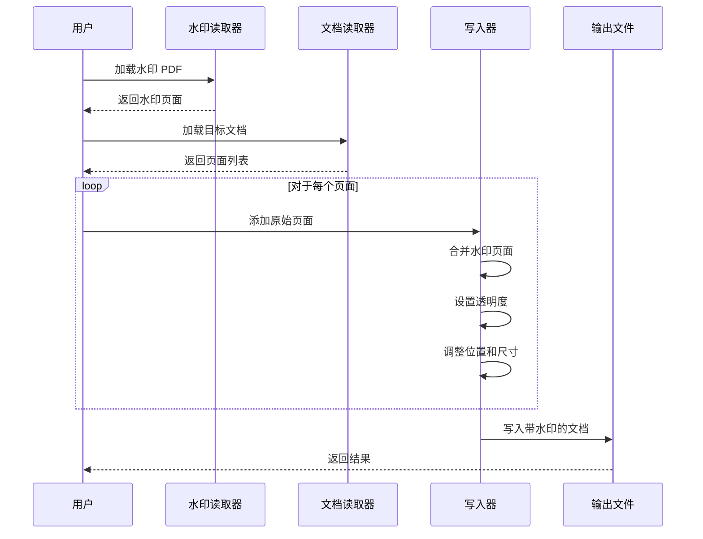

**图表来源**
- [SKILL.md](file://skills/pdf/SKILL.md#L232-L249)

**章节来源**
- [SKILL.md](file://skills/pdf/SKILL.md#L232-L249)

### PDF 安全机制

PDF 安全机制实现了完整的权限控制系统，支持用户密码和所有者密码的双重保护。

#### 权限控制模型

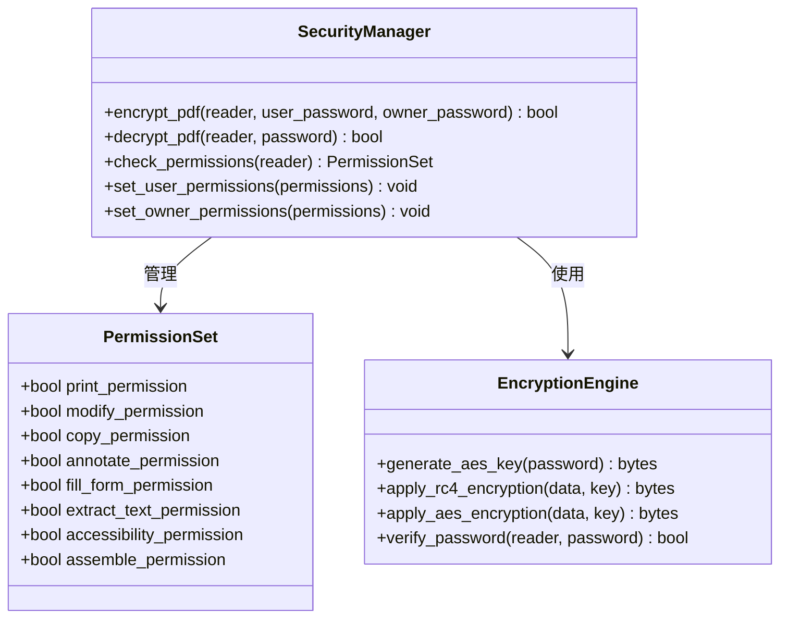

**图表来源**
- [SKILL.md](file://skills/pdf/SKILL.md#L259-L274)
- [reference.md](file://skills/pdf/reference.md#L331-L341)

**章节来源**
- [SKILL.md](file://skills/pdf/SKILL.md#L259-L274)
- [reference.md](file://skills/pdf/reference.md#L331-L341)

### 批量处理系统

批量处理系统提供了高效的大规模 PDF 处理能力，支持错误处理和进度跟踪。

#### 批处理工作流程

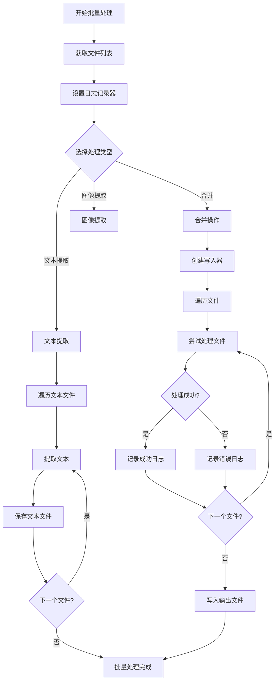

**图表来源**
- [reference.md](file://skills/pdf/reference.md#L463-L507)

**章节来源**
- [reference.md](file://skills/pdf/reference.md#L463-L507)

## 依赖关系分析

### 库依赖图

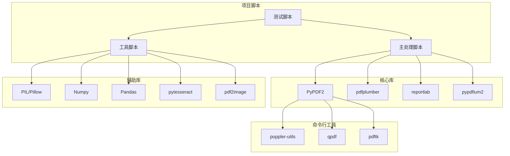

**图表来源**
- [SKILL.md](file://skills/pdf/SKILL.md#L1-L295)
- [reference.md](file://skills/pdf/reference.md#L1-L612)

### 错误处理策略

项目实现了多层次的错误处理机制：

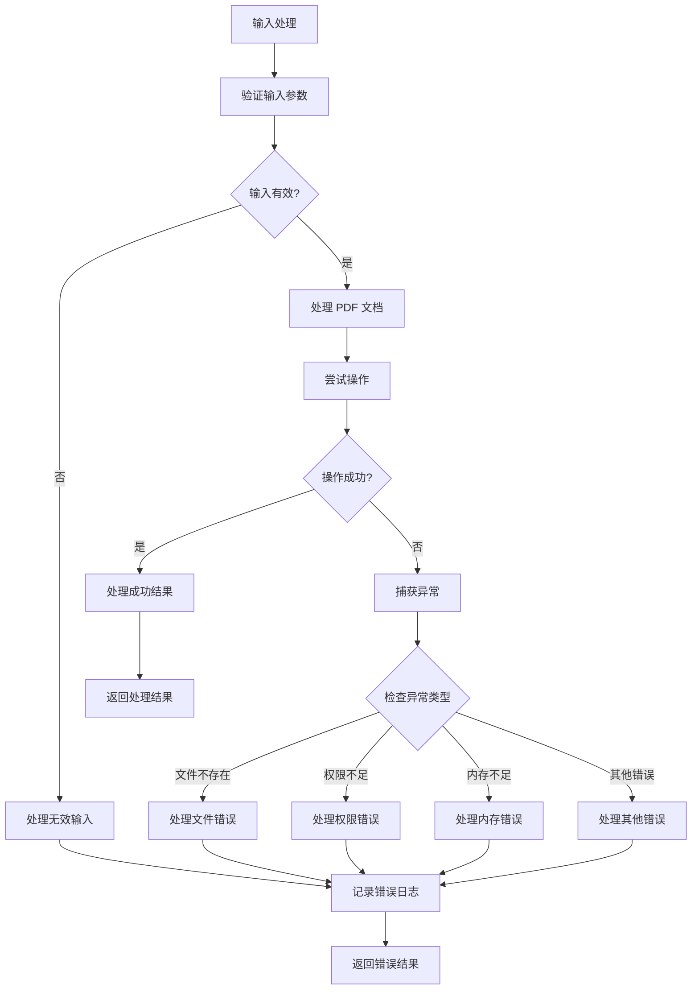

**图表来源**
- [reference.md](file://skills/pdf/reference.md#L567-L601)

**章节来源**
- [reference.md](file://skills/pdf/reference.md#L567-L601)

## 性能考虑

### 内存管理策略

项目采用了多种内存管理策略来处理大型 PDF 文件：

#### 流式处理模式

对于超大 PDF 文件，推荐使用流式处理方式：

```python
# 推荐的流式处理方式
def process_large_pdf_streaming(pdf_path, chunk_size=10):
    reader = PdfReader(pdf_path)
    total_pages = len(reader.pages)
    
    for start_idx in range(0, total_pages, chunk_size):
        end_idx = min(start_idx + chunk_size, total_pages)
        writer = PdfWriter()
        
        # 只加载当前块的页面
        for i in range(start_idx, end_idx):
            writer.add_page(reader.pages[i])
        
        # 处理当前块
        output_path = f"chunk_{start_idx//chunk_size}.pdf"
        with open(output_path, "wb") as output:
            writer.write(output)
```

#### 分页处理策略

对于需要逐页处理的场景：

```python
# 分页处理示例
def process_pages_individually(pdf_path):
    reader = PdfReader(pdf_path)
    
    for i, page in enumerate(reader.pages):
        # 处理单个页面
        processed_page = process_single_page(page)
        
        # 可选：立即释放内存
        del page
        gc.collect()
```

### 性能优化建议

基于项目中的最佳实践，以下是具体的性能优化建议：

1. **大文件处理**
   - 使用 `qpdf --split-pages` 进行分页处理
   - 采用分块处理策略，避免一次性加载整个文件
   - 使用 pypdfium2 进行页面渲染

2. **文本提取优化**
   - 对于纯文本提取，使用 `pdftotext -bbox-layout`
   - 对于表格提取，使用 pdfplumber
   - 避免使用 `pypdf.extract_text()` 处理超大文档

3. **图像提取优化**
   - 使用 `pdfimages` 进行图像提取，速度更快
   - 对于预览使用低分辨率，最终输出使用高分辨率

4. **内存管理**
   ```python
   # 推荐的内存管理模式
   def efficient_processing(pdf_path):
       # 1. 预分配资源
       temp_files = []
       
       try:
           # 2. 处理主要任务
           result = main_processing(pdf_path)
           
           # 3. 清理临时资源
           cleanup_temp_files(temp_files)
           
           return result
       except Exception as e:
           # 4. 异常时清理
           cleanup_temp_files(temp_files)
           raise e
   ```

**章节来源**
- [reference.md](file://skills/pdf/reference.md#L528-L565)

## 故障排除指南

### 常见问题及解决方案

#### 加密 PDF 处理

```python
# 处理加密 PDF 的标准流程
def handle_encrypted_pdf(pdf_path, password):
    try:
        reader = PdfReader(pdf_path)
        if reader.is_encrypted:
            if reader.decrypt(password):
                print("PDF 解密成功")
                return reader
            else:
                print("PDF 解密失败")
                return None
        return reader
    except Exception as e:
        print(f"处理加密 PDF 时出错: {e}")
        return None
```

#### 文本提取问题

对于扫描版 PDF 或文本提取不准确的情况：

```python
# OCR 文本提取流程
def extract_text_with_ocr(pdf_path):
    try:
        # 转换为图像
        images = convert_from_path(pdf_path)
        
        # OCR 处理
        text = ""
        for i, image in enumerate(images):
            text += pytesseract.image_to_string(image)
            
        return text
    except Exception as e:
        print(f"OCR 处理失败: {e}")
        return None
```

#### 边界框验证

使用提供的脚本进行边界框验证：

```bash
# 验证边界框
python scripts/check_bounding_boxes.py fields.json

# 创建验证图像
python scripts/create_validation_image.py 1 fields.json page_1.png validation_1.png
```

**章节来源**
- [reference.md](file://skills/pdf/reference.md#L567-L601)
- [check_bounding_boxes.py](file://skills/pdf/scripts/check_bounding_boxes.py#L18-L60)

### 调试技巧

1. **启用详细日志**
   ```python
   import logging
   logging.basicConfig(level=logging.DEBUG)
   ```

2. **使用调试模式**
   在处理脚本中添加调试输出：
   ```python
   print(f"Processing page {page_num}: {page}")
   ```

3. **逐步验证中间结果**
   将处理过程分解为多个步骤，分别验证每个步骤的结果。

## 结论

本 PDF 高级操作工具包提供了完整而强大的 PDF 处理能力，涵盖了从基础操作到高级功能的各个方面。通过 PyPDF2 库的强大功能和精心设计的脚本架构，用户可以轻松实现复杂的 PDF 处理任务。

### 主要优势

1. **功能完整性**：覆盖了 PDF 处理的所有主要方面
2. **代码质量**：具有良好的错误处理和性能优化
3. **扩展性**：模块化设计便于功能扩展
4. **易用性**：提供了清晰的命令行接口和脚本示例

### 应用场景

- 企业文档自动化处理
- PDF 表单批量处理
- 文档安全和权限管理
- 大规模 PDF 批处理作业
- PDF 文档分析和提取

### 未来发展

建议在未来版本中考虑以下改进：
- 添加更多 PDF 处理库的支持
- 实现更高级的机器学习功能
- 提供 Web 界面支持
- 增强实时协作功能