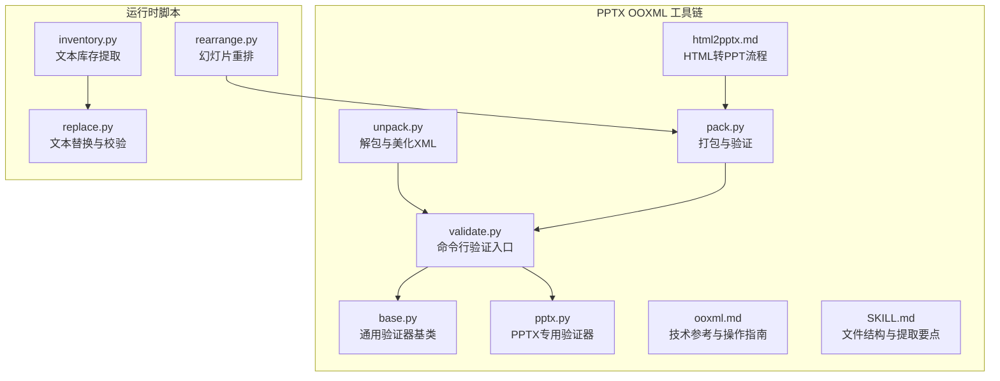
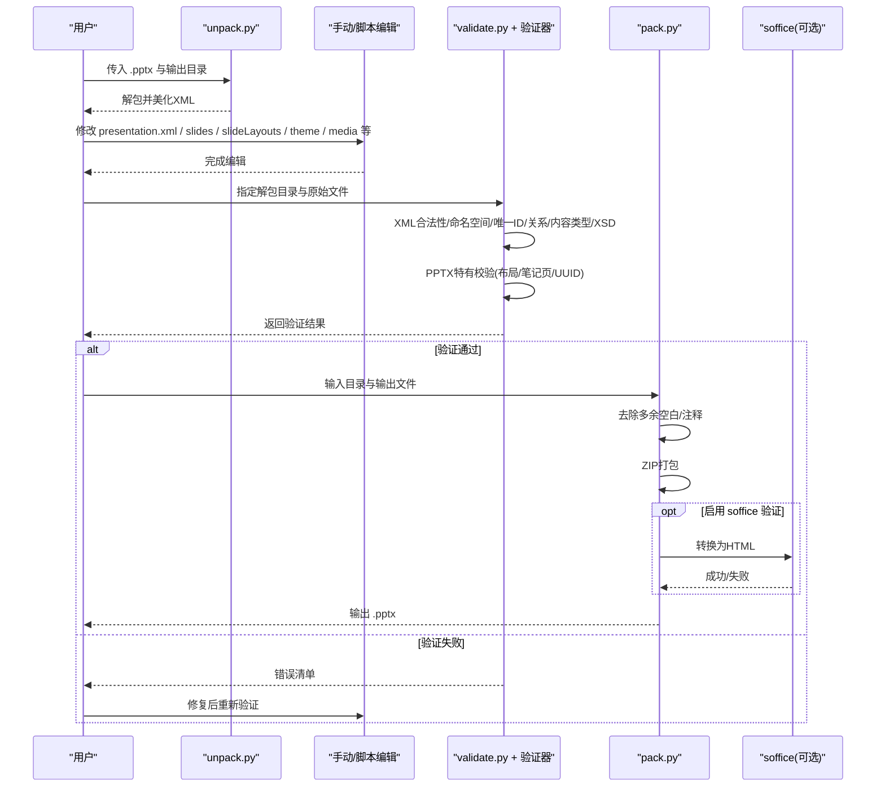
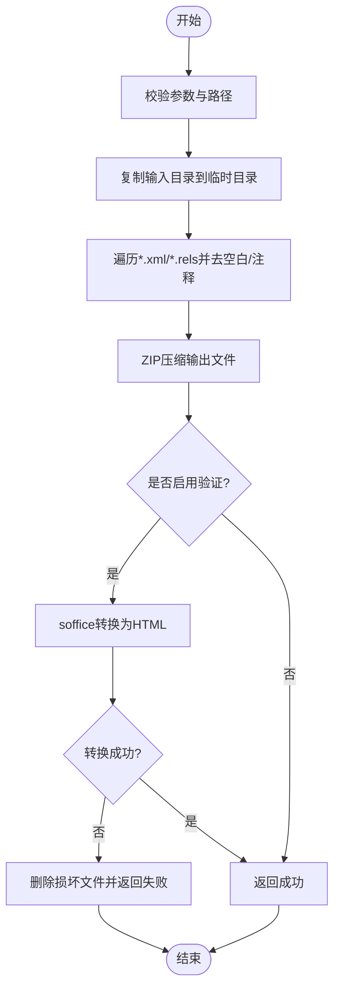
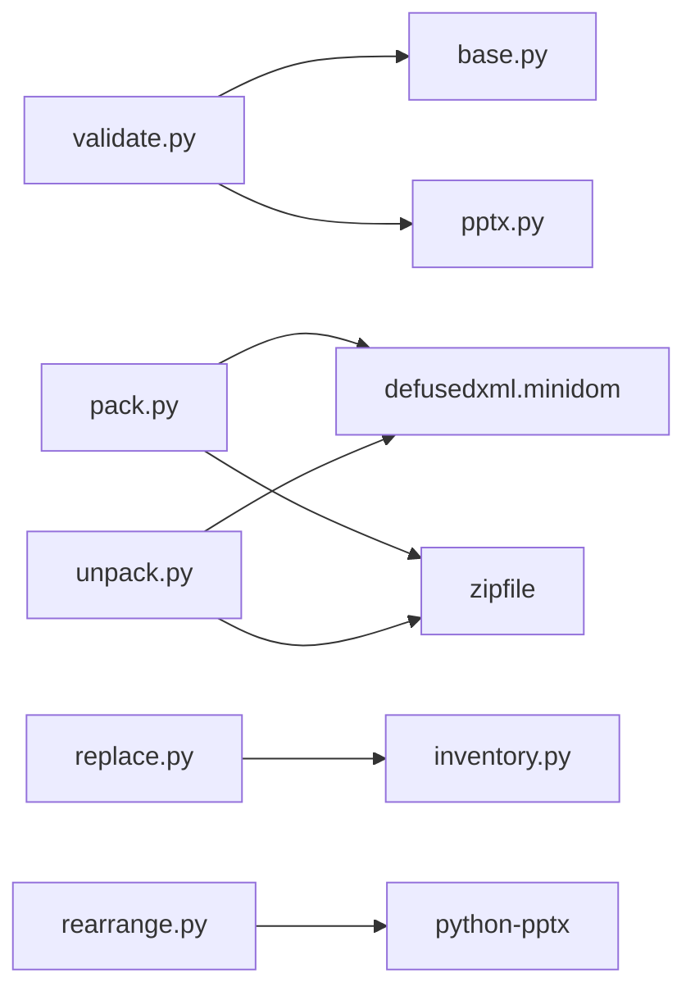

# OOXML 格式处理

<cite>
**本文引用的文件**
- [unpack.py](file://skills/pptx/ooxml/scripts/unpack.py)
- [pack.py](file://skills/pptx/ooxml/scripts/pack.py)
- [validate.py](file://skills/pptx/ooxml/scripts/validate.py)
- [pptx.py](file://skills/pptx/ooxml/scripts/validation/pptx.py)
- [base.py](file://skills/pptx/ooxml/scripts/validation/base.py)
- [ooxml.md](file://skills/pptx/ooxml.md)
- [SKILL.md](file://skills/pptx/SKILL.md)
- [html2pptx.md](file://skills/pptx/html2pptx.md)
- [inventory.py](file://skills/pptx/scripts/inventory.py)
- [rearrange.py](file://skills/pptx/scripts/rearrange.py)
- [replace.py](file://skills/pptx/scripts/replace.py)
</cite>

## 目录
1. [简介](#简介)
2. [项目结构](#项目结构)
3. [核心组件](#核心组件)
4. [架构总览](#架构总览)
5. [详细组件分析](#详细组件分析)
6. [依赖分析](#依赖分析)
7. [性能考虑](#性能考虑)
8. [故障排查指南](#故障排查指南)
9. [结论](#结论)
10. [附录](#附录)

## 简介
本文件系统性梳理 PowerPoint（PPTX）OOXML 格式的内部结构与处理流程，围绕解包、编辑、验证、打包四大阶段，结合仓库中的脚本与技术文档，给出可操作的流程、最佳实践与常见问题修复方案。重点覆盖 presentation.xml、slides、notesSlides、slideLayouts、slideMasters、theme、media 等关键文件的作用与结构，并提供通过直接修改 XML 实现主题、布局、注释等高级定制的方法。

## 项目结构
仓库中与 PPTX OOXML 处理直接相关的模块主要位于 skills/pptx 目录下，包含：
- ooxml/scripts：OOXML 解包、打包、验证工具及验证器
- ooxml.md：PowerPoint OOXML 技术参考与操作指南
- scripts：基于 Python 的内容提取、重排、替换工具
- html2pptx.md：HTML 转 PowerPoint 的流程与注意事项

图表来源
- [unpack.py](file://skills/pptx/ooxml/scripts/unpack.py#L1-L30)
- [pack.py](file://skills/pptx/ooxml/scripts/pack.py#L1-L160)
- [validate.py](file://skills/pptx/ooxml/scripts/validate.py#L1-L70)
- [base.py](file://skills/pptx/ooxml/scripts/validation/base.py#L1-L952)
- [pptx.py](file://skills/pptx/ooxml/scripts/validation/pptx.py#L1-L316)
- [ooxml.md](file://skills/pptx/ooxml.md#L1-L427)
- [SKILL.md](file://skills/pptx/SKILL.md#L31-L49)
- [html2pptx.md](file://skills/pptx/html2pptx.md#L1-L625)
- [inventory.py](file://skills/pptx/scripts/inventory.py#L1-L1021)
- [rearrange.py](file://skills/pptx/scripts/rearrange.py#L1-L232)
- [replace.py](file://skills/pptx/scripts/replace.py#L1-L386)

章节来源
- [ooxml.md](file://skills/pptx/ooxml.md#L1-L427)
- [SKILL.md](file://skills/pptx/SKILL.md#L31-L49)

## 核心组件
- 解包工具：将 PPTX ZIP 包内所有 XML/rels 文件解压并统一美化缩进，便于人工审阅与编辑。
- 打包工具：在临时目录中去除多余空白与注释，按 ZIP 规则打包；支持可选的 soffice 验证，确保生成文件可被 LibreOffice 正常转换。
- 验证框架：以 BaseSchemaValidator 为基类，提供通用 XML 合法性、命名空间、唯一 ID、关系引用、内容类型声明、XSD 模式校验等能力；PPTXSchemaValidator 在此基础上补充 PowerPoint 特有校验（UUID ID、布局引用、笔记页引用、重复布局引用等）。
- 技术参考：ooxml.md 提供 PowerPoint XML 结构、元素顺序、文本格式、列表、形状、图片、表格、布局、关系更新、内容类型声明、滑动操作等权威规范。
- 运行时脚本：inventory.py 提取结构化文本；rearrange.py 基于索引序列重排幻灯片；replace.py 将 inventory 输出的结构化数据回填到 PPTX 并进行溢出与格式警告检测。

章节来源
- [unpack.py](file://skills/pptx/ooxml/scripts/unpack.py#L1-L30)
- [pack.py](file://skills/pptx/ooxml/scripts/pack.py#L1-L160)
- [validate.py](file://skills/pptx/ooxml/scripts/validate.py#L1-L70)
- [base.py](file://skills/pptx/ooxml/scripts/validation/base.py#L1-L952)
- [pptx.py](file://skills/pptx/ooxml/scripts/validation/pptx.py#L1-L316)
- [ooxml.md](file://skills/pptx/ooxml.md#L1-L427)
- [inventory.py](file://skills/pptx/scripts/inventory.py#L1-L1021)
- [rearrange.py](file://skills/pptx/scripts/rearrange.py#L1-L232)
- [replace.py](file://skills/pptx/scripts/replace.py#L1-L386)

## 架构总览
OOXML 处理的端到端流程如下：

图表来源
- [unpack.py](file://skills/pptx/ooxml/scripts/unpack.py#L1-L30)
- [validate.py](file://skills/pptx/ooxml/scripts/validate.py#L1-L70)
- [base.py](file://skills/pptx/ooxml/scripts/validation/base.py#L1-L952)
- [pptx.py](file://skills/pptx/ooxml/scripts/validation/pptx.py#L1-L316)
- [pack.py](file://skills/pptx/ooxml/scripts/pack.py#L1-L160)

## 详细组件分析

### 组件A：解包与美化（unpack.py）
- 功能要点
  - 使用 ZipFile 解压至目标目录
  - 遍历 *.xml 与 *.rels，使用 defusedxml.minidom 美化缩进并写回
  - 对 .docx 提示建议 RSID（用于跟踪修订）
- 最佳实践
  - 解包前先备份原文件
  - 美化后仅做结构性修改，避免破坏命名空间或属性顺序
- 典型用途
  - 快速审阅 presentation.xml、slides/*、slideLayouts/*、theme/*、media/* 等

章节来源
- [unpack.py](file://skills/pptx/ooxml/scripts/unpack.py#L1-L30)

### 组件B：打包与验证（pack.py）
- 功能要点
  - 参数校验：输入目录存在性、输出扩展名限制
  - 临时目录工作流：复制输入目录，再进行 XML 压缩处理
  - condense_xml：移除纯空白文本节点与注释，保留必要格式
  - ZIP 打包：按相对路径写入
  - 可选验证：调用 soffice 将 .pptx 转为 HTML，判断是否可正常转换
- 关键流程图（打包与验证）

图表来源
- [pack.py](file://skills/pptx/ooxml/scripts/pack.py#L1-L160)

章节来源
- [pack.py](file://skills/pptx/ooxml/scripts/pack.py#L1-L160)

### 组件C：命令行验证入口（validate.py + 验证器）
- 功能要点
  - 根据原始文件扩展名选择验证器（.pptx 使用 PPTXSchemaValidator）
  - 依次执行：XML 合法性、命名空间、唯一 ID、UUID ID、关系引用、布局引用、内容类型、XSD、笔记页引用、重复布局引用等
  - 支持详细输出模式
- PPTX 专用校验（节选）
  - UUID ID 校验：识别形如 UUID 的字符串并验证十六进制字符
  - 布局引用校验：检查 slideMaster 中 sldLayoutId 是否与对应 _rels 中的 slideLayout 关系一致
  - 笔记页引用唯一性：同一 notesSlide 不应被多个 slides 引用
  - 重复布局引用：每个 slide 的 slideLayout 关系不应多于一个

章节来源
- [validate.py](file://skills/pptx/ooxml/scripts/validate.py#L1-L70)
- [pptx.py](file://skills/pptx/ooxml/scripts/validation/pptx.py#L1-L316)
- [base.py](file://skills/pptx/ooxml/scripts/validation/base.py#L1-L952)

### 组件D：技术参考与操作指南（ooxml.md）
- 关键点
  - PowerPoint XML 结构与元素顺序要求（如 p:txBody 内部顺序）
  - 文本格式（加粗、斜体、下划线、高亮、字体与字号、颜色）、列表（项目符号/编号）、形状（矩形、圆角矩形、椭圆）、图片、表格
  - 关系更新：ppt/_rels/presentation.xml.rels、ppt/slides/_rels/slideN.xml.rels
  - 内容类型声明：[Content_Types].xml
  - 幻灯片操作：新增、复制、重排、删除
  - 常见错误与规避：编码、图片、列表、ID、主题
- 实操指引
  - 新增幻灯片：创建 slideN.xml、更新 [Content_Types].xml、更新 presentation.xml.rels、更新 presentation.xml、创建 slideN.xml.rels、更新 docProps/app.xml
  - 复制幻灯片：拷贝 slide XML，更新所有 ID，遵循“新增”步骤；注意清理或更新笔记页引用与媒体引用
  - 重排幻灯片：仅调整 presentation.xml 中 <p:sldId> 的顺序
  - 删除幻灯片：从 presentation.xml、presentation.xml.rels、[Content_Types].xml 删除对应条目，并删除 slide 文件与 _rels

章节来源
- [ooxml.md](file://skills/pptx/ooxml.md#L1-L427)

### 组件E：运行时脚本（inventory.py / rearrange.py / replace.py）
- inventory.py
  - 从 PPTX 中提取结构化文本，保留段落格式（对齐、项目符号、字体、间距），处理嵌套组形状的绝对位置，排序形状，过滤页码与非内容占位符，导出 JSON
- rearrange.py
  - 基于索引序列重排幻灯片，支持重复与删除多余幻灯片，保持布局与主题不变
- replace.py
  - 将 inventory 的结构化数据回填到 PPTX，应用段落与字体格式，检测替换后溢出是否恶化，输出警告

章节来源
- [inventory.py](file://skills/pptx/scripts/inventory.py#L1-L1021)
- [rearrange.py](file://skills/pptx/scripts/rearrange.py#L1-L232)
- [replace.py](file://skills/pptx/scripts/replace.py#L1-L386)

## 依赖分析
- 组件耦合
  - validate.py 作为入口，依赖 base.py 与具体 PPTX 验证器
  - pack.py 依赖 defusedxml.minidom 与 zipfile，可选依赖 soffice
  - unpack.py 依赖 defusedxml.minidom 与 zipfile
  - inventory.py 依赖第三方库（如 python-pptx）进行运行时读取
- 外部依赖
  - soffice：可选验证工具，用于将生成的 .pptx 转换为 HTML 判断可打开性
- 潜在循环依赖
  - 未发现直接循环导入；验证器通过模块导入组织良好

图表来源
- [validate.py](file://skills/pptx/ooxml/scripts/validate.py#L1-L70)
- [base.py](file://skills/pptx/ooxml/scripts/validation/base.py#L1-L952)
- [pptx.py](file://skills/pptx/ooxml/scripts/validation/pptx.py#L1-L316)
- [pack.py](file://skills/pptx/ooxml/scripts/pack.py#L1-L160)
- [unpack.py](file://skills/pptx/ooxml/scripts/unpack.py#L1-L30)
- [replace.py](file://skills/pptx/scripts/replace.py#L1-L386)
- [inventory.py](file://skills/pptx/scripts/inventory.py#L1-L1021)
- [rearrange.py](file://skills/pptx/scripts/rearrange.py#L1-L232)

## 性能考虑
- 解包与美化：一次性遍历所有 XML/rels，建议在 SSD 上进行，避免大文件频繁 IO
- 打包：临时目录复制与 ZIP 压缩，注意磁盘空间；condense_xml 会逐文件解析与写回，建议分批处理或在内存充足环境下运行
- soffice 验证：进程启动与转换耗时较长，建议仅在最终产物验证时启用
- 验证器：lxml.etree 解析与 XPath 查找，建议在解包后的干净副本上运行，避免重复解析原始大文件

## 故障排查指南
- XML 不合法
  - 现象：验证器报告 XMLSyntaxError 或行号错误
  - 排查：确认标签闭合、命名空间声明、属性值引号正确
- 命名空间问题
  - 现象：Ignorable 属性引用了未声明的命名空间
  - 排查：确保 mc:Ignorable 中列出的命名空间在根节点 nsmap 中已声明
- 唯一 ID 冲突
  - 现象：ID 重复或全局 ID 冲突
  - 排查：检查 sldid、sldmasterid、sldlayoutid 等 ID 的唯一性
- UUID ID 格式错误
  - 现象：看起来像 UUID 的字符串包含非法十六进制字符
  - 排查：修正 UUID 字符串，确保只含 0-9A-Fa-f，且长度符合预期
- 关系引用不一致
  - 现象：r:id 引用不存在的关系，或关系类型不符
  - 排查：核对 .rels 文件中的 Id 与目标路径，确保类型匹配
- 内容类型未声明
  - 现象：[Content_Types].xml 缺少 Override/Default 声明
  - 排查：为新增的 slides、layouts、themes、media 添加相应声明
- 布局引用错误
  - 现象：slideMaster 中 sldLayoutId 引用不存在的布局
  - 排查：检查 slideMaster 的 _rels 中是否存在对应 slideLayout 关系
- 笔记页引用重复
  - 现象：多个 slides 同时引用同一 notesSlide
  - 排查：确保每个 notesSlide 仅被一个 slide 引用
- 打包后无法打开
  - 现象：soffice 转换失败或 PowerPoint 报错
  - 排查：开启验证、修复关系与内容类型、清理多余资源、避免损坏的媒体引用

章节来源
- [base.py](file://skills/pptx/ooxml/scripts/validation/base.py#L1-L952)
- [pptx.py](file://skills/pptx/ooxml/scripts/validation/pptx.py#L1-L316)
- [pack.py](file://skills/pptx/ooxml/scripts/pack.py#L1-L160)

## 结论
通过解包、编辑、验证、打包的闭环流程，可以安全地对 PPTX 的 OOXML 结构进行深度定制。配合 ooxml.md 的权威规范与验证器的严格校验，能够显著降低文件损坏风险。对于复杂场景（如批量重排、模板复制、文本替换），建议结合 inventory.py、rearrange.py、replace.py 等脚本，形成“提取—加工—回填”的自动化流水线，既保证质量又提升效率。

## 附录
- PPTX 关键文件与职责（摘自 SKILL.md 与 ooxml.md）
  - ppt/presentation.xml：主演示元数据与幻灯片引用
  - ppt/slides/slide{N}.xml：单张幻灯片内容
  - ppt/notesSlides/notesSlide{N}.xml：演讲者备注
  - ppt/comments/modernComment_*.xml：评论
  - ppt/slideLayouts/：幻灯片布局模板
  - ppt/slideMasters/：母版模板
  - ppt/theme/：主题与样式信息
  - ppt/media/：图片与其他媒体
- HTML 转 PPTX 注意事项（来自 html2pptx.md）
  - 文本必须置于语义标签内（p/h1-h6/ul/ol）
  - 不使用手动项目符号，使用语义列表
  - 仅使用通用字体，避免自定义字体导致渲染问题
  - CSS 渐变与阴影需预渲染为位图后再引用

章节来源
- [SKILL.md](file://skills/pptx/SKILL.md#L31-L49)
- [ooxml.md](file://skills/pptx/ooxml.md#L1-L427)
- [html2pptx.md](file://skills/pptx/html2pptx.md#L1-L625)