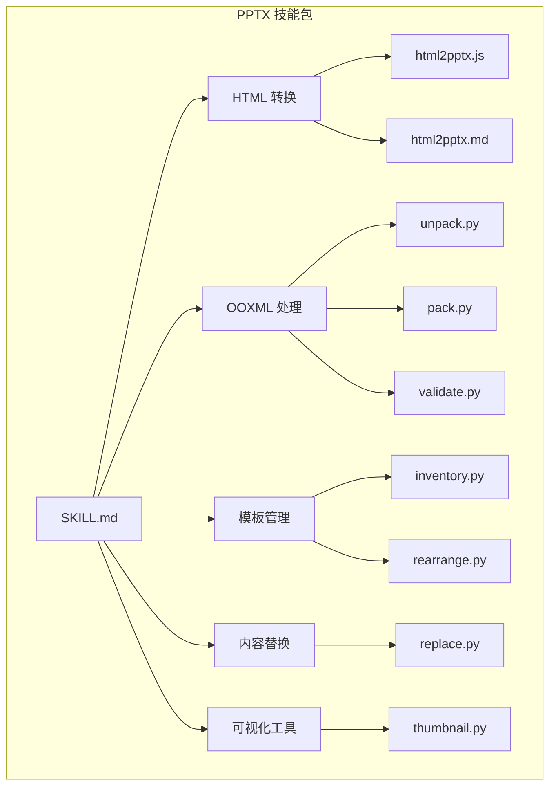
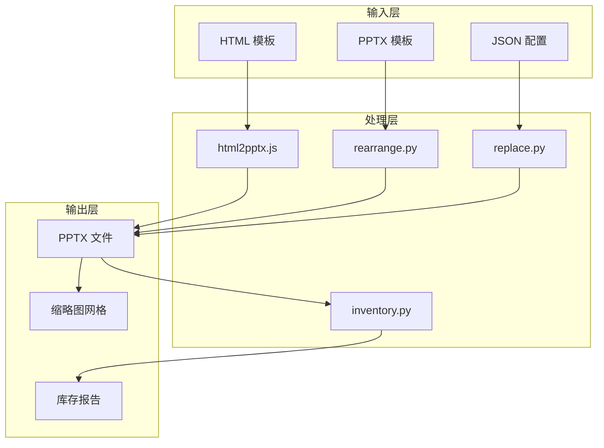
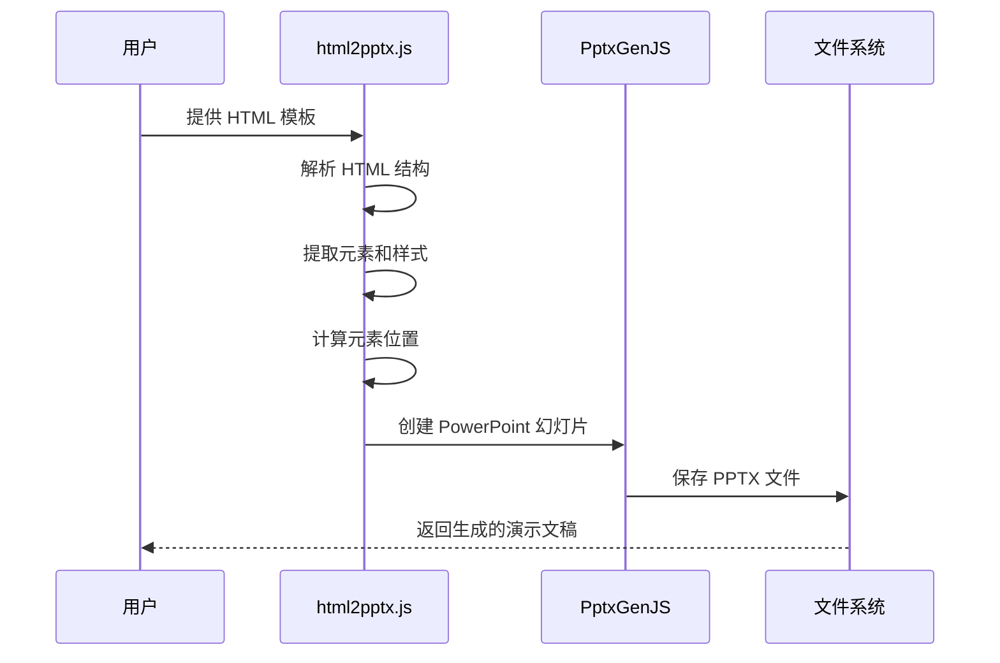
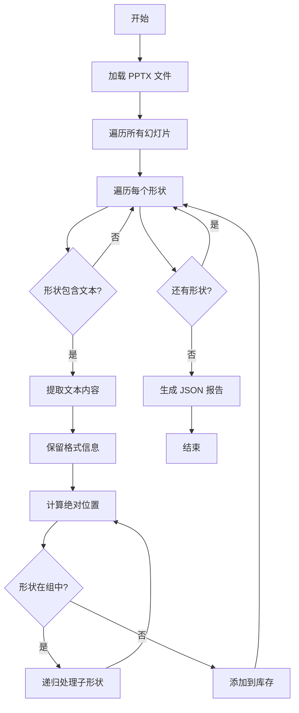
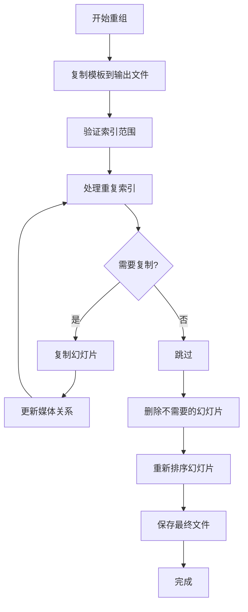
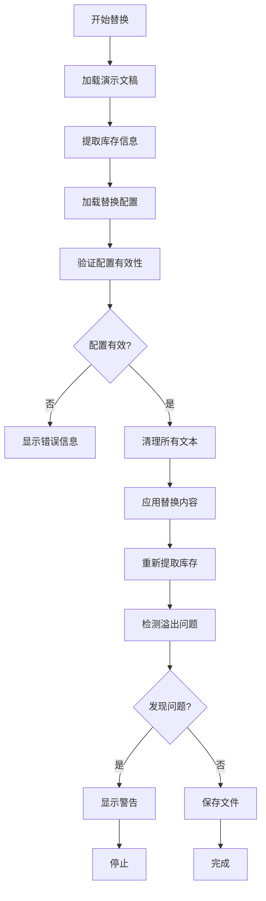
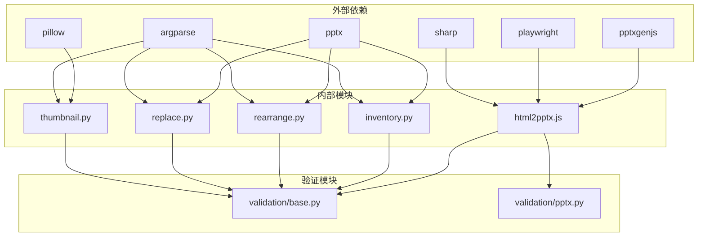

# PPTX 演示文稿处理

<cite>
**本文档引用的文件**
- [SKILL.md](file://skills/pptx/SKILL.md)
- [html2pptx.md](file://skills/pptx/html2pptx.md)
- [ooxml.md](file://skills/pptx/ooxml.md)
- [html2pptx.js](file://skills/pptx/scripts/html2pptx.js)
- [inventory.py](file://skills/pptx/scripts/inventory.py)
- [rearrange.py](file://skills/pptx/scripts/rearrange.py)
- [replace.py](file://skills/pptx/scripts/replace.py)
- [thumbnail.py](file://skills/pptx/scripts/thumbnail.py)
</cite>

## 目录
1. [简介](#简介)
2. [项目结构](#项目结构)
3. [核心组件](#核心组件)
4. [架构概览](#架构概览)
5. [详细组件分析](#详细组件分析)
6. [依赖关系分析](#依赖关系分析)
7. [性能考虑](#性能考虑)
8. [故障排除指南](#故障排除指南)
9. [结论](#结论)

## 简介

本项目提供了完整的 PowerPoint 演示文稿处理解决方案，涵盖了从创建、编辑到分析的全流程。该技能包支持 HTML 到 PPTX 的转换、OOXML 处理、幻灯片内容管理、格式化和样式应用、动画和交互等功能。

主要特性包括：
- **HTML 到 PowerPoint 转换**：使用 html2pptx.js 库将 HTML 模板转换为精确布局的 PPTX 文件
- **OOXML 编辑**：直接操作 Office Open XML 格式，支持复杂的格式化和自定义
- **模板驱动创建**：基于现有模板创建新演示文稿，保持设计一致性
- **批量内容替换**：通过 JSON 配置文件批量更新演示文稿内容
- **可视化验证**：生成缩略图网格进行视觉质量检查
- **高级图表支持**：集成 PptxGenJS 进行数据可视化

## 项目结构

**图表来源**
- [SKILL.md](file://skills/pptx/SKILL.md#L1-L484)
- [html2pptx.js](file://skills/pptx/scripts/html2pptx.js#L1-L979)
- [inventory.py](file://skills/pptx/scripts/inventory.py#L1-L1021)

**章节来源**
- [SKILL.md](file://skills/pptx/SKILL.md#L1-L484)

## 核心组件

### HTML 到 PowerPoint 转换器

html2pptx.js 是整个系统的核心组件，负责将 HTML 模板转换为精确布局的 PowerPoint 文件。

**关键功能**：
- **精确尺寸匹配**：确保 HTML 布局与 PowerPoint 布局完全匹配
- **文本提取**：自动识别和提取 HTML 中的文本内容
- **元素定位**：准确计算 DIV、图片等元素在 PowerPoint 中的位置
- **验证机制**：内置多种验证规则防止格式错误

**章节来源**
- [html2pptx.js](file://skills/pptx/scripts/html2pptx.js#L1-L979)
- [html2pptx.md](file://skills/pptx/html2pptx.md#L1-L625)

### 内容库存提取器

inventory.py 提供了强大的内容提取和分析功能，能够深入解析 PowerPoint 文件的内部结构。

**核心能力**：
- **文本内容提取**：提取所有形状中的文本内容
- **格式信息保留**：保持段落格式（对齐、项目符号、字体、间距）
- **嵌套形状处理**：递归处理组形状，正确计算绝对位置
- **溢出检测**：自动检测文本溢出和形状重叠问题

**章节来源**
- [inventory.py](file://skills/pptx/scripts/inventory.py#L1-L1021)

### 模板重组器

rearrange.py 允许用户基于现有模板重新排列和组织幻灯片。

**主要功能**：
- **滑块复制**：支持重复使用同一张幻灯片
- **顺序调整**：灵活调整幻灯片的显示顺序
- **删除操作**：移除不需要的幻灯片
- **关系维护**：正确处理媒体文件和图像关系

**章节来源**
- [rearrange.py](file://skills/pptx/scripts/rearrange.py#L1-L232)

### 内容替换器

replace.py 实现了基于 JSON 配置的批量内容替换功能。

**工作流程**：
1. **库存提取**：使用 inventory.py 获取当前演示文稿的所有文本形状
2. **配置验证**：检查替换配置的有效性
3. **内容清理**：清除所有形状中的现有文本
4. **批量替换**：根据配置添加新的文本内容
5. **质量检查**：验证替换后的内容质量和格式

**章节来源**
- [replace.py](file://skills/pptx/scripts/replace.py#L1-L386)

### 缩略图生成器

thumbnail.py 提供了高效的演示文稿可视化工具。

**功能特点**：
- **网格布局**：支持 3-6 列的可配置网格布局
- **批量处理**：自动分割大演示文稿为多个网格文件
- **占位符标注**：可选地在缩略图上标注文本占位符区域
- **隐藏幻灯片处理**：自动识别和处理隐藏的幻灯片

**章节来源**
- [thumbnail.py](file://skills/pptx/scripts/thumbnail.py#L1-L451)

## 架构概览

**图表来源**
- [html2pptx.js](file://skills/pptx/scripts/html2pptx.js#L1-L979)
- [inventory.py](file://skills/pptx/scripts/inventory.py#L1-L1021)
- [rearrange.py](file://skills/pptx/scripts/rearrange.py#L1-L232)
- [replace.py](file://skills/pptx/scripts/replace.py#L1-L386)
- [thumbnail.py](file://skills/pptx/scripts/thumbnail.py#L1-L451)

## 详细组件分析

### HTML 到 PowerPoint 转换流程

**图表来源**
- [html2pptx.js](file://skills/pptx/scripts/html2pptx.js#L1-L979)
- [html2pptx.md](file://skills/pptx/html2pptx.md#L1-L625)

**章节来源**
- [html2pptx.js](file://skills/pptx/scripts/html2pptx.js#L1-L979)
- [html2pptx.md](file://skills/pptx/html2pptx.md#L1-L625)

### 内容库存提取算法

**图表来源**
- [inventory.py](file://skills/pptx/scripts/inventory.py#L1-L1021)

**章节来源**
- [inventory.py](file://skills/pptx/scripts/inventory.py#L1-L1021)

### 模板重组工作流

**图表来源**
- [rearrange.py](file://skills/pptx/scripts/rearrange.py#L1-L232)

**章节来源**
- [rearrange.py](file://skills/pptx/scripts/rearrange.py#L1-L232)

### 内容替换验证流程

**图表来源**
- [replace.py](file://skills/pptx/scripts/replace.py#L1-L386)
- [inventory.py](file://skills/pptx/scripts/inventory.py#L1-L1021)

**章节来源**
- [replace.py](file://skills/pptx/scripts/replace.py#L1-L386)

## 依赖关系分析

**图表来源**
- [html2pptx.js](file://skills/pptx/scripts/html2pptx.js#L1-L979)
- [inventory.py](file://skills/pptx/scripts/inventory.py#L1-L1021)
- [rearrange.py](file://skills/pptx/scripts/rearrange.py#L1-L232)
- [replace.py](file://skills/pptx/scripts/replace.py#L1-L386)
- [thumbnail.py](file://skills/pptx/scripts/thumbnail.py#L1-L451)

**章节来源**
- [html2pptx.js](file://skills/pptx/scripts/html2pptx.js#L1-L979)
- [inventory.py](file://skills/pptx/scripts/inventory.py#L1-L1021)
- [rearrange.py](file://skills/pptx/scripts/rearrange.py#L1-L232)
- [replace.py](file://skills/pptx/scripts/replace.py#L1-L386)
- [thumbnail.py](file://skills/pptx/scripts/thumbnail.py#L1-L451)

## 性能考虑

### 内存优化策略

1. **流式处理**：对于大型演示文稿，采用分块处理方式避免内存溢出
2. **延迟加载**：只在需要时加载幻灯片内容，减少初始内存占用
3. **临时文件管理**：合理使用临时目录存储中间结果，及时清理

### 处理效率优化

1. **并行处理**：支持多线程处理多个幻灯片或批量操作
2. **缓存机制**：缓存已解析的样式和字体信息，避免重复计算
3. **增量更新**：只处理发生变化的部分，而不是整个演示文稿

### 输出优化

1. **压缩设置**：合理配置 JPEG 压缩质量，在质量和文件大小间平衡
2. **资源复用**：重复使用的媒体文件只处理一次
3. **关系优化**：清理未使用的媒体文件和关系引用

## 故障排除指南

### 常见问题及解决方案

**问题 1：HTML 尺寸不匹配**
- **症状**：转换后出现尺寸错误或内容溢出
- **解决方法**：确保 HTML body 尺寸与 PowerPoint 布局匹配
- **预防措施**：使用标准尺寸（16:9: 720pt × 405pt）

**问题 2：文本格式丢失**
- **症状**：转换后的文本缺少原始格式
- **解决方法**：检查 HTML 中的内联样式是否正确
- **预防措施**：使用支持的 CSS 属性和字体

**问题 3：幻灯片重组失败**
- **症状**：重组后出现关系错误或媒体文件缺失
- **解决方法**：检查源文件的媒体关系，确保正确复制
- **预防措施**：使用提供的重组脚本而非手动修改

**问题 4：内容替换验证失败**
- **症状**：替换后出现文本溢出或格式问题
- **解决方法**：使用库存报告检查形状边界，调整内容长度
- **预防措施**：在替换前先生成库存报告

**章节来源**
- [html2pptx.md](file://skills/pptx/html2pptx.md#L1-L625)
- [ooxml.md](file://skills/pptx/ooxml.md#L1-L427)
- [replace.py](file://skills/pptx/scripts/replace.py#L1-L386)

## 结论

本 PPTX 演示文稿处理技能包提供了完整而强大的 PowerPoint 文件处理解决方案。通过结合 HTML 转换、OOXML 编辑、模板管理和批量内容替换等功能，用户可以高效地创建、编辑和分析各种类型的演示文稿。

**主要优势**：
- **自动化程度高**：从 HTML 模板到最终 PPTX 文件的完整自动化流程
- **格式保持良好**：精确保持原始设计和格式信息
- **批量处理能力强**：支持大规模演示文稿的批量处理
- **质量控制完善**：内置多种验证和检查机制
- **扩展性强**：模块化设计便于功能扩展和定制

**适用场景**：
- 企业演示文稿的自动化生成
- 教育材料的批量制作
- 数据可视化的快速原型开发
- 模板驱动的内容管理系统

通过合理使用这些工具和技术，可以显著提高演示文稿制作的效率和质量，同时确保格式的一致性和专业性。