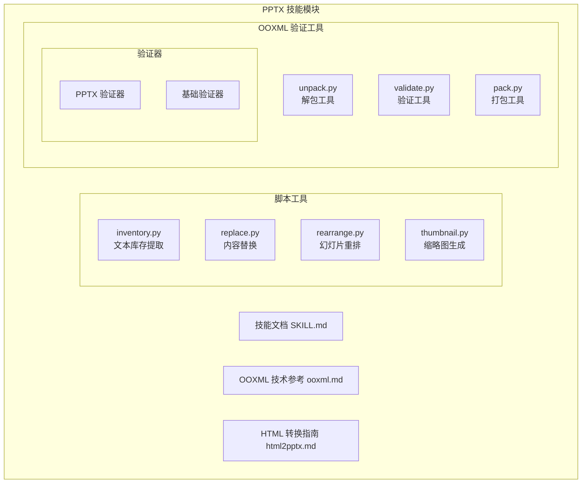
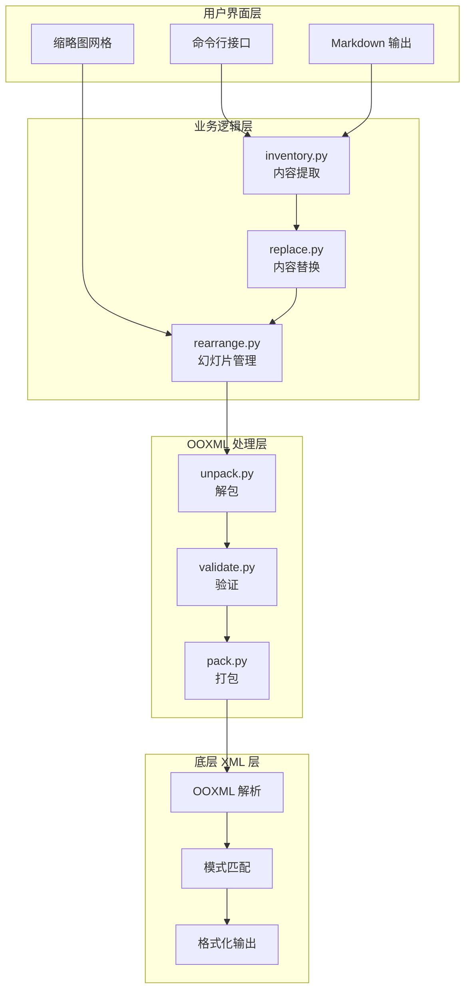
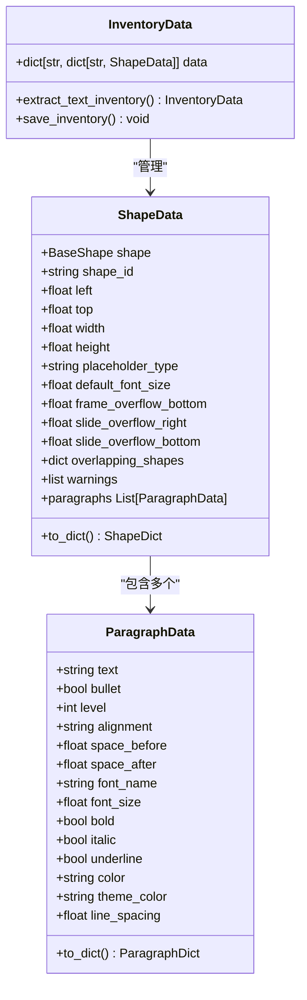
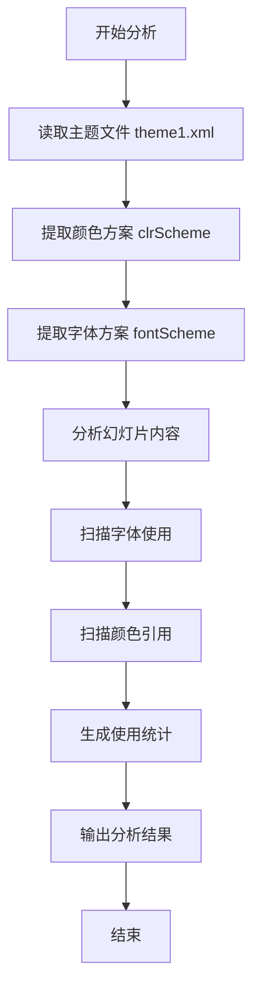
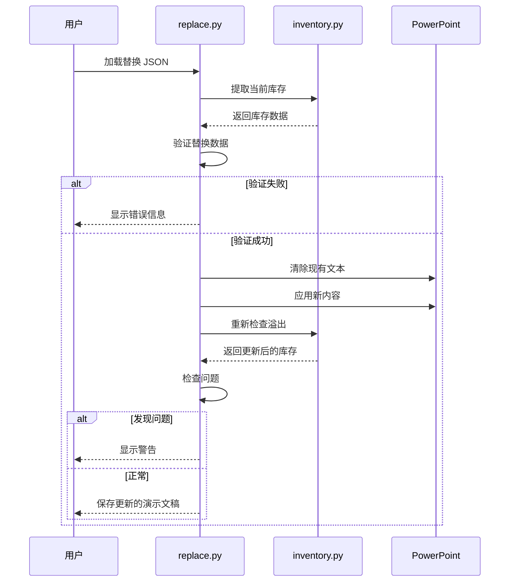
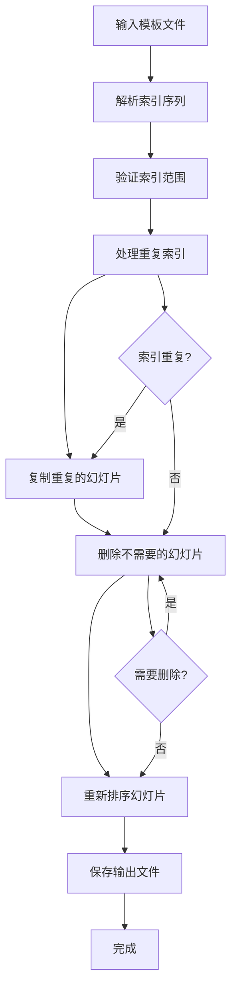
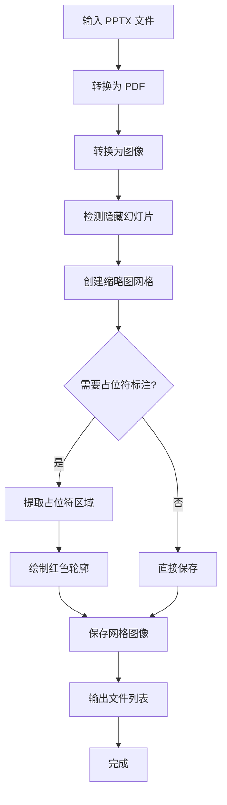
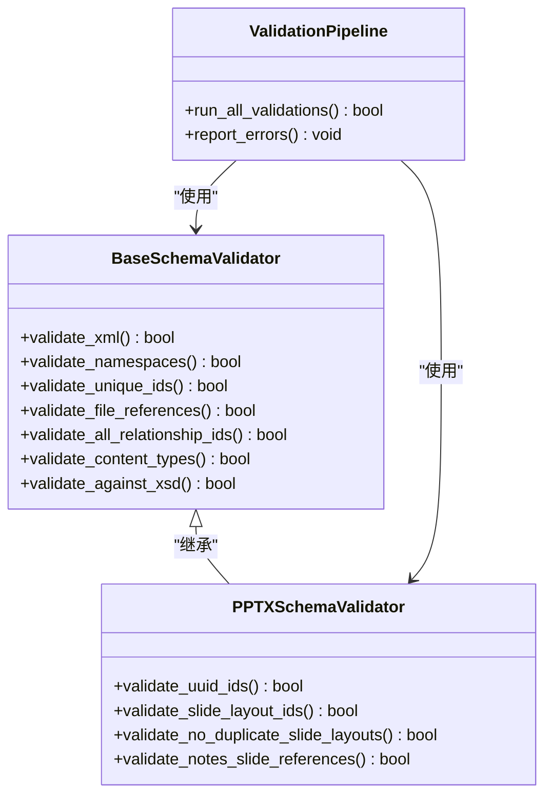
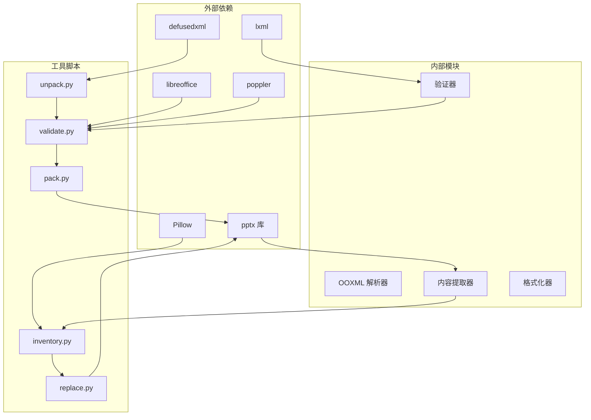
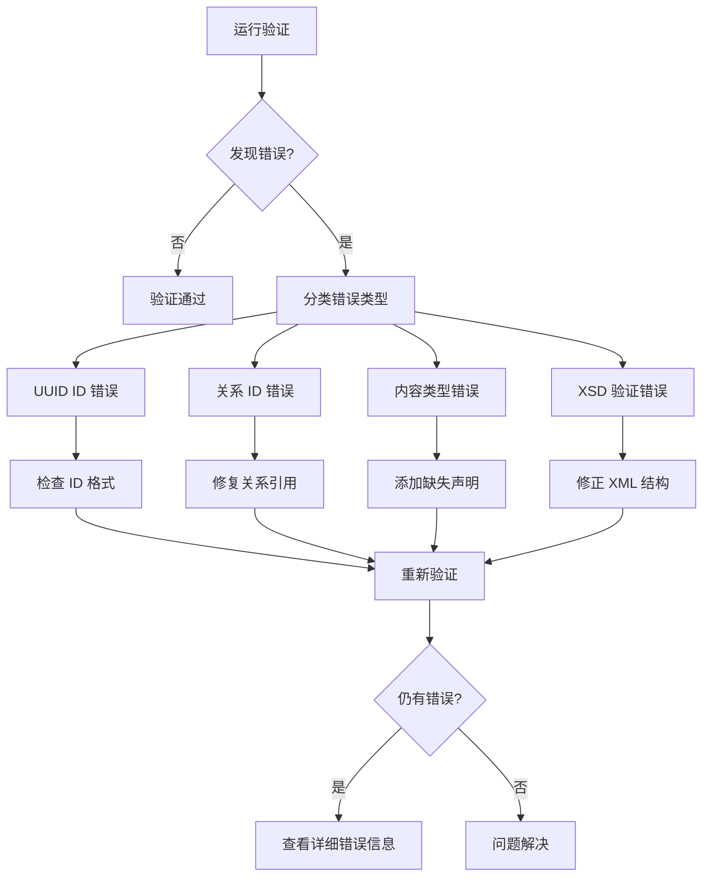

# 内容分析与提取

<cite>
**本文档引用的文件**
- [SKILL.md](file://skills/pptx/SKILL.md)
- [ooxml.md](file://skills/pptx/ooxml.md)
- [html2pptx.md](file://skills/pptx/html2pptx.md)
- [inventory.py](file://skills/pptx/scripts/inventory.py)
- [replace.py](file://skills/pptx/scripts/replace.py)
- [rearrange.py](file://skills/pptx/scripts/rearrange.py)
- [thumbnail.py](file://skills/pptx/scripts/thumbnail.py)
- [unpack.py](file://skills/pptx/ooxml/scripts/unpack.py)
- [validate.py](file://skills/pptx/ooxml/scripts/validate.py)
- [pack.py](file://skills/pptx/ooxml/scripts/pack.py)
- [pptx.py](file://skills/pptx/ooxml/scripts/validation/pptx.py)
- [base.py](file://skills/pptx/ooxml/scripts/validation/base.py)
</cite>

## 目录
1. [简介](#简介)
2. [项目结构](#项目结构)
3. [核心组件](#核心组件)
4. [架构概览](#架构概览)
5. [详细组件分析](#详细组件分析)
6. [依赖关系分析](#依赖关系分析)
7. [性能考虑](#性能考虑)
8. [故障排除指南](#故障排除指南)
9. [结论](#结论)

## 简介

本文档详细介绍了 PowerPoint 演示文稿的内容分析与提取功能，涵盖了从文本提取到原始 XML 访问的完整技术栈。该系统提供了多种分析方法：通过 markitdown 工具进行 Markdown 转换的快速文本提取，以及深入的原始 Office Open XML (OOXML) 结构访问来获取评论、演讲者备注、幻灯片布局、动画和设计元素等复杂内容。

系统的核心优势在于其多层分析能力：既能提供高层次的文本摘要，也能深入到 XML 层面进行精确的内容提取和格式分析。这对于需要深度分析演示文稿设计元素、内容结构和格式信息的场景尤为重要。

## 项目结构

该项目采用模块化设计，主要包含以下核心目录和文件：

**图表来源**
- [SKILL.md](file://skills/pptx/SKILL.md#L1-L484)
- [ooxml.md](file://skills/pptx/ooxml.md#L1-L427)

**章节来源**
- [SKILL.md](file://skills/pptx/SKILL.md#L1-L484)

## 核心组件

### 文本提取与分析组件

系统提供了两种主要的文本提取方式：

1. **Markdown 快速提取**：使用 markitdown 工具进行快速文本转换
2. **深度 XML 分析**：通过原始 OOXML 结构进行精确内容提取

### 内容管理组件

- **inventory.py**：提取幻灯片中的所有文本内容，保留段落格式和位置信息
- **replace.py**：基于库存数据进行内容替换和更新
- **rearrange.py**：重新排列和复制幻灯片模板

### 可视化组件

- **thumbnail.py**：生成幻灯片缩略图网格，支持占位符轮廓标注
- **html2pptx.js**：将 HTML 转换为 PowerPoint，支持复杂的布局和样式

**章节来源**
- [SKILL.md](file://skills/pptx/SKILL.md#L13-L484)
- [inventory.py](file://skills/pptx/scripts/inventory.py#L1-L1021)

## 架构概览

系统采用分层架构设计，从高层抽象到底层 XML 操作形成了完整的分析管道：

**图表来源**
- [inventory.py](file://skills/pptx/scripts/inventory.py#L1-L1021)
- [replace.py](file://skills/pptx/scripts/replace.py#L1-L386)
- [unpack.py](file://skills/pptx/ooxml/scripts/unpack.py#L1-L30)

## 详细组件分析

### 文本库存提取器 (inventory.py)

inventory.py 是整个系统的核心组件，负责从 PowerPoint 文件中提取结构化的文本内容：

**图表来源**
- [inventory.py](file://skills/pptx/scripts/inventory.py#L128-L740)

#### 主要功能特性

1. **递归形状处理**：支持嵌套组形状的绝对位置计算
2. **溢出检测**：自动检测文本框溢出和幻灯片边界溢出
3. **占位符过滤**：自动过滤幻灯片编号和页脚占位符
4. **格式保持**：保留段落对齐、项目符号、字体和间距属性

#### 字体和颜色分析

系统能够深入分析字体使用情况和颜色应用：

**图表来源**
- [SKILL.md](file://skills/pptx/SKILL.md#L41-L46)

**章节来源**
- [inventory.py](file://skills/pptx/scripts/inventory.py#L137-L740)

### 内容替换器 (replace.py)

replace.py 提供了智能的内容替换功能，基于 inventory.py 的分析结果进行精确更新：

**图表来源**
- [replace.py](file://skills/pptx/scripts/replace.py#L214-L354)

#### 替换流程控制

系统实现了严格的替换流程控制，确保内容更新的安全性和一致性：

1. **预验证阶段**：检查目标形状是否存在
2. **清理阶段**：清除所有现有文本内容
3. **应用阶段**：按指定格式应用新内容
4. **后验证阶段**：检测溢出问题是否恶化

**章节来源**
- [replace.py](file://skills/pptx/scripts/replace.py#L162-L354)

### 幻灯片重排器 (rearrange.py)

rearrange.py 支持复杂的幻灯片操作，包括重复、删除和重新排序：

**图表来源**
- [rearrange.py](file://skills/pptx/scripts/rearrange.py#L149-L227)

**章节来源**
- [rearrange.py](file://skills/pptx/scripts/rearrange.py#L75-L227)

### 缩略图生成器 (thumbnail.py)

thumbnail.py 提供了强大的可视化分析功能：

**图表来源**
- [thumbnail.py](file://skills/pptx/scripts/thumbnail.py#L197-L446)

**章节来源**
- [thumbnail.py](file://skills/pptx/scripts/thumbnail.py#L159-L446)

### OOXML 验证系统

系统提供了完整的 OOXML 验证框架，确保生成的文件符合标准：

**图表来源**
- [base.py](file://skills/pptx/ooxml/scripts/validation/base.py#L11-L800)
- [pptx.py](file://skills/pptx/ooxml/scripts/validation/pptx.py#L10-L316)

**章节来源**
- [base.py](file://skills/pptx/ooxml/scripts/validation/base.py#L11-L800)
- [pptx.py](file://skills/pptx/ooxml/scripts/validation/pptx.py#L28-L316)

## 依赖关系分析

系统采用了清晰的依赖层次结构：

**图表来源**
- [SKILL.md](file://skills/pptx/SKILL.md#L473-L484)

### 关键依赖关系

1. **pptx 库**：核心 PowerPoint 文件处理
2. **lxml**：高性能 XML 解析和验证
3. **defusedxml**：安全的 XML 解析，防止 XXE 攻击
4. **Pillow**：图像处理和缩略图生成
5. **libreoffice**：PDF 转换支持

**章节来源**
- [SKILL.md](file://skills/pptx/SKILL.md#L473-L484)

## 性能考虑

### 内存优化策略

系统在处理大型演示文稿时采用了多项内存优化措施：

1. **流式处理**：使用生成器模式处理大量 XML 数据
2. **延迟加载**：仅在需要时加载和解析文件内容
3. **缓存机制**：对重复使用的字体和颜色数据进行缓存
4. **分块处理**：支持大文件的分块处理和增量保存

### 处理效率优化

- **并行处理**：支持多线程处理多个幻灯片
- **增量验证**：只报告新增的验证错误
- **智能缓存**：避免重复的 XML 解析操作

## 故障排除指南

### 常见问题及解决方案

#### 验证错误

当使用验证工具发现错误时，系统会提供详细的错误信息：

#### 内容溢出问题

系统提供了专门的溢出检测和报告机制：

1. **文本框溢出**：检测文本内容超出形状边界的情况
2. **幻灯片边界溢出**：检测内容超出幻灯片边缘的情况
3. **重叠检测**：识别形状之间的重叠问题

**章节来源**
- [replace.py](file://skills/pptx/scripts/replace.py#L143-L354)
- [base.py](file://skills/pptx/ooxml/scripts/validation/base.py#L688-L740)

### 最佳实践建议

1. **定期验证**：在每次修改后都运行验证工具
2. **备份原文件**：在进行重大修改前备份原始文件
3. **渐进式修改**：小步修改，及时验证效果
4. **使用模板**：优先使用经过验证的模板文件

## 结论

该 PPTX 内容分析与提取系统提供了完整的解决方案，从高层次的文本摘要到低层次的 XML 结构分析。系统的主要优势包括：

1. **多层分析能力**：支持从简单文本提取到复杂 XML 分析
2. **自动化程度高**：提供了完整的工具链，从提取到验证
3. **安全性强**：内置安全检查，防止恶意内容注入
4. **可扩展性好**：模块化设计，易于添加新的分析功能

对于需要深度分析 PowerPoint 演示文稿设计元素、内容结构和格式信息的用户，该系统提供了强大而灵活的工具集。通过合理使用这些工具，可以高效地完成演示文稿的内容分析、格式提取和批量处理任务。