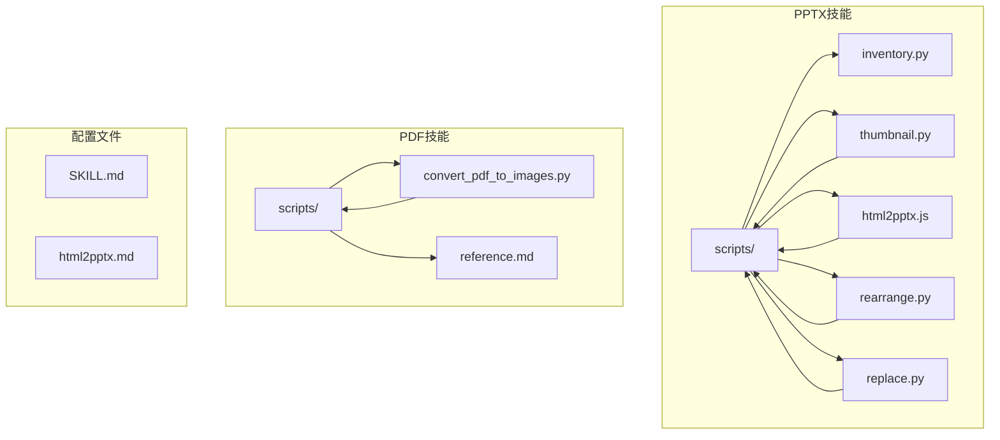
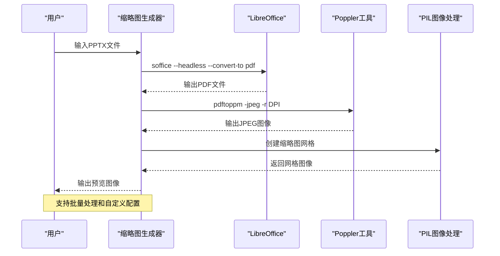
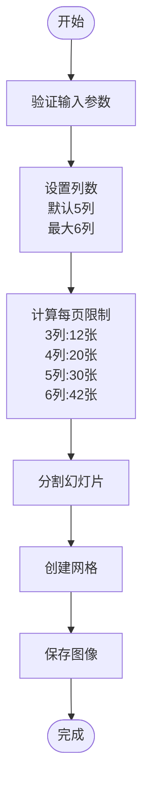
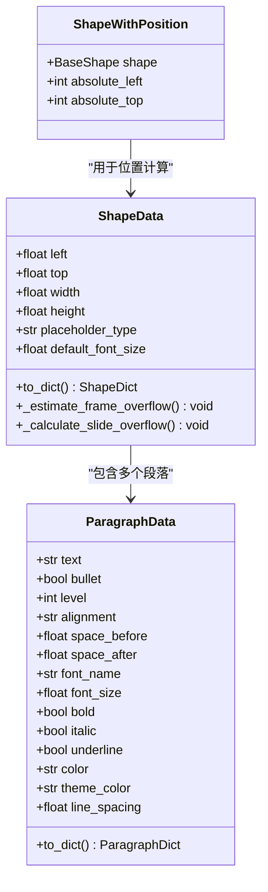
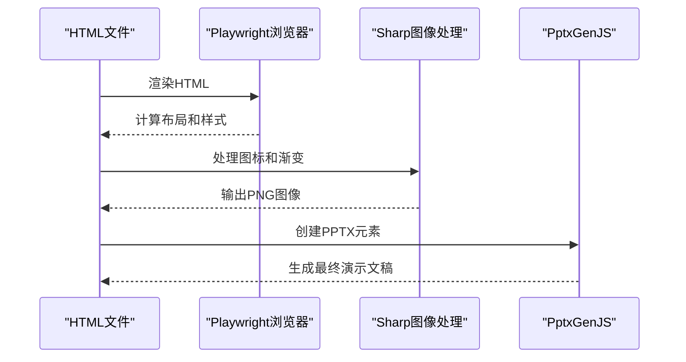
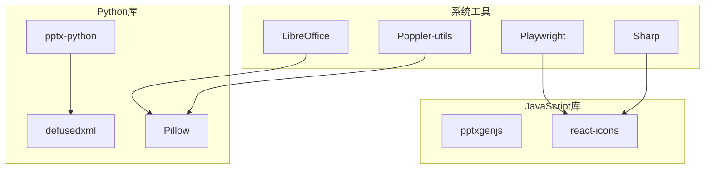
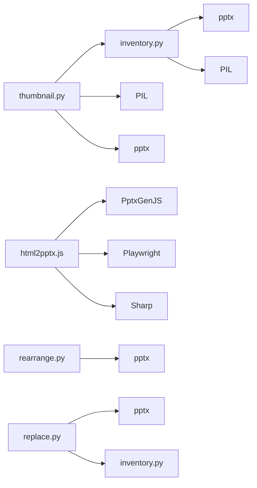

# 图像转换与预览

<cite>
**本文档引用的文件**
- [thumbnail.py](file://skills/pptx/scripts/thumbnail.py)
- [inventory.py](file://skills/pptx/scripts/inventory.py)
- [SKILL.md](file://skills/pptx/SKILL.md)
- [html2pptx.js](file://skills/pptx/scripts/html2pptx.js)
- [html2pptx.md](file://skills/pptx/html2pptx.md)
- [rearrange.py](file://skills/pptx/scripts/rearrange.py)
- [replace.py](file://skills/pptx/scripts/replace.py)
- [convert_pdf_to_images.py](file://skills/pdf/scripts/convert_pdf_to_images.py)
- [reference.md](file://skills/pdf/reference.md)
</cite>

## 目录
1. [简介](#简介)
2. [项目结构](#项目结构)
3. [核心组件](#核心组件)
4. [架构概览](#架构概览)
5. [详细组件分析](#详细组件分析)
6. [依赖关系分析](#依赖关系分析)
7. [性能考虑](#性能考虑)
8. [故障排除指南](#故障排除指南)
9. [结论](#结论)

## 简介

本文档详细介绍了PPTX图像转换与预览功能，重点涵盖以下核心能力：

- **PowerPoint演示文稿到图像文件的转换流程**：通过LibreOffice的headless模式转换到PDF，再使用Poppler工具的pdftoppm命令转换为图像文件
- **缩略图网格生成功能**：支持可配置的列数、每页幻灯片数量限制和输出命名规范
- **图像质量与文件大小优化**：不同分辨率设置对图像质量和文件大小的影响分析
- **批量生成高质量演示文稿预览图像**：用于内容审查和质量检查的完整工作流程

该功能集成为内容创作者、设计师和质量检查员提供了强大的视觉分析工具，支持从单个幻灯片到整个演示文稿的全面预览。

## 项目结构

该项目采用模块化设计，将PPTX处理功能组织在专门的技能目录中：



**图表来源**
- [thumbnail.py](file://skills/pptx/scripts/thumbnail.py#L1-L451)
- [SKILL.md](file://skills/pptx/SKILL.md#L1-L484)

**章节来源**
- [SKILL.md](file://skills/pptx/SKILL.md#L1-L484)
- [thumbnail.py](file://skills/pptx/scripts/thumbnail.py#L1-L50)

## 核心组件

### 图像转换引擎

图像转换功能的核心是`thumbnail.py`脚本，它实现了完整的两步转换流程：

1. **LibreOffice Headless转换**：将PPTX文件转换为PDF格式
2. **Poppler pdftoppm转换**：将PDF页面转换为JPEG图像

### 缩略图网格生成器

缩略图网格生成功能提供了灵活的布局选项：
- **列数配置**：支持3-6列，默认5列
- **每页限制**：根据列数自动计算每页最大幻灯片数量
- **输出命名**：支持自定义前缀和多页输出

### 文本库存提取器

`inventory.py`模块提供了详细的文本内容分析：
- **形状位置提取**：准确获取每个形状的绝对位置
- **溢出检测**：自动检测文本溢出和重叠问题
- **格式信息保留**：保持段落格式、字体和间距信息

**章节来源**
- [thumbnail.py](file://skills/pptx/scripts/thumbnail.py#L197-L271)
- [inventory.py](file://skills/pptx/scripts/inventory.py#L1-L1021)

## 架构概览



**图表来源**
- [thumbnail.py](file://skills/pptx/scripts/thumbnail.py#L219-L243)
- [SKILL.md](file://skills/pptx/SKILL.md#L440-L466)

## 详细组件分析

### 图像转换流程

#### LibreOffice Headless转换

LibreOffice提供了一个强大的headless转换功能，可以将PPTX文件无界面地转换为PDF格式：

```bash
soffice --headless --convert-to pdf template.pptx
```

这个过程涉及：
- **无头模式**：不启动图形界面，适合自动化处理
- **格式转换**：将PPTX的复杂格式转换为标准PDF
- **保真度保证**：保持原始布局、字体和图像质量

#### Poppler pdftoppm转换

pdftoppm是Poppler工具包的核心组件，专门用于PDF到图像的转换：

```bash
pdftoppm -jpeg -r 150 template.pdf slide
```

关键参数说明：
- **`-jpeg`**：输出JPEG格式（支持`-png`用于PNG格式）
- **`-r 150`**：设置分辨率150 DPI（可调整以平衡质量与文件大小）
- **`-f 2 -l 5`**：指定页面范围（仅转换第2-5页）

#### 分辨率影响分析

不同分辨率设置对图像质量和文件大小的影响：

| 分辨率 | 文件大小 | 图像质量 | 适用场景 |
|--------|----------|----------|----------|
| 72 DPI | 最小 | 低 | 快速预览、网络传输 |
| 150 DPI | 中等 | 中等 | 内容审查、质量检查 |
| 300 DPI | 较大 | 高 | 打印输出、详细分析 |
| 600 DPI | 最大 | 极高 | 专业出版、放大查看 |

**章节来源**
- [thumbnail.py](file://skills/pptx/scripts/thumbnail.py#L219-L243)
- [SKILL.md](file://skills/pptx/SKILL.md#L440-L466)

### 缩略图网格生成系统

#### 布局算法

缩略图网格生成器实现了智能的布局算法，支持可配置的列数：



**图表来源**
- [thumbnail.py](file://skills/pptx/scripts/thumbnail.py#L274-L318)

#### 输出命名规范

输出文件遵循统一的命名规范：
- **单页网格**：`{prefix}.jpg`
- **多页网格**：`{prefix}-1.jpg`, `{prefix}-2.jpg`, 等等

#### 网格限制配置

| 列数 | 每页最大幻灯片 | 网格尺寸 | 适用场景 |
|------|----------------|----------|----------|
| 3列 | 12张 | 3×4网格 | 小型演示文稿 |
| 4列 | 20张 | 4×5网格 | 中等规模演示文稿 |
| 5列 | 30张 | 5×6网格 | 标准演示文稿 |
| 6列 | 42张 | 6×7网格 | 大型演示文稿 |

**章节来源**
- [thumbnail.py](file://skills/pptx/scripts/thumbnail.py#L15-L41)
- [thumbnail.py](file://skills/pptx/scripts/thumbnail.py#L274-L318)

### 文本库存提取与分析

#### 形状位置提取

`inventory.py`模块提供了精确的形状位置提取功能：



**图表来源**
- [inventory.py](file://skills/pptx/scripts/inventory.py#L128-L740)

#### 溢出检测机制

系统实现了多层次的溢出检测机制：

1. **框架溢出检测**：检测文本是否超出形状边界
2. **滑块溢出检测**：检测形状是否超出幻灯片边界  
3. **重叠检测**：检测形状之间的重叠问题
4. **警告系统**：识别手动项目符号等格式问题

**章节来源**
- [inventory.py](file://skills/pptx/scripts/inventory.py#L562-L690)

### HTML到PPTX转换集成

#### 渲染管道

`html2pptx.js`提供了完整的HTML到PPTX转换管道：



**图表来源**
- [html2pptx.js](file://skills/pptx/scripts/html2pptx.js#L1-L800)

#### 验证和错误处理

转换过程包含多重验证机制：
- **维度验证**：确保HTML尺寸与PPTX布局匹配
- **溢出验证**：检测内容是否超出容器边界
- **格式验证**：验证CSS和布局的有效性
- **错误聚合**：收集所有错误并一次性报告

**章节来源**
- [html2pptx.js](file://skills/pptx/scripts/html2pptx.js#L68-L118)
- [html2pptx.md](file://skills/pptx/html2pptx.md#L236-L246)

## 依赖关系分析

### 外部工具依赖

项目依赖于以下外部工具和库：



**图表来源**
- [SKILL.md](file://skills/pptx/SKILL.md#L473-L484)

### 内部模块依赖



**图表来源**
- [thumbnail.py](file://skills/pptx/scripts/thumbnail.py#L43-L51)
- [inventory.py](file://skills/pptx/scripts/inventory.py#L25-L34)

**章节来源**
- [SKILL.md](file://skills/pptx/SKILL.md#L473-L484)

## 性能考虑

### 内存管理

图像处理过程中需要有效的内存管理策略：

1. **临时文件管理**：使用`tempfile.TemporaryDirectory()`确保临时文件正确清理
2. **批量处理**：对于大型演示文稿，建议分批处理以避免内存峰值
3. **图像缓存**：合理利用PIL的图像缓存机制

### 处理速度优化

- **并行处理**：可以考虑并行处理多个幻灯片的缩略图生成
- **分辨率选择**：根据用途选择合适的分辨率，平衡质量和性能
- **预处理优化**：提前检测和修复潜在问题，减少重复处理

### 存储空间管理

- **文件命名策略**：使用紧凑的文件名避免路径过长
- **压缩策略**：合理选择JPEG质量参数平衡文件大小和质量
- **清理机制**：确保中间文件被及时清理

## 故障排除指南

### 常见问题及解决方案

#### LibreOffice转换失败

**症状**：`PDF conversion failed`错误
**原因**：
- LibreOffice未正确安装
- PPTX文件损坏或不受支持
- 权限问题

**解决方案**：
1. 验证LibreOffice安装：`soffice --version`
2. 检查文件权限：`chmod +x template.pptx`
3. 使用替代工具：考虑使用`unoconv`作为备选方案

#### Poppler转换问题

**症状**：`Image conversion failed`错误
**原因**：
- pdftoppm命令不可用
- PDF文件损坏
- 权限不足

**解决方案**：
1. 安装Poppler工具：`sudo apt-get install poppler-utils`
2. 验证PDF完整性：`pdfinfo template.pdf`
3. 检查输出目录权限

#### 图像质量不佳

**症状**：生成的缩略图模糊或像素化
**原因**：
- 分辨率设置过低
- 幻灯片本身分辨率不高
- 缩放算法问题

**解决方案**：
1. 提高DPI设置：`--cols 6`配合更高DPI
2. 检查源文件质量
3. 调整缩略图尺寸参数

#### 内存不足问题

**症状**：处理大型演示文稿时内存耗尽
**原因**：
- 幻灯片数量过多
- 图像分辨率过高
- 内存泄漏

**解决方案**：
1. 分批处理：将大型演示文稿拆分为多个较小的文件
2. 降低分辨率：使用较低的DPI设置
3. 增加系统内存或使用服务器端处理

**章节来源**
- [thumbnail.py](file://skills/pptx/scripts/thumbnail.py#L219-L243)
- [SKILL.md](file://skills/pptx/SKILL.md#L473-L484)

## 结论

PPTX图像转换与预览功能提供了一个完整、高效的解决方案，支持从PowerPoint演示文稿到图像文件的转换和可视化分析。该系统的主要优势包括：

### 技术优势

1. **标准化流程**：基于LibreOffice和Poppler的标准工具链，确保兼容性和可靠性
2. **灵活配置**：支持多种分辨率、列数和页面范围设置
3. **智能布局**：自动计算最佳网格布局，适应不同规模的演示文稿
4. **质量保证**：内置溢出检测和格式验证机制

### 应用价值

1. **内容审查**：快速预览整个演示文稿的内容和布局
2. **质量检查**：自动检测文本溢出、重叠和其他格式问题
3. **批量处理**：支持大规模演示文稿的自动化处理
4. **集成能力**：与其他PPTX处理工具无缝集成

### 发展方向

未来可以考虑的功能增强：
1. **云原生部署**：支持Docker容器化部署
2. **API接口**：提供RESTful API供其他应用调用
3. **实时预览**：支持Web界面的实时预览功能
4. **AI辅助分析**：集成AI技术进行内容分析和优化建议

该功能集成为内容创作和质量保证提供了强有力的技术支撑，适用于各种规模的企业和组织需求。